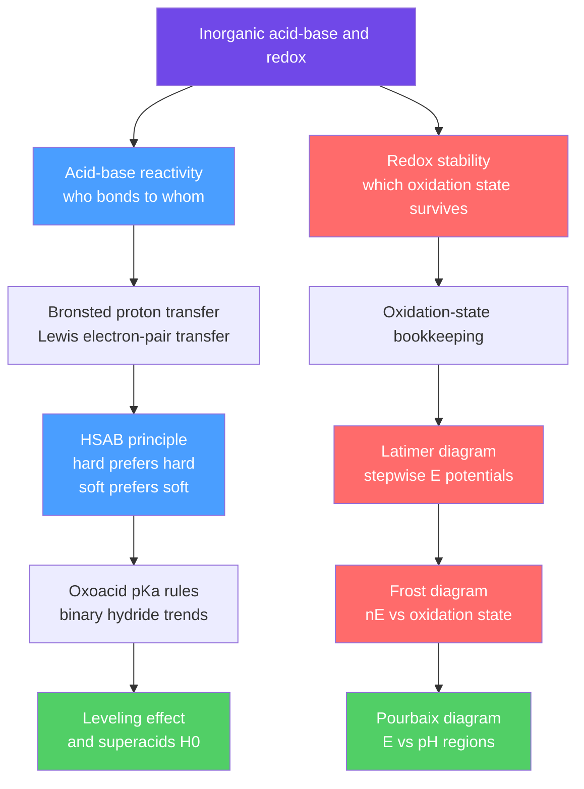

# ⚗️ Inorganic Acids, Bases and Redox

> [!abstract] TL;DR
> Beyond the introductory pH picture, inorganic acid–base behaviour is organised by the **Hard–Soft Acid–Base (HSAB) principle** — "hard prefers hard, soft prefers soft" — which predicts complex stability, mineral solubility, and biological metal binding from the polarizability of the partners. Acidity *trends* follow **Pauling's oxoacid rules** ($pK_{a1}\approx 8-5q$), binary-hydride patterns, and the **solvent leveling effect** that culminates in **superacids** measured on the Hammett $H_0$ scale. Redox stability is read off three diagrams: **Latimer** (stepwise $E^\circ$), **Frost** ($nE^\circ$ vs oxidation state — instantly showing disproportionation), and **Pourbaix** ($E$–pH — immunity, corrosion, passivation). At the graduate level HSAB maps onto frontier-orbital (ionic vs covalent) interactions and pe–pH geochemistry.

## Intuition — analogy FIRST

Think of chemical partners like people choosing dance partners at a formal ball versus a mosh pit. The **hard** crowd — small, tightly buttoned, high-charge cations like $\mathrm{Al^{3+}}$ and hard donors like $\mathrm{F^-}$ — pair up by *electrostatic attraction at arm's length*: opposite charges snap together, no messy electron sharing. The **soft** crowd — big, floppy, easily polarized species like $\mathrm{Ag^+}$ and $\mathrm{I^-}$ — bond by *getting tangled up*, sharing loosely held outer electrons in a covalent embrace. Mixing the two feels wrong: a hard cation and a soft anion make an awkward, unstable couple. That single "like-prefers-like" instinct predicts why silver loves sulfur but calcium loves oxygen.

Redox chemistry needs the opposite kind of intuition — a *map of altitudes*. Picture each oxidation state as a point on a hillside whose height is its free energy. A species perched on a bump wants to roll down both sides at once (disproportionate); one sitting in a valley is stable. Latimer, Frost, and Pourbaix diagrams are just different projections of that energy landscape.

---

## How It Works

Two independent questions — *"who bonds to whom?"* (acid–base) and *"which oxidation state survives?"* (redox) — organise almost all of descriptive inorganic chemistry. The map below shows the toolchain for each branch.



---

## Key Concepts / Details

### Secondary Level

**Two definitions, quick recap.** A **Brønsted acid** donates $\mathrm{H^+}$; a Brønsted base accepts it. A **Lewis acid** accepts an electron pair; a **Lewis base** donates one. Lewis is the broader lens — every Brønsted acid–base reaction is also a Lewis one, but reactions with no proton (e.g. $\mathrm{BF_3 + NH_3 \to F_3B{-}NH_3}$) are only Lewis.

**Oxidation-state bookkeeping.** Assign states so the electron accounting balances:
- Free element $=0$; monatomic ion $=$ its charge.
- $\mathrm{F}$ is always $-1$; $\mathrm{O}$ is usually $-2$ (but $-1$ in peroxides, $+2$ in $\mathrm{OF_2}$); $\mathrm{H}$ is $+1$ (but $-1$ in metal hydrides).
- The states in a species sum to its overall charge.

Oxidation is a *rise* in oxidation state (loss of electrons); reduction is a *fall* (gain). This bookkeeping is the entry ticket to every redox diagram below.

### Undergraduate Level

**HSAB classification (Pearson, 1963).** *Hard* species are small, weakly polarizable, and high charge density; *soft* species are large, polarizable, low charge density. The empirical rule: **hard acids bind hard bases (ionic, charge-controlled); soft acids bind soft bases (covalent, orbital-controlled).**

| Class | Acids (electron-pair acceptors) | Bases (electron-pair donors) |
|-------|----------------------------------|-------------------------------|
| **Hard** | $\mathrm{H^+,\ Li^+,\ Na^+,\ Mg^{2+},\ Al^{3+},\ Ti^{4+},\ Fe^{3+},\ BF_3}$ | $\mathrm{F^-,\ OH^-,\ O^{2-},\ H_2O,\ NH_3,\ NO_3^-,\ CO_3^{2-},\ PO_4^{3-}}$ |
| **Borderline** | $\mathrm{Fe^{2+},\ Co^{2+},\ Ni^{2+},\ Cu^{2+},\ Zn^{2+},\ Pb^{2+},\ SO_2}$ | $\mathrm{Br^-,\ NO_2^-,\ SO_3^{2-},\ N_3^-,\ pyridine,\ aniline}$ |
| **Soft** | $\mathrm{Cu^+,\ Ag^+,\ Au^+,\ Hg^{2+},\ Cd^{2+},\ Pd^{2+},\ Pt^{2+},\ BH_3}$ | $\mathrm{I^-,\ CN^-,\ CO,\ R_2S,\ RSH,\ R_3P,\ H^-,\ C_2H_4}$ |

*Predictive power.* Stability follows the diagonal matches: $\mathrm{AgI}$ (soft–soft) is essentially insoluble ($K_{sp}\sim10^{-17}$) while $\mathrm{AgF}$ (soft–hard) is freely soluble; $\mathrm{Al^{3+}}$ (hard) is found in nature as oxides/silicates, $\mathrm{Hg^{2+}}$ (soft) as sulfide ($\mathrm{HgS}$, cinnabar). Biological metals sort the same way: hard $\mathrm{Mg^{2+},\ Ca^{2+},\ Fe^{3+}}$ bind O-donor phosphates and carboxylates; soft $\mathrm{Cu^+,\ Hg^{2+},\ Cd^{2+}}$ bind S-donor cysteine thiols — the molecular basis of heavy-metal toxicity.

**Trends in Lewis acidity.** Acidity of the boron trihalides rises $\mathrm{BF_3 < BCl_3 < BBr_3 < BI_3}$ — *opposite* to the electronegativity order — because $\mathrm{F}$ lone-pair $\pi$-donation into the empty boron $2p$ orbital is strongest for the best size-matched halide, quenching $\mathrm{BF_3}$'s acceptor power the most.

**Oxoacid strength — Pauling's rules.** Write an oxoacid as $\mathrm{(HO)_pXO_q}$ where $q$ is the number of **terminal (non-OH) oxygens**. Then:

$$pK_{a1}\approx 8-5q,\qquad pK_{a(n+1)}\approx pK_{an}+5$$

| $q$ | Type | $pK_{a1}\approx 8-5q$ | Examples |
|-----|------|-----------------------|----------|
| 0 | $\mathrm{(HO)_pX}$ | $\approx 7$ (very weak) | $\mathrm{HOCl}\ (7.5),\ B(OH)_3,\ Si(OH)_4$ |
| 1 | $\mathrm{(HO)_pXO}$ | $\approx 2$–$3$ (weak) | $\mathrm{HNO_2}\ (3.3),\ H_3PO_4\ (2.1),\ HClO_2\ (2.0)$ |
| 2 | $\mathrm{(HO)_pXO_2}$ | $\approx -2$ (strong) | $\mathrm{HNO_3,\ H_2SO_4,\ HClO_3}$ |
| 3 | $\mathrm{(HO)_pXO_3}$ | $\approx -7$ (very strong) | $\mathrm{HClO_4,\ HMnO_4}$ |

More terminal oxygens delocalize the conjugate-base charge, stabilizing $\mathrm{A^-}$ and strengthening the acid.

**Binary-hydride acidity — two competing axes.**
- *Across a period* ($\mathrm{CH_4 < NH_3 < H_2O < HF}$): acidity rises with electronegativity of X, which stabilizes the conjugate base $\mathrm{X^-}$.
- *Down a group* ($\mathrm{HF < HCl < HBr < HI}$; $\mathrm{H_2O < H_2S < H_2Se}$): acidity rises because the $\mathrm{H{-}X}$ **bond enthalpy falls**, and that bond-strength effect dominates over electronegativity. Hence $\mathrm{HF}$ is a *weak* acid ($pK_a\ 3.2$) while $\mathrm{HI}$ is very strong ($pK_a\approx -10$).

**Solvent leveling & superacids.** Water cannot host any acid stronger than $\mathrm{H_3O^+}$ or any base stronger than $\mathrm{OH^-}$ — stronger species are fully deprotonated/protonated and appear equally strong (**leveling**). To rank $\mathrm{HCl,\ HBr,\ HI,\ HClO_4}$ you must use a weakly basic *differentiating* solvent such as glacial acetic acid. Beyond $100\%\ \mathrm{H_2SO_4}$ lies **superacid** territory, quantified by the **Hammett acidity function** using a weak indicator base B:

$$H_0 = pK_{\mathrm{BH^+}} - \log\frac{[\mathrm{BH^+}]}{[\mathrm{B}]}\qquad(\text{for dilute aqueous, } H_0\to \mathrm{pH})$$

| Acid | Formula | $H_0$ (approx) |
|------|---------|----------------|
| $100\%$ sulfuric (superacid threshold) | $\mathrm{H_2SO_4}$ | $-12$ |
| Triflic acid | $\mathrm{CF_3SO_3H}$ | $-14$ |
| Fluorosulfuric acid | $\mathrm{HSO_3F}$ | $-15$ |
| Magic acid | $\mathrm{HSO_3F\cdot SbF_5}$ | $\approx -19$ |
| Fluoroantimonic acid | $\mathrm{HF\cdot SbF_5}$ | $\le -20$ (est. to $\sim-28$) |

Superacids protonate species water never could — even alkanes and $\mathrm{CH_5^+}$ — the chemistry that won George Olah the 1994 Nobel Prize.

**Redox stability visualized.**
- **Latimer diagram** — species written left→right in *decreasing* oxidation state, each arrow labelled with the standard reduction potential $E^\circ$ (in V) of that couple. A species **disproportionates** when the potential on its **right** exceeds the potential on its **left**: $E^\circ_{\text{right}} > E^\circ_{\text{left}}$.
- **Frost (Ebsworth) diagram** — plot of $nE^\circ$ (relative free energy $-\Delta G^\circ/F$, in volt·electrons) versus oxidation state $N$; the element sits at the origin. The **slope** of the line joining two states equals the $E^\circ$ of that couple; the **lowest point** is the most stable state; a species lying **above** the line connecting its neighbours disproportionates (convex), while one **below** the line is stable and its neighbours **comproportionate** into it (concave).
- **Pourbaix (E–pH) diagram** — a phase map of the thermodynamically stable species over potential and pH. **Horizontal** boundaries are pure electron transfer; **vertical** boundaries are pure proton transfer; **sloped** boundaries are coupled $m\mathrm{H^+}/n\mathrm{e^-}$ with $\mathrm{d}E/\mathrm{d(pH)} = -0.0592\,(m/n)$ V. Regions read as **immunity** (metal stable), **corrosion** (soluble ions stable), and **passivation** (protective oxide film). The two dashed lines $E = 1.23 - 0.0592\,\mathrm{pH}$ and $E = -0.0592\,\mathrm{pH}$ bound the stability window of water itself.

### Graduate Level

**HSAB from frontier orbitals.** Perturbation theory (Klopman–Salem) splits a Lewis acid–base interaction energy into two terms:

$$\Delta E \;\approx\; \underbrace{-\,\frac{Q_A\,Q_B}{\varepsilon\,R_{AB}}}_{\text{charge-controlled (hard–hard)}}\;+\;\underbrace{\frac{2\,(c_A c_B \beta)^2}{E_{\mathrm{HOMO}}-E_{\mathrm{LUMO}}}}_{\text{orbital-controlled (soft–soft)}}$$

Hard–hard bonding is dominated by the electrostatic term (large charges, small $R$); soft–soft bonding by the frontier term, which blows up when the base HOMO and acid LUMO are close in energy (a *small gap = soft*). Conceptual DFT makes this quantitative: the **chemical potential** $\mu = (\partial E/\partial N)_v = -\chi$ and the **absolute hardness**

$$\eta = \tfrac{1}{2}\left(\frac{\partial^2 E}{\partial N^2}\right)_v \approx \frac{I-A}{2}\approx \frac{E_{\mathrm{LUMO}}-E_{\mathrm{HOMO}}}{2},\qquad S=\frac{1}{2\eta}$$

recover Pearson's hardness from ionization energy $I$ and electron affinity $A$ (Koopmans). The **principle of maximum hardness** and $\eta$-matching then rationalize "hard prefers hard" from first principles.

**pe–pH and geochemistry.** Environmental chemists replace potential with the dimensionless **electron activity** $\mathrm{pe} = -\log a_{e^-}$; at $25^\circ\mathrm{C}$, $\mathrm{pe} = E/0.0592 = 16.9\,E$. pe–pH diagrams for natural waters map the stable species of Fe, Mn, N, S, C, and U, driving models of acid-mine drainage (pyrite oxidation, $\mathrm{Fe^{2+}\!\to\!Fe^{3+}}$), aquifer redox zonation, and radionuclide mobility. Marcel Pourbaix's atlas is the corrosion engineer's counterpart: choosing a cathodic-protection potential means dragging a metal into its immunity region, while stainless steel relies on a passivating $\mathrm{Cr_2O_3}$ film whose stability window the diagram makes explicit. Both are equilibrium tools and must be read alongside [[Electrochemistry]] kinetics (overpotential, Tafel) to predict real rates.

```python
# Latimer diagram -> stepwise standard potentials.
# Encode each ARROW (a one-way reduction step) with electrons n and E deg (volts).
# From this we (1) build ANY non-adjacent couple's E via an n-weighted average
# of nE  (because dG = -nFE is additive) and (2) flag disproportionation.
from dataclasses import dataclass

@dataclass
class Step:
    hi: str    # higher oxidation-state species (left of arrow)
    lo: str    # lower  oxidation-state species (right of arrow)
    n:  int    # electrons transferred in this step
    E:  float  # standard REDUCTION potential of the couple, volts

# Oxygen in acid:  O2 --0.70--> H2O2 --1.76--> H2O   (both 2-electron steps)
latimer = [
    Step("O2",   "H2O2", 2, 0.70),
    Step("H2O2", "H2O",  2, 1.76),
]

def couple_potential(steps):
    """E deg for the overall couple spanning a chain of steps:
    n_tot * E_tot = sum(n_i * E_i)  ->  E_tot = sum(n_i E_i) / sum(n_i)."""
    return sum(s.n * s.E for s in steps) / sum(s.n for s in steps)

E_overall = couple_potential(latimer)          # non-adjacent couple  O2 -> H2O
print(f"E(O2/H2O)   = {E_overall:.3f} V   (literature 1.23 V)")

# Disproportionation test for each internal species B in  A --E_left--> B --E_right--> C
for i in range(1, len(latimer)):
    B, E_left, E_right = latimer[i-1].lo, latimer[i-1].E, latimer[i].E
    dE = E_right - E_left
    verdict = "DISPROPORTIONATES" if dE > 0 else "stable to disproportionation"
    print(f"{B:5s}: E_right - E_left = {dE:+.2f} V  ->  {verdict}")

# Output:
#   E(O2/H2O)   = 1.230 V   (literature 1.23 V)
#   H2O2 : E_right - E_left = +1.06 V  ->  DISPROPORTIONATES   (2 H2O2 -> 2 H2O + O2)
```

---

## Real-World Notes

- **Ore geochemistry (Goldschmidt classification).** HSAB explains why *lithophile* elements ($\mathrm{Al, Ca, Mg, Ti}$ — hard) occur as oxides/silicates while *chalcophile* elements ($\mathrm{Cu, Ag, Hg, Pb, Zn}$ — soft/borderline) concentrate as sulfides. Smelter chemistry and froth flotation are engineered around this soft-metal/soft-sulfur affinity.
- **Heavy-metal toxicity & chelation therapy.** Soft $\mathrm{Hg^{2+}, Cd^{2+}, Pb^{2+}}$ poison enzymes by binding soft cysteine-thiol sulfur; antidotes such as dimercaprol (BAL) and DMSA present soft thiolate donors to out-compete the target, while hard $\mathrm{EDTA}$ scavenges harder cations. Metallothioneins are Nature's cysteine-rich sponges for soft metals.
- **Corrosion engineering.** Iron Pourbaix diagrams guide pipeline cathodic protection (push into the immunity region) and explain stainless steel's passivating $\mathrm{Cr_2O_3}$ film; the diagram tells you the pH/potential window where the film survives versus dissolves.
- **Petrochemical superacids.** Olah's magic acid and solid superacids/zeolites protonate and rearrange alkanes for isomerization and catalytic cracking — the backbone of high-octane gasoline production.
- **Bleach, disinfection & rocketry.** Chlorine Latimer chemistry governs $\mathrm{Cl_2 + H_2O \rightleftharpoons HOCl + H^+ + Cl^-}$ disproportionation in water treatment; high-test $\mathrm{H_2O_2}$ is a monopropellant precisely because its Latimer diagram flags spontaneous disproportionation to $\mathrm{O_2 + H_2O}$.
- **Environmental redox modelling.** pe–pH diagrams predict nitrogen, sulfur, and iron speciation in soils, sediments, and aquifers — essential for acid-mine-drainage remediation and contaminant transport.

---

## Common Pitfalls

1. **Treating HSAB as a law, not a trend.** It is qualitative and thermodynamic; borderline cases abound, solvent and chelate effects intervene, and it says nothing about *rates*. Use it to rank, not to compute.
2. **Miscounting terminal oxygens.** Pauling's rule depends on $q$ = oxygens *not* bearing H, not the total oxygen or OH count. $\mathrm{H_3PO_4}$ ($q=1$) and $\mathrm{H_3PO_3}$ ($q=1$, but *diprotic* — one $\mathrm{P{-}H}$) and $\mathrm{H_3PO_2}$ (*monoprotic*) trip up students who count hydrogens instead.
3. **Mixing the two hydride-acidity axes.** Electronegativity governs the trend *across* a period, but $\mathrm{H{-}X}$ bond strength governs the trend *down* a group — which is why the more electronegative $\mathrm{HF}$ is a far weaker acid than $\mathrm{HI}$.
4. **Averaging potentials without weighting by $n$.** $E^\circ$ is intensive and does *not* add; only $\Delta G^\circ = -nFE^\circ$ (equivalently $nE^\circ$) is additive. Combine couples with the electron-weighted average, never a plain mean, whenever the steps transfer different numbers of electrons.
5. **Reading disproportionation backwards.** On a Latimer diagram a species disproportionates when $E^\circ_{\text{right}} > E^\circ_{\text{left}}$; on a Frost diagram when the point lies *above* the line joining its neighbours. And every diagram is pH-specific — acid and base versions differ.
6. **Forgetting Pourbaix is thermodynamics only.** The regions show what is *stable*, not how fast it forms; passivation can persist metastably and the boundaries shift with the assumed ion activity (often $10^{-6}\ \mathrm{M}$). Pair with kinetics before predicting corrosion.

---

## Related Concepts

- [[_MOC_Inorganic_Chemistry|↑ Section MOC]]
- [[Periodic_Trends_and_Main_Group_Chemistry]] — electronegativity, size, and charge density set who is hard vs soft
- [[Coordination_Chemistry_and_Ligand_Field_Theory]] — HSAB predicts which ligands bind which metals and the resulting complex stability
- [[Transition_Metals_and_the_d_Block]] — variable oxidation states are exactly what Latimer and Frost diagrams organise
- [[Solid_State_and_Crystal_Structures]] — hard–hard ionic vs soft–soft covalent bonding shapes lattice type and solubility
- [[Organometallic_and_Bioinorganic_Chemistry]] — soft metal centres, $\pi$-acid ligands (CO, phosphines), and thiol biometal binding are HSAB in action
- [[Acids_Bases_and_pH]] — the introductory Brønsted/$K_a$/buffer foundation this note extends
- [[Electrochemistry]] — supplies the Nernst equation and $\Delta G^\circ=-nFE^\circ$ behind every redox diagram
- [[Chemical_Equilibrium]] — $K_{sp}$ and stability constants that HSAB rationalizes qualitatively
- [[_MOC_Mathematics_Master]] (Math) — weighted averaging and linear algebra used to combine Latimer potentials

---

## Review Questions

1. **Secondary:** Assign the oxidation state of the central atom in $\mathrm{HClO_4}$, $\mathrm{H_2SO_3}$, and $\mathrm{KMnO_4}$. Then classify $\mathrm{Ag^+}$ and $\mathrm{F^-}$ as hard or soft, and predict which of $\mathrm{AgF}$ or $\mathrm{AgI}$ is the *less* soluble — justify with HSAB.
2. **Undergraduate:** (a) Use Pauling's rule to estimate $pK_{a1}$ of $\mathrm{HNO_3}$ versus $\mathrm{HNO_2}$ and explain the difference. (b) Given the copper Latimer diagram $\mathrm{Cu^{2+}}\!\xrightarrow{+0.153}\!\mathrm{Cu^+}\!\xrightarrow{+0.521}\!\mathrm{Cu}$, show by potentials that $\mathrm{Cu^+}$ disproportionates in water and compute $E^\circ(\mathrm{Cu^{2+}/Cu})$.
3. **Graduate:** (a) Starting from conceptual DFT, relate absolute hardness $\eta\approx(I-A)/2$ to the HOMO–LUMO gap and explain why hard–hard interactions are charge-controlled while soft–soft are orbital-controlled. (b) Derive the $-0.0592\,(m/n)$ V per pH-unit slope of a coupled $m\mathrm{H^+}/n\mathrm{e^-}$ boundary on a Pourbaix diagram from the Nernst equation.

---

## Sources

- Weller, Overton, Rourke & Armstrong — *Inorganic Chemistry* (Shriver & Atkins), 7th ed., Ch. 4 (acids & bases), Ch. 6 (redox, Latimer/Frost/Pourbaix)
- Housecroft & Sharpe — *Inorganic Chemistry*, 5th ed., Ch. 7–8
- Pearson, R. G. (1963) — "Hard and Soft Acids and Bases," *J. Am. Chem. Soc.* 85, 3533
- Parr & Pearson (1983) — "Absolute Hardness," *J. Am. Chem. Soc.* 105, 7512
- Pourbaix, M. — *Atlas of Electrochemical Equilibria in Aqueous Solutions* (NACE)
- Olah, Prakash & Sommer — *Superacids*, 2nd ed. (Wiley, 2009)

---

#chemistry #inorganic-chemistry #HSAB #oxoacids #superacids #Latimer #Frost #Pourbaix #redox #undergraduate #graduate
