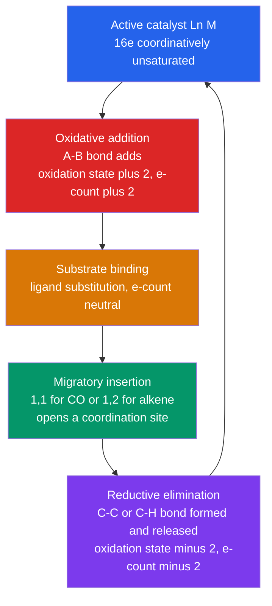

# 🧬 Organometallic and Bioinorganic Chemistry

> [!abstract] TL;DR
> **Organometallic chemistry** is the chemistry of the **metal–carbon bond**, and its central bookkeeping tool is the **18-electron rule**: a $d$-block metal tends toward stability when its valence shell holds 18 electrons (filling the nine $nd + (n{+}1)s + (n{+}1)p$ orbitals). A handful of **elementary steps** — ligand substitution, oxidative addition, reductive elimination, migratory insertion, and $\beta$-hydride elimination — assemble into the **catalytic cycles** that manufacture much of the modern world (hydrogenation, hydroformylation, acetic acid, olefin metathesis, cross-coupling, and polyolefins). **Bioinorganic chemistry** is the same coordination logic played out by **metalloproteins**: iron carries oxygen and shuttles electrons, zinc is a Lewis-acid catalyst, manganese splits water, molybdenum fixes nitrogen, and cobalt runs the only organometallic (Co–C) chemistry in the cell as vitamin B$_{12}$.

## Intuition — analogy FIRST

A transition-metal catalyst is a **molecular robot arm on an assembly line**. It has a fixed number of "hands" (coordination sites) and a preferred number of "tools in its belt" — **18 electrons**, the metal's version of the noble-gas octet. To do work it must first *drop a tool* (become 16-electron and coordinatively unsaturated), then **grab** a reactant, **rearrange** the pieces on its own frame, and finally **release** the finished product before picking up the next job. Each grab-rearrange-release motion is a named elementary step, and stringing them into a loop that regenerates the starting arm is a **catalytic cycle**.

Now hand that same robot arm to biology. Evolution discovered the identical trick billions of years ago: bury a metal ion in a protein, tune its coordination sphere with amino-acid "ligands," and you get an enzyme that binds O$_2$ reversibly, moves single electrons at breakneck speed, or breaks the toughest bond in the atmosphere (N$\equiv$N). **Bioinorganic chemistry is coordination chemistry wearing a protein.**

---

## How It Works



---

## Key Concepts / Details

### Secondary / Foundational Level

An **organometallic compound** has at least one direct **metal–carbon bond** (Grignards R–MgX, ferrocene, Ni(CO)$_4$). This distinguishes it from a plain **coordination compound**, where the metal binds only through N, O, S, or halide donors. The M–C bond runs a spectrum: **ionic** for the s-block (Na, K), **polar-covalent** for Li and Mg, and **covalent** with strong $\pi$-bonding for the transition metals.

Biology uses metals for jobs carbon and hydrogen cannot do: **iron** (blood is red because of it), **zinc**, **copper**, **magnesium** (the green in every leaf), **manganese**, **molybdenum**, and **cobalt**. A metal ion is a compact, reusable centre that can hold reactive groups, accept and donate electrons, and act as a Lewis acid — the reasons life is impossible without a periodic table's worth of trace metals.

### Undergraduate Level

**Ligand classes and electron donation.** Ligands are counted by how many electrons they give the metal. Two self-consistent schemes exist — the **neutral (covalent / radical)** method and the **ionic (donor-pair)** method — and *both always give the same total*.

| Ligand | Neutral (radical) | Ionic (donor pair) | Type | Character |
|--------|:---:|:---:|:---:|-----------|
| CO, PR$_3$, NH$_3$, $\eta^2$-alkene | 2 | 2 | L | $\sigma$-donor ($\pi$-acceptor for CO/PR$_3$) |
| H (hydride), alkyl R, halide X | 1 | 2 | X | $\sigma$-donor, 1-electron covalent |
| $\eta^3$-allyl | 3 | 4 | LX | mixed $\sigma/\pi$ |
| $\eta^5$-Cp (cyclopentadienyl) | 5 | 6 | L$_2$X | face-bound $\pi$ |
| $\eta^6$-arene (benzene) | 6 | 6 | L$_3$ | face-bound $\pi$ |
| M–M bond | 1 | — | — | one electron per metal |

Hapticity $\eta^n$ counts the contiguous carbons bonded to the metal (ferrocene is $\eta^5$; a $\sigma$-allyl is $\eta^1$).

**The 18-electron rule.** The nine valence orbitals ($5\,d + 1\,s + 3\,p$) hold at most 18 electrons; filling them mimics the next noble gas.

$$N_{\text{VE}} = \underbrace{(\text{group number})}_{\text{neutral metal}} + \sum(\text{neutral ligand donations}) - q_{\text{complex}}$$

*Worked example — ferrocene* Fe(Cp)$_2$:
- **Neutral:** Fe is group 8 $\Rightarrow 8$; two $\eta^5$-Cp $\Rightarrow 2\times 5 = 10$; total $= \mathbf{18}$.
- **Ionic:** Fe$^{2+}$ is $d^6 \Rightarrow 6$; two Cp$^-$ $\Rightarrow 2\times 6 = 12$; total $= \mathbf{18}$. Same answer.

**16-electron species** are the reactive exceptions: square-planar $d^8$ complexes of Rh(I), Ir(I), Pd(II), Pt(II) — e.g. **Wilkinson's catalyst** RhCl(PPh$_3$)$_3$ — are coordinatively unsaturated and are exactly the "open-handed" states that begin catalytic cycles.

**Elementary steps.** Every organometallic mechanism is built from five reversible moves:

| Step | $\Delta$(oxidation state) | $\Delta$(electron count) | $\Delta$(coord. number) |
|------|:---:|:---:|:---:|
| Ligand substitution (A or D) | 0 | 0 | 0 |
| Oxidative addition (OA) | $+2$ | $+2$ | $+2$ |
| Reductive elimination (RE) | $-2$ | $-2$ | $-2$ |
| Migratory insertion (1,1 or 1,2) | 0 | $-2$ | $-1$ |
| $\beta$-hydride elimination | 0 | $+2$ | $+1$ |

OA needs a low oxidation state and an open site; RE (its microscopic reverse) is favoured by high oxidation state and bulky ligands; **migratory insertion** is the C–C / C–H *bond-making* step where an alkyl *migrates* onto an adjacent CO (1,1) or alkene (1,2); $\beta$-H elimination is the reverse of 1,2-insertion and the usual chain-terminating and side-reaction pathway.

**Catalytic cycles** — the industrial payoff:

| Process | Catalyst | Transformation | Signature steps |
|---------|----------|----------------|-----------------|
| Hydrogenation | RhCl(PPh$_3$)$_3$ (Wilkinson) | alkene + H$_2 \to$ alkane | OA of H$_2$, 1,2-insertion, RE |
| Hydroformylation (oxo) | HCo(CO)$_4$ / HRh(CO)(PPh$_3$)$_3$ | alkene + CO + H$_2 \to$ aldehyde | 1,2-insertion, **1,1-CO insertion**, OA/RE |
| Acetic acid | [Rh(CO)$_2$I$_2$]$^-$ (Monsanto) / Ir (Cativa) | MeOH + CO $\to$ CH$_3$COOH | OA of MeI (rate-limiting), CO insertion, RE |
| Olefin metathesis | Ru=CHPh (Grubbs), Mo/W (Schrock) | redistribute C=C bonds | Chauvin [2+2] / retro-[2+2] via metallacyclobutane |
| Cross-coupling | Pd(0)/Pd(II) | Ar–X + R–[M or =] $\to$ Ar–R | OA; **transmetalation** (Suzuki) or **insertion + $\beta$-H** (Heck); RE |
| Polymerization | Cp$_2$ZrCl$_2$/MAO, TiCl$_4$/Et$_3$Al | alkene $\to$ polyolefin | repeated 1,2-insertion (Cossee–Arlman) |

**Bioinorganic — the same rules in protein.** The metal's coordination sphere is now built from His, Cys, Asp/Glu, Tyr and cofactors:

| Metal | Site / cofactor | Biological role |
|-------|-----------------|-----------------|
| Fe | heme (porphyrin), Fe–S clusters | O$_2$ transport (Hb/Mb), electron transfer, catalysis |
| Cu | type-1 "blue", type-2/3 | fast electron transfer (plastocyanin), O$_2$ reduction |
| Zn | 3-His + OH$^-$ | Lewis-acid catalysis (carbonic anhydrase), zinc fingers |
| Mg | chlorin ring | chlorophyll light harvesting, ATP and enzyme cofactor |
| Mn | Mn$_4$CaO$_5$ cluster | water oxidation in Photosystem II |
| Mo | FeMo-cofactor | N$_2$ fixation (nitrogenase) |
| Co | corrin ring | Co–C bond chemistry (vitamin B$_{12}$) |

*Oxygen transport.* **Myoglobin** (monomer) stores and **hemoglobin** (α$_2$β$_2$ tetramer) transports O$_2$ at a **Fe(II)–porphyrin** anchored by a proximal histidine (His F8); O$_2$ binds the open sixth site. Hemoglobin binds **cooperatively** — a sigmoidal curve with Hill coefficient $\sim 2.8$ — because O$_2$ binding pulls the Fe into the porphyrin plane, tugs the histidine, and flips the quaternary structure from the low-affinity **T** state to the high-affinity **R** state (MWC model). The **Bohr effect** (low pH / high CO$_2$) and 2,3-BPG stabilise T, releasing O$_2$ in tissues; **CO** binds $\sim$200× tighter than O$_2$, the basis of its toxicity.

*Electron transfer.* **Cytochromes** shuttle electrons through Fe(II)/Fe(III) heme; **iron–sulfur clusters** ([2Fe-2S], [4Fe-4S]) span a huge redox-potential range via Cys ligation; **blue copper** proteins (plastocyanin, azurin) cycle Cu(I)/Cu(II) with an intense LMCT band near 600 nm.

*Catalysis.* **Carbonic anhydrase** uses a 3-His Zn$^{2+}$ to lower the p$K_a$ of bound water to $\sim$7, generating a Zn–OH$^-$ nucleophile that hydrates CO$_2$ at $\sim 10^6\ \text{s}^{-1}$. **Catalase/peroxidase** decompose H$_2$O$_2$ via a high-valent Fe(IV)=O porphyrin cation radical (Compound I). **Cobalamin (vitamin B$_{12}$)** carries a genuine **Co–C bond** in a corrin ring — methylcobalamin transfers CH$_3$ (methionine synthase), and adenosylcobalamin undergoes **homolytic Co–C cleavage** to launch radical rearrangements (methylmalonyl-CoA mutase).

### Graduate Level

**The isolobal analogy** (Hoffmann, Nobel 1981) bridges organic and inorganic chemistry: two fragments are **isolobal** if the number, symmetry, approximate energy, and electron occupancy of their **frontier orbitals** match. Formally, a 17-electron $d$-block fragment behaves like a 7-electron main-group radical:

| Main-group fragment | Frontier electrons | Isolobal metal fragment |
|---------------------|:---:|--------------------------|
| $\cdot$CH$_3$ (methyl) | 7 (1 SOMO) | $d^7$ Mn(CO)$_5$ (17e) |
| :CH$_2$ (carbene) | 6 (2 orbitals) | $d^8$ Fe(CO)$_4$ (16e) |
| $\equiv$CH (methylidyne) | 5 (3 orbitals) | $d^9$ Co(CO)$_3$ (15e) |

Thus Co$_2$(CO)$_8$ is a cousin of ethane and H$_2$C=CH$_2$ maps onto (CO)$_4$Fe=Fe(CO)$_4$ — a predictive tool for cluster and organometallic structure.

**Selectivity is a coordination-sphere design problem.** *Regioselectivity:* in hydroformylation, bulky bidentate phosphines (BISBI, Xantphos) enforce **linear** (anti-Markovnikov) aldehyde by controlling which face of the 1,2-insertion is accessible. *Enantioselectivity:* chiral phosphines — Knowles' DIPAMP (L-DOPA synthesis) and Noyori's BINAP — bias the prochiral alkene face, earning the 2001 Nobel Prize. *Tacticity:* metallocene symmetry dictates polymer microstructure by Ewen's rules — $C_2$-symmetric ansa-metallocenes give **isotactic** polypropylene, $C_s$-symmetric ones give **syndiotactic**.

**Fast biological electron transfer** is rationalised by **Marcus theory**, $k_{ET} \propto \exp[-(\Delta G^\circ + \lambda)^2 / 4\lambda k_B T]$, where $\lambda$ is the reorganization energy. Blue copper proteins hold Cu in an **entatic (poised) state** — a distorted geometry intermediate between Cu(I) tetrahedral and Cu(II) square-planar — that minimises $\lambda$, so almost no nuclear rearrangement accompanies the redox change and $k_{ET}$ is large.

**Water oxidation and nitrogen fixation** are the hardest reactions life performs. The **Mn$_4$CaO$_5$** oxygen-evolving complex of Photosystem II cycles through five Kok $S$-states ($S_0 \to S_4$), storing four oxidising equivalents to split $2\,\text{H}_2\text{O} \to \text{O}_2 + 4\text{H}^+ + 4e^-$. **Nitrogenase** reduces the 945 kJ/mol N$\equiv$N triple bond at its Mo–Fe FeMo-cofactor (7 Fe, 9 S, Mo, an interstitial carbide, homocitrate), consuming 8 e$^-$, 8 H$^+$, and 16 ATP per N$_2$ — chemistry the industrial Haber–Bosch process can only match at 400 °C and 200 atm. Underlying all of this — colour, spin state (high-spin deoxy vs low-spin oxy heme), and redox tuning — is the $d$-orbital splitting of [[Coordination_Chemistry_and_Ligand_Field_Theory|ligand-field theory]].

```python
# 18-electron-rule calculator (neutral / covalent counting method).
#   N_VE = (metal group number) + sum(neutral ligand donations) - overall charge
# Neutral-method donations: CO=2, PR3=2, H=1, alkyl=1, halide=1,
#   eta2-alkene=2, eta3-allyl=3, eta5-Cp=5, eta6-arene=6, one M-M bond=1

LIGAND_DONATION = {
    "CO": 2, "PR3": 2, "PPh3": 2, "NH3": 2, "H2O": 2, "carbene": 2,
    "H": 1, "alkyl": 1, "R": 1, "Cl": 1, "Br": 1, "I": 1,
    "eta2-alkene": 2, "eta3-allyl": 3, "eta5-Cp": 5, "eta6-arene": 6,
    "M-M": 1,
}

def electron_count(group, ligands, charge=0):
    """Neutral-atom (covalent) valence-electron count for a d-block complex.

    group   : metal group number (Cr=6, Mn=7, Fe=8, Rh/Ir=9, Ni=10)
    ligands : list of (ligand_name, count) using neutral donation values
    charge  : overall charge of the complex (cation +, anion -)
    """
    total = group - charge                 # cation removes e-, anion adds e-
    for name, n in ligands:
        if name not in LIGAND_DONATION:
            raise KeyError(f"unknown ligand '{name}'")
        total += LIGAND_DONATION[name] * n
    return total

def classify(n):
    if n == 18:
        return "18e  -> coordinatively saturated, closed shell (stable)"
    if n == 16:
        return "16e  -> unsaturated, common square-planar d8 (reactive)"
    return f"{n}e  -> does not match the 18/16e closed-shell counts"

complexes = {
    "Ferrocene Fe(Cp)2":        (8,  [("eta5-Cp", 2)],                     0),
    "Ni(CO)4":                  (10, [("CO", 4)],                          0),
    "Cr(CO)6":                  (6,  [("CO", 6)],                          0),
    "Mn(CO)5 (in Mn2(CO)10)":   (7,  [("CO", 5), ("M-M", 1)],             0),
    "Wilkinson RhCl(PPh3)3":    (9,  [("Cl", 1), ("PPh3", 3)],            0),
    "Vaska IrCl(CO)(PPh3)2":    (9,  [("Cl", 1), ("CO", 1), ("PPh3", 2)], 0),
}

for name, (g, ligs, q) in complexes.items():
    n = electron_count(g, ligs, q)
    print(f"{name:26s}: {n:2d} e-  |  {classify(n)}")

# Expected: ferrocene, Ni(CO)4, Cr(CO)6, Mn(CO)5 -> 18e ;  Wilkinson, Vaska -> 16e
```

---

## Real-World Notes

- **The oxo process** (hydroformylation) is the largest-volume homogeneous catalytic reaction on Earth, making $>10$ million tonnes of aldehydes yearly for detergents and plasticisers — every step above (insertion, CO 1,1-insertion, OA/RE) runs in a reactor near you.
- **Cativa vs Monsanto acetic acid:** BP's iridium-based Cativa process displaced Monsanto's rhodium route because Ir gives faster oxidative addition of MeI, tolerates lower water, and suppresses the water-gas-shift side reaction — a textbook case of periodic-trend engineering (3rd-row vs 2nd-row metal).
- **Grubbs metathesis** (2005 Nobel with Chauvin and Schrock) turned C=C bond reshuffling into a bench-stable, air-tolerant reaction, now used for pharmaceuticals (ring-closing metathesis) and renewable polymers from seed oils.
- **Suzuki–Miyaura coupling** (2010 Nobel with Heck and Negishi) is the single most-used C–C bond-forming reaction in drug discovery because organoboron reagents are non-toxic and functional-group tolerant.
- **Carbon monoxide poisoning** is bioinorganic competition in action: CO out-binds O$_2$ at the heme iron of hemoglobin and, worse, blocks cytochrome c oxidase — treated with 100% or hyperbaric O$_2$ to shift the equilibrium back.
- **Chelation therapy** exploits HSAB matching: soft heavy metals (Hg, Pb, As, Cd) are pulled out by soft sulfur donors — dimercaprol (BAL), DMSA (succimer) — while EDTA sequesters Pb and deferoxamine/deferasirox clear iron overload; penicillamine treats Wilson's copper disease.

---

## Common Pitfalls

1. **Mixing the two counting methods.** Never combine neutral ligand values with an ionic metal $d$-count, or vice versa. Pick one scheme and stay in it; a cross-contaminated count is off by exactly the ligand charges.
2. **Assuming 18 electrons is mandatory.** The rule is a strong guideline, not a law. Early transition metals, lanthanides, and square-planar $d^8$ (16e) complexes routinely disobey it; those 16e species are precisely the catalytically active ones.
3. **Confusing migratory insertion with the metal "attacking."** In CO insertion the **alkyl migrates to CO**; the CO does not swing to the alkyl. This distinction is provable by isotopic and stereochemical labelling and predicts which coordination site opens up.
4. **Forgetting hapticity changes electron count.** An $\eta^5$-Cp (5e) can slip to $\eta^3$ (3e) or $\eta^1$ (1e) to open a coordination site — "ring slippage" is how many 18e Cp complexes still undergo substitution.
5. **Treating oxidation state and electron count as the same thing.** Oxidative addition changes both by $+2$, but ligand substitution changes the electron count by 0 while insertion changes it by $-2$ at *constant* oxidation state. Track them in separate columns.
6. **Calling every metalloprotein "organometallic."** Only species with a genuine **M–C** bond qualify — in biology that is essentially just **vitamin B$_{12}$** (and Ni–C intermediates in acetyl-CoA synthase). Hemoglobin's Fe–N and carbonic anhydrase's Zn–O are coordination, not organometallic, bonds.

---

## Related Concepts

- [[_MOC_Inorganic_Chemistry|↑ Section MOC]]
- [[Coordination_Chemistry_and_Ligand_Field_Theory]] — $d$-orbital splitting, spin state, and colour that underlie heme, blue copper, and every catalytic metal centre
- [[Transition_Metals_and_the_d_Block]] — the $d$-electron trends that make oxidative addition, back-bonding, and variable oxidation states possible
- [[Periodic_Trends_and_Main_Group_Chemistry]] — s/p-block organometallics (Grignards, organolithiums) and HSAB behaviour behind chelation therapy
- [[Solid_State_and_Crystal_Structures]] — heterogeneous Ziegler–Natta catalysts and metal-cluster bonding
- [[Inorganic_Acids_Bases_and_Redox]] — oxidation-state accounting and the redox couples driving biological electron transfer
- [[Protein_Structure_and_Function]] — Biochemistry: the fold that positions His/Cys ligands and enforces the entatic state
- [[Metabolism_and_Bioenergetics]] — Biochemistry: cytochromes and Fe–S clusters wired into the respiratory electron-transport chain
- [[Enzyme_Kinetics_and_Catalysis]] — Biochemistry: how metalloenzymes such as carbonic anhydrase reach diffusion-limited rates
- [[_MOC_Mathematics_Master]] — Mathematics: group theory and linear algebra behind orbital symmetry and the isolobal analogy

---

## Review Questions

1. **Secondary / Foundational**: What single structural feature distinguishes an *organometallic* compound from an ordinary coordination compound? Name three essential transition metals in biology and give one physiological role for each.
2. **Undergraduate**: Using the **neutral** counting method, show that Fe(CO)$_5$, Cr(CO)$_6$, and Ni(CO)$_4$ all obey the 18-electron rule, and that Wilkinson's catalyst RhCl(PPh$_3$)$_3$ is a 16-electron species. Then walk through the Wilkinson hydrogenation cycle, labelling each step as oxidative addition, substitution, migratory insertion, or reductive elimination, and explain why the 16e state is the catalytically active one.
3. **Graduate**: State the isolobal analogy and demonstrate that Fe(CO)$_4$ is isolobal with the carbene :CH$_2$. Separately, use the **entatic-state** concept and **Marcus theory** ($\lambda$, reorganization energy) to explain why blue copper proteins achieve much faster electron transfer than a typical aqueous Cu(I)/Cu(II) couple.

---

## Sources

- Crabtree — *The Organometallic Chemistry of the Transition Metals*, 7th ed.
- Hartwig — *Organotransition Metal Chemistry: From Bonding to Catalysis*
- Miessler, Fischer & Tarr — *Inorganic Chemistry*, 5th ed.
- Lippard & Berg — *Principles of Bioinorganic Chemistry*
- Bertini, Gray, Stiefel & Valentine — *Biological Inorganic Chemistry: Structure and Reactivity*
- Hoffmann, R. (1982) — "Building Bridges Between Inorganic and Organic Chemistry," Nobel Lecture, *Angew. Chem. Int. Ed.* 21, 711

---

#chemistry #inorganic-chemistry #organometallic #bioinorganic #18electronrule #catalysis #metalloenzymes #hemoglobin #nitrogenase #vitaminB12 #isolobal #undergraduate #graduate
