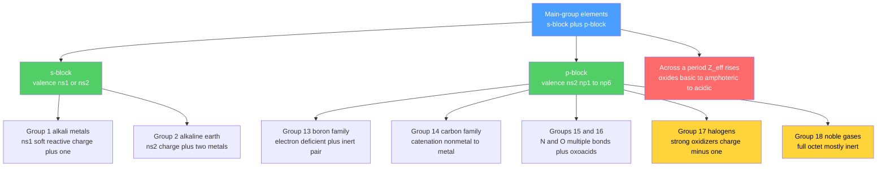

# 🧱 Periodic Trends and Main Group Chemistry

> [!abstract] TL;DR
> The **main-group elements** — the s-block (groups 1–2) and p-block (groups 13–18) — are where periodic trends translate most directly into chemistry. A handful of trends (atomic/ionic size, ionization energy $IE$, electronegativity $\chi$, and effective nuclear charge $Z_{eff}$) predict almost everything: why alkali metals explode in water while noble gases sit inert, why oxides shift from **basic to amphoteric to acidic** across a period, and why hydrogen refuses to be pinned to any one group. Deeper patterns — the **inert-pair effect**, **diagonal relationships** (Li–Mg, Be–Al, B–Si), and catenation — unify the descriptive facts. At the graduate level, **relativistic effects** on the heavy p-block and the **second-row anomaly** (why N, O, F behave unlike their heavier congeners) explain the exceptions the trends alone cannot.

## Intuition — analogy FIRST

Think of the main-group elements as a family portrait arranged by temperament. On the **far left** stand the alkali metals: they hold their single outer electron so loosely that they will hand it to almost anyone, reacting violently. On the **far right** sit the noble gases: their outer shell is full, so they want nothing and give nothing. Everyone in between trades electrons with a personality set by exactly two knobs — **how hard the nucleus pulls** ($Z_{eff}$) and **how far out the valence electrons live** ($n$).

Read left-to-right and the nuclear pull tightens: atoms shrink, cling harder to electrons, and their oxides turn from soap-like bases into acids. Read top-to-bottom and the valence shell moves outward: atoms swell, lose electrons more easily, and metallic character returns. Main-group chemistry is just following those two motions across the s- and p-blocks — and cataloguing the handful of places where they surprisingly break.

---

## How It Works



---

## Key Concepts / Details

### Secondary Level

**The trends that drive reactivity.** Four periodic properties do most of the explaining:

| Property | Across period → | Down group ↓ | Why it matters |
|----------|-----------------|--------------|----------------|
| Atomic/ionic radius | decreases | increases | reach and polarizability |
| Ionization energy $IE$ | increases | decreases | ease of forming cations (metals) |
| Electronegativity $\chi$ | increases | decreases | bond polarity, oxidizing power |
| $Z_{eff}$ | increases | ~constant | the common cause of the above |

**Hydrogen — the misfit.** Hydrogen ($1s^1$) is placed above group 1 because it has one valence electron, yet it is a diatomic **nonmetal**. It can lose an electron to form $H^+$ (like alkali metals), gain one to form the hydride $H^-$ (like halogens, being one electron short of helium's shell), or share it covalently. No single group fits — many tables float it separately.

**Group 1 — alkali metals ($ns^1$).** Soft, low-density metals that form +1 ions. Reactivity *increases* down the group as $IE$ falls: $2M + 2H_2O \to 2MOH + H_2$, gentle for Li but explosive for Cs. Because they tarnish and react with air and water, Na and K are stored under **mineral oil/kerosene**, while Rb and Cs are sealed in **argon-filled ampoules**. Signature **flame colors**: Li crimson, Na golden-yellow (589 nm), K lilac, Rb red-violet, Cs blue.

**Group 2 — alkaline earth metals ($ns^2$).** Harder, denser, less reactive than group 1; form +2 ions. Beryllium is anomalous (small, covalent, amphoteric oxide). Flame colors: Ca brick-red, Sr crimson, Ba apple-green; Mg burns with a blinding white light.

**Group 17 — halogens ($ns^2np^5$).** Reactive nonmetals forming −1 ions. **Oxidizing power decreases down the group** — $F_2$ is the strongest oxidizer of all elements, $I_2$ the weakest — so a halogen displaces any heavier halide from solution.

**Group 18 — noble gases ($ns^2np^6$).** Full valence shells make them nearly inert; used where inertness is the point (Ar welding shields, He cryogenics, neon lighting).

### Undergraduate Level

**Group 13 — electron deficiency and the inert-pair onset.** With only three valence electrons, **boron cannot complete an octet** by normal covalent bonding: $BF_3$ is a strong Lewis acid, and $B_2H_6$ (diborane) uses **3-centre-2-electron "banana" bonds** to bridge two borons with shared hydrogens. **Aluminium** is the workhorse metal: +3, with an **amphoteric oxide** $Al_2O_3$ that dissolves in both acid and base, protected by a passivating oxide film. Going down, the **inert-pair effect** appears — thallium prefers Tl(I) over Tl(III).

**Group 14 — catenation and the nonmetal→metal march.** Carbon's exceptional **catenation** (strong, nearly non-polar C–C bonds) underlies all of organic chemistry and its **allotropes**: diamond (sp³ insulator), graphite (sp² conductor), graphene, fullerenes, and nanotubes. Down the group, character shifts C (nonmetal) → Si, Ge (metalloid **semiconductors**) → Sn, Pb (metals). Tin itself has grey (covalent, α) and white (metallic, β) allotropes. The **inert-pair effect** stabilizes Pb(II) over Pb(IV), making $PbO_2$ a strong oxidizer.

**Group 15 — inert $N_2$ and the oxoacids.** The $N \equiv N$ triple bond ($\approx 945$ kJ/mol) makes $N_2$ kinetically and thermodynamically inert — the whole rationale for the energy-intensive Haber process to make **ammonia**. Nitrogen ranges over oxidation states −3 to +5; its oxoacids are **nitric $HNO_3$** (+5) and **nitrous $HNO_2$** (+3). Phosphorus (white $P_4$, red, black allotropes) gives the acid series whose **protic count equals the number of P–OH groups**:

| Acid | Formula | Oxidation state of P | Ionizable H |
|------|---------|----------------------|-------------|
| Phosphoric | $H_3PO_4$ | +5 | 3 |
| Phosphorous | $H_3PO_3$ | +3 | 2 (one direct P–H) |
| Hypophosphorous | $H_3PO_2$ | +1 | 1 (two direct P–H) |

**Group 16 — oxygen, ozone, sulfur.** Oxygen exists as $O_2$ and the allotrope **ozone $O_3$** (bent, a powerful oxidizer and the stratospheric UV shield). Sulfur's allotropes are crown-shaped $S_8$ rings (rhombic and monoclinic) plus chain-like plastic sulfur. Its oxoacids include **sulfuric $H_2SO_4$** (+6) and **sulfurous $H_2SO_3$** (+4).

**Group 18 — real noble-gas compounds.** Inert is not "impossible." Bartlett (1962) made $Xe^+[PtF_6]^-$, and xenon now has a real chemistry: fluorides $XeF_2, XeF_4, XeF_6$ and oxides $XeO_3$ (explosive), $XeO_4$, and $XeOF_4$. Krypton gives $KrF_2$; the lighter He/Ne/Ar remain essentially compound-free.

**Cross-cutting pattern 1 — acid–base character of oxides.** Across period 3:

$$\underbrace{Na_2O,\ MgO}_{\text{basic}} \to \underbrace{Al_2O_3}_{\text{amphoteric}} \to \underbrace{SiO_2,\ P_4O_{10},\ SO_3,\ Cl_2O_7}_{\text{acidic}}$$

Metals give basic oxides, nonmetals give acidic oxides, and the metalloid boundary is amphoteric; oxides also grow *more basic* down a group.

**Cross-cutting pattern 2 — diagonal relationships.** The first element of a group resembles the *second* element of the next group over: **Li–Mg** (both form nitrides and covalent-ish, thermally unstable carbonates), **Be–Al** (amphoteric oxides, covalent halides, passivation), **B–Si** (acidic oxides, flammable covalent hydrides, extended oxo-networks). The reason is a near-match in **charge density / ionic potential** $q/r$: moving down (bigger, same charge) cancels moving right (smaller, higher charge).

### Graduate Level

**The inert-pair effect, quantified.** Heavy p-block elements increasingly favor an oxidation state **two below** the group value (Tl$^{+}$, Pb$^{2+}$, Bi$^{3+}$). Two factors combine: (i) **poor shielding** by the intervening $d$ and $f$ electrons raises $Z_{eff}$ on the $ns^2$ pair, and (ii) **relativistic contraction** of the $6s$ orbital lowers its energy and increases its s-character, so the $6s^2$ pair is stabilized and reluctant to bond. The result is that $M–X$ bond energies no longer repay the promotion cost of using the $s$ pair.

**Catenation energetics.** Chain-forming ability tracks the single-bond enthalpy (kJ/mol):

$$E_{C-C} \approx 346 > E_{Si-Si} \approx 222 > E_{Ge-Ge} \approx 188 > E_{Sn-Sn} \approx 151$$

Carbon's strong, non-polar homonuclear bond (and its resistance to nucleophilic attack, lacking accessible $d$ orbitals) enables indefinite chains; heavier congeners catenate weakly and are cleaved by water and oxygen. Nitrogen, despite the strong $N \equiv N$, has a **weak N–N single bond** ($\approx 160$ kJ/mol), so it too resists catenation.

**The second-row anomaly.** N, O, F differ sharply from P, S, Cl for four connected reasons:

1. **No hypervalency.** With no energetically accessible $d$ orbitals and a small size, second-row atoms cap at four bonds ($NF_3$, not $NF_5$), whereas $PF_5$ and $SF_6$ form readily. (Modern bonding theory attributes such hypervalency to ionic/charge-shift contributions rather than literal $sp^3d^n$ hybridization.)
2. **The double-bond rule.** Compact $2p$ orbitals overlap sidewise efficiently, so second-row elements form strong $p\pi\text{–}p\pi$ multiple bonds — $N_2$, $O_2$, $C=O$. Diffuse $3p$ orbitals overlap poorly, so the heavier congeners avoid $\pi$ bonds and build **single-bonded networks** instead ($P_4$, $S_8$, silicates).
3. **Anomalously weak single bonds.** In small $N_2H_4$-, $H_2O_2$-, $F_2$-type bonds, lone-pair–lone-pair repulsion at short internuclear distances weakens N–N, O–O, and F–F — driving the high reactivity of fluorine and peroxides.
4. **Hydrogen bonding.** High $\chi$ and small size make N–H, O–H, F–H strongly hydrogen-bonding, giving the anomalous boiling points of $NH_3$, $H_2O$, and $HF$.

**Relativistic effects on the heavy p-block.** Beyond the inert-pair effect, relativity splits $6p$ into $6p_{1/2}$ and $6p_{3/2}$ (spin–orbit coupling), narrows band gaps, and helps make the heaviest main-group elements more metallic and their high oxidation states less accessible — the same physics family that colors gold and liquefies mercury.

```python
# Two clean main-group trends from hard-coded data, with anomalies flagged.
# (1) IE1 DOWN group 1  -> smooth fall drives rising alkali-metal reactivity
# (2) Electronegativity DOWN group 14 -> NOT monotonic: Ge and Pb bump up
import numpy as np
import matplotlib.pyplot as plt

# --- Group 1: first ionization energy (kJ/mol), CRC values ---
g1 = ["H", "Li", "Na", "K", "Rb", "Cs"]
ie1 = np.array([1312, 520, 496, 419, 403, 376])

# --- Group 14: Pauling electronegativity ---
g14 = ["C", "Si", "Ge", "Sn", "Pb"]
en14 = np.array([2.55, 1.90, 2.01, 1.96, 2.33])

fig, (ax1, ax2) = plt.subplots(1, 2, figsize=(12, 4.5))

ax1.plot(range(len(g1)), ie1, "-o", color="#4a9eff", lw=2, ms=6)
ax1.set_xticks(range(len(g1)))
ax1.set_xticklabels(g1)
ax1.set_ylabel("First ionization energy (kJ/mol)")
ax1.set_title("Group 1 down: IE1 falls -> reactivity rises")
ax1.grid(True, alpha=0.3)

ax2.plot(range(len(g14)), en14, "-o", color="#333", lw=2, ms=6)
# Highlight the anomalies vs a naive 'always decreases' expectation
for i in [2, 4]:  # Ge and Pb sit ABOVE the trend
    ax2.scatter(i, en14[i], s=120, color="#ff6b6b", zorder=5)
    ax2.annotate(g14[i], (i, en14[i]), textcoords="offset points",
                 xytext=(0, 8), ha="center", color="#ff6b6b")
ax2.set_xticks(range(len(g14)))
ax2.set_xticklabels(g14)
ax2.set_ylabel("Pauling electronegativity")
ax2.set_title("Group 14 down: EN not monotonic (d-block & relativistic bumps)")
ax2.grid(True, alpha=0.3)

plt.tight_layout()
plt.show()

# Ge > Si: 3d-block contraction raises Ge's Z_eff; Pb > Sn: relativistic 6s stabilization.
print("Group 14 EN:", dict(zip(g14, en14)))
```

---

## Real-World Notes

- **Haber–Bosch ammonia** — the industrial answer to inert $N_2$: high pressure, ~450 °C, and an iron catalyst to break the triple bond, feeding roughly half the nitrogen in the human food supply.
- **Silicon semiconductors** — group 14's intermediate band gap (neither metal nor insulator) is exactly what makes doped Si the substrate of the entire electronics industry; see [[Solid_State_and_Crystal_Structures]].
- **Amphoteric aluminium** — the passivating $Al_2O_3$ film (amphoteric, dissolving in strong acid *and* strong base) is why aluminium resists corrosion yet is etched in the Bayer process for alumina refining.
- **Ozone layer** — the $O_2 \rightleftharpoons O_3$ allotrope equilibrium in the stratosphere absorbs biologically damaging UV; halogen radicals (from CFCs) catalytically destroy it.
- **Contrast media and lighting** — barium sulfate's insolubility makes it a safe X-ray contrast agent despite Ba's toxicity, while group 18 gases power neon signs, argon-filled bulbs, and helium MRI cooling.
- **Xenon in medicine and propulsion** — real Xe chemistry aside, xenon gas is an anesthetic and an ion-thruster propellant, exploiting its high mass and inertness.

---

## Common Pitfalls

1. **Forcing hydrogen into one group** — H is genuinely ambiguous; treating it as "just another alkali metal" ignores that it also forms $H^-$ hydrides and is a covalent-bonding nonmetal.
2. **Assuming reactivity always rises down a group** — true for group 1 metals (falling $IE$) but *reversed* for group 17 oxidizers, whose oxidizing strength falls down the group ($F_2 \gg I_2$).
3. **Expecting the F–F bond to be the strongest halogen bond** — it is anomalously *weak* (lone-pair repulsion in the tiny $F_2$), which partly explains fluorine's ferocity even though its bond dissociation energy is low.
4. **Believing noble gases are truly inert** — Xe and Kr have real fluoride and oxide chemistry; "inert gas" is a historical misnomer, hence "noble."
5. **Invoking $d$-orbital hybridization for hypervalency** — $sp^3d$/$sp^3d^2$ pictures for $PCl_5$/$SF_6$ are outdated; the bonding is better described as ionic/charge-shift, and second-row atoms simply cannot expand their octet.
6. **Confusing oxidation-state stability with the inert-pair effect direction** — the effect stabilizes the *lower* (group − 2) state for *heavy* elements only; Al(III) is fine, but Tl(I) and Pb(II) dominate.

---

## Related Concepts

- [[_MOC_Inorganic_Chemistry|↑ Section MOC]]
- [[Periodic_Table_and_Periodic_Trends]] — the trend engine ($Z_{eff}$, radius, $IE$, $\chi$) that this note applies to descriptive chemistry
- [[Atomic_Structure_and_Subatomic_Particles]] — electron configuration fixes each element's block, group, and valence behavior
- [[Chemical_Bonding_and_Molecular_Geometry]] — electron deficiency, catenation, and hypervalency are bonding phenomena
- [[Transition_Metals_and_the_d_Block]] — the neighboring block whose contraction perturbs p-block trends (e.g., Ge)
- [[Coordination_Chemistry_and_Ligand_Field_Theory]] — main-group Lewis acids/bases set the stage for coordination
- [[Solid_State_and_Crystal_Structures]] — allotropes and semiconductors (C, Si, Sn) live here
- [[Inorganic_Acids_Bases_and_Redox]] — oxoacid strength and halogen redox trends developed further
- [[Organometallic_and_Bioinorganic_Chemistry]] — main-group organometallics (Grignards, boranes, silanes)
- [[Atomic_Models_and_Spectroscopy]] — Physics: flame colors and emission lines that fingerprint the s-block
- [[_MOC_Mathematics_Master]] — Math: regression fits used to model periodic trends

---

## Review Questions

1. **Secondary**: For each pair, state which is more reactive and why: (a) Li vs Cs toward water, (b) $F_2$ vs $I_2$ as an oxidizer. Then name the flame color of Na, K, and Ba.
2. **Undergraduate**: Explain, using bonding arguments, why $N_2$ is inert but $P_4$ is reactive, and why phosphorous acid $H_3PO_3$ is diprotic rather than triprotic despite having three hydrogens.
3. **Graduate**: The inert-pair effect and the second-row anomaly both stem from orbital energetics. Contrast their origins: which involves relativistic $6s$ stabilization, and which involves $2p$ overlap and the absence of accessible $d$ orbitals? Illustrate each with one reaction or structure.

---

## Sources

- Housecroft & Sharpe — *Inorganic Chemistry*, 4th ed. (main-group descriptive chemistry, diagonal relationships)
- Greenwood & Earnshaw — *Chemistry of the Elements*, 2nd ed. (the definitive main-group reference)
- Miessler, Fischer, Tarr — *Inorganic Chemistry*, 5th ed. (inert-pair effect, relativistic and second-row anomalies)
- Shriver & Atkins — *Inorganic Chemistry*, 6th ed. (periodicity, oxoacids, noble-gas compounds)
- Bartlett, N. (1962) — "Xenon Hexafluoroplatinate," *Proc. Chem. Soc.* 218
- Pyykkö, P. (1988) — "Relativistic Effects in Structural Chemistry," *Chem. Rev.* 88, 563

#chemistry #inorganic-chemistry #main-group #s-block #p-block #inert-pair-effect #diagonal-relationships #second-row-anomaly #oxoacids #noble-gases #secondary #undergraduate #graduate
