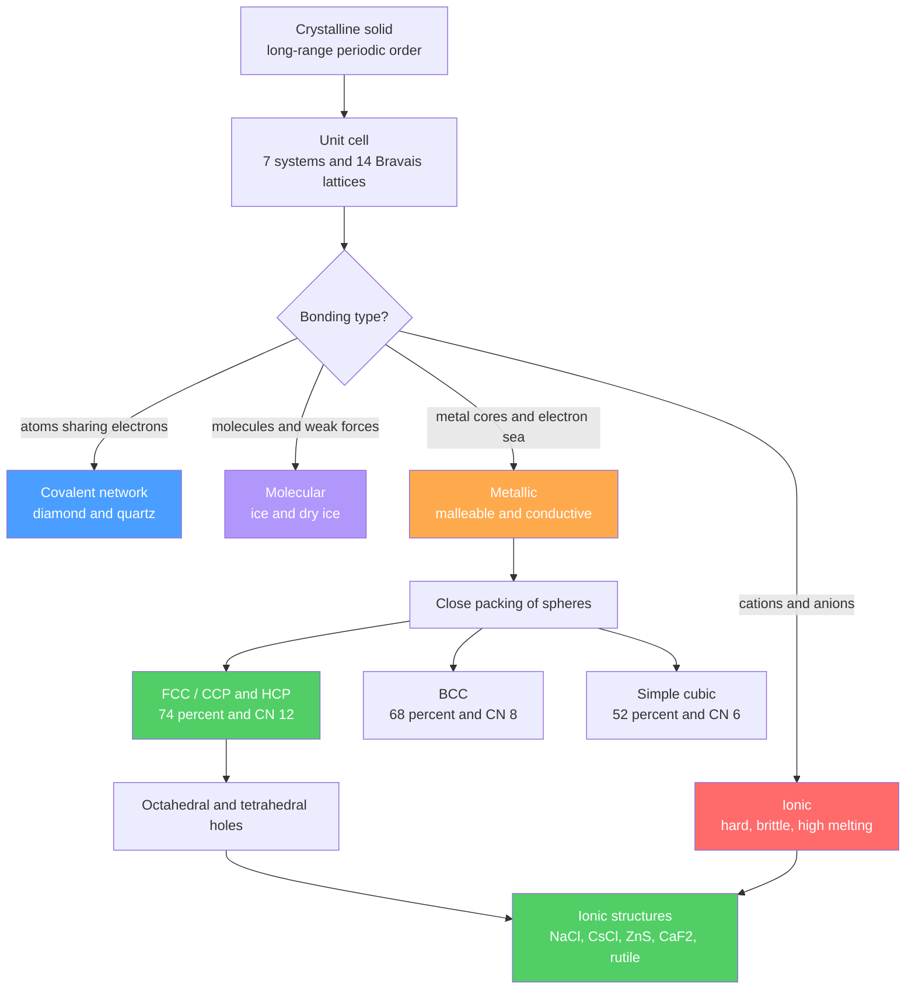

# 🔷 Solid State and Crystal Structures

> [!abstract] TL;DR
> A **crystalline solid** is a 3-D periodic repetition of a **unit cell**; the 7 crystal systems and 14 Bravais lattices catalog every way that repetition can happen. Solids sort into four bonding classes — **ionic, covalent-network, molecular, metallic** — that predict hardness, melting point, and conductivity. Metals adopt **close packing**: cubic close-packed / FCC and hexagonal close-packed / HCP both reach **74% packing with coordination number 12**, body-centred cubic gives 68% / CN 8, and simple cubic only 52% / CN 6. Close packing leaves **octahedral and tetrahedral holes** that cations fill to build ionic structures (rock salt, CsCl, zinc blende, fluorite, rutile), rationalized by the **radius-ratio rule**. **Lattice energy** is quantified by the **Born–Landé equation** and its **Madelung constant** (and measured via the **Born–Haber cycle**). **Point defects** (Schottky, Frenkel), non-stoichiometry, and **doping** control real-world properties, while **band theory** explains metals, semiconductors, and insulators. Structures are solved by **X-ray diffraction** through **Bragg's law**, $n\lambda = 2d\sin\theta$.

## Intuition — analogy FIRST

Walk up to a fruit stall and watch how oranges are stacked. Nobody stacks them in a loose grid with big gaps — they nestle each orange into the dimple made by the three below it, building the densest pile possible. That pile *is* close packing, and it fills exactly **74%** of space no matter how tall it grows. Whether the stacker repeats the layers as **ABAB** (hexagonal) or **ABCABC** (cubic) barely changes the density, but it changes the crystal.

Now imagine the oranges are big metal atoms and the little gaps between them are **holes**. Drop small marbles (cations) into those holes and you have built an ionic crystal — table salt is literally chloride "oranges" with sodium "marbles" in every octahedral gap. Almost all of solid-state chemistry is this one picture: pack big ions, then decide which holes to fill and how many.

---

## How It Works



---

## Key Concepts / Details

### Secondary Level

**Crystalline vs amorphous.** A **crystalline** solid has *long-range order*: the same motif repeats periodically, giving a sharp melting point, flat faces, anisotropic properties, and sharp X-ray peaks (quartz, salt, metals). An **amorphous** solid has only *short-range order*, softens over a temperature range (a glass transition), is isotropic, and scatters X-rays into diffuse halos (window glass, most plastics, rubber).

**Four classes of solid by bonding.**

| Solid | Particles | Held by | Typical properties | Examples |
|-------|-----------|---------|--------------------|----------|
| Ionic | cations + anions | electrostatic lattice | hard, brittle, high mp, insulator (conducts when molten/aqueous) | NaCl, MgO, CaF₂ |
| Covalent network | atoms | continuous covalent bonds | very hard, very high mp, insulator/semiconductor | diamond, SiO₂, SiC |
| Molecular | molecules | dispersion, dipole, H-bonds | soft, low mp, insulator | ice, dry ice (CO₂), I₂ |
| Metallic | cation cores + e⁻ sea | delocalized bonding | malleable, ductile, conductive, lustrous | Cu, Fe, Na |

**Unit cell and coordination number.** The **unit cell** is the smallest repeating box that, tiled in 3-D, reproduces the whole crystal. The **coordination number (CN)** is how many nearest neighbours touch a given atom — higher CN means denser packing.

### Undergraduate Level

**Seven crystal systems, fourteen Bravais lattices.** Every lattice belongs to one of 7 systems set by the cell edges $a,b,c$ and angles $\alpha,\beta,\gamma$; adding centring (primitive P, body I, face F, base C) gives the **14 Bravais lattices**:

| System | Constraints | Bravais types |
|--------|-------------|---------------|
| Cubic | $a=b=c$, all $90^\circ$ | P, I, F |
| Tetragonal | $a=b\neq c$, all $90^\circ$ | P, I |
| Orthorhombic | $a\neq b\neq c$, all $90^\circ$ | P, C, I, F |
| Hexagonal | $a=b\neq c$, $\gamma=120^\circ$ | P |
| Trigonal (rhombohedral) | $a=b=c$, $\alpha=\beta=\gamma\neq 90^\circ$ | R |
| Monoclinic | $a\neq b\neq c$, $\alpha=\gamma=90^\circ\neq\beta$ | P, C |
| Triclinic | all unequal | P |

**Metallic close packing.** Packing efficiency (atomic packing factor, APF) = (atoms per cell × sphere volume) / cell volume:

| Structure | Atoms/cell | Edge $a$ vs radius $r$ | APF | CN |
|-----------|-----------|------------------------|-----|----|
| Simple cubic (SC) | 1 | $a=2r$ | $\pi/6 = 52.4\%$ | 6 |
| Body-centred cubic (BCC) | 2 | $a=4r/\sqrt{3}$ | $\pi\sqrt{3}/8 = 68.0\%$ | 8 |
| Face-centred cubic (FCC/CCP) | 4 | $a=2\sqrt{2}\,r$ | $\pi/(3\sqrt{2}) = 74.05\%$ | 12 |
| Hexagonal close-packed (HCP) | 2 | $c/a=\sqrt{8/3}$ | $74.05\%$ | 12 |

FCC and HCP are both *closest* packings — they differ only in stacking sequence: **ABCABC** (FCC) vs **ABAB** (HCP).

**Holes in close packing.** A close-packed array of $N$ spheres contains exactly **$N$ octahedral holes** (radius ratio limit $r/R = 0.414$) and **$2N$ tetrahedral holes** ($r/R = 0.225$). Ionic solids are built by placing cations into some fraction of these holes.

**Ionic structures = big-anion packing + filled holes.**

| Structure | Anion array | Cations occupy | CN (cat:an) | Examples |
|-----------|-------------|----------------|-------------|----------|
| Rock salt (NaCl) | FCC (ccp) | all octahedral holes | 6:6 | NaCl, MgO, KBr |
| CsCl | simple cubic | cubic hole (cell centre) | 8:8 | CsCl, CsBr, NH₄Cl |
| Zinc blende (ZnS) | FCC (ccp) | half the tetrahedral holes | 4:4 | ZnS, GaAs, ZnSe |
| Fluorite (CaF₂) | FCC of cations | anions in all tetrahedral holes | 8:4 | CaF₂, UO₂, ZrO₂ |
| Rutile (TiO₂) | distorted hcp of O²⁻ | half the octahedral holes | 6:3 | TiO₂, SnO₂, MnO₂ |

> [!warning] CsCl is **not** body-centred cubic. The Cl⁻ ions sit on a *primitive* cubic lattice with a Cs⁺ ion in the centre — the two ions are different, so there is no centring symmetry. It is a simple cubic lattice with a two-atom basis.

**Radius-ratio rule.** The cation should be just large enough to touch its surrounding anions; this predicts CN from $\rho = r_+/r_-$:

| $r_+/r_-$ | CN | Geometry |
|-----------|----|-----------|
| 0.155–0.225 | 3 | trigonal |
| 0.225–0.414 | 4 | tetrahedral |
| 0.414–0.732 | 6 | octahedral |
| 0.732–1.000 | 8 | cubic |

*Limitations:* ionic radii are not hard spheres and depend on CN; the rule ignores covalency and polarizability, so it mispredicts many structures (e.g. LiI is 6:6 despite a ratio below 0.414). Treat it as a first guess, not a law.

**Lattice energy — Born–Landé equation.** The energy released assembling gaseous ions into the solid:

$$U = -\frac{N_A\, M\, z_+ z_-\, e^2}{4\pi\varepsilon_0 r_0}\left(1 - \frac{1}{n}\right)$$

where $M$ is the **Madelung constant** (a pure geometric sum over the lattice), $z_\pm$ the ion charges, $r_0$ the nearest cation–anion distance, and $n$ the **Born exponent** (5–12, from repulsion). Larger $|z_+z_-|$ and smaller $r_0$ ⇒ larger $|U|$ ⇒ higher melting point (MgO ≈ 3800 kJ/mol vs NaCl ≈ 787 kJ/mol).

| Structure | Madelung constant $M$ |
|-----------|-----------------------|
| Rock salt (NaCl) | 1.74756 |
| CsCl | 1.76267 |
| Zinc blende | 1.63806 |
| Fluorite (CaF₂) | 2.51939 |
| Rutile (TiO₂) | 2.408 |

**Born–Haber cycle.** Lattice energy cannot be measured directly, so Hess's law closes a thermochemical loop through measurable steps:

$$\Delta H^\circ_f = \Delta H_{\text{sub}} + \tfrac{1}{2}D + IE + EA + U$$

(sublimation, bond dissociation, ionization energy, electron affinity, lattice energy). Solving for $U$ gives an *experimental* lattice energy to check against Born–Landé.

**Point defects.** Real crystals are never perfect; defects raise entropy:
- **Schottky:** a cation *and* anion vacancy pair (keeps neutrality) — lowers density; common in high-CN ionic solids of similar ion size (NaCl, KCl).
- **Frenkel:** an ion (usually the small cation) hops to an interstitial site — density unchanged; common with large size mismatch (AgCl, AgBr, ZnS).
- **Non-stoichiometry:** e.g. wüstite is really Fe$_{1-x}$O, with some Fe²⁺ replaced by Fe³⁺ plus cation vacancies.
- **Doping (extrinsic):** aliovalent additions create controlled vacancies or carriers (SrCl₂ in NaCl makes cation vacancies; P or B in Si makes semiconductors).

**Band theory (electrical classification).** Overlapping atomic orbitals broaden into continuous **bands**. A partly filled band or overlapping bands ⇒ **metal**; a filled valence band separated by a gap $E_g$ from an empty conduction band ⇒ **insulator** (large $E_g$) or **semiconductor** (small $E_g$).

| Class | Band gap $E_g$ | Examples |
|-------|----------------|----------|
| Metal | none / overlapping | Cu, Na, Fe |
| Semiconductor | ~0.5–3 eV | Si (1.1), Ge (0.67), GaAs (1.42) |
| Insulator | > ~4 eV | diamond (5.5), SiO₂ (~9) |

**Intrinsic** semiconductors carry current by thermal excitation across the gap; **extrinsic** ones are doped: **n-type** (donor P in Si, extra electron, level just below the conduction band) or **p-type** (acceptor B in Si, hole, level just above the valence band).

**X-ray diffraction — Bragg's law.** Crystal planes spaced by $d$ reflect X-rays constructively when path differences are whole wavelengths:

$$n\lambda = 2d\sin\theta$$

For a cubic crystal the plane spacing is $d_{hkl} = a/\sqrt{h^2+k^2+l^2}$. Measuring the angles $\theta$ of the diffraction peaks yields the lattice parameter and, from peak *intensities*, the atomic positions. (Wave superposition is developed in [[Interference_and_Diffraction]].)

### Graduate Level

**Reciprocal lattice.** Diffraction is naturally described in the reciprocal lattice, with basis vectors $\mathbf{b}_i = 2\pi\,\dfrac{\mathbf{a}_j\times\mathbf{a}_k}{\mathbf{a}_i\cdot(\mathbf{a}_j\times\mathbf{a}_k)}$. The **Laue condition** for a diffraction peak is that the scattering vector equals a reciprocal-lattice vector, $\Delta\mathbf{k} = \mathbf{G}_{hkl}$ — an exact restatement of Bragg's law.

**Structure factor and systematic absences.** The amplitude scattered by plane $(hkl)$ is a sum over the atoms in the basis:

$$F_{hkl} = \sum_j f_j\, \exp\!\big[\,2\pi i\,(hx_j + ky_j + lz_j)\,\big], \qquad I_{hkl}\propto |F_{hkl}|^2$$

When $F_{hkl}=0$ the reflection vanishes — the origin of **selection rules**: BCC allows only $h+k+l=$ even; FCC only $h,k,l$ all-even or all-odd (unmixed). These *systematic absences* fingerprint the centring and the **space group** (one of 230), and screw axes / glide planes leave their own tell-tale absences.

**Symmetry and space groups.** A crystal's full symmetry is a space group = point-group operations + lattice translations. The same group-theory machinery that assigns molecular vibrations governs which reflections and phonon modes are allowed — the bridge to [[Molecular_Spectroscopy_and_Symmetry]].

**Statistical foundation of bands.** Carrier populations follow **Fermi–Dirac statistics**: the occupation of a state at energy $E$ is $f(E) = \big[\exp((E-\mu)/k_BT)+1\big]^{-1}$, and intrinsic carrier density scales as $n_i \propto \exp(-E_g/2k_BT)$. This connects solid-state chemistry directly to condensed-matter physics — see [[Quantum_Statistical_Mechanics]].

---

```python
import numpy as np

# ---- 1) Atomic packing factor (APF) for cubic metals ----
# APF = (atoms per cell * volume of one sphere) / (cell volume)
# The ratio a/r (cell edge over atomic radius) differs per structure.
def apf(atoms_per_cell, a_over_r):
    r = 1.0
    a = a_over_r * r
    sphere_vol = (4.0 / 3.0) * np.pi * r**3
    return atoms_per_cell * sphere_vol / a**3

structures = {
    "Simple cubic":       (1, 2.0),                  # a = 2r,        CN 6
    "Body-centred cubic": (2, 4.0 / np.sqrt(3)),     # a = 4r/sqrt(3), CN 8
    "Face-centred cubic": (4, 2.0 * np.sqrt(2)),     # a = 2*sqrt(2)*r, CN 12
}
for name, (z, aor) in structures.items():
    print(f"{name:20s}: APF = {apf(z, aor) * 100:5.1f} %")

# ---- 2) Bragg angles for FCC copper (a = 361.5 pm, Cu K-alpha) ----
lam = 154.06   # pm, Cu K-alpha X-ray wavelength
a   = 361.5    # pm, copper (FCC) lattice parameter
# FCC selection rule: h, k, l all even or all odd (unmixed)
reflections = [(1, 1, 1), (2, 0, 0), (2, 2, 0), (3, 1, 1), (2, 2, 2)]
print("\nhkl   d (pm)   2*theta (deg)")
for (h, k, l) in reflections:
    d = a / np.sqrt(h*h + k*k + l*l)     # cubic d-spacing
    sin_t = lam / (2.0 * d)              # first order, n = 1
    two_theta = 2.0 * np.degrees(np.arcsin(sin_t))
    print(f"{h}{k}{l}   {d:6.1f}   {two_theta:7.2f}")

# Expected: SC 52.4%, BCC 68.0%, FCC 74.0%; Cu peaks near 43.3, 50.4, 74.1, 89.9, 95.1 deg
```

---

## Real-World Notes

- **Steel and phase transitions.** Iron is BCC (ferrite) at room temperature but transforms to FCC (austenite) above ~912 °C; quenching this denser-packing switch, and trapping carbon in the interstitial holes, is the metallurgical basis of hardening steel.
- **Semiconductor industry.** Silicon crystallizes in the diamond (zinc-blende-type) structure; doping it p- and n-type to engineer junctions — pure band-theory chemistry — underlies every transistor and solar cell.
- **Ionic conductors and batteries.** Frenkel and Schottky vacancies let ions *move* through a solid; doped zirconia (ZrO₂ with vacancies) conducts O²⁻ in solid-oxide fuel cells, and lithium hops through defect sites in cathode lattices.
- **Structure determination.** X-ray diffraction via Bragg's law solved the double helix of DNA (Franklin's "Photo 51") and now routinely delivers protein structures — the workhorse of structural chemistry and biology.
- **Gemstones and colour centres.** Ruby is Al₂O₃ (corundum) doped with Cr³⁺ in octahedral holes; the dopant's ligand field, not the host lattice, produces the red colour — linking to [[Coordination_Chemistry_and_Ligand_Field_Theory]].
- **Piezoelectrics.** Non-centrosymmetric structures like quartz and perovskite (BaTiO₃) convert mechanical stress to voltage — used in oscillators, sensors, and ultrasound.

---

## Common Pitfalls

1. **Calling CsCl "body-centred cubic."** BCC is a *lattice* with identical atoms at corners and centre; CsCl has *different* ions, so it is a primitive cubic lattice with a two-atom basis (CN 8:8), not BCC.
2. **Confusing FCC with the "cubic" close packing count.** FCC has 4 atoms per cell (8 corners × 1/8 + 6 faces × 1/2), not 2; forgetting the face contributions gives the wrong density and APF.
3. **Trusting the radius-ratio rule blindly.** It ignores covalency and polarizability; LiI, AgI, and many oxides violate it. Use it to *rationalize*, never to *guarantee*, a structure.
4. **Sign and magnitude errors in lattice energy.** $U$ is negative (energy released) but often *reported* as a positive magnitude; also remember $z_+z_-$ carries the charge product, so a 2:2 salt (MgO) is roughly four times a 1:1 salt at similar $r_0$.
5. **Ignoring the Born exponent and multiple ion pairs.** The pure Coulomb form overestimates $|U|$; the $(1-1/n)$ repulsion term (typically ~10% reduction) and the Madelung sum over the whole lattice are both essential.
6. **Misreading systematic absences.** A missing reflection is information, not error — absent peaks reveal centring and symmetry (screw axes, glide planes). Assuming every $(hkl)$ should appear leads to the wrong space group.

---

## Related Concepts

- [[_MOC_Inorganic_Chemistry|↑ Section MOC]]
- [[Periodic_Trends_and_Main_Group_Chemistry]] — ionic radii and electronegativity set structure type and radius ratios
- [[Coordination_Chemistry_and_Ligand_Field_Theory]] — cations in octahedral/tetrahedral holes are coordination environments; ligand field explains colour and stability
- [[Transition_Metals_and_the_d_Block]] — d-metal oxides/alloys realize rutile, spinel, and close-packed metallic structures
- [[Inorganic_Acids_Bases_and_Redox]] — non-stoichiometry and doping change oxidation states within a lattice
- [[Organometallic_and_Bioinorganic_Chemistry]] — solid catalysts and metalloprotein cofactors sit in defined lattice/coordination sites
- [[Chemical_Bonding_and_Molecular_Geometry]] — the four bonding types extended from molecules to infinite periodic lattices
- [[Solutions_and_Concentration]] — lattice energy vs hydration energy decides whether an ionic solid dissolves
- [[Molecular_Spectroscopy_and_Symmetry]] — (Chem) point/space-group symmetry governs selection rules and systematic absences
- [[Interference_and_Diffraction]] — (Physics) the wave superposition behind Bragg's law and XRD
- [[Quantum_Statistical_Mechanics]] — (Physics) Fermi–Dirac statistics and band filling behind metals/semiconductors
- [[_MOC_Mathematics_Master]] — (Math) vectors, Fourier transforms, and group theory behind reciprocal lattices and structure factors

---

## Review Questions

1. **Secondary:** Classify diamond, dry ice (CO₂), sodium chloride, and copper by bonding type. For each, predict its relative melting point and whether it conducts electricity, and justify from the particles and forces involved.
2. **Undergraduate:** In the rock-salt structure, Cl⁻ ions form an FCC array and Na⁺ fill all octahedral holes. (a) How many formula units are in the unit cell? (b) Given $r_{\text{Na}^+}=102$ pm and $r_{\text{Cl}^-}=181$ pm, compute the radius ratio and predict the coordination number — does it match the observed 6:6? (c) Write the Born–Haber cycle for NaCl and identify which step gives the lattice energy.
3. **Graduate:** For a BCC metal, write the structure factor $F_{hkl}$ using basis atoms at $(0,0,0)$ and $(\tfrac12,\tfrac12,\tfrac12)$, and show it vanishes unless $h+k+l$ is even. Then explain, using the reciprocal lattice and Laue condition, why this "systematic absence" appears in the powder pattern.

---

## Sources

- Housecroft & Sharpe — *Inorganic Chemistry*, solid-state and lattice-energy chapters
- Miessler, Fischer & Tarr — *Inorganic Chemistry*, ionic solids and band theory
- West — *Solid State Chemistry and its Applications*
- Kittel — *Introduction to Solid State Physics* (crystal lattices, reciprocal lattice, band theory)
- Ashcroft & Mermin — *Solid State Physics* (structure factors, Bloch bands)
- Atkins & de Paula — *Physical Chemistry* (Born–Landé, Born–Haber, diffraction)

#chemistry #inorganicchemistry #solidstate #crystalstructure #closepacking #latticeenergy #bandtheory #XRD #braggslaw #undergraduate #graduate
