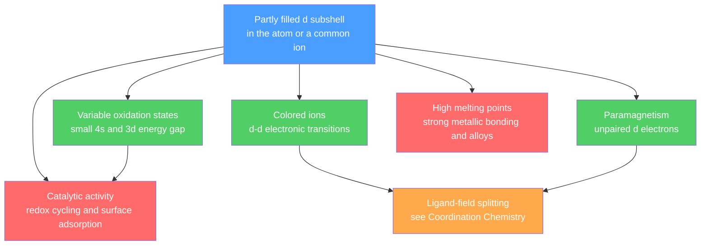

# ⚙️ Transition Metals and the d-Block

> [!abstract] TL;DR
> The d-block spans groups 3–12, where electrons progressively fill the $(n-1)d$ subshell. A *transition metal* is more strictly defined as an element that has, or whose common ions have, a partially filled d subshell — which is why scandium ($\text{Sc}^{3+}$, d$^0$) and zinc ($\text{Zn}^{2+}$, d$^{10}$) are edge cases. Because the 4s and 3d orbitals lie close in energy, these metals show **variable oxidation states**, **colored ions** and **paramagnetism** (d–d transitions and unpaired d electrons), potent **catalytic activity**, high melting points, and easy **alloy formation**. Below the main d-block sit the f-block lanthanides (dominant +3, lanthanide contraction) and actinides (many oxidation states, radioactivity). At the graduate level, the lanthanide contraction, relativistic effects, and stronger ligand fields explain why the 4d/5d metals differ sharply from their 3d cousins.

## Intuition — analogy FIRST

Think of the main-group elements as employees with a **fixed salary** — sodium always gives up exactly one electron, oxygen always wants two. The transition metals are freelancers with a **flexible rate**: because their 4s and 3d electrons cost almost the same energy to remove, they can offer +2, +3, +4, and more depending on who they are working with. That flexibility is the source of nearly everything distinctive about them. It lets iron cycle between $\text{Fe}^{2+}$ and $\text{Fe}^{3+}$ to shuttle electrons in your blood and in a Haber reactor; it lets partly filled d orbitals absorb visible light, so their salts are the pigments of stained glass, rust, and gemstones; and it lets unpaired d electrons respond to a magnet.

The one-line rule of thumb: **a partly filled d subshell is a reservoir of accessible electrons and accessible energy levels** — and chemistry is the art of exploiting exactly that.

---

## How It Works



---

## Key Concepts / Details

### Secondary Level

**What the d-block is.** Elements in which the highest-energy electrons enter a d subshell. The 3d series runs Sc → Zn:

$$\text{Sc: }[\text{Ar}]3d^1 4s^2 \quad\ldots\quad \text{Zn: }[\text{Ar}]3d^{10}4s^2$$

Two anomalies come from the extra stability of half-filled and filled d shells: **Cr = [Ar]3d$^5$4s$^1$** and **Cu = [Ar]3d$^{10}$4s$^1$**.

**Definition and edge cases.** IUPAC calls an element a transition metal if the atom, *or one of its common ions*, has a partially filled d subshell. Hence:
- **Sc** forms only $\text{Sc}^{3+}$ (d$^0$) → often excluded.
- **Zn** forms only $\text{Zn}^{2+}$ (d$^{10}$, full) → often excluded. Both are colorless and diamagnetic.

**Five characteristic properties** (and their causes, expanded below): variable oxidation states, colored compounds, paramagnetism, catalytic activity, and hardness with high melting points plus alloy formation.

| Property | 3d transition metals | Contrast: Group 1/2 metals |
|---|---|---|
| Oxidation states | Several (e.g. Mn: +2 to +7) | Single, fixed |
| Ion color | Usually colored | Colorless |
| Magnetism | Often paramagnetic | Diamagnetic |
| Melting point | High (Fe 1538 °C) | Low (Na 98 °C) |
| Catalysis | Widespread | Rare |

### Undergraduate Level

**Why variable oxidation states?** The 3d and 4s orbitals are almost degenerate, so successive electrons ionize with comparable energy. The **+2 state** (loss of the two 4s electrons) is nearly universal across the series. Higher states are stabilized *early* in the series, where the effective nuclear charge is still low enough to release d electrons; the maximum reaches **+7 at Mn** (as $\text{MnO}_4^-$). Past Mn, rising $Z_{\text{eff}}$ binds the d electrons tightly and the accessible maximum falls.

| Ion | Sc | Ti | V | Cr | Mn | Fe | Co | Ni | Cu | Zn |
|---|---|---|---|---|---|---|---|---|---|---|
| Common states | +3 | +2,+3,**+4** | +2,+3,+4,**+5** | +2,**+3**,+6 | **+2**,+4,+6,+7 | **+2,+3** | **+2**,+3 | **+2** | +1,**+2** | **+2** |

**Colored ions.** In an octahedral complex the five d orbitals split into $t_{2g}$ and $e_g$ sets separated by $\Delta_o$. A d electron absorbs a visible photon to jump $t_{2g}\!\to\!e_g$; the complementary color is transmitted. **d$^0$ (Sc$^{3+}$) and d$^{10}$ (Zn$^{2+}$) have no possible d–d transition and are colorless.** The size of $\Delta_o$ (hence the hue) depends on the ligand — see [[Coordination_Chemistry_and_Ligand_Field_Theory]].

**Paramagnetism.** Unpaired d electrons act as tiny magnets. The **spin-only magnetic moment** is

$$\mu_s = \sqrt{n(n+2)}\ \ \mu_B$$

where $n$ is the number of unpaired electrons and $\mu_B$ is the Bohr magneton. Mn$^{2+}$ (d$^5$, $n=5$) gives $\mu_s = \sqrt{35}\approx 5.92\,\mu_B$.

**Catalytic activity.** Two mechanisms, both rooted in the d electrons: (i) *redox cycling* between oxidation states forms and releases intermediates, and (ii) *surface adsorption* on d-orbital sites weakens reactant bonds. Landmark examples:
- **Fe** — Haber process, $\text{N}_2 + 3\text{H}_2 \rightleftharpoons 2\text{NH}_3$.
- **V$_2$O$_5$** — contact process, $2\text{SO}_2 + \text{O}_2 \to 2\text{SO}_3$ via V(V)/V(IV) cycling.
- **Pt / Pd / Rh** — catalytic converters and hydrogenation; **Ni** — margarine hardening.

**Electrode potentials and reactivity.** Standard potentials $E^\circ(\text{M}^{2+}/\text{M})$ trend from strongly negative (reactive) toward positive across the 3d series, with Cu the standout: $E^\circ(\text{Cu}^{2+}/\text{Cu}) = +0.34\text{ V}$, so copper does **not** displace $\text{H}_2$ from dilute acid. Mn and Zn buck the smooth trend (extra stability of the resulting d$^5$ and d$^{10}$ ions). See [[Electrochemistry]].

**Extractive metallurgy.** Reduction method tracks reactivity: carbon reduction in a blast furnace for Fe, more reactive metals need active-metal reduction or electrolysis. The **Ellingham diagram** plots $\Delta G^\circ$ of oxide formation versus temperature; a reductant reduces a metal oxide where its line lies *below* the oxide's. Because the $2\text{C}+\text{O}_2\to2\text{CO}$ line slopes *downward*, carbon becomes an ever stronger reductant at high temperature.

**Lanthanides and actinides (f-block).** Lanthanides are overwhelmingly **+3**; the buried, well-shielded 4f orbitals give **sharp f–f spectral lines** (exploited in phosphors and lasers) and drive the **lanthanide contraction** — a steady radius decrease from La to Lu because f electrons shield the nucleus poorly. Actinides show **many oxidation states** (U up to +6) and are **radioactive**.

### Graduate Level

**Consequence of the lanthanide contraction.** The 14 inserted f electrons shrink the later elements so much that the 5d metals end up nearly the same size as the 4d metals directly above them. Result: **Zr/Hf** (and Nb/Ta, Mo/W) have almost identical radii and chemistry, making them notoriously hard to separate.

**Relativistic effects.** In heavy atoms the 1s electrons move at an appreciable fraction of $c$; the relativistic mass increase contracts and stabilizes the 6s orbital. This explains:
- **Gold's color** — the contracted 6s lowers the 5d→6s gap into the visible, so Au absorbs blue and reflects yellow.
- **Mercury's liquidity** — a relativistically inert 6s$^2$ pair weakens metallic bonding, giving the lowest melting point of any metal ($-39$ °C).

**3d versus 4d/5d.** The heavier congeners have more radially extended d orbitals → **larger $\Delta_o$**, so they are almost always **low-spin**; they form **stronger metal–metal bonds** and rich **cluster chemistry** — e.g. the quadruple bond in $[\text{Re}_2\text{Cl}_8]^{2-}$ — and stabilize **higher oxidation states** more readily than the 3d series.

**Orbital contribution to magnetism.** The spin-only formula ignores orbital angular momentum. Ions with an orbitally degenerate ($T$) ground term (e.g. Co$^{2+}$, Fe$^{2+}$) show $\mu_{\text{eff}}$ above $\mu_s$; a fuller treatment uses the $L$–$S$ coupling of [[Angular_Momentum_and_Spin]], and the temperature dependence follows Curie-law paramagnetism from [[Quantum_Statistical_Mechanics]].

```python
import numpy as np
import matplotlib.pyplot as plt

# High-spin M(II) ions across the 3d series.
ions        = ["Sc", "Ti", "V", "Cr", "Mn", "Fe", "Co", "Ni", "Cu", "Zn"]
d_count     = [1, 2, 3, 4, 5, 6, 7, 8, 9, 10]   # d electrons in the M2+ ion
unpaired    = [1, 2, 3, 4, 5, 4, 3, 2, 1, 0]    # weak-field (high-spin) count

# Spin-only magnetic moment  mu = sqrt(n(n+2))  in Bohr magnetons
mu_spin_only = [np.sqrt(n * (n + 2)) for n in unpaired]

# Representative observed room-temperature moments (Bohr magnetons)
mu_observed = [None, 2.8, 3.8, 4.9, 5.9, 5.4, 4.8, 3.2, 1.9, 0.0]

x = np.arange(len(ions))
plt.figure(figsize=(8, 5))
plt.plot(x, mu_spin_only, "o-", lw=2, label="spin-only  sqrt(n(n+2))")
obs_x = [i for i, v in enumerate(mu_observed) if v is not None]
obs_y = [v for v in mu_observed if v is not None]
plt.plot(obs_x, obs_y, "s--", lw=2, label="observed (orbital contribution)")

plt.xticks(x, [f"{s}(II)" for s in ions])
plt.xlabel("3d M(II) ion")
plt.ylabel("magnetic moment / Bohr magnetons")
plt.title("Spin-only vs observed moments across the 3d series (high-spin)")
plt.legend()
plt.grid(True, alpha=0.3)
plt.tight_layout()

for i, n in enumerate(unpaired):
    print(f"{ions[i]:>2}(II): d{d_count[i]:<2} unpaired={n}  "
          f"mu_spin_only={mu_spin_only[i]:.2f} BM")
```

---

## Real-World Notes

- **Haber–Bosch ammonia** — a finely divided **Fe** catalyst (promoted with K$_2$O and Al$_2$O$_3$) adsorbs and dissociates N$_2$, fixing atmospheric nitrogen for the fertilizer that feeds roughly half of humanity.
- **Contact process** — **V$_2$O$_5$** cycles between V(V) and V(IV) to oxidize SO$_2$ to SO$_3$, the industrial route to sulfuric acid, the most-produced bulk chemical on Earth.
- **Catalytic converters** — **Pt/Pd/Rh** on a ceramic honeycomb oxidize CO and unburned hydrocarbons and reduce NO$_x$, using surface d-orbital adsorption sites.
- **Pigments and gemstones** — d–d transitions color the world: Cr(III) makes ruby red and emerald green, Co(II) the deep blue of cobalt glass, Fe/Ti charge transfer the blue of sapphire.
- **Steel and superalloys** — alloying Fe with Cr, Ni, V, Mo, and W exploits the transition metals' similar atomic sizes and strong metallic bonding to tune hardness, corrosion resistance, and high-temperature strength (jet-engine turbine blades).
- **Biology** — Fe in hemoglobin and cytochromes, Co in vitamin B$_{12}$, Cu in cytochrome c oxidase, Mn in photosystem II — all use accessible oxidation states for electron transfer and O$_2$ handling.

---

## Common Pitfalls

1. **"d-block" ≠ "transition metal."** All 3d elements are d-block, but the strict transition-metal label excludes Sc (only d$^0$ ions) and Zn (only d$^{10}$ ions). State which definition you are using.
2. **Wrong ground-state configuration for Cr and Cu.** They are 3d$^5$4s$^1$ and 3d$^{10}$4s$^1$, not 3d$^4$4s$^2$ / 3d$^9$4s$^2$ — half-filled and filled d shells are extra stable.
3. **Ionizing 3d before 4s.** Neutral atoms fill 4s first, but on ionization the **4s electrons leave first**: Fe$^{2+}$ is 3d$^6$ (not 3d$^4$4s$^2$). Forgetting this gives the wrong unpaired-electron count and magnetic moment.
4. **Assuming spin-only always works.** It is a good approximation for 3d ions with quenched orbital angular momentum, but Co(II) and low-symmetry or heavy-metal ions deviate strongly. Do not quote $\mu_s$ as if it were exact.
5. **Confusing color cause.** d–d transitions are only one source; intense colors like permanganate's purple (Mn is d$^0$ there) come from **ligand-to-metal charge transfer**, not d–d.
6. **Thinking higher oxidation state means more common.** The maximum state (Mn +7, Cr +6) exists but is strongly oxidizing; the **most stable** everyday state is usually +2 or +3.

---

## Related Concepts

- [[_MOC_Inorganic_Chemistry|↑ Section MOC]]
- [[Periodic_Trends_and_Main_Group_Chemistry]] — contrasts the multivalent d-block with the fixed-valence s/p block
- [[Coordination_Chemistry_and_Ligand_Field_Theory]] — d-orbital splitting ($\Delta_o$) that explains color and magnetism
- [[Solid_State_and_Crystal_Structures]] — metallic bonding, close packing, and alloy formation in these metals
- [[Inorganic_Acids_Bases_and_Redox]] — oxidation-state chemistry and oxoanions like MnO$_4^-$
- [[Organometallic_and_Bioinorganic_Chemistry]] — M–C bonds, homogeneous catalysis, and metalloenzymes
- [[Periodic_Table_and_Periodic_Trends]] — where the d- and f-blocks sit and why
- [[Atomic_Structure_and_Subatomic_Particles]] — electron configurations underlying every property here
- [[Electrochemistry]] — standard electrode potentials and reactivity trends
- [[Angular_Momentum_and_Spin]] — (Physics) spin and orbital angular momentum behind paramagnetism
- [[Quantum_Statistical_Mechanics]] — (Physics) Curie-law paramagnetism and level populations
- [[_MOC_Mathematics_Master]] — (Math) linear algebra and group theory behind orbital splitting

---

## Review Questions

1. **Secondary**: Write the ground-state electron configuration of chromium and of the Cr$^{3+}$ ion. Explain why Cr$^{3+}$ solutions are colored but Zn$^{2+}$ solutions are not.
2. **Undergraduate**: Iron commonly shows +2 and +3, while manganese reaches +7 but iron does not. Using effective nuclear charge and the 4s/3d energy gap, explain why the maximum oxidation state peaks at manganese and falls afterward. Then compute the spin-only magnetic moment of high-spin Fe$^{2+}$ (d$^6$).
3. **Graduate**: Zirconium and hafnium are chemically almost inseparable, and gold is yellow while silver is white. Explain both observations, one via the lanthanide contraction and the other via relativistic orbital contraction, and state one experimental consequence of each.

---

## Sources

- Housecroft & Sharpe — *Inorganic Chemistry*, 5th ed., Ch. 19–22 (d-block) and 24–25 (f-block)
- Miessler, Fischer & Tarr — *Inorganic Chemistry*, 5th ed., Ch. 10–11
- Shriver & Atkins — *Inorganic Chemistry*, 6th ed. (periodic and descriptive d-block chemistry)
- Pyykkö, P. (1988) — "Relativistic Effects in Structural Chemistry," *Chem. Rev.* 88, 563

#chemistry #inorganic-chemistry #transition-metals #d-block #oxidation-states #paramagnetism #catalysis #lanthanides #relativistic-effects #secondary #undergraduate #graduate
