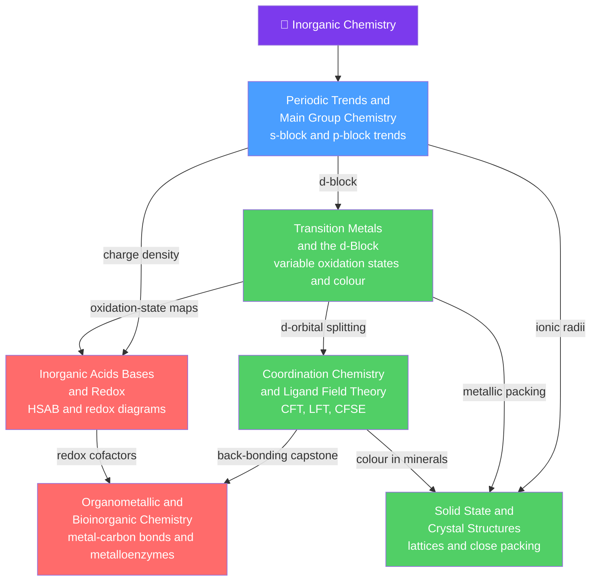

# 💎 Inorganic Chemistry — Map of Content

> [!abstract] What This Section Covers
> Inorganic chemistry is the chemistry of every element and every kind of bonding *beyond* the carbon skeletons of organic chemistry. This section starts from the periodic engine — atomic size, ionization energy, electronegativity, and effective nuclear charge — and follows it across the s- and p-blocks, into the d-block's variable oxidation states and colour, through the crystal-field and molecular-orbital theories that explain coordination complexes, into the packing rules and band theory of extended solids, across the acid–base (HSAB) and redox landscapes that organise reactivity, and finally to the organometallic catalysts and metalloenzymes where all of these ideas converge. Every note opens with an everyday analogy and deepens to graduate-level formalism, mechanisms, and research connections.

## Concept Map

*(Blue = fundamental entry point, green = core theory, red = advanced/capstone; arrows = "builds on" / "leads to".)*

---

## Learning Path

*Recommended order for a first pass through this section:*

1. [[Periodic_Trends_and_Main_Group_Chemistry]] — the trend engine ($Z_{eff}$, radius, $IE$, $\chi$) applied to descriptive s- and p-block chemistry; the foundation everything else rests on.
2. [[Transition_Metals_and_the_d_Block]] — why a partly filled d subshell gives variable oxidation states, colour, paramagnetism, and catalysis across the d- and f-blocks.
3. [[Coordination_Chemistry_and_Ligand_Field_Theory]] — Werner complexes, crystal-field splitting, high- vs low-spin, CFSE, and the molecular-orbital upgrade that explains colour and magnetism.
4. [[Solid_State_and_Crystal_Structures]] — unit cells, close packing and holes, ionic structure types, lattice energy, defects, and band theory of extended solids.
5. [[Inorganic_Acids_Bases_and_Redox]] — the HSAB principle, oxoacid-strength rules, superacids, and the Latimer / Frost / Pourbaix diagrams that map redox stability.
6. [[Organometallic_and_Bioinorganic_Chemistry]] — the metal–carbon bond, the 18-electron rule, catalytic cycles, and the metalloenzymes where coordination chemistry runs biology.

---

## All Notes at a Glance

| Note | Difficulty | What You'll Learn |
|------|------------|-------------------|
| [[Periodic_Trends_and_Main_Group_Chemistry]] | Secondary → Graduate | Periodic trends driving s/p-block reactivity, oxide acid–base character, the inert-pair effect, diagonal relationships, and the second-row anomaly |
| [[Transition_Metals_and_the_d_Block]] | Secondary → Graduate | Variable oxidation states, colored ions, paramagnetism, catalysis, lanthanide contraction, and relativistic effects in the heavy d-block |
| [[Coordination_Chemistry_and_Ligand_Field_Theory]] | Undergraduate → Graduate | Werner theory, crystal-field splitting into $t_{2g}/e_g$, high/low-spin and CFSE, the spectrochemical series, and LFT with Tanabe–Sugano diagrams |
| [[Solid_State_and_Crystal_Structures]] | Undergraduate → Graduate | Bravais lattices, close packing and holes, ionic structure types, Born–Landé/Born–Haber lattice energy, defects, band theory, and Bragg diffraction |
| [[Inorganic_Acids_Bases_and_Redox]] | Undergraduate → Graduate | HSAB and frontier-orbital hardness, Pauling oxoacid rules, superacids and the Hammett scale, and Latimer/Frost/Pourbaix redox diagrams |
| [[Organometallic_and_Bioinorganic_Chemistry]] | Undergraduate → Graduate | Metal–carbon bonding, the 18-electron rule, elementary steps and catalytic cycles, the isolobal analogy, and metalloenzymes (hemoglobin, nitrogenase, B₁₂) |

---

## Key Questions This Section Answers

- Why do oxides shift from basic to amphoteric to acidic across a period, and why does hydrogen refuse to fit any single group?
- Why are transition-metal salts colored while $\text{Sc}^{3+}$ and $\text{Zn}^{2+}$ are not, and how does the ligand set tune the hue?
- When is an octahedral complex high-spin versus low-spin, and how do you predict its magnetic moment from $\mu = \sqrt{n(n+2)}$?
- How does packing "oranges then filling the holes" generate rock salt, CsCl, zinc blende, fluorite, and rutile — and what sets a solid's melting point and conductivity?
- Why does silver love sulfur while calcium loves oxygen, and how do Latimer, Frost, and Pourbaix diagrams tell you which oxidation state survives?
- How does the 18-electron rule drive industrial catalytic cycles, and how does biology run the same coordination chemistry inside proteins?

---

## Related Sections

- [[_MOC_Chemistry_Master|↑ Chemistry Master MOC]]
- [[_MOC_General_Chemistry|→ General & Foundational Chemistry]] — atomic structure, the periodic table, and bonding that this section builds on
- [[_MOC_Physical_Chemistry|→ Physical Chemistry]] — quantum chemistry (d-orbitals), electrochemistry (redox potentials), and spectroscopy (selection rules) underpinning these notes
- [[_MOC_Biochemistry|→ Biochemistry]] — metalloproteins and enzyme active sites where bioinorganic chemistry meets the chemistry of life

#MOC #Chemistry #InorganicChemistry
