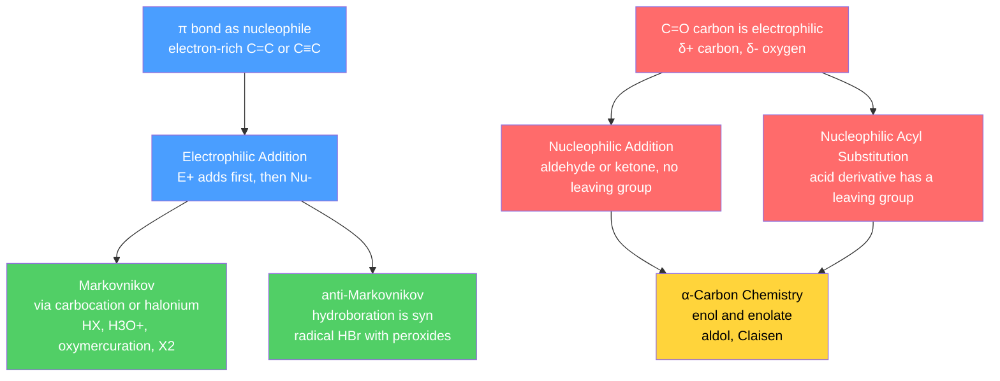

# ➕ Addition and Carbonyl Chemistry

> [!abstract] TL;DR
> Two reactivity families dominate half of organic chemistry. **π additions** exploit the electron-rich C=C / C≡C bond: an electrophile adds first (Markovnikov, carbocation-controlled) or a radical/borane inverts the outcome (anti-Markovnikov), and the *stereochemistry* — syn vs anti — is dictated by whether the intermediate is an open cation, a bridged halonium, or a concerted transition state. **Carbonyl chemistry** exploits the opposite polarity: the C=O carbon is δ⁺ and electrophilic, so nucleophiles add. Aldehydes/ketones give **1,2-addition** products (alcohols, acetals, imines, Wittig alkenes), acid derivatives undergo **nucleophilic acyl substitution** ranked acyl chloride > anhydride > ester > amide, and the acidic α-carbon fuels **enol/enolate** chemistry (aldol, Claisen). At the graduate level, 1,2- vs 1,4-conjugate addition is governed by hard/soft nucleophile control and facial selectivity by the Felkin–Anh model.

## Intuition — analogy FIRST

Think of a **magnet-and-iron-filing** picture. A C=C double bond is a loose puddle of electrons sitting above the two carbons — it is the *iron filing pile*, greedy to reach out and grab anything positive. So reactions of alkenes begin when an **electron-poor partner (the electrophile) reaches in first**, and the alkene wraps around it. A carbonyl group is the mirror image: oxygen has pulled the shared electrons onto itself, leaving the carbon starved and **exposed like a bare magnet pole**, so here it is the **electron-rich partner (the nucleophile) that strikes first**.

That single sign-flip — *alkene is the nucleophile, carbonyl carbon is the electrophile* — tells you which end of a molecule "goes first" in almost every reaction below. Regiochemistry (*which* carbon) then follows the stability of whatever intermediate forms, and stereochemistry (*which face*) follows its shape.

---

## How It Works



---

## Key Concepts / Details

### Undergraduate Level

**Electrophilic addition to alkenes.** The rate-determining step is the alkene attacking an electrophile. **Markovnikov's rule** states the electrophile (H⁺) bonds to the carbon with more hydrogens, so the *positive charge lands on the more substituted carbon* — the carbon that gives the more stable (more highly substituted, hyperconjugation/induction-stabilized) carbocation. Everything else is a variation on how that intermediate is trapped:

| Reagents | Net additions | Regiochemistry | Stereochemistry | Key intermediate |
|----------|---------------|----------------|-----------------|------------------|
| HX | H, X | Markovnikov | none (planar cation) | carbocation — **rearranges** |
| H₂O / H₃O⁺ (H₂SO₄) | H, OH | Markovnikov | none | carbocation — **rearranges** |
| Hg(OAc)₂ / H₂O; then NaBH₄ | H, OH | Markovnikov | — | mercurinium — **no rearrangement** |
| BH₃; then H₂O₂, NaOH | H, OH | **anti-Markovnikov** | **syn** | 4-membered concerted TS |
| X₂ (Br₂, Cl₂) | X, X | — | **anti** | bromonium / halonium |
| X₂ / H₂O | X, OH | OH to more subst. C | **anti** | halonium (halohydrin) |
| H₂, Pd/Pt/Ni | H, H | — | **syn** | adsorbed on metal surface |
| RCO₃H (mCPBA) | epoxide | — | **syn**, retains alkene geometry | concerted "butterfly" TS |
| O₃; then Zn or Me₂S | C=C cleaved to two C=O | — | — | molozonide → ozonide |
| HBr, ROOR (peroxides) | H, Br | **anti-Markovnikov** | none | carbon **radical** |

The two "hydration pairs" are the classic exam contrast. **Oxymercuration–demercuration** gives Markovnikov alcohols *without* the carbocation rearrangements that plague acid-catalyzed hydration, because the bridged mercurinium ion never lets a free cation form. **Hydroboration–oxidation** gives the opposite regiochemistry: boron (electron-poor, sterically the smaller partner) adds to the *less* hindered carbon, hydrogen to the more substituted one, in a single concerted syn step; oxidation then replaces B with OH with retention — a net **anti-Markovnikov, syn** hydration.

For radical HBr the Br· adds first to give the *more stable carbon radical* on the more substituted carbon, so Br ends up on the *less* substituted carbon — anti-Markovnikov. It works only for HBr (thermodynamics of the chain steps forbid HCl and HI).

**Alkynes** follow the same logic. Acid-catalyzed hydration (HgSO₄/H₂SO₄) gives a Markovnikov enol that tautomerizes to a **ketone**; hydroboration–oxidation gives the anti-Markovnikov enol that tautomerizes to an **aldehyde** (terminal alkynes).

**Nucleophilic addition to aldehydes and ketones.** The C=O carbon carries partial positive charge; a nucleophile adds to it and the oxygen becomes an alkoxide, then is protonated. **Aldehydes are more reactive than ketones** for two reasons: sterically they have one less bulky group crowding the incoming nucleophile, and electronically the second alkyl group of a ketone donates electron density that stabilizes (deactivates) the carbonyl.

| Nucleophile | Product | Note |
|-------------|---------|------|
| H₂O | gem-diol (hydrate) | equilibrium; favored by EWGs, disfavored by sterics |
| HCN | cyanohydrin | forms a new C–C bond |
| ROH (1 eq, H⁺) | hemiacetal | usually unstable, in equilibrium |
| ROH (2 eq, H⁺, −H₂O) | **acetal** | robust **protecting group** |
| 1° amine (RNH₂) | imine (Schiff base) | dehydration step; optimal pH ≈ 4.5 |
| 2° amine (R₂NH) | enamine | no N–H left, so eliminates to C=C |
| R₃P=CR′₂ (ylide) | alkene | **Wittig**; also gives Ph₃P=O |
| R–MgX / R–Li | alcohol | new C–C; 1°/2°/3° by substrate |
| H⁻ (NaBH₄ or LiAlH₄) | alcohol | reduction |

**Acetals** are the workhorse protecting group: made under acid catalysis, stable to base, nucleophiles, and hydrides, and cleanly removed by aqueous acid — so you "hide" a ketone as its cyclic 1,3-dioxolane while you do chemistry elsewhere. **Wittig olefination** places a C=C in a *known* position (no cation shifts): non-stabilized ylides favor the Z-alkene, stabilized ylides the E-alkene. **Grignard/organolithium** reagents are carbanion equivalents — formaldehyde → 1° alcohol, other aldehydes → 2°, ketones → 3°, and esters take *two* equivalents to give 3° alcohols. **Hydride selectivity** is the other must-know: NaBH₄ is mild (aldehydes and ketones only); LiAlH₄ is powerful (also esters, acids, amides, nitriles).

**Nucleophilic acyl substitution** at carboxylic-acid derivatives is *addition–elimination*: the nucleophile adds to give a tetrahedral intermediate, then a leaving group is expelled to regenerate the C=O.

$$\text{reactivity: } \underbrace{\text{RCOCl}}_{\text{acyl chloride}} > \underbrace{(\text{RCO})_2\text{O}}_{\text{anhydride}} > \underbrace{\text{RCO}_2\text{R}'}_{\text{ester}} \approx \text{RCO}_2\text{H} > \underbrace{\text{RCONR}_2}_{\text{amide}}$$

Two effects rank them, and they point the same way: **leaving-group ability** (Cl⁻ excellent, ⁻NR₂ terrible) and **resonance donation** from the attached atom into the carbonyl (nitrogen donates strongly and deactivates the amide; chlorine barely donates). Consequence: you can always go *down* the ladder (acyl chloride → ester → amide) but not up without special reagents. **Fischer esterification** (acid + alcohol, H⁺ catalyst) is an *equilibrium*, driven by excess reagent or water removal. **Saponification** (ester + NaOH) is effectively irreversible because the carboxylate product is deprotonated and unreactive.

**α-Carbon chemistry.** A hydrogen on the carbon *adjacent* to a carbonyl (pKₐ ≈ 17–20) is unusually acidic because its conjugate base — the **enolate** — is resonance-stabilized onto oxygen. In equilibrium with the keto form sits the nucleophilic **enol** (keto–enol tautomerism). Enols/enolates attack electrophiles at the α-carbon:

- **Aldol** — an enolate adds to another carbonyl → β-hydroxy carbonyl; heating dehydrates it to an α,β-unsaturated carbonyl (**aldol condensation**).
- **Claisen** — an ester enolate attacks a second ester, expelling alkoxide → **β-keto ester**. It needs a full equivalent of base because deprotonation of the acidic β-keto-ester product is what pulls the equilibrium forward.

### Graduate Level

**1,2- vs 1,4-addition (conjugate / Michael addition).** An α,β-unsaturated carbonyl (enone) is a *doubly* electrophilic system: nucleophiles can attack the carbonyl carbon (**1,2**) or the β-carbon (**1,4/conjugate**). Which one wins is a textbook case of **hard–soft (HSAB) control**:

| Nucleophile | Character | Preference | Rationale |
|-------------|-----------|------------|-----------|
| R–Li, LiAlH₄, R–MgX (mostly) | hard, charge-dense | **1,2** | charge-controlled, hits the more +δ carbonyl C |
| R₂CuLi (cuprates), enolates, RS⁻, CN⁻, amines | soft, polarizable | **1,4** | orbital-controlled, hits the softer β-carbon |

This is why **Gilman cuprates** are the reagent of choice for clean conjugate addition, while organolithiums attack the carbonyl directly. Kinetic vs thermodynamic control also matters: 1,2-addition is often faster (kinetic) but reversible, while 1,4-addition gives the more stable (thermodynamic) product.

**Facial selectivity — Felkin–Anh.** When the carbonyl already bears an adjacent stereocenter, the nucleophile does not approach along the C=O axis. It follows the **Bürgi–Dunitz trajectory** (≈ 107° to the C=O bond, aligned with the π* orbital). The **Felkin–Anh model** predicts the major diastereomer: the *largest* α-substituent orients perpendicular (anti-periplanar) to the forming bond to minimize torsional and steric strain, and the nucleophile attacks *anti* to that large group past the smallest substituent. With an α-heteroatom, its σ* (not just its size) takes the anti-periplanar slot (polar Felkin–Anh).

$$\text{Nu}^- \ \xrightarrow{\ \approx 107^\circ\ } \ \text{C=O} \quad \Rightarrow \quad \text{attack anti to the largest } \alpha\text{-group}$$

---

## Code Demo

```python
# Carbonyl hydration equilibrium:  R2C=O + H2O  <=>  R2C(OH)2
# K_hyd = [hydrate] / [carbonyl];  fraction hydrated = K / (1 + K)
# Trends illustrated: aldehydes hydrate far more than ketones (less steric
# crowding + fewer electron-donating alkyls), and electron-withdrawing groups
# make the carbonyl carbon more electrophilic -> hydration blows up.

carbonyls = {
    "Acetone       (CH3)2C=O":      1.4e-3,
    "Acetaldehyde  CH3CHO":         1.0,
    "Formaldehyde  H2C=O":          2.0e3,
    "Chloral       CCl3CHO":        2.8e4,
    "Hexafluoroacetone (CF3)2C=O":  1.2e6,
}

print(f"{'Carbonyl':<30}{'K_hyd':>10}{'% hydrate':>12}")
print("-" * 52)
for name, K in sorted(carbonyls.items(), key=lambda kv: kv[1]):
    frac = 100 * K / (1 + K)
    print(f"{name:<30}{K:>10.3g}{frac:>11.3f}%")

# Takeaways printed by the ranking:
#   acetone barely hydrates (~0.14%) -> ketone + electron-donating methyls
#   formaldehyde is essentially fully hydrated -> most electrophilic simple C=O
#   chloral/hexafluoroacetone are locked as hydrates (chloral hydrate is a solid)
```

---

## Real-World Notes

- **Chloral hydrate** — the Python demo's CCl₃CHO is so electrophilic (three inductive chlorines) that its hydrate is an isolable crystalline solid, historically used as a sedative ("knockout drops"). A textbook proof that electronics control the hydration equilibrium.
- **Sugars are cyclic hemiacetals** — glucose exists mostly as a six-membered ring formed by intramolecular addition of its C5 –OH to the C1 aldehyde; glycosidic bonds joining sugars are acetals. See [[Biomolecules_Overview]].
- **Wittig at industrial scale** — BASF manufactures vitamin A (retinol) using a Wittig olefination to build the polyene chain with defined geometry, exactly because the reaction fixes the C=C position without rearrangement.
- **Hydroboration–oxidation** (H. C. Brown, Nobel 1979) is the standard way to make anti-Markovnikov alcohols and remains a staple of process chemistry for regio- and stereocontrolled hydration.
- **Aldol / Claisen in biology** — the aldol reaction (aldolase enzymes in glycolysis) and the Claisen condensation (fatty-acid synthase) are how cells build and break C–C bonds; malonyl-CoA chemistry is a Claisen at heart.
- **Reductive amination** (imine formation then hydride reduction) is one of the most-used C–N bond constructions in pharmaceutical synthesis for making secondary and tertiary amines.

---

## Common Pitfalls

1. **Forgetting carbocation rearrangements** — HX and acid hydration proceed through free cations that undergo hydride/methyl shifts to a more stable cation, scrambling the product. Oxymercuration and hydroboration do *not* rearrange because no open cation forms.
2. **Confusing regiochemistry with stereochemistry** — Markovnikov/anti-Markovnikov answers *which carbon*; syn/anti answers *which face*. Hydroboration is anti-Markovnikov *and* syn — two independent facts, both required.
3. **Assuming halogen addition is a mix** — Br₂/Cl₂ add **stereospecifically anti** via the bridged halonium ion, so a *cis*-alkene gives a specific (usually threo/anti) dihalide. Only carbocation routes lose stereochemistry.
4. **Mismatching the hydride to the substrate** — reaching for NaBH₄ to reduce an ester or carboxylic acid (it won't; you need LiAlH₄), or using LiAlH₄ where NaBH₄'s selectivity was needed to leave an ester untouched.
5. **Running acyl substitution "uphill"** — you cannot make an acyl chloride from an amide by adding Cl⁻; conversions only run toward the *less* reactive derivative. Activate the acid first (SOCl₂, coupling agent).
6. **Skipping the enolate equivalents in Claisen** — because the product β-keto ester's α-H is more acidic than the starting ester, a full stoichiometric equivalent of base is consumed to trap it; catalytic base gives poor yields.

---

## Related Concepts

- [[_MOC_Organic_Chemistry|↑ Section MOC]]
- [[Reaction_Mechanisms_and_Arrow_Pushing]] — the curved-arrow language and intermediate types (cations, radicals, tetrahedral intermediates) underlying every reaction here
- [[Structure_Bonding_and_Functional_Groups]] — why π bonds are nucleophilic and C=O is electrophilic, from hybridization and electronegativity
- [[Stereochemistry_and_Chirality]] — syn/anti addition, diastereoselectivity, and the Felkin–Anh model in depth
- [[Nucleophilic_Substitution_and_Elimination]] — the same nucleophile/electrophile logic applied at sp³ carbon (SN1/SN2/E1/E2)
- [[Aromaticity_and_Electrophilic_Aromatic_Substitution]] — contrast: aromatic rings *substitute* rather than add, to preserve aromaticity
- [[Pericyclic_Radical_and_Polymer_Chemistry]] — concerted additions (epoxidation, ozonolysis) and radical HBr connect to pericyclic and chain chemistry
- [[Biomolecules_Overview]] — sugars as hemiacetals, aldol/Claisen in metabolism
- [[NMR_Spectroscopy]] — how you actually *tell* Markovnikov from anti-Markovnikov, or an aldehyde from a ketone, in the lab
- [[_MOC_Mathematics_Master]] — the equilibrium and kinetics quantifying these reactions rest on the same calculus and differential-equation tools

---

## Review Questions

1. **Undergraduate**: Predict the major product, including regiochemistry *and* stereochemistry, when 1-methylcyclohexene reacts with (a) HBr, (b) BH₃ then H₂O₂/NaOH, (c) Br₂, (d) Hg(OAc)₂/H₂O then NaBH₄. Explain how (a) and (d) can differ even though both are Markovnikov.
2. **Undergraduate**: Rank acetyl chloride, acetic anhydride, ethyl acetate, and acetamide by reactivity toward nucleophilic acyl substitution, and justify the order using *both* leaving-group ability and resonance donation. Why can you not prepare an acyl chloride from an amide directly?
3. **Graduate**: Cyclohexenone is treated with (a) CH₃Li and (b) (CH₃)₂CuLi. Predict the 1,2- vs 1,4-selectivity of each and explain it with hard/soft acid–base theory. Then, for addition of a hydride to 2-phenylpropanal, use the Felkin–Anh model to predict the major diastereomer and sketch the reactive conformation.

---

## Sources

- Clayden, Greeves & Warren — *Organic Chemistry*, 2nd ed. (additions, carbonyls, conjugate addition, Felkin–Anh)
- Carey & Sundberg — *Advanced Organic Chemistry, Part A: Structure and Mechanisms*
- Anslyn & Dougherty — *Modern Physical Organic Chemistry* (HSAB, Bürgi–Dunitz trajectory)
- Bürgi, Dunitz & Shefter (1973) — *J. Am. Chem. Soc.* 95, 5065 (nucleophilic attack trajectory on C=O)

#chemistry #organic-chemistry #addition #carbonyl #markovnikov #aldol #michael-addition #undergraduate #graduate
