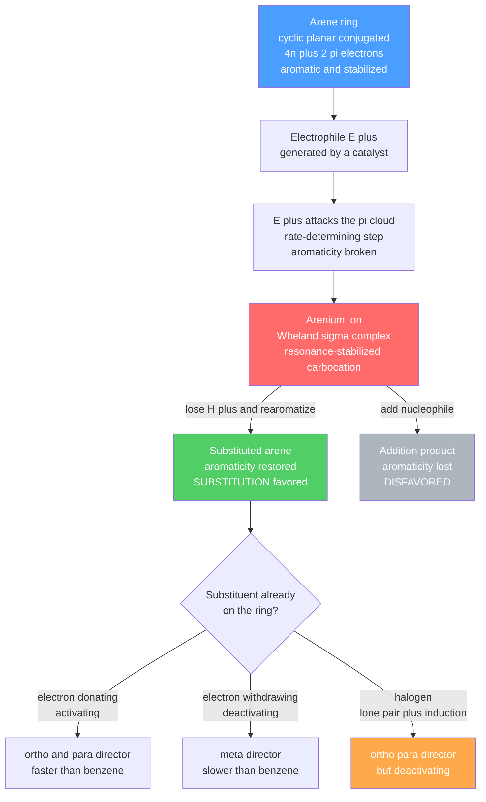

# 🔯 Aromaticity and Electrophilic Aromatic Substitution

> [!abstract] TL;DR
> **Aromaticity** is an extra-large stabilization enjoyed by rings that are **cyclic, planar, fully conjugated, and hold $4n+2$ $\pi$ electrons** (Hückel's rule). Its origin is molecular-orbital: those electron counts exactly fill a set of **bonding $\pi$ MOs** (the **Frost circle** mnemonic makes this visual), giving benzene a **resonance/aromatic stabilization energy of $\approx 150$ kJ/mol** measured from hydrogenation enthalpies. Rings with $4n$ $\pi$ electrons (cyclobutadiene) are **antiaromatic** and destabilized; those that break a criterion are merely **nonaromatic**. Because aromatic stability is so precious, benzene reacts by **electrophilic aromatic substitution (EAS)**, not addition: an electrophile adds to give the resonance-stabilized **arenium (Wheland) ion**, then a proton is lost to **rearomatize**. Nitration, sulfonation, halogenation, and Friedel–Crafts alkylation/acylation all share this pathway, and pre-installed substituents steer the next electrophile to **ortho/para or meta** positions by stabilizing or destabilizing that arenium intermediate.

## Intuition — analogy FIRST

Think of a ring of six people passing a bucket of water hand to hand around a circle. If the bucket is handed cleanly all the way around with none spilled, the whole circle settles into a smooth, low-effort rhythm — a **special stability** that no open line of people can match. That closed, self-reinforcing loop is **aromaticity**: six electrons circulating in a continuous ring of $p$ orbitals, more stable together than any set of isolated double bonds.

Now imagine a stranger (an **electrophile**) trying to grab a hand. To let go of the bucket even briefly is painful — the smooth rhythm collapses. So the ring makes the smallest possible concession: it lets the newcomer in at one spot, **kicks off a hydrogen**, and immediately restores the loop. It **substitutes** rather than **adds**, precisely because keeping the ring intact is worth so much energy.

---

## How It Works



---

## Key Concepts / Details

### Secondary Level

**Benzene is not just "cyclohexatriene."** Drawn as three alternating double bonds ($\text{C}_6\text{H}_6$), benzene *should* behave like an alkene — but it refuses to add $\text{Br}_2$, has six identical C–C bonds of **139 pm** (between a single bond, 154 pm, and a double bond, 134 pm), and is unusually unreactive. The reason is **delocalization**: the six $\pi$ electrons spread evenly around the ring, and this smearing-out lowers the energy dramatically.

**The four criteria for aromaticity.** A molecule is aromatic when its ring is
1. **cyclic** (a closed loop of atoms),
2. **planar** (so the $p$ orbitals can align),
3. **fully conjugated** (every ring atom has an unbroken $p$ orbital in the loop),
4. and contains $\mathbf{4n+2}$ **$\pi$ electrons** ($n = 0,1,2,\dots$) — this is **Hückel's rule**. Benzene has $6 = 4(1)+2$, so it is aromatic.

**Substitute, don't add.** Because breaking the aromatic ring costs so much energy, benzene reacts with electrophiles by **swapping a hydrogen for the electrophile** (substitution), keeping the ring aromatic — unlike alkenes, which add across the double bond.

### Undergraduate Level

**The molecular-orbital basis of Hückel's rule.** For a monocyclic conjugated ring of $N$ carbons, Hückel theory gives $\pi$-MO energies
$$E_k = \alpha + 2\beta\cos\!\left(\frac{2\pi k}{N}\right), \qquad k = 0, \pm 1, \pm 2, \dots$$
where $\alpha$ is the Coulomb integral and $\beta<0$ the resonance integral. The **Frost circle** mnemonic draws the regular $N$-gon inscribed in a circle of radius $2|\beta|$, one vertex pointing **down**; the vertical height of each vertex *is* an MO energy, with the ring's midpoint at $\alpha$ (nonbonding). A $4n+2$ count **exactly fills every bonding MO** (a closed shell) — the electronic signature of aromaticity. For benzene: MOs at $\alpha+2\beta$, $\alpha+\beta$ (doubly degenerate), $\alpha-\beta$ (doubly degenerate), $\alpha-2\beta$; the six electrons fill the three lowest.

**Resonance (aromatic) stabilization energy from hydrogenation.** Hydrogenating one C=C releases heat; comparing measured heats exposes benzene's extra stability:

| Compound | $\pi$ bonds | $\Delta H_\text{hydrog}$ (kJ/mol) | Predicted from cyclohexene |
|----------|:---:|:---:|:---:|
| Cyclohexene | 1 | $-120$ | — |
| 1,3-Cyclohexadiene | 2 | $-232$ | $-240$ |
| Benzene | 3 | $\mathbf{-208}$ | $-360$ |

Benzene releases $\approx 150$ kJ/mol ($\approx 36$ kcal/mol) *less* than three isolated double bonds would — that deficit **is** the aromatic stabilization energy.

**Aromatic vs antiaromatic vs nonaromatic.**

| Class | $\pi$ electrons | Energy vs open chain | Example |
|-------|:---:|:---:|---------|
| Aromatic | $4n+2$ | stabilized | benzene, naphthalene |
| Antiaromatic | $4n$ | destabilized | cyclobutadiene ($4\,\pi$) |
| Nonaromatic | criterion broken | neither | cyclooctatetraene (tub-shaped, not planar) |

Cyclooctatetraene escapes antiaromaticity by **puckering** out of planarity, breaking conjugation.

**Aromatic ions and heteroaromatics.** Charged rings can be aromatic when the count works out: the **cyclopentadienyl anion** ($\text{C}_5\text{H}_5^-$, $6\,\pi$) and **tropylium cation** ($\text{C}_7\text{H}_7^+$, $6\,\pi$) are strongly stabilized (which is why cyclopentadiene is unusually acidic, $\text{p}K_a\approx 16$). For heteroaromatics the **lone pair matters**:
- **Pyridine** — N is $sp^2$; its lone pair sits in an **in-plane** orbital *outside* the $\pi$ system, so N donates **one** $p$ electron. Total $6\,\pi$, aromatic; the free lone pair makes pyridine a **base**, and N withdraws density, making the ring **electron-poor**.
- **Pyrrole** — N donates its **lone pair into** the $\pi$ system (perpendicular $p$ orbital): $4$ from the ring $+2$ from N $=6\,\pi$, aromatic. Because that lone pair is committed to aromaticity, pyrrole is a **weak base** and its ring is **electron-rich** and very reactive toward EAS.

**The EAS mechanism.** Every reaction below follows the same two steps:
1. **Slow, endothermic** attack of the ring $\pi$ system on the electrophile $E^+$, forming the **arenium ion** (a.k.a. $\sigma$ complex or **Wheland intermediate**) — a resonance-stabilized cyclohexadienyl cation in which aromaticity is temporarily lost.
2. **Fast** loss of the proton from the $sp^3$ carbon, which **rearomatizes** the ring.
Substitution beats addition because addition would leave the ring **permanently non-aromatic**, whereas deprotonation restores the $\approx 150$ kJ/mol aromatic stabilization.

**The core reactions.**

| Reaction | Reagents | Active electrophile | Product |
|----------|----------|---------------------|---------|
| Nitration | $\text{HNO}_3 / \text{H}_2\text{SO}_4$ | $\text{NO}_2^+$ (nitronium) | nitrobenzene |
| Sulfonation | fuming $\text{H}_2\text{SO}_4$ / $\text{SO}_3$ | $\text{SO}_3$ or $\text{HSO}_3^+$ | benzenesulfonic acid *(reversible!)* |
| Halogenation | $\text{X}_2$ + $\text{FeX}_3$ / $\text{AlCl}_3$ | $\text{X}^+$ from $\text{X–X}\!\cdots\!\text{FeX}_3$ | halobenzene |
| Friedel–Crafts alkylation | $\text{RX}$ + $\text{AlCl}_3$ | $\text{R}^+$ (carbocation) | alkylbenzene |
| Friedel–Crafts acylation | $\text{RCOCl}$ + $\text{AlCl}_3$ | $\text{RCO}^+$ (acylium) | aryl ketone |

**Friedel–Crafts limitations.** Alkylation is plagued by **carbocation rearrangement** ($n$-propyl chloride gives mostly isopropylbenzene via a hydride shift) and **over-alkylation** (the product is more activated than the arene). It also **fails on strongly deactivated rings** (e.g. nitrobenzene) and on anilines (the $-\text{NH}_2$ ties up the Lewis acid). **Acylation** avoids both problems: the **acylium ion is resonance-stabilized** so it does not rearrange, and the ketone product is deactivated so it stops at **mono**-substitution — reducing the ketone afterward (Clemmensen or Wolff–Kishner) is the standard way to install an *unrearranged* straight-chain alkyl group.

**Substituent (directing) effects.** A group already on the ring steers the next electrophile by stabilizing or destabilizing the arenium intermediate at each position:

| Group type | Examples | Effect on rate | Directs to |
|------------|----------|:---:|:---:|
| Strong activators | $-\text{NH}_2$, $-\text{OH}$, $-\text{OR}$ | much faster | ortho / para |
| Weak activators | $-\text{R}$ (alkyl), $-\text{C}_6\text{H}_5$ | faster | ortho / para |
| Halogens | $-\text{F}, -\text{Cl}, -\text{Br}, -\text{I}$ | **slower** | ortho / para |
| Deactivators | $-\text{NO}_2$, $-\text{C}{\equiv}\text{N}$, $-\text{COR}$, $-\text{SO}_3\text{H}$, $-\text{NR}_3^+$ | slower | meta |

The logic: for **ortho/para** attack, one arenium resonance structure places the "+" charge on the substituent-bearing carbon. An electron-donor there adds an extra, especially stable resonance form (o/p-directing, activating); an electron-withdrawer *destabilizes* that form, so **meta** — where the "+" never lands on that carbon — becomes the least-bad option. **Halogens are the exception**: their strong **inductive withdrawal** slows the ring (deactivating), yet their **lone-pair resonance donation** still stabilizes the o/p arenium ion, so they remain **o/p-directing**.

### Graduate Level

**From $\pi$-MO energies to reactivity.** The rate of EAS tracks the stability of the arenium cation, and **frontier-orbital theory** sharpens this: the position with the largest **HOMO coefficient** in the arene is attacked fastest, and localization energies (the $\pi$-energy cost of localizing charge at a given carbon) rank reactivity across positions and across polycyclics — e.g. naphthalene reacts fastest at the **$\alpha$ (1-)** position, as its localization energies predict.

**Additivity and linear free-energy relationships.** For disubstituted benzenes, **partial rate factors** ($o_f, m_f, p_f$ per position, relative to one benzene C–H) are approximately **multiplicative**: the observed orientation is the product of each substituent's contributions. When two directors **conflict, the stronger activator wins**; when they cooperate the outcome is clean; and positions **between two meta substituents** are sterically avoided. Quantitatively, EAS rates correlate with **Hammett $\sigma^+$ constants** (the $\sigma^+$ scale, built from cumyl-cation solvolysis, captures the direct resonance stabilization of the cationic transition state).

**Nucleophilic aromatic substitution (SNAr).** Flip the electronics: an electron-**poor** ring (a good leaving group *ortho/para* to strong EWGs such as $-\text{NO}_2$) reacts with **nucleophiles** by **addition–elimination** through an anionic **Meisenheimer complex** stabilized by the EWGs. Because nucleophilic addition is rate-determining, the leaving-group order is **$\text{F} > \text{Cl} > \text{Br} > \text{I}$** — the *opposite* of aliphatic $S_N2$ — since the most electronegative F best accelerates the addition step.

**Benzyne (elimination–addition).** Unactivated aryl halides with a very strong base ($\text{NaNH}_2$) instead **eliminate HX** to form **benzyne**, a strained aryne with a weak in-plane $\pi$ bond; the nucleophile then adds. Isotopic-labeling experiments (Roberts) show the nucleophile can end up on the carbon *adjacent* to the original halide — the hallmark **cine substitution** that proves the symmetric benzyne intermediate.

---

```python
# Huckel pi-MO energies of benzene from the 6-cycle (C6) adjacency matrix.
# Energy of MO k:  E_k = alpha + beta * lambda_k, where lambda_k are the
# eigenvalues of the ring adjacency matrix. Convention: alpha = energy zero,
# beta < 0 is the (stabilizing) resonance integral. We work in units of |beta|.
import numpy as np

alpha, beta = 0.0, -1.0
N = 6

# Adjacency matrix of the benzene ring: each C bonded to its two neighbors.
A = np.zeros((N, N))
for i in range(N):
    A[i, (i + 1) % N] = 1     # bond to next carbon
    A[i, (i - 1) % N] = 1     # bond to previous carbon -> ring closes

lambdas  = np.linalg.eigvalsh(A)        # eigenvalues (ascending) of symmetric A
energies = np.sort(alpha + beta * lambdas)   # E = alpha + beta*lambda, sort by energy

print("Benzene Huckel pi-MO energies (alpha = 0, units of |beta|):")
for k, E in enumerate(energies, 1):
    kind = "bonding" if E < -1e-9 else "antibonding" if E > 1e-9 else "nonbonding"
    print(f"  MO {k}:  E = alpha {E/beta:+.3f} beta  ->  {E:+.3f}   ({kind})")

# Fill 6 pi electrons: 2 per MO into the three lowest (all bonding) -> closed shell
occ  = np.zeros(N); occ[:3] = 2
E_pi = float(np.sum(occ * energies))
print(f"\nTotal pi energy (delocalized benzene) = {E_pi:+.3f}  = 6*alpha + 8*beta")

# Reference: three ISOLATED ethylene pi bonds, each 2 electrons at alpha + beta
E_localized = 3 * 2 * (alpha + beta)
print(f"Three localized ethylene pi bonds     = {E_localized:+.3f}  = 6*alpha + 6*beta")

DE = E_pi - E_localized                 # extra stabilization from delocalization
print(f"Delocalization (resonance) energy     = {DE:+.3f}  = 2*beta")
print(f"With |beta| ~ 18 kcal/mol  ->  ~{abs(2*beta)*18:.0f} kcal/mol (cf. ~36 kcal/mol exp.)")
```

---

## Real-World Notes

- **Nitration is the gateway to explosives, dyes, and drugs.** TNT (2,4,6-trinitrotoluene) is made by successive nitrations of toluene; the $-\text{CH}_3$ group activates and o/p-directs, placing the three nitro groups exactly where the arenium logic predicts.
- **Sulfonation is reversible — chemists exploit it as a "blocking group."** Because $-\text{SO}_3\text{H}$ can be installed and later removed with hot dilute acid, it can occupy a para position temporarily to force a later electrophile ortho, then be washed off. It is also the key step in making detergents (alkylbenzenesulfonates).
- **Friedel–Crafts acylation builds the aromatic ketones of the fragrance and pharma industries** (e.g. acetophenone synthesis); the mono-selectivity and lack of rearrangement are why it is preferred over alkylation for clean C–C bond formation.
- **Aromatic $\pi$-stacking runs biology and materials.** The flat aromatic bases of DNA stack by the same delocalized $\pi$ clouds; aromatic side chains (Phe, Tyr, Trp) drive protein folding and drug binding.
- **Ring currents are the basis of NMR aromaticity tests.** The circulating $6\,\pi$ electrons of benzene create a magnetic ring current that deshields ring protons to $\approx 7.3$ ppm — the diagnostic experimental signature of aromaticity (see [[Molecular_Spectroscopy_and_Symmetry]]).
- **Ferrocene, an aromatic-ion sandwich.** Two aromatic cyclopentadienyl anions clamp an $\text{Fe}^{2+}$; this remarkably stable "sandwich compound" launched organometallic chemistry and won the 1973 Nobel Prize.

---

## Common Pitfalls

1. **Counting the wrong electrons in Hückel's rule.** Only electrons **in the cyclic $\pi$ system** count. Pyridine's basic lone pair is *not* $\pi$ (it is in-plane) so it is excluded; pyrrole's lone pair *is* part of the ring $\pi$ system so it *must* be included. Miscount this and you swap their entire reactivity.
2. **Assuming "deactivating" implies "meta-directing."** Halogens break the correlation: they **deactivate** (slower than benzene) yet direct **ortho/para**. Rate and orientation are set by *different* effects — induction controls speed, resonance controls position.
3. **Forgetting rearomatization — drawing an addition product.** The arenium ion loses $\text{H}^+$ to restore aromaticity; students who let a nucleophile add instead invent the disfavored, non-aromatic product.
4. **Using Friedel–Crafts alkylation for straight chains.** The carbocation rearranges (e.g. to isopropyl) and over-alkylates. Use **acylation then reduction** to install an unrearranged $n$-alkyl group.
5. **Ignoring that strong deactivators kill Friedel–Crafts entirely.** Nitrobenzene and anilinium rings are too electron-poor (or complex the Lewis acid) to undergo either F–C alkylation or acylation.
6. **Confusing EAS with SNAr leaving-group trends.** In SNAr, addition is rate-determining, so **$\text{F}$ is the *best* leaving group** — the reverse of aliphatic substitution, and a classic exam trap.

---

## Related Concepts

- [[_MOC_Organic_Chemistry|↑ Section MOC]]
- [[Structure_Bonding_and_Functional_Groups]] — conjugation, hybridization, and resonance are the prerequisites for aromaticity
- [[Stereochemistry_and_Chirality]] — planarity and ring geometry underpin aromatic $p$-orbital alignment
- [[Reaction_Mechanisms_and_Arrow_Pushing]] — the arrow-pushing formalism used for the arenium mechanism
- [[Nucleophilic_Substitution_and_Elimination]] — contrast: SNAr and benzyne invert the aliphatic $S_N$/$E$ logic
- [[Addition_and_Carbonyl_Chemistry]] — why arenes substitute while alkenes and carbonyls add; the acylium ties to acyl chemistry
- [[Pericyclic_Radical_and_Polymer_Chemistry]] — aromatic transition states and Hückel/Möbius topology in pericyclic rules
- [[Quantum_Chemistry_and_Atomic_Orbitals]] — the LCAO/MO machinery behind Hückel theory and the Frost circle
- [[Molecular_Spectroscopy_and_Symmetry]] — ring currents, NMR deshielding, and symmetry of the $\pi$ MOs
- [[Schrodinger_Equation]] — (Physics) the wave equation whose $\pi$-electron solutions give the aromatic MOs
- [[_MOC_Mathematics_Master]] — (Math) eigenvalues of the ring adjacency matrix are the Hückel MO energies

---

## Review Questions

1. **Secondary:** State the four criteria for aromaticity and use them to explain why benzene ($\text{C}_6\text{H}_6$) undergoes substitution rather than addition with bromine, while cyclohexene readily adds it.
2. **Undergraduate:** Cyclopentadiene has $\text{p}K_a \approx 16$, far more acidic than a typical alkane. Using Hückel's rule and a Frost-circle sketch, explain why losing a proton is so favorable. Then predict whether the cyclopentadienyl *cation* is aromatic, antiaromatic, or nonaromatic.
3. **Graduate:** Nitrobenzene is nitrated a second time far more slowly than benzene and gives almost exclusively the *meta* product, whereas chlorobenzene is *also* slower than benzene yet gives *ortho/para*. Using arenium-ion resonance structures and the distinction between inductive and resonance effects, account for both the rate and the orientation in each case. How would an SNAr reaction on $p$-chloronitrobenzene differ mechanistically?

---

## Sources

- Clayden, Greeves & Warren — *Organic Chemistry*, 2nd ed. (aromaticity & EAS chapters)
- Carey & Sundberg — *Advanced Organic Chemistry, Part A*, 5th ed. (arenium ions, SNAr, benzyne)
- March's *Advanced Organic Chemistry*, 7th ed. (substituent effects, partial rate factors)
- Streitwieser — *Molecular Orbital Theory for Organic Chemists* (Hückel theory, Frost circle)
- Anslyn & Dougherty — *Modern Physical Organic Chemistry* (Hammett $\sigma^+$, frontier orbitals)

#chemistry #organicchemistry #aromaticity #huckelsrule #benzene #EAS #friedelcrafts #directingeffects #undergraduate #graduate
