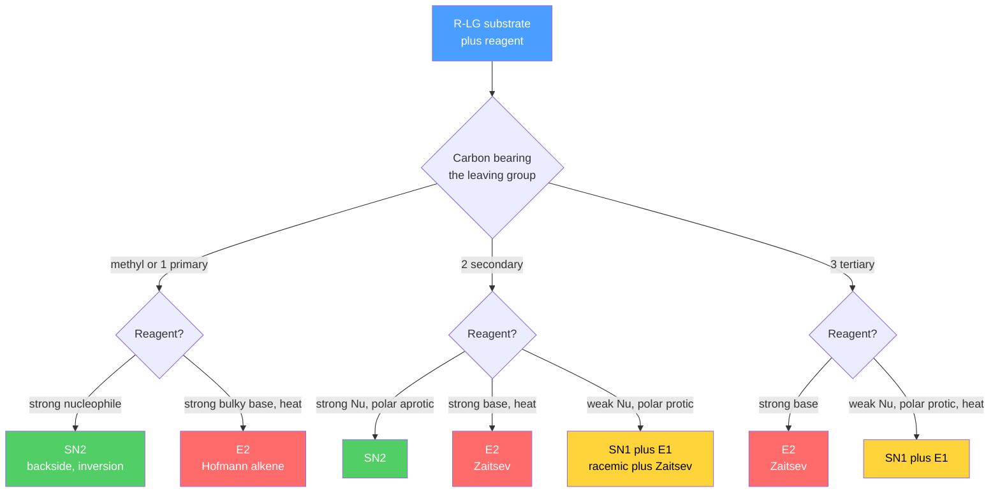

# 🔀 Nucleophilic Substitution and Elimination

> [!abstract] TL;DR
> Four workhorse reactions of saturated carbon compete for the same substrate, and the same four factors decide which one wins. **Substitution** swaps the leaving group for a nucleophile; **elimination** kicks it out along with a neighboring hydrogen to make a $\pi$ bond. Each comes in a **concerted, second-order** flavor (**SN2**, backside attack with Walden inversion; **E2**, anti-periplanar) and a **stepwise, first-order** flavor going through a carbocation (**SN1**, racemization; **E1**). The outcome is set by four variables — **substrate class** (1°/2°/3°), **nucleophile/base** strength and bulk, **leaving-group** ability, and **solvent** (protic vs aprotic) — so the whole topic reduces to reading those four dials.

## Intuition — analogy FIRST

Picture a busy revolving door with one occupied slot (the carbon bearing the **leaving group**). A newcomer (the **nucleophile**) wants in.

- If the newcomer is aggressive and the door is uncrowded, they **shove the old occupant straight out the far side in one motion** — the door spins so hard it flips inside-out. That is **SN2**: one concerted step, and the carbon's geometry *inverts* like an umbrella in a gale.
- If the door is jammed with bulky luggage (a crowded, branched carbon), no one can shove through. Instead the old occupant **wanders out on their own first**, leaving an empty slot (a **carbocation**) that anyone can then fill *from either side*. That is **SN1**: two steps, and because the empty slot is flat, the newcomer arrives randomly left or right — the product **racemizes**.

Now suppose the newcomer is less interested in *entering* and more interested in *pulling a neighbor out the window*. Yanking a **neighboring hydrogen** while the leaving group departs creates a double bond — that is **elimination** (E2 if concerted, E1 if via the same lone carbocation). Substitution and elimination are the two things an incoming reagent can do, and they are always in competition.

---

## How It Works



The tree above is the entire decision procedure: read the substrate class first, then let the reagent break the tie. Everything below justifies why each branch points where it does.

---

## Key Concepts / Details

### Undergraduate Level

**SN2 — bimolecular nucleophilic substitution.** The nucleophile attacks the antibonding $\sigma^*_{\text{C–LG}}$ orbital from the side **opposite** the leaving group; the new bond forms as the old one breaks, passing through a single trigonal-bipyramidal transition state. Because attack is from the back, the stereocenter **inverts** (a **Walden inversion**). Both partners appear in the transition state, so the kinetics are second order:

$$\text{rate} = k[\text{R–LG}][\text{Nu}] \qquad \text{(overall second order)}$$

Steric access controls everything: reactivity runs **methyl > 1° > 2° ≫ 3°**, and a 3° carbon is effectively unreactive toward SN2 (the transition state is too crowded). Strong, polarizable nucleophiles and **polar aprotic** solvents give the fastest rates.

**SN1 — unimolecular nucleophilic substitution.** Two steps:
1. **Slow, rate-determining** heterolysis of C–LG to a planar, $sp^2$ **carbocation** plus the departed leaving group.
2. **Fast** capture of the carbocation by the nucleophile on *either* face.

Only step 1 appears in the rate law, so the reaction is first order and **independent of nucleophile concentration**:

$$\text{rate} = k[\text{R–LG}] \qquad \text{(overall first order)}$$

Because the flat carbocation is attacked from both faces, a single stereocenter gives a **racemic** product — though ion pairing usually leaves a **slight excess of inversion** (the departing anion briefly shields the front face). SN1 is favored by carbocation stability (**3° > 2° > 1°**, plus resonance-stabilized allylic/benzylic centers), weak nucleophiles, and **polar protic** solvents. The free carbocation may **rearrange** by a 1,2-hydride or alkyl shift to a more stable cation before capture, giving a "wrong-skeleton" product.

**E2 — bimolecular elimination.** A base removes a $\beta$-hydrogen at the same instant the leaving group departs, forming a $\pi$ bond in one concerted step. The breaking C–H and C–LG bonds must be **anti-periplanar** (coplanar, $180^\circ$ dihedral) so the developing $p$ orbitals overlap. Kinetics are second order, $\text{rate} = k[\text{R–LG}][\text{base}]$. Regiochemistry:

- **Zaitsev** product (more-substituted, more stable alkene) with small bases such as $\text{HO}^-$, $\text{EtO}^-$.
- **Hofmann** product (less-substituted alkene) with **bulky** bases — $\text{t-BuOK}$, LDA, DBU — that cannot reach the crowded internal $\beta$-H.

The anti-periplanar requirement makes E2 **stereospecific**: a given diastereomer yields a specific $E$ or $Z$ alkene.

**E1 — unimolecular elimination.** Shares SN1's carbocation: slow ionization, then a base plucks a $\beta$-H to give the alkene. First order, $\text{rate} = k[\text{R–LG}]$, Zaitsev-favored, and it always competes with SN1 under the same conditions (3° substrate, weak base/nucleophile, protic solvent, heat).

**The four dials that decide the outcome.**

| Factor | Pushes toward SN2 / E2 (concerted) | Pushes toward SN1 / E1 (stepwise) |
|--------|-----------------------------------|-----------------------------------|
| Substrate | methyl, 1° (SN2); any class with strong base (E2) | 3°, resonance-stabilized 2° |
| Nucleophile / base | strong; **bulky ⇒ E2 over SN2** | weak (e.g. $\text{H}_2\text{O}$, ROH) |
| Leaving group | good LG helps all four | good LG especially speeds ionization |
| Solvent | **polar aprotic** (DMF, DMSO, acetone, MeCN) | **polar protic** ($\text{H}_2\text{O}$, ROH, $\text{RCO}_2\text{H}$) |

Two cross-cutting rules: **nucleophilicity ≠ basicity** (iodide is a superb nucleophile but a weak base), and **heat favors elimination** over substitution (more positive $\Delta S^\ddagger$ and higher $E_a$). A compact substrate-first summary:

| Substrate | Weak Nu/base, protic | Strong Nu, weak base, aprotic | Strong / bulky base |
|-----------|----------------------|-------------------------------|---------------------|
| Methyl / 1° | little reaction | **SN2** | **E2** (Hofmann) |
| 2° | **SN1 + E1** | **SN2** | **E2** (Zaitsev) |
| 3° | **SN1 + E1** | SN1 + E1 | **E2** (Zaitsev) |

### Graduate Level

**Kinetic isotope effects (KIE).** Deuterating the $\beta$-hydrogens produces a **primary** KIE, $k_H/k_D \approx 2\text{–}8$, for **E2** (and E1cb) because that C–H bond is broken in the rate- or product-determining transition state; **SN2, SN1, and E1** show **no primary $\beta$-KIE** since their slow step leaves the $\beta$ C–H intact. An **$\alpha$-secondary** KIE distinguishes the substitutions: a loose, $sp^3\!\to\!sp^2$ SN1 transition state gives $k_H/k_D \approx 1.1\text{–}1.2$ per D, whereas the crowded SN2 transition state gives values near unity or inverse.

**Hughes–Ingold solvent theory.** Classify reactions by the charge on the reactants versus the activated complex; the rate responds to solvent polarity according to whether charge is **created, destroyed, or dispersed** in the transition state:

- **SN1 / E1** (neutral $\text{RX} \to$ charged transition state — charge *created*): rate climbs steeply with solvent ionizing power. **Grunwald–Winstein**: $\log(k/k_0) = mY$, with $m \approx 1$ for limiting SN1.
- **SN2 with an anionic nucleophile** on neutral RX (charge *dispersed* over the larger transition state): rate *falls slightly* as polarity rises, because the small anion is better solvated in the ground state.

This is exactly why polar protic solvents accelerate SN1 yet retard anionic SN2, and why nucleophilicity order **flips** between media: $\text{I}^- > \text{Br}^- > \text{Cl}^- > \text{F}^-$ in protic solvents, but the basicity-driven $\text{F}^- > \text{Cl}^- > \text{Br}^- > \text{I}^-$ for "naked" anions in aprotic solvents.

**Hammett analysis.** For solvolysis of substituted benzylic/cumyl substrates, $\log(k/k_0) = \rho\,\sigma^{+}$ with a large **negative** $\rho \approx -4$, confirming positive-charge buildup at the benzylic carbon (SN1); electron-donating groups accelerate. SN2 shows a small $\rho$, consistent with little charge development.

**Ion pairs (Winstein spectrum).** Ionization is not a single event but a sequence: intimate (contact) ion pair $\text{R}^{+}\text{X}^{-}$ $\rightleftharpoons$ solvent-separated ion pair $\rightleftharpoons$ dissociated ions. Nucleophilic capture at the **contact ion pair** — where $\text{X}^{-}$ still shields the front face — accounts for the **partial net inversion** seen in many nominally SN1 reactions, along with common-ion rate depression and special salt effects.

**E1cb — the third elimination pathway.** When the leaving group is poor **and** the $\beta$-H is acidic (adjacent to a carbonyl, nitro, or other EWG), elimination goes stepwise in the opposite order: the base removes the $\beta$-H first to form a stabilized **carbanion** (the substrate's conjugate base), which then expels the leaving group. E1cb is diagnosed by a primary $\beta$-KIE, base dependence, and (in the reversible limit) H/D exchange faster than elimination. E1, E2, and E1cb form a mechanistic continuum mapped on a **More O'Ferrall–Jencks** diagram.

```python
# SN2 vs SN1: the kinetic fingerprint is how rate responds to [nucleophile].
# Hold substrate fixed, sweep nucleophile concentration, plot the initial rate.
import numpy as np
import matplotlib.pyplot as plt

substrate = 0.10                      # mol/L, held constant for both runs
Nu = np.linspace(0.0, 1.0, 100)       # nucleophile concentration, mol/L

k2 = 4.0e-3                           # SN2 second-order constant, L/(mol*s)
k1 = 2.5e-4                           # SN1 first-order (ionization) constant, 1/s

rate_SN2 = k2 * substrate * Nu                    # rate = k2[R-LG][Nu] -> linear in [Nu]
rate_SN1 = k1 * substrate * np.ones_like(Nu)      # rate = k1[R-LG]     -> flat vs [Nu]

plt.figure(figsize=(7, 5))
plt.plot(Nu, rate_SN2 * 1e6, label="SN2: rate = k2[R-LG][Nu]  (2nd order)")
plt.plot(Nu, rate_SN1 * 1e6, "--", label="SN1: rate = k1[R-LG]  (1st order)")
plt.xlabel("nucleophile concentration  [Nu]  (mol/L)")
plt.ylabel("initial rate  (micro-mol/L/s)")
plt.title("Kinetic fingerprint: SN2 tracks [Nu]; SN1 ignores it")
plt.legend(); plt.grid(alpha=0.3); plt.tight_layout()
plt.show()

# Doubling [Nu] doubles the SN2 rate but leaves the SN1 rate unchanged --
# the single cleanest experimental test to tell the two mechanisms apart.
```

---

## Real-World Notes

- **Williamson ether synthesis** (industrial and lab ether preparation) is an SN2 of an alkoxide on an alkyl halide; it *must* use a methyl or 1° halide, because a 3° halide would only undergo E2 with the basic alkoxide.
- **Biological methylation** by **S-adenosylmethionine (SAM)** is an enzymatic SN2 in which a nucleophile attacks SAM's methyl carbon with clean **inversion** — proven by chiral-methyl (${}^{1}\text{H},{}^{2}\text{H},{}^{3}\text{H}$) isotope experiments — regulating gene expression and neurotransmitter levels.
- **Alkylating chemotherapeutics and chemical-warfare agents** (nitrogen mustards such as cyclophosphamide and chlorambucil; sulfur mustard) act by forming a strained aziridinium or episulfonium ion that undergoes SN2 attack by DNA guanine-$N7$, cross-linking the double helix.
- **$\text{t}$-Butyl chloride solvolysis** is the textbook SN1/E1 system and the reference reaction that defined the **Grunwald–Winstein** solvent-ionizing-power scale $Y$.
- **Hofmann elimination** (exhaustive methylation to a quaternary ammonium, then a bulky base) was historically used to map the carbon skeletons of alkaloids by peeling off the least-hindered alkene.
- **Polar aprotic solvents in synthesis** (DMSO, DMF, HMPA) are chosen deliberately to "unclothe" anionic nucleophiles and accelerate otherwise sluggish SN2 displacements.

---

## Common Pitfalls

1. **Reading mechanism off the reaction order.** SN2 *and* E2 are both second order; SN1 *and* E1 are both first order. Kinetics alone cannot distinguish substitution from elimination — you also need stereochemistry, products, and KIE.
2. **Claiming SN1 gives perfect racemization.** Ion pairing usually leaves a **net excess of inversion**; expecting exactly 50:50 enantiomers is wrong for many real solvolyses.
3. **Swapping the solvent rule.** Polar **protic** favors SN1/E1 (stabilizes the carbocation and leaving group); polar **aprotic** favors SN2 (frees the nucleophile). Reversing these is the single most common exam error.
4. **Applying Zaitsev universally.** Bulky bases give the **Hofmann** (less-substituted) alkene, and in rigid rings the **anti-periplanar** requirement can force a non-Zaitsev product — e.g. menthyl chloride eliminates only through its trans-diaxial $\beta$-H, giving the "wrong" alkene.
5. **Forgetting carbocation rearrangements.** In SN1/E1 the product can arise from a **rearranged** (more stable) cation via a 1,2-hydride or methyl shift; drawing the unrearranged skeleton misses the major product.
6. **Equating nucleophilicity with basicity.** They diverge sharply: $\text{I}^-$ and $\text{RS}^-$ are strong nucleophiles but weak bases (favor substitution), while $\text{t-BuO}^-$ is a strong, bulky base but a poor nucleophile (favors E2).

---

## Related Concepts

- [[_MOC_Organic_Chemistry|↑ Section MOC]]
- [[Reaction_Mechanisms_and_Arrow_Pushing]] — the curved-arrow formalism used to draw every step above
- [[Stereochemistry_and_Chirality]] — Walden inversion, racemization, and E2 stereospecificity are stereochemical outcomes
- [[Structure_Bonding_and_Functional_Groups]] — leaving-group ability and $\sigma^*$ orbitals trace back to bonding and functional-group reactivity
- [[Addition_and_Carbonyl_Chemistry]] — the complementary reactivity: nucleophiles adding to $\pi$ bonds rather than displacing $\sigma$ leaving groups
- [[Aromaticity_and_Electrophilic_Aromatic_Substitution]] — aryl halides do *not* do SN2/SN1; contrast with the aromatic mechanisms
- [[Pericyclic_Radical_and_Polymer_Chemistry]] — alternative bond-making modes when polar substitution/elimination is unavailable
- [[Chemical_Kinetics]] — rate laws, reaction order, and KIE (the physical-chemistry engine behind this note)
- [[_MOC_Mathematics_Master]] (Math) — the linear-vs-constant rate dependence is the same first-order/second-order ODE and regression machinery

---

## Review Questions

1. **Undergraduate**: 2-bromobutane is treated with (a) $\text{NaI}$ in acetone, (b) $\text{NaOEt}$ in ethanol at reflux, and (c) $\text{H}_2\text{O}$ alone. Predict the dominant mechanism and the major organic product in each case, and state whether the stereocenter is inverted, racemized, or destroyed.
2. **Undergraduate**: You must convert a 1° alcohol to a 1° alkyl azide ($\text{N}_3^-$ displacement) cleanly. Explain why converting the poor $\text{OH}$ leaving group to a **tosylate** first, and running the displacement in **DMF**, maximizes SN2 while suppressing elimination. What would change if the carbon were 3°?
3. **Graduate**: A secondary benzylic substrate shows (i) a large negative Hammett $\rho \approx -4$ against $\sigma^{+}$, (ii) rate proportional to solvent $Y$ with $m \approx 0.9$, and (iii) partial net inversion of configuration. Argue which mechanism operates and reconcile the inversion result with a carbocation intermediate using the ion-pair model.

---

## Sources

- Clayden, Greeves & Warren — *Organic Chemistry*, 2nd ed., chapters on nucleophilic substitution and elimination
- Anslyn & Dougherty — *Modern Physical Organic Chemistry* (Hammett, Hughes–Ingold, KIE, ion pairs)
- Carey & Sundberg — *Advanced Organic Chemistry, Part A*, Ch. on substitution and elimination
- March / Smith — *March's Advanced Organic Chemistry*, aliphatic substitution mechanisms
- Winstein et al. — foundational ion-pair and Grunwald–Winstein $Y$-scale papers, *J. Am. Chem. Soc.*

#chemistry #organic-chemistry #SN1 #SN2 #E1 #E2 #substitution #elimination #zaitsev #hofmann #carbocation #stereospecificity #undergraduate #graduate
