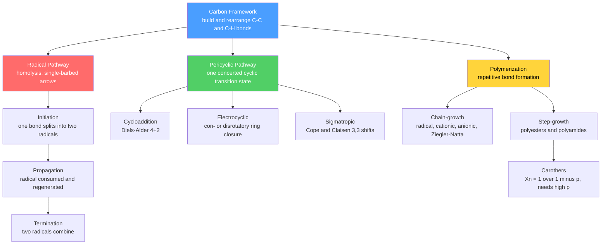

# ⛓️ Pericyclic, Radical and Polymer Chemistry

> [!abstract] TL;DR
> Three complementary strategies for building and rearranging carbon skeletons. **Radical reactions** run through neutral, odd-electron intermediates in *initiation–propagation–termination* chains; bond-dissociation energies (BDEs) explain why bromination is selective while chlorination is not, and why HBr adds *anti*-Markovnikov in the presence of peroxides. **Pericyclic reactions** are concerted, single-step processes through a cyclic transition state whose feasibility is dictated by orbital symmetry (Woodward–Hoffmann / frontier-molecular-orbital rules) — the Diels–Alder $[4+2]$ cycloaddition, electrocyclic ring closures, and $[3,3]$-sigmatropic shifts. **Polymers** are giant chains assembled by *chain-growth* (addition) or *step-growth* (condensation); the Carothers equation $\bar X_n = 1/(1-p)$ shows step-growth needs near-complete conversion, and bulk properties follow from molar-mass distribution, tacticity, crystallinity, and the $T_g$ / $T_m$ transitions.

## Intuition — analogy FIRST

Picture three ways to assemble a large structure out of small parts.

- **Radical chemistry is a row of dominoes.** One nudge (initiation) topples the first piece, and each falling domino knocks over the next (propagation) until two collapsing pieces collide and stop the run (termination). A single initiating spark can drive thousands of reactions, because the reactive species is *regenerated* every step rather than consumed.
- **Pericyclic reactions are a choreographed square dance.** Several bonds break and form *simultaneously* in one smooth circular motion — no partner is ever left without a hand — and the dance only "works" if the dancers spin the correct way (orbital symmetry). There is no intermediate to catch your breath: reactant goes to product in a single, stereospecific step.
- **Polymers are the steel girders.** Link thousands of identical small units into one gigantic molecule; the material's strength comes not from any single bond but from the sheer length and entanglement of the chains.

The unifying theme is that all three are about *making and breaking C–C and C–H bonds* — the difference is whether electrons move one at a time (radical), all at once in a ring (pericyclic), or the same reaction repeats endlessly (polymerization).

---

## How It Works



Radical chemistry moves *one* electron per arrow (fishhook); pericyclic chemistry moves electron *pairs* around a ring in a single step; polymerization is any of these reactions repeated until a macromolecule results.

---

## Key Concepts / Details

### Secondary Level

**Radicals and homolysis.** A **radical** is a species with an unpaired electron, formed by **homolysis** — a bond splits so each fragment keeps *one* electron ($\text{Cl–Cl} \to 2\,\text{Cl}\bullet$). This contrasts with heterolysis, where one fragment takes *both* electrons to give ions. Radicals are electrically neutral but highly reactive.

**The radical chain.** Radical halogenation of an alkane (e.g. $\text{CH}_4 + \text{Cl}_2 \to \text{CH}_3\text{Cl} + \text{HCl}$, driven by UV light) proceeds in three phases:

1. **Initiation:** $\text{Cl}_2 \xrightarrow{h\nu} 2\,\text{Cl}\bullet$ — light supplies energy for homolysis.
2. **Propagation:** $\text{Cl}\bullet + \text{CH}_4 \to \text{HCl} + \text{CH}_3\bullet$, then $\text{CH}_3\bullet + \text{Cl}_2 \to \text{CH}_3\text{Cl} + \text{Cl}\bullet$ — a radical is regenerated, so the cycle repeats thousands of times.
3. **Termination:** any two radicals combine ($\text{CH}_3\bullet + \text{Cl}\bullet \to \text{CH}_3\text{Cl}$), removing radicals and ending the chain.

**Polymers, first look.** Small repeating units (**monomers**) join into long chains. Two big families: **addition** polymers form by opening the $\text{C=C}$ double bond of alkenes (ethene $\to$ polyethene, PE) with no atoms lost; **condensation** polymers form by joining two functional groups and expelling a small molecule such as water (making polyesters and nylons). Everyday plastics — PE, PP, PS, PVC, PET — are all polymers, and whether they *soften on heating* (thermoplastic) or *set permanently* (thermoset) determines how they are moulded and recycled.

### Undergraduate Level

**Selectivity from BDEs.** The regiochemistry of radical H-abstraction is governed by the stability of the carbon radical formed, which tracks the C–H **bond-dissociation energy**:

| C–H bond type | BDE (kcal/mol) | Radical formed |
|---|---|---|
| methyl, $\text{CH}_3$–H | ~105 | least stable |
| primary, 1° | ~101 | |
| secondary, 2° | ~98.5 | |
| tertiary, 3° | ~96.5 | |
| allylic / benzylic | ~88–90 | most stable (resonance) |
| vinylic | ~111 | very unstable |

Radical stability order: **allylic/benzylic > 3° > 2° > 1° > methyl**. Allylic and benzylic radicals are delocalized over a $\pi$ system, hence unusually weak C–H bonds.

**Chlorine vs bromine selectivity.** Abstraction by $\text{Cl}\bullet$ (with H–Cl BDE ~103) is *exothermic* for most C–H bonds, giving an **early, reactant-like transition state** (Hammond postulate) that barely distinguishes bond types — chlorination is fast but unselective (per-H relative rates 1° : 2° : 3° $\approx$ 1 : 3.9 : 5.2). Abstraction by $\text{Br}\bullet$ (H–Br BDE ~87.5) is *endothermic*, giving a **late, product-like transition state** that fully reflects radical stability — bromination is slow but highly selective (per-H $\approx$ 1 : 82 : 1640). Rule of thumb: **use bromine when you need selectivity**; NBS delivers Br selectively at allylic/benzylic positions.

**Anti-Markovnikov HBr (peroxide effect).** With a radical initiator, HBr adds to an alkene so that Br ends up on the *less*-substituted carbon — opposite to ionic (Markovnikov) addition. $\text{Br}\bullet$ adds first to the terminal carbon because that gives the more stable (more substituted) carbon radical; that radical then abstracts H from HBr. Only **HBr** does this: for HCl the H-abstraction step is too endothermic to propagate, and for HI the $\text{I}\bullet$ addition step is endothermic — HBr is the one where *both* propagation steps are exothermic.

**Autoxidation and antioxidants.** Ground-state $\text{O}_2$ is a triplet diradical. It abstracts weak allylic/benzylic C–H bonds to start a chain: $\text{R}\bullet + \text{O}_2 \to \text{ROO}\bullet$, then $\text{ROO}\bullet + \text{RH} \to \text{ROOH} + \text{R}\bullet$. This rancidifies fats and degrades polymers. **Chain-breaking antioxidants** (hindered phenols such as BHT, BHA, or vitamin E) donate an H to $\text{ROO}\bullet$, forming a *resonance-stabilized* phenoxyl radical too unreactive to continue the chain.

**Pericyclic reactions — the three families.** Concerted, single-step reactions with a cyclic transition state, classified by what happens to bonds:

- **Cycloadditions** — two $\pi$ systems join to form a ring. The **Diels–Alder $[4+2]$** couples a diene (4 $\pi$ e⁻) with a dienophile (2 $\pi$ e⁻) to give a cyclohexene.
- **Electrocyclic** — a conjugated polyene closes to a ring (or the reverse), converting one $\pi$ bond into a $\sigma$ bond.
- **Sigmatropic** — a $\sigma$ bond migrates across a $\pi$ system; the **$[3,3]$-shifts** are the Cope (all-carbon 1,5-diene) and Claisen (allyl vinyl/aryl ether) rearrangements.

**Diels–Alder essentials.** (i) The diene must adopt the **s-cis** conformation — s-trans or locked-s-trans dienes cannot react; cyclic dienes locked s-cis (cyclopentadiene) are exceptionally reactive. (ii) The dienophile is activated by **electron-withdrawing groups** (C=O, C≡N, NO₂). (iii) The reaction is **stereospecific** and **suprafacial–suprafacial**: cis/trans relationships in the dienophile and the diene geometry are preserved in the product. (iv) The **endo rule** — the kinetic product places the dienophile substituent *endo* (tucked under the diene) because of stabilizing **secondary orbital interactions** in the transition state, even though the exo isomer is often more stable.

**Woodward–Hoffmann selection (working rules).** Feasibility depends on electron count and whether the reaction is *thermal* or *photochemical*:

| Reaction | Electrons | Thermal ($\Delta$) | Photochemical ($h\nu$) |
|---|---|---|---|
| Cycloaddition — Diels–Alder $[4+2]$ | $4n+2$ (6) | supra–supra, **allowed** | forbidden (s–s) |
| Cycloaddition — $[2+2]$ | $4n$ (4) | forbidden (s–s) | **allowed** |
| Electrocyclic | $4n$ | **conrotatory** | disrotatory |
| Electrocyclic | $4n+2$ | **disrotatory** | conrotatory |
| Sigmatropic (suprafacial) | $4n+2$ | **allowed** | forbidden |

The physical basis: for a thermal reaction the **HOMO** of one component and **LUMO** of the other must overlap with matching phase suprafacially — a $4n+2$-electron (Hückel) array does so, a $4n$ (would-be Möbius) does not. Photoexcitation promotes an electron, swapping which orbital is frontier and reversing every rule.

**Polymers — two mechanisms.**

| Feature | Chain-growth (addition) | Step-growth (condensation) |
|---|---|---|
| Monomer | usually contains $\text{C=C}$ | bifunctional (diacid + diol/diamine) |
| Growth | monomers add to an active chain end | any two species couple, often losing H₂O |
| High MW reached | at *low* conversion | only at *very high* conversion |
| Examples | PE, PP, PS, PVC, PMMA, PTFE | PET, nylon-6,6, polycarbonates |

Chain-growth **active centers** may be **radical** (peroxide/AIBN initiator; broad dispersity), **cationic** (electron-rich alkenes such as isobutylene → butyl rubber), **anionic** (electron-poor alkenes with $n$-BuLi; *living* polymerization → narrow dispersity, block copolymers), or **coordination/Ziegler–Natta** (Ti/Al or metallocene catalysts giving stereoregular, linear chains — the difference between branched LDPE and linear HDPE, and isotactic PP).

**Carothers equation.** For step-growth with balanced stoichiometry, the number-average degree of polymerization is
$$\bar X_n = \frac{1}{1-p},$$
where $p$ is the fraction of functional groups that have reacted. To reach $\bar X_n = 100$ you need $p = 0.99$; useful materials demand $p > 0.99$. With a stoichiometric ratio $r < 1$, the ceiling at $p=1$ is $\bar X_n = (1+r)/(1-r)$ — so imbalance or a monofunctional impurity caps molar mass.

**Molar mass and dispersity.** A polymer is a *distribution*, described by two averages:
$$M_n = \frac{\sum N_i M_i}{\sum N_i}, \qquad M_w = \frac{\sum N_i M_i^2}{\sum N_i M_i}, \qquad Đ = \frac{M_w}{M_n} \ge 1.$$
Radical and step-growth polymers approach $Đ \to 2$ (the most-probable distribution); living anionic polymerization gives $Đ \to 1$.

**Solid-state properties.** **Tacticity** (isotactic = substituents on one side, syndiotactic = alternating, atactic = random) controls **crystallinity**: regular chains pack into crystallites (raising density, stiffness, opacity, and $T_m$), while atactic chains stay amorphous. Two thermal transitions: the **glass transition $T_g$** (amorphous regions go glassy-to-rubbery) and the **melting temperature $T_m$** (crystalline regions melt; only semicrystalline polymers have one). Materials classes: **thermoplastics** (linear/branched, remeltable, recyclable — PE, PET), **thermosets** (densely crosslinked networks, cannot remelt — epoxy, Bakelite), and **elastomers** (lightly crosslinked, used above $T_g$, entropic elasticity — vulcanized rubber).

### Graduate Level

**FMO analysis of the Diels–Alder.** The rate is set by the dominant frontier-orbital interaction, and the barrier scales inversely with the HOMO–LUMO energy gap:
$$\text{rate} \propto \frac{1}{\Delta E_{\text{HOMO-LUMO}}}.$$

- **Normal electron demand:** the strong interaction is **HOMO(diene)–LUMO(dienophile)**. An electron-withdrawing group *lowers* the dienophile LUMO, shrinking the gap and accelerating the reaction; electron-donating groups on the diene raise its HOMO, also helping.
- **Inverse electron demand:** with an electron-poor diene and electron-rich dienophile, the controlling interaction flips to **LUMO(diene)–HOMO(dienophile)**.

Regiochemistry ("ortho/para" selectivity) follows from matching the *largest* orbital coefficients of the two frontier orbitals, and the endo preference comes from a stabilizing **secondary orbital overlap** between the diene termini and the dienophile's $\pi$ substituent. The general Woodward–Hoffmann statement: *a thermal pericyclic reaction is symmetry-allowed when the number of $(4q+2)_s$ plus $(4r)_a$ components is odd*, formalized by correlation diagrams that conserve orbital symmetry from reactant to product.

**Flory–Schulz (most-probable) distribution.** Treating step-growth as random coupling with equal reactivity, the probability a chain has exactly $x$ units is geometric:
$$n_x = (1-p)\,p^{\,x-1}, \qquad w_x = x\,(1-p)^2\,p^{\,x-1}.$$
These give $\bar X_n = 1/(1-p)$, $\bar X_w = (1+p)/(1-p)$, and hence
$$Đ = \frac{\bar X_w}{\bar X_n} = 1 + p \;\xrightarrow[p\to 1]{}\; 2.$$
The same distribution arises for radical polymerization terminated by disproportionation; **controlled/living radical** methods (ATRP, RAFT, NMP) suppress termination to approach a Poisson distribution with $Đ$ near 1, enabling designed block architectures.

```python
import numpy as np
import matplotlib.pyplot as plt

# --- Carothers equation for step-growth polymerization ---
# Xn = 1 / (1 - p),  p = fraction of functional groups that have reacted.
p  = np.linspace(0.0, 0.995, 500)
Xn = 1.0 / (1.0 - p)               # number-average degree of polymerization
Xw = (1.0 + p) / (1.0 - p)         # weight-average (most-probable distribution)

print("Conversion needed to reach a target chain length:")
for target in (10, 50, 100, 500):
    print(f"  Xn = {target:4d}  ->  p = {1 - 1/target:.4f}")
print("Dispersity Xw/Xn = 1 + p  ->  2.0 as p -> 1")

# --- Flory-Schulz weight-fraction distribution ---
x = np.arange(1, 500)
w = lambda x, p: x * (1 - p)**2 * p**(x - 1)

fig, ax = plt.subplots(1, 2, figsize=(11, 4.5))
ax[0].plot(p, Xn, label=r'$\bar X_n = 1/(1-p)$')
ax[0].plot(p, Xw, '--', label=r'$\bar X_w = (1+p)/(1-p)$')
ax[0].axvline(0.99, color='grey', ls=':')
ax[0].set(xlabel='conversion p', ylabel='degree of polymerization',
          title='Carothers: p must approach 1', ylim=(0, 400))
ax[0].legend(); ax[0].grid(alpha=0.3)

for pv in (0.95, 0.99):
    ax[1].plot(x, w(x, pv), label=f'p = {pv}')
ax[1].set(xlabel='degree of polymerization x', ylabel=r'weight fraction $w_x$',
          title='Flory-Schulz (most-probable) distribution')
ax[1].legend(); ax[1].grid(alpha=0.3)

plt.tight_layout()
plt.show()
```

---

## Real-World Notes

- **Polyethylene, two flavours from one monomer**: high-pressure *radical* polymerization of ethene gives branched **LDPE** (films, bags); Ziegler–Natta or metallocene *coordination* catalysis gives linear **HDPE** (pipes, bottles) — the mechanism, not the monomer, sets the properties.
- **Nylon-6,6**: the archetypal step-growth polyamide (adipic acid + hexamethylenediamine) whose fibre strength depends on driving $p$ toward 1; the "nylon rope trick" interfacial polymerization is a classic demonstration.
- **The Diels–Alder in synthesis**: builds six-membered rings with up to four stereocentres in one stereospecific step, a workhorse of total synthesis (steroids, prostaglandins) and the basis of thermally reversible, self-healing polymers.
- **Vitamin E and food preservation**: tocopherols and synthetic phenols (BHT/BHA) interrupt autoxidation chains, preventing rancidity in oils and oxidative embrittlement of polymers and rubber.
- **PET recycling**: because PET is a thermoplastic polyester, it can be remelted (mechanical recycling) or hydrolyzed back to monomers (chemical recycling) — impossible for thermosets like epoxy or Bakelite, which are permanently crosslinked networks.
- **Combustion and explosions**: chain-*branching* radical reactions, where one radical spawns several, cause the runaway rate that defines an explosion — the kinetic extreme of radical propagation.

---

## Common Pitfalls

1. **Fishhook vs full arrows.** Radical mechanisms move *single* electrons, drawn with single-barbed (fishhook) arrows; a full double-barbed arrow implies an ionic pair-shift and a completely different mechanism.
2. **Assuming chlorination is selective.** $\text{Cl}\bullet$ is unselective (early transition state); for a specific position use bromination or a resonance-stabilized (allylic/benzylic) site with NBS.
3. **Forgetting the s-cis requirement.** A diene locked in the s-trans geometry cannot do a Diels–Alder, no matter how good the dienophile.
4. **Treating pericyclic reactions as stepwise.** They are concerted with no discrete intermediate; this is why they are stereospecific and why orbital symmetry (not carbocation stability) governs the outcome.
5. **Reporting one molar mass for a polymer.** A polymer is a distribution — quote $M_n$, $M_w$, *and* the dispersity $Đ$; $M_n$ and $M_w$ can differ by a factor of two or more.
6. **Underestimating the conversion needed in step-growth.** At $p = 0.90$, $\bar X_n$ is only 10; useful chains need $p > 0.99$, exact stoichiometry, and no monofunctional impurity to cap the ends.

---

## Related Concepts

- [[_MOC_Organic_Chemistry|↑ Section MOC]]
- [[Structure_Bonding_and_Functional_Groups]] — homolysis, BDEs, and the $\pi$ systems on which radicals and pericyclic reactions act.
- [[Reaction_Mechanisms_and_Arrow_Pushing]] — the fishhook (single-electron) arrows and concerted electron-pair flows drawn here.
- [[Nucleophilic_Substitution_and_Elimination]] — the ionic, stepwise counterpoint to concerted and radical pathways.
- [[Addition_and_Carbonyl_Chemistry]] — ionic (Markovnikov) alkene addition, contrasted with radical *anti*-Markovnikov HBr.
- [[Aromaticity_and_Electrophilic_Aromatic_Substitution]] — Hückel $4n+2$ counting reused as the Woodward–Hoffmann electron rule.
- [[Stereochemistry_and_Chirality]] — the suprafacial/antarafacial and con-/disrotatory stereospecificity of pericyclic reactions.
- [[Quantum_Chemistry_and_Atomic_Orbitals]] — HOMO/LUMO frontier orbitals underlying the FMO analysis of cycloadditions.
- [[Chemical_Kinetics]] — chain mechanisms, the Hammond postulate, and the barrier arguments behind radical selectivity.
- [[_MOC_Mathematics_Master]] (Math) — geometric series and probability behind the Carothers and Flory–Schulz distributions.

---

## Review Questions

1. **Secondary**: Write the initiation, propagation, and termination steps for the light-driven chlorination of ethane. Explain why a trace of $\text{Cl}_2$ can convert a large amount of ethane, yet the reaction stops in the dark.
2. **Undergraduate**: (a) Predict the major product, including stereochemistry, of cyclopentadiene reacting with maleic anhydride, and state which product the endo rule favors and why. (b) Using the BDE data, explain why radical bromination of isobutane gives almost exclusively the *tertiary* bromide while chlorination gives a mixture.
3. **Graduate**: (a) Using frontier molecular orbital theory, explain how an electron-withdrawing substituent on the dienophile accelerates a *normal* electron-demand Diels–Alder, and describe the *inverse* electron-demand case. (b) Starting from the Flory–Schulz distribution $n_x = (1-p)p^{x-1}$, derive $\bar X_n$, $\bar X_w$, and show that the dispersity approaches 2 as $p \to 1$.

---

## Sources

- Clayden, Greeves & Warren — *Organic Chemistry*, 2nd ed. (radicals, pericyclic, and polymer chapters)
- Carey & Sundberg — *Advanced Organic Chemistry, Part A*, Ch. on radical and pericyclic reactions
- Fleming — *Molecular Orbitals and Organic Chemical Reactions* (FMO and Woodward–Hoffmann analysis)
- Woodward & Hoffmann — *The Conservation of Orbital Symmetry* (1970)
- Odian — *Principles of Polymerization*, 4th ed. (Carothers equation, chain vs step growth)
- Young & Lovell — *Introduction to Polymers*, 3rd ed. (molar-mass distributions, $T_g$/$T_m$, tacticity)

#chemistry #organic-chemistry #radicals #pericyclic #diels-alder #woodward-hoffmann #polymers #carothers #undergraduate #graduate
