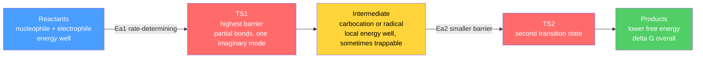

# ➡️ Reaction Mechanisms and Arrow Pushing

> [!abstract] TL;DR
> A **mechanism** is the step-by-step account of *which electrons move where* to turn reactants into products, drawn with the **curved-arrow formalism**: a double-barbed arrow tracks a **pair** of electrons flowing from an electron-rich site (a **nucleophile**, the HOMO) to an electron-poor site (an **electrophile**, the LUMO); a single-barbed **fishhook** arrow tracks a **single** electron for radical steps. Bonds break either **heterolytically** (both electrons to one atom → ions) or **homolytically** (one each → radicals), generating **reactive intermediates** — carbocations, carbanions, radicals, carbenes — whose stability ($3° > 2° > 1°$ for cations and radicals) controls the pathway. A **reaction-coordinate diagram** maps these steps as barriers (**transition states**) and wells (**intermediates**); the highest barrier is the **rate-determining step**. The **Hammond postulate** lets intermediate stability predict transition-state energies, and at the graduate level **Marcus theory** and **Hammett** relationships turn that qualitative link into quantitative predictions of reactivity.

## Intuition — analogy FIRST

Think of electrons as water and a molecule as a landscape of high and low ground. Electrons pool where the ground is low in energy — on lone pairs, on $\pi$ bonds, on electron-rich carbons — and they *flow downhill* toward electron-poor "sinks": a carbon bearing a partial positive charge, an empty orbital, a proton to be grabbed. **A curved arrow is simply a labeled channel showing that flow.** Its tail sits in the pool of electrons; its head points at the destination where a new bond (or lone pair) will form.

Everything else in organic mechanism is bookkeeping on top of that one picture. Where is the water (the nucleophile / HOMO)? Where is the drain (the electrophile / LUMO)? How steep is the hill in between (the activation barrier)? Does the water pause in a pond halfway down (a reactive intermediate) before continuing? Master "electrons flow from rich to poor over the lowest available pass," and you can *reason out* reactions instead of memorising them.

---

## How It Works



A **transition state** is an energy *maximum* — a fleeting arrangement with partial bonds that cannot be isolated. An **intermediate** is an energy *minimum* sitting in a well between two transition states, so it has a real (if short) lifetime. The *height* of the tallest barrier sets the **rate**; the *net drop* from reactants to products sets the **thermodynamics**.

---

## Key Concepts / Details

### Undergraduate Level

**The curved-arrow formalism.** Every arrow obeys two rules: the **tail** starts *on the electrons* being moved (a lone pair or a bond), and the **head** points *to where the new bond or lone pair forms*. Arrows conserve both charge and total electron count, so a correct mechanism balances like an equation.

| Arrow | Electrons moved | Bonding change | Regime |
|-------|-----------------|----------------|--------|
| Double-barbed $\rightarrow$ | a **pair** (2 e$^-$) | heterolytic: make/break with both electrons together | polar / ionic |
| Single-barbed "fishhook" $\rightharpoonup$ | a **single** electron | homolytic: one electron to each fragment | radical |

**Nucleophiles, electrophiles, and the Lewis view.** All polar organic reactivity is Lewis acid–base chemistry. A **nucleophile** is an electron-pair donor (Lewis base) with a high-energy filled orbital (**HOMO**); an **electrophile** is an electron-pair acceptor (Lewis acid) with a low-energy empty orbital (**LUMO**). Electrons flow HOMO $\to$ LUMO. **Bond polarity** from electronegativity differences (see [[Structure_Bonding_and_Functional_Groups]]) marks the targets: the carbon of a $\text{C}^{\delta+}\!-\!\text{X}^{\delta-}$ bond is electrophilic; a carbon flanked by electron donors is nucleophilic.

**Homolytic vs heterolytic cleavage.**

$$\text{A:B} \xrightarrow{\text{heterolytic}} \text{A}^{+} + \text{:B}^{-} \qquad\qquad \text{A:B} \xrightarrow{\text{homolytic}} \text{A}^{\bullet} + {}^{\bullet}\text{B}$$

Heterolysis gives ions (favoured by polar, solvating media) and is drawn with double-barbed arrows. Homolysis gives radicals (favoured by heat, light, and non-polar conditions) and is drawn with fishhooks; the energy to do it is the **bond-dissociation energy (BDE)**.

**Reactive intermediates and their stability.**

| Intermediate | Electron count at C | Geometry | Stability trend | Stabilised by |
|--------------|--------------------|----------|-----------------|----------------|
| Carbocation | 6 (empty $p$) | $sp^2$, planar | $3° > 2° > 1° > \text{CH}_3^+$ | **hyperconjugation** (adjacent C–H/C–C $\sigma$ donation) and **resonance** (allylic, benzylic, adjacent lone pair) |
| Carbanion | 8 (lone pair) | $sp^3$, pyramidal | $1° > 2° > 3°$ (reversed) | adjacent **EWGs**, $s$-character, resonance |
| Radical | 7 (one unpaired) | near-planar | $3° > 2° > 1°$ | hyperconjugation and resonance (like cations) |
| Carbene | 6 (divalent C) | singlet vs triplet | very reactive | singlet has a filled $sp^2$ lone pair + empty $p$ |

Because a carbocation craves electrons, it will **rearrange** via a **1,2-hydride** or **1,2-alkyl shift** whenever doing so reaches a more stable cation (e.g. a $2° \to 3°$ shift). Missing these rearrangements is a classic error.

**Reaction-coordinate diagrams.** Plot free energy $G$ against a "reaction coordinate." Minima are reactants, intermediates, and products; maxima are transition states (marked $^{\ddagger}$). The **activation energy** $E_a$ (or $\Delta G^{\ddagger}$) is the climb from a well to the next peak. A reaction is **exergonic** if products lie below reactants, **endergonic** if above. In a multi-step reaction the **rate-determining step (RDS)** is the one whose transition state is the *highest point above the starting material* — the quantitative rate treatment lives in [[Chemical_Kinetics]].

**Kinetic vs thermodynamic control.** When one reactant can give two products, the **kinetic product** forms via the lower barrier (faster) and dominates at low temperature / short times / irreversible conditions; the **thermodynamic product** is the more stable one (lower $G$) and dominates at high temperature / long times / reversible conditions. Classic case: 1,2- vs 1,4-addition of HBr to 1,3-butadiene.

**Hammond postulate.** *The transition state resembles, in geometry and energy, whichever species (reactant or product of that step) it is closer to in energy.* For an **exergonic** step the TS is **early** (reactant-like); for an **endergonic** step it is **late** (product-like). This is the license to use **intermediate stability as a proxy for TS energy**: a more stable carbocation is reached over a lower, earlier transition state, so it forms faster.

**Catalysis.** A catalyst opens an alternative path with a lower $E_a$ in **both** directions, accelerating the approach to equilibrium without shifting $\Delta G$ or $K$. Acid/base catalysis, nucleophilic catalysis, and metal catalysis all work by stabilising the rate-determining transition state.

**Taxonomy of mechanisms.** Three great families organise all of organic reactivity, each expanded in a sibling note:

- **Polar / ionic** (heterolytic, double-barbed arrows; carbocation or carbanion intermediates): [[Nucleophilic_Substitution_and_Elimination]], [[Addition_and_Carbonyl_Chemistry]], [[Aromaticity_and_Electrophilic_Aromatic_Substitution]].
- **Radical** (homolytic, fishhooks, chain mechanisms of initiation → propagation → termination) and **Pericyclic** (concerted, cyclic transition state, no intermediate, governed by orbital symmetry): [[Pericyclic_Radical_and_Polymer_Chemistry]].

### Graduate Level

**Arrows as frontier-orbital interactions.** The curved arrow is the cartoon of a **HOMO(Nu)–LUMO(E)** overlap. Fukui's frontier-molecular-orbital (FMO) picture says the barrier falls as the HOMO–LUMO energy gap shrinks and the orbital overlap improves. This underlies **Hard–Soft Acid–Base (HSAB)** selectivity: *hard* pairs react under **charge control** (electrostatics dominate), *soft* pairs under **orbital control** (frontier overlap dominates).

**Marcus theory intuition.** Originally for electron transfer and extended to group transfer (e.g. $S_N2$ methyl transfer), Marcus splits the barrier into an intrinsic part and a thermodynamic part:

$$\Delta G^{\ddagger} = \frac{\lambda}{4}\left(1 + \frac{\Delta G^{\circ}}{\lambda}\right)^{2} = \underbrace{\frac{\lambda}{4}}_{\text{intrinsic}} + \underbrace{\frac{\Delta G^{\circ}}{2}}_{\text{driving force}} + \frac{(\Delta G^{\circ})^{2}}{4\lambda}$$

where $\lambda$ is the **reorganisation energy** (the cost of distorting nuclei/solvent to the TS geometry) and $\Delta G^{\circ}$ is the thermodynamic driving force. Two consequences: (i) making a step more exergonic lowers the barrier — the quantitative Hammond effect — but only until $\Delta G^{\circ} = -\lambda$, beyond which the **inverted region** raises it again; (ii) $\lambda$ cleanly separates *"how far downhill"* (thermodynamics) from *"how hard to reorganise"* (intrinsic barrier).

**Linear free-energy relationships (LFERs).** Near a reference the Marcus parabola linearises to the **Bell–Evans–Polanyi** relation $E_a \approx \alpha\,\Delta H^{\circ} + \beta$. Substituent electronic effects are captured by the **Hammett equation**:

$$\log\frac{k}{k_0} = \rho\,\sigma$$

where $\sigma$ is the substituent constant (electron-withdrawing $\sigma > 0$; see [[Structure_Bonding_and_Functional_Groups]]) and the **reaction constant** $\rho$ reports charge build-up in the transition state: a **positive** $\rho$ signals negative charge developing (stabilised by EWGs, e.g. a carbanion-like TS), a **negative** $\rho$ signals positive charge (a cation-like TS). Measuring $\rho$ is therefore an experimental *window onto the transition-state structure* — this is precisely how substituent effects **predict reactivity**.

**Mapping mechanism continua.** **More O'Ferrall–Jencks** diagrams place a reaction on a 2-D energy surface spanned by two changing bond orders (e.g. C–H breaking vs C–LG breaking for eliminations), showing how a mechanism slides between concerted ($E2$) and stepwise ($E1$, $E1cb$) as substituents move the TS — parallel shifts follow Hammond, perpendicular shifts are anti-Hammond. The **Curtin–Hammett principle** adds that when two intermediates interconvert faster than they react, the product ratio is fixed by the **relative transition-state energies**, not by the ground-state populations.

```python
import numpy as np
import matplotlib.pyplot as plt

# Two-step reaction-coordinate diagram: Reactants -> TS1 -> Intermediate -> TS2 -> Products
# Energies in kJ/mol. Raised-cosine (smoothstep) segments give a true minimum/maximum
# at every node, so the curve is flat-sloped at each stationary point (as a real profile is).
labels  = ["Reactants", "TS1", "Intermediate", "TS2", "Products"]
x_nodes = np.array([0.0, 1.0, 2.0, 3.0, 4.0])
E_nodes = np.array([0.0, 120.0, 45.0, 80.0, -30.0])   # kJ/mol

def profile(xn, En, n=200):
    xs, Es = [], []
    for i in range(len(xn) - 1):
        t = np.linspace(0, 1, n)
        xs.append(xn[i] + t * (xn[i + 1] - xn[i]))
        Es.append(En[i] + (En[i + 1] - En[i]) * (1 - np.cos(np.pi * t)) / 2)
    return np.concatenate(xs), np.concatenate(Es)

x, E = profile(x_nodes, E_nodes)

fig, ax = plt.subplots(figsize=(9, 6))
ax.plot(x, E, lw=2.5, color="#333333")
for xi, Ei, name in zip(x_nodes, E_nodes, labels):
    ax.scatter([xi], [Ei], zorder=5)
    ax.annotate(name, (xi, Ei), textcoords="offset points", xytext=(0, 10),
                ha="center", fontsize=10)

Ea1 = E_nodes[1] - E_nodes[0]   # Reactants -> TS1 : the larger barrier = RDS
Ea2 = E_nodes[3] - E_nodes[2]   # Intermediate -> TS2
dG  = E_nodes[4] - E_nodes[0]   # overall reaction free-energy change

ax.annotate("", xy=(1.0, E_nodes[1]), xytext=(1.0, E_nodes[0]),
            arrowprops=dict(arrowstyle="<->", color="crimson"))
ax.text(1.06, (E_nodes[0] + E_nodes[1]) / 2, f"Ea1 = {Ea1:.0f} kJ/mol\n(RDS)",
        color="crimson", fontsize=10, va="center")
ax.annotate("", xy=(3.0, E_nodes[3]), xytext=(3.0, E_nodes[2]),
            arrowprops=dict(arrowstyle="<->", color="darkorange"))
ax.text(3.06, (E_nodes[2] + E_nodes[3]) / 2, f"Ea2 = {Ea2:.0f} kJ/mol",
        color="darkorange", fontsize=10, va="center")
ax.annotate("", xy=(4.0, E_nodes[4]), xytext=(4.0, E_nodes[0]),
            arrowprops=dict(arrowstyle="<->", color="seagreen"))
ax.text(4.05, (E_nodes[0] + E_nodes[4]) / 2, f"dG = {dG:.0f} kJ/mol\n(exergonic)",
        color="seagreen", fontsize=10, va="center")

ax.axhline(0, ls=":", color="grey", alpha=0.6)
ax.set_xlabel("Reaction coordinate")
ax.set_ylabel("Free energy G (kJ/mol)")
ax.set_title("Two-step reaction with a discrete intermediate; TS1 is rate-determining")
ax.set_xticks([])
plt.tight_layout()
plt.show()
```

---

## Real-World Notes

- **Carbocation rearrangements in nature and industry**: Wagner–Meerwein 1,2-shifts are the workhorse of **terpene and steroid biosynthesis** — cyclase enzymes steer a cascade of hydride/alkyl shifts through successive carbocations to build complex skeletons from a single linear precursor. Petroleum refining exploits the same shifts to isomerise straight-chain alkanes into higher-octane branched isomers.
- **Radical chain chemistry**: autoxidation of fats and oils is a radical chain (initiation → propagation → termination); food **antioxidants** such as BHT and vitamin E work by donating an H atom to intercept chain-carrying radicals. Free-radical polymerisation of ethylene and styrene, expanded in [[Pericyclic_Radical_and_Polymer_Chemistry]], is drawn entirely with fishhook arrows.
- **Enzyme mechanisms are arrow-pushing**: the serine-protease **catalytic triad** (Ser–His–Asp) is textbook curved-arrow chemistry — His deprotonates Ser, the serine alkoxide attacks the peptide carbonyl, and a tetrahedral **intermediate** collapses. Enzymes accelerate reactions by preferentially stabilising these transition states.
- **Kinetic vs thermodynamic control in synthesis**: deprotonating an unsymmetrical ketone with bulky **LDA at $-78\,^\circ\text{C}$** gives the *kinetic* (less-substituted) enolate, while equilibrating conditions give the *thermodynamic* (more-substituted) one — a routine lever for regiocontrol in the lab.
- **Hammett analysis in drug and materials design**: measuring $\rho$ for a reaction series is still used to diagnose transition-state charge and to tune reactivity (and metabolic stability) by choosing substituents with the right $\sigma$.

---

## Common Pitfalls

1. **Drawing arrows backwards.** Arrows go *from* electrons (nucleophile / bond) *to* the electron-poor site — never from a positive charge or from the electrophile. If your tail is on a "$+$", the arrow is wrong.
2. **Confusing a transition state with an intermediate.** A TS is an energy *maximum* with partial bonds and cannot be isolated; an intermediate is an energy *minimum* in a well and has a finite lifetime. Only intermediates can be trapped or observed.
3. **Breaking the electron/charge bookkeeping.** Each arrow must conserve total charge and give sensible octets. Track formal charges at every step; a mechanism that gains or loses an electron pair is incorrect.
4. **Forgetting carbocation rearrangements.** A $1°$ or $2°$ cation next to a branch point will shift a hydride or alkyl group to become $3°$; assuming the nucleophile attacks the *original* carbon gives the wrong product.
5. **Conflating fast with stable.** The kinetic product forms fastest (lowest barrier); the thermodynamic product is most stable (lowest $G$). They are the same only when the more stable product also has the lower barrier — do not assume it.
6. **Over-reading the Hammond postulate.** It says the TS *resembles* the nearer species, not that the TS *equals* the intermediate. It is a similarity argument for estimating barriers, not an identity.

---

## Related Concepts

- [[_MOC_Organic_Chemistry|↑ Section MOC]]
- [[Structure_Bonding_and_Functional_Groups]] — electronegativity, polarity, and substituent ($\sigma$) effects that decide where electrons flow and how fast.
- [[Stereochemistry_and_Chirality]] — mechanisms dictate stereochemical outcome (inversion, retention, racemisation) via TS geometry.
- [[Nucleophilic_Substitution_and_Elimination]] — the canonical polar mechanisms ($S_N1/S_N2/E1/E2$) built from these arrows and intermediates.
- [[Addition_and_Carbonyl_Chemistry]] — nucleophilic addition to $\pi$ systems and the tetrahedral-intermediate motif.
- [[Aromaticity_and_Electrophilic_Aromatic_Substitution]] — arenium-ion intermediates and directing effects, a polar mechanism family.
- [[Pericyclic_Radical_and_Polymer_Chemistry]] — the radical (fishhook) and concerted pericyclic families outside the ionic taxonomy.
- [[Chemical_Kinetics]] — quantifies barriers, rate laws, and the rate-determining step this note introduces qualitatively.
- [[Chemical_Thermodynamics]] — supplies $\Delta G^{\circ}$, the driving force behind kinetic-vs-thermodynamic control and Marcus theory.
- [[Acids_Bases_and_pH]] — proton transfers and Lewis acid–base behaviour underlie every polar mechanism.
- [[_MOC_Mathematics_Master]] (Math) — the parabolas, exponentials, and linear regressions behind Marcus theory and Hammett/LFER analysis.

---

## Review Questions

1. **Foundational**: In the protonation of an alkene by HBr, identify the nucleophile and the electrophile, draw the curved arrow(s) for the first step, and state whether the C–Br bond in HBr breaks homolytically or heterolytically. Which carbocation — $1°$ or $2°$ — will the reaction form, and why?
2. **Undergraduate**: 3,3-dimethyl-2-butanol reacts with strong acid to give a rearranged alkene. Draw the mechanism, show the 1,2-methyl (or hydride) shift with a curved arrow, and use the Hammond postulate plus carbocation stability to explain why the rearranged product dominates. On a reaction-coordinate diagram, mark the rate-determining step.
3. **Graduate**: A series of para-substituted substrates gives a Hammett $\rho = +2.3$ for a nucleophilic acyl substitution. What charge develops in the rate-determining transition state, and would electron-withdrawing groups speed or slow the reaction? Then, using the Marcus expression $\Delta G^{\ddagger} = \tfrac{\lambda}{4}\left(1 + \tfrac{\Delta G^{\circ}}{\lambda}\right)^2$, explain qualitatively how the barrier changes as the reaction is made progressively more exergonic, and what happens in the inverted region.

---

## Sources

- Clayden, Greeves & Warren — *Organic Chemistry*, 2nd ed., chapters on mechanism, curly arrows, and reactive intermediates
- Anslyn & Dougherty — *Modern Physical Organic Chemistry* (Marcus theory, LFERs, More O'Ferrall–Jencks diagrams)
- Carey & Sundberg — *Advanced Organic Chemistry, Part A: Structure and Mechanisms*, 5th ed.
- Hammond, G. S. (1955) — "A Correlation of Reaction Rates," *J. Am. Chem. Soc.* 77, 334
- Marcus, R. A. (1968) — "Theoretical relations among rate constants, barriers, and Broensted slopes," *J. Phys. Chem.* 72, 891

#chemistry #organic-chemistry #reaction-mechanisms #arrow-pushing #carbocations #radicals #hammond-postulate #marcus-theory #undergraduate #graduate
