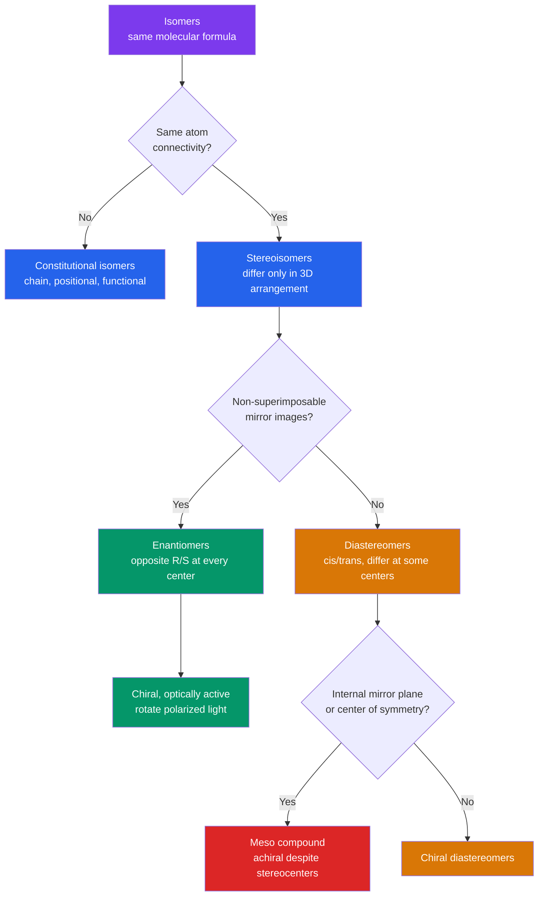

# 🪞 Stereochemistry and Chirality

> [!abstract] TL;DR
> **Stereochemistry** is the study of how atoms are arranged in *three dimensions* when the connectivity is already fixed. Two molecules with the same formula are **constitutional isomers** if their bonds connect different atoms, but **stereoisomers** if only the spatial arrangement differs. Stereoisomers split into **enantiomers** (non-superimposable mirror images, like left and right hands) and **diastereomers** (everything else — cis/trans, sugars differing at one center). A molecule is **chiral** if it cannot be superimposed on its mirror image; the usual cause is a **stereocenter** (a carbon with four different groups), labelled **R or S** by the **Cahn–Ingold–Prelog (CIP)** priority rules. Chiral molecules rotate plane-polarized light (**optical activity**, specific rotation $[\alpha]$). With $n$ independent stereocenters there are at most $2^n$ stereoisomers, minus any **meso** forms. Free rotation about single bonds gives **conformers** (staggered vs eclipsed, chair cyclohexane) whose energies control shape and reactivity. Because enzymes and receptors are themselves chiral, the two enantiomers of a drug can behave completely differently — the lesson of **thalidomide**.

## Intuition — analogy FIRST

Hold up your two hands. They are mirror images, they have the *same parts connected the same way* (thumb, four fingers, palm), yet no matter how you rotate them you cannot lay one exactly on top of the other — your right glove will never fit your left hand. That "handedness" is **chirality**, and molecules can have it too.

Now spread the fingers of one hand versus making a fist: same hand, different *shape*, and you can flow between them freely. That is a **conformation** — different arrangements reachable by rotating single bonds, without breaking anything. The whole subject is just these two ideas: which spatial arrangements are *genuinely different molecules* (configuration, needs bond-breaking to interconvert) versus merely *different poses of the same molecule* (conformation, free rotation).

---

## How It Works



---

## Key Concepts / Details

### Secondary Level

**Chirality and the stereocenter.** A molecule is **chiral** if it is *not superimposable on its mirror image*. The most common source is a **stereocenter** (stereogenic center): a carbon bonded to **four different groups**. Its mirror image is a distinct molecule — the two are **enantiomers**.

**Enantiomers vs diastereomers.**

| Feature | Enantiomers | Diastereomers |
|---------|-------------|---------------|
| Relationship | Mirror images, non-superimposable | Not mirror images |
| Configuration | Opposite at *every* stereocenter | Differ at *some* but not all centers |
| Physical properties | Identical (mp, bp, solubility) | Different (separable by normal means) |
| Optical rotation | Equal magnitude, opposite sign | Different, unrelated |
| Chiral environment | Behave differently | Behave differently |

**Optical activity.** Chiral molecules rotate the plane of plane-polarized light. **Dextrorotatory** ($+$, clockwise) and **levorotatory** ($-$). A **racemic mixture** (50:50 of both enantiomers) shows *zero* net rotation. The sign $(+/-)$ is measured, not predicted — it is unrelated to R/S.

**Geometric isomerism.** A C=C double bond cannot rotate freely, so substituents are locked as **cis** (same side) or **trans** (opposite sides) — a type of diastereomer.

### Undergraduate Level

**CIP rules for R/S.** To assign configuration at a stereocenter:
1. Rank the four groups by **atomic number** of the first atom (higher = higher priority).
2. On ties, move outward and compare the *sets* of attached atoms at the point of first difference (compare highest-to-highest).
3. Treat a double bond $\text{C=O}$ as C bonded to two O's (**phantom/duplicate atoms**) and vice-versa.
4. Point the **lowest** priority group away from you. If $1\to2\to3$ traces **clockwise** it is **R** (*rectus*); **counterclockwise** is **S** (*sinister*).

**The $2^n$ rule and meso compounds.** With $n$ stereocenters there are at most $2^n$ stereoisomers. **Exception:** a **meso compound** has stereocenters but an *internal mirror plane*, making it superimposable on its mirror image — hence **achiral and optically inactive** despite the centers.

$$\text{tartaric acid: } n=2 \Rightarrow 2^2 = 4 \text{ expected, but only } 3 \text{ exist: } (R,R),\ (S,S),\ \text{and } meso\text{-}(R,S)$$

**Specific rotation.** The intrinsic, concentration-normalized rotation:

$$[\alpha]_\lambda^{T} = \frac{\alpha}{l \cdot c}$$

where $\alpha$ is the observed rotation (degrees), $l$ the path length (dm), and $c$ the concentration (g mL$^{-1}$). **Enantiomeric excess:**

$$ee = \frac{|[R]-[S]|}{[R]+[S]}\times 100\% = \frac{[\alpha]_{\text{observed}}}{[\alpha]_{\text{pure}}}\times 100\%$$

**Representations.**

| Drawing | View | Convention | Best for |
|---------|------|-----------|----------|
| Wedge–dash | 3D perspective | Bold = toward you, hashed = behind | General structures |
| Fischer | Flattened cross | Horizontal = toward you, vertical = behind; chain vertical, most-oxidized C on top | Sugars, amino acids |
| Newman | Looking down a C–C bond | Front atom = "Y", back atom = circle | Conformations |
| Sawhorse | Oblique side view of a C–C bond | — | Conformations |

For sugars, **D/L** is set by the bottom-most stereocenter in the Fischer projection (D = OH on the right), following glyceraldehyde. D/L, R/S, and $+/-$ are **three independent labels** — do not conflate them.

**Conformational analysis — ethane and butane.** Rotating a single bond costs energy. **Staggered** (bonds anti, $60°$ apart) minimizes **torsional strain**; **eclipsed** maximizes it. Ethane's barrier is $\approx 12$ kJ mol$^{-1}$ (hyperconjugation favours staggered). Butane, rotating about C2–C3, adds **steric strain** between the two methyls:

| Conformer (dihedral) | Description | Energy above anti |
|----------------------|-------------|-------------------|
| **anti** ($180°$) | Methyls opposite, staggered | $0$ (global min) |
| **gauche** ($60°,\ 300°$) | Methyls $60°$ apart, staggered | $\approx 3.8$ kJ mol$^{-1}$ |
| **eclipsed** ($120°,\ 240°$) | CH$_3$ eclipses H | $\approx 16$ kJ mol$^{-1}$ |
| **syn / fully eclipsed** ($0°$) | CH$_3$ eclipses CH$_3$ | $\approx 19$ kJ mol$^{-1}$ (global max) |

**Cyclohexane.** The **chair** conformer has no angle strain (all $109.5°$) and all bonds staggered. Each carbon has one **axial** and one **equatorial** position; the **ring-flip** (via half-chair, twist-boat, boat; barrier $\approx 45$ kJ mol$^{-1}$) interconverts axial $\leftrightarrow$ equatorial. Bulky groups prefer **equatorial** to avoid **1,3-diaxial strain**. The **A-value** quantifies this preference (equatorial vs axial):

| Group | A-value (kJ mol$^{-1}$) | Note |
|-------|-------------------------|------|
| F | $\approx 1$ | small |
| OH | $\approx 4$ | moderate |
| CH$_3$ | $\approx 7.5$ | reference |
| C(CH$_3$)$_3$ | $\approx 20$ | effectively locks the ring |

For disubstituted rings: **trans-1,2**, **cis-1,3**, and **trans-1,4** can all place both groups **diequatorial** (most stable).

**Alkene E/Z.** cis/trans is ambiguous for trisubstituted alkenes, so CIP gives the rigorous label: higher-priority groups on the **same** side = **Z** (*zusammen*), on **opposite** sides = **E** (*entgegen*).

### Graduate Level

**Prochirality.** A center that becomes a stereocenter after *one* substitution is **prochiral**. The two identical groups (e.g., the H's of a CH$_2$) are **enantiotopic** (replacing one gives R, the other S) or **diastereotopic**. Label them **pro-R / pro-S**: the atom whose replacement by a higher-priority group yields R is **pro-R**. For a trigonal (sp$^2$) face — such as a carbonyl carbon — viewing the face where CIP priorities run clockwise defines the **re face**, counterclockwise the **si face**. Enzymes and chiral catalysts deliver reagents to one specific face, giving **enantioselective** products.

**Symmetry criterion for chirality.** A molecule is chiral **iff** it lacks any improper rotation axis $S_n$. Since a mirror plane is $\sigma = S_1$ and a center of inversion is $i = S_2$, a molecule with *any* $\sigma$ or $i$ (like a meso compound) is achiral. Point groups $C_1$, $C_n$, and $D_n$ are chiral; anything containing $S_n$ is not.

**Chirality without a stereocenter — atropisomerism.** Restricted rotation about a single bond (e.g., ortho-substituted biaryls such as **BINOL** and **BINAP**) creates **axial chirality**. If the rotational barrier exceeds $\approx 93$ kJ mol$^{-1}$, the two twisted forms (**atropisomers**) are isolable at room temperature. BINAP is a workhorse ligand in asymmetric catalysis (Noyori).

**Stereochemistry as mechanistic evidence.** Reaction outcomes reveal mechanism: **S$_N$2** proceeds by backside attack, causing **inversion** of configuration (Walden inversion); **S$_N$1** goes through a planar carbocation, giving **racemization**; **E2** demands an **anti-periplanar** H and leaving group. Stereochemical labels are thus experimental probes — expanded in [[Nucleophilic_Substitution_and_Elimination]].

```python
import numpy as np
import matplotlib.pyplot as plt

# Relative potential energy of n-butane vs the H3C-C2-C3-CH3 dihedral angle.
# Physically-motivated model: a threefold TORSIONAL (bond-eclipsing) term
# plus a onefold STERIC (methyl-methyl van der Waals) term. Coefficients are
# fit to the classic textbook barrier heights (in kJ/mol).
V1 = 5.1    # onefold steric term (CH3...CH3 repulsion, peaks at syn 0 deg)
V3 = 13.9   # threefold torsional term (eclipsing, peaks at 0/120/240 deg)

def energy(angle_deg):
    r = np.radians(angle_deg)
    return 0.5 * V1 * (1 + np.cos(r)) + 0.5 * V3 * (1 + np.cos(3 * r))

phi = np.linspace(0, 360, 721)
E = energy(phi)

markers = [
    (0,   "syn: CH3/CH3\n(global max)"),
    (60,  "gauche"),
    (120, "eclipsed\nCH3/H"),
    (180, "anti\n(global min)"),
    (240, "eclipsed\nCH3/H"),
    (300, "gauche"),
]

plt.figure(figsize=(9, 5))
plt.plot(phi, E, lw=2, color="#2563eb")
for ang, name in markers:
    plt.scatter([ang], [energy(ang)], color="#dc2626", zorder=5)
    plt.annotate(name, (ang, energy(ang)), textcoords="offset points",
                 xytext=(0, 8), ha="center", fontsize=8)

plt.xlabel("H3C-C2-C3-CH3 dihedral angle (degrees)")
plt.ylabel("Relative potential energy (kJ/mol)")
plt.title("Conformational energy profile of n-butane")
plt.xticks(range(0, 361, 60))
plt.grid(True, alpha=0.3)
plt.tight_layout()

for ang, name in [(180, "anti     "), (60, "gauche   "),
                  (120, "ecl CH3/H"), (0, "syn      ")]:
    print(f"{name} ({ang:3d} deg): {energy(ang):5.1f} kJ/mol")
# anti      (180 deg):   0.0 kJ/mol
# gauche    ( 60 deg):   3.8 kJ/mol
# ecl CH3/H (120 deg):  15.2 kJ/mol
# syn       (  0 deg):  19.0 kJ/mol
```

---

## Real-World Notes

- **Thalidomide (1957–1961).** Marketed as a racemate for morning sickness; the $(R)$-enantiomer is sedative while the $(S)$-form is **teratogenic**, causing thousands of birth defects. Worse, the enantiomers **racemize in vivo**, so even pure $(R)$ would not have been safe — the founding cautionary tale of chiral drug regulation.
- **Chiral switches.** Selling a single enantiomer can improve a drug: **esomeprazole** ($(S)$-omeprazole, Nexium), **escitalopram**, and **levocetirizine** are single-enantiomer successors to earlier racemates.
- **Smell and taste are chiral.** $(R)$-carvone smells of spearmint, $(S)$-carvone of caraway; $(R)$-limonene smells of oranges, $(S)$-limonene of lemon/pine — your olfactory receptors are chiral detectors.
- **Life is homochiral.** Ribosomes build proteins from **L-amino acids** and DNA/RNA from **D-sugars**. Because the machinery is one-handed, biology distinguishes enantiomers with exquisite selectivity.
- **Asymmetric catalysis.** Noyori/Knowles/Sharpless (2001 Nobel) built chiral catalysts (BINAP, Sharpless epoxidation) that produce one enantiomer selectively — the industrial route to single-enantiomer pharmaceuticals and agrochemicals.
- **Analytical detection.** A polarimeter measures $[\alpha]$; chiral HPLC columns and NMR chiral shift reagents separate or resolve enantiomers that are otherwise physically identical.

---

## Common Pitfalls

1. **Confusing configuration with conformation.** Enantiomers/diastereomers (configuration) require *bond-breaking* to interconvert; staggered/eclipsed and chair flips (conformation) are just rotations — do not "assign R/S" to a conformer.
2. **Assuming R = (+).** The R/S label (CIP, structural) has **no fixed relationship** to the sign of optical rotation ($+/-$, measured). Likewise D/L (Fischer, sugars) is a *third* independent system.
3. **Applying $2^n$ blindly.** The formula is an *upper bound*; **meso** compounds and other internal symmetry reduce the true count (tartaric acid gives 3, not 4).
4. **Mixing up Fischer conventions.** In a Fischer projection **horizontal** bonds point *toward* you and **vertical** bonds point *away*. Rotating a Fischer projection by $90°$ inverts the configuration — only $180°$ in-plane rotations are safe.
5. **Forgetting to look past the first atom in CIP.** When first atoms tie, you must explore outward to the first point of difference — and a $\text{C=X}$ double bond duplicates atoms (phantom atoms), not "counts the bond twice" loosely.
6. **Calling a meso compound "chiral because it has stereocenters."** Stereocenters are neither necessary nor sufficient for chirality; the real test is the absence of any improper axis $S_n$ (mirror plane / inversion center).

---

## Related Concepts

- [[_MOC_Organic_Chemistry|↑ Section MOC]]
- [[Structure_Bonding_and_Functional_Groups]] — tetrahedral sp$^3$ carbon is the geometric basis for stereocenters
- [[Reaction_Mechanisms_and_Arrow_Pushing]] — stereochemical outcome is a key diagnostic of mechanism
- [[Nucleophilic_Substitution_and_Elimination]] — S$_N$2 inversion, S$_N$1 racemization, E2 anti-periplanar geometry
- [[Addition_and_Carbonyl_Chemistry]] — re/si facial selectivity governs additions to prochiral carbonyls
- [[Aromaticity_and_Electrophilic_Aromatic_Substitution]] — planar aromatic rings and restricted rotation set up atropisomerism
- [[Pericyclic_Radical_and_Polymer_Chemistry]] — orbital-symmetry rules dictate stereospecific pericyclic outcomes; tacticity is polymer stereochemistry
- [[Chemical_Bonding_and_Molecular_Geometry]] — VSEPR geometry and hybridization underlie 3D shape
- [[Biomolecules_Overview]] — biological homochirality of amino acids and sugars
- [[Enzyme_Kinetics_and_Catalysis]] — chiral active sites discriminate enantiomers and prochiral faces
- [[NMR_Spectroscopy]] — diastereotopic protons and chiral shift reagents probe stereochemistry
- [[_MOC_Mathematics_Master]] — symmetry/group theory formalizes point groups and the $S_n$ chirality criterion

---

## Review Questions

1. **Secondary:** 2-butanol has one stereocenter. Explain why it exists as a pair of enantiomers, why an equal (racemic) mixture shows zero optical rotation, and how the boiling points of the two enantiomers compare.
2. **Undergraduate:** Tartaric acid has two stereocenters. Draw the $(R,R)$, $(S,S)$, and meso forms; identify which pair are enantiomers and which are diastereomers; and explain why the $2^2$ rule predicts four stereoisomers but only three exist.
3. **Graduate:** For the reduction of a prochiral ketone such as acetophenone, define the *re* and *si* faces and explain how a chiral catalyst (e.g., a BINAP–metal complex) uses facial selectivity to produce one alcohol enantiomer in high enantiomeric excess. Relate this to why the S$_N$2 reaction is stereospecific.

---

## Sources

- Clayden, Greeves & Warren — *Organic Chemistry*, 2nd ed., Ch. 14–16, 18 (stereochemistry, conformational analysis)
- McMurry — *Organic Chemistry*, 9th ed., Ch. 3–5 (conformations, chirality, CIP)
- Cahn, Ingold & Prelog (1966) — "Specification of Molecular Chirality," *Angew. Chem. Int. Ed.* 5, 385
- Eliel & Wilen — *Stereochemistry of Organic Compounds* (the definitive reference)
- Ryckaert & Bellemans (1975) — *Chem. Phys. Lett.* 30, 123 (butane torsional potential model)

#chemistry #organic-chemistry #stereochemistry #chirality #enantiomers #diastereomers #CIP #conformational-analysis #optical-activity #secondary #undergraduate #graduate
