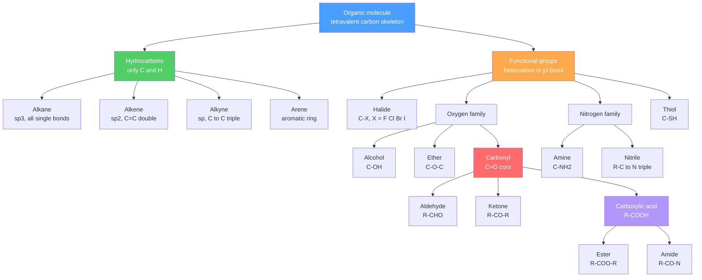

# 🧬 Structure, Bonding and Functional Groups

> [!abstract] TL;DR
> Organic chemistry is the chemistry of carbon, and it works because carbon is **tetravalent** (four bonds) and loves **catenation** (bonding to itself in chains, branches, and rings). The geometry of every carbon follows its **hybridization**: $sp^3$ (tetrahedral, single bonds), $sp^2$ (trigonal planar, one $\pi$ bond), or $sp$ (linear, two $\pi$ bonds). A $\sigma$ bond permits free rotation; a $\pi$ bond locks it. **Functional groups** — the reactive heteroatom/multiple-bond motifs grafted onto the carbon skeleton — are the "verbs" that dictate reactivity, and a compact **functional-group table** organizes almost all of organic chemistry. The **degree of unsaturation** ($\text{DoU}=\tfrac{1}{2}(2C+2+N-H-X)$) counts rings plus $\pi$ bonds straight from a molecular formula. Reactivity, acidity, and basicity are then tuned by three **electronic effects**: inductive, resonance, and hyperconjugation.

## Intuition — analogy FIRST

Think of carbon as the ultimate **LEGO connector brick**: it always has exactly four studs, and — uniquely among the elements — it happily snaps into *other carbon bricks* endlessly. That single fact is why there are more carbon compounds than compounds of all other elements combined. The gray carbon-and-hydrogen bricks form the inert *scaffold*; the colored bricks you clip on — an $-\text{OH}$ here, a $-\text{COOH}$ there — are the **functional groups**, and they are where all the action happens.

If the carbon skeleton is a sentence's grammar, functional groups are its verbs: swap an alcohol ($-\text{OH}$) for an amine ($-\text{NH}_2$) and the molecule now *does* something different, even though the scaffold is unchanged. Learn to recognize the ~15 common groups and you can predict the chemistry of a molecule you have never seen.

---

## How It Works



---

## Key Concepts / Details

### Secondary Level

**Carbon's superpower.** Carbon has four valence electrons, so it forms **four covalent bonds** (tetravalence) to reach an octet. Because C–C bonds are strong and non-polar, carbon **catenates** into unlimited chains, branches, and rings — the structural basis of biology and materials.

**Hybridization sets the shape.** Mixing the $2s$ and $2p$ orbitals gives equivalent hybrids (full treatment in [[Chemical_Bonding_and_Molecular_Geometry]] and [[Quantum_Chemistry_and_Atomic_Orbitals]]):

| Hybrid | Geometry | Angle | Bonds on C | Example |
|--------|----------|-------|------------|---------|
| $sp^3$ | tetrahedral | 109.5° | 4 $\sigma$ | alkane (CH₄) |
| $sp^2$ | trigonal planar | 120° | 3 $\sigma$ + 1 $\pi$ | alkene (C₂H₄) |
| $sp$ | linear | 180° | 2 $\sigma$ + 2 $\pi$ | alkyne (C₂H₂) |

**Sigma vs pi.** A **$\sigma$ bond** is head-on overlap along the bond axis — cylindrically symmetric, so groups can **rotate freely**. A **$\pi$ bond** is side-on overlap of parallel $p$ orbitals — rotating would break it, so C=C is **rigid** (the origin of *cis/trans* isomers, see [[Stereochemistry_and_Chirality]]). More bonds between two carbons = shorter and stronger:

| Bond | Length (pm) | Strength (kJ/mol) | Rotation |
|------|-------------|-------------------|----------|
| C–C | 154 | 348 | free |
| C=C | 134 | 614 | locked |
| C≡C | 120 | 839 | locked (linear) |

**Drawing molecules.** Three registers for the *same* molecule (ethanol):
- **Condensed:** `CH3CH2OH` — text-friendly, groups written inline.
- **Skeletal / line-angle:** a zig-zag where each vertex/end = a carbon and hydrogens on carbon are implied — fast and standard in practice.
- **3-D (wedge–dash):** wedge = toward you, dash = away — needed for stereochemistry.

**Hydrocarbon classes and naming.** IUPAC names have three parts: **root** (longest chain: meth-, eth-, prop-, but-, pent-…), **suffix** (family: *-ane* single, *-ene* double, *-yne* triple), and **locants/substituents** (numbers + prefixes for branches, numbered so the principal group gets the *lowest* locant). Example: `2-methylbutane`.

### Undergraduate Level

**The functional-group table.** These motifs, not the alkane scaffold, control reactivity:

| Group | Structure | Suffix / prefix | Characteristic reactivity |
|-------|-----------|-----------------|---------------------------|
| Alkene | C=C | -ene | electrophilic **addition** (electron-rich $\pi$) |
| Alkyne | C≡C | -yne | addition; **terminal C–H acidic** (pKₐ ≈ 25) |
| Halide | C–X | halo- | **nucleophilic substitution / elimination** |
| Alcohol | C–OH | -ol | H-bonding; weakly acidic (pKₐ ≈ 16); oxidation |
| Ether | C–O–C | -oxy- | fairly inert; Lewis-basic oxygen |
| Amine | C–NH₂ | -amine | **basic** and nucleophilic (lone pair on N) |
| Thiol | C–SH | -thiol | more acidic than alcohol; soft nucleophile |
| Aldehyde | R–CHO | -al | nucleophilic **addition**; easily oxidized |
| Ketone | R–CO–R | -one | nucleophilic addition (less reactive than aldehyde) |
| Carboxylic acid | R–COOH | -oic acid | **acidic** (pKₐ ≈ 4–5); forms derivatives |
| Ester | R–COO–R | -oate | hydrolysis; transesterification |
| Amide | R–CO–NR₂ | -amide | resonance-stabilized; hydrolysis |
| Nitrile | R–C≡N | -nitrile | reduction / hydrolysis to acid |

Naming priority (highest first): carboxylic acid > ester > amide > nitrile > aldehyde > ketone > alcohol > amine > alkene/alkyne. The top group becomes the suffix; the rest become prefixes.

**Degrees of unsaturation (Index of Hydrogen Deficiency).** Each ring or $\pi$ bond removes two hydrogens relative to the saturated formula $C_nH_{2n+2}$:
$$\text{DoU} = \frac{2C + 2 + N - H - X}{2}$$
Divalent atoms (O, S) do **not** appear. A benzene ring gives DoU = 4 (three C=C + one ring); a C≡C or C≡N counts as 2. This is the single most useful "sanity check" when interpreting a formula or a spectrum ([[NMR_Spectroscopy]]).

**Constitutional (structural) isomerism.** Same molecular formula, different **connectivity** — distinct from stereoisomers. Flavors: **chain** (n-butane vs isobutane), **positional** (1- vs 2-propanol), and **functional** (ethanol C₂H₆O vs dimethyl ether C₂H₆O). C₄H₁₀ has 2 isomers; C₁₀H₂₂ has 75; the count explodes with size — another consequence of catenation.

**Electronic effects — the three levers of reactivity:**

| Effect | Transmitted through | Range | Signature |
|--------|--------------------|-------|-----------|
| **Inductive** ($-I$/$+I$) | $\sigma$ framework (electrostatic) | falls off with distance | electronegative atoms pull density |
| **Resonance / conjugation** ($-M$/$+M$) | overlapping $\pi$ / lone pairs | wherever $\pi$ overlaps | delocalization, curved arrows |
| **Hyperconjugation** | $\sigma_{C-H}$ into adjacent empty/$\pi$ orbital | adjacent only | stabilizes carbocations, alkenes |

**Acidity and basicity follow conjugate-base stability.** An acid is strong when its conjugate base is stabilized:
- **Carboxylic acids** (pKₐ ≈ 4.8) beat alcohols (pKₐ ≈ 16) because the carboxylate anion delocalizes the negative charge over **two equivalent oxygens** by resonance.
- **Phenol** (pKₐ ≈ 10) is far more acidic than cyclohexanol because the phenoxide charge spreads into the aromatic ring.
- **Inductive withdrawal** stacks up: acetic acid pKₐ 4.76 → chloroacetic 2.86 → **trichloroacetic 0.66**.
- **Amines are basic** because nitrogen's lone pair grabs a proton; aromatic amines (aniline) are weaker bases because that lone pair is tied up in the ring.

### Graduate Level

**Aromaticity preview.** A cyclic, planar, fully conjugated ring with **$4n+2$** $\pi$ electrons (Hückel's rule) is **aromatic** and unusually stable — benzene's resonance stabilization is ≈ 150 kJ/mol. A $4n$ system (e.g. cyclobutadiene) is **antiaromatic** and destabilized. This special stability rewrites the reactivity of arenes (they undergo *substitution*, not addition) — developed fully in [[Aromaticity_and_Electrophilic_Aromatic_Substitution]].

**s-character controls C–H acidity and electronegativity.** More $s$-character holds the bonding electrons closer to carbon, making it effectively more electronegative and its C–H more acidic: $sp$ (50% s, alkyne pKₐ ≈ 25) < $sp^2$ (33%, alkene pKₐ ≈ 44) < $sp^3$ (25%, alkane pKₐ ≈ 50).

**Tautomerism.** Constitutional isomers that **interconvert** by migrating a proton and a $\pi$ bond — most importantly **keto–enol**:
$$\text{R-CO-CH}_3 \; \rightleftharpoons \; \text{R-C(OH)=CH}_2$$
Simple ketones sit far to the keto side, but the enol is the reactive species in enolate chemistry, and 1,3-dicarbonyls or phenols can favor the enol. Distinguish tautomers (real, separable-in-principle isomers) from **resonance structures** (one molecule, one electronic reality).

**Why these effects preview mechanisms.** Inductive, resonance, and hyperconjugation together predict *where* a molecule is electron-rich (a **nucleophile**) or electron-poor (an **electrophile**), and which reactive intermediates (carbocation, carbanion, radical) are stabilized. That is exactly the reasoning formalized by curved arrows in [[Reaction_Mechanisms_and_Arrow_Pushing]] and applied in [[Nucleophilic_Substitution_and_Elimination]] and [[Addition_and_Carbonyl_Chemistry]].

```python
# Degrees of Unsaturation (Index of Hydrogen Deficiency) from a molecular formula.
# DoU = (2C + 2 + N - H - X) / 2, with X = halogens; O and S do not appear.
import re
from math import isclose

def degrees_of_unsaturation(formula):
    counts = {}
    # "([A-Z][a-z]?)(\d*)" -> element symbol + optional count (count omitted means 1)
    for element, num in re.findall(r'([A-Z][a-z]?)(\d*)', formula):
        if element:
            counts[element] = counts.get(element, 0) + (int(num) if num else 1)
    C = counts.get('C', 0)
    H = counts.get('H', 0)
    N = counts.get('N', 0)
    X = sum(counts.get(x, 0) for x in ('F', 'Cl', 'Br', 'I'))
    return (2 * C + 2 + N - H - X) / 2, counts

def describe(formula):
    dou, _ = degrees_of_unsaturation(formula)
    if dou < 0 or not isclose(dou, round(dou)):
        return f"{formula:8s} -> invalid DoU = {dou} (check valences/charge)"
    dou = int(dou)
    hints = {0: "saturated, acyclic (alkane / alcohol / amine)",
             1: "one ring OR one C=C / C=O",
             2: "two rings/double bonds OR one triple bond",
             4: "likely a benzene ring (3 C=C + 1 ring)"}
    return f"{formula:8s} -> DoU = {dou:2d}   {hints.get(dou, f'{dou} rings + pi bonds')}"

for f in ["C6H14", "C6H12", "C2H2", "C6H6", "C9H8O4", "C2H7N", "CH3Cl"]:
    print(describe(f))
# C9H8O4 (aspirin) -> DoU = 6 : benzene ring (4) + ester C=O + acid C=O
```

---

## Real-World Notes

- **Reading a drug label.** Aspirin (C₉H₈O₄, DoU = 6) is one molecule showing three groups at once — an aromatic ring, an ester, and a carboxylic acid — and each drives a different property (bioavailability, hydrolysis in the gut, acidity).
- **IR and NMR are functional-group detectors.** Infrared spectroscopy reads a carbonyl C=O as a sharp ~1700 cm⁻¹ stretch and an O–H as a broad band; ¹H/¹³C [[NMR_Spectroscopy]] pins down connectivity. DoU from the formula tells you how many rings/$\pi$ bonds the spectrum must account for.
- **Soaps and lipids.** A carboxylic acid head plus a long alkane tail (a fatty acid) is amphiphilic — the functional group makes it water-loving, the scaffold makes it oil-loving. See [[Biomolecules_Overview]].
- **Polymers from functional groups.** Polyester and nylon exist because ester and amide linkages can be formed repeatedly; the alkene $\pi$ bond enables addition polymers like polyethylene.
- **Isomerism you can smell and burn.** Ethanol (drinkable) and dimethyl ether (a gas propellant) are functional-group isomers of C₂H₆O with wildly different properties — connectivity, not composition, is destiny.
- **Fuels are just alkanes.** Gasoline is an $sp^3$ hydrocarbon mixture (~C₅–C₁₂); octane rating tracks branching (chain isomerism), which resists premature ignition.

---

## Common Pitfalls

1. **Miscounting degrees of unsaturation.** DoU counts rings *and* $\pi$ bonds, and a triple bond (C≡C, C≡N) contributes **2**, not 1. Oxygen and sulfur are ignored; nitrogen *adds* to the count.
2. **Confusing inductive with resonance.** Inductive effects travel through $\sigma$ bonds and **die off with distance**; resonance requires continuous $\pi$/lone-pair overlap and can act at range. Don't invoke resonance where there is no $\pi$ system to delocalize into.
3. **"More hydrogens ⇒ more acidic."** Acidity is set by **conjugate-base stability**, not H count. A carboxylic acid with one acidic H (pKₐ ≈ 5) is vastly more acidic than an alcohol with more H's (pKₐ ≈ 16).
4. **Reading skeletal structures wrong.** Every line vertex/terminus is a carbon, and hydrogens on carbon are **implicit** — forgetting them leads to drawing impossible pentavalent carbons.
5. **Blurring constitutional isomers and stereoisomers.** Different *connectivity* = constitutional isomers; same connectivity but different 3-D arrangement = stereoisomers ([[Stereochemistry_and_Chirality]]). They are not interchangeable terms.
6. **Treating tautomers as resonance structures.** Resonance structures differ only in electron placement (one real molecule); tautomers differ by the position of a **real atom (a proton)** and are genuinely different, interconverting species.

---

## Related Concepts

- [[_MOC_Organic_Chemistry|↑ Section MOC]]
- [[Stereochemistry_and_Chirality]] — 3-D arrangement of the skeleton this note builds; $\pi$-bond rigidity gives cis/trans
- [[Reaction_Mechanisms_and_Arrow_Pushing]] — electronic effects here become the curved arrows there
- [[Nucleophilic_Substitution_and_Elimination]] — reactivity of the C–X halide functional group
- [[Addition_and_Carbonyl_Chemistry]] — reactivity of the alkene $\pi$ bond and the C=O carbonyl
- [[Aromaticity_and_Electrophilic_Aromatic_Substitution]] — the special stability and chemistry of arenes
- [[Pericyclic_Radical_and_Polymer_Chemistry]] — $\pi$ systems and radicals extended to advanced reactions
- [[Chemical_Bonding_and_Molecular_Geometry]] — VSEPR, hybridization, and $\sigma/\pi$ bonding foundation
- [[Quantum_Chemistry_and_Atomic_Orbitals]] — the orbital/LCAO origin of hybridization and $\pi$ delocalization
- [[NMR_Spectroscopy]] — the primary tool for elucidating structure and connectivity
- [[Biomolecules_Overview]] — functional groups assembled into carbohydrates, lipids, proteins, nucleic acids
- [[Schrodinger_Equation]] — (Physics) the wave equation whose solutions are the atomic orbitals that hybridize
- [[_MOC_Mathematics_Master]] — (Math) combinatorics of isomer counting and the algebra of resonance/LCAO

---

## Review Questions

1. **Secondary:** State the hybridization, geometry, and bond angle at the central carbon of ethane, ethene, and ethyne. In which of the three can the two ends rotate freely relative to each other, and why?
2. **Undergraduate:** A compound has molecular formula C₈H₈O. (a) Compute its degrees of unsaturation. (b) The IR shows a strong band near 1690 cm⁻¹ and the ¹H NMR shows aromatic protons. Propose a structure consistent with both the DoU and the spectra, and name the two functional groups present.
3. **Graduate:** Rank acetic acid, trichloroacetic acid, phenol, ethanol, and terminal alkyne (RC≡CH) by increasing pKₐ. For each, identify whether inductive effects, resonance, or hybridization s-character is the dominant reason for its position, and explain how these same effects predict the reactive intermediate each would form.

---

## Sources

- Clayden, Greeves & Warren — *Organic Chemistry*, 2nd ed. (structure, orbitals, functional groups)
- Vollhardt & Schore — *Organic Chemistry: Structure and Function*
- McMurry — *Organic Chemistry* (nomenclature and functional-group survey)
- Carey & Sundberg — *Advanced Organic Chemistry, Part A* (electronic effects, acidity)
- Anslyn & Dougherty — *Modern Physical Organic Chemistry* (inductive/resonance/hyperconjugation, pKₐ)

#chemistry #organicchemistry #functionalgroups #hybridization #degreesofunsaturation #isomerism #electroniceffects #acidity #secondary #undergraduate #graduate
