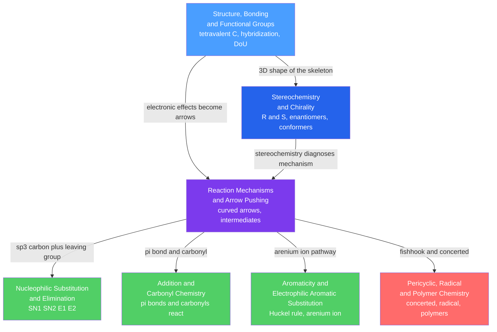

# 🔬 Organic Chemistry — Map of Content

> [!abstract] What This Section Covers
> Organic chemistry is the chemistry of carbon, and it is astonishingly systematic once you see its logic. This section builds from the ground up: first the **structure** (tetravalent carbon, hybridization, functional groups, degrees of unsaturation, and electronic effects), then the **three-dimensional arrangement** of that structure (chirality, R/S nomenclature, conformational analysis). With that foundation set, it introduces the universal language of **arrow-pushing mechanisms** — how electrons flow from nucleophile to electrophile through reactive intermediates — and then applies that language to the four great reaction families: **substitution/elimination** at saturated carbon, **addition and carbonyl** chemistry, **aromatic** substitution, and the **pericyclic/radical/polymer** trio. Each note opens with an everyday analogy at secondary level and deepens to graduate mechanism, physical-organic theory, and worked calculations.

## Concept Map

*(Blue = foundation, purple = the mechanistic hub, green = the reaction families, red = the most advanced synthesis-and-materials note. Arrows read "leads to" or "is the prerequisite for".)*

## Learning Path

1. [[Structure_Bonding_and_Functional_Groups]] — Start here: tetravalence, sp³/sp²/sp hybridization, σ vs π bonds, the functional-group table, degrees of unsaturation, and the inductive/resonance/hyperconjugation effects that govern all reactivity and acidity.
2. [[Stereochemistry_and_Chirality]] — Add the third dimension: enantiomers vs diastereomers, stereocenters and CIP R/S, optical activity, the 2ⁿ rule and meso compounds, and conformational analysis (chair cyclohexane).
3. [[Reaction_Mechanisms_and_Arrow_Pushing]] — Learn the universal language: curved arrows, nucleophiles/electrophiles, reactive intermediates and their stability, reaction-coordinate diagrams, the Hammond postulate, and (graduate) Marcus and Hammett analysis.
4. [[Nucleophilic_Substitution_and_Elimination]] — Apply it first at saturated carbon: SN1/SN2/E1/E2 decided by substrate, nucleophile/base, leaving group, and solvent, plus Zaitsev vs Hofmann regiochemistry.
5. [[Addition_and_Carbonyl_Chemistry]] — π additions to alkenes (Markovnikov vs anti-Markovnikov, syn vs anti) and nucleophilic addition to carbonyls, acyl substitution, and enol/enolate (aldol, Claisen) chemistry.
6. [[Aromaticity_and_Electrophilic_Aromatic_Substitution]] — Why aromatic rings substitute rather than add: Hückel's 4n+2 rule, the arenium-ion mechanism, the core EAS reactions, and directing/activating effects.
7. [[Pericyclic_Radical_and_Polymer_Chemistry]] — The advanced capstone: radical chains and BDE selectivity, concerted pericyclic reactions with Woodward–Hoffmann rules, and chain- vs step-growth polymerization.

## All Notes at a Glance

| Note | Difficulty | What You'll Learn |
|------|------------|-------------------|
| [[Structure_Bonding_and_Functional_Groups]] | Secondary → Graduate | Tetravalent carbon, hybridization and σ/π bonding, the functional-group table, degrees of unsaturation, isomerism, and the three electronic effects behind reactivity and acidity |
| [[Stereochemistry_and_Chirality]] | Secondary → Graduate | Enantiomers vs diastereomers, stereocenters and CIP R/S, optical activity and specific rotation, the 2ⁿ rule and meso forms, conformational analysis, prochirality and atropisomerism |
| [[Reaction_Mechanisms_and_Arrow_Pushing]] | Undergraduate → Graduate | The curved-arrow formalism, nucleophile/electrophile (HOMO–LUMO) logic, reactive intermediates, reaction-coordinate diagrams, the Hammond postulate, Marcus theory and Hammett LFERs |
| [[Nucleophilic_Substitution_and_Elimination]] | Undergraduate → Graduate | SN1/SN2/E1/E2 competition set by the four dials, Walden inversion vs racemization, Zaitsev vs Hofmann, KIE, Hughes–Ingold solvent theory, and ion pairs |
| [[Addition_and_Carbonyl_Chemistry]] | Undergraduate → Graduate | Electrophilic addition to alkenes (Markovnikov, syn/anti), nucleophilic addition to carbonyls, nucleophilic acyl substitution, enol/enolate (aldol, Claisen), conjugate addition and Felkin–Anh |
| [[Aromaticity_and_Electrophilic_Aromatic_Substitution]] | Undergraduate → Graduate | Hückel's 4n+2 rule and aromatic stabilization energy, the arenium-ion EAS mechanism, the core reactions, directing/activating effects, plus SNAr and benzyne |
| [[Pericyclic_Radical_and_Polymer_Chemistry]] | Undergraduate → Graduate | Radical chains and BDE selectivity, Diels–Alder and other pericyclic reactions with Woodward–Hoffmann rules, and chain- vs step-growth polymerization with the Carothers equation |

## Key Questions This Section Answers

- Why is carbon uniquely able to build the millions of molecules of biology and materials, and how do you read reactivity straight off a functional-group and hybridization picture?
- What is the difference between constitutional isomers, enantiomers, diastereomers, and conformers — and why can two mirror-image drugs behave completely differently in the body?
- What does a curved arrow actually mean, and how do intermediate stability and the Hammond postulate let you *predict* a reaction instead of memorizing it?
- Given an alkyl halide and a reagent, how do you decide among SN1, SN2, E1, and E2 — and whether you get inversion, racemization, or a specific alkene?
- When does a nucleophile attack a carbonyl versus add across an alkene, and what sets Markovnikov vs anti-Markovnikov and syn vs anti outcomes?
- Why does benzene substitute rather than add, and how do pre-installed groups steer the next electrophile ortho/para or meta?
- How do orbital-symmetry rules make the Diels–Alder work thermally, and why does step-growth polymerization demand conversions above 99%?

## Related Sections

- [[_MOC_Chemistry_Master|↑ Chemistry Master MOC]]
- [[_MOC_General_Chemistry|→ General & Foundational Chemistry]] — [[Chemical_Bonding_and_Molecular_Geometry]] supplies the VSEPR/hybridization and σ/π foundation this section builds on
- [[_MOC_Physical_Chemistry|→ Physical Chemistry]] — [[Chemical_Kinetics]] and [[Chemical_Thermodynamics]] quantify the barriers, rate laws, and driving forces sketched qualitatively here; [[Quantum_Chemistry_and_Atomic_Orbitals]] is the LCAO/MO origin of hybridization and Hückel theory
- [[_MOC_Analytical_Chemistry|→ Analytical Chemistry]] — [[NMR_Spectroscopy]] is the primary tool for elucidating the structures, connectivity, and stereochemistry taught in this section
- [[_MOC_Biochemistry|→ Biochemistry]] — [[Biomolecules_Overview]] assembles these functional groups and mechanisms (hemiacetal sugars, aldol/Claisen metabolism, homochiral amino acids) into living systems

## Key References

- Clayden, Greeves & Warren — *Organic Chemistry* (2nd ed.) — the modern mechanism-first standard used across all seven notes
- Carey & Sundberg — *Advanced Organic Chemistry, Part A: Structure and Mechanisms* — the graduate reference for intermediates and reactivity
- Anslyn & Dougherty — *Modern Physical Organic Chemistry* — Marcus theory, LFERs, HSAB, and Hammett analysis
- McMurry / Vollhardt & Schore — *Organic Chemistry* — excellent undergraduate surveys of nomenclature, stereochemistry, and reactions
- Eliel & Wilen (stereochemistry), Fleming (FMO / Woodward–Hoffmann), and Odian (polymerization) for the specialist topics

#MOC #Chemistry #OrganicChemistry
