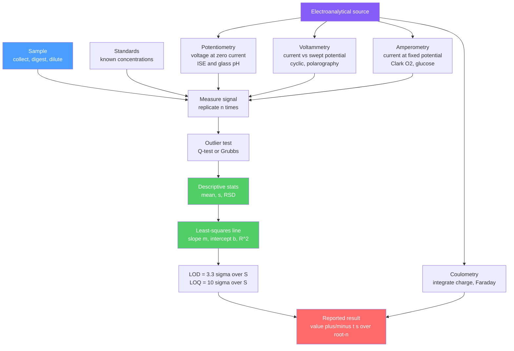

# 📊 Analytical Statistics and Electroanalysis

> [!abstract] TL;DR
> Every measurement is a number **plus an uncertainty** — analytical statistics is the discipline of turning raw signals into defensible answers. We separate **accuracy** (closeness to truth) from **precision** (reproducibility), model random scatter with the **normal distribution**, quote results as **confidence intervals** using Student's $t$, compare methods with $t$- and $F$-tests, reject outliers with the **Q-test**, and convert instrument response to concentration by **least-squares calibration**, reporting the **limit of detection** ($\text{LOD}=3.3\sigma/S$). **Electroanalysis** is the family of methods that read chemistry as an *electrical* signal: **potentiometry** (voltage of an ion-selective or glass pH electrode), **voltammetry** (current during a potential sweep — cyclic voltammetry, polarography), **amperometry** (the Clark oxygen and glucose sensors), and **coulometry** (charge counted absolutely via Faraday's law). At the graduate level the **Randles–Ševčík equation** links peak current to scan rate ($i_p\propto v^{1/2}$) and stripping methods push detection to trace levels.

## Intuition — analogy FIRST

Imagine weighing yourself on a bathroom scale. Step on it five times and you get five slightly different numbers — that spread is **random error** (precision). Now suppose the scale reads 2 kg heavy no matter what — that constant offset is **systematic error** (a bias that ruins accuracy even when precision is perfect). Good analysis chases *both*: average away the random jitter, and calibrate away the bias.

A calibration curve is just a **translation dictionary**. The instrument speaks in volts or nano-amps; you want millimolar. So you feed it a handful of standards whose concentrations you *know*, draw the straight line that best fits their responses, and thereafter read any unknown signal back through that line. Electroanalysis simply changes what the "instrument" is: instead of light, the messenger is electrons — a voltage that tracks ion activity, or a current that tracks how fast a species is being oxidized at an electrode.

---

## How It Works



---

## Key Concepts / Details

### Secondary Level

**Accuracy vs precision.** *Accuracy* = closeness to the true value; *precision* = agreement among repeats. A rifle grouping tightly but off-center is precise but inaccurate.

**Two kinds of error.**
- **Systematic (determinate)** error is constant or proportional — a miscalibrated pipette, an interfering species, an unclean cuvette. It shifts every result the same way and is *correctable* by calibration or blanks.
- **Random (indeterminate)** error is unpredictable scatter from noise and reading limits. It is *reduced* (never removed) by averaging more replicates.

**Descriptive statistics** for $n$ replicates $x_i$:

$$\bar{x} = \frac{1}{n}\sum_{i=1}^{n} x_i, \qquad s = \sqrt{\frac{\sum_{i}(x_i-\bar{x})^2}{n-1}}, \qquad \text{RSD} = \frac{s}{\bar{x}}$$

The relative standard deviation (RSD, or %CV when $\times 100$) lets you compare precision across different magnitudes. **Significant figures** communicate uncertainty: report only digits you can defend, and round at the *end* of a calculation.

### Undergraduate Level

**Normal distribution and confidence intervals.** Random errors follow a Gaussian; the true mean $\mu$ is bracketed by

$$\mu = \bar{x} \pm \frac{t\,s}{\sqrt{n}}$$

where $t$ is Student's $t$ for $n-1$ degrees of freedom and the chosen confidence level (95% is standard). Small $n$ inflates $t$ — the price of few replicates.

**Significance tests.**

| Test | Statistic | Question answered |
|------|-----------|-------------------|
| $t$-test (means) | $t=\dfrac{|\bar{x}_1-\bar{x}_2|}{s_p\sqrt{1/n_1+1/n_2}}$ | Do two methods agree? |
| $F$-test (variances) | $F=\dfrac{s_1^2}{s_2^2}$ (larger over smaller) | Is one method more precise? |
| Q-test (outlier) | $Q=\dfrac{\text{gap}}{\text{range}}$ | Reject a suspect point? |
| Grubbs (outlier) | $G=\dfrac{|x_{susp}-\bar{x}|}{s}$ | IUPAC-preferred outlier test |

with pooled deviation $s_p=\sqrt{\dfrac{(n_1-1)s_1^2+(n_2-1)s_2^2}{n_1+n_2-2}}$. Reject the null hypothesis (or the outlier) only when the statistic exceeds its tabulated critical value.

**Calibration by least squares.** Fit $y=mx+b$ minimizing $\sum(y_i-\hat{y}_i)^2$:

$$m=\frac{\sum(x_i-\bar{x})(y_i-\bar{y})}{\sum(x_i-\bar{x})^2}, \qquad b=\bar{y}-m\bar{x}, \qquad R^2 = 1-\frac{SS_{res}}{SS_{tot}}$$

The slope $m$ is the **calibration sensitivity**. Always inspect **residuals** — curvature or a fanning pattern reveals a bad model that a high $R^2$ can hide. The **standard-addition** method (spike the sample with known increments and extrapolate to the $x$-intercept, $c_x=|b/m|$) cancels *matrix effects*; the **internal-standard** method ratios the analyte signal to a spiked reference to cancel run-to-run drift and injection volume.

**Detection limits.** With $\sigma$ the standard deviation of the blank (or the residual $s_{y/x}$) and $S$ the slope:

$$\text{LOD}=\frac{3.3\,\sigma}{S}, \qquad \text{LOQ}=\frac{10\,\sigma}{S}, \qquad s_{y/x}=\sqrt{\frac{\sum(y_i-\hat{y}_i)^2}{n-2}}$$

**Propagation of uncertainty.** For sums/differences absolute variances add ($s_y^2=s_a^2+s_b^2$); for products/quotients *relative* variances add ($(s_y/y)^2=(s_a/a)^2+(s_b/b)^2$).

**Electroanalysis — the electrical toolkit** (cell theory lives in [[Electrochemistry]]):

| Method | Controlled | Measured | Signal law |
|--------|-----------|----------|-----------|
| Potentiometry | zero current | potential $E$ | Nernstian: $E=k+\dfrac{2.303RT}{z_iF}\log a_i$ |
| Voltammetry | swept $E$ | current $i$ | peak $i_p$ vs concentration |
| Amperometry | fixed $E$ | current $i$ | $i\propto C$ (diffusion-limited) |
| Coulometry | current/charge | total $Q$ | Faraday: $N=Q/(nF)$ |
| Conductometry | AC voltage | conductance | $\kappa\propto$ ion concentration |

- **Potentiometry:** an **ion-selective electrode (ISE)** gives a Nernstian $59.2/z_i$ mV per decade of activity at 25 °C. The **glass pH electrode** is the archetype: $E$ shifts $-59.2$ mV per pH unit; selectivity over interferents is captured by the Nikolsky–Eisenman coefficients.
- **Voltammetry:** sweep the potential and watch the current. **Cyclic voltammetry (CV)** applies a triangular waveform; a *reversible* couple shows peak separation $\Delta E_p \approx 59/n$ mV and equal anodic/cathodic peak heights. **Polarography** is voltammetry at a dropping-mercury electrode.
- **Amperometry:** hold the potential and read a diffusion-limited current proportional to concentration — the **Clark oxygen electrode** (O$_2$ reduced behind a membrane) and the **enzymatic glucose sensor** (glucose oxidase generates H$_2$O$_2$ measured amperometrically) are the workhorses.
- **Coulometry** counts electrons absolutely — no calibration curve needed, so it is a *primary* method. **Conductometry** tracks total ionic content and shines at titration endpoints.

### Graduate Level

**Randles–Ševčík equation.** For a reversible, diffusion-controlled couple in CV at 25 °C, the peak current is

$$i_p = 2.69\times10^{5}\; n^{3/2}\, A\, D^{1/2}\, C\, v^{1/2}$$

with $i_p$ in A, electrode area $A$ in cm$^2$, diffusion coefficient $D$ in cm$^2$/s, concentration $C$ in mol/cm$^3$, and scan rate $v$ in V/s. The diagnostic signature is $i_p\propto v^{1/2}$ (diffusion control) versus $i_p\propto v$ (surface-adsorbed species). Non-ideal $\Delta E_p > 59/n$ mV signals sluggish electron transfer (quasi-reversibility) or uncompensated resistance.

**Trace detection.** **Anodic stripping voltammetry (ASV)** electro-deposits (pre-concentrates) trace metals onto the electrode, then strips them back off during a sweep — pushing detection of Pb, Cd, and Cu down to sub-ppb (nanomolar) levels far below direct voltammetry.

**Chemometrics preview.** When signals are multivariate (full spectra, sensor arrays), simple univariate calibration fails. **Principal component analysis (PCA)** and **partial least squares (PLS)** regress concentration against many correlated channels at once, and are the bridge from analytical chemistry into [[_MOC_Data_Analytics_Master|data analytics]].

```python
import numpy as np
from scipy import stats

# Calibration standards: analyte concentration (mM) vs measured signal (nA)
conc   = np.array([0.0, 2.0, 4.0, 6.0, 8.0, 10.0])          # x, known standards
signal = np.array([0.03, 2.15, 3.98, 6.10, 7.95, 10.05])   # y, instrument response
n = len(conc)

# --- Least-squares linear regression: y = m*x + b ---
m, b, r, p, se_m = stats.linregress(conc, signal)          # slope, intercept, r
R2 = r**2

# Residual standard deviation s_{y/x}, with n-2 degrees of freedom
y_hat = m * conc + b
s_yx = np.sqrt(np.sum((signal - y_hat)**2) / (n - 2))

# --- Detection limits from residual std dev and slope (sensitivity S = m) ---
LOD = 3.3 * s_yx / m
LOQ = 10.0 * s_yx / m

print(f"slope (sensitivity) = {m:.4f} nA/mM")
print(f"intercept           = {b:.4f} nA")
print(f"R^2                 = {R2:.5f}")
print(f"s_y/x               = {s_yx:.4f} nA")
print(f"LOD                 = {LOD:.3f} mM   LOQ = {LOQ:.3f} mM")

# --- Back-calculate an unknown, with a 95% confidence interval ---
y0 = 5.40            # measured signal of the unknown (nA)
M  = 3               # replicate readings of the unknown
x0 = (y0 - b) / m    # estimated concentration

# Std error of predicted x (Miller & Miller):
xbar = conc.mean()
Sxx  = np.sum((conc - xbar)**2)
s_x0 = (s_yx / m) * np.sqrt(1/M + 1/n + (y0 - signal.mean())**2 / (m**2 * Sxx))

t  = stats.t.ppf(0.975, n - 2)     # Student's t, 95%, n-2 dof
ci = t * s_x0
print(f"\nunknown signal      = {y0} nA")
print(f"estimated conc      = {x0:.3f} +/- {ci:.3f} mM  (95% CI)")
```

---

## Real-World Notes

- **The glass pH electrode** is arguably the most-used chemical sensor on Earth — every pH meter in every lab and process line is a potentiometric ISE calibrated with two or three buffer standards to fix its slope and asymmetry potential.
- **Blood-gas and pulse analysers** in hospitals use the **Clark oxygen electrode** and companion ISEs (Na$^+$, K$^+$, Ca$^{2+}$) to report a metabolic panel in under a minute from a drop of blood.
- **Home glucose meters** are amperometric enzyme biosensors — billions of disposable test strips a year — a triumph of coupling electroanalysis to a specific enzyme (glucose oxidase or dehydrogenase).
- **Karl Fischer coulometry** measures trace water (down to ppm) by titrating with electrogenerated iodine, quantifying absolutely from charge via Faraday's law — no calibration curve required.
- **Environmental trace-metal monitoring** uses anodic stripping voltammetry to detect lead and cadmium in drinking water at sub-ppb levels, cheaper and more portable than ICP-MS for field screening.
- **Battery and catalyst R&D** treats cyclic voltammetry as "the spectroscopy of electrochemistry" — scan-rate studies via Randles–Ševčík reveal diffusion coefficients, electron-transfer kinetics, and reversibility of new materials.

---

## Common Pitfalls

1. **Confusing accuracy with precision.** Tight replicates (small $s$) do not prove correctness — a systematic bias leaves you precisely wrong. Verify accuracy against a certified reference material or a spike-recovery study.
2. **Using $n$ instead of $n-1$.** The sample standard deviation divides by $n-1$ (Bessel's correction). Using the population formula on a handful of replicates underestimates the true spread.
3. **Trusting a high $R^2$.** $R^2$ near 1 does not guarantee linearity — always plot residuals. Curvature or heteroscedasticity means you are extrapolating a bad model, especially outside the calibrated range.
4. **Ignoring matrix effects.** A complex sample can suppress or enhance signal versus clean standards. Use **standard addition** or an **internal standard** rather than an external calibration curve when the matrix is unknown.
5. **Over-reporting significant figures.** Copying an instrument's full digital readout implies impossible precision. The uncertainty (from the CI or propagation) sets the last meaningful digit.
6. **Neglecting electrode artifacts.** In potentiometry, junction potentials and a glass electrode's drifting asymmetry demand frequent recalibration; in CV, uncompensated $iR$ drop inflates $\Delta E_p$ and can fake irreversibility.

---

## Related Concepts

- [[_MOC_Analytical_Chemistry|↑ Section MOC]]
- [[Titrations_and_Volumetric_Analysis]] — classical wet quantitation; conductometric and potentiometric endpoint detection use exactly these electrical readouts
- [[Chromatography]] — internal-standard calibration and LOD/LOQ are the daily bread of chromatographic quantitation
- [[Mass_Spectrometry]] — isotope-dilution and calibration statistics share the same regression and uncertainty machinery
- [[UV_Vis_and_IR_Spectroscopy]] — Beer–Lambert calibration curves are the optical analogue of the electroanalytical ones here
- [[NMR_Spectroscopy]] — quantitative NMR relies on the same significant-figure and internal-standard discipline
- [[Electrochemistry]] — the cell thermodynamics and Nernst equation underlying every electroanalytical signal
- [[Stoichiometry_and_the_Mole]] — coulometry counts moles directly through Faraday's constant
- [[_MOC_Mathematics_Master]] — the probability, regression, and hypothesis-testing foundation of analytical statistics
- [[_MOC_Data_Analytics_Master]] — least squares, PCA, and PLS carry these ideas into full chemometrics

---

## Review Questions

1. **Secondary**: Four replicate titrations give 0.1012, 0.1009, 0.1015, and 0.1011 M. Compute the mean, sample standard deviation, and RSD. If the true value is 0.1000 M, is the dominant problem precision or accuracy?
2. **Undergraduate**: From a five-point calibration you obtain slope $S=214$ nA/µM, intercept $2.1$ nA, and blank standard deviation $\sigma=3.8$ nA. Calculate the LOD and LOQ, and back-calculate the concentration of a sample reading 96 nA. What extra information do you need to attach a 95% confidence interval?
3. **Graduate**: A cyclic voltammogram of a new complex shows $\Delta E_p = 95$ mV at 0.1 V/s, widening as scan rate increases, with $i_p$ scaling as $v^{1/2}$. Interpret each observation in terms of reversibility and mass transport, and outline how you would extract the diffusion coefficient from the Randles–Ševčík relation.

---

## Sources

- Harris, D. C. — *Quantitative Chemical Analysis*, 9th ed. (statistics, calibration, LOD)
- Skoog, West, Holler, Crouch — *Fundamentals of Analytical Chemistry*, 9th ed. (electroanalysis)
- Miller, J. N. & Miller, J. C. — *Statistics and Chemometrics for Analytical Chemistry*, 7th ed.
- Bard, A. J. & Faulkner, L. R. — *Electrochemical Methods: Fundamentals and Applications*, 2nd ed. (Randles–Ševčík)
- IUPAC — Recommendations on the presentation of results and limits of detection (Anal. Chem., 1980)

#chemistry #analytical-chemistry #statistics #calibration #limit-of-detection #electroanalysis #potentiometry #voltammetry #cyclic-voltammetry #coulometry #undergraduate #graduate
