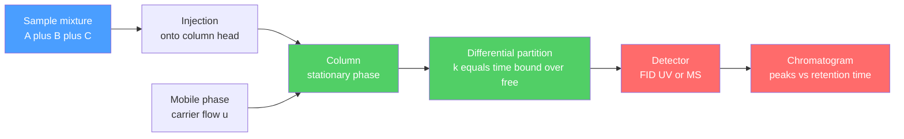

# 🌈 Chromatography

> [!abstract] TL;DR
> Chromatography separates a mixture by making its components race through a system where each partitions differently between a fixed **stationary phase** and a flowing **mobile phase**. Components that stick more to the stationary phase move slower, so they emerge at different times — this **differential migration** turns a mixture into a series of resolved peaks. The key metrics are the retention factor $k$, selectivity $\alpha$, plate count $N$ (band sharpness), and resolution $R_s$. Band broadening is governed by the **van Deemter equation** $H = A + B/u + Cu$, which sets the optimum flow rate. Modes span TLC, GC, HPLC, ion-exchange, size-exclusion and affinity, and coupling to spectrometers gives the workhorse hyphenated methods **GC–MS** and **LC–MS**.

## Intuition — analogy FIRST

Imagine a marathon where runners must periodically stop to shake hands with spectators lining the road. Some runners are more sociable — they stop often and finish late; others barely pause and finish early. Even though everyone started together and runs the same course, they arrive at the finish line spread out in time, sorted by *how much they interacted with the crowd*.

In chromatography the "crowd" is the stationary phase, the "running" is being swept along by the mobile phase, and the "finish-line clock" is the detector. Molecules that bind the stationary phase strongly lag behind; weakly-binding molecules elute first. Record arrival time versus signal and you get a **chromatogram** — a row of peaks, one per component.

---

## How It Works



---

## Key Concepts / Details

### Secondary Level

Two phases: a **stationary phase** (fixed — a solid, a coated bead, or a thin liquid film) and a **mobile phase** (moving — a gas or liquid that carries the sample). Each component of the mixture spends part of its time stuck to the stationary phase and part of its time moving. The more time it spends stuck, the slower it travels, so components come out at different times.

**Thin-layer chromatography (TLC)** is the simplest visual demo: a spot of mixture is placed near the bottom of a coated plate, a solvent climbs by capillary action, and each component travels a characteristic fraction of the solvent distance, the **retention factor**:

$$R_f = \frac{\text{distance travelled by spot}}{\text{distance travelled by solvent front}}$$

$R_f$ is always between 0 and 1. A polar compound on a polar plate barely moves (low $R_f$); a nonpolar compound races with the solvent (high $R_f$).

### Undergraduate Level

**Retention factor (capacity factor).** With $t_M$ the dead time (an unretained species) and $t_R$ the analyte's retention time:

$$k = \frac{t_R - t_M}{t_M}$$

$k$ is the ratio of time the analyte spends in the stationary vs mobile phase. Unlike $t_R$, it is independent of flow rate and column length, so it transfers between instruments.

**Selectivity** (separation factor) for two adjacent peaks A and B ($k_B > k_A$):

$$\alpha = \frac{k_B}{k_A} \ge 1$$

If $\alpha = 1$ the peaks co-elute — no chemistry can separate them under those conditions.

**Efficiency: theoretical plates.** Modelling the column as a stack of $N$ equilibration stages, a sharp band broadens into a Gaussian. From a peak with baseline width $w_b$ (tangent method) or full-width-half-max $w_{1/2}$:

$$N = 16\left(\frac{t_R}{w_b}\right)^2 = 5.54\left(\frac{t_R}{w_{1/2}}\right)^2, \qquad H = \frac{L}{N}$$

$H$ is the **plate height** (HETP, height equivalent to a theoretical plate); smaller $H$ means sharper peaks per unit length.

**Resolution.** How well two peaks are separated:

$$R_s = \frac{2\,(t_{R,B} - t_{R,A})}{w_{b,A} + w_{b,B}}$$

$R_s \ge 1.5$ is **baseline resolution** (peaks ~99.7 % separated). $R_s = 1.0$ leaves ~2–3 % overlap.

**van Deemter equation.** Plate height depends on mobile-phase linear velocity $u$:

$$H = A + \frac{B}{u} + Cu$$

| Term | Name | Physical origin | Behaviour |
|------|------|-----------------|-----------|
| $A$ | Eddy diffusion | Multiple flow paths through packing | ~constant in $u$ |
| $B/u$ | Longitudinal diffusion | Axial spreading of the band | dominates at **low** $u$ |
| $Cu$ | Mass-transfer resistance | Finite equilibration between phases | dominates at **high** $u$ |

Setting $dH/du = 0$ gives the optimum:

$$u_\text{opt} = \sqrt{\frac{B}{C}}, \qquad H_\text{min} = A + 2\sqrt{BC}$$

For open-tubular capillary GC there is no packing, so $A \to 0$ and the curve reduces to the **Golay equation** $H = B/u + Cu$ — hence capillary columns give very high $N$.

**Modes and instruments.**
- **Column chromatography** — gravity/flash separation for preparative organic work.
- **Gas chromatography (GC)** — volatile, thermally stable analytes; inert carrier gas (He, H₂, N₂); long thin capillary columns; **temperature programming** ramps the oven to elute high boilers; detectors FID (universal for organics) and TCD.
- **HPLC** — high-pressure liquid; **reversed phase** (nonpolar C18 stationary, polar mobile — polar elutes first) is the default; **normal phase** is the opposite polarity. **Gradient elution** ramps mobile-phase strength to sharpen late peaks. UV / diode-array (DAD) detection.
- **Ion-exchange** — separates charged species on charged resins (water deionization, protein purification).
- **Size-exclusion / gel filtration** — separates by hydrodynamic size; large molecules skip the pores and elute first (protein MW estimation and desalting — see [[Protein_Structure_and_Function]]).
- **Affinity** — a specific biological ligand (His-tag/Ni-NTA, antibody) captures one target with exquisite selectivity.

### Graduate Level

**The master resolution equation.** Combining efficiency, selectivity and retention shows the three independent knobs:

$$R_s = \frac{\sqrt{N}}{4}\cdot\frac{\alpha - 1}{\alpha}\cdot\frac{k}{1 + k}$$

- $N$ term — **efficiency**: $R_s \propto \sqrt{N}$, so doubling resolution by column length costs **4×** the length and analysis time. Diminishing returns.
- $\alpha$ term — **selectivity**: the most powerful lever. Change stationary phase, mobile phase pH, or temperature. As $\alpha \to 1$ this term $\to 0$ and no $N$ can rescue the separation.
- $k$ term — **retention**: rises steeply then plateaus; optimum $k \approx 2$–$10$. Too small ($k \to 0$) kills resolution; too large wastes time for negligible gain.

**Band broadening as diffusion.** A plate height is the variance added per unit length, $H = \sigma^2 / L$. The van Deemter terms are additive variances: molecular diffusion ($B = 2\gamma D_m$, obstruction factor $\gamma$), and mass-transfer resistance $C \propto d_f^2/D_s$ (stationary film) or $\propto d_p^2/D_m$ (particle diameter). This is why **sub-2-µm particles** in UHPLC flatten the C-term — the reduced $d_p$ shrinks $C$, permitting high $u$ with low $H$ (the basis of the extended **Knox equation** in reduced coordinates).

**Hyphenated methods.** Coupling chromatography to a spectrometer adds an orthogonal identity axis. **GC–MS** and **LC–MS** feed separated, time-resolved analytes into a mass analyser; the retention time confirms identity and the mass spectrum gives structure and confirmation. See [[Mass_Spectrometry]]. LC–MS/MS with multiple-reaction monitoring is the gold standard for quantitation in clinical and environmental labs.

```python
import numpy as np
import matplotlib.pyplot as plt

# van Deemter equation: H(u) = A + B/u + C*u  (plate height vs linear velocity)
#   A : eddy diffusion (multiple flow paths in a packed column)
#   B : longitudinal molecular diffusion of the band
#   C : resistance to mass transfer between mobile and stationary phases
A = 1.5e-3   # cm       (packing-dependent, ~constant)
B = 1.5e-2   # cm^2 / s
C = 3.0e-2   # s

u = np.linspace(0.02, 2.0, 500)      # linear velocity, cm/s
H = A + B / u + C * u                 # plate height, cm

# Analytic optimum: dH/du = 0  ->  u_opt = sqrt(B/C),  H_min = A + 2*sqrt(B*C)
u_opt = np.sqrt(B / C)
H_min = A + 2 * np.sqrt(B * C)
print(f"Optimum velocity   u_opt = {u_opt:.3f} cm/s")
print(f"Minimum plate height     = {H_min * 1e4:.1f} um")

plt.figure(figsize=(7, 5))
plt.plot(u, H * 1e4, lw=2, label="H = A + B/u + C u")
plt.plot(u, np.full_like(u, A) * 1e4, "--", alpha=0.6, label="A  (eddy diffusion)")
plt.plot(u, (B / u) * 1e4, "--", alpha=0.6, label="B/u  (longitudinal)")
plt.plot(u, (C * u) * 1e4, "--", alpha=0.6, label="C u  (mass transfer)")
plt.scatter([u_opt], [H_min * 1e4], color="k", zorder=5, label="optimum")
plt.xlabel("Linear velocity u (cm/s)")
plt.ylabel("Plate height H (um)")
plt.title("van Deemter Curve — Minimising Band Broadening")
plt.ylim(0, 400)
plt.legend()
plt.grid(True, alpha=0.3)
plt.tight_layout()
```

---

## Real-World Notes

- **Pharmaceutical QC** — reversed-phase HPLC (C18, UV/DAD) is the backbone of USP/EP purity and assay methods; every batch of a marketed drug is fingerprinted against a validated method with defined $R_s$ and tailing limits.
- **Forensics and doping control** — GC–MS confirms drugs, accelerants and explosives; anti-doping labs rely on GC–MS and LC–MS/MS because the mass spectrum plus retention time is court-admissible identification.
- **Clinical diagnostics** — LC–MS/MS quantifies vitamin D, steroids, immunosuppressants and newborn-screening metabolites with the sensitivity and specificity immunoassays lack.
- **Environmental monitoring** — GC–MS for dioxins, pesticides and volatile organics in water and air, routinely at parts-per-trillion.
- **Protein biochemistry** — size-exclusion (gel filtration) estimates molecular weight and desalts; ion-exchange and Ni-NTA affinity columns are standard purification steps for recombinant proteins (see [[Protein_Structure_and_Function]]).
- **Synthetic chemistry** — TLC monitors reaction progress in minutes (spot, develop, visualise under UV or stain), and flash column chromatography is the everyday preparative workhorse.

---

## Common Pitfalls

1. **Confusing $t_R$ with $k$.** Retention time drifts with flow rate, temperature and column age; the retention factor $k = (t_R - t_M)/t_M$ is normalised and comparable across systems. Always report $k$, not raw $t_R$, when characterising a method.
2. **Forgetting the dead time $t_M$.** You must inject an unretained marker to measure $t_M$; without it $k$, $\alpha$ and $N$ computed from retention are wrong.
3. **Chasing resolution with column length.** Since $R_s \propto \sqrt{N}$, doubling $R_s$ needs 4× the length and time. When peaks are close it is almost always cheaper to raise **selectivity** $\alpha$ (change phase, pH, or temperature) than to add plates.
4. **Reversed vs normal phase elution order.** In reversed phase (nonpolar C18, polar eluent) polar analytes leave first; normal phase is the opposite. Predicting the wrong order wrecks peak assignments.
5. **Running GC too hot or on the wrong analyte.** Nonvolatile or thermally labile compounds decompose in a GC inlet — use LC or derivatise. Likewise, running any column far above $u_\text{opt}$ lets the $Cu$ term blow up $H$ and smears peaks.
6. **Column overloading.** Injecting too much sample pushes the analyte off the linear region of its adsorption isotherm, producing fronting or tailing peaks and a collapse in apparent $N$.

---

## Related Concepts

- [[_MOC_Analytical_Chemistry|↑ Section MOC]]
- [[Titrations_and_Volumetric_Analysis]] — the classical wet-chemical quantitation that chromatography complements and often supersedes
- [[Mass_Spectrometry]] — the detector of choice for hyphenated GC–MS and LC–MS identification
- [[UV_Vis_and_IR_Spectroscopy]] — UV/DAD absorbance is the most common HPLC detector
- [[NMR_Spectroscopy]] — structural confirmation of chromatographically purified fractions
- [[Analytical_Statistics_and_Electroanalysis]] — calibration, limits of detection and error treatment for chromatographic data
- [[Solutions_and_Concentration]] — mobile-phase preparation and analyte concentration underpin every method
- [[Structure_Bonding_and_Functional_Groups]] — polarity and functional groups dictate partition behaviour and elution order
- [[Protein_Structure_and_Function]] — size-exclusion and affinity chromatography for biomolecule purification
- [[_MOC_Mathematics_Master]] — Gaussian statistics, variance addition and calculus optimisation behind the plate model

---

## Review Questions

1. **Secondary**: On a TLC plate a compound travels 3.6 cm while the solvent front travels 8.0 cm. Compute its $R_f$. If a second, more polar compound gives $R_f = 0.15$ on the same polar plate, which compound is more strongly retained, and why?
2. **Undergraduate**: A peak elutes at $t_R = 8.0$ min with $t_M = 1.0$ min and a baseline width of 0.40 min on a 25 cm column. Compute $k$, $N$ and the plate height $H$. If a neighbouring peak has $k = 6.5$, find the selectivity $\alpha$.
3. **Graduate**: Using $R_s = \tfrac{\sqrt N}{4}\cdot\tfrac{\alpha-1}{\alpha}\cdot\tfrac{k}{1+k}$, explain why increasing $\alpha$ from 1.05 to 1.10 can be far more effective than doubling $N$. Then derive $u_\text{opt}$ and $H_\text{min}$ from the van Deemter equation and state why sub-2-µm UHPLC particles shift the optimum to higher flow.

---

## Sources

- Skoog, Holler & Crouch — *Principles of Instrumental Analysis*, 7th ed., Ch. 26–33
- Harris — *Quantitative Chemical Analysis*, 9th ed., Ch. 22–25
- van Deemter, Zuiderweg & Klinkenberg (1956) — *Chem. Eng. Sci.* 5, 271 (band-broadening theory)
- Snyder, Kirkland & Dolan — *Introduction to Modern Liquid Chromatography*, 3rd ed.

#chemistry #analytical-chemistry #chromatography #HPLC #GC #vanDeemter #resolution #undergraduate #graduate
