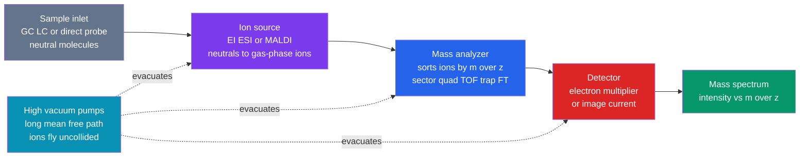

# 📊 Mass Spectrometry

> [!abstract] TL;DR
> Mass spectrometry (MS) is a **molecular weighing machine**: it converts neutral molecules into gas-phase ions, sorts them by **mass-to-charge ratio** $m/z$, and counts how many arrive at each value. Every instrument has the same four parts — an **ion source**, a **mass analyzer**, a **detector**, all under **high vacuum**. The ionization method sets the character of the spectrum: **electron ionization (EI)** is *hard*, giving the radical molecular ion $M^{+\bullet}$ plus a reproducible fragmentation fingerprint; **electrospray (ESI)** and **MALDI** are *soft*, delivering intact (often multiply charged) ions of fragile biomolecules. Analyzers — magnetic sector, quadrupole, time-of-flight, ion trap, and the Fourier-transform instruments **FT-ICR** and **Orbitrap** — trade resolution against cost and speed. Reading a spectrum means finding the **molecular ion**, decoding **isotope patterns** (the $M{+}2$ signatures of Cl and Br, the $M{+}1$ of $^{13}$C, the nitrogen rule), and following **neutral losses** and fragments back to a structure. Coupled to chromatography (GC–MS, LC–MS) and run in **tandem (MS/MS)**, it is the backbone of proteomics, metabolomics, forensics, and drug testing.

## Intuition — analogy FIRST

You cannot put a single molecule on a kitchen scale. So MS does something cleverer: it **gives the molecule an electric charge and then shoves it with electric and magnetic fields**, and watches how it moves. Heavy ions are sluggish and hard to deflect; light ions swerve and accelerate easily. Measuring that response — a radius, a flight time, an orbital frequency — reveals the ion's mass-to-charge ratio as precisely as any balance.

And there is a second trick. Hard ionization does not just weigh the molecule; it **smashes it first**. From the pile of fragments you reconstruct the original, exactly the way an archaeologist rebuilds a shattered pot from its shards — the pieces, and the ways it prefers to break, are as diagnostic as the whole. A mass spectrum is therefore two clues at once: *how much does the molecule weigh*, and *how does it fall apart*.

---

## How It Works



---

## Key Concepts / Details

### Secondary Level

The recipe is three steps: **ionize → separate by mass → detect**. The horizontal axis of every spectrum is $m/z$, the mass divided by the number of charges. Because most small-molecule ions carry a single charge ($z=1$), $m/z$ is just the mass in daltons — the peak position *is* the molecular weight.

Two peaks matter most at first glance. The **molecular ion** ($M^{+\bullet}$) sits at the mass of the whole molecule and gives its molar mass. The **base peak** is simply the tallest peak, defined as 100% relative intensity; everything else is scaled to it.

Nature hands you a free clue in the form of **isotopes**. Chlorine is a mix of $^{35}$Cl and $^{37}$Cl in roughly a 3-to-1 ratio, and bromine of $^{79}$Br and $^{81}$Br in almost 1-to-1. Each heavier isotope pushes part of the signal up by 2 mass units, producing a companion **$M{+}2$ peak**:

| Element present | $M : M{+}2$ intensity | Tell-tale sign |
|-----------------|-----------------------|----------------|
| one Cl | $\approx 3 : 1$ | $M{+}2$ about one-third of $M$ |
| one Br | $\approx 1 : 1$ | $M{+}2$ nearly equal to $M$ |
| two Cl | $\approx 9 : 6 : 1$ | $M,\ M{+}2,\ M{+}4$ triplet |
| two Br | $\approx 1 : 2 : 1$ | symmetric triplet, $M{+}2$ tallest |

### Undergraduate Level

**The four building blocks.** (1) The **ion source** makes gas-phase ions. (2) The **mass analyzer** disperses or filters them by $m/z$. (3) The **detector** (electron multiplier, or an image-current plate in FT instruments) counts them. (4) A **high vacuum** ($10^{-5}$ to $10^{-10}$ mbar) gives ions a mean free path long enough to reach the detector without colliding.

**Ionization methods — hard vs soft.**

| Method | Character | Ion produced | Best for |
|--------|-----------|--------------|----------|
| **EI** (70 eV electrons) | hard | $M^{+\bullet}$ radical cation + fragments | volatile small molecules, GC–MS, library search |
| **CI** (reagent gas) | soft | $[M+H]^+$ | when EI destroys the molecular ion |
| **ESI** (charged droplets) | soft | multiply charged $[M+nH]^{n+}$ | proteins, peptides, polar analytes, LC–MS |
| **MALDI** (laser + matrix) | soft | mostly singly charged $[M+H]^+$ | large, fragile biomolecules, paired with TOF |

EI knocks an electron out of the molecule, $M + e^- \rightarrow M^{+\bullet} + 2e^-$, leaving an odd-electron radical cation whose reproducible fragmentation underpins the **NIST/Wiley spectral libraries**. ESI is the enabler of biological MS: a protein of mass $M$ appears as a *ladder* of charge states at $m/z = (M + n\,m_{\mathrm H})/n$, which is **deconvoluted** back to a single accurate mass — and it brings huge molecules into the analyzer's low $m/z$ window.

**Mass analyzers.** A quadrupole applies combined RF and DC to four rods so that only ions within a narrow, scannable $m/z$ band survive to the detector (a *mass filter*). A **time-of-flight (TOF)** analyzer accelerates all ions through the same voltage and times their flight down a drift tube — light ions arrive first. FT instruments (FT-ICR, Orbitrap) trap ions and record the tiny **image current** they induce; a **Fourier transform** ([[Fourier_Transform]]) converts that time-domain signal into a spectrum.

**Reading isotope and nitrogen clues.**
- **$M{+}1$ from $^{13}$C** ($\approx 1.1\%$ natural abundance): its intensity relative to $M$ is about $1.1\% \times (\text{number of carbons})$ — literally a **carbon counter**.
- **$M{+}2$ from Cl, Br, and S** ($^{34}$S adds $\approx 4.4\%$): distinguishes halogen- and sulfur-containing ions at a glance.
- **Nitrogen rule**: an odd *nominal* molecular mass implies an **odd number of nitrogen atoms** (for compounds of C, H, N, O, S, and halogens); an even mass implies zero or an even number of N.

**Fragmentation & neutral losses.** Gaps between peaks name the pieces that fell off: $M{-}15$ (·CH₃), $M{-}18$ (H₂O), $M{-}28$ (CO or C₂H₄), $M{-}31$ (·OCH₃), $M{-}45$ (·COOH). Characteristic pathways — $\alpha$-cleavage next to a heteroatom, and the **McLafferty rearrangement** (γ-hydrogen transfer with β-cleavage in carbonyls) — map directly onto [[Structure_Bonding_and_Functional_Groups|functional groups]].

### Graduate Level

**Magnetic sector.** An ion accelerated through potential $V$ gains kinetic energy $zeV = \tfrac12 m v^2$; a magnetic field $B$ bends it onto a radius $r = mv/(zeB)$. Eliminating $v$:
$$\frac{m}{z} = \frac{e\,B^2 r^2}{2V}$$
Scanning $B$ (or $V$) sweeps successive $m/z$ across the exit slit. Pairing an electric sector with the magnet (**double focusing**) cancels the ions' kinetic-energy spread and delivers resolving power up to $\sim 10^5$.

**Time-of-flight.** From the same energy balance, $v = \sqrt{2zeV/m}$, so the flight time over length $L$ is
$$t = L\sqrt{\dfrac{m}{2zeV}}$$
Flight time scales as $\sqrt{m/z}$, giving an unlimited mass range at high speed. A **reflectron** (ion mirror) compensates for the spread in initial energies, sharpening resolution to $\sim 10^4$–$10^5$.

**Quadrupole stability.** Ion trajectories in the RF/DC field obey the **Mathieu equation**; only $(a,q)$ parameter pairs inside the stability diagram give bounded motion. Ramping RF and DC together keeps a single $m/z$ stable at a time — robust, compact, and the workhorse of quantitative LC–MS.

**Fourier-transform analyzers.** In **FT-ICR** a magnetic field forces ions onto cyclotron orbits at angular frequency $\omega_c = zeB/m$; in the **Orbitrap** ions oscillate axially about a spindle electrode at $\omega = \sqrt{(z/m)\,k}$, independent of energy. Both frequencies depend only on $m/z$, are measured as an image-current transient, and are converted to a spectrum by the [[Fourier_Transform|Fourier transform]] — the source of the highest resolving power available.

| Analyzer | Resolving power $m/\Delta m$ | Mass accuracy | Character |
|----------|------------------------------|---------------|-----------|
| Quadrupole | $\sim 10^3$ (unit) | $\sim 100$ ppm | cheap, fast, quantitation |
| Ion trap | $10^3$–$10^4$ | $\sim 100$ ppm | MS$^n$, benchtop |
| TOF (reflectron) | $10^4$–$6\times10^4$ | 1–5 ppm | fast, high mass range |
| Orbitrap | $10^5$–$5\times10^5$ | $<1$–3 ppm | high-res without a superconducting magnet |
| FT-ICR | $>10^6$ | $<1$ ppm | ultimate resolution, costly |

**Exact mass and molecular formula.** High-resolution MS measures the **monoisotopic mass** ($^{12}$C defined as exactly 12) to enough decimal places to pin a formula from the small **mass defects** of H, N, O. The textbook case is nominal mass 28: N₂ ($28.0062$), CO ($27.9949$), and C₂H₄ ($28.0313$) are resolved once $m/\Delta m \gtrsim 2500$.

**Tandem MS (MS/MS).** Select a **precursor ion**, break it by **collision-induced dissociation (CID)**, and scan the **product ions**. On a triple quadrupole this enables **selected/multiple reaction monitoring** (SRM/MRM) for ultra-selective quantitation; on Q-TOF and Orbitrap it drives **peptide sequencing**, where backbone cleavage yields the **b/y ion** ladder that reads a protein's sequence ([[Protein_Structure_and_Function]]). **Isotope-ratio MS (IRMS)** instead measures $^{13}$C/$^{12}$C, $^{15}$N/$^{14}$N and $^{18}$O/$^{16}$O to parts-per-thousand for provenance and forensics.

```python
import numpy as np
import matplotlib.pyplot as plt
from math import comb

# Natural isotope abundances; each heavy isotope shifts a peak by ~+2 Da.
AB = {"Cl": (0.7576, 0.2424),   # 35Cl, 37Cl
      "Br": (0.5069, 0.4931)}   # 79Br, 81Br

def halogen_pattern(n_cl=0, n_br=0):
    """Isotope envelope (M, M+2, M+4, ...) for an ion with n_cl Cl and n_br Br,
    built by convolving the binomial distribution of each element."""
    def binom(n, light, heavy):
        return np.array([comb(n, k) * light**(n - k) * heavy**k for k in range(n + 1)])
    poly = np.array([1.0])
    if n_cl:
        poly = np.convolve(poly, binom(n_cl, *AB["Cl"]))
    if n_br:
        poly = np.convolve(poly, binom(n_br, *AB["Br"]))
    poly = poly / poly.max() * 100.0           # normalise to base peak = 100%
    offsets = 2 * np.arange(len(poly))          # each heavy isotope ~ +2 Da
    return offsets, poly

cases = {"1 Cl": (1, 0), "2 Cl": (2, 0), "1 Br": (0, 1), "1 Cl + 1 Br": (1, 1)}
for label, (ncl, nbr) in cases.items():
    off, inten = halogen_pattern(ncl, nbr)
    print(label, {f"M+{o}": round(i, 1) for o, i in zip(off, inten) if i > 0.5})

# Stick spectrum for CH2Cl2 (nominal M+. = 84): the classic 2-Cl ~9:6:1 pattern
M = 84
off, inten = halogen_pattern(n_cl=2)
plt.stem(M + off, inten, basefmt=" ")
plt.xlabel("m/z"); plt.ylabel("Relative intensity (%)")
plt.title("Simulated isotope pattern: ion with 2 Cl  (approx 9:6:1)")
plt.tight_layout(); plt.show()
```

---

## Real-World Notes

- **Proteomics.** Shotgun/bottom-up workflows digest proteins to peptides, separate them by LC, and sequence each by MS/MS on an Orbitrap or Q-TOF; database search matches the **b/y ion** ladders to identify thousands of proteins per run ([[Protein_Structure_and_Function]]).
- **GC–MS in forensics and drug testing.** EI plus NIST-library matching is the legally accepted *confirmatory* test for drugs of abuse, arson accelerants, and environmental pollutants — the fragmentation fingerprint is nearly instrument-independent ([[Chromatography]]).
- **Clinical LC–MS/MS.** Newborn metabolic screening and therapeutic-drug monitoring rely on triple-quadrupole SRM: two mass filters plus a fragmentation step make it selective enough to quantify a drug in blood at ng/mL.
- **Metabolomics.** Untargeted profiling on FT-ICR/Orbitrap uses sub-ppm accuracy to assign molecular formulas to thousands of unknown metabolites in a single high-resolution scan.
- **Isotope-ratio MS.** Precise $^{13}$C/$^{12}$C ratios expose food adulteration (honey, olive oil), reveal synthetic vs endogenous testosterone in anti-doping, and reconstruct paleoclimate and diet from ice cores and bone.
- **Space exploration.** Miniature mass spectrometers ride planetary missions — SAM on the Curiosity rover, INMS on Cassini, ROSINA on Rosetta — sniffing atmospheres and cometary comas *in situ*, millions of kilometres from any lab.

---

## Common Pitfalls

1. **Confusing mass with $m/z$.** In ESI a multiply charged ion appears at an $m/z$ far *below* its true mass; assuming $z=1$ underestimates $M$ badly. Always deconvolute the charge-state ladder.
2. **Mixing nominal, monoisotopic, and average masses.** HRMS reports the **monoisotopic** mass (all lightest isotopes); large-molecule/low-res work reports the **average** mass. Comparing one to the other introduces errors of several daltons.
3. **Expecting a molecular ion that isn't there.** Hard EI can fragment $M^{+\bullet}$ completely (common for alcohols and branched chains). If no $M^{+\bullet}$ is visible, switch to a soft method (CI, ESI) rather than mis-assigning a fragment as the molecular ion.
4. **Misreading overlapping isotope contributions.** $^{13}$C ($M{+}1$, and $M{+}2$ once several carbons are present) and $^{34}$S ($M{+}2$) pile onto the halogen $M{+}2$; failing to subtract them corrupts halogen counting. Simulate the full pattern instead of eyeballing one peak.
5. **Over-applying the nitrogen rule.** It holds for the **odd-electron molecular ion** on the *nominal* mass scale and only for C, H, N, O, S, and halogens; even-electron fragment ions obey a shifted parity, so the rule can mislead if applied to fragments.
6. **Ignoring adducts and in-source artifacts.** ESI readily forms $[M+\mathrm{Na}]^+$, $[M+\mathrm{K}]^+$, dimers $[2M+\mathrm{H}]^+$, and in-source fragments; taking any of these for the protonated molecule gives the wrong mass.

---

## Related Concepts

- [[_MOC_Analytical_Chemistry|↑ Section MOC]]
- [[Chromatography]] — the separation front-end of GC–MS and LC–MS; hyphenation adds a retention-time dimension
- [[UV_Vis_and_IR_Spectroscopy]] — complementary structural readout; often run alongside MS on the same sample
- [[NMR_Spectroscopy]] — the other pillar of structure elucidation; MS gives mass and formula, NMR gives connectivity
- [[Titrations_and_Volumetric_Analysis]] — classical quantitation contrasted with instrumental MS quantitation
- [[Analytical_Statistics_and_Electroanalysis]] — calibration, LOD/LOQ, and error analysis behind every MS measurement
- [[Structure_Bonding_and_Functional_Groups]] — functional groups dictate the fragmentation and neutral losses seen in EI
- [[Protein_Structure_and_Function]] — MS/MS peptide sequencing is the engine of modern proteomics
- [[Fourier_Transform]] — image-current transient to spectrum in FT-ICR and Orbitrap analyzers
- [[Maxwells_Equations]] — Physics: the Lorentz force and ion optics that steer ions in sectors and traps
- [[Electromagnetic_Waves_and_Radiation]] — Physics: the laser photons that drive MALDI desorption
- [[_MOC_Mathematics_Master]] — convolution, binomial statistics, and Fourier analysis underlying spectra

---

## Review Questions

1. **Secondary**: A compound's molecular-ion region shows $M$ at $m/z$ 78 and $M{+}2$ at $m/z$ 80 with roughly equal intensity. Which halogen is present? How would your answer change if $M{+}2$ were only about one-third the height of $M$?
2. **Undergraduate**: An ESI spectrum of a pure protein shows peaks at $m/z$ 1001.0, 1101.0, and 1224.4 from three consecutive charge states. Explain how to identify $n$ for each peak and deconvolute them to the neutral mass $M$. Separately, an unknown shows an $M{+}1$ peak $\approx 6.6\%$ of $M$ — how many carbons does it contain?
3. **Graduate**: Starting from $zeV = \tfrac12 m v^2$, derive both the magnetic-sector relation $m/z = eB^2r^2/(2V)$ and the TOF relation $t = L\sqrt{m/(2zeV)}$. Then explain physically why FT-ICR resolving power improves with both magnetic-field strength and transient acquisition time.

---

## Sources

- McLafferty & Tureček — *Interpretation of Mass Spectra*, 4th ed. (University Science Books)
- Gross — *Mass Spectrometry: A Textbook*, 3rd ed. (Springer)
- de Hoffmann & Stroobant — *Mass Spectrometry: Principles and Applications*, 3rd ed. (Wiley)
- Harris — *Quantitative Chemical Analysis*, "Mass Spectrometry" chapter
- Makarov, A. (2000) — "Electrostatic Axially Harmonic Orbital Trapping," *Anal. Chem.* 72, 1156 (the Orbitrap)

---

#chemistry #analytical-chemistry #mass-spectrometry #ionization #massanalyzer #isotopepattern #tandemMS #proteomics #undergraduate #graduate
