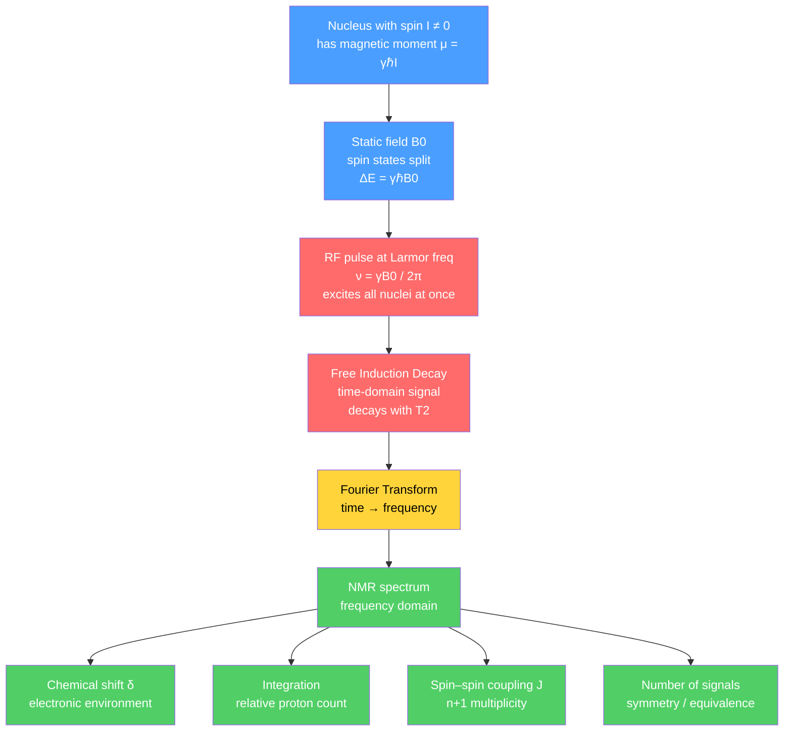

# 🧲 NMR Spectroscopy

> [!abstract] TL;DR
> Nuclear magnetic resonance is the chemist's most powerful tool for determining molecular structure. Nuclei with spin $I\neq 0$ (e.g. $^{1}$H and $^{13}$C, both $I=\tfrac12$) behave like tiny bar magnets; placed in a strong field $B_0$ they split into spin states separated by $\Delta E = \gamma\hbar B_0$ and absorb radiofrequency photons at the **Larmor frequency** $\nu=\gamma B_0/2\pi$. A $^{1}$H spectrum carries four independent pieces of information — **chemical shift** (electronic environment), **integration** (how many protons), **spin–spin coupling** (how many neighbours, via the $n+1$ rule), and **number of signals** (molecular symmetry). Modern instruments pulse all nuclei at once, record a **free induction decay (FID)**, and Fourier-transform it into the spectrum; 2D methods (COSY, HSQC, HMBC) and the NOE extend this to proteins, while MRI is the imaging cousin.

## Intuition — analogy FIRST

Imagine a room full of spinning tops, each carrying a small magnet. Switch on a giant magnetic field and every top starts to **precess** — wobbling around the field direction — but each precesses at a slightly different rate depending on the little cloud of electrons shielding it. Now tap them all at once with a radio pulse and listen: the room hums with a chord of frequencies. A skilled listener can pick out each note (each chemically distinct proton), hear how *loud* it is (how many protons), and notice that neighbouring tops make each other's notes split into tidy sub-tones (coupling). Fourier analysis is the ear that separates the chord into individual notes. That chord, read correctly, is a complete blueprint of the molecule.

---

## How It Works



---

## Key Concepts / Details

### Secondary Level

A nucleus with non-zero spin is a tiny magnet. In a strong external field it can align **with** the field (low energy) or **against** it (high energy). Absorbing a radio-wave photon of exactly the right energy flips it from low to high — this "resonance" is what NMR detects. Only certain isotopes work: $^{1}$H (nearly 100% abundant) and $^{13}$C are the workhorses.

A proton ($^{1}$H) spectrum answers four questions at a glance:

| Feature | Tells you | Example |
|---|---|---|
| **Chemical shift** $\delta$ | the *type* of environment | $\text{CH}_3$ near $1$ ppm, aromatic near $7$ ppm |
| **Integration** | *how many* protons | 3:2 area ratio = $\text{CH}_3$ : $\text{CH}_2$ |
| **Splitting** (multiplicity) | *how many neighbours* | quartet = 3 neighbouring H |
| **Number of peaks** | *how many distinct* H sets | 2 signals = 2 environments |

The splitting follows the **$n+1$ rule**: a proton with $n$ equivalent neighbours is split into $n+1$ lines, with intensities given by **Pascal's triangle**.

| Neighbours $n$ | Name | Intensity ratio |
|---|---|---|
| 0 | singlet | 1 |
| 1 | doublet | 1 : 1 |
| 2 | triplet | 1 : 2 : 1 |
| 3 | quartet | 1 : 3 : 3 : 1 |
| 4 | quintet | 1 : 4 : 6 : 4 : 1 |
| 6 | septet | 1 : 6 : 15 : 20 : 15 : 6 : 1 |

### Undergraduate Level

**The resonance condition.** A spin-$\tfrac12$ nucleus in field $B_0$ has two Zeeman levels separated by

$$\Delta E = \gamma\hbar B_0 = h\nu \quad\Rightarrow\quad \nu = \frac{\gamma B_0}{2\pi}$$

where $\gamma$ is the **gyromagnetic ratio**. For $^{1}$H, $\gamma = 2.675\times10^{8}\ \text{rad s}^{-1}\text{T}^{-1}$, so a $B_0 = 11.74$ T magnet gives $\nu \approx 500$ MHz — the radiofrequency region. A "500 MHz spectrometer" *is* an 11.74 T magnet. See [[Angular_Momentum_and_Spin]] for the quantum origin of $\gamma$ and the $2I+1$ states.

The catch is sensitivity: the Boltzmann population difference is minuscule,

$$\frac{N_{\text{upper}}}{N_{\text{lower}}} = e^{-\Delta E/k_BT} \approx 1 - \frac{\gamma\hbar B_0}{k_BT},$$

only $\sim 3\times10^{-5}$ excess spins per million at 500 MHz / 298 K. Higher $B_0$ increases this excess — one reason bigger magnets are better.

**Chemical shift.** Electrons circulating around a nucleus shield it from $B_0$, so each environment resonates slightly differently. To make the value field-independent we quote a *relative* shift in parts per million versus tetramethylsilane (TMS, $\delta \equiv 0$):

$$\delta\ (\text{ppm}) = \frac{\nu_{\text{sample}} - \nu_{\text{TMS}}}{\nu_{\text{spectrometer}}}\times 10^{6}$$

Electron-withdrawing groups **deshield** (move downfield, higher $\delta$); aromatic **ring currents** deshield ring protons strongly.

| $^{1}$H environment | $\delta$ (ppm) | | $^{13}$C environment | $\delta$ (ppm) |
|---|---|---|---|---|
| $\text{R–CH}_3$ | 0.8–1.2 | | alkyl C | 5–50 |
| $\text{R–CH}_2\text{–R}$ | 1.2–1.5 | | C–O / C–N | 50–90 |
| $\text{O=C–CH}_3$ (α to C=O) | 2.0–2.6 | | alkene / aromatic C | 100–150 |
| $\text{R–O–CH}$ | 3.3–4.5 | | ester / acid C=O | 160–185 |
| vinyl / aromatic H | 4.5–8.0 | | aldehyde / ketone C=O | 190–220 |
| aldehyde CHO | 9.5–10.0 | | | |
| carboxylic acid COOH | 10–13 | | | |

**Spin–spin (scalar) coupling.** Neighbouring nuclei feel each other's spin through the bonding electrons, splitting each signal. The separation is the **coupling constant $J$**, quoted in **Hz** because it is *field-independent* (unlike $\delta$). Typical vicinal $^{3}J_{\text{HH}}\approx 6$–$8$ Hz. Coupling is mutual: two coupled protons share the same $J$. For $n$ equivalent neighbours the pattern is $n+1$ lines; for two *inequivalent* sets ($n$ and $m$) the pattern is $(n+1)(m+1)$ lines (e.g. a **doublet of doublets**).

**$^{13}$C NMR.** Only 1.1% of carbon is $^{13}$C, so signals are weak and $^{13}$C–$^{13}$C coupling is statistically negligible. **Broadband proton decoupling** irradiates all protons, collapsing every carbon to a singlet — a clean map of one line per unique carbon. **DEPT** then counts attached hydrogens: in DEPT-135, CH and CH$_3$ point up, CH$_2$ points down, and quaternary carbons vanish.

**Fourier-transform NMR.** Continuous-wave scanning is obsolete. Modern **pulse–acquire** applies a short, hard RF pulse that excites *all* frequencies simultaneously, tipping the bulk magnetisation into the transverse plane. The precessing magnetisation induces a decaying oscillation in the coil — the **free induction decay (FID)**, a time-domain interferogram. A **Fourier transform** converts it to the familiar frequency-domain spectrum (see [[Fourier_Transform]] and, for the discrete algorithm actually used, [[DFT_and_FFT]]). Higher field helps twice over: **dispersion** (peak separation in Hz) grows $\propto B_0$ while $J$ stays fixed, so crowded spectra spread out and become first-order; and **sensitivity** rises steeply (SNR $\propto B_0^{3/2}$).

### Graduate Level

**Relaxation.** After the pulse the spins return to equilibrium by two independent processes:

- **$T_1$ (spin–lattice / longitudinal)** — recovery of $M_z$ by exchanging energy with the surroundings; sets how fast you can repeat an experiment.
- **$T_2$ (spin–spin / transverse)** — loss of phase coherence in $M_{xy}$; sets the natural linewidth via $\Delta\nu_{1/2} = 1/(\pi T_2)$. Always $T_2 \le T_1$.

**Nuclear Overhauser effect (NOE).** Dipolar cross-relaxation between spins **close in space** transfers polarisation, changing peak intensities. Because the effect scales as $1/r^6$, the NOE (and its 2D form, NOESY) yields internuclear **distances** — the backbone of solution-phase structure determination, including protein folds (see [[Protein_Structure_and_Function]]).

**Second-order (strong coupling) spectra.** The tidy $n+1$ rule and binomial intensities assume $\Delta\nu \gg J$ (the *weak coupling* limit). When the shift difference $\Delta\nu$ becomes comparable to $J$, spectra go **second-order**: line intensities distort (the "roofing" lean toward the coupling partner) and extra lines appear (AB, ABX systems). Raising $B_0$ increases $\Delta\nu$ in Hz while $J$ is unchanged, pushing spectra back toward first-order — another reason high field simplifies analysis.

**2D and beyond.** Multi-pulse sequences correlate two frequency axes:

| Experiment | Correlates | Through | Reveals |
|---|---|---|---|
| **COSY** | $^{1}$H–$^{1}$H | 2–3 bonds ($J$) | which protons are coupled |
| **HSQC** | $^{1}$H–$^{13}$C | 1 bond | which H sits on which C |
| **HMBC** | $^{1}$H–$^{13}$C | 2–3 bonds | connectivity across quaternary C / heteroatoms |
| **NOESY** | $^{1}$H–$^{1}$H | space (NOE) | protons within ~5 Å |

**MRI** is the imaging cousin: magnetic-field *gradients* encode position, and image contrast comes from spatial variation in $^{1}$H density and $T_1$/$T_2$ of tissue water.

---

## Code Demo

```python
# Simulate a first-order 1H FT-NMR spectrum of an ethyl group (-CH2-CH3).
# We build the multiplet lines from Pascal's triangle (the n+1 rule), synthesize
# the time-domain FID, then FFT it back to the frequency-domain spectrum.
import numpy as np
import matplotlib.pyplot as plt

SF = 500.0        # 1H spectrometer frequency in MHz  ->  1 ppm = 500 Hz dispersion
J  = 7.0          # scalar coupling constant in Hz (field-INDEPENDENT)
T2 = 0.4          # transverse relaxation time in s  ->  linewidth ~ 1/(pi*T2)

# (chemical shift in ppm, n neighbours -> n+1 rule, integration = number of H)
groups = [
    (1.20, 2, 3),   # CH3: 2 neighbours -> triplet, intensities 1:2:1
    (3.70, 3, 2),   # CH2: 3 neighbours -> quartet, intensities 1:3:3:1
]

def pascal_row(n):
    """Binomial coefficients = first-order multiplet intensities."""
    row = [1.0]
    for k in range(n):
        row.append(row[-1] * (n - k) / (k + 1))
    return np.array(row)

# Build the stick spectrum: each line's frequency (Hz) and amplitude
freqs, amps = [], []
for delta, n, nH in groups:
    ints = pascal_row(n)
    ints *= nH / ints.sum()                    # integral tracks the proton count
    for i, a in enumerate(ints):
        freqs.append(delta * SF + (i - n / 2) * J)   # split symmetrically by J
        amps.append(a)

# Synthesize the FID (sum of decaying cosines) and Fourier-transform it back
N, dt = 1 << 15, 1 / 6000.0                     # 6 kHz spectral width, 32768 points
t = np.arange(N) * dt
fid = sum(a * np.cos(2 * np.pi * f * t) * np.exp(-t / T2)
          for f, a in zip(amps, freqs))
spec = np.abs(np.fft.rfft(fid))
ppm  = np.fft.rfftfreq(N, dt) / SF              # convert Hz axis back to ppm

plt.figure(figsize=(8, 4))
plt.plot(ppm, spec)
plt.gca().invert_xaxis()                        # NMR convention: delta grows LEFT
plt.xlim(4.2, 0.8)
plt.xlabel("chemical shift  δ (ppm)")
plt.ylabel("intensity")
plt.title("Simulated 1H FT-NMR of an ethyl group (500 MHz)")
plt.tight_layout()
```

Running this recovers a **quartet at 3.7 ppm** (area 2) and a **triplet at 1.2 ppm** (area 3) — the textbook ethyl fingerprint — straight out of the FID via the FFT.

---

## Real-World Notes

- **Structure elucidation** — NMR is the default confirmation for any newly synthesized organic compound; a $^{1}$H/$^{13}$C pair plus HSQC/HMBC pins down connectivity that mass spectrometry alone cannot.
- **Protein and RNA structures** — multidimensional NMR (with $^{15}$N/$^{13}$C labelling and NOE-derived distances) solves solution-phase biomolecular structures, complementing X-ray crystallography for flexible or membrane systems.
- **Metabolomics and quality control** — quantitative $^{1}$H NMR (qNMR) fingerprints complex mixtures (blood, urine, wine, pharmaceuticals) without separation, exploiting integration as an absolute concentration readout.
- **MRI in medicine** — the same physics, imaged in space; $T_1$- and $T_2$-weighted contrast distinguishes soft tissues non-invasively.
- **Reaction monitoring** — in-line/benchtop NMR tracks conversion and detects intermediates in real time.
- **Materials and catalysis** — solid-state NMR (magic-angle spinning) probes zeolites, batteries, and polymers where solution methods fail.

---

## Common Pitfalls

1. **Confusing $\delta$ and $J$.** Chemical shift $\delta$ is reported in **ppm** and scales with field; coupling $J$ is reported in **Hz** and is field-independent. Never quote a coupling in ppm.
2. **Misreading multiplicity.** The $n+1$ rule counts *neighbouring* protons on adjacent atoms, **not** the protons producing the signal. A CH$_3$ next to a CH$_2$ is a **triplet** (2 neighbours), and the CH$_2$ is a **quartet** (3 neighbours).
3. **Forgetting equivalent protons don't split each other.** The three protons of a freely rotating CH$_3$ are equivalent and produce no mutual splitting; only *inequivalent* neighbours couple observably.
4. **Over-trusting integration on $^{13}$C.** $^{1}$H integrals are quantitative, but standard proton-decoupled $^{13}$C intensities are **not** (NOE enhancement and long $T_1$ distort them) — never read carbon peak heights as atom counts.
5. **Assuming first-order patterns.** When $\Delta\nu \approx J$, spectra become second-order (roofing, extra lines) and the $n+1$/Pascal analysis fails; move to higher field or simulate.
6. **Exchangeable protons wander.** OH, NH, and COOH shifts depend on concentration, solvent, and temperature, and may broaden or vanish (fast exchange) — don't over-interpret their exact $\delta$.

---

## Related Concepts

- [[_MOC_Analytical_Chemistry|↑ Section MOC]]
- [[UV_Vis_and_IR_Spectroscopy]] — complementary spectroscopies; NMR reads nuclei, UV/Vis reads electronic transitions, IR reads vibrations
- [[Mass_Spectrometry]] — pairs with NMR: MS gives molecular formula/mass, NMR gives connectivity
- [[Chromatography]] — separation step (often LC/GC) that purifies samples before NMR analysis
- [[Titrations_and_Volumetric_Analysis]] — classical quantitation, contrasted with instrumental qNMR
- [[Analytical_Statistics_and_Electroanalysis]] — error, signal-to-noise, and detection limits underlying every measurement
- [[Angular_Momentum_and_Spin]] — the quantum spin and gyromagnetic ratio that make resonance possible
- [[Wave_Particle_Duality_and_Uncertainty]] — the photon absorption and linewidth–lifetime relation behind $T_2$
- [[Fourier_Transform]] · [[DFT_and_FFT]] — the transform that turns the FID into a spectrum
- [[Molecular_Spectroscopy_and_Symmetry]] — selection rules and equivalence that set the number of signals
- [[Structure_Bonding_and_Functional_Groups]] · [[Stereochemistry_and_Chirality]] — the structural features NMR is used to assign
- [[Protein_Structure_and_Function]] — biomolecular targets solved by multidimensional NOE-based NMR
- [[_MOC_Mathematics_Master]] — Fourier analysis and linear algebra foundations

---

## Review Questions

1. **Secondary:** Ethanol ($\text{CH}_3\text{CH}_2\text{OH}$) shows three sets of protons. Predict the multiplicity and relative integration of the $\text{CH}_3$ and $\text{CH}_2$ signals, and explain which one appears further downfield and why.
2. **Undergraduate:** A compound shows a $^{1}$H doublet of doublets. (a) How many inequivalent neighbouring protons does the reporting proton have? (b) You measure a splitting of "3.5 ppm apart" on a 300 MHz instrument — convert this to a coupling constant in Hz, and state what it would read on a 600 MHz instrument.
3. **Graduate:** Explain, using the $1/r^6$ dependence of the NOE and the field dependence of $\Delta\nu/J$, why solving a protein structure benefits from both a NOESY experiment *and* the highest available magnetic field.

---

## Sources

- Pavia, Lampman, Kriz & Vyvyan — *Introduction to Spectroscopy*, 5th ed.
- Claridge — *High-Resolution NMR Techniques in Organic Chemistry*, 3rd ed.
- Levitt — *Spin Dynamics: Basics of Nuclear Magnetic Resonance*, 2nd ed.
- Keeler — *Understanding NMR Spectroscopy*, 2nd ed.

#chemistry #analytical-chemistry #NMR #spectroscopy #chemical-shift #spin-coupling #FID #FourierTransform #undergraduate #graduate
