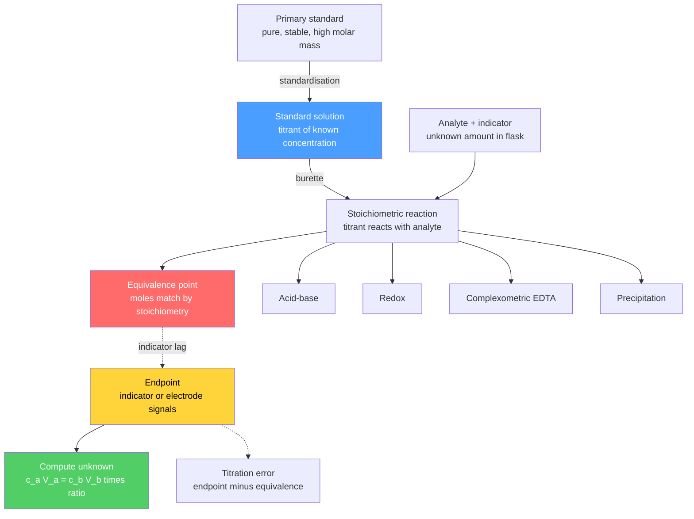

# 🧪 Titrations and Volumetric Analysis

> [!abstract] TL;DR
> **Titrimetric (volumetric) analysis** finds *how much* of an analyte is present by reacting it with a **standard solution** of exactly known concentration, delivered from a burette until the reaction is stoichiometrically complete at the **equivalence point**. The volume delivered, combined with the balanced equation, gives the unknown amount via $c_aV_a = c_bV_b$ (generalised by mole ratio). The observed **endpoint** (an indicator colour change or potential jump) approximates the equivalence point; their mismatch is the **titration error**. Four great families cover most analytes — **acid–base**, **redox**, **complexometric (EDTA)**, and **precipitation** — supplemented by **back-titration** and the water-specific **Karl Fischer** method. At the graduate level a titration curve is *derived* from charge and mass balance, the **sharpness of the break** scales with concentration and $K$, and **Gran plots** linearise the data to pin the equivalence volume with precision.

## Intuition — analogy FIRST

Imagine filling a glass under a tap until it is *exactly* full — not a drop more. You cannot know how much water fits by staring at the empty glass; instead you pour at a controlled rate and watch for the instant the surface reaches the brim. Titration is that idea made quantitative: the "glass" is your unknown analyte, the "tap" is a burette of reagent whose concentration you know to four figures, and the "brim" is the **equivalence point** where reagent and analyte have reacted in exact stoichiometric proportion.

The catch is that molecules do not flash a "FULL" sign. So we rig a **signal** — a dye that changes colour, an electrode whose voltage lurches, a precipitate that suddenly appears — that fires *as close as possible* to the true brim. The volume on the burette at that signal, read against a balanced equation, converts a length of liquid into moles of substance. Everything else in this note is engineering that signal to fire at the right moment.

---

## How It Works

A titration is a controlled, quantitative reaction run to completion. Standardisation establishes the titrant's exact concentration against a **primary standard**; the analyte reacts stoichiometrically; an indicator marks the endpoint; the delivered volume yields the answer.



---

## Key Concepts / Details

### Secondary Level

**The core equation.** For a reaction where 1 mole of titrant reacts with 1 mole of analyte,
$$c_a V_a = c_b V_b$$
and in general, for $a\,\mathrm{A} + b\,\mathrm{B} \rightarrow \text{products}$,
$$\frac{c_a V_a}{a} = \frac{c_b V_b}{b}.$$
Moles of titrant delivered ($=c_bV_b$) are converted to moles of analyte by the **mole ratio**, then to mass or concentration.

*Worked example.* Titrating $25.00\text{ mL}$ of HCl with $0.1000\text{ M}$ NaOH needs $23.40\text{ mL}$ to reach the endpoint. Moles NaOH $=0.1000\times0.02340=2.340\times10^{-3}$; by the 1:1 ratio, $c_{\text{HCl}} = 2.340\times10^{-3}/0.02500 = 0.0936\text{ M}$.

**Equivalence point vs endpoint.** The *equivalence point* is where stoichiometry is exact; the *endpoint* is where you *observe* the change. Good practice makes them coincide; the gap is the **titration error**.

**Indicator selection.** Pick an indicator whose colour-transition range brackets the pH (or property) *at* the equivalence point.

| Indicator | Transition range (pH) | Colour change |
|-----------|----------------------|---------------|
| Methyl orange | 3.1 – 4.4 | red → yellow |
| Bromothymol blue | 6.0 – 7.6 | yellow → blue |
| Phenolphthalein | 8.2 – 10.0 | colourless → pink |

### Undergraduate Level

**Standard solutions and primary standards.** A titrant's concentration must be known exactly. A **primary standard** is weighed directly to make a solution of certain concentration; it must be (1) very pure ($\geq 99.9\%$), (2) stable — non-hygroscopic, unreactive with air/CO$_2$, (3) of **high molar mass** to minimise the relative weighing error, and (4) of known, invariant stoichiometry, ideally cheap and soluble. Classic examples: potassium hydrogen phthalate (**KHP**, $204.22\text{ g mol}^{-1}$) for bases, anhydrous $\mathrm{Na_2CO_3}$ for acids, $\mathrm{K_2Cr_2O_7}$ and $\mathrm{Na_2C_2O_4}$ for redox. Reagents like NaOH, HCl, KMnO$_4$ and $\mathrm{Na_2S_2O_3}$ are **secondary standards** — they must be **standardised** against a primary standard because they absorb water/CO$_2$ or decompose.

**Acid–base curves.** The shape of the pH-vs-volume curve fixes the indicator:

| System | pH at equivalence | Indicator |
|--------|-------------------|-----------|
| Strong acid + strong base | 7.0 | bromothymol blue / phenolphthalein |
| Weak acid + strong base | > 7 (e.g. ~8.7) | phenolphthalein |
| Strong acid + weak base | < 7 (e.g. ~5.3) | methyl orange |

At the **half-equivalence point** of a weak acid, $[\mathrm{HA}]=[\mathrm{A^-}]$, so $\mathrm{pH}=pK_a$ — a buffer region. (See [[Acids_Bases_and_pH]].)

**Redox titrations.** Electron transfer instead of protons; the endpoint is often located by **cell potential** (potentiometrically) or a redox indicator.

| Titrant | Half-reaction | $E^\circ$ (V) | Notes |
|---------|--------------|---------------|-------|
| Permanganate | $\mathrm{MnO_4^- + 8H^+ + 5e^- \to Mn^{2+} + 4H_2O}$ | +1.51 | self-indicating (purple → colourless) |
| Dichromate | $\mathrm{Cr_2O_7^{2-} + 14H^+ + 6e^- \to 2Cr^{3+} + 7H_2O}$ | +1.33 | ferroin / diphenylamine indicator |
| Iodine | $\mathrm{I_2 + 2e^- \to 2I^-}$ | +0.54 | starch indicator; blue → colourless |

**Iodimetry** titrates a reductant *directly* with I$_2$; **iodometry** is indirect — the analyte liberates I$_2$ from excess I$^-$, and the I$_2$ is titrated with **thiosulfate** ($\mathrm{2S_2O_3^{2-}\to S_4O_6^{2-}+2e^-}$). The equivalence potential is the mole-weighted mean $E_{eq}=\dfrac{n_1E_1^\circ+n_2E_2^\circ}{n_1+n_2}$ (see [[Electrochemistry]]).

**Complexometric (EDTA) titrations.** EDTA (a hexadentate chelator) binds nearly every metal in a **1:1** ratio regardless of charge: $\mathrm{M^{n+}+Y^{4-}\to MY^{(n-4)}}$. Because only the fully deprotonated $\mathrm{Y^{4-}}$ chelates, the *usable* strength is the **conditional formation constant**
$$K'_{MY} = \alpha_{Y^{4-}}\,K_{MY},$$
where $\alpha_{Y^{4-}}$ is the pH-dependent fraction of EDTA present as $\mathrm{Y^{4-}}$. A **metal-ion indicator** (Eriochrome Black T, calmagite, murexide) is itself a weaker chelator whose free/complexed forms differ in colour. **Masking agents** ($\mathrm{CN^-}$ for Cu/Ni/Zn, triethanolamine for Al/Fe) hide interfering metals so one ion is titrated selectively (see [[Coordination_Chemistry_and_Ligand_Field_Theory]]).

**Precipitation titrations (halides with Ag$^+$).**

| Method | Indicator / signal | Conditions |
|--------|-------------------|-----------|
| Mohr | $\mathrm{CrO_4^{2-}}$ → red $\mathrm{Ag_2CrO_4}$ at endpoint | near-neutral pH |
| Volhard | back-titrate excess Ag$^+$ with SCN$^-$; Fe$^{3+}$ → red $\mathrm{FeSCN^{2+}}$ | acidic |
| Fajans | adsorption indicator (dichlorofluorescein) flips colour on the colloid | controlled pH |

**Back-titration.** When the direct reaction is slow, lacks a clean endpoint, or the analyte is insoluble/volatile, add a *known excess* of reagent, let it react fully, then titrate the leftover excess with a second standard. Example: dissolve $\mathrm{CaCO_3}$ in excess HCl, then back-titrate unreacted HCl with NaOH; the difference gives the carbonate.

**Karl Fischer titration (water).** A moisture-specific method: iodine consumes water in the presence of $\mathrm{SO_2}$ and a base,
$$\mathrm{I_2 + SO_2 + 3\,base + H_2O \to 2\,base{\cdot}HI + base{\cdot}SO_3},$$
so I$_2$ consumption is stoichiometric in water. **Coulometric** KF generates I$_2$ electrolytically for trace ($\mu$g) water.

### Graduate Level

**Constructing a curve from equilibrium.** A titration curve is not memorised — it is *solved*. Combine the **charge balance**, **mass balance**, and equilibrium constants. For a monoprotic acid ($C_{HA}$, volume $V_a$) titrated with strong base $\mathrm{Na^+}$:
$$[\mathrm{Na^+}] + [\mathrm{H^+}] = [\mathrm{A^-}] + [\mathrm{OH^-}], \qquad [\mathrm{A^-}] = C_{HA}\frac{K_a}{K_a+[\mathrm{H^+}]}.$$
Substituting gives one equation in $[\mathrm{H^+}]$ at every added volume — exactly what the Python demo below solves numerically (strong acid is the $K_a\to\infty$ limit).

**Sharpness of the break.** The magnitude of the pH (or potential) jump at equivalence — the maximum of $|d\mathrm{pH}/dV|$ — grows with **concentration** and with the reaction constant. For acid–base, the practical **titratability criterion** is $C\!\cdot\!K_a \gtrsim 10^{-8}$; weaker or more dilute acids give a break too shallow to detect. The same logic governs redox ($\Delta E^\circ$), complexometric ($K'_{MY}$) and precipitation ($1/K_{sp}$) titrations.

**Gran plots.** Instead of guessing where the curve is steepest, a **Gran plot** linearises data *away* from the equivalence point so the equivalence volume $V_e$ falls out as a straight-line intercept, immune to indicator lag. For a strong acid titrated with strong base, before equivalence,
$$(V_a+V_b)\,10^{-\mathrm{pH}} = C_b\,(V_e - V_b),$$
so plotting $(V_a+V_b)10^{-\mathrm{pH}}$ against $V_b$ gives a line whose x-intercept is $V_e$. The weak-acid variant plots $V_b\,10^{-\mathrm{pH}}$ vs $V_b$ (from Henderson–Hasselbalch), simultaneously yielding $V_e$ and $K_a$.

```python
import numpy as np
import matplotlib.pyplot as plt

Kw = 1.0e-14

def titration_pH(Vb, Ca, Va0, Cb, Ka=None):
    """pH after adding Vb litres of strong base (conc Cb) to an acid
    (conc Ca, initial volume Va0). Ka=None means a strong acid."""
    Vtot = Va0 + Vb
    Na   = Cb * Vb / Vtot        # [Na+] from titrant
    Ctot = Ca * Va0 / Vtot       # total acid, diluted

    def charge_balance(pH):      # residual, monotonically decreasing in pH
        H  = 10.0 ** (-pH)
        OH = Kw / H
        A  = Ctot if Ka is None else Ctot * Ka / (Ka + H)
        return Na + H - OH - A

    lo, hi = -1.0, 15.0          # bisection over pH
    for _ in range(80):
        mid = 0.5 * (lo + hi)
        if charge_balance(mid) > 0:
            lo = mid
        else:
            hi = mid
    return 0.5 * (lo + hi)

# 25.0 mL of 0.100 M acid titrated with 0.100 M NaOH
Ca, Va0, Cb = 0.100, 0.0250, 0.100
Ve = Ca * Va0 / Cb                        # equivalence volume = 25.0 mL
Vb = np.linspace(1e-5, 2 * Ve, 400)

pH_strong = [titration_pH(v, Ca, Va0, Cb) for v in Vb]             # HCl
pH_weak   = [titration_pH(v, Ca, Va0, Cb, Ka=1.8e-5) for v in Vb]  # acetic acid

plt.figure(figsize=(7, 5))
plt.plot(Vb * 1e3, pH_strong, label='Strong acid (HCl)', lw=2)
plt.plot(Vb * 1e3, pH_weak, '--', label='Weak acid (CH3COOH, pKa 4.74)', lw=2)
plt.axvline(Ve * 1e3, color='grey', ls=':', label='Equivalence volume')
plt.axhline(4.74, color='green', ls=':', alpha=0.6)      # half-equiv: pH = pKa
plt.scatter([Ve * 1e3, Ve * 1e3], [7.0, 8.72], zorder=5) # equivalence points
plt.xlabel('Volume of NaOH added (mL)')
plt.ylabel('pH')
plt.title('Titration curves: strong vs weak acid with strong base')
plt.legend(); plt.grid(True, alpha=0.3); plt.tight_layout(); plt.show()
```

---

## Real-World Notes

- **Pharmaceutical assay (USP/Ph. Eur.).** Many pharmacopoeial content assays are titrimetric: aspirin by back-titration of ester hydrolysis, and amine drugs by **non-aqueous titration** with perchloric acid in glacial acetic acid, where the leveling effect of water would otherwise flatten the endpoint.
- **Water hardness.** Total Ca/Mg hardness is measured by **EDTA** titration with Eriochrome Black T at pH 10; calcium alone is titrated with murexide at high pH — a daily test in municipal and boiler-water labs.
- **Dissolved oxygen (Winkler method).** An **iodometric** back-end: O$_2$ is fixed as MnO(OH)$_2$, which liberates I$_2$ from iodide, titrated with thiosulfate — still a reference method for aquatic environmental monitoring.
- **Kjeldahl nitrogen / protein.** Organic nitrogen is digested to ammonium, distilled as NH$_3$ into acid, and the excess acid **back-titrated** — the basis of the protein content printed on food labels.
- **Moisture control (Karl Fischer).** Trace water in pharmaceuticals, lubricants, transformer oil and solvents is quantified down to ppm by coulometric KF — impossible by ordinary drying.
- **Automated potentiometric autotitrators.** Modern QC labs (e.g. Metrohm/Mettler) replace visual indicators with electrodes and locate the endpoint from the derivative of the titration curve — the graduate-level maths made routine.

---

## Common Pitfalls

1. **Confusing equivalence with endpoint.** Choosing an indicator whose range does not bracket the equivalence pH gives a systematic **titration error** — e.g. methyl orange on a weak-acid/strong-base titration reads far too early.
2. **Treating a secondary standard as primary.** Solid NaOH absorbs water and CO$_2$; its "0.1 M" solution is never exactly 0.1 M. Always **standardise** against KHP before use.
3. **Carbonate error in alkali titrants.** Dissolved CO$_2$ forms carbonate in NaOH, producing a drifting or double endpoint. Use freshly boiled, CO$_2$-free water and store titrant protected from air.
4. **Iodometric handling errors.** I$_2$ volatilises and I$^-$ air-oxidises, biasing results; and starch added *too early* forms a tenacious blue complex that releases iodine slowly — add starch only near the endpoint.
5. **Ignoring EDTA's pH dependence.** Complexometric titrations run at the wrong pH give incomplete chelation because $\alpha_{Y^{4-}}$ collapses; forgetting the buffer or a masking agent lets interfering metals co-titrate.
6. **Reading and delivery mistakes.** Parallax on the burette meniscus, overshooting the endpoint by fast addition, and omitting an **indicator blank** each introduce avoidable error — approach the endpoint dropwise with swirling.

---

## Related Concepts

- [[_MOC_Analytical_Chemistry|↑ Section MOC]]
- [[Chromatography]] — separation-based quantitation, complementary to bulk titration when analytes co-exist
- [[Mass_Spectrometry]] — mass-based identification and trace quantitation beyond titrimetric detection limits
- [[UV_Vis_and_IR_Spectroscopy]] — spectrophotometric titrations and endpoint detection by absorbance
- [[NMR_Spectroscopy]] — structural confirmation of the species a titration only counts
- [[Analytical_Statistics_and_Electroanalysis]] — error propagation, endpoint statistics and potentiometric/coulometric detection
- [[Acids_Bases_and_pH]] — $K_a$, buffers and pH curves underpinning acid–base titrations
- [[Chemical_Equilibrium]] — the equilibrium constants that set every equivalence point
- [[Electrochemistry]] — Nernst potentials that locate redox endpoints
- [[Stoichiometry_and_the_Mole]] — the mole ratios converting volume delivered into amount
- [[Coordination_Chemistry_and_Ligand_Field_Theory]] — metal–ligand chelation behind EDTA titrations
- [[_MOC_Mathematics_Master]] — root-finding and linear regression used in curve solving and Gran plots

---

## Review Questions

1. **Secondary**: A $20.00\text{ mL}$ sample of vinegar is titrated with $0.500\text{ M}$ NaOH, requiring $33.6\text{ mL}$ to reach the phenolphthalein endpoint. (a) Calculate the concentration of acetic acid. (b) Why is phenolphthalein, not methyl orange, the correct indicator here?
2. **Undergraduate**: Explain why KHP is a suitable primary standard for NaOH but NaOH itself is not a primary standard. Then describe how you would use the standardised NaOH to determine the purity of an unknown weak acid, stating how you would choose the indicator.
3. **Graduate**: Starting from charge and mass balance, derive the master equation for the pH of a weak acid ($C_{HA}$, $K_a$) titrated with strong base, and show how the titratability criterion $C\!\cdot\!K_a \gtrsim 10^{-8}$ arises. Then outline how a Gran plot extracts the equivalence volume more precisely than reading the steepest point of the curve.

---

## Sources

- Harris, D. C. — *Quantitative Chemical Analysis*, 9th ed., Ch. 7–13
- Skoog, West, Holler & Crouch — *Fundamentals of Analytical Chemistry*, 9th ed.
- Christian, G. D. — *Analytical Chemistry*, 7th ed.
- Vogel — *Textbook of Quantitative Chemical Analysis*, 6th ed.

#chemistry #analytical-chemistry #titration #volumetric-analysis #acid-base #redox #EDTA #complexometric #precipitation #karl-fischer #gran-plot #secondary #undergraduate #graduate
