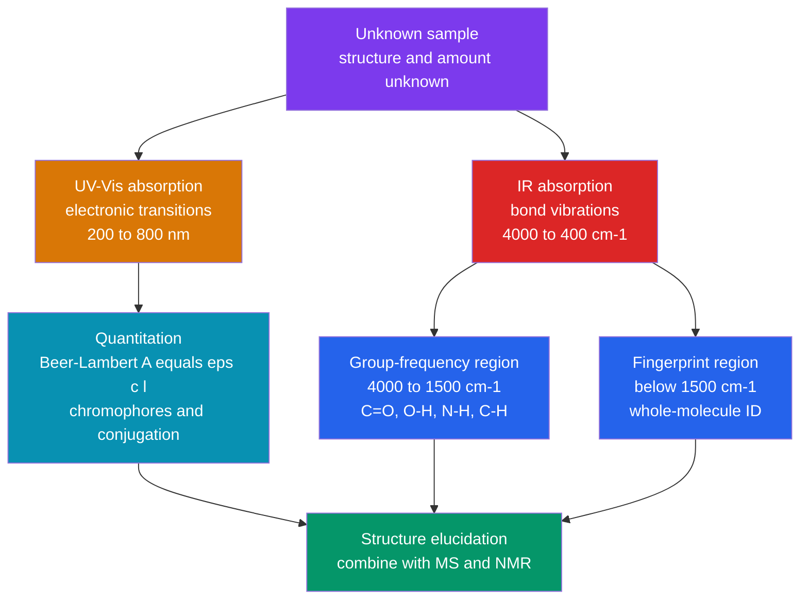

# 🌈 UV-Vis and IR Spectroscopy

> [!abstract] TL;DR
> UV–Vis and IR are the two workhorse **absorption** techniques of the analytical lab. **UV–Vis** promotes electrons across the HOMO–LUMO gap ($\sigma\to\sigma^*$, $n\to\sigma^*$, $\pi\to\pi^*$, $n\to\pi^*$); more conjugation shrinks that gap and shifts $\lambda_{max}$ to longer wavelength (a **bathochromic** shift), and the whole method is made *quantitative* by the **Beer–Lambert law** $A=\varepsilon c l$. **IR** excites bond vibrations, and the **group-frequency region** (~4000–1500 cm$^{-1}$) reads off functional groups (O–H, N–H, C≡N, C=O, C=C) while the **fingerprint region** (<1500 cm$^{-1}$) identifies the whole molecule. Modern IR is **FT-IR**: an interferogram is Fourier-transformed into a spectrum. Together with MS and NMR these form the standard **structure-elucidation** toolkit. (Underlying theory: [[Molecular_Spectroscopy_and_Symmetry]].)

## Intuition — analogy FIRST

Think of a molecule as a box of **tuning forks and colour filters**. Shine broadband light through it and it selectively *removes* certain frequencies — the ones that resonate with an internal energy jump. Infrared photons are gentle: they set specific **bonds jiggling** like plucked springs, and a carbonyl always "rings" near 1700 cm$^{-1}$ no matter what molecule it sits in — a portable signature. Ultraviolet and visible photons are far more energetic: they **kick an electron** to a higher orbital, and how easy that kick is depends on how spread-out the electron cloud already is. String more double bonds together (conjugation) and the electron becomes easier to excite, so the molecule starts absorbing longer, redder wavelengths — which is literally why carrots are orange.

Two complementary questions follow: IR asks *"what groups are present?"* and UV–Vis asks *"how much is there, and how conjugated?"* — the height of a UV–Vis peak, via Beer's law, is a ruler for concentration.

---

## How It Works



---

## Key Concepts / Details

### Secondary / Foundational Level

Both methods pass light through a sample and record the fraction absorbed. **Transmittance** is $T = I/I_0$ and **absorbance** is $A = -\log_{10} T = \log_{10}(I_0/I)$. A tall UV–Vis peak means the sample is concentrated or strongly coloured; a dip in an IR trace means a bond of the right stiffness is present. IR is plotted in **wavenumbers** $\tilde{\nu}=1/\lambda$ (cm$^{-1}$), which are directly proportional to energy — bigger number, bigger vibration.

### Undergraduate Level

**UV–Vis: electronic transitions.** Absorbing a UV/visible photon promotes an electron from a filled orbital to an empty one. Ordered by energy (highest first):

| Transition | Typical $\lambda_{max}$ | Example | $\varepsilon$ (L mol⁻¹ cm⁻¹) |
|-----------|------------------------|---------|-------------------------------|
| $\sigma\to\sigma^*$ | < 150 nm (vacuum UV) | alkanes | strong |
| $n\to\sigma^*$ | 150–250 nm | alcohols, amines, halides | 100–3000 |
| $\pi\to\pi^*$ | 170–250 nm (isolated) | alkenes, carbonyl | $10^3$–$10^4$ |
| $n\to\pi^*$ | 270–300 nm | ketones/aldehydes | 10–100 (weak) |

A **chromophore** is the light-absorbing unit (C=C, C=O, N=N, NO$_2$, aromatic ring). An **auxochrome** (–OH, –NH$_2$, –OR, –Cl) has lone pairs that extend the conjugation and shift the band. Key shift vocabulary: **bathochromic** = red shift (longer $\lambda$), **hypsochromic** = blue shift, **hyperchromic**/**hypochromic** = more/less intense.

**Conjugation lowers the HOMO–LUMO gap.** Each added conjugated double bond raises the HOMO and lowers the LUMO, so $\Delta E$ shrinks and $\lambda_{max} = hc/\Delta E$ grows:

$$\text{ethylene } 170\text{ nm} \to \text{butadiene } 217\text{ nm} \to \text{hexatriene } 258\text{ nm} \to \beta\text{-carotene (11 C=C) } \sim 450\text{ nm}$$

The **Woodward–Fieser rules** capture this quantitatively: start from a base value for the parent diene or enone and add empirical increments (+30 nm per extended conjugation, ring-residue and auxochrome terms) to predict $\lambda_{max}$.

**Beer–Lambert law (the quantitative core).**

$$A = \varepsilon\, c\, l$$

with $\varepsilon$ the **molar absorptivity** (L mol⁻¹ cm⁻¹, an intrinsic property of the species at that wavelength), $c$ the molar concentration, and $l$ the path length (usually a 1 cm cuvette). Because $A$ is linear in $c$, a **calibration curve** of standards gives a slope $\varepsilon l$ from which any unknown's concentration is read back. Reliable range is roughly $0.1 < A < 1.5$. **Deviations** come from (i) *chemical* effects — the analyte dissociating, associating, or reacting with concentration/pH; (ii) *instrumental* effects — polychromatic light and **stray radiation** flatten the curve at high $A$; (iii) *real* effects — refractive-index changes at high concentration.

**Double-beam instrumentation.** A tungsten lamp (visible) plus a deuterium lamp (UV) feed a monochromator; the beam is split into a **sample** path and a **reference** path (solvent + cuvette). The detector ratios the two, so lamp drift and solvent absorption cancel in real time — the recorded $A$ is purely the analyte's. Applications: concentration **assays** (DNA at 260 nm, protein at 280 nm), **reaction kinetics** (absorbance vs time), and the **d–d** and **charge-transfer** bands of transition-metal complexes (see [[Coordination_Chemistry_and_Ligand_Field_Theory]]).

**IR: molecular vibrations as springs.** A bond behaves like Hooke's-law masses on a spring; its stretch frequency depends on stiffness $k$ and reduced mass $\mu$, so light atoms and stiff/multiple bonds vibrate at high wavenumber. The spectrum splits into a diagnostic **group-frequency region** (~4000–1500 cm$^{-1}$) and a dense, molecule-specific **fingerprint region** (<1500 cm$^{-1}$):

| Bond / group | Wavenumber (cm⁻¹) | Character |
|--------------|-------------------|-----------|
| O–H (alcohol) | 3200–3550 | strong, **broad** |
| O–H (carboxylic acid) | 2500–3300 | very broad, overlaps C–H |
| N–H (amine/amide) | 3300–3500 | medium (1° amine = two bands) |
| ≡C–H (terminal alkyne) | ~3300 | sharp |
| C–H (sp²/aromatic) | 3000–3100 | just above 3000 |
| C–H (sp³ alkyl) | 2850–2960 | just below 3000 |
| C≡N (nitrile) | 2210–2260 | sharp, medium |
| C≡C (alkyne) | 2100–2260 | weak |
| C=O (carbonyl) | 1670–1780 | **very strong** |
| C=C (alkene) | 1620–1680 | medium |
| aromatic C=C (ring) | 1450–1600 | often ~1500 and ~1600 |
| aromatic overtones | 1650–2000 | weak combination bands |
| C–O | 1000–1300 | strong, fingerprint |

**Substituents shift the carbonyl.** The C=O position is diagnostic. Electron-withdrawing/inductive substituents *raise* it; conjugation and hydrogen bonding *lower* it; ring strain *raises* it:

$$\text{acid chloride }\sim1800 > \text{anhydride }\sim1820/1760 > \text{ester }\sim1740 > \text{aldehyde }\sim1725 > \text{ketone }\sim1715 > \text{acid }\sim1710 > \text{amide }\sim1650$$

Conjugation (e.g. an $\alpha,\beta$-unsaturated ketone) drops C=O by ~20–40 cm$^{-1}$; small rings raise it (cyclohexanone 1715 → cyclopentanone 1745 → cyclobutanone 1780).

**FT-IR and the interferometer.** Modern IR does not scan one frequency at a time. A **Michelson interferometer** with a moving mirror encodes *all* wavelengths at once into an **interferogram** $I(\delta)$ (signal vs mirror displacement $\delta$). The spectrum $B(\tilde{\nu})$ is its Fourier transform:

$$B(\tilde{\nu}) \propto \int_{-\infty}^{\infty} I(\delta)\, e^{-i 2\pi \tilde{\nu}\delta}\, d\delta$$

computed in practice by the FFT — see [[Fourier_Transform]]. Doing all frequencies simultaneously buys the multiplex (Fellgett) and throughput (Jacquinot) advantages: faster scans, better signal-to-noise. **ATR (attenuated total reflectance)** sampling presses the sample onto a high-index crystal (diamond/ZnSe/Ge); the evanescent wave penetrates ~0.5–2 μm, so solids, powders, and polymers are measured with zero prep.

**Combined structure elucidation.** No single method solves a structure. The standard workflow: **MS** → molecular formula and degrees of unsaturation (from the molecular ion and isotope/fragment pattern, see [[Mass_Spectrometry]]); **IR** → which functional groups exist (Is there a C=O? An O–H?); **UV–Vis** → extent of conjugation/aromaticity; **NMR** → the carbon–hydrogen skeleton and connectivity (see [[NMR_Spectroscopy]]). Cross-checking all four collapses the possibilities to one structure.

### Graduate Level

**Selection rules (recap).** Electronic transition intensity is set by the transition dipole $\boldsymbol{\mu}_{fi}=\langle\psi_f|\hat{\boldsymbol{\mu}}|\psi_i\rangle$ and its symmetry. **Spin rule**: $\Delta S = 0$. **Laporte (parity) rule**: for centrosymmetric species only $g\leftrightarrow u$ is allowed, so $d$–$d$ transitions ($g\to g$) are **Laporte-forbidden** and weak ($\varepsilon\sim1$–$100$, pale colours), whereas **charge-transfer** bands are Laporte-allowed and intense ($\varepsilon\sim10^3$–$10^4$) — e.g. permanganate MnO$_4^-$ is deep purple from an LMCT band near 525 nm. Full symmetry treatment: [[Molecular_Spectroscopy_and_Symmetry]].

**Extinction coefficient and oscillator strength.** The dimensionless **oscillator strength** $f$ links a measured band area to the transition probability:

$$f \approx 4.32\times10^{-9}\int \varepsilon(\tilde{\nu})\, d\tilde{\nu}$$

A fully allowed transition has $f\approx1$; forbidden ones have $f\ll1$. Thus $\varepsilon$ is not arbitrary — it encodes $|\boldsymbol{\mu}_{fi}|^2$.

**Quantitative multicomponent analysis.** For $m$ absorbing species whose spectra overlap, Beer's law is additive: at wavelength $j$, $A_j = l\sum_i \varepsilon_{ij} c_i$. Measuring at $\ge m$ wavelengths gives a linear system $\mathbf{A} = \mathbf{E}\,\mathbf{c}\,l$, solved by least squares $\hat{\mathbf{c}} = (\mathbf{E}^\top\mathbf{E})^{-1}\mathbf{E}^\top\mathbf{A}/l$. This is how a spectrophotometer resolves a mixture (or how chemometric PLS/PCR models quantify blends) without physical separation.

```python
import numpy as np
import matplotlib.pyplot as plt

# Beer-Lambert calibration: A = eps * c * l  (path length l = 1 cm cuvette).
# Six standards of a coloured dye measured on a UV-Vis spectrometer at lambda_max.
conc = np.array([0.0, 2.0, 4.0, 6.0, 8.0, 10.0])              # micromol / L
absb = np.array([0.002, 0.121, 0.238, 0.361, 0.475, 0.599])  # measured absorbance

# Least-squares straight line  A = m*c + b   (slope m = eps*l).
m, b = np.polyfit(conc, absb, 1)
fit = m * conc + b
ss_res = np.sum((absb - fit) ** 2)
ss_tot = np.sum((absb - absb.mean()) ** 2)
r2 = 1 - ss_res / ss_tot

# Back-calculate an unknown from its measured absorbance.
A_unknown = 0.305
c_unknown = (A_unknown - b) / m

print(f"slope (eps*l) = {m:.4f} L/micromol    intercept = {b:.4f}")
print(f"R^2 = {r2:.5f}")
print(f"unknown A = {A_unknown} -> c = {c_unknown:.2f} micromol/L")

plt.figure(figsize=(6, 4))
plt.scatter(conc, absb, color='tab:red', zorder=5, label='standards')
plt.plot(conc, fit, color='tab:blue', label=f'fit: A = {m:.3f}c + {b:.3f}')
plt.scatter([c_unknown], [A_unknown], color='tab:green', marker='*', s=220,
            zorder=6, label=f'unknown = {c_unknown:.2f} uM')
plt.xlabel('Concentration / micromol per L')
plt.ylabel('Absorbance (a.u.)')
plt.title('Beer-Lambert calibration curve')
plt.legend(); plt.grid(True, alpha=0.3); plt.tight_layout(); plt.show()
```

---

## Real-World Notes

- **Nucleic-acid / protein quantitation**: the A$_{260}$ reading (Beer–Lambert) gives DNA/RNA concentration, and the A$_{260}$/A$_{280}$ ratio flags protein contamination — a NanoDrop is UV–Vis with a sub-microlitre path length.
- **Pharma QC and forensics**: FT-IR fingerprint matching against spectral libraries identifies active ingredients, polymers, and unknown powders in seconds; ATR needs no sample prep.
- **Environmental monitoring**: colorimetric UV–Vis assays quantify nitrate, phosphate, and metal complexes in water; IR gas cells track CO, CO$_2$, and SO$_2$ emissions.
- **Enzyme kinetics**: NADH absorbs at 340 nm while NAD$^+$ does not, so absorbance-vs-time at 340 nm is the classic real-time readout of dehydrogenase activity.
- **Transition-metal colour**: the pale colours of hydrated $\text{[Cu(H}_2\text{O)}_6]^{2+}$ (weak $d$–$d$) versus the intense purple of permanganate (allowed charge transfer) is Laporte's rule made visible.
- **Blood-oxygen sensing**: pulse oximeters exploit the different visible/near-IR absorption of oxy- vs deoxy-haemoglobin — Beer–Lambert applied on a fingertip.

---

## Common Pitfalls

1. **Reading absorbance above the linear range.** Beyond $A\approx1.5$, stray light and detector nonlinearity bend the calibration curve toward the concentration axis; **dilute** the sample rather than trust the number.
2. **Ignoring the reference/baseline.** A UV–Vis spectrum must be blanked against the pure solvent and cuvette; an IR spectrum needs background subtraction (and ATR needs a clean crystal). Otherwise solvent bands masquerade as analyte signal.
3. **Over-reading the fingerprint region.** Below 1500 cm$^{-1}$ the bands are diagnostic for *identity by matching*, not for assigning individual bonds — do not try to name every peak.
4. **Confusing wavenumber with wavelength.** IR uses cm$^{-1}$ (∝ energy): a *higher* wavenumber is a *bigger* energy gap. Do not treat the axis like nanometres.
5. **Assuming every carbonyl is 1715.** The C=O position is a clue, not a constant — esters, acids, amides, acid chlorides, conjugation, and ring strain all shift it by tens of cm$^{-1}$; use the shift, don't ignore it.
6. **Expecting strong UV–Vis bands from $d$–$d$ transitions.** They are Laporte-forbidden and weak; a genuinely intense colour usually signals a charge-transfer band, not a ligand-field one.

---

## Related Concepts

- [[_MOC_Analytical_Chemistry|↑ Section MOC]]
- [[Titrations_and_Volumetric_Analysis]] — sibling classical-quantitation method; spectrophotometric endpoints bridge the two
- [[Chromatography]] — sibling separation technique; UV and IR are common HPLC/GC detectors
- [[Mass_Spectrometry]] — sibling; provides the molecular formula that anchors structure elucidation
- [[NMR_Spectroscopy]] — sibling; the carbon–hydrogen skeleton complementing IR's functional-group view
- [[Analytical_Statistics_and_Electroanalysis]] — sibling; calibration, least squares, and error propagation behind Beer's law
- [[Molecular_Spectroscopy_and_Symmetry]] — the quantum + group-theory *theory* this note applies practically
- [[Structure_Bonding_and_Functional_Groups]] — the functional groups whose IR/UV signatures we read
- [[Aromaticity_and_Electrophilic_Aromatic_Substitution]] — aromatic conjugation and its UV absorption
- [[Coordination_Chemistry_and_Ligand_Field_Theory]] — d–d and charge-transfer bands, Laporte rule, colour
- [[Electromagnetic_Waves_and_Radiation]] — Physics: the light that drives every absorption
- [[Atomic_Models_and_Spectroscopy]] — Physics: line spectra and selection rules
- [[Fourier_Transform]] — Signals: interferogram → spectrum in FT-IR
- [[_MOC_Mathematics_Master]] — least squares and linear algebra for multicomponent analysis

---

## Review Questions

1. **Secondary / Foundational**: A dye solution transmits 25% of the incident light through a 1 cm cell. What is its absorbance? If you doubled the path length, what would the absorbance become, and why?
2. **Undergraduate**: You measure five standards of a compound and obtain a Beer–Lambert line $A = 0.060\,c + 0.003$ (with $c$ in μM). An unknown reads $A = 0.402$. (a) Find its concentration. (b) State two reasons the plot might curve at high concentration. (c) In its IR spectrum, would a strong band at 1735 cm$^{-1}$ suggest a ketone, an ester, or an amide?
3. **Graduate**: Explain why $d$–$d$ transitions in an octahedral complex are weak while a permanganate charge-transfer band is intense, using the Laporte and spin selection rules and the oscillator-strength relation $f \approx 4.32\times10^{-9}\int\varepsilon\,d\tilde{\nu}$. Then outline how you would resolve a two-component mixture with overlapping UV–Vis spectra.

---

## Sources

- Harris — *Quantitative Chemical Analysis*, 9th ed. (Beer–Lambert, instrumentation)
- Skoog, Holler & Crouch — *Principles of Instrumental Analysis*, 7th ed.
- Pavia, Lampman, Kriz & Vyvyan — *Introduction to Spectroscopy*, 5th ed. (group frequencies, worked spectra)
- Silverstein, Webster & Kiemle — *Spectrometric Identification of Organic Compounds*, 8th ed.
- Atkins & de Paula — *Physical Chemistry* (electronic transitions, oscillator strength)

---

#chemistry #analytical-chemistry #spectroscopy #uvvis #infrared #ftir #beerlambert #groupfrequencies #chromophore #conjugation #structure-elucidation #undergraduate #graduate
