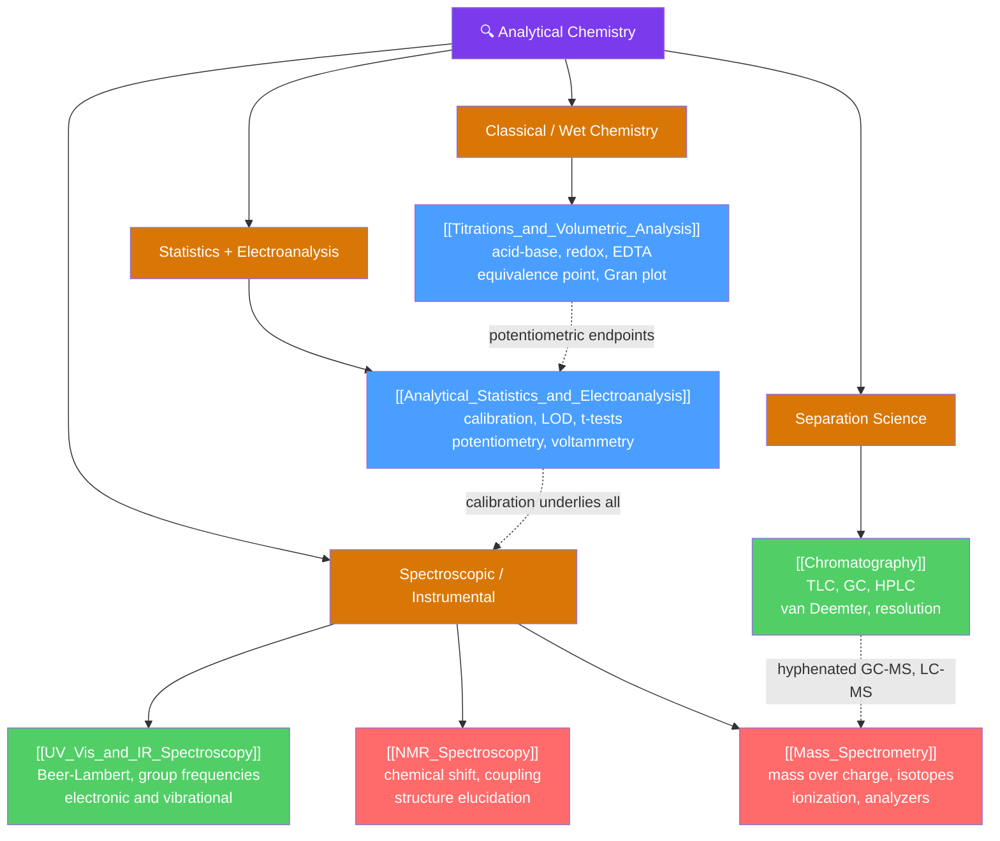

# 🔍 Analytical Chemistry — Map of Content

> [!abstract] What This Section Covers
> Analytical chemistry is the science of *how much* and *what is it* — the measurement toolkit that turns a sample into a defensible number and a structure. This section spans the two great traditions: **classical wet chemistry**, where a titration counts moles by stoichiometric reaction, and **instrumental analysis**, where light, mass, spin, or electrons report on matter. It runs from the burette and the equivalence point through **separation science** (chromatography), the **spectroscopic pillars** of structure elucidation (UV–Vis, IR, NMR, mass spectrometry), and the **electroanalytical** methods (potentiometry, voltammetry, coulometry) — all anchored by the **statistics** of calibration, error propagation, and detection limits that make every result trustworthy. Each note opens with an everyday analogy and deepens to graduate-level theory, worked calculations, and real-world laboratory practice.

## Concept Map

*(Amber = technique families, Blue = foundational entry points, Green = intermediate, Red = advanced structure-elucidation methods; dashed arrows show how techniques couple.)*

---

## Learning Path

*Recommended order for a first pass through analytical chemistry — from classical foundations to hyphenated instrumental methods:*

1. [[Titrations_and_Volumetric_Analysis]] — start here: the classical, intuitive way to answer "how much?" by reacting an analyte with a standard solution to its equivalence point.
2. [[Analytical_Statistics_and_Electroanalysis]] — the measurement discipline (error, calibration, LOD/LOQ) that every later technique depends on, plus the electrical-signal methods.
3. [[UV_Vis_and_IR_Spectroscopy]] — the first instrumental step: absorption methods that quantify concentration (Beer–Lambert) and identify functional groups.
4. [[NMR_Spectroscopy]] — the most powerful structure tool: reading the carbon–hydrogen skeleton from chemical shift, integration, and coupling.
5. [[Mass_Spectrometry]] — molecular weight and formula from mass-to-charge ratios, isotope patterns, and fragmentation.
6. [[Chromatography]] — separation science that resolves mixtures and feeds the hyphenated workhorses GC–MS and LC–MS.

---

## All Notes in This Section

| Note | Core Idea | Difficulty |
|------|-----------|------------|
| [[Titrations_and_Volumetric_Analysis]] | Classical volumetric quantitation: react an analyte with a standard solution to the equivalence point — acid–base, redox, EDTA/complexometric, precipitation, back-titration, and Karl Fischer — with curve theory and Gran plots. | Secondary → Graduate |
| [[Chromatography]] | Separation by differential migration between a stationary and mobile phase — TLC, GC, HPLC, ion-exchange, size-exclusion, affinity — governed by retention factor, resolution, and the van Deemter equation. | Undergraduate → Graduate |
| [[Mass_Spectrometry]] | A molecular weighing machine: ionize, sort by mass-to-charge ratio, detect — EI/ESI/MALDI sources, sector/quadrupole/TOF/Orbitrap analyzers, isotope patterns, and tandem MS. | Undergraduate → Graduate |
| [[UV_Vis_and_IR_Spectroscopy]] | The two workhorse absorption methods: UV–Vis electronic transitions quantified by the Beer–Lambert law, and IR bond vibrations read through group frequencies and FT-IR. | Undergraduate → Graduate |
| [[NMR_Spectroscopy]] | The most powerful structure tool: chemical shift, integration, spin–spin coupling, and symmetry extracted from an FID by Fourier transform, extended by 2D methods and MRI. | Undergraduate → Graduate |
| [[Analytical_Statistics_and_Electroanalysis]] | Turning raw signals into defensible numbers — error, calibration, LOD/LOQ, and significance tests — plus electroanalysis: potentiometry, voltammetry, amperometry, and coulometry. | Secondary → Graduate |

---

## Key Questions This Section Answers

- How do you determine *how much* of a substance is in a sample, and why does the observed endpoint of a titration differ from the true equivalence point?
- When components are mixed together, how do you separate them — and why is raising selectivity $\alpha$ usually cheaper than adding column plates?
- Given an unknown molecule, how do MS (mass and formula), IR (functional groups), UV–Vis (conjugation), and NMR (connectivity) combine to elucidate a single structure?
- What makes a measurement *trustworthy* — how do accuracy, precision, calibration, and the limit of detection turn a signal into a defensible result?
- How can chemistry be read as an electrical signal, from the glass pH electrode to cyclic voltammetry and the amperometric glucose sensor?

---

## Related Sections

- [[_MOC_Chemistry_Master|↑ Chemistry Master MOC]]
- [[_MOC_Physical_Chemistry|→ Physical Chemistry]] — [[Electrochemistry]] supplies the Nernst potentials behind electroanalysis, and [[Molecular_Spectroscopy_and_Symmetry]] is the quantum theory behind every spectroscopic method.
- [[_MOC_Organic_Chemistry|→ Organic Chemistry]] — [[Structure_Bonding_and_Functional_Groups]] and [[Stereochemistry_and_Chirality]] are the structural features that spectroscopy is used to assign.
- [[_MOC_General_Chemistry|→ General Chemistry]] — [[Acids_Bases_and_pH]], [[Chemical_Equilibrium]], and [[Stoichiometry_and_the_Mole]] underpin titration curves and every mole calculation.
- [[Fourier_Transform]] · [[DFT_and_FFT]] — Signals: the mathematical heart of FT-NMR, FT-IR, and the FT mass analyzers.

#MOC #Chemistry #AnalyticalChemistry
