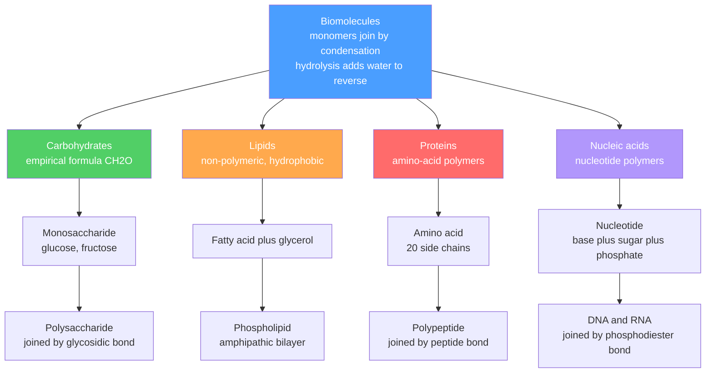

# 🧬 Biomolecules Overview

> [!abstract] TL;DR
> Life runs on just **four classes** of organic molecule — **carbohydrates, lipids, proteins, and nucleic acids** — built almost entirely from C, H, O, N, P, and S. Three of the four are **polymers**: chains of small monomers (sugars, amino acids, nucleotides) joined by a **condensation** reaction that expels water, and cleaved by its reverse, **hydrolysis**. Lipids are the exception — they self-assemble through the physics of the **hydrophobic effect** rather than covalent polymerization. The same **functional-group chemistry** from [[Structure_Bonding_and_Functional_Groups]] governs every reaction, and the **chirality** of [[Stereochemistry_and_Chirality]] is why life is **homochiral**: L-amino acids and D-sugars only. Water — through hydrogen bonding, the hydrophobic effect, and pH buffering — is the medium that makes all of it work.

## Intuition — analogy FIRST

Think of the cell as a **factory that builds everything from a handful of standard bricks**. There are only ~20 kinds of protein brick (amino acids), a few sugar bricks, four nucleotide bricks, and some greasy lipid bricks. Every structure in biology — an enzyme, a strand of DNA, a cell membrane, a starch granule — is these same bricks clicked together in a different order.

And the clicking mechanism is identical across brick types: to **join** two bricks you **squeeze out a water molecule** (condensation); to **take them apart** you **add water back** (hydrolysis). So digestion, protein synthesis, and DNA replication are all variations on one theme. The magic isn't exotic chemistry — it's that a **small alphabet in a specific sequence** encodes essentially unlimited function, exactly like 26 letters spell every book ever written.

---

## How It Works



---

## Key Concepts / Details

### Secondary Level

**The four classes and what they do.** Each class is defined by a characteristic monomer, linkage, and biological job:

| Class | Monomer | Linkage | Primary role |
|-------|---------|---------|--------------|
| Carbohydrate | monosaccharide (sugar) | glycosidic bond | quick energy, energy store, structure |
| Lipid | fatty acid + glycerol / sterol | ester bond (not a true polymer) | long-term energy, membranes, signaling |
| Protein | amino acid | peptide (amide) bond | catalysis, structure, transport, defense |
| Nucleic acid | nucleotide | phosphodiester bond | store and transmit genetic information |

**One reaction runs biology.** To build a polymer, join two monomers and remove **one water molecule** — a **condensation** (dehydration) reaction. To digest it, do the reverse with **hydrolysis** (add water, break the bond). Every meal you eat is hydrolysis; every protein your ribosomes make is condensation.

**Water is the stage, not just a spectator.** Water is **polar** and forms **hydrogen bonds**, so it dissolves sugars, amino acids, and DNA (all *hydrophilic*) but repels fats and oils (*hydrophobic*). That single fact — "like dissolves like" — is why membranes form and why proteins fold with greasy residues tucked inside.

### Undergraduate Level

**Carbohydrates.** Monosaccharides are polyhydroxy **aldehydes (aldoses)** or **ketones (ketoses)** — e.g. glucose is an aldohexose, fructose a ketohexose. Nearly all natural sugars are **D** (defined by the configuration at the highest-numbered chiral carbon, from D-glyceraldehyde). In water, the open-chain **Fischer** form cyclizes to a ring (drawn in **Haworth** projection) as the carbonyl reacts with a hydroxyl to make a hemiacetal — see [[Addition_and_Carbonyl_Chemistry]]. This creates a new stereocenter, the **anomeric carbon**, giving **α** (OH down) and **β** (OH up) **anomers** that interconvert through the open chain — **mutarotation**.

Two monosaccharides joined by a **glycosidic bond** (a condensation between the anomeric OH and another OH) make a **disaccharide** (sucrose = glucose + fructose; lactose = glucose + galactose). The deepest lesson in biochemistry hides here — **same monomer, different linkage, different function**:

| Polysaccharide | Monomer | Linkage | Function |
|----------------|---------|---------|----------|
| Starch (amylose) | α-D-glucose | α(1→4) | plant energy store, digestible |
| Glycogen | α-D-glucose | α(1→4) + α(1→6) branches | animal energy store |
| Cellulose | β-D-glucose | β(1→4) | plant cell-wall structure, indigestible fiber |

**Lipids.** Fatty acids are long carboxylic-acid tails, **saturated** (no C=C, straight, pack tightly, solid — e.g. butter) or **unsaturated** (one or more **cis** C=C introduce a rigid **kink**, poor packing, liquid — e.g. oils). Three fatty acids esterified to **glycerol** give a **triacylglycerol** (fat). Replace one fatty acid with a phosphate head group and you get a **phospholipid**: **amphipathic**, with a hydrophilic head and two hydrophobic tails — the molecule that spontaneously forms the **lipid bilayer** ([[Membranes_and_Cell_Signaling]]). **Steroids** (cholesterol) are a fused four-ring class that tunes membrane fluidity and seeds steroid hormones.

**Amino acids and proteins.** All 20 standard amino acids share the backbone $\text{H}_2\text{N–C}_\alpha\text{H(R)–COOH}$ and differ only in the **side chain R**, classified by chemistry:

| Class | Side chain | Examples |
|-------|-----------|----------|
| Nonpolar (hydrophobic) | alkyl / aromatic | Gly, Ala, Val, Leu, Ile, Phe, Met, Pro, Trp |
| Polar uncharged | OH, amide, SH | Ser, Thr, Cys, Tyr, Asn, Gln |
| Acidic (negative) | –COO⁻ | Asp, Glu |
| Basic (positive) | –NH₃⁺ / guanidinium | Lys, Arg, His |

At physiological pH an amino acid is a **zwitterion** (–COO⁻ and –NH₃⁺ at once). The pH at which net charge is zero is the **isoelectric point (pI)** — pure acid–base equilibrium from [[Acids_Bases_and_pH]]. Amino acids link by the **peptide bond**, an **amide** formed by condensation between one α-carboxyl and the next α-amino group.

**Nucleotides.** Each nucleotide is three parts: a **nitrogenous base** (purine A/G, pyrimidine C/T/U), a **pentose sugar** (ribose in RNA, 2′-deoxyribose in DNA), and a **phosphate**. Nucleotides polymerize through **phosphodiester bonds** (3′-OH to 5′-phosphate), and the strands pair by hydrogen bonding — the foundation of [[Nucleic_Acids_and_the_Central_Dogma]].

### Graduate Level

**Homochirality of life.** Biology is **homochiral**: proteins use only **L-amino acids**, nucleic acids only **D-sugars**. A racemic mix would not fold into consistent helices or sheets, so enzymes — themselves chiral — enforce and exploit single-handedness. The origin of this symmetry breaking (amplification of a tiny initial enantiomeric excess) remains an open question in origin-of-life chemistry.

**Self-assembly is entropy-driven — the hydrophobic effect.** A bilayer forming, or a protein burying its greasy core, looks like *increasing* order, so why is it spontaneous? Because the **water** gains entropy. Exposed hydrophobic surface forces surrounding water into an ordered "clathrate" cage; hiding that surface **releases** those waters into the bulk. With $\Delta G = \Delta H - T\Delta S$ and a large positive $\Delta S_{\text{water}}$, the $-T\Delta S$ term makes $\Delta G < 0$ near body temperature. Self-assembly is thus **driven by solvent entropy**, not by attraction between the tails — a direct application of [[Chemical_Thermodynamics]].

**Net charge and pI from Henderson–Hasselbalch.** Each ionizable group's protonation state follows
$$\text{pH} = \text{p}K_a + \log_{10}\frac{[\text{A}^-]}{[\text{HA}]} \quad\Rightarrow\quad f_{\text{deprot}} = \frac{1}{1 + 10^{\,\text{p}K_a - \text{pH}}}$$
Summing $-f_{\text{deprot}}$ over acidic groups and $+(1-f_{\text{deprot}})$ over basic groups gives the net charge $Z(\text{pH})$, a **monotonically decreasing** function. The **pI** is the root $Z(\text{pI}) = 0$; for a simple diprotic amino acid it reduces to $\text{pI} = \tfrac12(\text{p}K_{a1} + \text{p}K_{a2})$ using the two pKₐ flanking the neutral species.

**Functional groups predict reactivity.** Every biochemical transformation is organic chemistry with a catalyst: the peptide and glycosidic bonds are hydrolyzed at the same C=O/C–O centers taught in [[Addition_and_Carbonyl_Chemistry]]; phosphate esters are the currency of energy because phosphoanhydride bonds are kinetically stable yet thermodynamically "charged." Enzymes ([[Enzyme_Kinetics_and_Catalysis]]) simply lower the barriers for these same reactions.

```python
# Net charge of a peptide vs pH (Henderson-Hasselbalch over its ionizable groups),
# then locate the isoelectric point pI where net charge = 0 by bisection.

# Each group: (pKa, kind). 'acid' -> -1 when deprotonated (COOH -> COO-);
# 'base' -> +1 when protonated (NH3+, guanidinium).
GROUPS = [
    (3.65,  "acid"),   # C-terminal alpha-COOH
    (4.25,  "acid"),   # Glu side chain -COOH
    (9.60,  "base"),   # N-terminal alpha-NH3+
    (10.53, "base"),   # Lys side chain -NH3+
    (12.48, "base"),   # Arg side chain guanidinium
]

def net_charge(pH, groups=GROUPS):
    q = 0.0
    for pKa, kind in groups:
        frac_deprot = 1.0 / (1.0 + 10 ** (pKa - pH))   # fraction in A- form
        q += -frac_deprot if kind == "acid" else (1.0 - frac_deprot)
    return q

def isoelectric_point(groups=GROUPS, lo=0.0, hi=14.0, tol=1e-4):
    # net_charge is monotonically decreasing in pH -> bisection is exact
    while hi - lo > tol:
        mid = 0.5 * (lo + hi)
        lo, hi = (mid, hi) if net_charge(mid, groups) > 0 else (lo, mid)
    return 0.5 * (lo + hi)

for pH in (1, 4, 7, 10, 14):
    print(f"pH {pH:>2}:  net charge = {net_charge(pH):+.2f}")
print(f"\nEstimated pI = {isoelectric_point():.2f}")   # basic peptide -> pI ~ 10-11
```

---

## Real-World Notes

- **Why you can eat starch but not wood.** Starch and cellulose are *both* glucose polymers; only the linkage differs (α vs β). Human amylase cleaves α(1→4) but has no enzyme for β(1→4), so cellulose passes as dietary fiber. Termites and cows digest wood only via symbiotic microbes that carry **cellulase**.
- **Trans fats.** Industrial **hydrogenation** converts natural *cis* double bonds to *trans*, straightening the chain so it packs like a saturated fat. The resulting solid fats raise LDL cholesterol — a health impact traced directly to a change in molecular geometry.
- **Sickle-cell anemia.** A single point mutation swaps one **glutamate (acidic) for valine (nonpolar)** on hemoglobin's surface. That one hydrophobic patch makes deoxygenated hemoglobin polymerize, distorting red cells — one amino acid out of ~146 alters an entire physiology.
- **Lactose intolerance.** The disaccharide lactose needs the enzyme **lactase** to hydrolyze its glycosidic bond. Without it, gut bacteria ferment the sugar — a missing hydrolysis step, not a toxin.
- **Soaps and detergents.** A carboxylate head plus a hydrocarbon tail is amphipathic, so it forms **micelles** that trap grease inside a water-friendly shell — the hydrophobic effect harnessed for cleaning, and a direct model for the membrane bilayer.
- **Chiral drugs.** Because enzyme sites are homochiral, two enantiomers of a drug can behave completely differently — the classic cautionary tale is thalidomide, whose mirror images had opposite biological effects ([[Stereochemistry_and_Chirality]]).

---

## Common Pitfalls

1. **Reversing condensation and hydrolysis.** Building a polymer *removes* water (condensation); breaking it *adds* water (hydrolysis). Digestion is hydrolysis; biosynthesis is condensation — do not swap them.
2. **Confusing D/L with (+)/(−) rotation.** **D/L** is a configurational label (relative to glyceraldehyde), while **(+)/(−)** or *dextro/levo* is measured optical rotation. D-glucose happens to be dextrorotatory, but the two classification systems are independent — see [[Stereochemistry_and_Chirality]].
3. **Mixing up α/β anomers with the anomeric carbon.** The **anomeric carbon** is the former carbonyl carbon that becomes a new stereocenter on ring closure; **α/β** just names the two configurations there. Different anomers, one linkage type, can build utterly different polysaccharides.
4. **"Net charge zero means no charge."** At the **pI** a molecule has *equal* positive and negative charges (a zwitterion), not *zero* charges. It is minimally soluble and does not migrate in an electric field, but it is still highly ionic.
5. **Thinking lipids are only fuel.** Fats store energy, but phospholipids and sterols are **structural and signaling** molecules — the cell membrane and steroid hormones are lipids, not energy depots.
6. **Calling every biomolecule a polymer.** Carbohydrates, proteins, and nucleic acids are true covalent polymers; **lipids are not** — triacylglycerols and bilayers are held together by ester bonds and non-covalent hydrophobic association, respectively.

---

## Related Concepts

- [[_MOC_Biochemistry|↑ Section MOC]]
- [[Protein_Structure_and_Function]] — how the amino-acid polymer folds into a functional 3-D shape
- [[Enzyme_Kinetics_and_Catalysis]] — proteins as catalysts that speed the very condensation/hydrolysis steps here
- [[Metabolism_and_Bioenergetics]] — how these molecules are built and broken to capture and spend energy
- [[Nucleic_Acids_and_the_Central_Dogma]] — nucleotide polymers as information storage and its readout
- [[Membranes_and_Cell_Signaling]] — the amphipathic-lipid bilayer and the signals that cross it
- [[Structure_Bonding_and_Functional_Groups]] — the organic functional groups (–OH, –COOH, –NH₂, C=O) assembled here
- [[Stereochemistry_and_Chirality]] — the source of D-sugars, L-amino acids, and life's homochirality
- [[Acids_Bases_and_pH]] — zwitterions, pKₐ, and the isoelectric point of amino acids
- [[Addition_and_Carbonyl_Chemistry]] — hemiacetal ring closure of sugars and the carbonyl chemistry of the peptide bond
- [[Chemical_Thermodynamics]] — the ΔG = ΔH − TΔS logic behind the entropy-driven hydrophobic effect
- [[_MOC_Biology_Master]] — (Biology) the cellular and organismal context these molecules build up to
- [[_MOC_Mathematics_Master]] — (Math) combinatorics of sequence space and the algebra of coupled ionization equilibria

---

## Review Questions

1. **Secondary:** Name the monomer, the linkage, and one biological role for each of the four classes of biomolecule. What single reaction type joins the monomers of the three polymeric classes, and what small molecule does it release?
2. **Undergraduate:** Starch and cellulose are both polymers of glucose, yet you can digest one and not the other. Explain the structural difference responsible, and describe how ring closure (Fischer → Haworth) produces the α and β anomers that ultimately distinguish them.
3. **Graduate:** The formation of a lipid bilayer increases the order of the lipids yet is spontaneous. Using $\Delta G = \Delta H - T\Delta S$, explain why, identifying which component of the system supplies the favorable entropy change. Then outline how you would compute the isoelectric point of a peptide from the pKₐ values of its ionizable groups.

---

## Sources

- Nelson & Cox — *Lehninger Principles of Biochemistry*, 8th ed. (Ch. 1, 7, 10, 8 — biomolecules, sugars, lipids, nucleotides)
- Berg, Tymoczko, Gatto & Stryer — *Biochemistry*, 9th ed.
- Voet & Voet — *Biochemistry*, 4th ed. (functional-group and thermodynamic detail)
- Tanford — *The Hydrophobic Effect: Formation of Micelles and Biological Membranes*, 2nd ed.
- Clayden, Greeves & Warren — *Organic Chemistry*, 2nd ed. (sugar/anomer and amide chemistry)

#chemistry #biochemistry #biomolecules #carbohydrates #lipids #proteins #nucleicacids #hydrophobiceffect #homochirality #isoelectricpoint #secondary #undergraduate #graduate
