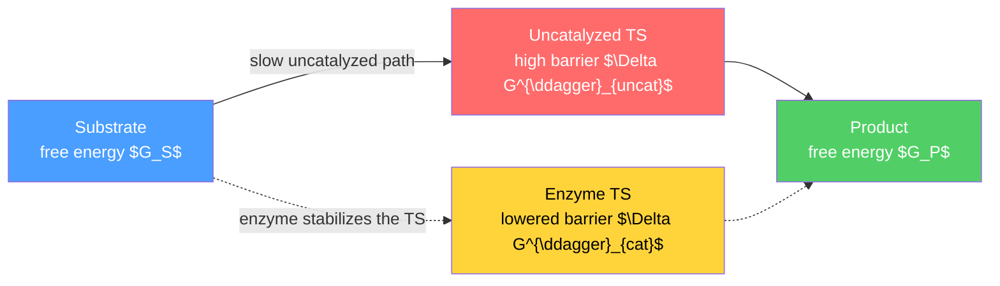

# ⚗️ Enzyme Kinetics and Catalysis

> [!abstract] TL;DR
> Enzymes are biological catalysts — almost always proteins, occasionally RNA (**ribozymes**) — that accelerate reactions by factors up to $\sim 10^{17}$ by binding the substrate in an **active site** and **stabilizing the transition state**, lowering the activation energy $\Delta G^\ddagger$ *without* changing $\Delta G$ or the equilibrium. Their rates saturate, giving hyperbolic **Michaelis–Menten** kinetics: $v_0 = \dfrac{V_{max}[S]}{K_M+[S]}$, derived from $E+S\rightleftharpoons ES\to E+P$ under the steady-state approximation. Key parameters are $K_M$ (the $[S]$ at half-$V_{max}$, an inverse-affinity proxy), the turnover number $k_{cat}$, and the **specificity constant** $k_{cat}/K_M$ whose ceiling is the diffusion limit. **Inhibitors** (competitive, uncompetitive, noncompetitive, mixed) each perturb the apparent $K_M$/$V_{max}$ in a diagnostic way, and **allosteric** enzymes replace the hyperbola with a sigmoidal, Hill-type curve for feedback control.

## Intuition — analogy FIRST

Picture the mountain-pass hikers of [[Chemical_Kinetics]] — but now hire a **guide with a molded harness**. The enzyme is that guide: it grips each reactant, twists it into the exact awkward geometry of the summit (the transition state), and holds it there so the pass feels far lower. The barrier drops, thousands of hikers cross per second, yet the *height of the destination valley is unchanged* — the enzyme never alters which side is thermodynamically favored, only how fast equilibrium is reached.

Two features make enzymes special. First, there are only so many guides. Flood the trailhead with hikers (raise $[S]$) and every guide is busy — the crossing rate **plateaus** at $V_{max}$. That saturation is the signature that distinguishes enzyme kinetics from ordinary mass-action rate laws. Second, the harness is **shaped**: it fits one kind of hiker and rejects look-alikes, giving enzymes their exquisite substrate specificity.

---

## How It Works

An enzyme does not push reactants uphill; it carves a lower path by being **most complementary to the transition state**, not to the substrate. Binding energy released on reaching that strained geometry pays down the barrier.



The vertical gap $\Delta G^{\ddagger}_{uncat}-\Delta G^{\ddagger}_{cat}$ sets the **rate enhancement**; the horizontal gap $G_P-G_S$ is fixed thermodynamics. Because the enzyme lowers the barrier for the forward *and* reverse directions equally, $K_{eq}$ is untouched.

---

## Key Concepts / Details

### Secondary Level

- **Enzymes are catalysts.** They speed reactions up (often by millions to $10^{17}$-fold), are **not consumed**, and are regenerated each cycle. Most are proteins; a few are catalytic RNAs.
- **Active site.** A small pocket, shaped by folding of the protein, where the substrate binds and reacts. Its shape and chemistry give **specificity**.
- **Lock-and-key** (Fischer, 1894): the substrate fits a rigid, pre-formed site. **Induced fit** (Koshland, 1958, the modern view): binding *reshapes* the enzyme to clamp the substrate and align catalytic groups.
- **They do not change $\Delta G$ or the equilibrium** — only how fast it is reached.
- **Sensitive to conditions:** each enzyme has an **optimum pH and temperature**; too hot or too far from optimum pH **denatures** the protein and activity collapses.

### Undergraduate Level

**Catalytic strategies.** Enzymes combine several tricks: **acid–base catalysis** (a residue donates/accepts $\text{H}^+$), **covalent catalysis** (a transient covalent bond to the enzyme, e.g. the Ser–His–Asp triad of chymotrypsin forming an acyl-enzyme), **metal-ion catalysis** (a bound metal polarizes bonds or stabilizes charge, e.g. $\text{Zn}^{2+}$ in carbonic anhydrase — see [[Coordination_Chemistry_and_Ligand_Field_Theory]]), and **proximity/orientation** plus **electrostatic transition-state stabilization**. The dominant contribution to most rate enhancements is preferential binding of the TS.

**Cofactors and coenzymes.** Many enzymes need a non-protein helper. The protein alone is the **apoenzyme**; with its cofactor it is the active **holoenzyme**. Cofactors include **metal ions** ($\text{Mg}^{2+}, \text{Zn}^{2+}, \text{Fe}^{2+}$) and organic **coenzymes**, most derived from vitamins: $\text{NAD}^+/\text{NADP}^+$ (niacin), FAD/FMN (riboflavin), coenzyme A, TPP, pyridoxal phosphate, biotin. Tightly/permanently bound helpers are **prosthetic groups**; freely dissociating ones are **cosubstrates**.

**Enzyme classification (EC number).** Seven top-level classes:

| EC | Class | Reaction catalyzed |
|----|-------|--------------------|
| 1 | Oxidoreductases | Redox / electron transfer |
| 2 | Transferases | Move a functional group between molecules |
| 3 | Hydrolases | Bond cleavage by water |
| 4 | Lyases | Non-hydrolytic addition/removal, forming double bonds |
| 5 | Isomerases | Intramolecular rearrangement |
| 6 | Ligases | Join two molecules, coupled to ATP |
| 7 | Translocases | Move ions/molecules across membranes (added 2018) |

**Michaelis–Menten derivation.** For the scheme
$$E+S \underset{k_{-1}}{\overset{k_1}{\rightleftharpoons}} ES \xrightarrow{k_{cat}} E+P$$
apply the **steady-state approximation** $d[ES]/dt = k_1[E][S]-(k_{-1}+k_{cat})[ES]=0$ with the conservation law $[E]_T=[E]+[ES]$:
$$[ES]=\frac{[E]_T[S]}{K_M+[S]},\qquad K_M\equiv\frac{k_{-1}+k_{cat}}{k_1}$$
Since $v_0=k_{cat}[ES]$ and $V_{max}=k_{cat}[E]_T$,
$$\boxed{\,v_0=\frac{V_{max}[S]}{K_M+[S]}\,}$$

**Interpreting the parameters.**
- $K_M$ is the substrate concentration at which $v_0=V_{max}/2$. A **low $K_M$** ≈ high apparent affinity. It equals the true dissociation constant $K_d=k_{-1}/k_1$ *only* when $k_{cat}\ll k_{-1}$.
- $k_{cat}$ (**turnover number**) $=V_{max}/[E]_T$ = substrate molecules converted per active site per second.
- $k_{cat}/K_M$ (**specificity constant**) is the effective second-order rate constant for $E+S$ at low $[S]$; it ranks competing substrates and its upper bound is the **diffusion limit** $\sim 10^8$–$10^9\ \text{M}^{-1}\text{s}^{-1}$.

**Lineweaver–Burk (double reciprocal).** Inverting MM linearizes it:
$$\frac{1}{v_0}=\frac{K_M}{V_{max}}\frac{1}{[S]}+\frac{1}{V_{max}}$$
$y$-intercept $=1/V_{max}$, $x$-intercept $=-1/K_M$, slope $=K_M/V_{max}$. Historically convenient but **statistically poor**: taking reciprocals amplifies error in low-$[S]$ points, distorting the fit. Prefer **nonlinear regression** on the raw hyperbola; Eadie–Hofstee and Hanes–Woolf are better-behaved linearizations.

**Inhibition.** Writing $\alpha=1+[I]/K_i$ (inhibitor on free $E$) and $\alpha'=1+[I]/K_i'$ (inhibitor on $ES$), $v_0=\dfrac{V_{max}[S]}{\alpha K_M+\alpha'[S]}$:

| Type | Binds | Apparent $K_M$ | Apparent $V_{max}$ | Lineweaver–Burk signature |
|------|-------|----------------|--------------------|---------------------------|
| Competitive | free $E$ | $\uparrow\ (\alpha K_M)$ | unchanged | lines cross on the $1/v_0$ axis (shared $y$-int) |
| Uncompetitive | $ES$ only | $\downarrow\ (K_M/\alpha')$ | $\downarrow\ (V_{max}/\alpha')$ | **parallel** lines (shared slope) |
| Noncompetitive (pure) | $E$ and $ES$ equally | unchanged | $\downarrow\ (V_{max}/\alpha)$ | lines cross on the $1/[S]$ axis (shared $x$-int) |
| Mixed | $E$ and $ES$, $\alpha\neq\alpha'$ | $\uparrow$ or $\downarrow$ | $\downarrow$ | cross off both axes |

**pH and temperature.** Activity vs pH is typically **bell-shaped**: catalytic residues must be in the right protonation state, so both acidic and basic extremes kill activity (link [[Acids_Bases_and_pH]]). Rate rises with temperature (Arrhenius) up to an optimum, then falls sharply as the protein **denatures**.

### Graduate Level

**Pre-steady-state (burst) kinetics.** Steady-state rates give only *combinations* of rate constants. **Stopped-flow** and **rapid-quench** methods resolve the first catalytic turnover on the millisecond timescale. Chymotrypsin acting on $p$-nitrophenyl acetate shows a **burst** of product stoichiometric with $[E]$, then a slow steady state — proof that a fast acylation precedes rate-limiting deacylation, and a direct handle on individual $k$ values.

**Catalytic perfection.** When $k_{cat}/K_M$ approaches the diffusion limit, essentially every encounter is productive; the enzyme cannot get faster without faster diffusion. Examples near $10^8$–$10^9\ \text{M}^{-1}\text{s}^{-1}$: triosephosphate isomerase, acetylcholinesterase, carbonic anhydrase, fumarase, catalase, and superoxide dismutase (electrostatically steered).

**Allostery and cooperativity.** Multi-subunit enzymes with binding sites that communicate give **sigmoidal** $v_0$ vs $[S]$, fit by the **Hill equation**
$$v_0=\frac{V_{max}[S]^{n_H}}{K_{0.5}^{\,n_H}+[S]^{n_H}}$$
where $n_H>1$ signals positive cooperativity (an ultrasensitive switch), $n_H=1$ recovers MM, and $n_H<1$ is negative cooperativity. The **MWC (concerted)** and **KNF (sequential)** models explain it mechanistically. Cooperativity plus **feedback inhibition** (an end-product allosterically damping an upstream enzyme, e.g. ATP on phosphofructokinase) lets cells regulate metabolic flux — see [[Metabolism_and_Bioenergetics]].

**Transition-state analogs and irreversible inhibitors as drugs.** Because enzymes bind the TS far tighter than the substrate, a stable molecule mimicking the TS is an extremely potent **competitive inhibitor** — the design principle behind statins (HMG-CoA reductase) and many protease inhibitors. **Irreversible / mechanism-based** inhibitors covalently disable the active site: penicillin acylates the transpeptidase serine; aspirin acetylates cyclooxygenase; organophosphates block acetylcholinesterase.

```python
import numpy as np
import matplotlib.pyplot as plt

# Michaelis-Menten parameters (uninhibited enzyme)
Vmax = 100.0                     # umol/min (max rate)
Km   = 2.0                       # mM  ([S] at half Vmax)
S    = np.linspace(0.05, 40, 400)  # substrate concentration (mM)

def mm(S, Vmax, Km, alpha=1.0, alpha_p=1.0):
    # v = Vmax[S] / (alpha*Km + alpha_p*[S])
    # alpha  scales Km  (inhibitor on free E), alpha_p scales [S] term (inhibitor on ES)
    return Vmax * S / (alpha * Km + alpha_p * S)

v_none = mm(S, Vmax, Km)                          # no inhibitor
v_comp = mm(S, Vmax, Km, alpha=3.0)               # competitive: apparent Km up, Vmax same
v_ncmp = mm(S, Vmax, Km, alpha=2.0, alpha_p=2.0)  # pure noncompetitive: Vmax down, Km same

fig, ax = plt.subplots(1, 2, figsize=(12, 5))

# --- Direct hyperbola: saturation and the effect of each inhibitor ---
for v, lab in [(v_none, 'no inhibitor'), (v_comp, 'competitive'), (v_ncmp, 'noncompetitive')]:
    ax[0].plot(S, v, label=lab)
ax[0].axhline(Vmax, ls=':', color='gray')
ax[0].set(xlabel='[S] (mM)', ylabel='v0 (umol/min)', title='Michaelis-Menten: v0 vs [S]')
ax[0].legend(); ax[0].grid(alpha=0.3)

# --- Lineweaver-Burk: competitive shares y-intercept, noncompetitive shares x-intercept ---
inv_S = 1.0 / S
for v, lab in [(v_none, 'no inhibitor'), (v_comp, 'competitive'), (v_ncmp, 'noncompetitive')]:
    ax[1].plot(inv_S, 1.0 / v, label=lab)
ax[1].axhline(1 / Vmax, ls=':', color='gray')   # shared 1/Vmax intercept (competitive)
ax[1].set(xlabel='1/[S] (1/mM)', ylabel='1/v0 (min/umol)',
          title='Lineweaver-Burk (double reciprocal)')
ax[1].set_xlim(0, 1.0); ax[1].set_ylim(0, 0.08)
ax[1].legend(); ax[1].grid(alpha=0.3)

# Report turnover number if enzyme concentration is known
E_total = 5e-3   # mM of active sites
kcat = Vmax / E_total          # 1/min
print(f"kcat = {kcat:.0f} /min ; kcat/Km = {kcat/Km:.0f} /min/mM (specificity)")

plt.tight_layout()
plt.show()
```

---

## Real-World Notes

- **Carbonic anhydrase** — a $\text{Zn}^{2+}$ metalloenzyme with $k_{cat}\sim10^6\ \text{s}^{-1}$ and $k_{cat}/K_M$ near the diffusion limit; it hydrates $\text{CO}_2$ fast enough to keep pace with blood transport and gas exchange in the lungs.
- **Serine proteases (chymotrypsin, trypsin)** — the Ser–His–Asp **catalytic triad** performs covalent catalysis via an acyl-enzyme intermediate; the textbook system for burst kinetics.
- **Statins** — transition-state-analog **competitive inhibitors** of HMG-CoA reductase; by mimicking the reaction's mevalonate-forming TS they bind orders of magnitude tighter than substrate, lowering cholesterol synthesis.
- **Penicillin** — a $\beta$-lactam **mechanism-based irreversible inhibitor** that acylates the active-site serine of bacterial transpeptidase, blocking cell-wall crosslinking.
- **Phosphofructokinase** — the pacemaker of glycolysis; ATP and citrate act as **allosteric feedback inhibitors**, giving sigmoidal control that matches ATP production to demand.
- **Glucose oxidase** — immobilized on test strips, it turns blood glucose into an electrochemical signal, the enzymatic heart of diabetic glucose meters and biosensors.

---

## Common Pitfalls

1. **"$K_M$ is the binding affinity."** Only approximately. $K_M=(k_{-1}+k_{cat})/k_1$ and equals the dissociation constant $K_d$ **only** when $k_{cat}\ll k_{-1}$. Read it operationally: the $[S]$ giving half-maximal rate.
2. **"A catalyst shifts the equilibrium."** It lowers the barrier for both directions equally, speeding the *approach* to equilibrium while leaving $\Delta G$ and $K_{eq}$ unchanged (see [[Chemical_Thermodynamics]]).
3. **Confusing $k_{cat}$ with $V_{max}$.** $V_{max}=k_{cat}[E]_T$ scales with how much enzyme you added; $k_{cat}$ is the intrinsic per-site turnover. Only $k_{cat}$ and $k_{cat}/K_M$ compare enzymes fairly.
4. **Trusting Lineweaver–Burk fits.** The double-reciprocal transform inflates the weight of noisy low-$[S]$ points; a straight-looking line can hide a bad fit. Diagnose inhibition qualitatively with it, but quantify by **nonlinear regression**.
5. **"Competitive inhibition can't be overcome."** It can — flooding with substrate outcompetes the inhibitor, so $V_{max}$ is still reached (only apparent $K_M$ rises). Uncompetitive/noncompetitive inhibition, which lower $V_{max}$, cannot be relieved this way.
6. **Applying Michaelis–Menten to allosteric enzymes.** Sigmoidal kinetics violate the single-site MM assumption; use the Hill equation. Also remember MM assumes initial rates (no product/reverse), a single substrate, and $[S]\gg[E]$.

---

## Related Concepts

- [[_MOC_Biochemistry|↑ Section MOC]]
- [[Chemical_Kinetics]] — the general theory of rates, barriers, and the steady-state approximation that this note specializes to biology.
- [[Protein_Structure_and_Function]] — folding builds the active site and positions the catalytic residues.
- [[Chemical_Thermodynamics]] — sets $\Delta G$ and $K_{eq}$, which enzymes leave untouched; only the path changes.
- [[Acids_Bases_and_pH]] — protonation states of catalytic residues produce the bell-shaped pH–activity curve.
- [[Biomolecules_Overview]] — where coenzymes/vitamins and substrate metabolites come from.
- [[Metabolism_and_Bioenergetics]] — enzymes catalyze and, via feedback inhibition, regulate metabolic flux.
- [[Nucleic_Acids_and_the_Central_Dogma]] — ribozymes and the enzymes of replication, transcription, and translation.
- [[Membranes_and_Cell_Signaling]] — kinases, phosphatases, and GTPases as switchable regulatory enzymes.
- [[Coordination_Chemistry_and_Ligand_Field_Theory]] — the metal centers behind metal-ion catalysis.
- [[_MOC_Mathematics_Master]] (Math) — differential equations and nonlinear regression underpin the derivation and fitting of rate curves.

---

## Review Questions

1. **Secondary**: Explain why adding an enzyme does not change the equilibrium position of a reaction, even though it makes the reaction go far faster. What happens to activity if the temperature is raised well above the enzyme's optimum, and why?
2. **Undergraduate**: An enzyme has $V_{max}=200\ \mu\text{mol min}^{-1}$ and $K_M=5\ \text{mM}$. Adding a competitive inhibitor raises the apparent $K_M$ to $15\ \text{mM}$. (a) By what factor is $\alpha$? (b) Sketch how the Lineweaver–Burk plot changes and state which intercept is shared. (c) Given $[E]_T=10\ \text{nmol}$, what is $k_{cat}$, and what does $k_{cat}/K_M$ tell you?
3. **Graduate**: Describe a pre-steady-state "burst" experiment on chymotrypsin. What does the burst amplitude report, and what does the fact that steady-state rates give only combinations of rate constants imply about designing such experiments? Then explain why a transition-state analog is expected to bind more tightly than the substrate.

---

## Sources

- Nelson & Cox — *Lehninger Principles of Biochemistry*, enzyme chapters (kinetics, mechanism, regulation)
- Berg, Tymoczko, Gatto & Stryer — *Biochemistry*, chapters on enzymes and catalytic strategies
- Fersht — *Structure and Mechanism in Protein Science* (transition-state stabilization, pre-steady-state kinetics)
- Cornish-Bowden — *Fundamentals of Enzyme Kinetics*
- Copeland — *Enzymes: A Practical Introduction to Structure, Mechanism, and Data Analysis*

#chemistry #biochemistry #enzymes #michaelismenten #catalysis #inhibition #allostery #kcat #undergraduate #graduate
