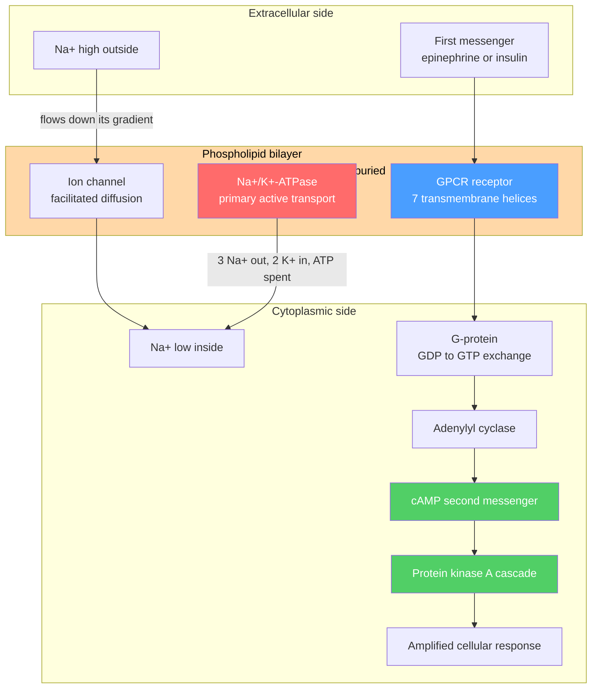

# 🧫 Membranes and Cell Signaling

> [!abstract] TL;DR
> A biological membrane is a **self-assembled bilayer of amphipathic phospholipids** — polar heads facing water, greasy tails buried inside — held together not by covalent bonds but by the **hydrophobic effect**. This ~5 nm sheet is a selectively permeable barrier: small nonpolar molecules cross freely, but ions and polar solutes need **protein channels, carriers, and pumps** (the *fluid-mosaic model*). Because pumps like the **Na⁺/K⁺-ATPase** maintain unequal ion concentrations and the membrane is *selectively* permeable, a **transmembrane voltage** arises — quantified for one ion by the **Nernst equation** and for several by the **Goldman–Hodgkin–Katz (GHK)** equation. The same membrane is the cell's *sensory organ*: **receptors** (GPCRs, receptor tyrosine kinases) detect first messengers (hormones, neurotransmitters), triggering **second messengers** (cAMP, Ca²⁺, IP₃) and **phosphorylation cascades** that amplify a faint signal into a large response. At the graduate level, transport and signaling reduce to two ideas: the thermodynamics of **electrochemical gradients** (the proton-motive force) and the **ultrasensitive**, switch-like logic of cascades.

## Intuition — analogy FIRST

Picture a **soap bubble wall** as the cell's skin. Soap molecules are two-faced — a water-loving head and an oil-loving tail — so in water they spontaneously line up tail-to-tail into a thin film. A cell membrane is exactly this, doubled: a **bilayer** whose oily core refuses to let charged things through. Nothing "decides" to build it; water simply *squeezes* the greasy tails together to get them out of the way — the **hydrophobic effect** (see [[Biomolecules_Overview]]).

Now imagine the membrane as a **castle wall**. Fat-soluble messengers (O₂, CO₂, steroids) climb straight over. Everything else must use a **gate**: an always-open drawbridge (channel), a revolving door that flips one guest at a time (carrier), or a **motorized turnstile that pushes people uphill against the crowd** and burns fuel to do it (an ATP-driven pump). Because the pumps stockpile K⁺ inside and Na⁺ outside, the wall becomes a **charged battery** — and neurons discharge that battery in a flash to fire a signal. Finally, mounted on the wall are **antennae** (receptors): a hormone touches the outside, and without ever entering, it rings a bell inside that echoes, amplifies, and reprograms the cell.

---

## How It Works



*Two jobs, one sheet:* the **left/red** machinery moves matter and charge (transport → membrane potential); the **right/green** machinery moves information (ligand → second messenger → amplified response).

---

## Key Concepts / Details

### Secondary Level

The **cell membrane** is the boundary that separates the inside of a cell from its surroundings. It is built from **phospholipids** — molecules with a water-loving "head" and two water-fearing "tails." In water they automatically form a **double layer** with the tails hidden in the middle. This makes the membrane **selectively permeable**: tiny or fatty molecules pass through, but ions and sugars must use special **protein doorways**. Movement from high to low concentration with no energy cost is **diffusion**; the movement of *water* across the membrane is **osmosis**; pushing a substance *against* its gradient costs energy (**active transport**).

### Undergraduate Level

**Membrane architecture — the fluid-mosaic model (Singer–Nicolson, 1972).** The bilayer is a **two-dimensional fluid**: lipids diffuse laterally within a leaflet ($\sim 1\ \mu\text{m}$ in seconds) but rarely **flip-flop** between leaflets. Embedded in it, like icebergs, are proteins.

| Property | Determinant | Effect on fluidity |
|----------|-------------|--------------------|
| Fatty-acid saturation | more **cis** double bonds (kinks) | prevents packing → *more* fluid |
| Chain length | shorter tails | weaker van der Waals → *more* fluid |
| Cholesterol | intercalates between tails | **buffers**: fluidizes when cold, rigidifies when warm |
| Temperature | above/below $T_m$ | gel below the melting transition, fluid above |

**Membrane proteins.** *Integral* proteins span the hydrophobic core (transmembrane α-helices or β-barrels) and can be removed only with detergents; *peripheral* proteins bind the surface electrostatically. Functionally: **transporters, receptors, enzymes, anchors, and cell-adhesion** molecules.

**Transport across the membrane.**

| Mode | Energy | Direction | Example |
|------|--------|-----------|---------|
| Simple diffusion | none | down gradient | O₂, CO₂, steroids |
| Facilitated (channel) | none | down gradient | K⁺ leak channel, aquaporin |
| Facilitated (carrier) | none | down gradient | GLUT glucose transporter |
| Primary active | ATP | up gradient | Na⁺/K⁺-ATPase, Ca²⁺-ATPase |
| Secondary active | stored ion gradient | one up, one down | SGLT1 (Na⁺-glucose symport) |

The **Na⁺/K⁺-ATPase** hydrolyzes one ATP to export **3 Na⁺** and import **2 K⁺** per cycle — electrogenic and the single largest energy sink in a resting neuron. **Osmosis** — net water flow toward higher solute concentration — is governed by osmotic pressure $\Pi = iMRT$ (see [[Phase_Equilibria_and_Colligative_Properties]] and [[Solutions_and_Concentration]]); cells in **hypertonic** solution shrink, in **hypotonic** solution swell.

**The membrane potential.** Selective permeability + an ion gradient = voltage. For a **single** permeant ion at equilibrium, the diffusive force balances the electrical force, giving the **Nernst equation** (see [[Electrochemistry]]):
$$E_{ion} = \frac{RT}{zF}\ln\frac{[\text{ion}]_{out}}{[\text{ion}]_{in}} \;\approx\; \frac{61.5\ \text{mV}}{z}\,\log_{10}\frac{[\text{ion}]_{out}}{[\text{ion}]_{in}} \quad (37\,^\circ\text{C})$$

Typical neuron: $E_K \approx -89\ \text{mV}$, $E_{Na} \approx +67\ \text{mV}$, $E_{Cl} \approx -89\ \text{mV}$. When **several** ions are permeant, the resting potential is a *permeability-weighted* average — the **Goldman–Hodgkin–Katz (GHK)** equation (note Cl⁻ is inverted because $z=-1$):
$$V_m = \frac{RT}{F}\ln\frac{P_K[K^+]_{o} + P_{Na}[Na^+]_{o} + P_{Cl}[Cl^-]_{i}}{P_K[K^+]_{i} + P_{Na}[Na^+]_{i} + P_{Cl}[Cl^-]_{o}}$$

At rest $P_K \gg P_{Na}$, so $V_m \approx -70\ \text{mV}$, pulled toward $E_K$. The **action potential** is a transient inversion: voltage-gated Na⁺ channels open, $P_{Na}$ briefly dominates, and $V_m$ shoots toward $E_{Na}$ (a spike to $\sim +40\ \text{mV}$) before K⁺ channels repolarize it.

**Cell signaling — the transduction logic.** A cell converts an extracellular chemical signal into an intracellular action:

1. **First messenger (ligand):** a hormone or neurotransmitter that usually cannot cross the membrane.
2. **Receptor:** a **GPCR** (7-transmembrane; activates a G-protein → adenylyl cyclase) or a **receptor tyrosine kinase (RTK)** (ligand causes dimerization and *trans*-autophosphorylation).
3. **Second messenger:** small, diffusible amplifiers — **cAMP**, **Ca²⁺**, **IP₃/DAG** — that spread the signal.
4. **Cascade:** kinases phosphorylate targets in a chain, each step **amplifying** (one receptor → many cAMP → many active PKA → thousands of product molecules).
5. **Termination / desensitization:** GTP hydrolysis switches G-proteins off; phosphodiesterase degrades cAMP; phosphatases reverse phosphorylation; receptor phosphorylation + arrestin binding causes **desensitization**.

*Canonical example — epinephrine (adrenaline)* binds a β-adrenergic **GPCR** → Gₛ → adenylyl cyclase → **cAMP** → PKA → phosphorylase kinase → glycogen breakdown ("fight or flight" glucose release). *Insulin* binds an **RTK**, triggering the PI3K/Akt cascade that inserts GLUT4 transporters into the membrane. At the **synapse**, an action potential opens voltage-gated Ca²⁺ channels, Ca²⁺ triggers neurotransmitter vesicle fusion, and the transmitter opens ligand-gated channels on the next neuron.

### Graduate Level

**Electrochemical potential and the proton-motive force.** The true driving force on an ion combines *chemical* and *electrical* work. The electrochemical potential of species $i$ is
$$\bar{\mu}_i = \mu_i^\circ + RT\ln a_i + z_iF\psi$$
so the free energy to move one mole across the membrane is $\Delta\bar{\mu}_i = RT\ln\frac{[i]_{in}}{[i]_{out}} + z_iF\,\Delta\psi$. For protons, this defines the **proton-motive force (PMF)**, the currency of chemiosmosis (see [[Metabolism_and_Bioenergetics]]):
$$\Delta p = \Delta\psi - \frac{2.303\,RT}{F}\,\Delta\text{pH}$$
The mitochondrial electron-transport chain pumps H⁺ to build $\Delta p \approx 200\ \text{mV}$; **ATP synthase** lets that PMF flow back "downhill," coupling it to ADP + Pᵢ → ATP. Membrane transport is thus the mechanical foundation of bioenergetics — a direct biological instance of $\Delta G = -nFE$ from thermodynamics ([[Laws_of_Thermodynamics]]).

**Ultrasensitivity and switch-like responses.** Linear cascades would give graded outputs, but cells often need **all-or-none decisions**. Three mechanisms sharpen the response beyond a simple hyperbola:

- **Cooperative binding** — multiple ligand sites give a sigmoidal Hill curve, $\theta = \dfrac{L^{n}}{K^{n}+L^{n}}$, with Hill coefficient $n>1$ (e.g. Ca²⁺ binding calmodulin).
- **Zero-order ultrasensitivity** (Goldbeter–Koshland) — when the opposing kinase and phosphatase are both **saturated**, the fraction of phosphorylated substrate flips steeply with tiny changes in their activity ratio.
- **Multistep cascades** (e.g. the **MAPK** three-tier module) multiply modest ultrasensitivities into a near-digital switch, and can show **bistability/hysteresis** with positive feedback.

These make signaling robust to noise and capable of memory — the systems-biology view of how a membrane-bound antenna makes a committed cellular decision.

---

```python
import numpy as np

# --- Physiological ion concentrations for a mammalian neuron (mM) ---
conc = {
    "K":  {"out": 5.0,   "in": 140.0, "z": +1},
    "Na": {"out": 145.0, "in": 12.0,  "z": +1},
    "Cl": {"out": 110.0, "in": 4.0,   "z": -1},
}

R, F, T = 8.314, 96485.0, 310.15     # J/mol/K, C/mol, body temp 37 C
RT_F = R * T / F * 1e3               # -> 26.73 mV; times ln(10) = 61.5 mV/decade

def nernst(ion):
    """Equilibrium potential of a single ion (mV)."""
    c = conc[ion]
    return (RT_F / c["z"]) * np.log(c["out"] / c["in"])

def ghk(P):
    """Goldman-Hodgkin-Katz resting voltage (mV). Note: Cl- terms are inverted."""
    num = P["K"]*conc["K"]["out"] + P["Na"]*conc["Na"]["out"] + P["Cl"]*conc["Cl"]["in"]
    den = P["K"]*conc["K"]["in"]  + P["Na"]*conc["Na"]["in"]  + P["Cl"]*conc["Cl"]["out"]
    return RT_F * np.log(num / den)

for ion in conc:
    print(f"E_{ion:<2} (Nernst) = {nernst(ion):+6.1f} mV")

# Permeability ratios P_K : P_Na : P_Cl at two membrane states
P_rest = {"K": 1.0, "Na": 0.04, "Cl": 0.45}   # rest: K+ leak dominates
P_peak = {"K": 1.0, "Na": 20.0, "Cl": 0.45}   # AP peak: Na+ channels wide open

print(f"\nResting Vm  (K+ dominant)  = {ghk(P_rest):+6.1f} mV  -> near E_K")
print(f"AP peak Vm  (Na+ dominant) = {ghk(P_peak):+6.1f} mV  -> swings toward E_Na")

# Expected output:
#   E_K  (Nernst) =  -89.1 mV
#   E_Na (Nernst) =  +66.6 mV
#   E_Cl (Nernst) =  -88.6 mV
#   Resting Vm  (K+ dominant)  =  -72.5 mV  -> near E_K
#   AP peak Vm  (Na+ dominant) =  +51.1 mV  -> swings toward E_Na
```

The single lesson: **the resting membrane sits near $E_K$ because K⁺ is the most permeant ion; the spike happens because opening Na⁺ channels momentarily makes Na⁺ the boss, dragging $V_m$ toward $E_{Na}$.**

---

## Real-World Notes

- **Nerve and muscle excitation.** Local anesthetics (lidocaine) and antiarrhythmics block voltage-gated Na⁺ channels, preventing the $P_{Na}$ surge that GHK shows is required for a spike — no action potential, no pain signal.
- **Cardiac glycosides.** Digoxin inhibits the Na⁺/K⁺-ATPase; the rising intracellular Na⁺ slows the Na⁺/Ca²⁺ exchanger, raising Ca²⁺ and strengthening heart contraction — a whole drug class built on one pump.
- **GPCRs are the top drug target.** Roughly a third of all approved drugs act on GPCRs (β-blockers, antihistamines, opioids), exploiting the receptor → G-protein → second-messenger logic above.
- **Cholera and pertussis toxins** lock G-proteins on: cholera toxin freezes Gₛ active in gut epithelium, so cAMP stays high, driving massive Cl⁻ and water secretion — the lethal diarrhea of cholera.
- **Insulin resistance / type-2 diabetes.** The RTK → PI3K → GLUT4 pathway fails to insert enough glucose transporters, so blood glucose stays high — a signaling-cascade breakdown, not a fuel shortage.
- **Anesthetics and membrane fluidity.** Volatile anesthetics partition into the bilayer and modulate ion channels; membrane lipid composition (cholesterol, lipid rafts) tunes how proteins cluster and signal.

---

## Common Pitfalls

1. **Confusing the Nernst (single ion) with GHK (many ions).** Nernst gives the *equilibrium* potential of **one** ion assuming it alone is permeant; GHK gives the *steady-state* $V_m$ weighted by **relative permeabilities**. The resting potential is GHK, not $E_K$.
2. **Forgetting to invert chloride in GHK.** Because $z_{Cl}=-1$, Cl⁻ appears as $[Cl^-]_{in}$ in the numerator and $[Cl^-]_{out}$ in the denominator. Treating it like a cation flips the sign of its contribution.
3. **Thinking the pump directly sets the voltage.** The Na⁺/K⁺-ATPase is only weakly electrogenic ($\sim$ a few mV); its real job is to *maintain the gradients* that the **permeability of leak channels** then converts into $V_m$. Block the pump and the potential decays over minutes, not milliseconds.
4. **"Active transport moves things fast."** Active vs passive is about **thermodynamic direction** (uphill vs downhill), not speed. A downhill channel can be far faster than an uphill pump.
5. **Second messenger ≠ the signal itself.** The hormone (first messenger) usually never enters the cell; it is the internally generated cAMP/Ca²⁺/IP₃ that carries and **amplifies** the message. One ligand can yield thousands of product molecules.
6. **Assuming signaling is linear/graded.** Cooperativity, zero-order ultrasensitivity, and multi-tier cascades make many responses **switch-like** — a small input change can flip the output nearly all-or-none.

---

## Related Concepts

- [[_MOC_Biochemistry|↑ Section MOC]]
- [[Biomolecules_Overview]] — the hydrophobic effect that drives amphipathic phospholipids to self-assemble into the bilayer
- [[Protein_Structure_and_Function]] — folding of transmembrane channels, pumps, and 7-helix GPCRs embedded in the membrane
- [[Enzyme_Kinetics_and_Catalysis]] — carriers, pumps, and RTKs obey saturable Michaelis–Menten-like kinetics; kinases are enzymes
- [[Metabolism_and_Bioenergetics]] — the proton-motive force and chemiosmosis: membrane gradients powering ATP synthesis
- [[Nucleic_Acids_and_the_Central_Dogma]] — signaling cascades ultimately switch gene transcription on and off
- [[Electrochemistry]] — the Nernst equation and electrochemical potential; the membrane as a biological concentration cell
- [[Solutions_and_Concentration]] — molarity and tonicity of the intra/extracellular ion solutions
- [[Phase_Equilibria_and_Colligative_Properties]] — osmosis and osmotic pressure of water across a semipermeable membrane
- [[Laws_of_Thermodynamics]] — (Physics) free energy and entropy behind gradients and $\Delta G = -nFE$
- [[_MOC_Mathematics_Master]] — (Math) the logarithms, exponentials, and Hill functions used in Nernst, GHK, and cooperativity

---

## Review Questions

1. **Secondary:** Explain why a phospholipid forms a *bilayer* in water rather than a single layer, and predict what happens to a red blood cell placed in pure (hypotonic) water. Which transport process is responsible?
2. **Undergraduate:** A neuron has $[K^+]_{out}=5,\ [K^+]_{in}=140$ and $[Na^+]_{out}=145,\ [Na^+]_{in}=12$ mM. (a) Compute $E_K$ and $E_{Na}$ at 37 °C. (b) Using GHK with $P_K:P_{Na}:P_{Cl}=1:0.04:0.45$ and $[Cl^-]_{out}=110,\ [Cl^-]_{in}=4$ mM, find the resting $V_m$. (c) Qualitatively, where does $V_m$ move if voltage-gated Na⁺ channels open, and why?
3. **Graduate:** Mitochondria maintain $\Delta\psi \approx 150\ \text{mV}$ (inside negative) and $\Delta\text{pH}\approx 1$ (inside alkaline). (a) Compute the proton-motive force $\Delta p$ at 37 °C. (b) If ATP synthase translocates ~3–4 H⁺ per ATP, argue whether $\Delta p$ is thermodynamically sufficient to phosphorylate ADP under cellular conditions. (c) Contrast a *graded* cascade with a *zero-order ultrasensitive* one and state when a cell benefits from the switch-like response.

---

## Sources

- Alberts et al. — *Molecular Biology of the Cell*, membrane structure, transport, and signaling chapters
- Nelson & Cox (Lehninger) — *Principles of Biochemistry*, biological membranes and signal transduction
- Hille — *Ion Channels of Excitable Membranes*, Nernst/GHK and channel biophysics
- Kandel et al. — *Principles of Neural Science*, resting and action potentials
- Nicholls & Ferguson — *Bioenergetics*, the proton-motive force and chemiosmosis
- Alon — *An Introduction to Systems Biology*, ultrasensitivity and signaling motifs

#chemistry #biochemistry #membranes #cellsignaling #transport #membranepotential #GPCR #secondmessengers #undergraduate #graduate
