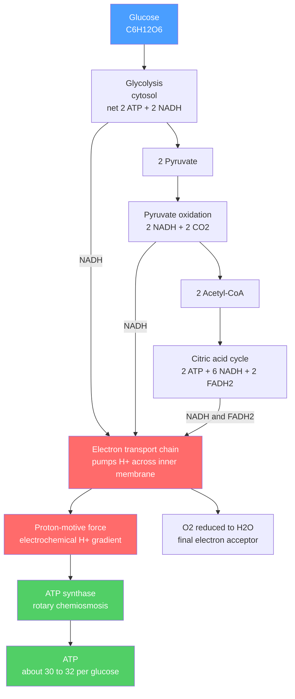

# ⚡ Metabolism and Bioenergetics

> [!abstract] TL;DR
> Bioenergetics is thermodynamics applied to life: how cells extract, store, and spend energy without ever violating the second law. The universal currency is **ATP**, whose hydrolysis has a standard free energy $\Delta G^{\circ\prime} \approx -30.5$ kJ/mol but an *actual* cellular value near $-50$ kJ/mol because the cell holds $[\text{ATP}]$ far above $[\text{ADP}][\text{P}_i]$. Endergonic reactions are driven by **coupling** them to ATP hydrolysis. Catabolism (glycolysis $\to$ pyruvate oxidation $\to$ citric acid cycle $\to$ oxidative phosphorylation) strips electrons from fuel onto NADH/FADH$_2$, which the electron transport chain uses to pump protons; **ATP synthase** then spends that proton-motive force to make the bulk of ATP by chemiosmosis — roughly **30–32 ATP per glucose**.

## Intuition — analogy FIRST

Think of the cell as a **rechargeable-battery economy**. Food is crude ore; you cannot spend it directly. Catabolism is a refinery that burns ore to **charge batteries** — the batteries are ATP molecules, each carrying a fixed, standardized amount of usable energy. Anything the cell wants to *build* or *move* it pays for by **discharging a battery** (hydrolyzing ATP to ADP), then sends the dead battery back to the refinery to be recharged. A resting adult recycles roughly their own **body weight in ATP every day**, because only a few grams exist at any instant — the pool turns over thousands of times.

Crucially, a battery is only useful if it is kept *charged relative to its surroundings*. The cell deliberately maintains a huge $[\text{ATP}]/[\text{ADP}]$ ratio so that hydrolysis is always steeply downhill — that is why the *actual* payoff ($-50$ kJ/mol) beats the textbook standard value ($-30.5$ kJ/mol). Bioenergetics is the accounting of this economy, and every entry obeys $\Delta G = \Delta H - T\Delta S$ from [[Chemical_Thermodynamics]].

---

## How It Works



---

## Key Concepts / Details

### Secondary Level

Living things run on a single, universal fuel molecule: **ATP** (adenosine triphosphate). Breaking off its terminal phosphate releases energy the cell uses to build molecules, contract muscle, and pump ions. **Cellular respiration** recharges ATP by burning glucose with oxygen:

$$\text{C}_6\text{H}_{12}\text{O}_6 + 6\,\text{O}_2 \;\rightarrow\; 6\,\text{CO}_2 + 6\,\text{H}_2\text{O} \qquad \Delta G^{\circ\prime} \approx -2870\ \text{kJ/mol}$$

That huge negative $\Delta G$ is captured in small change — about **30–32 ATP** per glucose — rather than wasted as a single burst of heat. With **no oxygen**, cells fall back on **fermentation** (glycolysis alone), harvesting only 2 ATP and regenerating NAD$^+$ by making lactate or ethanol.

- **Catabolism** breaks big molecules down and releases energy (exergonic).
- **Anabolism** builds big molecules up and consumes energy (endergonic), paid for by ATP.
- **Photosynthesis** runs the whole equation *backwards*, using sunlight to push CO$_2$ and water uphill into glucose and O$_2$.

### Undergraduate Level

**Standard vs actual free energy.** The biochemical standard state ($\Delta G^{\circ\prime}$) fixes pH 7, 25 or 37 °C, and 1 M solutes — conditions no living cell obeys. The reaction that matters is the *actual* one:

$$\Delta G = \Delta G^{\circ\prime} + RT\ln Q, \qquad Q_{\text{ATP hyd}} = \frac{[\text{ADP}][\text{P}_i]}{[\text{ATP}]}$$

Because cells keep $[\text{ATP}]$ high and $[\text{ADP}], [\text{P}_i]$ low, $Q \ll 1$, so $RT\ln Q$ is strongly negative and $\Delta G_{\text{actual}} \approx -50$ kJ/mol — far more exergonic than $\Delta G^{\circ\prime} = -30.5$ kJ/mol.

**Reaction coupling.** An endergonic step ($\Delta G > 0$) proceeds if a shared intermediate links it to ATP hydrolysis so the *summed* $\Delta G < 0$. Example — the first committed step of glycolysis:

| Reaction | $\Delta G^{\circ\prime}$ (kJ/mol) |
|---|---|
| Glucose + P$_i$ $\to$ Glucose-6-P + H$_2$O | $+13.8$ (endergonic) |
| ATP + H$_2$O $\to$ ADP + P$_i$ | $-30.5$ (exergonic) |
| **Coupled (hexokinase)** | $\mathbf{-16.7}$ (spontaneous) |

**Electron carriers and reduction potential.** Fuel oxidation is really a controlled transfer of electrons captured by **NAD$^+$/NADH** and **FAD/FADH$_2$**. Their tendency to donate electrons is the standard reduction potential $E^{\circ\prime}$; free energy links to it by $\Delta G^{\circ\prime} = -nF\,\Delta E^{\circ\prime}$ (see [[Electrochemistry]]):

| Redox couple | $E^{\circ\prime}$ (V) |
|---|---|
| NAD$^+$/NADH | $-0.32$ |
| FAD/FADH$_2$ (free) | $-0.22$ |
| Ubiquinone/QH$_2$ | $+0.045$ |
| Cytochrome $c$ (Fe$^{3+}$/Fe$^{2+}$) | $+0.25$ |
| $\tfrac{1}{2}$O$_2$/H$_2$O | $+0.82$ |

Electrons cascade "downhill" from NADH ($-0.32$ V) to O$_2$ ($+0.82$ V): $\Delta E^{\circ\prime} = 1.14$ V, giving $\Delta G^{\circ\prime} = -2 \times 96.485 \times 1.14 \approx -220$ kJ/mol per NADH — enough to pump several protons.

**The four stages and their ATP ledger (per glucose):**

| Stage | Location | Direct ATP (SLP) | NADH | FADH$_2$ |
|---|---|---|---|---|
| Glycolysis | cytosol | $+2$ | $2$ | $0$ |
| Pyruvate oxidation | matrix | $0$ | $2$ | $0$ |
| Citric acid cycle ($\times 2$) | matrix | $+2$ (GTP) | $6$ | $2$ |
| **Subtotal** | | $\mathbf{4}$ | $\mathbf{10}$ | $\mathbf{2}$ |

Oxidative phosphorylation then converts the reduced carriers using consensus P/O ratios of **~2.5 ATP per NADH** and **~1.5 ATP per FADH$_2$**:

$$10 \times 2.5 + 2 \times 1.5 = 28\ \text{ATP} \;\;\Rightarrow\;\; \text{total} = 4 + 28 = \mathbf{30\text{–}32\ ATP}$$

The range reflects the shuttle used for cytosolic NADH: the malate–aspartate shuttle delivers it at NADH level (2.5 each $\to$ 32 total); the glycerol-3-phosphate shuttle delivers at FADH$_2$ level (1.5 each $\to$ 30 total). **Substrate-level phosphorylation** (glycolysis, TCA) makes ATP by direct phosphoryl transfer; **oxidative phosphorylation** makes it indirectly via the proton gradient.

**Regulation.** Flux is throttled at the irreversible, far-from-equilibrium steps. **Phosphofructokinase-1** is the pacemaker of glycolysis: allosterically *inhibited* by ATP and citrate (signals of energy surplus) and *activated* by AMP and fructose-2,6-bisphosphate. This is classic **feedback inhibition** — the pathway's own product shuts down an upstream enzyme (see [[Enzyme_Kinetics_and_Catalysis]]).

### Graduate Level

**The chemiosmotic mechanism (Mitchell, 1961; Nobel 1978).** ATP is not made by a chemical intermediate but by an *electrochemical* one. Complexes I, III, and IV pump H$^+$ out of the mitochondrial matrix, storing energy as the **proton-motive force**:

$$\Delta p = \Delta\psi - \frac{2.303\,RT}{F}\,\Delta\text{pH}$$

where $\Delta\psi$ is the membrane potential (matrix negative) and $\Delta\text{pH}$ the transmembrane gradient. In mitochondria $\Delta p \approx 0.15\text{–}0.22$ V, dominated by $\Delta\psi$. **ATP synthase** (F$_o$F$_1$) is a rotary motor: protons flowing down $\Delta p$ through the F$_o$ c-ring spin the $\gamma$-subunit, which cyclically distorts the three F$_1$ catalytic sites — **Boyer's binding-change mechanism** (Boyer & Walker, Nobel 1997). With a c-ring of 8–10 subunits, roughly **3–4 H$^+$ are consumed per ATP**, which is exactly what fixes the non-integer P/O ratios above.

**Near-equilibrium vs far-from-equilibrium.** Most metabolic reactions operate at $\Delta G \approx 0$ (near-equilibrium): they are fast, reversible, and *cannot* be control points because a small push flips their direction. Regulation lives at the handful of steps held **far from equilibrium** ($\Delta G \ll 0$: hexokinase, PFK-1, pyruvate kinase, citrate synthase). These are effectively irreversible, so modulating their enzymes sets the *direction and rate of flux* through the whole pathway — the thermodynamic basis of metabolic control.

**Life as a dissipative steady state.** A living cell is an **open system** at steady state, not at equilibrium (equilibrium = death). It maintains its own low internal entropy only by continuously **exporting entropy** to its surroundings — degrading ordered fuel into disordered CO$_2$, water, and heat. This is fully consistent with the second law: $\Delta S_{\text{universe}} > 0$ even as $\Delta S_{\text{cell}} < 0$ (Prigogine's dissipative structures; Schrödinger's "negative entropy" in *What is Life?*). See [[Entropy_and_Second_Law]] and [[Laws_of_Thermodynamics]].

```python
import numpy as np
import matplotlib.pyplot as plt

# Bioenergetics of ATP hydrolysis:  ATP + H2O -> ADP + Pi
# Actual free energy:  dG = dG0' + R*T*ln(Q),   Q = [ADP][Pi]/[ATP]
dG0 = -30.5e3            # J/mol : standard free energy of hydrolysis (pH 7)
R   = 8.314              # J/(mol K)
T   = 310.15             # K  (body temperature, 37 C)
RT  = R * T              # ~ 2.58 kJ/mol

# Sweep the mass-action ratio  [ATP] / ([ADP][Pi]);  higher ratio => more negative dG.
ratio = np.logspace(0, 4, 200)          # units of M^-1 (concentrations in molar)
Q     = 1.0 / ratio                     # Q = [ADP][Pi]/[ATP]
dG    = (dG0 + RT * np.log(Q)) / 1e3    # kJ/mol

# Representative resting-cell concentrations (molar)
ATP, ADP, Pi = 5e-3, 0.5e-3, 5e-3
Q_cell  = (ADP * Pi) / ATP
dG_cell = (dG0 + RT * np.log(Q_cell)) / 1e3
print(f"standard  dG0' = {dG0/1e3:6.1f} kJ/mol")
print(f"cellular  Q    = {Q_cell:.2e}")
print(f"actual    dG   = {dG_cell:6.1f} kJ/mol   (cell keeps it ~ -50)")

plt.figure(figsize=(7, 5))
plt.plot(ratio, dG, lw=2, label="actual dG")
plt.axhline(dG0/1e3, ls="--", color="gray", label="standard dG0' = -30.5")
plt.scatter([ATP/(ADP*Pi)], [dG_cell], color="red", zorder=5,
            label=f"resting cell = {dG_cell:.0f} kJ/mol")
plt.xscale("log")
plt.xlabel("[ATP] / ([ADP][Pi])   (M^-1)")
plt.ylabel("Actual dG of ATP hydrolysis (kJ/mol)")
plt.title("The cell holds ATP hydrolysis strongly exergonic")
plt.legend(); plt.grid(True, alpha=0.3); plt.tight_layout()
```

---

## Real-World Notes

- **ATP turnover rate**: humans hold only ~50 g of ATP but hydrolyze and resynthesize ~50–75 kg per day at rest, far more during exercise — the pool cycles thousands of times daily.
- **Phosphate transfer hierarchy**: ATP sits *mid-scale*, letting it act as a shuttle. Phosphoenolpyruvate ($-61.9$ kJ/mol) and 1,3-bisphosphoglycerate ($-49.3$) donate phosphate *to* ADP (substrate-level phosphorylation); ATP in turn phosphorylates glucose ($-13.8$).
- **Metalloenzymes run the machinery**: the ETC depends on Fe–S clusters, heme cytochromes (Complexes I–IV), and a Cu center in cytochrome $c$ oxidase; the TCA enzyme aconitase carries an Fe–S cluster — the domain of [[Organometallic_and_Bioinorganic_Chemistry]].
- **Uncouplers**: molecules like 2,4-dinitrophenol (and the natural protein thermogenin/UCP1 in brown fat) short-circuit the proton gradient, so electron transport keeps running but produces **heat instead of ATP** — the basis of non-shivering thermogenesis and a lethal historical diet drug.
- **Cyanide and CO** block cytochrome $c$ oxidase (Complex IV), halting the entire ETC and collapsing ATP synthesis within minutes.
- **Photosynthesis** uses the same chemiosmotic logic in reverse energy flow: light-driven electron transport in the thylakoid pumps protons to make ATP and NADPH, which the Calvin cycle spends to fix CO$_2$ ($\Delta G^{\circ\prime} \approx +2870$ kJ/mol for the net synthesis, paid by photons).

---

## Common Pitfalls

1. **Confusing $\Delta G^{\circ\prime}$ with $\Delta G$**: the standard value ($-30.5$ kJ/mol) is a fixed reference; the biologically relevant value ($\approx -50$ kJ/mol) depends on live concentrations via $RT\ln Q$. Quoting only the standard number understates ATP's real driving force.
2. **"High-energy bond" is a misnomer**: the phosphoanhydride bond is not unusually strong — energy is released because the *products* (ADP + P$_i$) are more stable (resonance, charge relief, hydration), i.e., the free-energy *difference* is large, not the bond itself.
3. **Using obsolete ATP yields (36–38)**: older texts assumed integer 3 and 2 ATP per NADH/FADH$_2$. Modern proton-stoichiometry gives non-integer P/O ratios (2.5 and 1.5) and a total of **30–32**. State your assumptions.
4. **Forgetting the cytosolic-NADH shuttle**: the 30 vs 32 difference is entirely due to whether the malate–aspartate or glycerol-3-phosphate shuttle moves glycolytic NADH into the matrix.
5. **Thinking ATP "stores" energy long-term**: ATP is a *transfer* currency with a huge turnover, not a reserve. Long-term energy is stored as glycogen and fat; ATP is spent within seconds of being made.
6. **Equilibrium equals function**: a cell *at* metabolic equilibrium is dead. Life is a *steady state* maintained by continuous throughput and entropy export — a far-from-equilibrium condition.

---

## Related Concepts

- [[_MOC_Biochemistry|↑ Section MOC]]
- [[Biomolecules_Overview]] — the carbohydrates, lipids, and proteins that fuel catabolism and are built by anabolism
- [[Protein_Structure_and_Function]] — enzymes and the ATP synthase rotary motor are folded proteins doing mechanical work
- [[Enzyme_Kinetics_and_Catalysis]] — flux control, allosteric regulation, and feedback inhibition set metabolic rates
- [[Nucleic_Acids_and_the_Central_Dogma]] — ATP is also an RNA monomer; replication and transcription are ATP/GTP-funded
- [[Membranes_and_Cell_Signaling]] — the proton-motive force exists across a membrane; signaling cascades spend ATP/GTP
- [[Chemical_Thermodynamics]] — Gibbs free energy, spontaneity, and $\Delta G = \Delta G^\circ + RT\ln Q$ underpin all of bioenergetics
- [[Electrochemistry]] — reduction potentials and the Nernst equation quantify NAD$^+$/NADH and the electron transport chain
- [[Organometallic_and_Bioinorganic_Chemistry]] — Fe–S clusters, cytochromes, and Cu centers are the redox hardware of the ETC
- [[Laws_of_Thermodynamics]] — (Physics) first and second law applied to living systems
- [[Entropy_and_Second_Law]] — (Physics) life as a dissipative steady state that exports entropy to its surroundings
- [[_MOC_Mathematics_Master]] — (Math) logarithms and exponentials behind the free-energy and Nernst relations

---

## Review Questions

1. **Secondary**: Why does a cell need ATP at all instead of releasing all of glucose's energy in one step? What is the approximate ATP yield of aerobic respiration versus fermentation, and why is the difference so large?
2. **Undergraduate**: Given $[\text{ATP}] = 5$ mM, $[\text{ADP}] = 0.5$ mM, $[\text{P}_i] = 5$ mM at 37 °C, compute the actual $\Delta G$ of ATP hydrolysis from $\Delta G^{\circ\prime} = -30.5$ kJ/mol. Explain why it is more negative than the standard value and how coupling drives hexokinase.
3. **Graduate**: Explain the chemiosmotic mechanism and how the c-ring stoichiometry of ATP synthase produces non-integer P/O ratios. Why must metabolic regulation act at far-from-equilibrium steps rather than near-equilibrium ones, and how does this reconcile life with the second law of thermodynamics?

---

## Sources

- Nelson & Cox — *Lehninger Principles of Biochemistry*, 8th ed., Ch. 13–19 (Bioenergetics and Metabolism)
- Berg, Tymoczko, Stryer — *Biochemistry*, Ch. 15–20
- Mitchell, P. (1961) — "Coupling of Phosphorylation to Electron and Hydrogen Transfer by a Chemi-Osmotic Type of Mechanism," *Nature* 191, 144
- Boyer, P. (1997) Nobel Lecture — the binding-change mechanism of ATP synthase
- Nicholls & Ferguson — *Bioenergetics 4*

#chemistry #biochemistry #metabolism #bioenergetics #ATP #glycolysis #oxidative-phosphorylation #chemiosmosis #undergraduate #graduate
