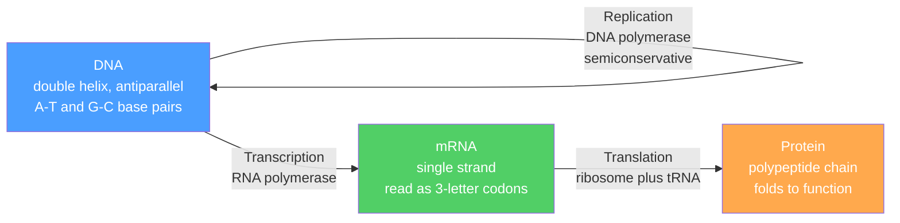

# 🧬 Nucleic Acids and the Central Dogma

> [!abstract] TL;DR
> Nucleic acids are the cell's information molecules. Each is a polymer of **nucleotides** — a nitrogenous base plus a pentose sugar plus a phosphate — strung together by a **phosphodiester backbone** with a directional $5' \to 3'$ polarity. **DNA** (deoxyribose, bases A/T/G/C, double-stranded) is the stable archive; **RNA** (ribose, uracil replaces thymine, usually single-stranded) is the working copy. The **Watson–Crick double helix** stores each strand as the complement of the other through **hydrogen-bonded base pairs** (A–T with two H-bonds, G–C with three). The **central dogma** describes how this information flows: DNA is copied by **replication**, transcribed into **mRNA**, and **translated** by ribosomes into protein using the near-universal 64-codon genetic code. Mutations, gene regulation, and biotech tools (PCR, sequencing, CRISPR) all follow directly from this chemistry.

## Intuition — analogy FIRST

Think of DNA as a **master cookbook locked in a library vault**. You never let the fragile master leave the vault, so to actually cook you photocopy one recipe (a gene) onto a cheap disposable sheet — that copy is **messenger RNA**. The photocopy travels to the kitchen (the **ribosome**), where a chef reads it three letters at a time. Each three-letter word (a **codon**) tells the chef which ingredient (**amino acid**) to add next to the dish (the growing **protein**). Special words say "start cooking" and "stop."

The two-strand design of DNA is the genius part: the master is written in duplicate, each page the mirror image of its partner. If one page is damaged, the cell rebuilds it from the surviving mirror. That is exactly why life copies itself so faithfully — every strand already carries a backup of the other.

---

## How It Works



---

## Key Concepts / Details

### Secondary Level

**The nucleotide has three parts.** Every nucleotide is a **nitrogenous base** + a **pentose sugar** + one or more **phosphate** groups. The base and sugar alone form a *nucleoside*; add phosphate and it becomes a *nucleotide*.

**Two families of bases:**
- **Purines** — larger, two fused rings: **A**denine and **G**uanine.
- **Pyrimidines** — smaller, one ring: **C**ytosine, **T**hymine (DNA only), and **U**racil (RNA only).

**DNA versus RNA.**

| Feature | DNA | RNA |
|---------|-----|-----|
| Sugar | 2'-**deoxy**ribose (no 2'-OH) | ribose (has 2'-OH) |
| Bases | A, G, C, **T** | A, G, C, **U** |
| Strands | double-stranded helix | usually single-stranded |
| Stability | high (archival) | lower (2'-OH is reactive) |
| Role | information storage | messenger, adaptor, catalyst |

**Complementary base pairing.** A always pairs with T (or U in RNA); G always pairs with C. Because the pairing rule is fixed, one strand *dictates* the sequence of the other — this is the physical basis of copying genetic information.

### Undergraduate Level

**The phosphodiester backbone and directionality.** A phosphate bridges the **3'-carbon** of one sugar to the **5'-carbon** of the next, forming a repeating sugar–phosphate backbone. Each strand therefore has a chemical polarity: a free **5' phosphate** at one end and a free **3'-OH** at the other. Polymerases add nucleotides only to the 3' end, so nucleic acids are always synthesized **$5' \to 3'$**. The two strands of a duplex run **antiparallel** ($5' \to 3'$ on one, $3' \to 5'$ on the other).

**The Watson–Crick double helix.** In the common B-form, two antiparallel strands wind into a right-handed helix with the hydrophobic bases stacked inside and the charged backbone outside. Pairing is stabilized by **hydrogen bonds** (see [[Chemical_Bonding_and_Molecular_Geometry]]):

| Pair | H-bonds | Consequence |
|------|---------|-------------|
| A – T (A–U) | 2 | weaker, melts at lower $T$ |
| G – C | 3 | stronger, raises melting temperature |

The helix exposes a wide **major groove** and a narrow **minor groove**; proteins read sequence mostly through the major groove. Because G–C pairs add a third hydrogen bond, **higher GC content raises the melting temperature $T_m$** — the point at which half the duplex has separated into single strands.

**Central dogma, step by step:**

1. **Replication (DNA → DNA).** *Semiconservative*: each daughter duplex keeps one parental strand. **DNA polymerase** extends a primer $5' \to 3'$, reading the template $3' \to 5'$. Because both strands are copied at one moving fork, one new strand (**leading**) grows continuously while the other (**lagging**) is built as short **Okazaki fragments** later joined by ligase. Polymerase **proofreads** with a $3' \to 5'$ exonuclease, lowering the error rate to ~$10^{-9}$ per base.
2. **Transcription (DNA → RNA).** **RNA polymerase** binds a **promoter** and synthesizes mRNA from the template strand. In eukaryotes the primary transcript is **processed**: a **5' cap** (protects and aids ribosome binding), a **poly-A tail** (stability and export), and **splicing** (introns removed, exons joined; alternative splicing lets one gene encode many proteins).
3. **Translation (RNA → protein).** The **ribosome** reads mRNA codons $5' \to 3'$; each **tRNA** carries an amino acid and an anticodon that base-pairs with the codon. Synthesis starts at **AUG** (Met) and ends at a **stop** codon (UAA, UAG, UGA).

**The genetic code.** 64 codons ($4^3$) encode 20 amino acids plus stop. It is **degenerate** (most amino acids have several codons, differing mostly in the third "wobble" base), **non-overlapping**, and **near-universal** across life.

**Mutations.**
- **Point mutation** — one base changed: *silent* (same amino acid, thanks to degeneracy), *missense* (different amino acid), or *nonsense* (creates a premature stop).
- **Frameshift** — an insertion or deletion not a multiple of three shifts the reading frame, garbling every downstream codon.

**Gene regulation.** Bacteria cluster genes into **operons** (e.g. the *lac* operon, switched by a repressor and inducer). Eukaryotes use **transcription factors** binding enhancers/promoters, and **epigenetics** — DNA methylation and histone modification — to turn genes on or off without changing the sequence.

**Biotech toolkit.**

| Tool | What it does | Key idea |
|------|--------------|----------|
| **PCR** | amplifies DNA exponentially | thermal cycling + primers + Taq polymerase |
| **Sanger sequencing** | reads sequence | chain-terminating dideoxynucleotides |
| **Next-gen sequencing** | massively parallel reads | millions of short reads at once |
| **Recombinant DNA** | splices genes into vectors | restriction enzymes + ligase |
| **CRISPR–Cas9** | edits the genome | guide RNA targets Cas9 to cut a chosen site |

### Graduate Level

**Thermodynamics of hybridization.** Duplex formation is a two-state equilibrium (single strands $\rightleftharpoons$ duplex) governed by base **stacking** and hydrogen bonding. The **nearest-neighbor model** sums experimentally tabulated $\Delta H^\circ$ and $\Delta S^\circ$ for each adjacent base-pair step. For a non-self-complementary duplex at total strand concentration $C_T$:

$$T_m = \frac{\Delta H^\circ}{\Delta S^\circ + R\ln\left(C_T/4\right)}$$

For long sequences an empirical salt-and-composition formula is often used:

$$T_m = 81.5 + 16.6\log_{10}[\text{Na}^+] + 0.41\,(\%\,GC) - \frac{600}{L}$$

Higher **GC content**, higher **salt** (cations screen backbone repulsion), and greater **length** $L$ all raise $T_m$; formamide and mismatches lower it. Hybridization **kinetics** are nucleation-limited — a few base pairs must form before the "zipper" closes cooperatively — which is why melting curves are sharp and sigmoidal rather than gradual.

**The RNA-world hypothesis.** DNA stores information but cannot catalyze; proteins catalyze but cannot template their own copying. RNA does **both** — it can carry a sequence *and* fold into a catalytic **ribozyme**. This suggests early life ran on RNA before DNA and protein specialized. The strongest living evidence: the **peptidyl transferase** center of the ribosome that forms every peptide bond is itself RNA, making the ribosome a ribozyme. Self-splicing introns and the RNase P enzyme are further ribozymes.

```python
# Transcribe a DNA coding strand to mRNA, translate to a peptide,
# and compute GC content and an estimated melting temperature.

# Standard genetic code as amino_acid -> list of DNA sense-strand codons.
CODON_GROUPS = {
    "F": ["TTT", "TTC"], "L": ["TTA", "TTG", "CTT", "CTC", "CTA", "CTG"],
    "I": ["ATT", "ATC", "ATA"], "M": ["ATG"], "V": ["GTT", "GTC", "GTA", "GTG"],
    "S": ["TCT", "TCC", "TCA", "TCG", "AGT", "AGC"], "P": ["CCT", "CCC", "CCA", "CCG"],
    "T": ["ACT", "ACC", "ACA", "ACG"], "A": ["GCT", "GCC", "GCA", "GCG"],
    "Y": ["TAT", "TAC"], "H": ["CAT", "CAC"], "Q": ["CAA", "CAG"],
    "N": ["AAT", "AAC"], "K": ["AAA", "AAG"], "D": ["GAT", "GAC"],
    "E": ["GAA", "GAG"], "C": ["TGT", "TGC"], "W": ["TGG"],
    "R": ["CGT", "CGC", "CGA", "CGG", "AGA", "AGG"], "G": ["GGT", "GGC", "GGA", "GGG"],
    "*": ["TAA", "TAG", "TGA"],  # stop codons
}
CODON = {c: aa for aa, cs in CODON_GROUPS.items() for c in cs}

def transcribe(coding_strand):
    """Coding (sense) DNA strand -> mRNA: identical sequence with T replaced by U."""
    return coding_strand.upper().replace("T", "U")

def translate(mrna):
    """Read mRNA from the first AUG; stop at the first in-frame stop codon."""
    dna = mrna.upper().replace("U", "T")          # use DNA letters for lookup
    start = dna.find("ATG")
    if start == -1:
        return ""
    peptide = []
    for i in range(start, len(dna) - 2, 3):
        aa = CODON[dna[i:i + 3]]
        if aa == "*":
            break
        peptide.append(aa)
    return "".join(peptide)

def gc_content(seq):
    seq = seq.upper()
    return 100 * (seq.count("G") + seq.count("C")) / len(seq)

def melting_temp(seq):
    """Wallace rule for short oligos: Tm = 2*(A+T) + 4*(G+C), in Celsius."""
    seq = seq.upper()
    return 2 * (seq.count("A") + seq.count("T")) + 4 * (seq.count("G") + seq.count("C"))

dna = "ATGGCCTGCAAAGGGTAA"          # Met-Ala-Cys-Lys-Gly-STOP
mrna = transcribe(dna)
print("mRNA:      ", mrna)           # AUGGCCUGCAAAGGGUAA
print("Peptide:   ", translate(mrna))# MACKG
print(f"GC content: {gc_content(dna):.1f}%")   # 50.0%
print(f"Tm (Wallace): {melting_temp(dna)} C")  # 54 C
```

---

## Real-World Notes

- **PCR and COVID tests.** Every RT-PCR diagnostic reverse-transcribes viral RNA to DNA, then amplifies it billions-fold — pure central-dogma chemistry run backward and forward in a tube.
- **mRNA vaccines.** The Pfizer/Moderna COVID vaccines deliver a chemically stabilized mRNA (with a modified base, pseudouridine, and a 5' cap and poly-A tail) so your own ribosomes translate the viral spike protein — the cell's translation machinery is the factory.
- **CRISPR gene therapy.** The 2023-approved sickle-cell therapy Casgevy uses CRISPR–Cas9 to edit the *BCL11A* enhancer, reactivating fetal hemoglobin — direct engineering of gene regulation.
- **Antibiotics target translation.** Tetracyclines, aminoglycosides, and macrolides all bind the bacterial ribosome; they work because bacterial and human ribosomes differ enough to be selectively poisoned.
- **PCR primer design.** Labs tune primer $T_m$ (via length and GC content) so both primers anneal at the same temperature — a daily practical use of the hybridization thermodynamics above.
- **Sequencing the genome.** The Human Genome Project (Sanger) took ~13 years; next-gen sequencing now reads a human genome in a day for under \$1000, reshaping medicine and forensics.

---

## Common Pitfalls

1. **Confusing coding and template strands.** mRNA is *identical* to the **coding (sense)** strand (with U for T); it is *synthesized from* the **template (antisense)** strand. Transcribing the wrong strand gives nonsense.
2. **Forgetting $5' \to 3'$ polarity.** Codons, replication, and transcription all read/write $5' \to 3'$. Writing a sequence without specifying its ends is ambiguous — always label the $5'$ end.
3. **Thinking degeneracy means randomness.** The code is degenerate but *not* ambiguous: one codon always maps to exactly one amino acid. Degeneracy buffers third-position mutations, it does not scramble meaning.
4. **Mixing up A–T vs G–C strength.** G–C has **three** hydrogen bonds and is more stable; a common exam error is assigning three bonds to A–T.
5. **Assuming RNA is always single-stranded.** RNA is *usually* single-stranded but folds on itself into hairpins and complex 3-D shapes (tRNA, rRNA, ribozymes) — that folding is what lets RNA catalyze.
6. **Treating the central dogma as one-way only.** Reverse transcriptases (retroviruses like HIV) copy RNA back into DNA; the dogma forbids protein → nucleic-acid flow, not RNA → DNA.

---

## Related Concepts

- [[_MOC_Biochemistry|↑ Section MOC]]
- [[Biomolecules_Overview]] — nucleic acids alongside proteins, carbohydrates, and lipids as the four biomolecule classes
- [[Protein_Structure_and_Function]] — the polypeptide product of translation and how its sequence dictates its fold
- [[Enzyme_Kinetics_and_Catalysis]] — polymerases and ribozymes are enzymes; kinetics govern replication and transcription rates
- [[Metabolism_and_Bioenergetics]] — nucleotides (ATP, GTP) power synthesis and are built by metabolic pathways
- [[Membranes_and_Cell_Signaling]] — signaling cascades ultimately regulate which genes are transcribed
- [[Chemical_Bonding_and_Molecular_Geometry]] — hydrogen bonding and base-stacking geometry that hold the double helix together
- [[Acids_Bases_and_pH]] — the phosphate backbone is a polyacid; base protonation states matter for pairing and stability
- [[_MOC_Mathematics_Master]] — combinatorics of the $4^3$ code and the thermodynamics of the two-state melting model
- [[_MOC_Biology_Master]] — molecular genetics, cell biology, and evolution build directly on this chemistry

---

## Review Questions

1. **Secondary**: A DNA strand reads $5'$-TACGGT-$3'$. Write the sequence of its complementary strand (with correct polarity) and the mRNA transcribed from the given strand acting as template.
2. **Undergraduate**: Explain why higher GC content raises a duplex's melting temperature. Then predict which of two 20-mers melts first: one that is 30% GC or one that is 70% GC, and justify using the number of hydrogen bonds.
3. **Graduate**: State the nearest-neighbor $T_m$ equation and explain each term. Why does raising $[\text{Na}^+]$ increase $T_m$, and why is duplex melting cooperative (sharp) rather than gradual? Relate your answer to the RNA-world claim that the ribosome is a ribozyme.

---

## Sources

- Alberts et al. — *Molecular Biology of the Cell*, 6th ed., Ch. 4–7
- Nelson & Cox — *Lehninger Principles of Biochemistry*, 8th ed., Ch. 8, 24–27
- Watson & Crick (1953) — "Molecular Structure of Nucleic Acids," *Nature* 171, 737
- SantaLucia, J. (1998) — "A unified view of polymer, dumbbell, and oligonucleotide nearest-neighbor thermodynamics," *PNAS* 95, 1460

#chemistry #biochemistry #DNA #RNA #centraldogma #geneticcode #transcription #translation #CRISPR #secondary #undergraduate #graduate
