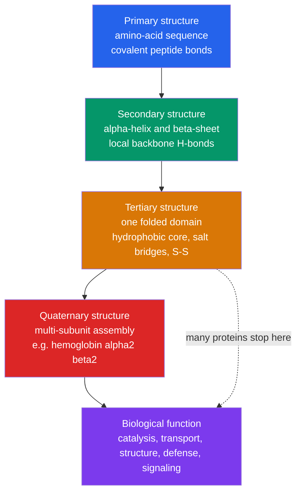

# 🧩 Protein Structure and Function

> [!abstract] TL;DR
> A protein is a linear chain of amino acids that folds into a precise three-dimensional machine, and **the sequence dictates the shape, which dictates the function**. The chain is stitched by **planar peptide bonds** (partial C–N double-bond character, *trans*-preferred), and its only real freedom is rotation about the two backbone dihedrals **$\phi$ and $\psi$**, whose allowed values are mapped by the **Ramachandran plot**. Structure is described at four levels — **primary** (sequence), **secondary** ($\alpha$-helix and $\beta$-sheet, held by backbone H-bonds), **tertiary** (the folded domain, held mainly by the **hydrophobic effect** plus H-bonds, salt bridges, and disulfides), and **quaternary** (multi-subunit assemblies like hemoglobin). By **Anfinsen's principle** the native fold is the sequence's thermodynamic free-energy minimum, reached down a **folding funnel** that resolves **Levinthal's paradox**. When folding fails you get **amyloid and prion disease**; when it is predicted, you get the **AlphaFold** revolution.

## Intuition — analogy FIRST

Think of a long strip of magnetic tape or a beaded necklace. Each bead is one of **20 amino acids**, and the order of beads is the only information written into the string. Yet dropped into water, this floppy string does not stay floppy: it **collapses into one specific, reproducible knot** — the same knot every time — like a self-folding origami crane that folds itself the instant you unwrap it. The magic is that all the folding instructions are already *encoded in the sequence of beads*; nothing external tells it what shape to take.

Why does it fold at all? Because some beads are **greasy (hydrophobic)** and some are **water-loving (hydrophilic)**. In water, the greasy beads huddle together on the inside to hide from the solvent — exactly like oil droplets coalescing in a vinaigrette — while the water-loving beads face outward. That single tendency, the **hydrophobic effect**, does most of the folding; hydrogen bonds and salt bridges then fine-tune the knot into a working tool: a catalyst, a cable, a pump, or an oxygen truck.

---

## How It Works



---

## Key Concepts / Details

### Secondary / Foundational Level

An amino acid has a central **$\alpha$-carbon** bearing four groups: an amino group ($-\text{NH}_3^+$), a carboxyl group ($-\text{COO}^-$), a hydrogen, and a variable **side chain R** that defines its personality (charged, polar, or hydrophobic). Two amino acids join by a **condensation reaction**: the carboxyl of one and the amino of the next fuse into a **peptide bond**, releasing one water. Repeat ~50–2000 times and you have a **polypeptide** with a repeating **backbone** ($-\text{N}-\text{C}_\alpha-\text{C}-$) and side chains hanging off it.

The central dogma of protein science: **sequence $\to$ structure $\to$ function**. Change one amino acid and you can create or destroy an enzyme, a disease, or a drug target. Broad functional classes: **enzymes** (catalysts), **transport** (hemoglobin carries O$_2$), **structural** (collagen in tendon, keratin in hair), **defense** (antibodies), and **signaling** (hormones and receptors).

**Denaturation** is unfolding: heat, extreme pH, or detergents disrupt the weak forces holding the fold, and the protein loses function — a frying egg's clear albumin turning opaque white is denatured protein aggregating irreversibly.

### Undergraduate Level

**The peptide bond is special.** Although drawn as a single C–N bond, resonance delocalizes the carbonyl lone pair, giving the bond **~40% double-bond character**. Consequences: the six atoms of the peptide unit ($\text{C}_\alpha, \text{C}, \text{O}, \text{N}, \text{H}, \text{C}_\alpha$) are **coplanar**, rotation about C–N is frozen (barrier $\approx 15$–$20$ kcal/mol), and the bond adopts the **trans** configuration ($\omega \approx 180^\circ$) to avoid side-chain clashes. Only **X–Pro** bonds show appreciable *cis* content ($\sim$5–6%).

Because the peptide unit is rigid, the backbone's only conformational freedom is rotation about the two bonds flanking each $\alpha$-carbon:

| Dihedral | Bond rotated | Typical $\alpha$-helix | Typical $\beta$-sheet |
|----------|--------------|:---:|:---:|
| $\phi$ (phi) | $\text{N}-\text{C}_\alpha$ | $-57^\circ$ | $\approx -120^\circ$ |
| $\psi$ (psi) | $\text{C}_\alpha-\text{C}$ | $-47^\circ$ | $\approx +120^\circ$ |
| $\omega$ (omega) | $\text{C}-\text{N}$ peptide bond | $180^\circ$ | $180^\circ$ |

The **Ramachandran plot** ($\phi$ on the x-axis, $\psi$ on the y-axis) shows that steric clashes forbid most of this space; only ~2–3 islands are allowed — the right-handed $\alpha$-helix region, the $\beta$-sheet region, and a small left-handed helix pocket. **Glycine** (R = H) has no side chain, so it roams almost anywhere; **proline** is ring-locked, restricting $\phi \approx -63^\circ$.

**Secondary structure** — regular local patterns stabilized *entirely by backbone hydrogen bonds*:

| Element | H-bond pattern | Geometry |
|---------|----------------|----------|
| $\alpha$-helix | C=O of residue $i$ to N–H of $i+4$ | right-handed; **3.6 residues/turn**, 1.5 Å rise/residue, 5.4 Å pitch |
| $\beta$-sheet | between strands (parallel or antiparallel) | extended, pleated; ~3.5 Å rise/residue |
| Turns / loops | i to i+3 ($\beta$-turn) | reverse chain direction; connect elements |

**Tertiary structure** is the full 3D fold of one chain, held by four forces (only one is covalent):

| Force | Nature | Role |
|-------|--------|------|
| **Hydrophobic effect** | entropic (water release) | **dominant** driver; buries nonpolar core |
| Hydrogen bonds | polar, directional | side-chain and backbone; specificity |
| Salt bridges | ionic (e.g. Asp$^-$···Lys$^+$) | surface and buried ion pairs |
| Disulfide bonds | **covalent** (Cys–S–S–Cys) | staples; formed in oxidizing ER/extracellular space |

**Anfinsen's principle (1961–1973):** denatured ribonuclease A spontaneously refolds to full activity with no help once the denaturant is removed — proof that **the sequence alone encodes the native structure**, and that the native state is the **thermodynamically most stable** accessible conformation (the *thermodynamic hypothesis*).

**Quaternary structure** — assembly of multiple folded chains. The classic case is **hemoglobin** ($\alpha_2\beta_2$): four globin subunits, each cradling a heme. Its S-shaped O$_2$-binding curve reflects **cooperativity** — binding at one site raises affinity at the others by shifting the whole tetramer from the low-affinity **T (tense)** state to the high-affinity **R (relaxed)** state.

**Structure determination** (see [[NMR_Spectroscopy]]):

| Method | Resolution / regime | Note |
|--------|--------------------|------|
| X-ray crystallography | atomic; needs crystals | historically the workhorse; static snapshot |
| NMR | atomic; $\lesssim$ 30–40 kDa in solution | gives dynamics and multiple conformers |
| Cryo-EM | now near-atomic; large complexes | no crystal needed; "resolution revolution" |

### Graduate Level

**The energetics of folding.** Folding is a delicate balance of large opposing terms:

$$\Delta G_{\text{fold}} = \Delta H - T\,\Delta S$$

The chain loses **conformational entropy** on folding (unfavorable), but the **hydrophobic effect** *releases* ordered water from around nonpolar surfaces, a large favorable **solvent-entropy** gain — the reason folding is dominated by entropy of the solvent, not the protein (see [[Chemical_Thermodynamics]]). The net is small: native proteins are only **marginally stable**, $\Delta G_{\text{fold}} \approx -5$ to $-15$ kcal/mol, comparable to a handful of hydrogen bonds. Marginal stability is a *feature* — it lets proteins flex, be regulated, and be degraded.

**Levinthal's paradox.** A 100-residue chain with even 3 accessible $\phi,\psi$ states per residue has $\sim 3^{100} \approx 5\times10^{47}$ conformations; sampling each in $10^{-13}$ s would take $>10^{34}$ s, vastly longer than the age of the universe. Yet real proteins fold in **microseconds to seconds**. Resolution: folding is not a random search but a **biased downhill process on a funnel-shaped energy landscape** (Wolynes, Onuchic; the *principle of minimal frustration*). The funnel's width is conformational entropy, its depth is energy; many pathways all drain toward the single native minimum at the bottom.

$$\theta = \frac{[\text{O}_2]^{\,n}}{P_{50}^{\,n} + [\text{O}_2]^{\,n}} \qquad (\text{Hill equation; hemoglobin } n \approx 2.8)$$

The **Bohr effect** couples this to acid–base chemistry: high CO$_2$ / low pH in metabolizing tissue protonates key residues, stabilizes the T state, and *dumps* O$_2$ where it is needed — allostery reading the local proton concentration (see [[Organometallic_and_Bioinorganic_Chemistry]] for the Fe–heme O$_2$ chemistry and [[Acids_Bases_and_pH]] for the p$K_a$ shifts).

**Molecular chaperones** assist folding in the crowded cell: **Hsp70** binds exposed hydrophobic patches to prevent premature aggregation; the **GroEL/GroES** chamber (a "folding cage") gives substrates isolated, ATP-driven attempts at the native state. They do not change the destination (Anfinsen still holds) — they improve the *yield and rate*.

**Post-translational modifications (PTMs)** expand the 20-letter alphabet: phosphorylation (Ser/Thr/Tyr — switches), glycosylation (folding and recognition), ubiquitination (degradation tag), acetylation and methylation (histone/epigenetic control), and proteolytic cleavage (zymogen activation). PTMs are how one gene yields many functional protein states.

**Misfolding disease.** When the funnel has a competing minimum, chains stack into **cross-$\beta$ amyloid fibrils**: Alzheimer's (A$\beta$, tau), Parkinson's ($\alpha$-synuclein), and type-2 diabetes (IAPP). **Prions** (PrP) are the extreme case — a misfolded conformer that *templates* its own shape onto normal copies, making misfolding **infectious** (mad cow disease, CJD).

**The computational revolution.** Predicting the fold from sequence — the "protein folding problem" — was largely solved by **AlphaFold2** (DeepMind, CASP14, 2020), a deep-learning model using attention over multiple-sequence alignments and residue-pair geometry; **AlphaFold3** (2024) extends to complexes with ligands and nucleic acids. Hundreds of millions of predicted structures now accelerate biology and drug discovery (see [[_MOC_AI_ML_Master]]). Caveat: it predicts a *static* native structure, not folding pathways, dynamics, or most mutation-driven stability changes.

```python
# Kyte-Doolittle hydropathy profile: locate hydrophobic stretches
# (membrane-spanning helices or buried core) via a sliding-window average.
import numpy as np
import matplotlib.pyplot as plt

# Kyte & Doolittle (1982) hydropathy index; positive = hydrophobic.
KD = {
    'I': 4.5, 'V': 4.2, 'L': 3.8, 'F': 2.8, 'C': 2.5, 'M': 1.9, 'A': 1.8,
    'G': -0.4, 'T': -0.7, 'S': -0.8, 'W': -0.9, 'Y': -1.3, 'P': -1.6,
    'H': -3.2, 'E': -3.5, 'Q': -3.5, 'D': -3.5, 'N': -3.5, 'K': -3.9,
    'R': -4.5,
}

# Human glycophorin A (partial): one transmembrane alpha-helix sits in the
# central hydrophobic stretch, flanked by polar extracellular/cytoplasmic tails.
seq = ("LSTTEVAMHTSTSSSVTKSYISSQTNDTHKRDTYAATPRAHEVSEISVRT"
       "VYPPEEETGERVQLAHHFSEPEITLIIFGVMAGVIGTILLISYGIRRLIKK"
       "SPSDVKPLPSPDTDVPLSSVEIENPETSDQ")

window = 19        # ~ span of a membrane-crossing alpha-helix
threshold = 1.6    # KD cutoff commonly used to flag TM helices

scores = np.array([KD.get(a, 0.0) for a in seq])
profile = np.convolve(scores, np.ones(window) / window, mode='valid')
centers = np.arange(window // 2, window // 2 + len(profile))

plt.figure(figsize=(9, 4))
plt.plot(centers, profile, lw=2, color='#2563eb')
plt.axhline(threshold, ls='--', color='#dc2626', label=f'TM threshold = {threshold}')
plt.axhline(0, color='gray', lw=0.6)
plt.fill_between(centers, profile, threshold,
                where=(profile > threshold), color='#dc2626', alpha=0.3)
plt.xlabel(f'Residue position (sliding window = {window})')
plt.ylabel('Kyte-Doolittle hydropathy')
plt.title('Hydropathy profile: peak above threshold = candidate TM helix')
plt.legend(); plt.tight_layout()

peak = centers[int(np.argmax(profile))]
print(f'Most hydrophobic window centered at residue {peak} '
      f'(mean hydropathy {profile.max():.2f})')
```

---

## Real-World Notes

- **Sickle-cell anemia** is a one-letter typo with global consequences: the mutation Glu6Val in $\beta$-globin swaps a surface acid for a hydrophobic valine, creating a sticky patch that polymerizes deoxy-hemoglobin into fibers, deforming red cells — a direct lesson that a single side chain can change quaternary behavior and clinical outcome.
- **Enzyme active sites** are tertiary-structure sculptures: folding brings residues that are far apart in sequence into a precise catalytic constellation, the basis of rate enhancement and specificity treated in [[Enzyme_Kinetics_and_Catalysis]].
- **Collagen**, the most abundant protein in the body, is a right-handed triple helix of **Gly-X-Y** repeats (X often Pro, Y often **hydroxyproline**). Prolyl hydroxylase needs **vitamin C**; without it the helix is unstable — the molecular cause of **scurvy**.
- **Keratin** ($\alpha$-helical coiled-coils cross-linked by disulfides) makes hair and nails rigid; a permanent wave chemically breaks and re-forms those S–S bonds to reset the shape.
- **Antibodies** use the immunoglobulin fold (a $\beta$-sandwich) with hypervariable loops (CDRs) whose sequence diversity generates near-infinite binding specificity — structure engineered by evolution for recognition.
- **AlphaFold** has predicted structures for essentially the entire human proteome and $>200$ million sequences, compressing decades of crystallography into a database query and reshaping structural biology and drug design (see [[_MOC_AI_ML_Master]]).

---

## Common Pitfalls

1. **Confusing the four levels.** Secondary structure is *only* local backbone hydrogen bonding ($\alpha/\beta$); tertiary is the whole 3D fold of one chain; quaternary requires *multiple* chains. An $\alpha$-helix is secondary even inside a huge tertiary fold.
2. **Thinking the peptide bond rotates freely.** It does not — its partial double-bond character makes each peptide unit planar and rigid. All backbone flexibility lives in $\phi$ and $\psi$, which is exactly why the Ramachandran plot has predictive power.
3. **Crediting hydrogen bonds as the main folding force.** In water, backbone H-bonds are largely a *wash* (they trade solvent H-bonds for internal ones). The **hydrophobic effect** — driven by solvent entropy — is the dominant driver; H-bonds and salt bridges add specificity, not bulk stability.
4. **Assuming denaturation is always irreversible.** Anfinsen showed refolding is spontaneous for small single-domain proteins. Irreversibility (a cooked egg) usually reflects *aggregation*, not a violation of the sequence-encodes-structure principle.
5. **Forgetting the redox environment of disulfides.** Cys–S–S–Cys bonds form in the oxidizing ER and extracellular space, not the reducing cytosol — so cytoplasmic proteins rarely rely on them for stability.
6. **Reading AlphaFold as ground truth for everything.** It predicts one static native fold with a confidence score (pLDDT); it does not (yet) reliably give conformational dynamics, folding pathways, the effect of point mutations on stability, or intrinsically disordered regions.

---

## Related Concepts

- [[_MOC_Biochemistry|↑ Section MOC]]
- [[Biomolecules_Overview]] — the 20 amino acids and how they compare to carbohydrates, lipids, and nucleic acids as the monomers of life
- [[Enzyme_Kinetics_and_Catalysis]] — how the folded active site achieves rate enhancement and specificity
- [[Metabolism_and_Bioenergetics]] — proteins as the molecular machines and enzymes running the cell's chemistry
- [[Nucleic_Acids_and_the_Central_Dogma]] — where the primary sequence comes from: DNA to mRNA to ribosomal translation
- [[Membranes_and_Cell_Signaling]] — membrane proteins and receptors whose hydrophobic helices the demo above detects
- [[Organometallic_and_Bioinorganic_Chemistry]] — the heme iron and metalloprotein chemistry behind hemoglobin allostery and the Bohr effect
- [[NMR_Spectroscopy]] — one of the three experimental pillars (with X-ray and cryo-EM) of structure determination
- [[Acids_Bases_and_pH]] — side-chain p$K_a$ values, buffering, and the protonation changes that drive the Bohr effect
- [[Stereochemistry_and_Chirality]] — why ribosomes build proteins from L-amino acids and how chirality shapes the fold
- [[Chemical_Thermodynamics]] — the $\Delta G = \Delta H - T\Delta S$ balance and solvent entropy that make the hydrophobic effect dominant
- [[_MOC_Mathematics_Master]] — Mathematics: dihedral geometry, energy landscapes, and the deep-learning optimization behind structure prediction
- [[_MOC_AI_ML_Master]] — AI/ML: AlphaFold and attention-based models that solved the folding-prediction problem

---

## Review Questions

1. **Secondary / Foundational**: Draw the formation of a peptide bond between two amino acids. Name the four levels of protein structure and give one real protein as an example of each level's importance. What happens to a protein when you boil it, and why?
2. **Undergraduate**: Explain why the peptide bond is planar and how this reduces the backbone's freedom to just two dihedral angles per residue. On a Ramachandran plot, locate the $\alpha$-helix and $\beta$-sheet regions and explain why glycine and proline are exceptions. Then list the four forces that stabilize tertiary structure and identify which one dominates and why.
3. **Graduate**: State Anfinsen's principle and Levinthal's paradox, and explain how the folding-funnel (energy-landscape) picture resolves the paradox without contradicting Anfinsen. Separately, write the Hill equation for hemoglobin, interpret a Hill coefficient of ~2.8, and describe mechanistically how the Bohr effect couples O$_2$ release to local pH via the T/R equilibrium.

---

## Sources

- Nelson & Cox — *Lehninger Principles of Biochemistry*, 8th ed., Ch. 3–4
- Berg, Tymoczko, Gatto & Stryer — *Biochemistry*, 9th ed.
- Branden & Tooze — *Introduction to Protein Structure*, 2nd ed.
- Anfinsen, C. B. (1973) — "Principles that Govern the Folding of Protein Chains," *Science* 181, 223
- Ramachandran, Ramakrishnan & Sasisekharan (1963) — *J. Mol. Biol.* 7, 95
- Kyte, J. & Doolittle, R. F. (1982) — *J. Mol. Biol.* 157, 105
- Jumper et al. (2021) — "Highly accurate protein structure prediction with AlphaFold," *Nature* 596, 583

---

#chemistry #biochemistry #proteins #protein-folding #peptide-bond #alpha-helix #beta-sheet #ramachandran #tertiary-structure #hemoglobin #anfinsen #amyloid #alphafold #undergraduate #graduate
