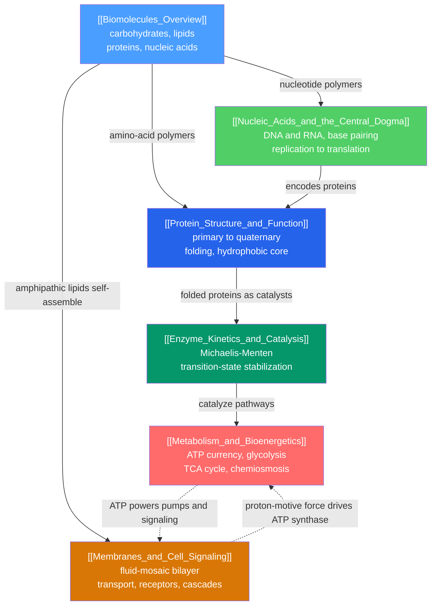

# 🧬 Biochemistry — Map of Content

> [!abstract] What This Section Covers
> Biochemistry is chemistry turned on living matter — the point where the "central science" hands off to biology. This section builds from the **four biomolecule classes** (carbohydrates, lipids, proteins, nucleic acids) up through the machines and information systems of the cell: how amino-acid chains fold into **functional proteins**, how proteins act as **enzyme catalysts**, how coupled reactions run the cell's **energy economy**, how **nucleic acids** store and transmit genetic information via the central dogma, and how **membranes** wall off the cell while **signaling cascades** let it sense and respond. Every note opens with an everyday analogy at secondary level and deepens to graduate-level mechanism and quantitative treatment. This section is the deliberate **bridge to the planned Biology vault** — it supplies the molecular mechanisms that biology builds upon.

## Concept Map

*(Blue = foundations, green/teal = information & catalysis, red/amber = energetics & membranes; arrows = "leads to" or "builds on")*

---

## Learning Path

*Recommended order for a first pass through this section:*

1. [[Biomolecules_Overview]] — the four molecular classes of life, condensation/hydrolysis, and why biology is homochiral.
2. [[Protein_Structure_and_Function]] — how sequence dictates fold dictates function, across the four levels of structure.
3. [[Enzyme_Kinetics_and_Catalysis]] — how folded proteins become catalysts, and the Michaelis–Menten framework for their rates.
4. [[Metabolism_and_Bioenergetics]] — how enzyme-catalyzed pathways run the cell's ATP-based energy economy.
5. [[Nucleic_Acids_and_the_Central_Dogma]] — how DNA and RNA store and express the information that specifies every protein.
6. [[Membranes_and_Cell_Signaling]] — how bilayers compartmentalize the cell and transduce signals across its boundary.

---

## All Notes in This Section

| Note | Core Idea | Difficulty |
|------|-----------|------------|
| [[Biomolecules_Overview]] | The four classes of biomolecule built from a small monomer alphabet, joined by condensation and cleaved by hydrolysis. | Secondary → Graduate |
| [[Protein_Structure_and_Function]] | Sequence determines fold determines function, from planar peptide bonds to Anfinsen's principle and AlphaFold. | Undergraduate → Graduate |
| [[Enzyme_Kinetics_and_Catalysis]] | Enzymes accelerate reactions by stabilizing the transition state, giving saturating Michaelis–Menten kinetics. | Undergraduate → Graduate |
| [[Metabolism_and_Bioenergetics]] | Thermodynamics applied to life: ATP coupling, glycolysis through oxidative phosphorylation, and chemiosmosis. | Undergraduate → Graduate |
| [[Nucleic_Acids_and_the_Central_Dogma]] | Nucleotide polymers, Watson–Crick base pairing, and the flow of information from DNA to RNA to protein. | Secondary → Graduate |
| [[Membranes_and_Cell_Signaling]] | Self-assembled bilayers, membrane transport and potential, and receptor-driven second-messenger cascades. | Undergraduate → Graduate |

---

## Key Questions This Section Answers

- Why does life run on just four classes of molecule, and why is it homochiral (L-amino acids, D-sugars)?
- How can a single amino-acid sequence reliably fold into one precise three-dimensional machine?
- Why do enzyme rates plateau, and what do $K_M$, $k_{cat}$, and $k_{cat}/K_M$ actually tell us?
- How does the cell pay for uphill reactions, and why is the real payoff of ATP hydrolysis larger than the textbook value?
- How does information flow from a DNA archive to a working protein, and what makes the genetic code near-universal?
- How does a greasy bilayer both wall off the cell and, via receptors and cascades, let it sense the outside world?

---

## Connections to Other Sections

- [[_MOC_Chemistry_Master|↑ Chemistry Master MOC]]
- [[_MOC_Organic_Chemistry|→ Organic Chemistry]] — functional groups, [[Stereochemistry_and_Chirality]], and mechanisms are the language of every biomolecule.
- [[_MOC_Physical_Chemistry|→ Physical Chemistry]] — [[Chemical_Thermodynamics]] underpins bioenergetics, [[Chemical_Kinetics]] underpins enzyme rates, and [[Electrochemistry]] underpins membrane potentials.
- [[_MOC_Biology_Master|→ Biology (planned vault)]] — biochemistry is the shared border; this section provides the molecular mechanisms the future Biology vault will build on.

#MOC #Chemistry #Biochemistry
