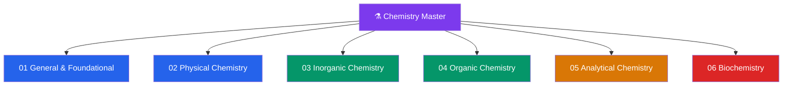

# ⚗️ Chemistry — Master Map of Content

> [!abstract] About This Vault
> A comprehensive chemistry reference spanning **senior secondary through graduate level** — **~39 notes across 6 sections**. Every note opens with an everyday analogy accessible to a secondary student, builds through undergraduate theory and quantitative treatment, and reaches graduate formalism, mechanisms, and research connections. Sections cover **General & Foundational Chemistry**, **Physical Chemistry**, **Inorganic Chemistry**, **Organic Chemistry**, **Analytical Chemistry**, and **Biochemistry** — the "central science" that bridges [[_MOC_Physics_Master|Physics]] and biology. Each note pairs chemical intuition with rigorous theory, worked calculations (Python where useful), real-world applications, common pitfalls, and tiered review questions.

## Vault Architecture

## Sections at a Glance

| # | Section | Notes | Entry Point | Level Range |
|---|---------|-------|-------------|-------------|
| 01 | General & Foundational Chemistry | 7 | [[_MOC_General_Chemistry]] | Secondary → Undergraduate |
| 02 | Physical Chemistry | 7 | [[_MOC_Physical_Chemistry]] | Secondary → Graduate |
| 03 | Inorganic Chemistry | 6 | [[_MOC_Inorganic_Chemistry]] | Undergraduate → Graduate |
| 04 | Organic Chemistry | 7 | [[_MOC_Organic_Chemistry]] | Secondary → Graduate |
| 05 | Analytical Chemistry | 6 | [[_MOC_Analytical_Chemistry]] | Undergraduate → Graduate |
| 06 | Biochemistry | 6 | [[_MOC_Biochemistry]] | Undergraduate → Graduate |

---

## Section Contents

**01 — General & Foundational Chemistry** — [[_MOC_General_Chemistry]]
- [[Atomic_Structure_and_Subatomic_Particles]]
- [[Periodic_Table_and_Periodic_Trends]]
- [[Chemical_Bonding_and_Molecular_Geometry]]
- [[Stoichiometry_and_the_Mole]]
- [[States_of_Matter_and_Gas_Laws]]
- [[Solutions_and_Concentration]]
- [[Acids_Bases_and_pH]]

**02 — Physical Chemistry** — [[_MOC_Physical_Chemistry]]
- [[Chemical_Thermodynamics]]
- [[Chemical_Kinetics]]
- [[Chemical_Equilibrium]]
- [[Electrochemistry]]
- [[Quantum_Chemistry_and_Atomic_Orbitals]]
- [[Molecular_Spectroscopy_and_Symmetry]]
- [[Phase_Equilibria_and_Colligative_Properties]]

**03 — Inorganic Chemistry** — [[_MOC_Inorganic_Chemistry]]
- [[Periodic_Trends_and_Main_Group_Chemistry]]
- [[Coordination_Chemistry_and_Ligand_Field_Theory]]
- [[Transition_Metals_and_the_d_Block]]
- [[Solid_State_and_Crystal_Structures]]
- [[Inorganic_Acids_Bases_and_Redox]]
- [[Organometallic_and_Bioinorganic_Chemistry]]

**04 — Organic Chemistry** — [[_MOC_Organic_Chemistry]]
- [[Structure_Bonding_and_Functional_Groups]]
- [[Stereochemistry_and_Chirality]]
- [[Reaction_Mechanisms_and_Arrow_Pushing]]
- [[Nucleophilic_Substitution_and_Elimination]]
- [[Addition_and_Carbonyl_Chemistry]]
- [[Aromaticity_and_Electrophilic_Aromatic_Substitution]]
- [[Pericyclic_Radical_and_Polymer_Chemistry]]

**05 — Analytical Chemistry** — [[_MOC_Analytical_Chemistry]]
- [[Titrations_and_Volumetric_Analysis]]
- [[Chromatography]]
- [[Mass_Spectrometry]]
- [[UV_Vis_and_IR_Spectroscopy]]
- [[NMR_Spectroscopy]]
- [[Analytical_Statistics_and_Electroanalysis]]

**06 — Biochemistry** — [[_MOC_Biochemistry]]
- [[Biomolecules_Overview]]
- [[Protein_Structure_and_Function]]
- [[Enzyme_Kinetics_and_Catalysis]]
- [[Metabolism_and_Bioenergetics]]
- [[Nucleic_Acids_and_the_Central_Dogma]]
- [[Membranes_and_Cell_Signaling]]

---

## Learning Paths

### Path 1 — Senior Secondary Student
> Best for: grades 11–12, building the foundation and preparing for university entrance.

[[Atomic_Structure_and_Subatomic_Particles]] → [[Periodic_Table_and_Periodic_Trends]] → [[Chemical_Bonding_and_Molecular_Geometry]] → [[Stoichiometry_and_the_Mole]] → [[States_of_Matter_and_Gas_Laws]] → [[Solutions_and_Concentration]] → [[Acids_Bases_and_pH]] → [[Chemical_Equilibrium]] → [[Structure_Bonding_and_Functional_Groups]]

### Path 2 — Physical Chemistry Track
> Best for: understanding *why* reactions happen — energy, rate, and equilibrium.

[[Chemical_Thermodynamics]] → [[Chemical_Equilibrium]] → [[Chemical_Kinetics]] → [[Electrochemistry]] → [[Phase_Equilibria_and_Colligative_Properties]] → [[Quantum_Chemistry_and_Atomic_Orbitals]] → [[Molecular_Spectroscopy_and_Symmetry]]

### Path 3 — Organic Chemistry Track
> Best for: mastering structure, mechanism, and synthesis.

[[Structure_Bonding_and_Functional_Groups]] → [[Stereochemistry_and_Chirality]] → [[Reaction_Mechanisms_and_Arrow_Pushing]] → [[Nucleophilic_Substitution_and_Elimination]] → [[Addition_and_Carbonyl_Chemistry]] → [[Aromaticity_and_Electrophilic_Aromatic_Substitution]] → [[Pericyclic_Radical_and_Polymer_Chemistry]] → [[NMR_Spectroscopy]]

### Path 4 — Inorganic & Materials Track
> Best for: bonding beyond carbon, metals, and solids.

[[Periodic_Trends_and_Main_Group_Chemistry]] → [[Coordination_Chemistry_and_Ligand_Field_Theory]] → [[Transition_Metals_and_the_d_Block]] → [[Solid_State_and_Crystal_Structures]] → [[Inorganic_Acids_Bases_and_Redox]] → [[Organometallic_and_Bioinorganic_Chemistry]]

### Path 5 — Analytical & Instrumental Track
> Best for: identifying and quantifying — the chemist's measurement toolkit.

[[Titrations_and_Volumetric_Analysis]] → [[Analytical_Statistics_and_Electroanalysis]] → [[UV_Vis_and_IR_Spectroscopy]] → [[NMR_Spectroscopy]] → [[Mass_Spectrometry]] → [[Chromatography]]

### Path 6 — Biochemistry / Life Track
> Best for: chemistry of living systems (bridges the future Biology vault).

[[Biomolecules_Overview]] → [[Protein_Structure_and_Function]] → [[Enzyme_Kinetics_and_Catalysis]] → [[Metabolism_and_Bioenergetics]] → [[Nucleic_Acids_and_the_Central_Dogma]] → [[Membranes_and_Cell_Signaling]]

---

## Cross-Vault Links

Chemistry is the **central science** — it sits between physics and biology and connects to much of this ecosystem:

- **Physics** — [[_MOC_Physics_Master]]: quantum mechanics ([[Schrodinger_Equation]], [[Wave_Particle_Duality_and_Uncertainty]], [[Angular_Momentum_and_Spin]]) underpins atomic orbitals and bonding; [[Laws_of_Thermodynamics]] and [[Entropy_and_Second_Law]] are the foundation of chemical thermodynamics; [[Kinetic_Theory_of_Gases]] underlies gas laws and reaction kinetics; [[Atomic_Models_and_Spectroscopy]] connects to molecular spectroscopy.
- **Mathematics** — [[_MOC_Mathematics_Master]]: differential equations (rate laws), linear algebra (molecular orbitals, symmetry groups), and probability (statistical thermodynamics).
- **Signals & Systems** — [[_MOC_SS_Master]]: the [[Fourier_Transform]] and [[DFT_and_FFT]] are the mathematical heart of FT-NMR, FT-IR, and FT-MS.
- **AI/ML** — [[_MOC_AI_ML_Master]]: cheminformatics, molecular property prediction, and generative models for molecules build directly on this foundation.
- **Biology** *(forthcoming vault)* — [[_MOC_Biology_Master]]: biochemistry is the shared border; this vault provides the molecular mechanisms.

---

## Section MOC Index

- [[_MOC_General_Chemistry]] — the foundation: atoms, the periodic table, bonding, the mole, gases, solutions, and acid–base basics.
- [[_MOC_Physical_Chemistry]] — the *why*: thermodynamics, kinetics, equilibrium, electrochemistry, and the quantum/spectroscopic view of matter.
- [[_MOC_Inorganic_Chemistry]] — beyond carbon: periodic trends, coordination complexes, transition metals, solids, and organometallics.
- [[_MOC_Organic_Chemistry]] — the chemistry of carbon: functional groups, stereochemistry, mechanisms, and the major reaction classes.
- [[_MOC_Analytical_Chemistry]] — measurement and identification: titrations, chromatography, mass spec, and spectroscopy.
- [[_MOC_Biochemistry]] — chemistry of life: biomolecules, enzymes, metabolism, nucleic acids, and cell signaling.

#MOC #Chemistry #MasterMOC
