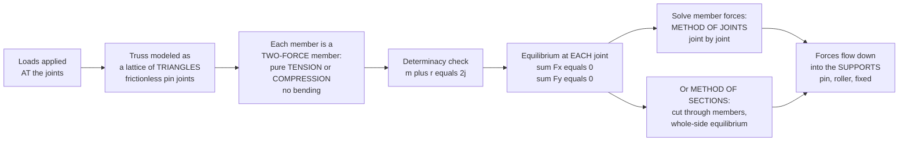

# 🔺 Analysis of Trusses and Frames

> [!abstract] TL;DR
> A **truss** is a web of straight members pinned at their ends into a lattice of **triangles** — the one polygon that cannot change shape without stretching or crushing a side. Under loads applied *only at the joints*, every member becomes a **two-force member** carrying pure **axial force**: it is either being pulled apart (**tension**) or squashed together (**compression**), never bent. That single idealization collapses a fearsome structure into arithmetic — at each frictionless pin the forces must balance ($\sum F_x = 0,\ \sum F_y = 0$), so you can solve member forces one joint at a time (**method of joints**) or cut clean through a few members and use whole-section equilibrium (**method of sections**). A truss is **statically determinate** when $m + r = 2j$; too few members and it is a mechanism, too many and it is indeterminate. **Frames** relax the pin idealization to *rigid* connections, so their members carry combined axial force, **shear**, *and* **bending** — the step from a bridge truss to a real building skeleton. Triangulation is why bridges, roofs, towers, and cranes span enormous distances with the least material.

---

## Intuition

**Analogy first — the triangle that refuses to fold.** Push sideways on a square frame of four hinged sticks and it collapses lazily into a diamond: nothing has to stretch or break, the corners just rotate. Now add one diagonal to make two triangles. Push again and it *will not move* — to change the shape you would have to physically lengthen or shorten a stick, and sticks are stubborn. That is the whole secret of a truss: **triangles are geometrically locked**, so a web of triangles holds its shape and carries load. And here is the beautiful simplification that falls out of it — in an ideal truss, with every member pinned at its ends and every load hung at the joints, each straight bar can do only **one** thing. It is either being stretched (tension) or crushed (compression), never bent, because a two-force member with forces only at its two ends must have those forces along the line connecting them.

That reduces the terrifying steel lattice of a bridge to a knot you untangle one loop at a time. At every pin the forces the members exert must exactly cancel — otherwise the joint would fly off — so you stand at a joint where only two unknowns remain, write "up equals down, left equals right," solve them, and walk to the next joint. Member by member, you come to *know* which bars are being stretched thin and which are being squeezed, and a compression member (which can buckle) gets sized differently from a tension member (which cannot). It is the first, most intuitive tool in all of structural analysis, and it teaches the two ideas everything else rests on: **equilibrium**, and **tension-versus-compression reasoning**.

---

## How It Works

### Core Mechanics

1. **Idealize the structure.** Replace the real joints with **frictionless pins** and assume all loads and reactions act *at the joints*. Members are straight and weightless (or their weight is lumped to the joints). These assumptions are what make each member a **two-force member** — force enters only at its two pinned ends, so equilibrium of the member forces those two forces to be equal, opposite, and *collinear with the member axis*. Hence: pure axial force, no bending.
2. **Classify each member: tension or compression.** Adopt the universal convention **tension positive** — a member in tension *pulls its two joints toward each other*; a member in compression *pushes them apart*. You do not need to guess the sign in advance: assume every member is in tension, solve, and a negative answer simply means compression.
3. **Check stability and determinacy first.** Count members $m$, reaction components $r$, and joints $j$. Each joint gives two equilibrium equations in 2D, so there are $2j$ equations. Then:
   - $m + r < 2j$ → **unstable mechanism** (under-triangulated; it will collapse).
   - $m + r = 2j$ → **statically determinate** (solvable by statics alone) — *provided* it is also properly arranged.
   - $m + r > 2j$ → **statically indeterminate** (over-braced; needs compatibility from member deformation).
4. **Method of joints — solve the whole lattice.** Isolate each pin as a free body. The members meeting there exert axial forces along their axes; the applied loads and reactions add in. Demand $\sum F_x = 0$ and $\sum F_y = 0$. Start at a joint with only *two* unknown members and sweep through — or, better, assemble *all* the joint equations into one linear system $A\mathbf{x} = \mathbf{b}$ and solve it at once (exactly what the demo does).
5. **Method of sections — target a few members directly.** To find the force in one or two specific members buried deep in the truss without marching through every joint, make an imaginary **cut** straight through them (through at most three members with unknown forces), then apply the three planar equilibrium equations ($\sum F_x, \sum F_y, \sum M$) to the *entire* portion on one side. A clever moment center kills two unknowns and hands you the third in a single equation.
6. **Spot zero-force members.** Two non-collinear members meeting at an unloaded joint both carry zero force; likewise a member is zero-force if it is the lone out-of-line member at a two-member joint with no load. These carry no force *for this load case* but provide bracing and stability — never delete them.
7. **Frames and machines extend the idea.** A **frame** has at least one **multi-force member** (loaded at more than two points, or rigidly connected), so its members are *not* two-force members: they carry axial force **and shear and bending moment** together. You dismember the frame, draw a free body of each member (obeying Newton's third law at every connection), and solve — the bridge from truss analysis into full **beam and frame** analysis, where real, usually *indeterminate*, building skeletons live.

### Flow / Architecture



---

## Key Concepts

**Secondary (intuitive).**
- A **triangle cannot be squashed out of shape** without changing a side length; a square can. So structures are built from triangles to stay rigid.
- In a truss, each bar is either **stretched (tension)** or **squeezed (compression)** — and nothing is bent.
- Forces at every joint **cancel out** (up equals down, left equals right); that balance is what lets you solve the whole thing.
- **Supports**: a *roller* lets the truss slide and push only one way; a *pin* holds it in two directions; a *fixed* support holds it and stops it rotating.

**Undergraduate (structural analysis).**
- **Two-force member principle.** A straight member loaded only at its two pinned ends carries force *along its axis only* — the rigorous reason truss members are axial (tension/compression) and bending-free.
- **Static determinacy of a plane truss:** $m + r = 2j$ (members + reaction components = twice the joints). $m + r < 2j$ ⇒ unstable; $= 2j$ ⇒ determinate; $> 2j$ ⇒ indeterminate to degree $(m + r) - 2j$. The count is *necessary but not sufficient* — a truss can meet $m + r = 2j$ yet be **geometrically unstable** if the members are badly arranged (e.g., a panel left un-triangulated while another is over-braced).
- **Method of joints:** at each pin, $\sum F_x = 0$ and $\sum F_y = 0$ (two equations, so start where ≤ 2 members are unknown). Resolve each member force into components using the member's direction cosines.
- **Method of sections:** cut through the members of interest (≤ 3 unknown-force members), then apply $\sum F_x = \sum F_y = \sum M_O = 0$ to a whole side; choosing $O$ at the intersection of two unknowns isolates the third.
- **Zero-force members:** identified by inspection at unloaded two- or three-member joints; simplify the analysis and provide bracing/buckling restraint.
- **Sign convention:** tension positive. A negative solved force = compression. Compression members must be checked for **buckling** (they can fail below their yield stress), tension members for **yield/net-section** capacity.
- **Reactions first (usually):** solve the global support reactions from overall equilibrium before diving into joints or sections.

**Graduate (advanced and computational).**
- **Matrix (direct-stiffness) truss analysis.** Assemble each member's stiffness $\frac{EA}{L}$ into a global system $\mathbf{K}\mathbf{u} = \mathbf{f}$, solve for nodal displacements $\mathbf{u}$, then recover member forces $F = \frac{EA}{L}(\text{axial elongation})$. This handles **indeterminate** trusses (where statics alone fails) by carrying equilibrium *and* compatibility *and* the material law together — the direct ancestor of the finite-element method (see [[CAD_CAE_and_Finite_Element_Method]]).
- **Determinate vs. indeterminate structures.** Real frames are almost always **statically indeterminate** (redundant members/supports for safety and stiffness). Solving them needs **compatibility** conditions — force/flexibility methods, the slope-deflection or moment-distribution methods, or energy methods (Castigliano's theorem, unit-load / virtual work).
- **Frames and machines.** Multi-force members carry an internal triple — axial force $N$, shear $V$, and bending moment $M$ — related along the member by $\frac{dV}{dx} = -w(x)$ and $\frac{dM}{dx} = V(x)$. Rigid joints transmit moment; the analysis dismembers the frame and enforces Newton's third law at every connection.
- **Geometric stability and the singular Jacobian.** The equilibrium matrix $A$ becomes singular exactly when the truss is a mechanism or is at a kinematic singularity — the linear-algebra signature of instability, detectable as a zero (or near-zero) determinant / rank deficiency of $A$ (see [[Systems_of_Linear_Equations]]).
- **Graphical methods (Maxwell / Cremona).** Before computers, member forces were read off a scaled **force polygon** (Maxwell diagram) built joint by joint — historically important and still a fine sanity check on force direction.
- **Space trusses.** In 3D each joint gives *three* equations, so the determinacy condition generalizes to $m + r = 3j$; ball-and-socket joints replace pins.

---

## Python Demo

```python
# Method of joints as ONE linear system for a determinate plane (Warren) truss.
# Tension is positive. At every joint: sum Fx = 0 and sum Fy = 0.
# We assemble the 2j equilibrium equations in the unknowns
# [member axial forces ..., support reactions ...] and solve  A x = b,
# then (a) draw the truss colored by tension/compression and
#      (b) bar-chart the member forces and confirm static determinacy m + r = 2j.
import numpy as np
import matplotlib.pyplot as plt

# ---- Geometry: 3-panel Warren truss, span 12 m, height 3 m ----
joints = np.array([
    [ 0.0, 0.0],   # 0  B0  bottom-left   (PIN support)
    [ 4.0, 0.0],   # 1  B1  bottom
    [ 8.0, 0.0],   # 2  B2  bottom
    [12.0, 0.0],   # 3  B3  bottom-right  (ROLLER support)
    [ 2.0, 3.0],   # 4  T0  top
    [ 6.0, 3.0],   # 5  T1  top
    [10.0, 3.0],   # 6  T2  top
])
names = ["B0", "B1", "B2", "B3", "T0", "T1", "T2"]

members = [
    (0, 1), (1, 2), (2, 3),                    # bottom chord
    (4, 5), (5, 6),                            # top chord
    (0, 4), (4, 1), (1, 5), (5, 2), (2, 6), (6, 3),   # diagonals (fully triangulated)
]

loads    = {4: (0.0, -10.0), 5: (0.0, -10.0), 6: (0.0, -10.0)}   # 10 kN down at each top joint
supports = {0: (True, True),    # pin    -> Rx, Ry
            3: (False, True)}   # roller -> Ry

j, m = len(joints), len(members)
reaction_dofs = [(node, ax) for node, (rx, ry) in supports.items()
                 for ax, on in enumerate((rx, ry)) if on]
r = len(reaction_dofs)

# ---- Static determinacy:  m + r == 2 j ----
determinate = (m + r == 2 * j)
print(f"members m = {m}, reactions r = {r}, joints j = {j}")
print(f"m + r = {m + r}   vs   2j = {2*j}   ->  "
      f"{'STATICALLY DETERMINATE' if determinate else 'NOT determinate'}")
assert determinate, "Truss is not statically determinate -- cannot solve by statics alone"

# ---- Assemble equilibrium system  A x = b   (tension positive) ----
# x = [F_0 ... F_{m-1}, R_0 ... R_{r-1}]
A = np.zeros((2 * j, m + r))
b = np.zeros(2 * j)
for k, (a, c) in enumerate(members):
    d = joints[c] - joints[a]
    u = d / np.hypot(*d)                 # unit vector a -> c
    A[2*a:2*a+2, k] += u                 # a tension member pulls joint a toward c
    A[2*c:2*c+2, k] -= u                 # ... and pulls joint c toward a
for idx, (node, ax) in enumerate(reaction_dofs):
    A[2*node + ax, m + idx] = 1.0        # reaction acts on its joint
for node, (fx, fy) in loads.items():     # applied loads move to the RHS
    b[2*node]     -= fx
    b[2*node + 1] -= fy

x = np.linalg.solve(A, b)
forces, reactions = x[:m], x[m:]

# ---- Report ----
print("\nMember forces (tension +, compression -):")
for (a, c), F in zip(members, forces):
    state = "TENSION" if F > 1e-9 else ("COMPRESSION" if F < -1e-9 else "zero-force")
    print(f"  {names[a]}-{names[c]:<3s}: {F:+7.2f} kN   {state}")
print("\nSupport reactions:")
for (node, ax), R in zip(reaction_dofs, reactions):
    print(f"  {names[node]} {'Rx' if ax == 0 else 'Ry'} = {R:+6.2f} kN")

# =====================  PLOTS  =====================
fig, (axT, axB) = plt.subplots(1, 2, figsize=(14, 5.5))

# (a) truss diagram colored by tension / compression
Fmax = np.max(np.abs(forces))
for (a, c), F in zip(members, forces):
    color = "crimson" if F > 1e-9 else ("royalblue" if F < -1e-9 else "grey")
    axT.plot(joints[[a, c], 0], joints[[a, c], 1],
             color=color, lw=1.5 + 5 * abs(F) / Fmax, zorder=1)
    mid = joints[[a, c]].mean(axis=0)
    axT.text(mid[0], mid[1] + 0.12, f"{F:+.0f}", ha="center", va="bottom", fontsize=8)
axT.scatter(joints[:, 0], joints[:, 1], s=140, color="black", zorder=3)
for xy, nm in zip(joints, names):
    axT.text(xy[0], xy[1] - 0.4, nm, ha="center", fontsize=9, color="dimgray")
for node, (fx, fy) in loads.items():                 # applied loads (down)
    x0, y0 = joints[node]
    axT.annotate("", xy=(x0, y0), xytext=(x0, y0 + 1.3),
                 arrowprops=dict(arrowstyle="-|>", color="darkorange", lw=2))
    axT.text(x0, y0 + 1.45, f"{-fy:.0f} kN", ha="center", color="darkorange", fontsize=8)
for (node, ax_), R in zip(reaction_dofs, reactions):  # vertical reactions (up)
    if ax_ == 1:
        x0, y0 = joints[node]
        axT.annotate("", xy=(x0, y0), xytext=(x0, y0 - 1.4),
                     arrowprops=dict(arrowstyle="-|>", color="seagreen", lw=2.5))
        axT.text(x0, y0 - 1.75, f"{R:.0f} kN", ha="center", color="seagreen", fontsize=8)
axT.plot([], [], color="crimson", lw=3, label="tension")
axT.plot([], [], color="royalblue", lw=3, label="compression")
axT.set_title("(a) Warren truss member forces (method of joints)")
axT.set_aspect("equal"); axT.axis("off"); axT.legend(loc="lower center", ncol=2)

# (b) member-force bar chart
labels = [f"{names[a]}-{names[c]}" for a, c in members]
colors = ["crimson" if F > 1e-9 else ("royalblue" if F < -1e-9 else "grey") for F in forces]
axB.bar(range(m), forces, color=colors)
axB.axhline(0, color="black", lw=0.8)
axB.set_xticks(range(m)); axB.set_xticklabels(labels, rotation=60, ha="right", fontsize=8)
axB.set_ylabel("Axial force  (kN)    tension +  /  compression -")
axB.set_title("(b) Bottom chord in tension, top chord in compression")
axB.grid(axis="y", alpha=0.3)

plt.tight_layout()
plt.savefig("trusses_and_frames.png", dpi=130)
# Symmetric 30 kN load -> reactions 15 kN each; top chord compresses, bottom chord tensions,
# and the diagonals alternate sign as they shuttle shear down to the supports.
```

Running it first prints the determinacy check ($m + r = 14 = 2j$, so **determinate**), then every member force tagged **TENSION** or **COMPRESSION**, and the symmetric 15 kN reactions. The truss diagram (a) draws tension members in red and compression members in blue with line-thickness scaled to force magnitude — you can literally *see* the bottom chord being stretched and the top chord being crushed — while the bar chart (b) confirms the classic pattern and shows how the diagonals shuttle the vertical shear down to the supports.

---

## Real-World Applications

> **Example — a steel through-truss bridge.** In a Pratt or Warren railway bridge, the deck loads hang at the bottom-chord joints and flow into the triangulated web exactly as the demo shows: the **bottom chord stretches in tension**, the **top chord is crushed in compression**, and the diagonals carry the shear diagonally down to the abutment supports. Engineers size each member for *its* action — slender high-strength steel rods or eyebars for tension members (which cannot buckle), and stockier box or wide-flange sections for compression members (which can). The method of sections lets a designer pull the force in a single critical mid-span chord in one equation without solving the entire lattice.

- **Roof and floor trusses.** Timber and light-gauge-steel roof trusses (Fink, Howe, king-post) span houses and warehouses with minimal material; the triangulated web turns a long span into short axial members.
- **Transmission and communication towers, cranes.** Lattice towers and crane booms are 3D **space trusses** — triangulation gives enormous stiffness-to-weight, and tower-crane jibs are analyzed as trusses hanging from tie-bars in tension.
- **Stadium roofs, airport terminals, space frames.** Long-span **space-frame** roofs (double-layer grids, geodesic domes) are 3D trusses where triangulation carries huge column-free spans.
- **Building frames.** Moment-resisting steel and concrete building skeletons are **frames**, not trusses: rigid beam-column joints carry bending and shear, so they are analyzed with frame/beam methods and are almost always statically indeterminate.
- **Bicycle frames, pylons, formwork shoring, and geodesic structures** — anywhere a stiff, light, load-carrying skeleton is needed, triangulation is the answer.

---

## Common Pitfalls

- **Applying a load *between* joints.** The whole two-force-member simplification requires loads *at the joints*. A load hung mid-member introduces **bending** into that member, breaking the "pure axial" assumption — it is now a beam, not a truss member. Model such loads by adding a joint, or analyze the member as a beam.
- **Trusting the determinacy count blindly.** $m + r = 2j$ is *necessary but not sufficient*. A truss can satisfy it yet be a **geometrically unstable** mechanism (one panel un-triangulated while another is doubly braced). Always confirm the arrangement is actually stable — computationally, watch for a singular / near-singular equilibrium matrix.
- **Getting the tension/compression sign wrong.** Forgetting the *tension-positive* convention, or mishandling the direction cosines, flips signs. The safe habit: assume every member is in tension; a negative result *is* compression. Read the sign, do not guess it.
- **Sizing a compression member like a tension member.** Compression members can **buckle** and fail well below their yield stress; tension members cannot. Two members with equal-magnitude force but opposite sign need very different cross-sections. The sign is not cosmetic.
- **Deleting zero-force members.** They carry no force *for the current load case*, but they brace compression members against buckling and stabilize the geometry for *other* load cases. Identifying them simplifies analysis; removing them can wreck the structure.
- **Cutting through more than three unknown members in a section.** The method of sections gives only three planar equations, so a cut may expose at most three members with unknown forces (unless geometry lets you eliminate some by moment choice). Cut through four and you have more unknowns than equations.
- **Treating a rigid-jointed frame as a pin-jointed truss.** Real building frames have **moment-carrying** connections; their members carry shear and bending, and they are usually **indeterminate**. Force-fitting the method of joints onto them ignores the very forces (bending moments) that govern their design.
- **Ignoring self-weight or lumping it wrongly.** The idealization assumes weightless members; when member weight matters, it must be distributed as *equivalent joint loads*, not left acting mid-span (which would, again, introduce bending).

---

## Related Concepts

- [[Statics_and_Equilibrium]] — the parent skill: truss analysis *is* joint-by-joint application of $\sum F = 0$ and $\sum M = 0$; the method of joints and sections are equilibrium bookkeeping on isolated free bodies.
- [[Stress_Strain_and_Deformation]] — once you know a member's axial force, this note turns it into stress ($\sigma = P/A$) and elongation ($\delta = PL/AE$), and decides whether the member yields, buckles, or survives.
- [[Newtons_Laws_and_Kinematics]] — truss equilibrium is **Newton's first law** ($\sum \vec F = 0$) at rest; dismembering a frame enforces **Newton's third law** (equal-and-opposite forces) at every connection.
- [[Systems_of_Linear_Equations]] — assembling all the joint-equilibrium equations gives $A\mathbf{x} = \mathbf{b}$; solving a truss is linear algebra, and a singular $A$ is the algebraic signature of an unstable mechanism.
- [[CAD_CAE_and_Finite_Element_Method]] — the matrix/direct-stiffness generalization ($\mathbf{K}\mathbf{u} = \mathbf{f}$) that handles indeterminate trusses and full frames, and the ancestor of modern structural FEA software.

This note is the first in a structural-analysis sequence: it feeds into *Structural Loads and Load Paths* (where the joint loads come from), *Beams: Shear and Bending Moment* (the multi-force members that frames introduce), *Deflection and Statically Indeterminate Structures* (closing the indeterminate case with compatibility), *Structural Steel Design* (sizing the tension and compression members), and *Bridge Engineering* (trusses at full scale).

---

## Review Questions

1. **(Secondary)** Why does a bridge built from triangles hold its shape while a bridge built from squares would sag and fold? In your own words, explain what "a member in tension" and "a member in compression" mean, and give one everyday example of each.
2. **(Undergraduate)** A plane truss has $m$ members, $r$ reaction components, and $j$ joints. State the static-determinacy condition and interpret each of $m + r < 2j$, $m + r = 2j$, and $m + r > 2j$. Then, for a simply supported truss carrying downward loads on its top chord, argue from equilibrium why the bottom chord ends up in tension while the top chord is in compression — and explain when you would reach for the *method of sections* instead of the *method of joints*.
3. **(Graduate)** You are handed a truss that satisfies $m + r = 2j$, yet a finite-element solver reports a near-singular equilibrium matrix and refuses to converge. Explain what has gone wrong physically, why the determinacy count did not catch it, and how the same matrix formulation would change if the structure were instead *indeterminate* (say a redundant diagonal added). What extra physical condition does the indeterminate case require that pure statics cannot supply?

---

## Sources

- Hibbeler, R. C. — *Structural Analysis*, 10th ed. (Pearson) — trusses, method of joints/sections, frames and machines, determinacy.
- Hibbeler, R. C. — *Engineering Mechanics: Statics*, 14th ed. (Pearson) — two-force members and the foundational joint/section methods.
- Kassimali, A. — *Structural Analysis*, 6th ed. (Cengage) — plane and space trusses, stability/determinacy, matrix methods.
- Leet, K., Uang, C.-M., & Gilbert, A. — *Fundamentals of Structural Analysis*, 5th ed. (McGraw-Hill) — trusses, frames, and the transition to indeterminate structures.

---

#civil-engineering #trusses #method-of-joints #tension-compression #structural-analysis
