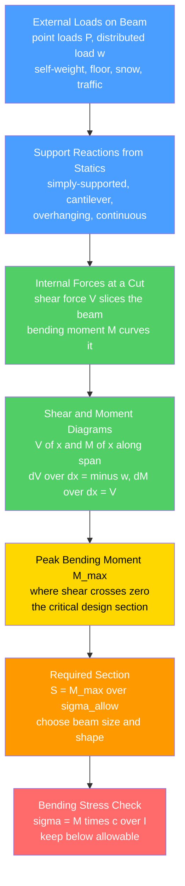

# 🌉 Beams, Shear, and Bending Moment

> [!abstract] TL;DR
> A **beam** is a member that carries loads applied *across* its length — a floor joist, a bridge girder, a lintel over a door. Those transverse loads develop two internal effects at every cross-section: a **shear force** $V$ that tries to *slice* the beam and a **bending moment** $M$ that tries to *curve* it. The structural engineer's core skill is drawing the **shear-force and bending-moment diagrams** — running plots of $V(x)$ and $M(x)$ down the span — built from support reactions and the relations $\dfrac{dV}{dx} = -w$ and $\dfrac{dM}{dx} = V$. Their peaks locate the **critical section** (usually the *maximum moment*, often at midspan). The **flexure formula** $\sigma = \dfrac{M c}{I}$ then converts that peak moment into a fibre stress; sizing the beam means choosing a section whose **section modulus** $S = I/c$ keeps $\sigma$ below the material's allowable value (steel, concrete, or timber) while deflection stays acceptable. Read those two diagrams and you know exactly where and how hard a beam works — the bread-and-butter of everyday structural design. *This is the civil/structural framing; for the derivation and mechanics-of-materials view see [[Bending_and_Beam_Theory]].*

---

## Intuition

**Analogy first.** A beam is *anything horizontal that bridges a gap*: a floor joist between two walls, a girder between two bridge piers, a shelf between two brackets. Put a load on it and that load tries to do two distinct things at once. First it tries to **slice** the beam vertically — imagine a giant pair of scissors cutting just inside the support; that slicing tendency is the **shear force**. Second it tries to **bend** the beam into a sag — and that bending is the **bending moment**.

Picture standing on the end of a diving board. Near the support the board is being *sheared* like scissors; along its length it is being *bent* so the **top fibres stretch** and the **bottom fibres compress** (or the reverse, depending on which way it curves). Some layer in between — the **neutral axis** — feels nothing at all. To design any beam you must know, *at every point along its length*, how much shear and how much bending it feels. The classic tools that reveal this are the **shear diagram** and the **bending-moment diagram** — two running plots that show exactly where the beam works hardest, usually the peak bending near midspan. Read those two diagrams and you know precisely where a beam will fail — so you can put the material where it is actually needed.

---

## How It Works

### Core Mechanics

1. **Trace the load path to the beam.** Real loads — self-weight, floor slabs, snow, people, traffic — arrive as **point loads** $P$, **distributed loads** $w(x)$ (force per unit length), or applied moments. Everything the beam supports ultimately flows through it into the supports (see structural load-path analysis).
2. **Classify the supports and find the reactions.** A **simply-supported** beam sits on a pin and a roller; a **cantilever** is built in at one end and free at the other; **overhanging** beams project past a support; **continuous** beams run over three or more supports. Apply $\sum F = 0$ and $\sum M = 0$ to solve the **reactions**. Determinate beams (simply-supported, cantilever, overhanging) are fully solved by statics; continuous beams are *indeterminate* and need compatibility (a sibling topic).
3. **Cut the beam and expose the internals.** Make an imaginary cut at position $x$ and re-apply equilibrium to one piece. What appears is the **internal shear force** $V(x)$ (the transverse force the two halves trade) and the **internal bending moment** $M(x)$ (the couple resisting curvature).
4. **Use the load–shear–moment chain.** Along the span, $\dfrac{dV}{dx} = -w(x)$ and $\dfrac{dM}{dx} = V(x)$. So **shear is the integral of the load** and **moment is the integral of the shear**. A key consequence: the **maximum moment occurs where the shear crosses zero**. Concentrated loads make $V$ *jump*; applied couples make $M$ *jump*.
5. **Draw the two diagrams.** Plot $V(x)$ and $M(x)$ down the length. These **SFD and BMD** are *the* output of beam analysis — their peaks are the **critical sections** where material is most stressed.
6. **Convert peak moment to stress and size the section.** At the critical section, the **flexure formula** gives $\sigma = \dfrac{M c}{I}$: bending stress grows linearly with distance $c$ from the neutral axis, and inversely with the section's **second moment of area** $I$. Design requires $\sigma_{max} = \dfrac{M_{max}}{S} \le \sigma_{allow}$, i.e. pick a section whose **section modulus** $S = I/c$ exceeds $\dfrac{M_{max}}{\sigma_{allow}}$.
7. **Check shear and deflection too.** Transverse **shear stress** $\tau = \dfrac{VQ}{Ib}$ peaks at the neutral axis (governing short, deep beams and concrete webs), and **deflection** must stay under serviceability limits like $L/360$ (a sibling topic).

### Flow / Architecture



---

## Key Concepts

### Secondary Level

- **A beam bridges a gap and bends under load.** Stand on a plank spanning two chairs: it curves, the **bottom stretches** (tension) and the **top squeezes** (compression), with a layer in the middle that does neither.
- **Two things happen at once.** The load tries to **slice** the beam (shear) and to **bend** it (bending moment). Both change as you move along the length.
- **The diagrams are a map of where it works hardest.** The **shear diagram** and **bending-moment diagram** show, point by point, how much slicing and bending the beam feels — the peak (usually at midspan) is where it is most likely to fail.
- **Deeper is stronger.** A plank laid flat sags; the same plank turned on edge barely moves — depth is what fights bending. That is why beams are tall, not wide.

### Undergraduate Level

- **Fundamental relations:** $w(x) = -\dfrac{dV}{dx}$ and $V(x) = \dfrac{dM}{dx}$. Load integrates to shear; shear integrates to moment. **Max moment where $V = 0$.** Point loads → *jump* in $V$; couples → *jump* in $M$; a uniform load → *linear* $V$ and *parabolic* $M$.
- **Standard cases (simply-supported, span $L$):** central point load $P$ → $M_{max} = \dfrac{PL}{4}$ at midspan; uniform load $w$ → $M_{max} = \dfrac{wL^2}{8}$ at midspan. **Cantilever, tip load $P$:** $M_{max} = PL$ at the fixed end. Memorizing these gives instant sanity checks.
- **Flexure formula:** $\sigma = \dfrac{M c}{I}$, linear through the depth, zero at the **neutral axis** (the centroid), maximum at the outer fibre $c$. The peak is $\sigma_{max} = \dfrac{M}{S}$ with **section modulus** $S = I/c$.
- **Design inequality:** require $S \ge \dfrac{M_{max}}{\sigma_{allow}}$, then pick the **lightest standard section** (e.g. a rolled steel W-shape / UB) that satisfies it — the everyday structural sizing task.
- **Second moment of area:** $I = \displaystyle\int_A y^2\,dA$; rectangle $I = \dfrac{bh^3}{12}$ (the $h^3$ is why depth dominates). The **parallel-axis theorem** $I = I_c + Ad^2$ explains the I-shape: flanges far from the axis carry the bending, the web carries the shear.
- **Transverse shear stress:** $\tau = \dfrac{VQ}{Ib}$, *maximum at the neutral axis* — opposite to bending stress. It governs short/deep members and reinforced-concrete web (stirrup) design.
- **Sign convention:** adopt **sagging-positive** moment and keep it consistent across the whole beam; mixing conventions is the classic error.

### Graduate Level

- **Indeterminate and continuous beams:** most real building and bridge beams run continuously over supports and are statically indeterminate. Solve by **force (flexibility)**, **slope-deflection**, **moment-distribution (Hardy Cross)**, or **stiffness/matrix** methods; continuity redistributes moment to the supports (negative moment) and reduces midspan moment.
- **Moving loads and influence lines:** for bridges the critical moment comes from *moving* traffic. **Influence lines** and the **moment envelope** (the worst moment at each section over all load positions) drive girder and flange sizing.
- **Load and resistance factor design (LRFD / limit states):** modern codes (AISC 360, ACI 318, Eurocodes) factor loads *up* and resistances *down*: $\phi M_n \ge M_u$. Steel design also checks **lateral-torsional buckling** of the compression flange and **local buckling** (compact vs slender sections).
- **Reinforced concrete flexure:** concrete cracks in tension, so **steel rebar** carries tension below the neutral axis; the section is designed for a **whole-section moment capacity** $M_n = A_s f_y (d - a/2)$ (a sibling topic), a very different mental model from a homogeneous elastic beam.
- **Plastic analysis:** past yield the stress block fills; the **plastic moment** $M_p = \sigma_y Z$ (plastic section modulus $Z$) and formation of **plastic hinges** underlie collapse-load / limit-state design of steel frames.
- **Timoshenko / deep beams:** for span-to-depth ratios below about 10, shear deformation is significant and Euler-Bernoulli under-predicts deflection; deep beams and corbels are designed by **strut-and-tie** models instead.
- **Composite action:** steel beams acting compositely with a concrete slab (via shear studs) shift the neutral axis up and sharply raise stiffness and capacity — the workhorse of modern floor framing.

---

## Python Demo

```python
# Beams, Shear, and Bending Moment -- the structural-design workflow
#   (a) SHEAR-FORCE and BENDING-MOMENT DIAGRAMS for a simply-supported beam
#       under a uniform (dead+live) load plus a central point load.
#       Reactions from statics; V from the load; M as the INTEGRAL of V.
#       Confirms M_max sits where the shear crosses zero (dM/dx = V = 0).
#   (b) FLEXURAL DESIGN: from M_max, required section modulus S_req = M_max/sigma_allow,
#       then pick the lightest standard steel section (S >= S_req) and check
#       sigma = M*c/I = M/S <= sigma_allow.
#   (c) The linear bending-stress distribution through the chosen section's depth.
import numpy as np
import matplotlib.pyplot as plt

# ---------------------------------------------------------------
# (a) SHEAR & MOMENT DIAGRAMS   (units: kN, m)
# ---------------------------------------------------------------
L = 8.0            # span, m
w = 15.0           # uniform distributed load, kN/m  (dead + live)
P = 30.0           # central point load, kN
a = L / 2.0        # point-load position, m

# Reactions of a simply-supported beam (symmetric -> equal reactions)
R_A = R_B = (w * L + P) / 2.0        # kN

x  = np.linspace(0.0, L, 2001)
dx = x[1] - x[0]

# Shear: left reaction, minus accumulated UDL, minus point load once passed
V = R_A - w * x - P * np.heaviside(x - a, 1.0)     # kN

# Moment as the running integral of the shear (M = int V dx); M(0)=0 at a pin
M = np.concatenate(([0.0], np.cumsum(0.5 * (V[:-1] + V[1:]) * dx)))   # kN*m

i_max = np.argmax(np.abs(M))
M_max = M[i_max]                     # kN*m
print(f"(a) Reactions R_A = R_B = {R_A:.1f} kN")
print(f"    Closed-form check: wL^2/8 + PL/4 = {w*L**2/8 + P*L/4:.1f} kN*m")
print(f"    Max moment |M| = {M_max:.1f} kN*m at x = {x[i_max]:.2f} m "
      f"(shear there = {V[i_max]:.2f} kN ~ 0)")

# ---------------------------------------------------------------
# (b) FLEXURAL DESIGN -- choose the lightest steel section that works
# ---------------------------------------------------------------
sigma_allow = 165.0                  # allowable bending stress, MPa (~0.66*Fy, Fy=250)
M_Nmm = M_max * 1.0e6                 # kN*m -> N*mm
S_req = M_Nmm / sigma_allow           # required section modulus, mm^3
print(f"\n(b) Allowable stress = {sigma_allow:.0f} MPa")
print(f"    Required section modulus S_req = {S_req/1e3:.0f} cm^3")

# Catalogue of standard I-sections: (name, S_x [cm^3], mass [kg/m], depth [mm])
sections = [
    ("IPE 300", 557.0, 42.2, 300.0),
    ("IPE 330", 713.0, 49.1, 330.0),
    ("IPE 360", 904.0, 57.1, 360.0),
    ("IPE 400", 1160.0, 66.3, 400.0),
    ("IPE 450", 1500.0, 77.6, 450.0),
    ("IPE 500", 1930.0, 90.7, 500.0),
]
names   = [s[0] for s in sections]
S_cm3   = np.array([s[1] for s in sections])
mass    = np.array([s[2] for s in sections])
depth   = np.array([s[3] for s in sections])
sigma_sec = M_Nmm / (S_cm3 * 1.0e3)   # bending stress in each section, MPa

# Lightest passing section: smallest mass among those with S >= S_req AND stress OK
ok = S_cm3 * 1e3 >= S_req
chosen = int(np.argmax(ok))           # first (lightest, list is ascending) that passes
print(f"    {'Section':9s} {'S [cm^3]':>9s} {'sigma [MPa]':>12s} {'mass [kg/m]':>12s}  status")
for j, nm in enumerate(names):
    status = "OK" if ok[j] else "fails"
    mark = "  <-- chosen (lightest OK)" if j == chosen else ""
    print(f"    {nm:9s} {S_cm3[j]:9.0f} {sigma_sec[j]:12.1f} {mass[j]:12.1f}  {status}{mark}")

# ---------------------------------------------------------------
# (c) LINEAR BENDING-STRESS DISTRIBUTION for the chosen section
# ---------------------------------------------------------------
h  = depth[chosen]                    # section depth, mm
c  = h / 2.0                          # extreme fibre distance, mm
S  = S_cm3[chosen] * 1.0e3            # mm^3
I  = S * c                            # mm^4  (since S = I/c)
y  = np.linspace(-c, c, 200)          # through-depth coordinate, mm
sigma_y = (M_Nmm / I) * y             # MPa: linear, zero at neutral axis

# ---------------------------------------------------------------
# PLOTS
# ---------------------------------------------------------------
fig, ax = plt.subplots(2, 2, figsize=(13, 8))

# Shear diagram
ax[0, 0].fill_between(x, V, 0, color="#4a9eff", alpha=0.35)
ax[0, 0].plot(x, V, color="#1c6fd6", lw=2)
ax[0, 0].axhline(0, color="k", lw=0.8)
ax[0, 0].set_title("(a) Shear-Force Diagram  V(x)")
ax[0, 0].set_xlabel("x  [m]"); ax[0, 0].set_ylabel("V  [kN]"); ax[0, 0].grid(alpha=0.3)

# Moment diagram (sagging plotted positive-up)
ax[0, 1].fill_between(x, M, 0, color="#51cf66", alpha=0.35)
ax[0, 1].plot(x, M, color="#2f9e44", lw=2)
ax[0, 1].plot(x[i_max], M_max, "ro")
ax[0, 1].annotate(f"M_max = {M_max:.0f} kN*m\nat x = {x[i_max]:.1f} m (V=0)",
                  xy=(x[i_max], M_max), xytext=(0.12, 0.30),
                  textcoords="axes fraction",
                  arrowprops=dict(arrowstyle="->", color="r"))
ax[0, 1].axhline(0, color="k", lw=0.8)
ax[0, 1].set_title("(b) Bending-Moment Diagram  M(x)")
ax[0, 1].set_xlabel("x  [m]"); ax[0, 1].set_ylabel("M  [kN*m]"); ax[0, 1].grid(alpha=0.3)

# Design check: bending stress per candidate section vs allowable
axb = ax[1, 0]
colors = ["#ff6b6b" if not ok[j] else ("#2f9e44" if j == chosen else "#ff9900")
          for j in range(len(names))]
bars = axb.bar(np.arange(len(names)), sigma_sec, color=colors, alpha=0.85)
axb.axhline(sigma_allow, color="k", ls="--", lw=1.5,
            label=f"allowable = {sigma_allow:.0f} MPa")
axb.set_xticks(np.arange(len(names)))
axb.set_xticklabels(names, rotation=30, ha="right", fontsize=8)
axb.set_ylabel("bending stress  M/S  [MPa]")
axb.set_title("(c) Design Check -- pick lightest section with sigma <= allowable")
axb.legend(fontsize=8); axb.grid(alpha=0.3, axis="y")

# Linear bending-stress distribution through the chosen section
axd = ax[1, 1]
axd.plot(sigma_y, y, color="#9b59b6", lw=2)
axd.fill_betweenx(y, sigma_y, 0, color="#9b59b6", alpha=0.20)
axd.axhline(0, color="k", lw=1.0)
axd.axvline(0, color="k", lw=0.8)
axd.text(sigma_y.max() * 0.5, c * 0.85, "tension\n(bottom fibre)",
         ha="center", va="center", fontsize=8, color="#7d3c98")
axd.text(sigma_y.min() * 0.5, -c * 0.85, "compression\n(top fibre)",
         ha="center", va="center", fontsize=8, color="#7d3c98")
axd.set_title(f"(d) Bending stress through depth -- {names[chosen]}  (sigma = M c / I)")
axd.set_xlabel("stress  [MPa]"); axd.set_ylabel("distance from neutral axis  y  [mm]")
axd.grid(alpha=0.3)

plt.tight_layout()
plt.savefig("beam_shear_moment_demo.png", dpi=120)
print("\nSaved figure -> beam_shear_moment_demo.png")
```

**What it shows.** Part (a) builds the shear and moment diagrams straight from equilibrium and integration, and confirms the headline rule — the maximum moment lands exactly where the shear passes through zero (midspan here), matching the closed-form $wL^2/8 + PL/4$. Part (b)/(c) turns that peak moment into the real design decision a structural engineer makes every day: compute the required section modulus, then step up a catalogue of standard rolled sections and select the **lightest one whose bending stress stays under the allowable** — the sections below it *fail*, the ones above it are wasteful. Part (d) draws the flexure formula itself: stress is **linear through the depth**, zero at the neutral axis, tension on the bottom face and compression on the top — the picture behind $\sigma = Mc/I$.

---

## Real-World Applications

- **Building floor and roof framing** — steel W-shape (or IPE/UB) beams and joists, reinforced-concrete beams, and glulam timber members are all sized so $\sigma_{max} = M/S \le \sigma_{allow}$ *and* deflection $\le L/360$. The bending-moment diagram from the floor loads sets the beam depth for every span in the building.
- **Bridges** — plate girders and box girders are proportioned from the **moment envelope** of moving traffic (an influence-line calculation); flange thickness follows the peak moment, web and stiffeners follow the shear diagram.
- **Lintels, headers, and transfer beams** — the beam over a window or door, and the deep transfer girder that carries a column landing mid-air, are pure shear-and-moment problems; the diagrams tell the mason or fabricator exactly how deep the member must be.
- **Retaining walls and foundations** — a cantilever retaining-wall stem is a vertical beam bending under soil pressure; a strip footing is an upside-down beam bending under soil bearing reaction. Same $V$ and $M$ diagrams, rotated.
- **Cranes, formwork, and scaffolding** — temporary works are designed with the same SFD/BMD logic; a mis-read moment diagram on falsework is a classic construction-collapse cause.

> **Example:** A typical steel floor beam in an office building might span 8 m carrying a factored load of roughly 15 kN/m, giving $M_{max} \approx wL^2/8 \approx 120\,\text{kN·m}$. The engineer computes $S_{req} = M/\sigma_{allow}$, opens the section tables, and picks the *lightest* wide-flange whose section modulus clears it — then verifies shear at the supports and deflection at midspan. That three-line calculation, repeated for every beam on every floor, is the daily reality of structural design, and it rests entirely on reading the shear and bending-moment diagrams correctly.

---

## Common Pitfalls

- **Confusing shear with moment.** Shear force *slices* (transverse force at a cut); bending moment *curves* (the couple). They are different quantities with different diagrams, different critical locations, and different failure checks — never mix them.
- **Forgetting the max moment is where shear = 0.** Because $dM/dx = V$, the moment peaks exactly where the shear diagram crosses zero — *not* necessarily under the biggest load. Find the zero-shear point first, then evaluate the moment there.
- **Dropping the jumps.** A concentrated load makes the shear diagram *step* vertically; an applied couple makes the moment diagram *step*. Sketching smooth curves through these discontinuities gives the wrong peak.
- **Wrong sign or inconsistent convention.** Pick sagging-positive (or hogging-positive) and hold it for the *entire* beam. Continuous beams have negative (hogging) moment over interior supports and positive (sagging) at midspan — both matter, and the reinforcement or flange goes on the tension side of each.
- **Sizing on the wrong axis of $I$.** The section modulus $S = I/c$ must be taken about the *bending axis*. A beam installed on its side (weak axis) can have a fraction of the intended capacity — a real erection error.
- **Checking bending but not shear.** Short, deep beams (and reinforced-concrete beams near supports) are often **shear-critical**: $\tau = VQ/Ib$ peaks at the neutral axis while bending peaks at midspan. Both must pass.
- **Ignoring deflection and buckling.** A beam can satisfy the stress check yet be too *flexible* (bouncy floors) or fail by **lateral-torsional buckling** of the compression flange before reaching its bending strength. Strength, stiffness, and stability are separate limit states.
- **Treating reinforced concrete like a homogeneous beam.** Concrete cracks in tension, so the elastic $\sigma = Mc/I$ picture does not size it — the tension steel and a cracked-section moment capacity do. Use the right model for the material.

---

## Related Concepts

- [[Bending_and_Beam_Theory]] — the companion mechanics-of-materials note: the full derivation of the flexure formula from plane-sections kinematics, the elastic curve, and the deflection standard cases. This note is the *civil/structural design framing* of that same physics.
- [[Statics_and_Equilibrium]] — support reactions (the very first step of every beam analysis) come straight from $\sum F = 0$ and $\sum M = 0$; determinacy of a beam is decided here.
- [[Stress_Strain_and_Deformation]] — the internal $V$ and $M$ are converted to *stresses* on the cross-section; this note supplies the stress/strain concepts the flexure formula rests on.
- [[Stress_Strain_and_Elastic_Moduli]] — the allowable bending stress and the Young's modulus $E$ that governs deflection are material properties defined here; picking steel vs concrete vs timber changes $\sigma_{allow}$ and $E$.
- [[Rotational_Dynamics]] — the **second moment of area** $I = \int y^2\,dA$ behind $S = I/c$ is the geometric cousin of the *mass* moment of inertia $\int r^2\,dm$; both reward pushing material far from the axis.

*Sibling notes in this section (referenced in prose): Structural Loads and Load Paths (what arrives at the beam), Analysis of Trusses and Frames (members that carry axial force instead of bending), Deflection and Statically Indeterminate Structures (the stiffness/continuity companion), Reinforced Concrete Design and Structural Steel Design (turning the moment diagram into a real member).*

---

## Review Questions

1. **(Secondary)** You lay a plank across two chairs and stand in the middle. Which face of the plank is in tension and which is in compression, and roughly where along the plank is the bending worst? If you turned the same plank on its edge, would it sag more or less, and why?
2. **(Undergraduate)** A simply-supported beam of span $L$ carries a uniform load $w$ over its whole length. Sketch the shear and bending-moment diagrams, state where the maximum moment occurs and its value, and explain — using $dM/dx = V$ — why that is exactly where the shear diagram crosses zero.
3. **(Undergraduate/Graduate)** Given $M_{max} = 180\ \text{kN·m}$ and an allowable bending stress of $165\ \text{MPa}$, compute the required section modulus and describe how you would select a real rolled steel section from a table. Which *other* two checks must the chosen section still pass before it is acceptable?
4. **(Graduate)** A continuous beam runs over three supports. Explain qualitatively how the bending-moment diagram differs from three separate simply-supported spans, where the reinforcement (or the compression flange bracing) must go, and why an indeterminate analysis is needed to get the numbers. When would plastic (limit-state) analysis give a higher usable capacity than the elastic $\sigma = M/S$ check?

---

## Sources

- Hibbeler, R. C. *Structural Analysis*, 10th ed. Pearson. (Shear and moment diagrams, influence lines, indeterminate beams.)
- Kassimali, A. *Structural Analysis*, 6th ed. Cengage. (Reactions, SFD/BMD, force and displacement methods.)
- Hibbeler, R. C. *Mechanics of Materials*, 10th ed. Pearson. (Flexure formula, section modulus, transverse shear.)
- Gere, J. M. & Goodno, B. J. *Mechanics of Materials*, 9th ed. Cengage. (Bending stress, standard beam cases.)
- AISC *Steel Construction Manual* / ACI 318 *Building Code Requirements for Structural Concrete*. (Code-based flexural design and section tables.)

---

#civil-engineering #beams #shear-force #bending-moment #flexure
