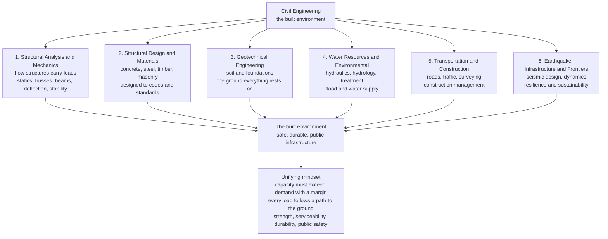

# 🏗️ Civil Engineering: Building the Permanent, Public, Load-Bearing World

> [!abstract] TL;DR
> **Civil engineering** is the oldest and broadest branch of engineering — the discipline that designs, builds, and maintains the physical **infrastructure of civilization**: the buildings we live and work in, the **bridges**, roads, and railways we cross, the dams and tunnels that reshape the landscape, the water and sewer systems that make cities habitable, and the ports, airports, and **foundations** that carry it all. Where other engineers make *devices* you can hold, the civil engineer makes the **large, permanent, public, load-bearing world** — works that must **not fail** and must **last generations**, standing against gravity, wind, earthquakes, floods, and time itself, out of humble materials: concrete, steel, timber, soil, and water. This vault is organized into **six pillars** — **(1) Structural Analysis & Mechanics** (how structures carry loads), **(2) Structural Design & Materials** (designing with concrete, steel, timber, and masonry to codes), **(3) Geotechnical Engineering** (soil and foundations — the ground everything rests on), **(4) Water Resources & Environmental** (hydraulics, hydrology, water and wastewater), **(5) Transportation & Construction** (roads, traffic, surveying, construction management), and **(6) Earthquake, Infrastructure & Frontiers** (seismic design, dynamics, resilience, sustainability). Binding them is one relentless mindset: **capacity must exceed demand with a margin** (the factor of safety and reliability), and **every load must follow a complete path** from where it is applied, through the structure, into the foundation, and finally into the ground. This note is the **hub** of the vault; it maps the whole landscape and the public-trust responsibility that unites it — because in civil engineering, success is invisible and failure is catastrophic.

## Intuition

**Analogy:** Stand in the middle of a city and mentally delete everything a civil engineer touched. The building over your head vanishes, and so does its foundation, so you drop into bare earth. The road under your feet disappears; the bridge across the river is gone; the tunnel through the mountain fills back in. The pipe that brought clean water to the tap and the sewer that carried the waste away both cease to exist, and with them the possibility of a healthy city of millions. The dam upstream lets go; the levee protecting the floodplain is not there. The port, the railway, the airport runway, the retaining wall holding back the hillside — all gone. What remains is not a cave but something older: a scattered band of people who cannot gather in numbers, because the **physical stage on which dense civilization runs was never built**. That stage — the permanent, public, load-bearing infrastructure of the world — *is* civil engineering.

That breadth flows from one stubborn obsession: making things that **must not fail** and must **last for generations**. A phone is obsolete in three years; a bridge is expected to stand for a hundred, carrying loads it was never told about, in weather no one predicted, while millions of strangers trust their lives to it without a second thought. The civil engineer answers that trust with two ideas repeated across every one of the six pillars. First, **capacity must beat demand with a deliberate margin** — the structure's ability to resist load (its *capacity*) must exceed the worst credible load applied to it (its *demand*) by a **factor of safety** large enough to absorb everything we do not know. Second, **every load must have a complete path to the ground**: the weight of a person on a floor flows into a beam, the beam into a column, the column into a foundation, the foundation into the soil — and if that path is broken anywhere, the structure comes down. Give a civil engineer those two principles and the humble materials of concrete, steel, and soil, and the entire built environment unfolds.

---

## How It Works

### Core Mechanics

Civil engineering is best understood as **six pillars** that all converge on a single product — **safe, durable, public infrastructure** — and are held together by one shared mindset: *demand must never exceed capacity, and every load must reach the ground.*

1. **Pillar 1 — Structural Analysis & Mechanics ("how do the loads flow?").** Before you can design anything, you must know the **forces inside it**. Structural analysis applies **statics** — Newton's laws with zero acceleration — to find the reactions and internal forces in trusses, beams, frames, and arches, then tracks how those forces cause **deflection** and how slender members can lose **stability** (buckling). It is the language of the **load path**, and it rests directly on the Mechanical/Physics foundation of [[Statics_and_Equilibrium]] and [[Newtons_Laws_and_Kinematics]] (the sibling note *Structural_Loads_and_Load_Paths* opens this thread — *this section of the vault*).

2. **Pillar 2 — Structural Design & Materials ("will it hold, and out of what?").** Analysis tells you the forces; design turns them into **real members of real material**. Civil engineers proportion beams, columns, slabs, and connections in **reinforced concrete, structural steel, timber, and masonry**, checking them against **codes and standards** that codify hard-won safety. The core question — will the stress stay below what the material can bear — draws on [[Stress_Strain_and_Deformation]] and [[Stress_Strain_and_Elastic_Moduli]] (the sibling *Reinforced_Concrete_Design*).

3. **Pillar 3 — Geotechnical Engineering ("what does it stand on?").** Every structure ultimately rests on **soil or rock**, the one material the engineer does not manufacture but inherits — variable, weak in tension, and often unseen. Geotechnical engineering studies **soil mechanics** (effective stress, shear strength, settlement, consolidation), designs **foundations** (footings, rafts, piles), and holds back earth with **retaining walls** and slopes, connecting to the Earth Science understanding of [[Weathering_and_Soils]] and [[Mass_Wasting_and_Slope_Stability]] (the sibling *Soil_Mechanics_Fundamentals*).

4. **Pillar 4 — Water Resources & Environmental ("how does water move, and how do we clean it?").** Civilization needs water delivered and waste carried away, and it must survive floods. This pillar covers **hydraulics** (flow in pipes and open channels), **hydrology** (rainfall, runoff, floods), and **water and wastewater treatment** — the invisible systems that turn a settlement into a sanitary city (the sibling *Hydraulics_and_Open_Channel_Flow*).

5. **Pillar 5 — Transportation & Construction ("how do we move, and how do we build it?").** Roads, highways, railways, and airports move people and goods; **traffic-flow** theory keeps them from gridlock; **surveying** sets out the geometry; and **construction management** turns drawings into built reality on time and on budget (the sibling *Transportation_Engineering_and_Traffic_Flow*).

6. **Pillar 6 — Earthquake, Infrastructure & Frontiers ("how does it survive the extreme, and endure?").** Static loads are only half the story. **Earthquake engineering** designs structures to survive ground shaking through ductility and dynamics, drawing on [[Seismic_Hazard_and_Ground_Motion]]; the frontier extends into **resilience**, **infrastructure asset management**, **sustainability**, and **climate adaptation** — the field's expanding edge (the siblings *Earthquake_Engineering_and_Seismic_Design* and *The_Reach_and_Future_of_Civil_Engineering*).

Cross-cutting all six is the civil engineer's discipline of **loads** — **dead** (the permanent self-weight of the structure), **live** (transient occupancy: people, furniture, vehicles), and **environmental** (wind, snow, flood, earthquake, temperature) — combined and factored so that **capacity beats demand**, while also satisfying **serviceability** (it must not merely stand but function, deflecting and vibrating within comfortable limits) and **durability** (it must resist corrosion, fatigue, and decay for its whole design life).

### Flow / Architecture



---

## Key Concepts

### Secondary Level

- **Loads always flow downhill to the ground.** The weight of everything in a building — the roof, the floors, the people, the furniture — must travel down through beams, columns, and walls into the **foundation** and finally into the **soil**. This chain is the **load path**, and it must never be broken.
- **Strong enough, with room to spare.** Engineers never build something *just* strong enough. They make the structure able to carry **much more** than it will ever be asked to — this deliberate extra is the **factor of safety**, the margin that protects against the unexpected.
- **Three kinds of load.** **Dead load** is the permanent weight of the structure itself; **live load** is the changing weight of people, cars, and furniture; and **environmental load** is nature pushing — wind, snow, floods, and earthquakes.
- **Humble materials, permanent works.** Civil engineers build the biggest, longest-lasting things humans make — bridges, dams, skyscrapers — out of the plainest materials: **concrete, steel, and soil**. Getting a century of safe service out of them is the whole art.

### Undergraduate Level

- **Statics and the load path.** Structures at rest obey $\sum \vec{F} = 0$ and $\sum \vec{M} = 0$. A simply supported beam of span $L$ under a uniform load $w$ has support reactions $R = wL/2$; those reactions become the loads on the columns below, which become the loads on the foundations, which become the pressure on the soil — analysis is literally *tracing the load path*.
- **Internal actions in a beam.** A uniformly loaded, simply supported beam develops a maximum bending moment $M_{max} = wL^2/8$ and maximum shear $V_{max} = wL/2$; the extreme bending stress is $\sigma = Mc/I$ (with $I$ the second moment of area), and the midspan deflection is $\delta = 5wL^4 / (384 EI)$ — strength *and* serviceability from one analysis.
- **Factor of safety (ASD) vs load-and-resistance factors (LRFD).** Older **allowable-stress design** keeps $\sigma_{applied} \le \sigma_{yield}/N$ with a single factor of safety $N$. Modern **LRFD** instead factors both sides: $\sum \gamma_i \, Q_i \le \phi R_n$ — demand is *amplified* by load factors $\gamma_i$ (e.g. $1.2D + 1.6L$) and capacity is *reduced* by a resistance factor $\phi$, so uncertainty is placed exactly where it lives.
- **Load combinations.** Codes require checking the worst credible *combination* of dead $D$, live $L$, wind $W$, snow $S$, and earthquake $E$ — because the governing case is rarely any single load alone (e.g. $1.2D + 1.0E + L$).
- **Soil bearing and foundations.** A footing of area $A$ carrying column load $P$ imposes a bearing pressure $q = P/A$, which must stay below the **allowable bearing capacity** $q_{all}$ of the soil; sizing the footing $A_{req} = P/q_{all}$ is where the structure finally hands its load to the earth.
- **Open-channel and pipe hydraulics.** Flow in channels follows **Manning's equation** $v = \tfrac{1}{n} R_h^{2/3} S^{1/2}$; pipe flow and floods use continuity $Q = Av$ and energy (Bernoulli with head loss) — the water-resources side of the same conservation laws.

### Graduate Level

- **Indeterminate structures and stiffness.** Most real frames are **statically indeterminate** — equilibrium alone cannot solve them. The **direct stiffness / matrix method** assembles $[K]\{u\} = \{F\}$ and solves for displacements, the computational engine behind all modern structural software; forces then follow from the member stiffnesses.
- **Reliability-based design.** Behind every factor of safety is a probability. Treating demand $S$ and resistance $R$ as random variables, the **safety margin** $M = R - S$ has a **reliability index** $\beta = \mu_M / \sigma_M$, and the **probability of failure** is $P_f = \Phi(-\beta)$. Codes are calibrated to target $\beta \approx 3$–$4$ (a $P_f$ around $10^{-3}$ to $10^{-4}$), making the "factor of safety" a *chosen risk*, not a guess.
- **Effective stress and consolidation.** Soil behavior is governed by **Terzaghi's effective stress** $\sigma' = \sigma - u$ (total stress minus pore-water pressure); time-dependent settlement follows the **1-D consolidation** equation $\partial u/\partial t = c_v \, \partial^2 u/\partial z^2$ — a diffusion equation for pore pressure that decides how long a building keeps sinking.
- **Structural dynamics and seismic design.** Under earthquake, a structure is a dynamic system $m\ddot{u} + c\dot{u} + ku = -m\ddot{u}_g(t)$; the **response spectrum** condenses ground motion into peak demand versus natural period $T = 2\pi\sqrt{m/k}$. Modern **capacity design** deliberately makes structures **ductile** — able to yield and dissipate energy without collapsing — rather than merely strong.
- **Prestressed and reinforced concrete mechanics.** Concrete is strong in compression, weak in tension; **reinforcement** carries tension and **prestressing** pre-compresses the section so it never cracks under service load — pushing the material far past what plain concrete could do.
- **Resilience, sustainability, and life-cycle thinking.** The frontier reframes design from a single structure to a **system over its whole life**: embodied carbon and life-cycle assessment, infrastructure asset management, climate-adaptation loads that are themselves changing, and **resilience** — the capacity to absorb a shock and recover function, not merely to avoid collapse.

---

## Python Demo

```python
# ============================================================================
# The two ideas that define civil engineering, in one figure.
#
#   LEFT  panel -> "CAPACITY vs DEMAND": the reliability margin every civil
#                  design enforces. A structure's load-carrying CAPACITY (R)
#                  must exceed the applied DEMAND (S = dead + live + environmental)
#                  by a deliberate margin -> factor of safety FS and the
#                  reliability index beta that codes are calibrated to.
#
#   RIGHT panel -> "THE LOAD PATH": every load must flow from where it is
#                  applied, down through the structure, into the FOUNDATION,
#                  and finally into the GROUND -- accumulating floor by floor
#                  until the soil bearing pressure must stay below allowable.
#
# Requires: numpy, matplotlib   (math from the standard library)
import numpy as np
import matplotlib.pyplot as plt
from matplotlib.patches import Rectangle
import math

# ============================================================================
# (a) CAPACITY vs DEMAND  ->  the reliability margin
# ============================================================================
# DEMAND: the applied load effect, built from the three civil load families.
D_dead = 300.0   # dead load  -- permanent self-weight        [kN]
D_live = 200.0   # live load  -- people, furniture, traffic   [kN]
D_env  = 100.0   # environmental -- wind / snow / seismic     [kN]
S_mean = D_dead + D_live + D_env      # mean demand = 600 kN
S_sd   = 0.15 * S_mean                 # demand scatter (COV ~ 0.15)

# CAPACITY: what the member can actually resist, with its own scatter.
R_mean = 1000.0                        # mean capacity [kN]
R_sd   = 0.10 * R_mean                  # capacity scatter (COV ~ 0.10)

FS   = R_mean / S_mean                          # central factor of safety
muM  = R_mean - S_mean                           # mean safety margin  M = R - S
sdM  = math.sqrt(R_sd**2 + S_sd**2)              # margin standard deviation
beta = muM / sdM                                 # reliability index
Pf   = 0.5 * math.erfc(beta / math.sqrt(2.0))    # failure probability  P[M < 0]

def gauss(x, mu, sd):
    return np.exp(-0.5 * ((x - mu) / sd) ** 2) / (sd * math.sqrt(2 * math.pi))

x  = np.linspace(0, 1500, 800)
fS = gauss(x, S_mean, S_sd)
fR = gauss(x, R_mean, R_sd)

# ============================================================================
# (b) THE LOAD PATH  ->  roof -> floors -> column -> footing -> soil
# ============================================================================
bay      = 6.0                 # tributary bay 6 m x 6 m
A_trib   = bay * bay           # 36 m^2 carried by one interior column
g_floor  = 4.5                 # dead load per floor  [kPa]
q_floor  = 2.5                 # live load per floor  [kPa]
snow     = 1.0                 # roof snow load       [kPa]
n_floors = 4

w_floor  = (g_floor + q_floor) * A_trib   # load added per typical floor [kN]
w_roof   = (g_floor + snow)    * A_trib    # roof load                    [kN]

loads_top_down = [w_roof] + [w_floor] * (n_floors - 1)  # per level, roof first
cum    = np.cumsum(loads_top_down)                       # accumulates downward
P_base = cum[-1]                                          # axial load into footing

q_all  = 150.0                              # allowable soil bearing [kPa]
A_req  = P_base / q_all                      # required footing area  [m^2]
b_ftg  = math.ceil(math.sqrt(A_req) * 10) / 10   # footing side rounded up to 0.1 m
q_soil = P_base / (b_ftg ** 2)               # actual soil bearing pressure [kPa]

print("=== (a) Capacity vs Demand -- the reliability margin ===")
print(f"  mean demand   S : {S_mean:7.0f} kN   (dead {D_dead:.0f} + live {D_live:.0f} + env {D_env:.0f})")
print(f"  mean capacity R : {R_mean:7.0f} kN")
print(f"  factor of safety FS = R/S : {FS:5.2f}")
print(f"  reliability index beta    : {beta:5.2f}")
print(f"  probability of failure Pf : {Pf:.2e}")
print("=== (b) The load path -- roof to soil ===")
for i, lab in enumerate(["roof", "floor 3", "floor 2", "floor 1"]):
    print(f"  cumulative axial below {lab:8s}: {cum[i]:7.0f} kN")
print(f"  footing size chosen : {b_ftg:.1f} m x {b_ftg:.1f} m")
print(f"  soil bearing {q_soil:6.0f} kPa  <  allowable {q_all:.0f} kPa  -> {'OK' if q_soil < q_all else 'FAIL'}")

# ------------------------------ plotting ------------------------------
fig, (axL, axR) = plt.subplots(1, 2, figsize=(14, 6))
fig.suptitle("The Two Ideas at the Heart of Civil Engineering",
             fontsize=15, fontweight="bold")

# LEFT: capacity vs demand distributions
axL.plot(x, fS, color="#1f77b4", lw=2.2, label="DEMAND S (dead+live+env)")
axL.fill_between(x, fS, color="#1f77b4", alpha=0.12)
axL.plot(x, fR, color="#2ca02c", lw=2.2, label="CAPACITY R (resistance)")
axL.fill_between(x, fR, color="#2ca02c", alpha=0.12)
axL.fill_between(x, np.minimum(fS, fR), color="#d62728", alpha=0.55,
                 label="overlap = risk of demand > capacity")
axL.axvline(S_mean, color="#1f77b4", ls="--", lw=1)
axL.axvline(R_mean, color="#2ca02c", ls="--", lw=1)
ytop = max(fR.max(), fS.max())
axL.annotate("", xy=(R_mean, ytop * 0.85), xytext=(S_mean, ytop * 0.85),
             arrowprops=dict(arrowstyle="<->", color="k", lw=1.4))
axL.text((S_mean + R_mean) / 2, ytop * 0.9, "safety margin",
         ha="center", fontsize=9, fontweight="bold")
axL.text(0.03, 0.97, f"FS = R/S = {FS:.2f}\nbeta = {beta:.2f}\nPf = {Pf:.1e}",
         transform=axL.transAxes, va="top", fontsize=9,
         bbox=dict(boxstyle="round", fc="#fff7e6", ec="gray"))
axL.set_xlabel("load  [kN]")
axL.set_ylabel("probability density")
axL.set_title("(a) CAPACITY vs DEMAND  ->  the reliability margin", fontsize=11)
axL.legend(loc="upper right", fontsize=8)
axL.grid(alpha=0.3)

# RIGHT: the load path, roof -> floors -> column -> footing -> soil
axR.set_xlim(0, 10); axR.set_ylim(0, 10); axR.axis("off")
ylev   = [8.2, 6.6, 5.0, 3.4]           # roof at top, floor 1 at bottom
labels = ["roof", "floor 3", "floor 2", "floor 1"]
colx, colw = 5.0, 0.5

# soil half-space + ground line
axR.add_patch(Rectangle((0, 0), 10, 2.1, facecolor="#d9c8a9", alpha=0.6))
axR.plot([0, 10], [2.1, 2.1], color="k", lw=1.2)
axR.text(0.3, 1.7, "SOIL", fontsize=9, color="#8B4513", fontweight="bold")

# distributed applied load on the roof
for xa in np.linspace(3.0, 7.0, 9):
    axR.annotate("", xy=(xa, ylev[0] + 0.2), xytext=(xa, ylev[0] + 0.95),
                 arrowprops=dict(arrowstyle="->", color="#1f77b4", lw=1.4))
axR.text(5, ylev[0] + 1.1, "applied load: dead + live + snow",
         ha="center", fontsize=8, color="#1f77b4")

# column (drawn first so slabs sit on top)
axR.add_patch(Rectangle((colx - colw / 2, 2.1), colw, ylev[0] - 2.1, color="#4d4d4d"))

# floor slabs + cumulative load labels (the load path accumulating)
for i, y in enumerate(ylev):
    axR.add_patch(Rectangle((2.5, y), 5.0, 0.18, color="#8c8c8c"))
    axR.text(2.35, y + 0.02, labels[i], ha="right", fontsize=8)
    axR.annotate(f"{cum[i]:.0f} kN", xy=(colx + 0.45, y - 0.12),
                 fontsize=8, color="#d62728", fontweight="bold")

# footing spreading the load into the soil
axR.add_patch(Rectangle((colx - 1.2, 1.5), 2.4, 0.6, color="#333333"))
for xa in np.linspace(colx - 1.0, colx + 1.0, 5):
    axR.annotate("", xy=(xa, 1.5), xytext=(xa, 0.95),
                 arrowprops=dict(arrowstyle="->", color="#8B4513", lw=1.2))
axR.text(colx, 0.6, f"soil bearing {q_soil:.0f} kPa  <  allowable {q_all:.0f} kPa",
         ha="center", fontsize=8, color="#8B4513", fontweight="bold")
axR.set_title("(b) THE LOAD PATH  ->  roof to foundation to ground", fontsize=11)

plt.tight_layout(rect=[0, 0, 1, 0.94])
plt.show()
```

Running this prints the numbers and draws the two panels that, between them, capture what civil engineering *does*. The **left panel** shows **capacity versus demand** as two probability distributions: the applied load effect $S$ (dead + live + environmental) and the structure's resistance $R$. The gap between their means is the **safety margin**, summarized by the **factor of safety** $FS = R/S$ and, more honestly, by the **reliability index** $\beta$ that fixes the tiny **overlap** where demand could exceed capacity — the calibrated risk every code accepts. The **right panel** traces the **load path**: an applied roof load flows down through each floor, *accumulating* in the column (watch the kN grow floor by floor), until the foundation spreads it across a footing whose area is sized so the **soil bearing pressure stays below allowable**. Margin and load path, in a single view — the whole discipline in one figure.

---

## Real-World Applications

> **Example:** A **highway bridge** is a civil-engineering anthology in one structure, and every pillar of this vault appears in it. Its **girders and deck** are a *structural-analysis* problem — dead load of the concrete plus live load of trucks plus wind and thermal load, resolved into shear and moment along every span. Those members are proportioned in *structural design* from **prestressed concrete or weathering steel**, checked against the bridge design code with load-and-resistance factors. The **piers and abutments** transfer the whole load into *geotechnical* foundations — often deep **piles** driven to bedrock through soil sized so bearing and settlement stay within limits. *Water resources* set the deck elevation and pier scour protection so a hundred-year flood cannot undermine it, while *transportation* engineering fixes the alignment, grade, and traffic capacity. Finally, in a seismic region, *earthquake engineering* details the columns with confining reinforcement so they can rock and yield ductilely instead of shattering. One structure, all six pillars, one non-negotiable requirement: it must carry every truck for a century and never fall.

- **Buildings and skyscrapers.** From a house to a supertall tower, gravity and lateral (wind and seismic) load paths run from roof to floors to columns and shear walls to foundations — structural analysis, concrete/steel design, and geotechnics working as one.
- **Dams and flood defense.** Concrete and earth-fill dams, levees, and floodwalls resist enormous hydrostatic and seepage forces; failure floods cities, so they are among the most safety-critical structures ever built (geotechnical + water resources).
- **Water and wastewater systems.** The pipe networks, pumping stations, and treatment plants that deliver clean water and remove sewage are the single greatest contributor to urban public health in history — invisible hydraulics and environmental engineering.
- **Transportation networks.** Highways, railways, metros, airports, and ports — the geometry, pavements, traffic capacity, and construction logistics that let goods and people move at civilization's scale.
- **Tunnels and underground works.** Metro tunnels, road tunnels, and deep excavations are geotechnical tours de force, holding back soil and water pressure while people pass through.
- **Resilient and sustainable infrastructure.** Seismic retrofits, climate-adaptive coastal defenses, low-carbon concrete, and infrastructure asset management extend the field into the century ahead.

---

## Common Pitfalls

- **Thinking of civil engineering as one skill rather than a federation of six.** A brilliant structural analyst may know little about soil consolidation; a hydrologist may never detail a column. The vault's six pillars — **structures, structural design/materials, geotechnical, water/environmental, transportation/construction, and earthquake/frontiers** — are connected specialties, not a single monolithic ability. Treating them as one is how load paths get dropped between disciplines (the structure hands a load to a foundation nobody sized for it).
- **Breaking the load path.** The most fundamental civil error: a beam whose load has nowhere to go, a column that misses the foundation below, a connection detailed for the wrong force. *Every* load must trace a **continuous, checked path** from application to the ground. Many real collapses (walkways, connections, transfer floors) are load-path failures, not material failures.
- **Confusing strength with serviceability.** A beam can be perfectly *safe* (far from failure) yet *unusable* — deflecting so much the floor feels alive, or vibrating uncomfortably. Strength (ultimate limit state) and serviceability (deflection, vibration, cracking) are **separate checks**; passing one does not guarantee the other.
- **Treating the factor of safety as a fudge instead of a calibrated risk.** The safety factor is a deliberate margin against **uncertainty** in loads, materials, geometry, and analysis — calibrated in modern codes to a target reliability index $\beta$. Too small and it fails; too large and it is wasteful and unbuildable. It must match the specific failure mode (yielding vs buckling vs overturning vs fatigue), not be applied uniformly.
- **Underestimating the ground.** Soil is the one material the civil engineer inherits rather than manufactures — variable across a single site, weak, and hidden. Assuming uniform, competent soil, or skimping on site investigation, has sunk more projects (literally, via settlement) than any structural mistake. Terzaghi's warning stands: *"the soil is the great uncertainty."*
- **Forgetting that failure is public and catastrophic.** Unlike a broken gadget, a civil failure — a collapsed bridge, a breached dam, a flooded city — kills people and shatters public trust. This is why civil engineering is a **licensed, code-bound, ethics-first** profession: the engineer's signature is a legal promise that the public may safely rely on the work.

---

## Related Concepts

**Mechanics foundations (Mechanical Engineering & Physics vaults)**
- [[Statics_and_Equilibrium]] — the $\sum F = 0$, $\sum M = 0$ bedrock beneath all structural analysis and the load path
- [[Newtons_Laws_and_Kinematics]] — the force-and-motion first principles that statics and structural dynamics specialize
- [[Stress_Strain_and_Deformation]] — how internal forces become stress, strain, and deflection in a loaded member
- [[Failure_Fatigue_and_Fracture]] — the failure modes (yielding, fatigue, fracture) that factors of safety guard against

**Materials (Materials Science vault)**
- [[Stress_Strain_and_Elastic_Moduli]] — the constitutive behavior of steel, concrete, and timber that turns loads into "will it hold?"

**The ground and the extreme (Earth Science & Geophysics vaults)**
- [[Weathering_and_Soils]] — how rock becomes the soil that every foundation must bear on
- [[Mass_Wasting_and_Slope_Stability]] — the slope-failure physics behind retaining walls, embankments, and cuts
- [[Seismic_Hazard_and_Ground_Motion]] — the earthquake demand that drives seismic design in Pillar 6

*Within this vault (siblings, indexing the six pillars):* **Structural_Loads_and_Load_Paths** (Pillar 1, this section), **Reinforced_Concrete_Design** (Pillar 2), **Soil_Mechanics_Fundamentals** (Pillar 3), **Hydraulics_and_Open_Channel_Flow** (Pillar 4), **Transportation_Engineering_and_Traffic_Flow** (Pillar 5), and **Earthquake_Engineering_and_Seismic_Design** with **The_Reach_and_Future_of_Civil_Engineering** (Pillar 6).

---

## Review Questions

**Secondary**
1. Pick three things you passed on your way to school or work — for example a bridge, a building, and a water pipe. For each, explain in plain words where its **load path** goes (what carries the weight down to the ground) and name one way nature might try to make it fail. Why do people call civil engineering "the discipline you only notice when it fails"?

**Undergraduate**
2. Civil engineering rests on one mindset: *capacity must exceed demand with a margin.* For a simply supported floor beam of span $L$ carrying a uniform load $w$, write the maximum bending moment and the midspan deflection, and explain why a beam that passes the **strength** check ($\sigma \le \sigma_{allow}$) might still fail the **serviceability** check. Then explain how **LRFD** ($\sum \gamma_i Q_i \le \phi R_n$) places uncertainty more honestly than a single **factor of safety**.

**Graduate**
3. A four-story building column carries an accumulating axial load down to a spread footing on clay. Trace the *complete* load path from a person standing on the top floor to the soil, naming which of the six pillars governs each transfer. Then discuss how you would set the **reliability index** $\beta$ (and hence the implied factor of safety) differently for the *structural* column and the *geotechnical* footing, given that soil has a much higher coefficient of variation than steel — and why Terzaghi called the ground "the great uncertainty."

---

## Sources

- R. C. Hibbeler — *Structural Analysis*, 10th ed. (Pearson, 2018)
- R. C. Hibbeler — *Mechanics of Materials*, 10th ed. (Pearson, 2017)
- J. C. McCormac & R. H. Brown — *Design of Reinforced Concrete*, 10th ed. (Wiley, 2015)
- B. R. Munson et al. — *Fundamentals of Fluid Mechanics*, 8th ed. (Wiley, 2016)
- K. Terzaghi, R. B. Peck & G. Mesri — *Soil Mechanics in Engineering Practice*, 3rd ed. (Wiley, 1996)

---

#civil-engineering #structural-engineering #infrastructure #built-environment #load-path
