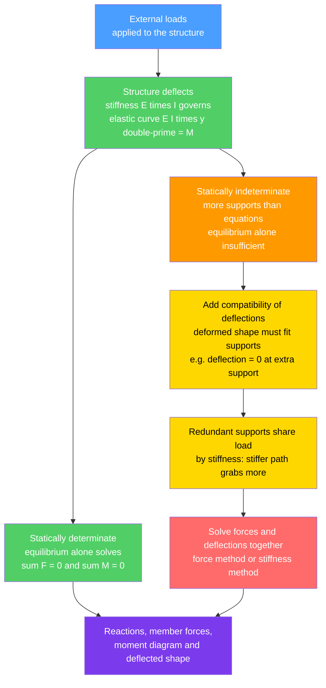

# 🏗️ Deflection and Statically Indeterminate Structures

> [!abstract] TL;DR
> A structure can be plenty **strong** and still **fail in service** if it is not **stiff** enough — a floor that bounces, a bridge that visibly droops, a beam whose sag cracks the plaster. So design has two separate checks: **strength** (stress $\le$ allowable) and **serviceability** (deflection $\le$ a code limit such as $L/360$). Deflection comes from integrating the **elastic curve** $EI\,d^2y/dx^2 = M(x)$ (or, faster for trusses and frames, from **energy methods** — **virtual work / unit-load** and **Castigliano's theorem**), and is governed by the **flexural rigidity** $EI$ = modulus $\times$ moment of inertia. The deeper half of the subject is **static indeterminacy**: most real structures have *more* supports or members than the three equilibrium equations can solve — extra ("redundant") load paths added for **safety and stiffness**. There, equilibrium *alone is insufficient*; you must add **compatibility** conditions (how the structure deforms) and material behaviour. The **force / flexibility method** removes redundants, then re-imposes them by demanding zero deflection at the removed support; the **displacement / stiffness method** (slope-deflection, moment distribution, and the matrix / finite-element generalization) makes *displacements* the unknowns. Redundancy buys **robustness** (alternate load paths) and **smaller peak moments** (continuous beams), at the cost of **locked-in stresses from support settlement and temperature**. This force-and-compatibility duality is the intellectual core of structural analysis.

---

## Intuition

**Analogy first.** A shelf can be far too strong to ever *break* and yet be a complete failure: load it with books and it bows into a visible smile, your coffee slides to the middle, the cabinet doors above it jam, and every footstep sets the floor bouncing. Nothing snapped — but the shelf is unusable. That everyday experience is the whole reason engineers track a second quantity beyond strength: **stiffness**, measured by how much a structure **deflects**. Codes therefore cap deflection to fractions of the span (a floor beam to about $L/360$) precisely to prevent cracked ceilings, jammed doors, ponding water, and that unnerving bounce — long before anything is in danger of collapsing.

Now the deep twist. Suppose that, to be *safe*, you prop the sagging shelf with an extra bracket in the middle. You have just made the shelf **statically indeterminate** — there are now more supports than force-balance can resolve, and you can no longer find the reactions from $\sum F = 0$ and $\sum M = 0$ alone. How much load does the new prop take? It depends on the **stiffness** of each path: the redundant supports *negotiate*, and the stiffer path grabs the larger share. To find that share you must track how the structure **deforms** — demanding, for instance, that the shelf's deflection at the prop is exactly zero because the prop holds it there. This marriage of **force balance** *and* **deformation compatibility** is the heart of modern structural analysis, and it is exactly why a single continuous beam running over three supports is both stronger and stiffer than two separate simply-supported spans.

---

## How It Works

### Core Mechanics

**Part 1 — Deflection (works for any structure).**

1. **Every structure deforms under load.** Beams bend, trusses stretch, frames sway. Deflection is a *serviceability* limit state, checked *separately* from strength: a member can satisfy $\sigma \le \sigma_{allow}$ and still deflect too much.
2. **The elastic curve.** For bending members the deflected shape obeys $EI\,\dfrac{d^2y}{dx^2} = M(x)$ — a second-order ODE. Integrate it *twice* and pin down the two constants with **boundary conditions** (zero deflection at supports, zero slope at a fixed end). The stiffness $EI$ = Young's modulus $E$ $\times$ second moment of area $I$ sets how much it sags.
3. **Energy methods are faster for trusses and frames.** The **unit-load (virtual-work)** method gives a single deflection component directly as $\delta = \int \dfrac{M\,m}{EI}\,dx$ (or $\sum \dfrac{N\,n\,L}{EA}$ for trusses), where lowercase $m, n$ are the internal forces from a *dummy unit load* placed where you want the deflection. **Castigliano's theorem** gives the same result as $\delta = \partial U / \partial P$, the derivative of strain energy with respect to the load. **Moment-area** and **conjugate-beam** methods are graphical shortcuts for beams.

**Part 2 — Static indeterminacy (when equilibrium is not enough).**

4. **Count the redundancy.** The **degree of static indeterminacy** = (number of unknown reactions/member forces) $-$ (number of independent equilibrium equations). A simply-supported beam is *determinate* (degree 0); add a third support and it becomes indeterminate to the first degree. Real structures — continuous beams, rigid frames, arches, grids — are almost all indeterminate, on purpose, for stiffness and redundancy.
5. **Equilibrium alone cannot solve it.** With more unknowns than equations, you need extra conditions. Those come from **compatibility** (the deformed shape must fit the supports and stay continuous) plus the **material law** (force $\leftrightarrow$ deformation via $EI$, $EA$). *Forces and deflections must be solved together.*
6. **The force / flexibility method.** Choose the redundant reactions and *remove* them to get a determinate "released" primary structure. Compute its deflection at each released point. Then re-apply each redundant as an unknown and enforce **compatibility** — e.g. the deflection at a removed support must be **zero** because the support actually holds it there: $\delta_0 + R\,\delta_1 = 0 \Rightarrow R = -\delta_0/\delta_1$. Unknowns are *forces*.
7. **The displacement / stiffness method.** Flip it: make the joint **displacements/rotations** the unknowns (slope-deflection equations, or **moment distribution** / Hardy Cross by hand), write equilibrium at each joint in terms of those displacements, and solve. This is the method computers use — its matrix form is the **stiffness / finite-element method** (a sibling note): assemble $\mathbf{K}\mathbf{u} = \mathbf{F}$ and solve for displacements $\mathbf{u}$, then recover member forces.
8. **Why redundancy helps — and hurts.** Extra load paths give **robustness** (if one member fails, others carry the load) and **lower peak moments** (a continuous beam redistributes moment onto its supports, cutting midspan sag). But because the structure is "over-restrained," **support settlement and temperature change induce internal stresses** with no external load at all — a cost determinate structures never pay.

### Flow / Architecture



---

## Key Concepts

### Secondary Level

- **Strong is not the same as stiff.** A beam that will never break can still **sag** too much — a bouncy floor, a drooping shelf, a door that jams. Engineers limit the *sag*, not just the *strength*.
- **Deflection limits.** Building codes cap how far a floor beam may sag — often about **one part in 360 of the span** ($L/360$) — to stop cracked plaster, ponding, and vibration.
- **Extra supports share the load.** Add a prop under a sagging shelf and the load *splits* between the old supports and the new one. How it splits depends on **stiffness** — the firmer path carries more.
- **You must look at how it bends.** With an extra support you cannot work out the forces from balance alone; you also have to ask *how much the structure deflects* — the prop pushes exactly hard enough to stop the sag at that point.
- **Continuous beats chopped.** One long beam running over several supports sags less and is stronger than the same length cut into separate simple spans.

### Undergraduate Level

- **Elastic-curve method.** $EI\,y'' = M(x)$; integrate twice, apply boundary conditions. Standard results worth memorizing: simply-supported UDL $\delta_{max} = \dfrac{5wL^4}{384EI}$; central point load $\dfrac{PL^3}{48EI}$; cantilever UDL $\dfrac{wL^4}{8EI}$; cantilever tip load $\dfrac{PL^3}{3EI}$.
- **Serviceability vs strength.** Two independent limit states. Deflection scales with $L^4$ (UDL) and is governed by $EI$; it frequently **governs** long-span floors even when stress is comfortable.
- **Energy methods.** *Unit-load / virtual work*: $\delta = \int \dfrac{Mm}{EI}\,dx$ for frames, $\sum \dfrac{NnL}{EA}$ for trusses — place a dummy unit load at the target DOF. *Castigliano's second theorem*: $\delta_i = \dfrac{\partial U}{\partial P_i}$ with strain energy $U = \int \dfrac{M^2}{2EI}\,dx$. These handle trusses and frames where double-integration is clumsy.
- **Degree of indeterminacy.** For beams/frames $= r - (3 + c)$ ($r$ reactions, $c$ internal condition/hinge releases); for trusses $= (m + r) - 2j$. Know how to count it before choosing a method.
- **Force (flexibility) method.** Pick redundants → release to a determinate primary structure → compute deflections $\delta_0$ (from loads) and flexibility coefficients $\delta_{ij}$ (from unit redundants) → solve the **compatibility equations** $[\,\delta_{ij}\,]\{X\} = -\{\delta_{i0}\}$ for the redundant forces $X$.
- **Displacement (stiffness) method.** Unknowns are joint translations/rotations. **Slope-deflection** writes member-end moments as functions of end rotations and chord rotation; **moment distribution (Hardy Cross)** solves the same equations iteratively by locking/releasing joints — ideal before computers, and still great intuition for how stiffness ratios ($4EI/L$ terms and **distribution factors**) split moment.
- **Continuous-beam behaviour.** Interior support hogging moment (e.g. two equal spans under UDL: $-wL^2/8$ over the middle support) reduces the positive span moment to $9wL^2/128$ and cuts deflection dramatically versus separate simple spans — the practical payoff of indeterminacy.
- **Settlement and temperature.** In indeterminate structures, a support that settles or a temperature change *induces reactions and stresses with no applied load*; determinate structures simply move, stress-free.

### Graduate Level

- **General flexibility formulation.** $\{\delta\} = [F]\{X\} + \{\delta_L\} = 0$, where $[F]$ is the symmetric **flexibility matrix** (Maxwell–Betti reciprocity $\Rightarrow \delta_{ij} = \delta_{ji}$) assembled from $\int \dfrac{m_i m_j}{EI}\,dx$. Choice of redundants controls conditioning of $[F]$.
- **General stiffness formulation.** The matrix **direct stiffness method**: element stiffness $[k]$ in local coordinates, transform to global, **assemble** the global $[K]$, partition into free/restrained DOFs, solve $[K_{ff}]\{u_f\} = \{P_f\}$, recover reactions and member end-forces. This is the algorithm inside every structural-analysis package and the finite-element method for framed structures.
- **Duality of the two methods.** Force method: unknowns = redundant forces, equations = compatibility, use when redundancy is low. Stiffness method: unknowns = displacements, equations = equilibrium, use for high redundancy and automation. They are transpose-related through the equilibrium and compatibility operators.
- **Nonlinear and second-order effects.** Geometric nonlinearity ($P$-$\Delta$, large displacement), material nonlinearity (**plastic hinges**, moment redistribution and **limit / plastic analysis** with the lower- and upper-bound theorems), and semi-rigid connections all break the clean linear-elastic superposition the classical methods assume.
- **Approximate methods for preliminary design.** Portal and cantilever methods for lateral frame analysis; assuming inflection points to make a frame statically determinate for a quick moment estimate.
- **Support movement and thermal load in matrix form.** Prescribed nodal displacements enter as boundary conditions in $[K]\{u\}=\{P\}$; equivalent nodal forces capture thermal strain $\varepsilon_T = \alpha \Delta T$ — the systematic route to the settlement/temperature stresses that make indeterminate design demanding.

---

## Python Demo

```python
# Deflection & static indeterminacy demo.
#   (a) BEAM DEFLECTION: the elastic curve of a simply-supported beam under a
#       uniform load, obtained by NUMERICALLY integrating  EI*y'' = M(x)  twice
#       with the boundary conditions y(0)=y(L)=0.  Mark the max sag and the
#       L/360 serviceability limit.
#   (b) INDETERMINATE ANALYSIS by the FORCE (flexibility) method: a PROPPED
#       CANTILEVER (fixed at A, propped at B) under uniform load.
#       Remove the prop  ->  determinate cantilever ("released" structure).
#       Redundant prop force R found from COMPATIBILITY: deflection at B = 0.
#       Compare the moment diagram of the released cantilever (determinate)
#       with the propped cantilever (indeterminate): the redundant slashes the
#       peak moment ~4x  (wL^2/2  ->  wL^2/8).
import numpy as np
import matplotlib.pyplot as plt

# ---------- numerical double-integration of the elastic curve EI*y'' = M ----------
def cumint(f, x):
    """Cumulative trapezoidal integral, same length as x, starting at 0."""
    incr = 0.5 * (f[:-1] + f[1:]) * np.diff(x)
    return np.concatenate(([0.0], np.cumsum(incr)))

def ss_curve(x, M, EI):
    """Simply-supported: integrate EI*y''=M, enforce y(0)=y(L)=0. y up = +."""
    theta = cumint(M / EI, x)              # slope up to constant C1
    S2    = cumint(theta, x)               # deflection up to C1*x + C2
    L     = x[-1] - x[0]
    C1    = -S2[-1] / L                    # y(0)=0 -> C2=0 ; y(L)=0 -> fixes C1
    return S2 + C1 * (x - x[0])

def cant_curve(x, M, EI):
    """Cantilever fixed at x[0]: y(0)=0, y'(0)=0. y up = +."""
    return cumint(cumint(M / EI, x), x)    # both constants are zero

# ---------------- parameters (SI units) ----------------
L  = 6.0            # span, m
w  = 12.0e3         # uniform load, N/m
E  = 200.0e9        # steel Young's modulus, Pa
I  = 8.0e-5         # second moment of area, m^4
EI = E * I
x  = np.linspace(0.0, L, 601)

# ================= (a) SIMPLY-SUPPORTED DEFLECTION =================
M_ss  = w * x * (L - x) / 2.0              # sagging-positive parabola, peak wL^2/8
y_ss  = ss_curve(x, M_ss, EI)             # downward sag comes out negative
sag   = -y_ss.min() * 1e3                  # max sag magnitude, mm
limit = (L / 360.0) * 1e3                  # serviceability limit, mm
print("(a) Simply-supported beam under UDL")
print(f"    max sag       = {sag:6.2f} mm  (= span/{L*1e3/sag:.0f})")
print(f"    L/360 limit   = {limit:6.2f} mm  ->  {'OK' if sag <= limit else 'FAILS'}")
print(f"    closed form 5wL^4/384EI = {5*w*L**4/(384*EI)*1e3:6.2f} mm  (check)")

# ================= (b) PROPPED CANTILEVER by the FORCE METHOD =================
# Released (determinate) primary structure = cantilever fixed at A (x=0), free at B.
M_cant = -w * (L - x)**2 / 2.0             # cantilever UDL moment (all hogging)
m_unit =  (L - x)                          # moment from a UNIT upward load at B
y0 = cant_curve(x, M_cant, EI)[-1]         # tip deflection from the load  (down, <0)
y1 = cant_curve(x, m_unit, EI)[-1]         # tip deflection from unit redundant (up, >0)
R  = -y0 / y1                              # COMPATIBILITY: y0 + R*y1 = 0  ->  R
print("\n(b) Propped cantilever by the force (flexibility) method")
print(f"    released-cantilever tip sag  |y0| = {abs(y0)*1e3:7.2f} mm")
print(f"    redundant prop force  R = {R/1e3:6.2f} kN   (theory 3wL/8 = {3*w*L/8/1e3:.2f} kN)")

# Final indeterminate response by superposition
M_prop = M_cant + R * m_unit               # propped-cantilever moment diagram
y_prop = cant_curve(x, M_cant, EI) + R * cant_curve(x, m_unit, EI)
print(f"    compatibility check: deflection at prop = {y_prop[-1]*1e3:.3e} mm (~0)")

peak_det   = np.abs(M_cant).max() / 1e3    # determinate cantilever peak, kN*m
peak_indet = np.abs(M_prop).max() / 1e3    # indeterminate peak, kN*m
print(f"    peak |M| determinate cantilever = {peak_det:6.1f} kN*m  (wL^2/2)")
print(f"    peak |M| propped  cantilever   = {peak_indet:6.1f} kN*m  (wL^2/8)")
print(f"    indeterminacy cuts peak moment {peak_det/peak_indet:.1f}x")

# ============================ PLOTS ============================
fig, ax = plt.subplots(2, 2, figsize=(13, 9))

# (1) simply-supported elastic curve vs serviceability limit
axd = ax[0, 0]
axd.plot(x, y_ss * 1e3, color="#9b59b6", lw=2, label="deflected shape")
axd.fill_between(x, y_ss * 1e3, 0, color="#9b59b6", alpha=0.20)
imin = y_ss.argmin()
axd.plot(x[imin], y_ss[imin] * 1e3, "ro")
axd.annotate(f"max sag {sag:.1f} mm", xy=(x[imin], y_ss[imin]*1e3),
             xytext=(0.30, 0.25), textcoords="axes fraction",
             arrowprops=dict(arrowstyle="->", color="r"))
axd.axhline(-limit, color="crimson", ls="--", lw=1.5, label=f"L/360 = {limit:.1f} mm")
axd.axhline(0, color="k", lw=0.8)
axd.set_title("(a) Elastic curve: EI y'' = M  (simply supported, UDL)")
axd.set_xlabel("x  [m]"); axd.set_ylabel("deflection  [mm]  (down = -)")
axd.legend(loc="lower center"); axd.grid(alpha=0.3)

# (2) force-method compatibility: released cantilever vs propped cantilever
axc = ax[0, 1]
y_rel = cant_curve(x, M_cant, EI)
axc.plot(x, y_rel * 1e3, color="#d97706", lw=2, ls="--",
         label="released cantilever (prop removed)")
axc.plot(x, y_prop * 1e3, color="#2563eb", lw=2, label="propped cantilever (final)")
axc.plot(L, y_rel[-1]*1e3, "o", color="#d97706")
axc.plot(L, 0, "o", color="#2563eb")
axc.annotate("compatibility:\ndeflection = 0 at prop", xy=(L, 0),
             xytext=(0.05, 0.35), textcoords="axes fraction",
             arrowprops=dict(arrowstyle="->", color="#2563eb"))
axc.axhline(0, color="k", lw=0.8)
axc.set_title("(b) Force method: redundant prop restores compatibility")
axc.set_xlabel("x  [m]"); axc.set_ylabel("deflection  [mm]  (down = -)")
axc.legend(loc="lower left"); axc.grid(alpha=0.3)

# (3) moment redistribution: determinate vs indeterminate
axm = ax[1, 0]
axm.plot(x, M_cant / 1e3, color="#d97706", lw=2, ls="--",
         label="determinate cantilever")
axm.plot(x, M_prop / 1e3, color="#2563eb", lw=2, label="indeterminate propped")
axm.fill_between(x, M_prop / 1e3, 0, color="#2563eb", alpha=0.15)
axm.axhline(0, color="k", lw=0.8)
axm.set_title("(c) Moment diagram: redundancy cuts the peak moment")
axm.set_xlabel("x  [m]  (fixed end at 0, prop at L)")
axm.set_ylabel("bending moment  [kN*m]  (sag +)")
axm.legend(); axm.grid(alpha=0.3)

# (4) peak-moment comparison bar chart
axb = ax[1, 1]
names = ["Cantilever\n(determinate)", "Propped\n(indeterminate)", "Simple span\nwL^2/8"]
vals  = [peak_det, peak_indet, w * L**2 / 8 / 1e3]
bars  = axb.bar(names, vals, color=["#d97706", "#2563eb", "#51cf66"], alpha=0.85)
for b, v in zip(bars, vals):
    axb.text(b.get_x() + b.get_width()/2, b.get_height(),
             f"{v:.0f}", ha="center", va="bottom", fontsize=10)
axb.set_ylabel("peak |bending moment|  [kN*m]")
axb.set_title("(d) Adding the redundant prop -> ~4x smaller peak moment")
axb.grid(alpha=0.3, axis="y")

plt.tight_layout()
plt.savefig("deflection_indeterminate_demo.png", dpi=120)
print("\nSaved figure -> deflection_indeterminate_demo.png")
```

**What it shows.** Panel (a) reconstructs the **elastic curve** by numerically integrating $EI\,y'' = M(x)$ twice under the pin boundary conditions, marks the maximum sag, and draws the $L/360$ serviceability line — the beam here is comfortably stiffer than the limit (a *separate* check from strength). Panels (b)–(d) run the **force (flexibility) method** on a propped cantilever: remove the prop to get a determinate cantilever whose tip droops by $|y_0|$, then solve the **compatibility** condition (deflection at the prop must be zero) for the redundant force $R = -y_0/y_1 = 3wL/8$. Panel (b) confirms the prop pulls the deflected shape back to zero at $B$; panel (c) shows the moment **redistribution**; and panel (d) drives home the payoff — adding one redundant support slashes the peak moment roughly **4×** (from $wL^2/2$ to $wL^2/8$), the quantitative reason indeterminate structures are stiffer and more efficient.

---

## Real-World Applications

> **Example:** A multi-span highway **girder bridge** is deliberately built as a **continuous beam** over its piers rather than as a chain of simple spans. Continuity is redundancy: hogging moment develops over each pier, which *cuts the positive midspan moment and the deflection*, so shallower, lighter girders carry the same traffic. Engineers analyze it with the **stiffness / matrix method** (the computer form of slope-deflection), and they must explicitly check the extra load cases that redundancy creates — **differential settlement of a pier** and **thermal expansion** both induce reactions and stresses with no truck on the deck at all. The same continuity gives **robustness**: if one span is damaged, alternate load paths through the continuous deck help prevent progressive collapse.

- **Building floor systems.** Deflection ($L/360$ live-load, $L/240$ total) routinely **governs** long-span steel and reinforced-concrete floors, driving beam depth even when stress is fine — the fix for a bouncy or plaster-cracking floor is *stiffness* ($EI$), not strength.
- **Continuous beams and rigid frames.** Nearly all real building frames are highly indeterminate; moment distribution / slope-deflection (by hand) and the matrix stiffness method (by software) proportion moments among members by their relative stiffness.
- **Camber.** Bridge girders and long transfer beams are fabricated with built-in upward **camber** equal to the computed dead-load deflection, so they read level *after* loading — deflection analysis turned into a shop drawing.
- **Redundancy for safety.** Fracture-critical vs redundant bridge classification, and progressive-collapse-resistant building design, both hinge on having **alternate load paths** — the robustness dividend of indeterminacy.
- **Arches, grids, and cable-stayed decks.** Two-hinged and fixed arches, floor grillages, and stayed decks are strongly indeterminate; their efficiency comes precisely from the load-sharing that compatibility governs.
- **Deflection-sensitive equipment and finishes.** Crane runway beams, machine foundations, and masonry-supporting beams carry *tighter* deflection limits (down to $L/600$ or an absolute mm cap) to protect alignment and brittle finishes.

---

## Common Pitfalls

- **Checking strength but forgetting stiffness.** The classic error: sizing a member so $\sigma \le \sigma_{allow}$ and stopping. A perfectly strong beam can still fail **serviceability** — bounce, sag, cracked ceilings, ponding. Deflection is a *separate* limit state, and for long spans it often controls.
- **Trying to solve an indeterminate structure with statics alone.** $\sum F = 0$, $\sum M = 0$ give only three equations; an indeterminate structure has *more* unknowns. You **must** add compatibility (deformation) conditions. Writing more equilibrium equations just produces dependent ones, not new information.
- **Miscounting the degree of indeterminacy.** Forgetting internal releases (an internal hinge adds a condition equation), miscounting reactions, or ignoring member forces in trusses. Get the degree wrong and you either over- or under-constrain the analysis.
- **Choosing bad redundants in the force method.** Redundants that leave a nearly-unstable or ill-conditioned released structure make the flexibility matrix nearly singular. Pick redundants that keep the primary structure stable and easy to analyze.
- **Sign and unit slips in $EI\,y'' = M$.** Mixing sagging/hogging conventions, or using inconsistent units for $E$ (Pa vs MPa), $I$ (m$^4$ vs mm$^4$), and $L$ — deflection scales with $L^4$, so a unit error is enormous. Keep one consistent system throughout.
- **Ignoring settlement and temperature.** In indeterminate structures these *induce real internal stresses with no applied load*. Designing only for gravity/live load and forgetting a settling foundation or a hot summer day has cracked many real structures.
- **Assuming continuity is free.** Continuous beams reduce midspan moment and deflection but create **hogging moment over interior supports** (top-fiber tension — where reinforced concrete needs top steel). Redistribution moves the demand, it does not delete it.
- **Blindly trusting software.** The matrix/finite-element solver is only as good as the model — supports, releases, member stiffnesses, and load cases. *Garbage in, garbage out*: always sanity-check the deflected shape and moment diagram against hand calculations and intuition.
- **Misapplying superposition.** Adding load cases and using flexibility/stiffness coefficients is valid only for **linear-elastic, small-deflection** behaviour. Plastic hinges, $P$-$\Delta$, cable slackening, or contact break it.

---

## Related Concepts

- [[Mechanical_Engineering/01_Statics_and_Mechanics_of_Materials/Bending_and_Beam_Theory|Bending and Beam Theory]] — supplies the elastic curve $EI\,y'' = M(x)$, the flexure formula, and the flexural rigidity $EI$ that this note integrates for deflection and uses to share load among redundant supports.
- [[Mechanical_Engineering/01_Statics_and_Mechanics_of_Materials/Stress_Strain_and_Deformation|Stress, Strain and Deformation]] — the material law $\sigma = E\varepsilon$ behind $EI$; compatibility of *deformations* is meaningless without this force-to-deformation link.
- [[Mechanical_Engineering/05_Design_and_Manufacturing/CAD_CAE_and_Finite_Element_Method|CAD, CAE and the Finite Element Method]] — the engineering software realization of the stiffness method: assemble $\mathbf{K}\mathbf{u} = \mathbf{F}$ and solve, exactly how indeterminate structures are analyzed in practice.
- [[Computational_Physics/03_PDEs_and_Field_Simulation/The_Finite_Element_Method|The Finite Element Method]] — the numerical-methods foundation (weak form, shape functions, assembly) that the matrix stiffness method is a structural special case of.
- [[Mathematics/07_Differential_Equations/Second_Order_Linear_ODEs|Second-Order Linear ODEs]] — the elastic curve $EI\,y'' = M(x)$ is a second-order linear ODE; solving it with boundary conditions is precisely how beam deflections are obtained.

*Sibling notes in this Structural Analysis section (planned, referenced in prose): **Beams, Shear and Bending Moment** provides the $M(x)$ that is integrated here for deflection; **Analysis of Trusses and Frames** is where the unit-load and Castigliano energy methods pay off most; **Matrix and Finite Element Structural Analysis** is the computer-implemented generalization of the stiffness method sketched above; **Structural Stability and Buckling** is the companion stiffness-driven failure mode (a slender member losing stiffness, not strength); and **Reinforced Concrete Design** is where continuous-beam hogging moments dictate top reinforcement and deflection/cracking control.*

---

## Review Questions

1. **(Secondary)** A bookshelf is easily strong enough to hold your books but bows so much in the middle that the cabinet doors above it jam and objects roll to the center. Nothing has broken — so in what sense has the shelf "failed"? If you add a single prop under its middle, why can you no longer figure out how much load each support carries just by balancing forces?
2. **(Undergraduate)** For a simply-supported beam of span $L$ under uniform load $w$, start from $EI\,y'' = M(x)$ with $M(x) = wx(L-x)/2$, integrate twice, and apply the boundary conditions to derive the maximum deflection $5wL^4/(384EI)$. If this beam just satisfies an $L/360$ limit, by what factor does the deflection change if you double the span but keep $w$ and the section the same? Does it still pass?
3. **(Undergraduate)** Solve a propped cantilever (fixed at $A$, propped at $B$, span $L$, uniform load $w$) by the **force method**: choose the prop reaction as the redundant, state the compatibility condition, and show $R = 3wL/8$. Then explain, using your result, why the peak bending moment of the propped cantilever ($wL^2/8$) is one-quarter that of the released cantilever ($wL^2/2$).
4. **(Undergraduate/Graduate)** Contrast the **force (flexibility)** and **displacement (stiffness)** methods: what are the unknowns, what equations enforce the solution, and when is each preferable? Why is the stiffness method the one implemented in structural-analysis software?
5. **(Graduate)** A three-span continuous bridge girder is analyzed for traffic load and passes every strength and deflection check. During the first hot summer one pier settles 15 mm. Explain precisely why this *induces* new reactions and bending moments even with no traffic present, why an equivalent *simply-supported* three-span scheme would not, and what analysis quantity (a flexibility coefficient or a stiffness term) governs how large those induced effects are.

---

## Sources

- Hibbeler, R. C. — *Structural Analysis*, 10th ed. (Pearson). Deflections (double integration, moment-area, virtual work, Castigliano), force method, slope-deflection, moment distribution, and matrix stiffness analysis.
- Kassimali, A. — *Structural Analysis*, 6th ed. (Cengage). Determinate/indeterminate analysis, energy methods, and both flexibility and stiffness formulations with worked matrix examples.
- Leet, K. M., Uang, C.-M. & Gilbert, A. M. — *Fundamentals of Structural Analysis*, 5th ed. (McGraw-Hill). Deflections, indeterminate structures, and the classical + matrix methods with strong figures.
- Timoshenko, S. P. & Gere, J. M. — *Mechanics of Materials* (and *Theory of Elastic Stability*). Classic treatment of beam deflection, statically indeterminate members, and the stiffness-driven onset of buckling.
- McGuire, W., Gallagher, R. H. & Ziemian, R. D. — *Matrix Structural Analysis*, 2nd ed. The direct stiffness method that underlies all modern structural-analysis software.

---

#civil-engineering #deflection #indeterminate-structures #compatibility #serviceability
