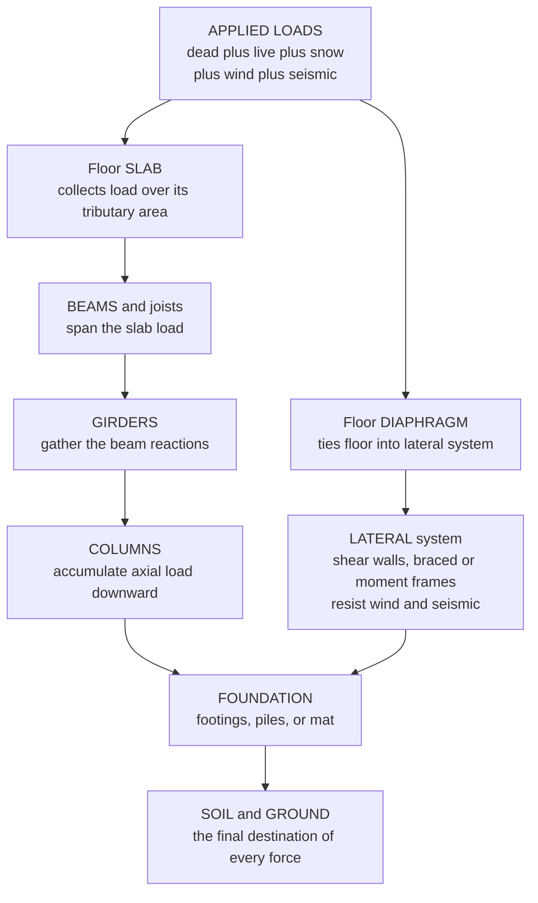

# 🏗️ Structural Loads and Load Paths

> [!abstract] TL;DR
> The first job of a structural engineer is not to make things strong — it is to figure out **what forces the structure must carry** (the **loads**) and **how each force travels to the ground** (the **load path**). Loads come in families: **dead load** (the permanent self-weight of the structure and fixed equipment — predictable), **live load** (occupancy — people, furniture, vehicles — variable and code-specified), and **environmental load** (**wind**, **snow**, rain, thermal, and **seismic/earthquake** — probabilistic), plus soil, hydrostatic, and impact loads. Every one of them must flow down a **continuous, unbroken chain** of members — typically **slab → beam/joist → girder → column → foundation → soil** — to the earth. How much load each member picks up is set by its **tributary area** (the floor area it supports). There are two load paths running at once: a **gravity (vertical)** path carrying weight straight down, and a **lateral (horizontal)** path in which wind and earthquake forces are gathered by shear walls or braced/moment frames and driven to the **base shear** at the foundation. Because loads are uncertain, codes multiply them by **load factors** and add them in **load combinations** (LRFD, e.g. $1.2D + 1.6L$) to get a design demand with margin, then pair that demand against reduced material capacities — a reliability-based safety framework. Miscount the loads, or leave a single gap in the load path — a beam that never reaches a column, a connection that was never designed — and that gap is exactly where the building falls down. Load-path thinking is disciplined bookkeeping of forces flowing downhill to the ground, and it underpins every analysis and design that follows.

---

## Intuition

**Analogy — every structure is locked in a silent, permanent tug-of-war with gravity and nature, and your job is to trace exactly how it wins.** Stand still on the floor of a building. Nothing moves, nothing creaks — yet a completely invisible relay race is running under your feet. Your weight pushes down on the **floor slab**. The slab can't hold it alone, so it hands the load off to the **beams**. The beams pass it along to the **columns**. The columns drive it straight down into the **foundation**. The foundation spreads it out into the **soil**, and the earth — patient and enormous — finally absorbs it. That relay never stops. Add the furniture, the snow piling on the roof, the shove of a gust of wind, the sideways shudder of an earthquake, and *each* of those forces must find its own complete, unbroken path down to the ground.

Here is the whole discipline in one sentence: **every load needs a continuous chain of members all the way to the earth, and wherever that chain is broken is exactly where the structure collapses.** A beam that cannot quite reach a column, a connection someone forgot to design, a wall with no footing beneath it — each is a snapped link in the relay, and the load, having nowhere to go, tears the structure apart at that point. Good structural design is not heroic strength; it is careful, humble accounting — following each force downhill, making sure it never runs out of road before it reaches the ground.

---

## How It Works

### Core Mechanics

1. **List every load the structure will ever feel.** Before any member is sized you inventory the loads: **dead** (permanent self-weight), **live** (movable occupancy), and **environmental** (**wind, snow, rain, temperature, seismic**), plus soil pressure, hydrostatic, impact, and temporary construction loads. Each is either **static** (steady — dead load, stored goods) or **dynamic** (time-varying — wind gusts, earthquake shaking, moving traffic), and dynamic loads may be amplified far beyond their static value.

2. **Quantify each load using code values and geometry.** Dead load is computed from material densities and dimensions. Live, snow, wind, and seismic loads are read from a building code (e.g. ASCE 7) as pressures or accelerations calibrated to a target return period. The load a given member must carry is its governing pressure multiplied by its **tributary area** — the slice of floor or roof that "drains" its load into that member.

3. **Trace the gravity (vertical) load path.** Follow the weight downhill through the standard chain: the **slab** collects load over its surface and spans to the **beams/joists**; the beams carry it to the **girders**; the girders deliver their reactions to the **columns**; the columns accumulate axial force floor by floor and push it into the **foundation**; the foundation spreads it into the **soil**. Columns therefore grow larger toward the bottom of a building — they are carrying everything above them.

4. **Trace the lateral (horizontal) load path.** Wind pressure and earthquake inertia act *sideways*. A separate **lateral force-resisting system** — **shear walls**, **braced frames**, or **moment frames** — collects these horizontal forces at each floor (via the floor acting as a rigid **diaphragm**), stacks them up as **story shear**, and drives the total **base shear** into the foundation and out to the soil. A structure can be perfectly sound for gravity and still collapse sideways if this second path is missing.

5. **Combine loads with factors to get the design demand.** Loads never peak all at once, and each is uncertain, so codes prescribe **load combinations** with **load factors**. In LRFD (Load and Resistance Factor Design) the factored demand is, for example, $U = 1.2D + 1.6L$ (dead less uncertain, so a smaller factor; live more uncertain, so a larger one), with other combinations covering wind, snow, and seismic. This factored demand $U$ is then checked against a **reduced** material capacity $\phi R_n$, giving the required margin: $\phi R_n \ge U$.

6. **Verify the path is complete and continuous.** Finally, confirm that *every* load has an uninterrupted route to the ground and that each **connection** along the way can transfer the force it must. Most catastrophic failures are not member failures — they are **load-path failures at connections**, where the chain was silently broken.

### Flow / Architecture



---

## Key Concepts / Details

### Secondary Level

**What a load is.** A **load** is any force or effect a structure must resist. The three headline families:
- **Dead load (D)** — the *permanent* weight that is always there: the concrete, steel, floors, walls, roofing, and fixed equipment. It is the most **predictable** load because you can weigh the materials.
- **Live load (L)** — the *movable, temporary* weight of use: people, furniture, stored goods, vehicles. It is **variable** — a room might be empty or packed — so codes specify a conservative design value (e.g. an office floor is designed for about $2.4$ kPa whether or not it is ever that crowded).
- **Environmental load** — imposed by nature: **wind**, **snow**, rain, temperature swings, and **earthquakes**. These are **probabilistic** — you design for a severe event with a chosen chance of being exceeded, not for the worst imaginable.

**The load path.** Weight does not vanish into the floor — it is *handed off*. Push on a floor and the load travels **slab → beam → column → foundation → soil**. Each member passes the load to the next, all the way to the ground. If any hand-off is missing, the load has nowhere to go and the structure breaks there.

**Why columns get fatter at the bottom.** A column carries everything above it. The top-floor column holds only the roof; the ground-floor column holds every floor stacked above, so it must be much bigger. Watch the accumulation and you understand a building's shape.

**Static vs. dynamic.** A **static** load sits still (a bookshelf). A **dynamic** load changes with time (a gust of wind, a truck driving over a bridge, the shaking of an earthquake) and can hit the structure harder than its steady weight would suggest.

### Undergraduate Level

**Tributary area — who carries what.** The **tributary area** of a member is the portion of floor or roof whose load "drains" into it, bounded by the midlines to the neighbouring members. For a regular grid of columns spaced $L_x$ by $L_y$, an **interior** column has tributary area $A_t = L_x L_y$; an **edge** column carries half of that, and a **corner** column a quarter. Multiply the tributary area by the floor pressure to get the load delivered to the member — this single idea sizes essentially every beam, column, and footing.

**Live load reduction.** It is statistically unlikely that a large tributary area is *simultaneously* loaded to its full design live load everywhere. Codes therefore permit a **live load reduction** for members with large influence areas (e.g. ASCE 7's $L = L_0\left(0.25 + \tfrac{4.57}{\sqrt{K_{LL}A_T}}\right)$ in SI), so a heavily loaded column need not be designed as if every floor above were packed to capacity at once.

**Gravity vs. lateral load paths.** Two independent systems coexist:
- The **gravity system** (slab, beams, girders, columns) carries *vertical* load straight down.
- The **lateral force-resisting system** (shear walls, braced frames, moment frames) carries *horizontal* wind and seismic load. The floor slab acts as a **diaphragm**, collecting inertial/wind force at each level and delivering it to the vertical lateral elements, which stack the forces into **story shears** and deliver the total **base shear** to the foundation.

**Load combinations and factors (LRFD).** Because loads are uncertain and rarely peak together, design uses **factored combinations**. Representative ASCE 7 strength combinations include:
- $1.4D$
- $1.2D + 1.6L + 0.5(L_r\ \text{or}\ S)$
- $1.2D + 1.6(L_r\ \text{or}\ S) + (L\ \text{or}\ 0.5W)$
- $1.2D + 1.0W + L + 0.5(L_r\ \text{or}\ S)$
- $1.2D + 1.0E + L + 0.2S$
- $0.9D + 1.0W$ and $0.9D + 1.0E$ (the $0.9D$ cases check **overturning/uplift**, where light dead load is *unconservative*).

The factored demand $U$ is then compared to the design strength $\phi R_n$ (with a **resistance factor** $\phi < 1$ reducing the nominal capacity): design is satisfied when $\phi R_n \ge U$.

**Limit states — strength vs. serviceability.** **Strength (ultimate) limit states** guard against collapse and use factored loads. **Serviceability limit states** guard against deflection, vibration, and cracking that annoy occupants but do not endanger them, and use *unfactored* (service) loads. A beam can be plenty strong yet fail serviceability by sagging visibly.

### Graduate Level

**Reliability basis of load and resistance factors.** LRFD is not arbitrary bookkeeping — factors are **calibrated** so that the probability of the demand exceeding the capacity meets a target **reliability index** $\beta$ (typically $\beta \approx 3.0$ for members under gravity load, corresponding to a small annual failure probability). Loads $Q$ and resistances $R$ are treated as random variables; the factored format $\phi R_n \ge \sum \gamma_i Q_i$ approximates the condition $P(R < Q) \le p_{target}$ using first-order reliability, with each $\gamma_i$ and $\phi$ reflecting the bias and variability (coefficient of variation) of that quantity. This is why dead load (low variability) earns a smaller factor than live or wind load (high variability).

**Equivalent lateral force for seismic demand.** The simplest code seismic method replaces earthquake shaking with a set of static **equivalent lateral forces**. The **base shear** is $V = C_s W$, where $W$ is the seismic weight and $C_s$ the seismic response coefficient (a function of ground motion, site class, structural period $T$, and the **response modification factor** $R$ that credits ductility). The base shear is distributed up the height in proportion to $w_x h_x^k$ (an inverted-triangular pattern that concentrates force near the top for tall, flexible buildings), and **story shears** accumulate downward to $V$ at the base — the demand the foundation and soil must ultimately absorb.

**Load path redundancy and progressive collapse.** A robust structure offers **alternate load paths**: if one element or connection is lost, the load reroutes rather than the building unzipping. Deficient redundancy underlies **progressive collapse** (Ronan Point, 1968; the Alfred P. Murrah Building, 1995), where a local failure propagates because the load had nowhere else to go. Modern codes address this with **tie forces**, **alternate-path analysis**, and **key-element** design — explicitly engineering a backup for the primary load path.

**Load rating and existing structures.** For existing bridges and buildings, **load rating** compares available capacity to code demand and expresses it as a **rating factor** $RF = \dfrac{\phi R_n - \gamma_D D}{\gamma_L L}$ — the multiple of the nominal live load the structure can safely carry. Ratings below unity trigger posting (weight limits), strengthening, or replacement, and are the quantitative form of the load-path question for structures already in service.

**Dynamic amplification.** Static analysis multiplies a peak load by geometry; dynamic loads (gusts, earthquakes, machinery, crowds) interact with the structure's **natural frequencies**. Near resonance the response is amplified by a **dynamic amplification factor** that can multiply the equivalent static load severalfold — the reason wind and seismic design increasingly use response-spectrum and time-history analysis rather than a single static push.

---

## Python Demo

```python
# Structural loads and load paths, made concrete for one interior column line:
#   (a) VERTICAL load path -- accumulate the FACTORED gravity load DOWN the
#       column using TRIBUTARY AREA and the LRFD combination 1.2D + 1.6L.
#   (b) LATERAL load path -- distribute a seismic BASE SHEAR up the building
#       (ASCE-7 inverted-triangular pattern) and accumulate the STORY SHEAR
#       back down to the foundation.
import numpy as np
import matplotlib.pyplot as plt

# ------------------------------------------------------------------
# Building: 8 occupied floors + roof, interior column, 6 m x 6 m bay
# ------------------------------------------------------------------
n_story      = 8                       # number of occupied floors
bay_x, bay_y = 6.0, 6.0                # column spacing [m]
A_trib       = bay_x * bay_y           # interior-column tributary area [m^2] = 36
h_story      = 3.5                     # story height [m]

# Unfactored AREA loads [kPa = kN/m^2]
D_floor, L_floor = 5.0, 2.5            # typical office floor: dead, live
D_roof,  S_roof  = 4.0, 1.5            # roof: dead, snow (roof "live")

# ------------------------------------------------------------------
# (a) VERTICAL LOAD PATH: factored axial load accumulating DOWN the column
# ------------------------------------------------------------------
# LRFD factored area load  wu = 1.2 D + 1.6 L
wu_roof  = 1.2 * D_roof  + 1.6 * S_roof     # [kPa]
wu_floor = 1.2 * D_floor + 1.6 * L_floor    # [kPa]

P_roof = wu_roof  * A_trib                  # factored load delivered by the roof [kN]
P_typ  = wu_floor * A_trib                  # factored load delivered by each floor [kN]

levels    = np.arange(n_story + 1)          # 0 = roof ... n_story = lowest floor
delivered = np.array([P_roof] + [P_typ] * n_story)   # load added at each level
axial     = np.cumsum(delivered)            # column axial force below each level [kN]
elev      = (n_story - levels) * h_story + h_story   # elevation of each level [m]

print("VERTICAL LOAD PATH  (interior column, A_trib = %.0f m^2)" % A_trib)
print(f"  1.2D + 1.6L  ->  roof  wu = {wu_roof:4.1f} kPa,  floor wu = {wu_floor:4.1f} kPa")
print(f"  load per floor into column   = {P_typ:6.1f} kN")
print(f"  column axial at foundation   = {axial[-1]:6.1f} kN  (columns grow toward the base)")

# ------------------------------------------------------------------
# (b) LATERAL LOAD PATH: seismic story forces and accumulating story shear
# ------------------------------------------------------------------
W_level = np.array([D_roof * A_trib] + [D_floor * A_trib] * n_story)  # seismic weight/level [kN]
h_level = (n_story - levels) * h_story + h_story                      # mass height above ground [m]

Cs      = 0.10                              # seismic response coefficient (example)
V_base  = Cs * W_level.sum()                # ASCE-7 base shear V = Cs * W
Fi      = V_base * (W_level * h_level) / np.sum(W_level * h_level)    # story forces (k = 1)
story_shear = np.cumsum(Fi)                 # shear ACCUMULATES downward -> base shear

print("\nLATERAL LOAD PATH  (seismic, Cs = %.2f)" % Cs)
print(f"  total seismic weight W       = {W_level.sum():6.1f} kN")
print(f"  design BASE SHEAR at footing = {story_shear[-1]:6.1f} kN  -> foundation -> soil")

# ------------------------------------------------------------------
# PLOTS
# ------------------------------------------------------------------
fig, ax = plt.subplots(1, 3, figsize=(15, 5.5))

# --- (a) axial load accumulating down the column ---
a0 = ax[0]
a0.step(axial, elev, where="post", color="crimson", lw=2.5)
a0.fill_betweenx(elev, 0, axial, step="post", color="crimson", alpha=0.15)
a0.scatter(axial, elev, color="crimson", s=28, zorder=3)
a0.set_xlabel("Column axial force  [kN]")
a0.set_ylabel("Elevation above ground  [m]")
a0.set_title("(a) Vertical load path\naxial load accumulates DOWNWARD")
a0.grid(alpha=0.3)
a0.annotate("foundation demand\n%.0f kN" % axial[-1],
            xy=(axial[-1], elev[-1]), xytext=(axial[-1] * 0.30, elev[-1] + 5),
            arrowprops=dict(arrowstyle="->"))

# --- (b) LRFD load combination on a typical floor ---
a1 = ax[1]
cats   = ["Dead\n1.2 D", "Live\n1.6 L", "Factored\nwu"]
vals   = [1.2 * D_floor, 1.6 * L_floor, wu_floor]
colors = ["steelblue", "darkorange", "seagreen"]
a1.bar(cats, vals, color=colors)
for c, v in zip(cats, vals):
    a1.text(c, v + 0.15, f"{v:.1f}", ha="center")
a1.set_ylabel("Area load  [kPa]")
a1.set_title("(b) Load combination (LRFD)\n1.2D + 1.6L on a typical floor")
a1.grid(alpha=0.3, axis="y")

# --- (c) lateral story forces + accumulating story shear ---
a2 = ax[2]
a2.barh(h_level, Fi, height=2.2, color="mediumpurple", alpha=0.85, label="story force Fi")
a2.plot(story_shear, h_level, color="black", lw=2.5, marker="o", label="story shear")
a2.set_xlabel("Lateral force / shear  [kN]")
a2.set_ylabel("Elevation above ground  [m]")
a2.set_title("(c) Lateral load path\nseismic forces -> base shear")
a2.legend(loc="lower right")
a2.grid(alpha=0.3)
a2.annotate("base shear\n%.0f kN" % story_shear[-1],
            xy=(story_shear[-1], h_level[-1]), xytext=(story_shear[-1] * 0.28, h_level[-1] + 6),
            arrowprops=dict(arrowstyle="->"))

plt.tight_layout()
plt.savefig("structural_loads_and_load_paths.png", dpi=150)
# Expected: floor load ~360 kN, column base ~3139 kN; seismic W ~1584 kN, base shear ~158 kN.
```

Running it prints the factored floor load (about $360$ kN per floor into the interior column) and the axial force at the base (about $3{,}139$ kN — the foundation demand), then the seismic weight and the design base shear (about $158$ kN driven into the footings). The three panels show the two load paths side by side: axial force **growing** as you descend the column, the LRFD combination that produced the factored floor pressure, and the seismic story forces **accumulating** into base shear — exactly the bookkeeping that sizes every column and footing.

---

## Real-World Applications

- **Every building frame.** Floor pressures times tributary areas size the beams; beam reactions size the girders; accumulated axial loads size the columns; the summed column loads size the footings. This gravity load path is the skeleton of essentially every occupied structure on Earth.
- **Tall buildings and wind.** Above roughly ten stories, **wind** (not gravity) often governs the lateral system. Shear walls, braced cores, and outrigger systems form the horizontal load path that carries wind pressure to the base; occupant-comfort (acceleration) serviceability limits can drive the design as much as strength.
- **Seismic design in earthquake country.** In California, Japan, and Chile, the **base shear** and its distribution up the building dictate the lateral system. Ductile detailing lets the frame dissipate energy, but the load path from diaphragm to shear wall to foundation to soil must still be continuous and explicitly detailed at every connection.
- **Bridges and load rating.** Highway bridges are designed for **HL-93** truck-plus-lane live loads on their tributary lanes and are periodically **load rated** to decide whether they can carry legal (or overweight permit) trucks — a direct, quantitative load-path check on an existing structure.
- **Snow and roof collapses.** Flat and low-slope roofs fail when snow (and especially **drifted** or **ponded** snow) exceeds the design value or piles unevenly, overloading a local load path. Many winter roof collapses are load-count failures, not material failures.
- **Progressive-collapse and blast design.** Critical facilities are designed so that losing one column does not drop the building — the load must find an **alternate path**. This redundancy requirement traces directly back to load-path thinking after failures like Ronan Point and the Murrah Building.

---

## Common Pitfalls

- **Leaving a gap in the load path.** The single most dangerous error: a beam that does not actually frame into a column, a wall with no footing, a diaphragm not connected to the shear wall. The members may each be strong, but the *chain* is broken, and the load tears the structure apart at the gap. Always trace each load, connection by connection, all the way to the soil.
- **Under-designed connections.** Most collapses are **connection** failures, not member failures. A joint sized for less than the force it must transfer is a weak link in the relay — the Hyatt Regency walkway (1981) failed at a redesigned hanger connection, not in the walkways themselves.
- **Miscounting tributary area.** Treating an interior column's tributary area as a corner column's (or vice versa), or forgetting that an edge member carries load from only one side, mis-sizes the element by a factor of two or four.
- **Forgetting the lateral load path.** A frame perfectly adequate for gravity can still be unstable sideways. Wind and seismic need their *own* continuous path (diaphragm → shear wall/braced frame → foundation); omitting it invites a sway or overturning failure.
- **Using the wrong (or missing) load combination.** Applying only $1.2D + 1.6L$ and never checking $0.9D + 1.0W$ or $0.9D + 1.0E$ misses **uplift and overturning**, where *light* dead load is the unconservative case. Each governing combination must be checked.
- **Confusing service and factored loads.** Deflection, vibration, and crack checks use **unfactored** service loads; strength checks use **factored** loads. Mixing them either wastes material or, worse, under-designs for strength.
- **Ignoring dynamic amplification.** Treating a gust, an earthquake, rhythmic crowd loading, or reciprocating machinery as a static push can badly underestimate the demand when the excitation approaches a natural frequency (the Tacoma Narrows and London Millennium Bridge lessons).
- **Neglecting construction and temporary loads.** Structures are often most vulnerable *during construction*, before the full load path exists — shoring, wet concrete, and stacked materials impose loads the finished-state analysis never considered.

---

## Related Concepts

- [[Statics_and_Equilibrium]] — the load path is equilibrium applied member by member; every hand-off obeys $\sum F = 0$ and $\sum M = 0$, and tributary reactions come straight from a free-body diagram.
- [[Bending_and_Beam_Theory]] — once a beam receives its tributary load, beam theory turns that load into internal shear and bending moment that size the section.
- [[Stress_Strain_and_Deformation]] — the factored load demand is checked against material capacity through stress; the load path ends where $\sigma = P/A$ and $\sigma = Mc/I$ begin.
- [[Newtons_Laws_and_Kinematics]] — loads and their reactions are Newton's third law in structural form (the soil pushes back exactly as hard as the building pushes down), and seismic demand is Newton's second law, $F = ma$, applied to the building's mass.
- [[Airframe_Loads_and_the_Flight_Envelope]] — aerospace's parallel discipline: the **load factor** and factor-of-safety concept (limit vs. ultimate load) is the airborne cousin of civil load combinations, though weight economy pushes aircraft to far smaller safety factors.
- [[Pressure_Gradient_Force_and_Winds]] — the atmospheric origin of the **wind load**: pressure gradients drive the winds whose dynamic pressure the structure's lateral path must carry.

*(Sibling Civil Engineering notes — Civil_Engineering_Overview, Analysis_of_Trusses_and_Frames, Beams_Shear_and_Bending_Moment, Design_Codes_and_Structural_Safety, and Earthquake_Engineering_and_Seismic_Design — extend this material: trusses and frames trace the load path through discrete members, beam-shear-moment analysis converts tributary loads into internal forces, design codes formalize the load factors, and earthquake engineering develops the seismic base shear introduced here.)*

---

## Review Questions

1. **Secondary.** Stand on the third floor of an eight-story building. Trace, in order, the members your weight passes through on its way to the ground, and explain in one sentence why the ground-floor column beneath you must be much larger than the top-floor column.
2. **Undergraduate.** An interior column supports a $7\text{ m} \times 8\text{ m}$ bay. Each of the four floors above it carries a dead load of $4.5$ kPa and a live load of $3.0$ kPa. Using the LRFD combination $1.2D + 1.6L$ and the tributary-area concept, compute the factored axial load delivered to the column from those four floors. Then explain what a *live-load reduction* is and why the code allows it for this column.
3. **Graduate.** A designer checks a shear wall only for the combination $1.2D + 1.6L$ and finds it adequate. During a design review, a colleague insists the $0.9D + 1.0W$ combination must also be checked. Explain what failure mode the second combination captures that the first cannot, why *reducing* the dead load factor to $0.9$ is the conservative choice there, and how this ties to the reliability basis of load and resistance factors.

---

## Sources

- Hibbeler, R. C. — *Structural Analysis*, 10th ed. (Pearson)
- ASCE/SEI 7 — *Minimum Design Loads and Associated Criteria for Buildings and Other Structures* (American Society of Civil Engineers)
- McCormac, J. C. & Csernak, S. F. — *Structural Steel Design*, 6th ed. (Pearson)
- Ambrose, J. & Tripeny, P. — *Simplified Engineering for Architects and Builders*, 12th ed. (Wiley)
- Nilson, Darwin & Dolan — *Design of Concrete Structures*, 15th ed. (McGraw-Hill) — for tributary areas, load combinations, and load paths in RC

#civil-engineering #structural-loads #load-path #tributary-area #load-combinations
