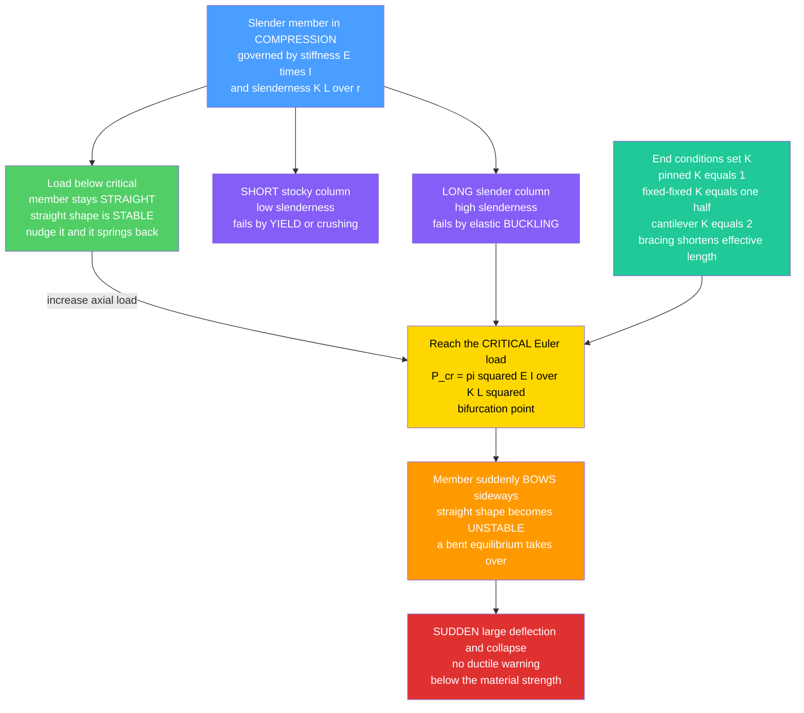

# 🏛️ Structural Stability and Buckling

> [!abstract] TL;DR
> A slender member in **compression** can fail not by crushing but by **buckling** — a sudden sideways deflection at a load far below the material's strength. It is a **bifurcation**: the straight configuration is stable, stable, stable... then at the **critical (Euler) load** it abruptly becomes unstable and the member snaps into a bent shape, often catastrophically and with no warning. The ideal pinned column buckles at $P_{cr} = \pi^2 EI / L^2$ (or $\pi^2 EI/(KL)^2$ with an **effective-length factor** $K$ for the end conditions). The startling fact is that this load depends on **stiffness** ($E\,I$) and **length**, *not* on material strength — so buckling is governed by **slenderness** $\lambda = KL/r$ (where $r=\sqrt{I/A}$ is the radius of gyration): stocky columns crush (yield), slender columns buckle elastically, and intermediate columns fail inelastically in between (the *column curve*). The same instability appears as **lateral-torsional buckling** of deep beams, **local buckling** of thin plates and flanges, **shell buckling**, and **frame sway** (P-delta) instability. Because it strikes below the material's strength and gives no ductile warning, buckling governs the design of every slender compression member — columns, struts, truss members, thin-walled steel sections, and tall structures — and has caused some of history's most dramatic collapses.

---

## Intuition

**Analogy first.** Press down on the two ends of a plastic ruler or a drinking straw. Long before the plastic is anywhere close to being crushed, something alarming happens: the member suddenly **bows sideways** into a curve and folds. That is **buckling** — the sneakiest failure in all of structures, because it strikes a member that, by every strength calculation, should be perfectly fine. A tall slender column does not fail by squashing flat; it fails by **suddenly leaping sideways** into a bend.

What makes it so dangerous is that it is **all-or-nothing**. Push a little harder each time and the column just stands there — straight, stable, carrying the load — right up until one threshold, and then it is *instantly* gone. There is no gradual sag, no groaning warning, no slow droop the way a ductile beam yields. Stable, stable, stable — then catastrophe. This is why slender compression members are governed not by how **strong** the material is, but by how **stiff and slender** the member is. A column made of a stronger steel buckles at exactly the same load as one made of ordinary steel, because both have the same $E$ — and it is $E$, not strength, that resists buckling. That single counterintuitive fact is why so many spectacular structural collapses are, at heart, buckling failures.

---

## How It Works

### Core Mechanics

1. **Two ways a compression member can die.** A short, stocky post fails by **material yielding/crushing** — the stress $\sigma = P/A$ simply reaches the material's strength. A long, slender member fails first by **buckling** — a geometric **loss of stability** — at a stress well below yield. Which one governs depends entirely on **slenderness**.
2. **Buckling is a bifurcation, not a strength limit.** For an ideal straight column the perfectly straight shape is an equilibrium at *every* load. Below the critical load that straight equilibrium is **stable** (nudge it and it springs back). At the critical load a *new* bent equilibrium becomes possible and the straight one goes **unstable** — the two branches split apart (a *pitchfork bifurcation*). Any tiny disturbance then throws the member onto the bent branch.
3. **The Euler critical load.** For a pinned-pinned elastic column, solving the beam equation $EI\,y'' = -Py$ gives the smallest load at which a bent shape can exist: $P_{cr} = \dfrac{\pi^2 EI}{L^2}$. It depends on **flexural stiffness** $EI$ (material stiffness $E$ times the cross-section's second moment of area $I$) and on **length** $L$ — and *not at all* on the material's strength.
4. **Effective length captures the end conditions.** Different end restraints change the buckled shape's half-wavelength, folded into an **effective-length factor** $K$: $P_{cr} = \dfrac{\pi^2 EI}{(KL)^2}$. Pinned-pinned $K=1$; fixed-fixed $K=0.5$ (four times the capacity); fixed-free cantilever $K=2$ (one quarter the capacity); fixed-pinned $K\approx0.7$. **Bracing** a member reduces its effective length and is the cheapest way to raise buckling capacity.
5. **Slenderness ties it together.** Dividing by area gives the critical *stress* $\sigma_{cr} = \dfrac{\pi^2 E}{(KL/r)^2}$, where the **slenderness ratio** $\lambda = KL/r$ is the single governing number ($r=\sqrt{I/A}$ = radius of gyration). Plotting $\sigma_{cr}$ against $\lambda$ gives the **column curve**: a falling $1/\lambda^2$ Euler hyperbola for slender members, **capped by yield** for stocky ones, joined by an **inelastic transition** for intermediate columns (design codes use empirical parabolas here).
6. **Imperfections and real behaviour.** Real columns are never perfectly straight or perfectly centred. **Initial crookedness** and **load eccentricity** mean there is no sharp bifurcation — the member deflects progressively and reaches its limit at a load *below* the ideal $P_{cr}$. Design **column curves** (AISC, Eurocode) are calibrated to real, imperfect members, not the idealized Euler line.
7. **The family of buckling modes.** Beyond column (flexural) buckling: **lateral-torsional buckling** (a deep, narrow beam tips sideways and twists under bending), **local buckling** of thin plates/flanges/webs (why steel sections have width-thickness limits), **shell buckling** (thin cylinders, tanks — highly imperfection-sensitive), and **frame/sway instability** where gravity loads amplify lateral drift (**P-delta** effect).

### Flow / Architecture



---

## Key Concepts

### Secondary Level

- **Buckling = sudden sideways folding under a push.** Press the ends of a ruler or straw and it snaps into a bow long before it is crushed. Slender things fail this way.
- **It is stiffness and slenderness, not strength, that matter.** A stronger steel does *not* buckle at a higher load — only a **stiffer** or **stubbier** (less slender) member does. This is the single most surprising fact about buckling.
- **All-or-nothing.** Unlike a beam that sags and warns you, a buckling column is stable right up to a threshold and then collapses instantly, with no warning.
- **Longer and thinner = weaker against buckling.** Halving the length or fattening the cross-section (moving material outward) dramatically raises the load a column can take.
- **Holding the middle helps.** Bracing a column part-way along (shortening its **effective length**) can multiply how much it carries — cheaper than making it thicker.

### Undergraduate Level

- **Euler critical load.** For an ideal elastic column, $P_{cr} = \dfrac{\pi^2 EI}{(KL)^2}$; in stress form $\sigma_{cr} = \dfrac{\pi^2 E}{\lambda^2}$ with **slenderness** $\lambda = KL/r$ and radius of gyration $r=\sqrt{I/A}$. Buckling depends on $E$ and geometry, *not* on $\sigma_y$.
- **Effective-length factor $K$.** Pinned-pinned $K=1$; fixed-fixed $K=0.5$; fixed-pinned $K\approx0.7$; fixed-free (cantilever) $K=2$. Because $P_{cr}\propto 1/K^2$, fixing both ends quadruples capacity while a cantilever quarters it.
- **The column curve.** Short columns (low $\lambda$) crush at $\sigma_y$; long columns (high $\lambda$) follow the Euler $1/\lambda^2$ hyperbola; **intermediate** columns fail inelastically in between. Codes bridge the gap with empirical curves (**J. B. Johnson parabola**, AISC inelastic $F_{cr}$, Eurocode buckling curves).
- **Transition slenderness.** The two regimes meet near $\lambda_c = \pi\sqrt{2E/\sigma_y}$ (where Euler stress equals $\sigma_y/2$ in the Johnson formulation) — for structural steel $\lambda_c\approx 120$–130.
- **Radius of gyration and buckling axis.** A column buckles about its **weak axis** (smallest $I$, hence smallest $r$). This is why wide-flange columns need bracing about the weak axis and why tubes/hollow sections (large $r$ for the material used) are efficient struts.
- **Local vs global buckling.** A slender *member* buckles globally (Euler); a thin *plate element* (flange, web) can buckle locally at $\sigma_{cr}=k\dfrac{\pi^2 E}{12(1-\nu^2)}(t/b)^2$ — the origin of **width-thickness (b/t) limits** that separate compact, non-compact, and slender steel sections.
- **Imperfection sensitivity.** Initial crookedness and eccentricity remove the sharp bifurcation; the member deflects continuously and the **Southwell plot** ($\delta$ vs $\delta/P$) extracts the effective $P_{cr}$ from test data. Design allowables are set below the ideal Euler line to cover this.

### Graduate Level

- **Energy / eigenvalue formulation.** Buckling loads are the **eigenvalues** of a stability problem: the critical load is where the tangent stiffness $K_E + \lambda K_G$ (elastic plus geometric/stress stiffness) becomes singular, $\det(K_E + \lambda K_G)=0$. The buckled shapes are the **eigenvectors** (mode shapes). This is exactly how finite-element **linear buckling analysis** works.
- **Post-buckling and stability of the branch.** A perfect Euler column has a **stable-symmetric (supercritical)** post-buckling path — load rises slowly as deflection grows ($P/P_{cr}\approx 1+\tfrac{\pi^2}{8}(\delta/L)^2$), so it is imperfection-*insensitive*. **Shells and some frames** have **unstable (subcritical)** post-buckling with sharp load *drops* and severe imperfection sensitivity — hence empirical **knockdown factors** (e.g., NASA SP-8007 for cylinders).
- **Inelastic (tangent-modulus) buckling.** For intermediate columns the material yields before Euler is reached; **Engesser's tangent-modulus** $P_t=\pi^2 E_t I/(KL)^2$ and the **Shanley** reduced-modulus refinement describe buckling with $E$ replaced by the tangent modulus $E_t$ at the operating stress.
- **Lateral-torsional buckling (LTB) of beams.** A deep, laterally unbraced beam in bending buckles by combined lateral deflection and twist: $M_{cr}=\dfrac{\pi}{L_b}\sqrt{EI_y\,GJ}\sqrt{1+\left(\dfrac{\pi}{L_b}\right)^2\dfrac{EC_w}{GJ}}$, coupling weak-axis bending stiffness $EI_y$, torsional stiffness $GJ$, and warping stiffness $EC_w$. Controlled by the **unbraced length** $L_b$.
- **Frame stability and P-delta.** In sway frames the axial gravity loads acting through the lateral **drift** $\Delta$ add overturning moment ($P\text{-}\Delta$), amplifying deflections and reducing the **critical buckling load of the whole frame**. Modern codes handle this with **effective-length alignment charts**, **notional loads**, or a **direct analysis method** using reduced stiffness and second-order analysis.
- **Follower loads and dynamic instability.** Non-conservative (follower) compressive loads can cause **flutter-type (dynamic) instability** rather than static divergence (Beck's column) — the boundary between statics and nonlinear dynamical-systems stability theory.

---

## Python Demo

```python
# Structural stability and buckling.
#   (a) THE COLUMN CURVE  -- critical compressive stress vs slenderness.
#       Euler buckling sigma_cr = pi^2 E / (K*L/r)^2 (a falling 1/lambda^2 curve),
#       capped by the material YIELD/crushing limit, joined by the inelastic
#       (Johnson) transition. Shows short-column crush -> intermediate inelastic
#       -> long-column elastic buckling, and how end conditions K shift the curve.
#   (b) THE STABILITY BIFURCATION  -- axial load vs lateral deflection. The
#       perfect column's straight branch loses stability at P_cr and pitchforks
#       into a bent branch; real (imperfect) columns deflect smoothly toward P_cr.
import numpy as np
import matplotlib.pyplot as plt

# ----------------------------------------------------------------------
# (a) COLUMN CURVE  (structural steel)
# ----------------------------------------------------------------------
E  = 200_000.0      # Young's modulus, MPa  (steel ~ 200 GPa)
sy = 250.0          # yield stress, MPa

lam = np.linspace(1.0, 250.0, 900)           # geometric slenderness  L/r

def euler_stress(lam_geo, K):                 # sigma_cr = pi^2 E / (K*L/r)^2
    return np.pi**2 * E / (K * lam_geo)**2

# Euler curves for three end conditions (K folded onto geometric slenderness)
sig_pin  = euler_stress(lam, 1.0)             # pinned-pinned   K = 1.0
sig_fix  = euler_stress(lam, 0.5)             # fixed-fixed     K = 0.5
sig_cant = euler_stress(lam, 2.0)             # cantilever      K = 2.0

# Design (pinned) column curve = J.B. Johnson inelastic parabola + Euler
lam_c   = np.pi * np.sqrt(2.0 * E / sy)                 # transition slenderness
johnson = sy - (sy**2 / (4.0 * np.pi**2 * E)) * lam**2  # inelastic parabola
design  = np.where(lam <= lam_c, johnson, sig_pin)      # capped/tangent to Euler

# Slenderness at which each K-column's Euler stress reaches yield
lam_yield = lambda K: np.pi * np.sqrt(E / sy) / K
print("(a) COLUMN CURVE  (steel: E=200 GPa, yield=250 MPa)")
print(f"    Euler->yield transition slenderness  lambda_c = {lam_c:5.1f}")
for name, K in [("fixed-fixed K=0.5", 0.5), ("pinned K=1.0", 1.0), ("cantilever K=2.0", 2.0)]:
    print(f"    {name:22s}: buckles at yield when L/r = {lam_yield(K):5.1f}")

# ----------------------------------------------------------------------
# (b) BIFURCATION / POST-BUCKLING  (normalized by P_cr)
# ----------------------------------------------------------------------
d = np.linspace(0.0, 0.35, 300)               # mid-height lateral deflection / L
P_post = 1.0 + (np.pi**2 / 8.0) * d**2        # perfect-column post-buckling branch

# Imperfect columns: initial crookedness a0 -> smooth amplification toward P_cr
#   delta_total = a0 / (1 - P/P_cr)  =>  P/P_cr = 1 - a0/delta_total
def imperfect(a0, npts=300):
    dd = np.linspace(a0, 0.35, npts)
    return dd, 1.0 - a0 / dd

d1, P1 = imperfect(0.02)                       # 2% initial crookedness
d2, P2 = imperfect(0.05)                       # 5% initial crookedness
print("\n(b) BIFURCATION")
print("    Perfect column: straight branch stable below P_cr, pitchforks at P_cr.")
print("    Imperfect columns never reach the ideal P_cr -> capacity knocked down.")

# ----------------------------------------------------------------------
# PLOTS
# ----------------------------------------------------------------------
fig, (axA, axB) = plt.subplots(1, 2, figsize=(14, 5.6))

# ---- (a) column curve ----
axA.plot(lam, np.minimum(sig_pin, sy), color="royalblue", lw=1.4, ls="--",
         label="Euler (pinned K=1)")
axA.plot(lam, np.minimum(sig_fix, sy), color="seagreen", lw=1.2, ls=":",
         label="Euler (fixed-fixed K=0.5)")
axA.plot(lam, np.minimum(sig_cant, sy), color="darkorange", lw=1.2, ls=":",
         label="Euler (cantilever K=2)")
axA.axhline(sy, color="firebrick", lw=1.6, ls="-.", label="Yield / crush limit")
axA.plot(lam, design, color="black", lw=3.0,
         label="Design column curve (Johnson + Euler)")
axA.axvline(lam_c, color="grey", lw=1.0, ls="-.")

# shade the regimes for the pinned design curve
axA.fill_between(lam, 0, design, where=(lam <= lam_c), color="firebrick", alpha=0.10)
axA.fill_between(lam, 0, design, where=(lam >  lam_c), color="royalblue", alpha=0.12)
axA.text(20, 90, "SHORT:\ncrush / inelastic", color="firebrick", fontsize=9)
axA.text(165, 70, "SLENDER:\nelastic buckling", color="royalblue", fontsize=9)
axA.annotate(f"transition\nL/r = {lam_c:.0f}", xy=(lam_c, sy/2),
             xytext=(lam_c + 15, sy*0.72), fontsize=8, color="grey",
             arrowprops=dict(arrowstyle="->", color="grey"))
axA.annotate("fixing ends (K down)\nshifts curve UP and RIGHT",
             xy=(120, euler_stress(120, 0.5)), xytext=(70, 260),
             fontsize=8, color="seagreen",
             arrowprops=dict(arrowstyle="->", color="seagreen"))

axA.set_xlabel("Slenderness ratio  L / r")
axA.set_ylabel("Critical compressive stress  (MPa)")
axA.set_title("(a) Column curve: crushing -> inelastic -> Euler buckling")
axA.set_xlim(0, 250)
axA.set_ylim(0, sy * 1.35)
axA.legend(fontsize=8, loc="upper right")
axA.grid(alpha=0.3)

# ---- (b) bifurcation ----
axB.plot([0, 0], [0, 1], color="black", lw=3.0, label="Straight branch (STABLE)")
axB.plot([0, 0], [1, 1.5], color="black", lw=1.6, ls="--",
         label="Straight branch (UNSTABLE)")
axB.plot( d, P_post, color="royalblue", lw=2.6, label="Post-buckling branch (perfect)")
axB.plot(-d, P_post, color="royalblue", lw=2.6)
axB.plot(d1, P1, color="darkorange", lw=2.0, label="Imperfect column (2% crooked)")
axB.plot(d2, P2, color="firebrick",  lw=2.0, label="Imperfect column (5% crooked)")
axB.axhline(1.0, color="grey", lw=1.0, ls=":")
axB.scatter([0], [1.0], color="gold", edgecolor="k", s=90, zorder=6)
axB.annotate("BIFURCATION\nat P_cr", xy=(0, 1.0), xytext=(0.10, 0.78),
             fontsize=9, color="black",
             arrowprops=dict(arrowstyle="->", color="black"))
axB.annotate("real columns fail\nbelow the ideal P_cr", xy=(0.30, P2[-1]),
             xytext=(0.12, 0.45), fontsize=8, color="firebrick",
             arrowprops=dict(arrowstyle="->", color="firebrick"))

axB.set_xlabel("Lateral deflection  delta / L")
axB.set_ylabel("Axial load  P / P_cr")
axB.set_title("(b) Stability bifurcation and post-buckling")
axB.set_xlim(-0.36, 0.36)
axB.set_ylim(0, 1.5)
axB.legend(fontsize=8, loc="lower right")
axB.grid(alpha=0.3)

plt.tight_layout()
plt.savefig("structural_stability_buckling.png", dpi=120)
plt.show()
```

**What it shows.** Panel (a) is the whole design story on one plot: the Euler stress collapses as $1/\lambda^2$, so slender columns (right side, blue) buckle at a *fraction* of the yield line, while stocky columns (left, red) simply crush at $\sigma_y$; the black **design curve** rides the yield cap, bends through the **inelastic transition** near $\lambda_c\approx126$, and merges onto Euler. The faint dotted curves show how **fixing the ends** ($K=0.5$) pushes the buckling limit up and to the right (you can be far more slender before buckling), while a **cantilever** ($K=2$) drags it down. Panel (b) is the **bifurcation**: the perfect column sits on the vertical straight branch — **stable** (thick) below $P_{cr}$, **unstable** (dashed) above — and at $P_{cr}$ it pitchforks into the gently rising bent branches; the orange and red curves show that **real, imperfect columns** never reach the ideal $P_{cr}$ but deflect smoothly and top out below it, which is exactly why code column curves are calibrated beneath the Euler line.

---

## Real-World Applications

> **Steel building columns (AISC / Eurocode).** Every steel column in a building is sized by exactly this framework: compute the **slenderness** $KL/r$ about the weak axis, read the **critical stress** off the code column curve (flexural buckling for slender members, inelastic for intermediate), and check that the factored axial load stays within capacity. The **effective-length factor** $K$ is picked from the connection restraint or the frame's sway condition (alignment charts / direct analysis). Bracing is added specifically to cut $KL$ and raise capacity without adding steel section.

> **Truss compression members and struts.** In a bridge or roof truss, tension members can be slim, but every **compression** diagonal or top chord is buckling-governed. Designers use **hollow structural sections (HSS)** and pipes precisely because they give a large radius of gyration $r$ (material spread far from the axis) for a given weight, maximizing $P_{cr}$. A truss member "sized for its axial force" but not checked for buckling is a classic failure.

> **Scaffolding, shoring, and formwork collapses.** Many construction-phase collapses are buckling of slender temporary compression members — shoring posts and scaffold standards overloaded or inadequately braced, so their **effective length** was longer than assumed. The 1907 **Quebec Bridge** collapse (compression chord buckling from underestimated dead load and inadequate latticing) is the textbook cautionary tale that reshaped how compression members are detailed.

> **Thin-walled and cold-formed steel; plate girders.** Cold-formed steel studs, and the thin flanges/webs of plate girders, are governed by **local plate buckling** — hence **width-thickness (b/t) limits**, **stiffeners** on girder webs, and the "effective width" concept for post-buckled panels. The same physics underlies **shell buckling** of steel tanks, silos, and offshore tubulars, where imperfection-sensitivity forces conservative knockdown factors.

> **Aerospace airframes and launch vehicles.** Thin aircraft skins and slender stringers buckle far below yield, which is *why* semi-monocoque structures are full of stiffeners, ribs, and frames that shorten buckling lengths — the same Euler/plate-buckling equations, pushed to the absolute weight minimum (see [[Aerospace_Structures_and_Airframes]]). Rocket interstages use **isogrid/orthogrid** lattices for the same reason.

---

## Common Pitfalls

- **Checking strength but not stability.** The single most dangerous error: a slender member confirmed "safe" because $\sigma = P/A < \sigma_y$ can still **buckle** at a fraction of that stress. Compression members must *always* be checked for buckling, not just crushing.
- **Thinking a stronger material helps.** Euler buckling depends on **stiffness $E$** and **geometry**, not strength. Upgrading from mild steel to high-strength steel does **nothing** for the elastic buckling load of a slender column — only stiffness, a larger $I$, or a shorter effective length does.
- **Getting the effective length $K$ wrong.** Assuming pinned ($K=1$) when the real condition is a sway cantilever ($K=2$) overestimates capacity **fourfold**. Sway vs non-sway frames, and the actual rotational restraint at joints, dominate the answer — use alignment charts or direct analysis, not a guess.
- **Buckling about the wrong axis.** A column buckles about the axis with the **smallest $r$** (weak axis). Sizing on the strong-axis $I$, or forgetting that unequal bracing spacing changes which axis governs, invites failure about the unbraced weak axis.
- **Ignoring the inelastic (intermediate) range.** Real columns are usually intermediate: applying the pure Euler formula there **overestimates** capacity (the material yields first), while applying pure yield **underestimates** it. Use the code column curve that blends both.
- **Trusting the ideal $P_{cr}$ for imperfection-sensitive structures.** Thin **shells** and some **frames** buckle *well below* the classical prediction because of initial imperfections and unstable post-buckling. Design column curves and empirical **knockdown factors** exist precisely to cover this gap.
- **Forgetting beam and frame instability.** Buckling is not just columns: an unbraced deep beam fails by **lateral-torsional buckling**, and a whole frame can go unstable through **P-delta** sway even when no single member is overstressed. Provide lateral bracing and run a second-order analysis.
- **Assuming ductile warning.** Buckling gives **no ductile sag** before collapse — it is sudden. You cannot rely on visible deflection as a warning the way you can with a yielding beam; the margin has to be in the design, not in observation.

---

## Related Concepts

- [[Bending_and_Beam_Theory]] *(Mechanical_Engineering)* — buckling is derived from the beam-bending equation $EI\,y''=-Py$; the same **flexural stiffness $EI$** and second moment of area $I$ that resist bending set the buckling load, and "put material far from the axis" maximizes both.
- [[Stress_Strain_and_Deformation]] *(Mechanical_Engineering)* — supplies the elastic modulus $E$ that governs $\sigma_{cr}\propto E$ and the yield stress $\sigma_y$ that caps the column curve; the key lesson is that buckling separates **stiffness** ($E$) from **strength** ($\sigma_y$).
- [[Aerospace_Structures_and_Airframes]] *(Aerospace_Engineering)* — the extreme case: thin skins and slender stringers buckle far below yield, which is *why* airframes are stiffened; the identical Euler and plate-buckling equations, driven to minimum weight.
- [[Failure_Fatigue_and_Fracture]] *(Mechanical_Engineering)* — the other family of limit states; buckling is a **stability** failure (geometric, sudden) that stands alongside strength, fatigue, and fracture as a distinct way a member can fail.
- [[Bifurcations_and_Tipping_Points]] *(Systems_Thinking_and_Complexity)* — buckling is a textbook **pitchfork bifurcation**: the straight equilibrium loses stability at a critical parameter and the system jumps to a new branch, the same mathematics as tipping points in nonlinear systems.
- [[Oscillations_and_SHM]] *(Physics)* — the stability-of-equilibrium counterpart: a stable equilibrium (a restoring "energy well," like SHM) becomes **unstable** at the buckling load — the potential-energy view where the well flattens and inverts.

*Sibling notes in this Structural Analysis and Mechanics section (referenced in prose, to be linked when created): **Beams: Shear and Bending Moment** (the internal actions and $EI$ that feed buckling), **Deflection and Statically Indeterminate Structures** (the stiffness methods behind stability/eigenvalue analysis), **Analysis of Trusses and Frames** (where compression members and frame sway instability arise), **Structural Steel Design** (the code column curves, $KL/r$, and b/t limits applied in practice), and **Structural Dynamics and Wind Engineering** (dynamic instability and P-delta under lateral loads).*

---

## Review Questions

1. **(Secondary)** Press down on the ends of a plastic ruler and it suddenly bows sideways long before it is crushed. Using the words *stiffness*, *slenderness*, and *strength*, explain why making the ruler out of a **stronger** plastic would **not** raise the load at which it buckles — but making it shorter, or bracing its middle, would.
2. **(Undergraduate)** A pinned steel column ($E=200$ GPa) has slenderness $KL/r = 150$. (a) Using $\sigma_{cr}=\pi^2 E/(KL/r)^2$, is it governed by Euler buckling or by yield ($\sigma_y=250$ MPa)? (b) If both ends are instead fixed, what is the new effective slenderness and by what factor does $P_{cr}$ change? (c) Explain why a hollow tube of the same weight would carry more load than a solid bar.
3. **(Graduate)** Contrast the post-buckling behaviour of an ideal Euler column (stable-symmetric, imperfection-insensitive) with that of a thin cylindrical shell (unstable, severely imperfection-sensitive). Why does the column's design curve sit only slightly below the Euler line while the shell needs large empirical **knockdown factors**? Frame your answer in terms of the bifurcation branch's stability and the role of initial imperfections.

---

## Sources

- Timoshenko, S. P. & Gere, J. M. — *Theory of Elastic Stability*, 2nd ed. (McGraw-Hill) — the classic foundational treatment of columns, plates, shells, and lateral-torsional buckling.
- Hibbeler, R. C. — *Mechanics of Materials* (Pearson) — standard undergraduate derivation of the Euler load, effective length, and the column (Euler/Johnson) curve.
- Galambos, T. V. & Surovek, A. E. — *Structural Stability of Steel: Concepts and Applications for Structural Engineers* (Wiley) — modern steel-design stability, frame stability, and the direct analysis method.
- Bazant, Z. P. & Cedolin, L. — *Stability of Structures: Elastic, Inelastic, Fracture and Damage Theories* (World Scientific) — advanced/graduate treatment of post-buckling, inelastic and dynamic instability.
- Chen, W. F. & Lui, E. M. — *Structural Stability: Theory and Implementation* (Elsevier) — energy methods, eigenvalue formulation, and effective-length factors for design.

---

#civil-engineering #buckling #euler-load #stability #slenderness
