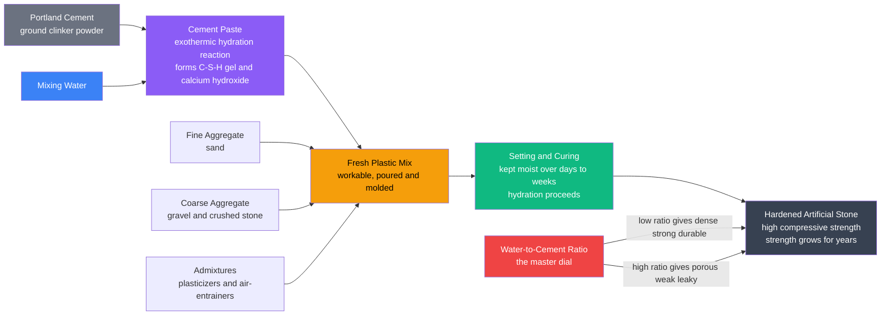

# 🧱 Concrete Technology and Cement

> [!abstract] TL;DR
> Concrete is artificial stone: a composite of cement paste, sand, and gravel that you pour like a thick milkshake and that then hardens into rock. Its magic is **cement**, a gray powder that reacts with water in an exothermic chemical process called **hydration**, growing a nanoscale gel (C-S-H) that knits everything into a solid mass — a reaction that continues for years, which is why strength is benchmarked at 28 days rather than measured the day after pouring. The single most important number in all of concrete is the **water-to-cement (w/c) ratio**: just enough water gives strong, dense, durable stone; excess water added merely to make placing easier leaves behind capillary pores that make the concrete weak, permeable, and vulnerable to the corrosion of its embedded steel. That one dial trades workability against strength and durability, and mastering it — together with curing and durability design — is the heart of the craft that built the modern world.

---

## Intuition

**Analogy:** Concrete is artificial stone that you can pour like a thick milkshake and that then turns to rock. It is the most-used human-made material on Earth — we manufacture on the order of a tonne of it per person per year, more than any material except water. Picture mixing glue, sand, and gravel: the gravel and sand are cheap bulk filler (the "raisins and rice"), and the glue that binds them is **cement paste** — cement powder plus water. But this glue is not like drying paint that merely loses water; it sets through a *chemical reaction*. Add water to cement and it undergoes **hydration**, growing microscopic crystals and gel that interlock and stiffen, so a soupy plastic mass slowly becomes an interlocked rigid solid — even underwater, where nothing can "dry."

The heart of the craft is one dial. Cement needs only a small amount of water to react fully, but concrete workers add extra to make the mix flowable enough to pour and finish. That extra water is the villain: after hydration consumes what it needs, the leftover water evaporates and leaves behind a network of **capillary pores**. More water means an easier pour but a weaker, more porous, leakier stone. This is the **water-to-cement ratio** — the master control that trades placeability against strength and durability. Getting it right, and then keeping the young concrete moist so hydration can finish (curing), is what separates a bridge that lasts a century from one that spalls and crumbles in twenty years.

---

## How It Works

### Core Mechanics

1. **Ingredients.** Concrete is a particulate composite of four things: **Portland cement** (the reactive binder powder), **water**, **fine aggregate** (sand), and **coarse aggregate** (gravel or crushed stone, the cheap bulk filler), plus small doses of **admixtures** to tune behavior. Cement + water is the **paste**; paste + sand is **mortar**; mortar + gravel is **concrete**.

2. **Making cement.** Portland cement is manufactured by calcining a blend of limestone (CaCO₃) and clay/shale at ~1450 °C in a rotary kiln. The limestone decomposes (CaCO₃ → CaO + CO₂) and the oxides fuse into **clinker** nodules, which are ground with a few percent gypsum into the fine gray powder we call cement.

3. **Hydration — the reaction that builds strength.** When water hits cement, the clinker minerals dissolve and precipitate new hydration products, chiefly **calcium-silicate-hydrate (C-S-H) gel** — the nanoscale "glue" responsible for strength — plus **calcium hydroxide (CH, portlandite)**. Hydration is *exothermic* (it releases heat) and *time-dependent*: it is fast in the first days, then slows to a crawl but never truly stops, so concrete keeps gaining strength for months and years. Strength is quoted at **28 days** as the standard benchmark.

4. **The water-to-cement ratio (the master variable).** Only about 0.23–0.25 g of water per gram of cement is chemically needed for full hydration, plus ~0.19 for gel water (total ~0.42). Any water above that is "extra" for **workability**. When it eventually leaves, it becomes **capillary porosity**. Because strength and impermeability are governed by how dense and pore-free the paste is, a **lower w/c → stronger, more durable concrete**, and a **higher w/c → weaker, more permeable concrete**. This is **Abrams' law**: strength falls steeply as w/c rises.

5. **Fresh → hard.** The fresh mix must be workable enough to place and compact (measured by the **slump test**), it then **sets** (stiffens), and finally it must be **cured** — kept moist and at a reasonable temperature so hydration can continue. Premature drying starves the reaction and permanently caps strength and durability.

6. **Hardened behavior.** Hardened concrete is excellent in **compression** but weak in **tension** (only ~8–12% of its compressive strength), which is why it is reinforced with steel. Over time it also **shrinks** (as it dries) and **creeps** (deforms slowly under sustained load) — both can crack it.

### Flow / Architecture



---

## Key Concepts

### Secondary Level

**What concrete is.** Concrete = **paste** (cement + water) that glues together **aggregate** (sand + gravel). The aggregate is cheap filler that occupies ~60–75% of the volume; the paste is the expensive, active ingredient that binds it. Think "instant sedimentary rock."

**Cement is not glue that dries — it reacts.** Portland cement is made by roasting limestone and clay into clinker, then grinding it to powder. Mixed with water, it undergoes **hydration**, a chemical reaction that grows a solid gel. This is why concrete can harden underwater and why it warms up as it sets (the reaction releases heat).

**Concrete gains strength over time.** It is not "done" when it stops looking wet. Hydration continues for weeks, months, even years. Engineers quote the **28-day strength** as the standard reference, but a slab keeps getting stronger long after.

**The water-cement ratio is everything.** A little water makes strong, hard concrete; too much water makes it flow easily but leaves pores as the surplus evaporates, giving weak, leaky concrete. Lower w/c → stronger and more durable; higher w/c → weaker. Workers are tempted to "add water to make it easier," which quietly ruins the concrete.

**Strong in squeeze, weak in pull.** Concrete resists **compression** superbly (like a stack of bricks) but is poor in **tension** — it cracks easily when pulled or bent. That is why we cast steel bars inside it (reinforced concrete): the steel carries the tension, the concrete the compression.

**Workability and curing.** *Workability* is how easily fresh concrete can be placed and finished (checked with the **slump test** — how far a cone of fresh concrete sags). *Curing* means keeping the young concrete moist and warm (covering, ponding, spraying) so hydration can complete. Skipping curing is one of the most common causes of weak, dusty, cracking concrete.

### Undergraduate Level

**Clinker chemistry (cement shorthand).** Cement chemists use oxide shorthand: C = CaO, S = SiO₂, A = Al₂O₃, F = Fe₂O₃, H = H₂O. Portland clinker is four main phases:

| Phase | Name | Formula | Role |
|---|---|---|---|
| C₃S | Alite | 3CaO·SiO₂ | Main early strength; fast, high heat |
| C₂S | Belite | 2CaO·SiO₂ | Late strength; slow, low heat |
| C₃A | Aluminate | 3CaO·Al₂O₃ | Very fast set (flash set) — controlled by gypsum; vulnerable to sulfate attack |
| C₄AF | Ferrite | 4CaO·Al₂O₃·Fe₂O₃ | Minor strength; gives gray color |

**Hydration reactions.** The silicate phases react with water to form the strength-bearing **C-S-H gel** and **calcium hydroxide**:

$$2\,C_3S + 6\,H \rightarrow C\text{-}S\text{-}H + 3\,CH$$
$$2\,C_2S + 4\,H \rightarrow C\text{-}S\text{-}H + CH$$

C-S-H is a poorly crystalline, high-surface-area nanogel (~60% of hydrated paste) that provides essentially all the strength; CH (portlandite, ~20%) contributes little strength but keeps the pore solution highly alkaline (pH ≈ 13), which protects embedded steel. Gypsum is inter-ground to retard C₃A and prevent flash set. Hydration kinetics show an early dormant period, then acceleration, then a long deceleration diffusion-controlled tail — the same activation-controlled → diffusion-controlled crossover seen in [[Chemical_Kinetics]], and the heat release is a direct signature of the reaction enthalpy (see [[Chemical_Thermodynamics]]).

**Abrams' law (quantitative).** Duff Abrams (1918) found compressive strength depends primarily on w/c ratio, essentially independent of mix proportions, for workable, fully compacted concrete:

$$f_c = \frac{A}{B^{\,w/c}}$$

where $A$ and $B$ are empirical constants for the materials and age. Because $f_c$ falls exponentially with w/c, dropping w/c from 0.65 to 0.45 can roughly *double* the 28-day strength. Physically, w/c sets the **capillary porosity** of the paste, and strength scales with **Powers' gel-space ratio** $x$ (the fraction of available space filled by hydration products), with $f_c \propto x^{\,n}$ ($n \approx 2.6$–3).

**Minimum water and self-desiccation.** Complete hydration needs w/c ≈ 0.42 (≈0.23 chemically bound + ≈0.19 gel water). Below that, there is not enough water to hydrate all the cement; internal humidity drops (**self-desiccation**), which drives **autogenous shrinkage** — important in modern low-w/c high-performance concrete.

**Fresh concrete phenomena.** *Bleeding* (water rising to the surface), *segregation* (heavy aggregate sinking), *initial/final set* (Vicat needle), and *consolidation* (vibration to expel entrapped air) all affect the final quality. Every 1% of entrapped air voids costs roughly 5% of strength.

**Admixtures.** Chemical dopes that punch above their tiny dosage:
- **Water reducers / superplasticizers** — disperse cement clumps so the same workability needs far less water, letting you lower w/c (the key to high-strength and self-consolidating concrete).
- **Air-entrainers** — deliberately create ~4–7% of tiny stable air bubbles for **freeze-thaw** protection.
- **Retarders / accelerators** — slow or speed the set (hot vs cold weather, or fast formwork turnaround).
- **Supplementary cementitious materials (SCMs)** — fly ash, ground slag, silica fume: industrial by-products that react **pozzolanically** with CH to form more C-S-H, densifying the paste, cutting permeability, and reducing cement (and CO₂) content.

**Hardened properties.** Elastic modulus scales with strength; ACI gives $E_c \approx 4700\sqrt{f_c'}$ (MPa) for normal-weight concrete — the stress-strain framework of [[Stress_Strain_and_Elastic_Moduli]] applies, though concrete is nonlinear and cracks in tension. Time-dependent **drying shrinkage** and **creep** (slow deformation under sustained load) must be accounted for to avoid cracking and deflection.

### Graduate Level

**Microstructure and the weak link.** Hydrated paste is a multiscale porous solid: C-S-H gel (with gel pores ~1–3 nm), portlandite crystals, unhydrated clinker cores, and **capillary pores** (~10 nm–10 µm) whose volume and connectivity — set by w/c — govern permeability and strength. The **interfacial transition zone (ITZ)**, a ~20–50 µm porous, CH-rich, higher-w/c halo around each aggregate particle, is the mechanical weak link and the preferential path for cracks and aggressive ions; this is why concrete's strength lies well below that of either paste or aggregate alone. The brittle, flaw-controlled tensile failure connects directly to [[Fracture_Mechanics_and_Toughness]], and concrete's silicate/portlandite mineralogy makes it a member of the ceramic family covered in [[Ceramics_and_Glasses]].

**Durability — the real long-term challenge.** Most concrete does not fail by overload; it deteriorates. The dominant mechanisms:

- **Reinforcement corrosion (the #1 deterioration mode).** Fresh concrete's high alkalinity (pH ≈ 13 from CH) forms a passive oxide film on the steel rebar. Two things destroy that passivity: (1) **chloride ingress** (from de-icing salt or seawater) reaching a threshold at the steel, and (2) **carbonation** lowering the pH. Once depassivated, the steel corrodes; rust occupies 2–6× the volume of the parent steel, cracking and **spalling** the cover concrete. The **Tuutti model** splits service life into an *initiation* period (ions diffusing to the steel) and a *propagation* period (active corrosion). Chloride ingress is often modeled by Fick's second law with an apparent diffusion coefficient. This is an electrochemical process — anode/cathode, passivation, and the role of oxygen and moisture are exactly the concepts in [[Corrosion_and_Electrochemical_Degradation]] and [[Electrochemistry]].
- **Carbonation.** Atmospheric CO₂ dissolves in pore water and reacts with CH: CO₂ + Ca(OH)₂ → CaCO₃ + H₂O. This consumes alkalinity, dropping pH below ~9 and depassivating steel. The carbonation front advances roughly as $x \propto \sqrt{t}$, so cover depth and low permeability are the defenses.
- **Freeze-thaw.** Water in saturated capillary pores expands ~9% on freezing, generating hydraulic and osmotic pressures that scale and crack the surface. **Air entrainment** provides nearby empty voids to relieve the pressure; the **spacing factor** (max distance from any point to an air void, ≲0.20 mm) is the design criterion.
- **Sulfate attack.** External sulfates react with hydration products to form expansive **ettringite** and gypsum, causing expansion and softening. Mitigated with low-C₃A (sulfate-resisting) cement and SCMs.
- **Alkali-silica reaction (ASR).** Reactive (amorphous) silica in some aggregates reacts with pore-solution alkalis to form a hygroscopic gel that swells and cracks the concrete from within ("concrete cancer") over years. Mitigated with low-alkali cement, SCMs, or non-reactive aggregate.

**Special concretes.**
- **High-strength / high-performance concrete (HSC/HPC):** very low w/c (~0.2–0.35) enabled by superplasticizers, plus **silica fume** to densify the ITZ; strengths of 60–120+ MPa.
- **Self-consolidating concrete (SCC):** rheology-engineered to flow and fill formwork under its own weight without vibration (high fluidity + segregation resistance).
- **Fiber-reinforced concrete (FRC / UHPC):** steel or polymer fibers bridge cracks, adding post-crack tensile toughness — a composite-reinforcement idea shared with [[Composite_Materials_and_Fiber_Reinforcement]]; UHPC (e.g., Ductal) combines low w/c, silica fume, and fibers for >150 MPa strength.

**Sustainability — the carbon problem.** Cement production is responsible for roughly **8% of global anthropogenic CO₂**, from two sources: the **calcination** chemistry itself (CaCO₃ → CaO + CO₂ is unavoidable per mole of clinker) and the **fuel** to reach 1450 °C. Levers to cut it: replacing clinker with **SCMs** (fly ash, slag), **limestone calcined clay cement (LC3)**, alkali-activated/**geopolymer** binders, CO₂ curing and mineralization, and simply designing for durability so structures last longer per tonne of cement. This is a central case study in [[Sustainable_Materials_and_Circular_Economy]] and a major emissions wedge in [[Anthropogenic_Climate_Change]].

---

## Python Demo

```python
# Concrete behavior: (a) Abrams' law -- strength vs water-to-cement ratio,
# and (b) strength gain vs curing time, showing why curing matters.
# Uses numpy + matplotlib only.

import numpy as np
import matplotlib.pyplot as plt

# -------------------------------------------------------------------
# (a) ABRAMS' LAW:  f_c = A / B^(w/c)
#     A, B are empirical material constants (28-day, SI-ish values).
#     Strength falls steeply as w/c rises -- the fundamental tradeoff.
# -------------------------------------------------------------------
A = 96.5     # MPa  (Abrams constant)
B = 8.2      # dimensionless base

wc = np.linspace(0.30, 0.80, 300)          # water-to-cement ratio
fc = A / B**wc                              # 28-day compressive strength, MPa

# Two illustrative mixes
wc_good, wc_bad = 0.45, 0.65
fc_good = A / B**wc_good
fc_bad  = A / B**wc_bad

# -------------------------------------------------------------------
# (b) STRENGTH GAIN vs CURING TIME (ACI 209 model):
#     f_c(t) = f28 * t / (a + b*t)   -- rapid early gain, then leveling.
#     Curve 1: continuously moist-cured (hydration keeps going).
#     Curve 2: moist-cured only 3 days then air-dried (hydration stalls).
# -------------------------------------------------------------------
f28 = 40.0                                  # 28-day strength, MPa
a, b = 4.0, 0.85                            # ACI 209 constants (Type I, moist)

t = np.linspace(0.5, 365, 600)             # age in days
moist = f28 * t / (a + b*t)                # continuously moist-cured

# Air-dried after t_cure: strength "freezes" (hydration needs water),
# with only a small residual gain afterwards.
t_cure = 3.0
frozen = f28 * t_cure / (a + b*t_cure)
air = np.where(
    t <= t_cure,
    f28 * t / (a + b*t),
    frozen + 0.10*f28*(1.0 - np.exp(-(t - t_cure)/25.0))
)

# -------------------------------------------------------------------
# Plot
# -------------------------------------------------------------------
fig, ax = plt.subplots(1, 2, figsize=(13, 5))

# Left: Abrams' law
ax[0].plot(wc, fc, color="#b91c1c", lw=2.6)
ax[0].scatter([wc_good, wc_bad], [fc_good, fc_bad],
              color=["#065f46", "#92400e"], zorder=5, s=70)
ax[0].annotate(f"w/c = {wc_good}\n{fc_good:.0f} MPa\nstrong, hard to place",
               (wc_good, fc_good), textcoords="offset points", xytext=(15, 10),
               fontsize=9, color="#065f46")
ax[0].annotate(f"w/c = {wc_bad}\n{fc_bad:.0f} MPa\nweak, easy to pour",
               (wc_bad, fc_bad), textcoords="offset points", xytext=(10, 25),
               fontsize=9, color="#92400e")
ax[0].set_xlabel("Water-to-cement ratio  w/c")
ax[0].set_ylabel("28-day compressive strength (MPa)")
ax[0].set_title("Abrams' Law: the master tradeoff\nstrength collapses as w/c rises")
ax[0].grid(True, alpha=0.3)

# Right: strength gain / curing
ax[1].plot(t, moist, color="#1d4ed8", lw=2.6, label="continuously moist-cured")
ax[1].plot(t, air,   color="#ea580c", lw=2.4, ls="--",
           label="moist 3 days, then air-dried")
ax[1].axvline(28, color="gray", ls=":", lw=1.5)
ax[1].axhline(f28, color="gray", ls=":", lw=1.0, alpha=0.6)
ax[1].annotate("28-day benchmark", (28, 8), rotation=90,
               fontsize=9, color="gray", va="bottom")
ax[1].set_xlabel("Curing age (days)")
ax[1].set_ylabel("Compressive strength (MPa)")
ax[1].set_title("Strength gain vs curing\nhydration continues only while moist")
ax[1].set_xscale("log")
ax[1].legend(loc="lower right", fontsize=9)
ax[1].grid(True, alpha=0.3, which="both")

plt.tight_layout()
plt.savefig("concrete_wc_and_curing.png", dpi=130)
plt.show()

# -------------------------------------------------------------------
# Printed summary
# -------------------------------------------------------------------
print("Abrams' law (28-day):")
for x in (0.35, 0.45, 0.55, 0.65, 0.75):
    print(f"  w/c = {x:.2f}  ->  f_c = {A / B**x:5.1f} MPa")

print("\nStrength as fraction of 28-day (moist-cured):")
for age in (1, 3, 7, 28, 90, 365):
    frac = (age/(a + b*age)) / (28/(a + b*28))
    print(f"  {age:4d} days  ->  {frac*100:5.1f}%")

print(f"\nAir-dried after {t_cure:.0f} days reaches only "
      f"~{air[-1]/moist[-1]*100:.0f}% of continuously moist-cured strength.")
```

**Expected output (approximate):**

```
Abrams' law (28-day):
  w/c = 0.35  ->  f_c =  45.9 MPa
  w/c = 0.45  ->  f_c =  38.9 MPa
  w/c = 0.55  ->  f_c =  33.0 MPa
  w/c = 0.65  ->  f_c =  28.0 MPa
  w/c = 0.75  ->  f_c =  23.7 MPa

Strength as fraction of 28-day (moist-cured):
     1 days  ->   20.5%
     3 days  ->   45.5%
     7 days  ->   69.9%
    28 days  ->  100.0%
    90 days  ->  111.0%
   365 days  ->  115.3%
```

The left plot shows Abrams' law — the strongly decreasing strength-vs-w/c curve that captures the fundamental tradeoff (low w/c is strong but stiff and hard to place). The right plot shows the classic strength-gain curve: rapid early hydration, the 28-day benchmark, and a long slow tail — plus the penalty of stopping curing early, where the air-dried specimen stalls far below its potential because hydration has no water to proceed.

---

## Real-World Applications

> **The Hoover Dam and heat of hydration.** For the massive concrete pours of the 1930s, engineers faced the exothermic nature of hydration head-on: a monolithic pour of the dam would have taken ~100 years to cool and would have cracked badly from thermal gradients. The solution was to cast concrete in interlocking blocks laced with embedded steel cooling pipes circulating refrigerated water, then grout the joints — a direct engineering response to hydration being a heat-releasing chemical reaction, not a drying process. Modern mass concrete still uses low-heat cements (high C₂S) and SCMs to manage the same thermal problem.

> **Marine structures and chloride-driven corrosion.** Bridges, piers, and offshore platforms in seawater are designed around the Tuutti service-life model. Engineers specify low w/c (≤0.40), thick concrete **cover** over the rebar, SCMs (slag, silica fume) to slash chloride diffusivity, and sometimes stainless or epoxy-coated rebar or cathodic protection — because chloride-induced reinforcement corrosion, not overload, is what destroys most coastal concrete. The collapse and costly repair of countless salt-exposed bridge decks is a monument to the w/c ratio and cover-depth details.

> **Burj Khalifa high-strength pumped concrete.** The world's tallest building used C80 (80 MPa) high-performance concrete with very low w/c, superplasticizers, silica fume, and fly ash, engineered to be pumped a record vertical distance (>600 m) while retaining workability and controlling heat and shrinkage. It is a showcase of admixture technology decoupling workability from w/c — you can have a fluid, pumpable mix *and* a low w/c at the same time.

> **Self-consolidating concrete in dense reinforcement.** Precast elements and heavily reinforced nuclear/marine structures use SCC that flows into congested rebar cages and complex molds under gravity alone, eliminating vibration, reducing labor and noise, and producing a superior surface finish with fewer voids — a rheology-driven advance that improves both quality and durability.

> **Low-carbon concrete (LC3 and geopolymers).** Facing cement's ~8% share of global CO₂, producers now deploy limestone calcined clay cement (LC3), high-SCM blends, and alkali-activated/geopolymer binders in real projects, cutting embodied carbon by 30–60% while meeting strength and durability targets — the leading near-term decarbonization lever for the construction sector.

---

## Common Pitfalls

- **Adding water on site to improve workability.** The most damaging and common field error. "Tempering" a stiff mix with extra water raises w/c, and by Abrams' law silently slashes strength and durability while boosting shrinkage and permeability. The correct fix is a superplasticizer, which improves flow *without* raising w/c.
- **Confusing setting/drying with hydration.** Concrete does not gain strength by "drying out" — it hardens by a chemical reaction that *requires* water. Letting it dry prematurely (no curing) starves hydration and permanently caps strength. Concrete cured continuously moist can end up 50%+ stronger than the same mix left to air-dry after a few days.
- **Skipping or shortening curing.** Because early hydration is fast, the first days of moist curing capture most of the potential strength and, critically, densify the surface skin that resists carbonation and chloride ingress. Poor curing is a leading cause of dusting, crazing, and premature durability failure.
- **Treating strength and durability as the same thing.** A concrete can hit its 28-day strength target yet still be durability-deficient if it is permeable, poorly cured, has inadequate cover, or uses reactive aggregate. Durability is governed by permeability, cover depth, and exposure chemistry — designed separately from strength.
- **Ignoring the interfacial transition zone and aggregate quality.** Weak, dirty, dust-coated, or reactive (ASR-prone) aggregate undermines the whole mix regardless of cement quality. The ITZ is the crack path and ion highway; clean, sound, well-graded aggregate and SCMs that densify the ITZ matter as much as the paste.
- **Under-designing concrete cover and crack control for corrosion.** Insufficient cover, wide cracks, or high w/c let chlorides and CO₂ reach the rebar quickly. Once the steel depassivates, expansive rust spalls the cover and the deterioration accelerates. Cover depth, crack-width limits, and low permeability are the front-line corrosion defenses.
- **Neglecting shrinkage and thermal cracking.** Restrained drying shrinkage, autogenous shrinkage (in low-w/c mixes), and heat-of-hydration thermal gradients all crack concrete before any service load is applied. Joints, curing, low-heat mixes, and reinforcement for crack control address these.

---

## Related Concepts

Within the Civil Engineering vault, this note is the material-science foundation for the structural-design siblings: **Reinforced_Concrete_Design** (steel bars carrying the tension that concrete cannot), **Prestressed_Concrete** (pre-compressing concrete so it never sees net tension), **Design_Codes_and_Structural_Safety** (how f'c, cover, and durability classes enter ACI/Eurocode design), **Construction_Materials_and_Quality** (mix design, batching, slump/strength testing, QA/QC), and **Sustainable_and_Smart_Infrastructure** (low-carbon concrete, service-life design, and monitoring). Understanding the w/c ratio, hydration, curing, and durability here is the prerequisite for all of them.

Cross-vault connections (verified to exist):

- [[Ceramics_and_Glasses]] — cement paste is a silicate/portlandite binder; concrete is a member of the ceramic family, sharing brittle, flaw-controlled behavior and silicate chemistry.
- [[Composite_Materials_and_Fiber_Reinforcement]] — concrete is itself a particulate composite (paste + aggregate); fiber-reinforced and reinforced concrete apply the same load-sharing principles.
- [[Stress_Strain_and_Elastic_Moduli]] — concrete's elastic modulus, nonlinear stress-strain response, and huge compression/tension asymmetry.
- [[Fracture_Mechanics_and_Toughness]] — concrete's weakness in tension is flaw-controlled brittle fracture, initiating in the interfacial transition zone.
- [[Corrosion_and_Electrochemical_Degradation]] — reinforcement corrosion, the #1 concrete deterioration mode, is an electrochemical process of passivation and depassivation.
- [[Electrochemistry]] — the anode/cathode, passive-film, and pore-solution chemistry underlying rebar corrosion and cathodic protection.
- [[Chemical_Kinetics]] — hydration's dormant-acceleration-deceleration kinetics explain rapid early strength gain and the long slow tail.
- [[Chemical_Thermodynamics]] — hydration is exothermic; heat of hydration drives thermal cracking in mass concrete.
- [[Sustainable_Materials_and_Circular_Economy]] — SCMs, LC3, geopolymers, and recycled aggregate as strategies to cut cement's carbon and material footprint.
- [[Anthropogenic_Climate_Change]] — cement's ~8% share of global CO₂ emissions and the case for low-carbon binders.

---

## Review Questions

1. **(Secondary)** Two crews pour concrete from the same truck. Crew A places it as delivered; Crew B adds a bucket of water to make it flow more easily, then finishes and leaves it uncovered in the sun. (a) Explain, using the ideas of water-cement ratio and curing, why Crew B's slab will end up weaker and less durable. (b) Why does the concrete keep getting stronger for weeks even after it "looks dry"?

2. **(Undergraduate)** Using Abrams' law $f_c = A/B^{w/c}$ with $A = 96.5$ MPa and $B = 8.2$: (a) compute the 28-day strength at w/c = 0.40 and at w/c = 0.60. (b) A superplasticizer lets you keep the same slump while dropping w/c from 0.60 to 0.40 — by what factor does strength increase, and what happens to the capillary porosity and permeability of the paste? (c) Why does adding SCMs such as fly ash or silica fume improve durability even when they add little to 28-day strength?

3. **(Graduate)** A reinforced concrete bridge deck is exposed to de-icing salts. (a) Using the Tuutti model, distinguish the *initiation* and *propagation* periods of the service life and identify what physically ends each. (b) Explain how w/c ratio, concrete cover depth, and the use of slag/silica fume each extend the initiation period, referencing chloride diffusion and the interfacial transition zone. (c) Contrast chloride-induced depassivation with carbonation-induced depassivation in terms of the chemistry (pore-solution pH vs chloride threshold) and the depth-vs-time behavior of the front. (d) Why is reinforcement corrosion, rather than compressive overload, the governing limit state for the durability design of this deck?

---

## Sources

- Mehta, P. K. & Monteiro, P. J. M. — *Concrete: Microstructure, Properties, and Materials*, 4th ed. (McGraw-Hill, 2014) — the standard graduate text on concrete microstructure and durability.
- Neville, A. M. — *Properties of Concrete*, 5th ed. (Pearson, 2011) — the classic comprehensive reference on concrete behavior.
- Mindess, S., Young, J. F. & Darwin, D. — *Concrete*, 2nd ed. (Prentice Hall, 2003) — rigorous materials-science treatment of cement and concrete.
- Kosmatka, S. H. & Wilson, M. L. — *Design and Control of Concrete Mixtures*, 16th ed. (Portland Cement Association, PCA) — the practical industry handbook on mix design, curing, and testing.
- Taylor, H. F. W. — *Cement Chemistry*, 2nd ed. (Thomas Telford, 1997) — definitive reference on clinker phases and hydration chemistry.

---

#civil-engineering #concrete #cement #water-cement-ratio #hydration
