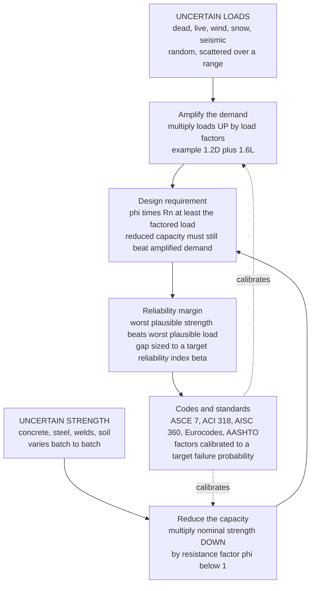

# 🏗️ Design Codes and Structural Safety

> [!abstract] TL;DR
> A structural engineer can **never know exactly** how heavy the crowd on a bridge will be, nor exactly how strong a given batch of concrete is — both are **random variables scattered over a range**, so designing to the *averages* would leave roughly half of all structures dangerously under-built. The profession's answer is disciplined pessimism on **both sides at once**: assume the loads are *heavier* than expected by multiplying them **up** with **load factors** (e.g. $1.2D + 1.6L$), and assume the material is *weaker* than expected by multiplying its nominal strength **down** with a **resistance factor** $\phi < 1$, then require the reduced capacity to still beat the amplified demand: $\phi R_n \ge \sum \gamma_i Q_i$. This is **LRFD / limit-state design** (Load and Resistance Factor Design), which replaced the older single-number **allowable-stress design** (keep stress below strength divided by one factor of safety). The factors are not guesses — they are **calibrated by structural-reliability theory** so that the probability of demand exceeding capacity meets a chosen target, expressed as a **reliability index** $\beta$ (typically $\beta \approx 3$ for buildings, a failure probability near $10^{-3}$). Design checks two families of **limit states**: **ultimate** (strength, collapse — *safety*) and **serviceability** (deflection, vibration, cracking — *function*). All of this is written into legally-binding **codes and standards** — ASCE 7 (loads), ACI 318 (concrete), AISC 360 (steel), the IBC and Eurocodes, AASHTO (bridges) — that distill probability theory, decades of experience, and the hard lessons of past **failures** into the exact factors every engineer applies. Understanding *why* those factors exist — not merely plugging them in — is the heart of responsible, safe engineering, backed by professional licensure, peer review, and the ethic that public safety is the engineer's paramount duty.

---

## Intuition

**Analogy — you can never know exactly how heavy the crowd will be, nor exactly how strong the concrete is, so you deliberately lose the argument on both sides.** Imagine you are asked to promise that a footbridge will hold a festival crowd. You do not know the true weight — a hundred people? four hundred? soaked in rain, all pressed to one rail? — and you do not know the true strength either, because the concrete that was poured cured on a cold day and its real strength could be anywhere in a spread around the number printed on the delivery ticket. Two clouds of uncertainty face each other: **how heavy the load might be**, and **how weak the structure might be**. Designing to the *middle* of each cloud — the average crowd against the average concrete — is a coin-flip, because the day the two clouds overlap is the day the bridge falls.

So you cheat, on purpose, toward safety. You **assume the load is worse than you expect** and multiply it up — plan for the heavier, denser, more improbable crowd. And you simultaneously **assume the material is weaker than you expect** and multiply its strength down — treat the concrete as if it came from the poor tail of the batch. Then you demand that even this deliberately-weakened structure still beats this deliberately-exaggerated load. The **gap you have left between the "worst plausible strength" and the "worst plausible load" is the safety margin** — the buffer that has to swallow everything you could not foresee. **Building codes are exactly this pessimism, written down and standardized** — the accumulated distillation of probability, experience, and centuries of failures, tuned so that every engineer's design, anywhere, carries the same reliable, agreed-upon buffer against the one outcome a structure must never reach: collapse.

---

## How It Works

### Core Mechanics

1. **Accept that both sides are random.** The **load effect** $Q$ (how heavy, how often, how combined) and the **resistance** $R$ (how strong the concrete, steel, weld, or soil actually is) are both random variables with real scatter, described by probability distributions rather than single numbers. Failure is not a certainty to avoid but a **probability to push acceptably low** — the event $R < Q$, where the two distributions overlap.

2. **Amplify the demand.** Multiply the nominal loads *up* by **load factors** $\gamma_i$ and add them in prescribed **load combinations** — e.g. $1.2D + 1.6L$. The *less* variable a load, the *smaller* its factor: dead load (weighable, steady) earns $1.2$; live and wind load (volatile) earn larger factors. This positions the design against a load well out in the unfavourable tail, not the average.

3. **Reduce the capacity.** Multiply the nominal member strength $R_n$ *down* by a **resistance factor** $\phi < 1$ (also called a strength-reduction factor). The factor reflects how reliably that failure mode can be predicted: a ductile tension yield in steel might get $\phi = 0.90$, while a brittle, scatter-prone shear or a slender column gets a lower $\phi$. This treats the material as if it came from the weak tail of its batch.

4. **Require reduced capacity to beat amplified demand.** The single governing inequality of limit-state design is $\phi R_n \ge \sum_i \gamma_i Q_i$ — the deliberately-weakened strength must still exceed the deliberately-exaggerated load. The distance between the two is the engineered **safety margin**.

5. **Calibrate the factors with reliability theory.** The factors $\gamma_i$ and $\phi$ are not chosen by feel. Given the means and variabilities of $R$ and $Q$, structural-reliability theory computes a **reliability index** $\beta$ (how many standard deviations of margin separate strength from load) and the associated **failure probability** $P_f = \Phi(-\beta)$. Code committees pick factors so that a wide range of designs all land near a **target** $\beta$ — a chosen, consistent, society-accepted risk level.

6. **Check two families of limit states.** **Ultimate (strength) limit states** guard against collapse — yielding, buckling, fracture, overturning — using factored loads; a breach here can kill. **Serviceability limit states** guard against loss of function — excessive deflection, vibration, cracking — using unfactored service loads; a breach here merely annoys or damages. A member must pass both.

7. **Write it into codes, and let failures tighten them.** All of the above is codified into legally-binding **standards** (ASCE 7, ACI 318, AISC 360, IBC, Eurocodes, AASHTO). Each is a **learning system**: every major collapse is investigated and its lesson folded back into the factors, detailing rules, and review requirements — so the code you use today already contains the scar tissue of past disasters.

### Flow / Architecture



---

## Key Concepts

### Secondary Level

- **A code is a rulebook for not falling down.** A **building code** is the collection of legally-binding rules that say how strong a structure must be, what loads to design for, and how to detail it. No engineer re-derives safety from scratch — they build on rules the whole profession agreed on, written down and enforced.
- **Two things are always uncertain: the load and the strength.** You cannot know *exactly* how many people will crowd a floor, or *exactly* how strong one truckload of concrete is. Both wander over a range. Because of that, designing for the *average* is not safe.
- **Safety = deliberately being pessimistic on both sides.** Engineers assume the **load is heavier** than expected and the **material is weaker** than expected, then check that the weakened structure still beats the heavier load. The leftover gap is the **safety margin** — the cushion for everything unknown.
- **The factor of safety is that cushion, chosen on purpose.** It is not a mistake or waste; it is the intended buffer. Too small and things collapse; too large and the structure is impossibly heavy and expensive. Codes fix a sensible amount.
- **Codes are written in blood.** Many rules exist because a bridge, walkway, or building once failed and killed people. Each disaster is investigated, and the lesson becomes a new rule so it cannot happen the same way again.

### Undergraduate Level

- **Allowable-Stress Design (ASD), the old way.** Keep the working stress below the material strength divided by a single **factor of safety** $N$: $\sigma_{applied} \le \sigma_{limit}/N$ (equivalently $R_n/\Omega \ge \sum Q_i$ with a safety factor $\Omega$). One lump number absorbs *all* uncertainty — in loads, materials, geometry, and analysis — which is simple but crude, because a volatile load and a steady one are treated identically.
- **Load and Resistance Factor Design (LRFD) / limit-state design, the modern way.** Put the uncertainty where it actually lives. Amplify each load by its own **load factor** $\gamma_i$ and reduce the nominal strength by a **resistance factor** $\phi$: $\phi R_n \ge \sum_i \gamma_i Q_i$. Because dead load is more predictable than live or wind load, it gets a smaller $\gamma$ — a resolution ASD cannot express.
- **Representative factors.** ASCE 7 strength combinations include $1.4D$ and $1.2D + 1.6L + 0.5(L_r\ \text{or}\ S)$, plus wind and seismic cases; the $0.9D + 1.0W$ / $0.9D + 1.0E$ combinations check **uplift and overturning**, where *light* dead load is the dangerous case. Resistance factors run roughly $\phi = 0.90$ for steel tension yielding, $0.75$ for shear/rupture, $0.90$ for concrete flexure, and $0.65$–$0.75$ for concrete columns and shear.
- **Limit states — strength vs. serviceability.** **Ultimate limit states** concern *collapse* (strength, stability, fracture) and use **factored** loads with a large margin. **Serviceability limit states** concern *function* (deflection $\le L/360$, floor vibration, crack widths) and use **unfactored service** loads with a much smaller margin, because the consequence is discomfort, not death. A beam can be strong yet fail serviceability by visibly sagging.
- **The major codes and who owns what.** **ASCE 7** — loads and load combinations; **ACI 318** — reinforced/prestressed concrete; **AISC 360** — structural steel; **the IBC** — the umbrella U.S. building code that adopts the others by reference; **the Eurocodes (EN 1990–1999)** — the European family, with EN 1990 setting the reliability basis; **AASHTO LRFD** — highway bridges; **NDS** — timber; **TMS 402** — masonry. Their roles: set a **minimum** acceptable safety, enforce **consistency** across engineers, and create **accountability** (a signed, code-compliant design is a legal standard of care).
- **Why calibration matters.** The load and resistance factors were reverse-engineered so that thousands of different designs all achieve about the same reliability. That is why you may *apply* $1.2D + 1.6L$ and $\phi = 0.9$ without re-deriving them — but the numbers encode a probability target, not a tradition.

### Graduate Level

- **The reliability problem.** Model resistance $R$ and load effect $Q$ as random variables. Failure is the event $R < Q$; the **probability of failure** is $P_f = P(R - Q < 0)$. Define the **safety margin** $M = R - Q$. If $R$ and $Q$ are normal, $M$ is normal with mean $\mu_M = \mu_R - \mu_Q$ and standard deviation $\sigma_M = \sqrt{\sigma_R^2 + \sigma_Q^2}$, and the **reliability index** is $\beta = \mu_M/\sigma_M$ — the number of standard deviations by which the mean margin exceeds zero — with $P_f = \Phi(-\beta)$.
- **Lognormal format and the split into factors.** In practice $R$ and $Q$ are better modelled as **lognormal** (non-negative, right-skewed). A first-order result gives $\beta \approx \dfrac{\ln(\mu_R/\mu_Q)}{\sqrt{V_R^2 + V_Q^2}}$, where $V$ is the coefficient of variation. Splitting the required separation into a resistance factor and load factors — $\phi = (\mu_R/R_n)\exp(-\alpha_R \beta V_R)$ and $\gamma_i = (\mu_{Q_i}/Q_{n_i})\exp(+\alpha_Q \beta V_{Q_i})$ with sensitivity coefficients $\alpha$ — is exactly how ASCE 7 / AISC factors were derived. Each factor carries the **bias** (mean-to-nominal ratio) and **variability** of its own quantity.
- **FOSM and FORM.** When the limit-state function $g(\mathbf{X}) = R - Q$ is nonlinear or the variables non-normal, **First-Order Second-Moment (FOSM)** and the more accurate **First-Order Reliability Method (FORM)** transform variables to standard-normal space and find the **design point** (most-probable-failure point) at distance $\beta$ from the origin; the **Hasofer–Lind** $\beta$ is invariant to how the limit state is written. Monte-Carlo simulation checks these approximations.
- **Target reliabilities.** Codes are calibrated to consequence-dependent targets: roughly **$\beta \approx 3.0$** for ordinary building members under gravity load (annual $P_f \sim 10^{-3}$), **$\beta \approx 3.5$–$4.0$** for connections and brittle modes (less warning, so more margin), and much higher for nuclear, offshore, and dams. The landmark calibration is **Ellingwood, Galambos, MacGregor & Cornell (NBS, 1980)**, which set the probability basis for U.S. LRFD; EN 1990 uses target $\beta \approx 3.8$ at the ultimate limit state over a 50-year reference period.
- **System reliability, redundancy, and robustness.** Member reliability is not structural reliability. A **series** system (weakest-link — a statically determinate truss) fails when any element fails; a **parallel/redundant** system reroutes load through **alternate paths**. **Progressive collapse** (Ronan Point 1968; Murrah Building 1995) occurs when a local failure has nowhere to redistribute; modern codes counter it with **tie forces, alternate-path analysis, and key-element** design — engineering *robustness*, the insensitivity of the whole to local damage, separately from member strength.
- **What the factors do *not* cover: gross human error.** Reliability calibration addresses *natural* variability, not blunders — a misread drawing, an omitted load path, a bad weld, an unchecked assumption. These **gross errors** dominate real collapses and are controlled not by bigger factors but by **process**: independent **checking and peer review**, **quality control** of materials and construction, **professional licensure (PE)** with legal accountability, and a professional ethic that places **public safety** above cost or schedule. The code delivers a reliable structure only inside a culture of competence and honesty.

---

## Python Demo

```python
# ============================================================================
# Reliability-based structural safety: why codes factor loads UP and strength DOWN.
#
#   (a) LOAD vs RESISTANCE DISTRIBUTIONS
#       The load effect Q and the resistance R are BOTH random. Their OVERLAP is
#       the probability of failure P(R < Q). LRFD positions the design by amplifying
#       the nominal load (gamma * Qn) and reducing the nominal strength (phi * Rn),
#       pushing the overlap below a target -> reliability index beta.
#
#   (b) FACTOR OF SAFETY vs RELIABILITY
#       Increasing separation (bigger central factor of safety) OR reducing
#       variability (lower coefficient of variation) both shrink the failure
#       probability. FS alone does not fix safety -- variability does too.
#
# Requires: numpy, matplotlib  (normal CDF via math.erfc; no scipy)
import numpy as np
import matplotlib.pyplot as plt
import math

# Standard-normal CDF, vectorised over numpy arrays (no scipy needed)
def Phi(z):
    z = np.asarray(z, dtype=float)
    return 0.5 * np.vectorize(math.erfc)(-z / math.sqrt(2.0))

# ---------------------------------------------------------------------------
# (a) Load effect Q and resistance R as random variables  ->  overlap = Pf
# ---------------------------------------------------------------------------
Qn   = 100.0          # nominal load effect  (code value)          [kN]
gamma = 1.5           # effective (combined) load factor
phi   = 0.90          # resistance factor  (phi < 1)

# LRFD sizes the member at the limit:  phi * Rn = gamma * Qn
Rn = gamma * Qn / phi                       # nominal resistance required [kN]

# Bias (mean/nominal) and coefficient of variation of each variable
bias_Q, V_Q = 1.00, 0.18                    # load: mean ~ nominal, fairly variable
bias_R, V_R = 1.10, 0.12                    # strength: mean above nominal, less variable

mu_Q, sd_Q = bias_Q * Qn, V_Q * bias_Q * Qn
mu_R, sd_R = bias_R * Rn, V_R * bias_R * Rn

# Safety margin M = R - Q  (normal approximation)
mu_M = mu_R - mu_Q
sd_M = math.sqrt(sd_R**2 + sd_Q**2)
beta = mu_M / sd_M                          # reliability index
Pf   = float(Phi(-beta))                    # probability of failure P(M < 0)
FS_c = mu_R / mu_Q                           # central factor of safety

print("=== (a) Load vs Resistance -- the reliability margin ===")
print(f"  nominal load  Qn = {Qn:6.1f} kN   ->  factored demand  gamma*Qn = {gamma*Qn:6.1f} kN")
print(f"  nominal strength Rn = {Rn:6.1f} kN ->  design capacity  phi*Rn  = {phi*Rn:6.1f} kN")
print(f"  mean load  mu_Q  = {mu_Q:6.1f} kN  (COV {V_Q:.2f})")
print(f"  mean strength mu_R = {mu_R:6.1f} kN (COV {V_R:.2f})")
print(f"  central factor of safety FS = mu_R/mu_Q = {FS_c:5.2f}")
print(f"  reliability index beta      = {beta:5.2f}")
print(f"  probability of failure  Pf  = {Pf:.2e}  (target ~1e-3, beta~3)")

def gauss(x, mu, sd):
    return np.exp(-0.5 * ((x - mu) / sd) ** 2) / (sd * math.sqrt(2 * math.pi))

x  = np.linspace(0, 300, 1200)
fQ = gauss(x, mu_Q, sd_Q)
fR = gauss(x, mu_R, sd_R)

# ---------------------------------------------------------------------------
# (b) Pf and beta vs central factor of safety, for two variability levels
# ---------------------------------------------------------------------------
FS_grid = np.linspace(1.0, 3.0, 400)        # sweep mean strength / mean load
Vtot_lo = math.sqrt(0.08**2 + 0.12**2)      # low-variability structure
Vtot_hi = math.sqrt(0.18**2 + 0.25**2)      # high-variability structure

def beta_lognormal(FS, Vtot):
    # first-order lognormal reliability index: ln(FS) / sqrt(VR^2 + VQ^2)
    return np.log(FS) / Vtot

beta_lo = beta_lognormal(FS_grid, Vtot_lo)
beta_hi = beta_lognormal(FS_grid, Vtot_hi)
Pf_lo, Pf_hi = Phi(-beta_lo), Phi(-beta_hi)

# ---------------------------------------------------------------------------
# PLOTS
# ---------------------------------------------------------------------------
fig, ax = plt.subplots(1, 3, figsize=(16.5, 5.4))
fig.suptitle("Reliability-Based Structural Safety: factor loads UP, strength DOWN",
             fontsize=14, fontweight="bold")

# --- (a) load vs resistance distributions with LRFD factor positions ---
a0 = ax[0]
a0.plot(x, fQ, color="#1f77b4", lw=2.2, label="LOAD effect Q")
a0.fill_between(x, fQ, color="#1f77b4", alpha=0.12)
a0.plot(x, fR, color="#2ca02c", lw=2.2, label="RESISTANCE R")
a0.fill_between(x, fR, color="#2ca02c", alpha=0.12)
a0.fill_between(x, np.minimum(fQ, fR), color="#d62728", alpha=0.65,
                label="overlap = P(R < Q)")
# LRFD anchor points
a0.axvline(Qn,        color="#1f77b4", ls=":",  lw=1.3)
a0.axvline(gamma*Qn,  color="#1f77b4", ls="--", lw=1.6)
a0.axvline(phi*Rn,    color="#2ca02c", ls="--", lw=1.6)
a0.axvline(Rn,        color="#2ca02c", ls=":",  lw=1.3)
ytop = max(fQ.max(), fR.max())
a0.annotate("nominal Qn", xy=(Qn, ytop*0.05), rotation=90, fontsize=7, color="#1f77b4", va="bottom")
a0.annotate("gamma*Qn",   xy=(gamma*Qn, ytop*0.62), rotation=90, fontsize=7, color="#1f77b4", va="bottom")
a0.annotate("phi*Rn",     xy=(phi*Rn, ytop*0.62), rotation=90, fontsize=7, color="#2ca02c", va="bottom")
a0.annotate("nominal Rn", xy=(Rn, ytop*0.05), rotation=90, fontsize=7, color="#2ca02c", va="bottom")
a0.annotate("", xy=(mu_R, ytop*0.92), xytext=(mu_Q, ytop*0.92),
            arrowprops=dict(arrowstyle="<->", color="k", lw=1.4))
a0.text((mu_Q+mu_R)/2, ytop*0.96, "safety margin", ha="center", fontsize=8, fontweight="bold")
a0.text(0.03, 0.97, f"FS = {FS_c:.2f}\nbeta = {beta:.2f}\nPf = {Pf:.1e}",
        transform=a0.transAxes, va="top", fontsize=8.5,
        bbox=dict(boxstyle="round", fc="#fff7e6", ec="gray"))
a0.set_xlabel("force  [kN]"); a0.set_ylabel("probability density")
a0.set_title("(a) Load vs Resistance\nLRFD pushes the overlap below target")
a0.legend(loc="upper right", fontsize=7.5); a0.grid(alpha=0.3)

# --- (b) failure probability vs factor of safety (log scale) ---
a1 = ax[1]
a1.semilogy(FS_grid, Pf_hi, color="#d62728", lw=2.3, label=f"high variability (Vtot={Vtot_hi:.2f})")
a1.semilogy(FS_grid, Pf_lo, color="#2ca02c", lw=2.3, label=f"low variability (Vtot={Vtot_lo:.2f})")
a1.axhline(1e-3, color="k", ls="--", lw=1.2)
a1.text(1.02, 1.3e-3, "target Pf ~ 1e-3", fontsize=8)
a1.scatter([FS_c], [Pf], color="k", zorder=5)
a1.annotate("panel (a) design", xy=(FS_c, Pf), xytext=(FS_c+0.15, Pf*30),
            fontsize=8, arrowprops=dict(arrowstyle="->"))
a1.set_xlabel("central factor of safety  FS = mu_R / mu_Q")
a1.set_ylabel("probability of failure  Pf")
a1.set_title("(b) Factor of safety is not enough\nvariability sets the risk too")
a1.legend(loc="upper right", fontsize=8); a1.grid(alpha=0.3, which="both")
a1.set_ylim(1e-8, 1)

# --- (c) reliability index vs factor of safety ---
a2 = ax[2]
a2.plot(FS_grid, beta_hi, color="#d62728", lw=2.3, label="high variability")
a2.plot(FS_grid, beta_lo, color="#2ca02c", lw=2.3, label="low variability")
a2.axhline(3.0, color="k", ls="--", lw=1.2); a2.text(1.02, 3.08, "target beta = 3", fontsize=8)
a2.scatter([FS_c], [beta], color="k", zorder=5)
a2.set_xlabel("central factor of safety  FS")
a2.set_ylabel("reliability index  beta")
a2.set_title("(c) Same FS, different safety\nlow scatter reaches target at smaller FS")
a2.legend(loc="lower right", fontsize=8); a2.grid(alpha=0.3); a2.set_ylim(0, 6)

plt.tight_layout(rect=[0, 0, 1, 0.93])
plt.savefig("design_codes_and_structural_safety.png", dpi=150)
# Expected: FS ~ 1.83, beta ~ 2.9, Pf ~ 1.7e-3 -- right at the code target.
```

Running it prints the LRFD anchor points — the **nominal** load $Q_n = 100$ kN amplified to a factored demand $\gamma Q_n = 150$ kN, and the **nominal** strength $R_n \approx 167$ kN reduced to a design capacity $\phi R_n = 150$ kN (the design sits exactly at the limit) — and reports a central factor of safety of about $1.83$, a **reliability index** $\beta \approx 2.9$, and a **failure probability** $P_f \approx 1.7\times10^{-3}$, right at the code target. **Panel (a)** shows the two random clouds and the red **overlap** that is the probability of failure, with the load and resistance factors positioning the design so that overlap is tiny. **Panels (b) and (c)** deliver the graduate-level punchline: for the *same* central factor of safety, a **low-variability** structure is far safer than a **high-variability** one — increasing the factor of safety *and* reducing scatter both drive $P_f$ down. Safety is a property of the **whole distribution**, not of a single average number, which is exactly why LRFD factors uncertainty explicitly instead of hiding it in one lump factor of safety.

---

## Real-World Applications

> **Example:** The **AISC 360 Steel Construction Manual** and **ACI 318 (Building Code Requirements for Structural Concrete)** are where this framework becomes the daily arithmetic of every practicing structural engineer in North America. To size a steel beam, the engineer draws the factored demand from **ASCE 7** load combinations (e.g. $1.2D + 1.6L$), computes the nominal flexural strength $M_n$ from AISC 360, multiplies it by the resistance factor $\phi_b = 0.90$, and checks $\phi_b M_n \ge M_u$ — the exact $\phi R_n \ge \sum\gamma_i Q_i$ inequality above. Those specific numbers, $1.2$ and $1.6$ and $0.90$, are not arbitrary: they come straight from the **Ellingwood–Galambos NBS (1980)** reliability calibration that targeted $\beta \approx 3.0$. The engineer applies them in seconds, but they encode a probability of failure the whole profession agreed to accept.

- **ASCE 7 — loads and combinations.** The master loads standard: dead, live, snow, wind, seismic, flood, and their factored combinations, with wind and seismic maps calibrated to chosen return periods. Every U.S. structural code pulls its demand side from ASCE 7.
- **AASHTO LRFD Bridge Design Specifications.** Highway bridges use the **HL-93** design truck-plus-lane live load, LRFD load and resistance factors, and explicit reliability calibration ($\beta \approx 3.5$ for bridge members), plus load-rating of existing spans to decide what real trucks may cross.
- **Eurocodes (EN 1990–EN 1999).** The European family, with **EN 1990** setting the reliability basis (partial factors $\gamma_G$, $\gamma_Q$; target $\beta \approx 3.8$ over 50 years) and material codes for concrete, steel, timber, and masonry — the same limit-state philosophy in a partial-factor dialect.
- **Nuclear, offshore, and dams — higher targets.** Safety-critical structures use larger target reliabilities and additional deterministic checks; an offshore platform or containment vessel is calibrated to a far smaller $P_f$ than an ordinary office floor because the consequence of failure is catastrophic.
- **Codes as a learning system — failures that rewrote the rules.** **Ronan Point (1968)** produced disproportionate-collapse / tie-force provisions; the **Hyatt Regency walkway (1981)** sharpened connection-design and independent-checking requirements; the **1994 Northridge** earthquake's fractured welded moment connections led to the **FEMA-350 / SAC** reforms of steel seismic detailing; **Tacoma Narrows (1940)** forced aeroelastic wind checks into bridge design. Each disaster tightened the factors, the detailing, or the review process.

---

## Common Pitfalls

- **Treating the factors as arbitrary fudge (or as unbreakable magic).** The load and resistance factors are *calibrated* to a target reliability, not invented and not sacred. Engineers who see them as a mysterious "1.6" to plug in cannot judge when a design is *outside* the calibration basis — an unusual load with different variability, a brittle mode, a novel material — where the standard factors no longer deliver the intended $\beta$.
- **Applying a code without understanding *why*.** Codes are minimum, prescriptive, and general; they cannot foresee every configuration. Blind rule-following breaks down exactly where judgment is needed — unusual geometry, load reversals, construction-stage conditions, or interactions the code never contemplated. The factors protect against *scatter*, not against a misconceived structural scheme.
- **Designing to averages / deterministic thinking.** Using mean loads against mean strengths (or a single "typical" concrete strength) ignores the overlap of the two distributions and roughly *halves* the intended safety. Safety lives in the tails, which is the whole point of factoring up and down.
- **Confusing serviceability with strength.** Checking deflection or vibration with *factored* loads (over-conservative and wasteful), or checking strength with *service* loads (dangerously under-designed), is a common mix-up. Ultimate limit states use factored loads and big margins; serviceability uses service loads and small margins — different consequences, different checks.
- **Believing factors cover human error.** Reliability calibration addresses natural variability, **not blunders** — a dropped load path, a misread drawing, a bad weld, an unchecked spreadsheet. These gross errors cause most real collapses and are controlled by **checking, peer review, and QA/QC**, not by a bigger $\phi$ or $\gamma$. A perfectly code-compliant number applied to the wrong model is still wrong.
- **Extrapolating a code beyond its scope.** ACI 318, AISC 360, and ASCE 7 were calibrated for ordinary buildings and materials in a given range. Stretching them to very high-strength concrete, extreme spans, blast, fire, or fatigue-critical details without the governing specialty provisions silently voids the reliability basis.
- **Mistaking "code minimum" for "optimal" or "safe enough forever."** The code sets a floor, not a ceiling; important or vulnerable structures often warrant more. And codes evolve — a structure legal when built may not meet current provisions after a code update triggered by a new failure lesson, which is where assessment and retrofit come in.

---

## Related Concepts

**Probability and statistics foundations (Mathematics vault)**
- [[Random_Variables]] — loads $Q$ and resistances $R$ are random variables; means, variances, and coefficients of variation are the raw ingredients of every load and resistance factor.
- [[Common_Probability_Distributions]] — the normal and (more realistically) lognormal distributions used to model load effects and material strengths, and to compute the failure probability from the tail overlap.
- [[Statistical_Inference]] — how material test data (concrete cylinders, steel coupons) become the characteristic strengths and variabilities that codes are calibrated against.

**Reliability and safety in other engineering domains**
- [[Fatigue_and_Damage_Tolerance]] — aerospace's parallel reliability discipline: safe-life vs. damage-tolerant design under uncertain crack growth, with far smaller safety factors because weight is precious — the airborne cousin of civil limit-state design.
- [[Process_Safety_and_Hazard_Analysis]] — chemical engineering's risk framework (HAZOP, LOPA, tolerable failure frequencies); the same idea of pushing a failure probability below a society-accepted target, in a different industry.

**Professional responsibility**
- [[Business_Ethics]] — the professional-duty and public-trust dimension behind licensure, checking, and the engineer's paramount obligation to public safety that the codes institutionalize.

*Within this Civil Engineering vault (siblings, prose-only): Structural_Loads_and_Load_Paths quantifies the demand side (dead, live, environmental loads and the combinations this note factors); Reinforced_Concrete_Design and Structural_Steel_Design apply these load and resistance factors to proportion real members from ACI 318 and AISC 360; Earthquake_Engineering_and_Seismic_Design develops the seismic limit states and ductile detailing that a probabilistic hazard makes necessary; and Infrastructure_Resilience_and_Asset_Management extends the reliability idea from a single structure to systems that must absorb shocks and recover over their whole life.*

---

## Review Questions

**Secondary**
1. An engineer must promise a footbridge will hold a festival crowd, but cannot know exactly how heavy the crowd will be or exactly how strong the concrete is. Explain, in plain words, the two-sided "deliberate pessimism" the engineer uses to guarantee safety, and say what the **safety margin** is. Then give one reason building codes exist rather than letting each engineer decide on their own.

**Undergraduate**
2. A steel tension member carries a dead load effect $D = 120$ kN and a live load effect $L = 180$ kN, and has a nominal resistance $R_n = 620$ kN with resistance factor $\phi = 0.90$. (a) Using the ASCE 7 combination $1.2D + 1.6L$, compute the factored demand and check whether $\phi R_n \ge \sum\gamma_i Q_i$ is satisfied. (b) Explain why the live load carries a *larger* factor than the dead load. (c) State the difference between this **ultimate** (strength) check and a **serviceability** deflection check, including which loads (factored or service) each uses and why the margins differ.

**Graduate**
3. Two designs have the *same* central factor of safety $FS = \mu_R/\mu_Q = 1.8$, but design A has combined variability $V_{tot} = 0.15$ and design B has $V_{tot} = 0.30$. (a) Using $\beta \approx \ln(FS)/V_{tot}$, compute the reliability index and approximate failure probability of each, and explain why the single "factor of safety" is an incomplete measure of safety. (b) A code committee wants both to reach a target $\beta = 3.0$; qualitatively, what must change for design B? (c) Reliability calibration targets *natural variability* — argue why the dominant cause of real structural collapses (gross human error) is **not** addressed by any choice of $\gamma$ or $\phi$, and what mechanisms the profession uses instead.

---

## Sources

- ASCE/SEI 7 — *Minimum Design Loads and Associated Criteria for Buildings and Other Structures* (American Society of Civil Engineers)
- A. S. Nowak & K. R. Collins — *Reliability of Structures*, 2nd ed. (CRC Press, 2012)
- B. Ellingwood, T. V. Galambos, J. G. MacGregor & C. A. Cornell — *Development of a Probability Based Load Criterion for American National Standard A58*, NBS Special Publication 577 (National Bureau of Standards, 1980)
- R. E. Melchers & A. T. Beck — *Structural Reliability Analysis and Prediction*, 3rd ed. (Wiley, 2018)
- ACI Committee 318 — *Building Code Requirements for Structural Concrete (ACI 318)* and ANSI/AISC 360, *Specification for Structural Steel Buildings*

---

#civil-engineering #design-codes #LRFD #structural-reliability #factor-of-safety
