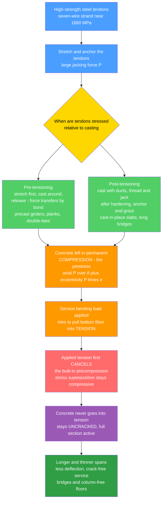

# 🌉 Prestressed Concrete

> [!abstract] TL;DR
> Concrete is strong in compression but **weak in tension** — it cracks. Ordinary reinforced concrete *lets* the tension zone crack and hands the tension over to steel rebar. **Prestressed concrete refuses to crack in the first place**: high-strength steel **tendons** are stretched tight and anchored, squeezing the concrete into a permanent internal **compression** *before* any service load arrives. Now when bending tries to pull the bottom fibre into tension, it must first **cancel that built-in precompression** — so the concrete stays crack-free and the *whole* cross-section works, not just the uncracked top. The design tool is **stress superposition**: the prestress axial stress, the prestress eccentricity moment, and the applied load moment must sum to stresses that stay compressive (no tension) yet below the crushing limit. Tendons are installed by **pre-tensioning** (stretched first, concrete cast around them, then released — precast girders and planks) or **post-tensioning** (concrete cast with ducts, tendons jacked and anchored after it hardens — cast-in-place slabs and long bridges). Choosing the prestress so the tendon's upward push cancels the load is **load balancing** — a floor that barely deflects. The catch is **prestress losses** (elastic shortening, creep, shrinkage, relaxation, friction, anchorage) that must be estimated up front. This is the technology behind slender long-span bridges, column-free floors, and water tanks — engineering *against a material's own weakness*.

---

## Intuition

**Analogy first.** Imagine carrying a whole row of loose books horizontally with no tray underneath. Grab the two end books and **squeeze inward as hard as you can**. Suddenly the row becomes a rigid beam you can lift and carry across the room — none of the books in the middle fall out, even though nothing holds them from below. Your squeeze presses every book against its neighbours so hard that even the books at the bottom of the row can never be pulled apart. Relax the squeeze and the whole thing collapses into a heap.

Prestressed concrete does *exactly this* to a beam. Before any load is applied, stretched steel tendons squeeze the concrete into permanent **compression**. When a bending load later tries to pull the bottom of the beam into **tension** — the one thing concrete cannot survive — it first has to overcome that built-in squeeze. As long as the load is not big enough to fully cancel the precompression, the concrete **never actually goes into tension, and never cracks**. It is like pre-loading the structure against its own weakness. Because the whole section stays intact and working (not a cracked half-section), the beam can span far longer and be far thinner than ordinary reinforced concrete — the secret behind sleek long-span bridges and column-free floors.

---

## How It Works

### Core Mechanics

1. **Start from the weakness.** Concrete's compressive strength (say 40 MPa) is roughly ten times its tensile strength (~4 MPa). Under bending, one face goes into tension and cracks at a tiny fraction of the section's compressive capacity. Ordinary **reinforced concrete** accepts these cracks and lets embedded rebar carry the tension across them.
2. **Pre-compress instead.** Stretch high-strength steel **tendons** (seven-wire strand, ~1860 MPa ultimate) to a large force, anchor them against the concrete, and the concrete is left in permanent **compression** — the *prestress*. This happens before the beam ever carries traffic, furniture, or water.
3. **Superpose the stresses.** At any fibre the net stress is the sum of three linear effects: (i) the **axial** precompression $-P/A$ from the tendon force $P$; (ii) the **eccentricity moment** $P e$ from placing the tendon a distance $e$ below the centroid (this *adds* compression at the bottom where load will pull); and (iii) the **applied-load moment** $M$ that tries to put the bottom into tension. Design requires the sum to stay **compressive at every fibre** (no cracking) and **below the crushing limit** (no over-compression).
4. **Cancel, don't crack.** Under full service load the applied moment merely *reduces* the bottom-fibre precompression toward (but not past) zero. The concrete works over its **entire depth**, so the section is far more efficient and much stiffer than a cracked reinforced section.
5. **Two ways to install the tendons.** **Pre-tensioning:** stretch the strands between abutments, cast concrete around them, and *release* after it hardens — the strands try to shorten and, held by **bond**, drag the concrete into compression (precast hollow-core planks, double-tees, bridge girders). **Post-tensioning:** cast the concrete with hollow **ducts**, thread the tendons *after* it hardens, **jack** them against the finished member, then **anchor and grout** (cast-in-place slabs, long segmental bridges, draped profiles).
6. **Drape the tendon and balance the load.** By curving the tendon to follow the bending-moment diagram (a **draped** parabolic profile, low at midspan, high over supports), its curvature exerts a distributed **upward** force on the concrete. Size the prestress so that upward force cancels the downward service load — **load balancing** — and the member barely deflects at all.
7. **Account for losses.** The prestress force is *not* constant. It drops from **elastic shortening** (concrete squashes as the force transfers), long-term **creep** and **shrinkage** of the concrete, **relaxation** of the highly stressed steel, and — in post-tensioning — **friction** along the duct and **anchorage seating**. Total losses of 15–25% must be estimated so the *effective* prestress still keeps the section crack-free.

### Flow / Architecture



---

## Key Concepts

### Secondary Level

- **Concrete hates being pulled.** It is superb at being squeezed (compression) but cracks easily when stretched (tension). Every crack in a plain concrete beam is a tension crack on its underside.
- **Squeeze it first.** If you squeeze the concrete hard *before* loading it — the way squeezing a row of books lets you carry them — then a load that tries to stretch the bottom must first *undo* your squeeze. Do it right and the concrete is never actually stretched, so it never cracks.
- **Stretched steel does the squeezing.** Very strong steel cables (**tendons**) are pulled tight and anchored to the ends of the beam; their pull leaves the concrete permanently compressed.
- **That is why bridges look so slim.** Because the whole beam stays solid and crack-free, prestressed beams can be much **longer and thinner** than ordinary ones — think of the graceful, slender spans of a modern highway overpass or a column-free parking floor.

### Undergraduate Level

- **Stress superposition (the core design check).** For a section of area $A$, second moment $I$, and extreme-fibre distances $c_t$ (top) and $c_b$ (bottom), with prestress force $P$ at eccentricity $e$ below the centroid and applied sagging moment $M$, the fibre stresses (tension positive) are:
  $$\sigma_{top} = -\frac{P}{A} + \frac{P e\, c_t}{I} - \frac{M c_t}{I}, \qquad \sigma_{bot} = -\frac{P}{A} - \frac{P e\, c_b}{I} + \frac{M c_b}{I}.$$
  Design demands $\sigma \le 0$ everywhere at service (no tension → no cracking) *and* $|\sigma|$ below the allowable compression.
- **Eccentricity is deliberate.** Placing the tendon **below** the centroid deepens the bottom-fibre precompression exactly where the applied load will try to open a crack — free extra protection at the fibre that needs it.
- **Two service load stages.** Check **at transfer** (prestress large, only self-weight resisting it — watch for *top-fibre tension* and bottom over-compression) *and* **at service** (full load, reduced prestress after losses — watch for *bottom-fibre tension*). A section can pass one and fail the other.
- **Pre- vs post-tensioning.** Pre-tensioning transfers force by **bond** between strand and concrete (factory-cast, straight or lightly deflected strands). Post-tensioning uses mechanical **anchorages** and can follow smooth **draped** profiles cast in ducts — ideal on site and for long spans.
- **Load balancing.** A parabolic tendon with drape $a$ (sag between end and midspan) over a span $L$ pushes up with an equivalent uniform load $w_p = 8 P a / L^2$. Choose $P$ and $a$ so $w_p \approx w$ (the service load) and the member is nearly **deflection-free** — a remarkably clean design idea.
- **Camber.** Before service load, the prestress bows the beam **upward** (camber). Under load it deflects down; the net is small. Getting camber wrong causes uneven floors and ponding on roofs.
- **High-strength materials are essential.** Because losses eat 15–25% of the initial pull, the steel must start at very high stress (hence ~1860 MPa strand, not ordinary rebar); high-strength concrete resists the intense anchorage-zone compression.

### Graduate Level

- **Prestress losses in detail.** *Immediate:* elastic shortening (concrete strains as force transfers), friction (curvature + wobble along a post-tensioned duct, $P(x) = P_0 e^{-(\mu\theta + kx)}$), and anchorage seat/draw-in. *Time-dependent:* concrete **creep** (stress-driven, long-term, the dominant loss), **shrinkage** (drying, load-independent), and steel **relaxation**. Modern practice uses time-step or code-calibrated lump-sum methods; underestimating creep is a classic cause of excessive long-term deflection.
- **Full vs partial prestressing.** *Full* prestressing forbids any tension at service; *partial* prestressing permits limited, controlled cracking and combines tendons with ordinary rebar — often more economical and with better ductility and crack control than full prestress.
- **Ultimate limit state.** Serviceability governs the *elastic* stress checks, but strength is a separate calculation: at ultimate, the section behaves like a flexural member with the tendon force approaching $f_{ps}$, and $M_n = A_{ps} f_{ps}(d_p - a/2)$. **Bonded** tendons develop strain compatibility locally; **unbonded** tendons develop a member-average strain, lowering $f_{ps}$ and demanding minimum bonded rebar for crack control.
- **Anchorage-zone and end-block design.** Post-tensioned anchorages introduce enormous concentrated forces; **bursting** and **spalling** stresses require dedicated reinforcement, designed by strut-and-tie or the classical Guyon/symmetric-prism approach.
- **Secondary (parasitic) moments.** In *continuous* prestressed members the supports restrain the prestress-induced camber, generating **secondary moments** that shift the effective tendon line (the "concordancy" and linear-transformation theorems). These must be added to primary prestress moments — a subtlety absent in simple spans.
- **Statically determinate concept via load balancing.** Treating the draped tendon as a set of **equivalent loads** (upward along the drape, downward point forces at anchorages, axial precompression) reduces a prestressed analysis to an ordinary elastic analysis under those equivalent loads — the elegant Lin load-balancing method.
- **Time-dependent deflection.** Because both camber (from sustained prestress) and load deflection grow with creep, long-term deflection is a two-sided creep problem; long-span PT floors are notorious for hard-to-predict long-term movement.

---

## Python Demo

```python
# Prestressed Concrete -- why the beam never cracks, and how load balancing works
#   (a) STRESS SUPERPOSITION across the section depth:
#         prestress axial (-P/A) + prestress eccentricity moment (P*e) + applied
#         load moment (M).  Their SUM must stay <= 0 (compression) at the bottom
#         fibre  -> no tension, no cracking.  (tension taken positive)
#   (b) PRESTRESS SWEEP: vary P and watch the top/bottom fibre stresses; shade the
#         admissible window (no bottom tension, no top over-compression) -> the
#         prestress must be "just right".
#   (c) LOAD BALANCING: a draped parabolic tendon pushes up with w_p = 8*P*a/L^2;
#         choose it to cancel the applied load w  -> a nearly deflection-free beam.
#   (d) CAMBER vs DEFLECTION: upward bow from prestress, downward sag under load,
#         and the small balanced net.
import numpy as np
import matplotlib.pyplot as plt

# ---------------------------------------------------------------
# Section + material (rectangular beam)   units: N, m, Pa
# ---------------------------------------------------------------
b, h = 0.30, 0.60                 # width, depth [m]
A   = b * h                       # area [m^2]
I   = b * h**3 / 12.0             # second moment [m^4]
c_t = c_b = h / 2.0               # extreme-fibre distances [m]
E   = 30.0e9                      # concrete modulus [Pa]
L   = 12.0                        # span [m]

P0  = 1800.0e3                    # effective prestress force [N]  (after losses)
e   = 0.20                        # tendon eccentricity below centroid [m]

# service load (self-weight + superimposed), kN/m -> N/m
w   = 24.0e3
M   = w * L**2 / 8.0              # midspan sagging moment [N*m]

def fibre_stresses(P, Mapp):
    """Return (sigma_top, sigma_bottom) in MPa, tension positive."""
    s_top = (-P/A + P*e*c_t/I - Mapp*c_t/I) / 1e6
    s_bot = (-P/A - P*e*c_b/I + Mapp*c_b/I) / 1e6
    return s_top, s_bot

# ---------------------------------------------------------------
# (a) Stress distribution through the depth (y from centroid, up = +)
# ---------------------------------------------------------------
y = np.linspace(-c_b, c_t, 200)
sig_axial = np.full_like(y, -P0/A) / 1e6                 # uniform compression
sig_ecc   = (P0*e*y/I) / 1e6                             # linear, tension at top
sig_load  = (-M*y/I) / 1e6                               # linear, tension at bottom
sig_sum   = sig_axial + sig_ecc + sig_load

st, sb = fibre_stresses(P0, M)
print(f"(a) Service fibre stresses  top = {st:6.2f} MPa   bottom = {sb:6.2f} MPa")
print(f"    Both negative -> whole section in COMPRESSION -> no cracking.")

# ---------------------------------------------------------------
# (b) Sweep prestress force P at full service load
# ---------------------------------------------------------------
P_sweep = np.linspace(0.0, 3000.0e3, 400)
top = np.array([fibre_stresses(P, M)[0] for P in P_sweep])
bot = np.array([fibre_stresses(P, M)[1] for P in P_sweep])
f_comp = -18.0     # allowable compression (MPa, tension-positive so negative)
# admissible: bottom not in tension (bot<=0) AND top not over-compressed (top>=f_comp)
adm = (bot <= 0.0) & (top >= f_comp)
P_lo = P_sweep[adm].min()/1e3 if adm.any() else float("nan")
P_hi = P_sweep[adm].max()/1e3 if adm.any() else float("nan")
print(f"(b) Admissible prestress window: {P_lo:.0f} - {P_hi:.0f} kN  (chosen {P0/1e3:.0f} kN)")

# ---------------------------------------------------------------
# (c) Load balancing with a draped parabolic tendon
# ---------------------------------------------------------------
a_drape = 0.25                                  # tendon sag (drape) [m]
w_p = 8.0 * P0 * a_drape / L**2                 # equivalent upward UDL [N/m]
w_net = w - w_p                                 # residual load [N/m]
print(f"(c) Balancing load w_p = {w_p/1e3:.1f} kN/m vs applied w = {w/1e3:.1f} kN/m"
      f"  -> net {w_net/1e3:+.1f} kN/m")

# ---------------------------------------------------------------
# (d) Deflected shapes (simply supported UDL): v(x)=w*x*(L^3-2L x^2+x^3)/(24EI)
# ---------------------------------------------------------------
x = np.linspace(0.0, L, 200)
defl = lambda q: q * x * (L**3 - 2*L*x**2 + x**3) / (24.0 * E * I) * 1e3  # mm, down +
v_load  =  defl(w)        # downward sag under load alone
v_camber = -defl(w_p)     # upward camber from prestress (equivalent upward UDL)
v_net    =  defl(w_net)   # balanced net

# ---------------------------------------------------------------
# PLOTS
# ---------------------------------------------------------------
fig, ax = plt.subplots(2, 2, figsize=(13, 9))

# (a) stress superposition through depth
axa = ax[0, 0]
axa.plot(sig_axial, y, "--", color="#4a9eff", lw=1.8, label="prestress axial  -P/A")
axa.plot(sig_ecc,   y, "--", color="#ff9900", lw=1.8, label="prestress ecc.  P e y/I")
axa.plot(sig_load,  y, "--", color="#ff6b6b", lw=1.8, label="applied load  -M y/I")
axa.plot(sig_sum,   y, "-",  color="#2f9e44", lw=3.0, label="SUM (net)")
axa.fill_betweenx(y, sig_sum, 0, color="#2f9e44", alpha=0.15)
axa.axvline(0, color="k", lw=1.0)
axa.axhline(0, color="gray", lw=0.6, ls=":")
axa.text(0.4, 0.90*c_t, "tension side\n(>0 would crack)", fontsize=8, color="#b03030",
         ha="left", va="center", transform=axa.get_yaxis_transform() if False else axa.transData)
axa.set_title("(a) Stress superposition -- net stays in compression")
axa.set_xlabel("stress  [MPa]  (tension +)")
axa.set_ylabel("y from centroid  [m]")
axa.legend(fontsize=7, loc="lower right"); axa.grid(alpha=0.3)

# (b) prestress sweep
axb = ax[0, 1]
axb.plot(P_sweep/1e3, top, color="#4a9eff", lw=2, label="top fibre")
axb.plot(P_sweep/1e3, bot, color="#ff6b6b", lw=2, label="bottom fibre")
axb.axhline(0, color="k", lw=1.0)
axb.axhline(f_comp, color="purple", ls="--", lw=1.2, label=f"comp. limit {f_comp:.0f} MPa")
if adm.any():
    axb.axvspan(P_lo, P_hi, color="#51cf66", alpha=0.20, label="admissible P")
axb.axvline(P0/1e3, color="k", ls=":", lw=1.5, label=f"chosen {P0/1e3:.0f} kN")
axb.set_title("(b) Prestress must be 'just right'")
axb.set_xlabel("prestress force P  [kN]"); axb.set_ylabel("fibre stress  [MPa]")
axb.legend(fontsize=7); axb.grid(alpha=0.3)

# (c) load balancing
axc = ax[1, 0]
bars = axc.bar(["applied load\nw", "tendon up-push\nw_p", "net\nw - w_p"],
               [w/1e3, -w_p/1e3, w_net/1e3],
               color=["#ff6b6b", "#4a9eff", "#2f9e44"], alpha=0.85)
axc.axhline(0, color="k", lw=1.0)
axc.set_title("(c) Load balancing -- draped tendon cancels the load")
axc.set_ylabel("distributed load  [kN/m]  (down +)")
axc.grid(alpha=0.3, axis="y")

# (d) deflected shapes
axd = ax[1, 1]
axd.plot(x, v_camber, color="#4a9eff", lw=2, label=f"camber (prestress)  {v_camber.min():.1f} mm")
axd.plot(x, v_load,   color="#ff6b6b", lw=2, label=f"deflection (load)  {v_load.max():.1f} mm")
axd.plot(x, v_net,    color="#2f9e44", lw=3, label=f"balanced net  {v_net[np.argmax(np.abs(v_net))]:.1f} mm")
axd.axhline(0, color="k", lw=1.0)
axd.invert_yaxis()   # so downward sag plots downward
axd.set_title("(d) Camber vs deflection -- balanced beam barely moves")
axd.set_xlabel("x along span  [m]"); axd.set_ylabel("deflection  [mm]  (down +)")
axd.legend(fontsize=7); axd.grid(alpha=0.3)

plt.tight_layout()
plt.savefig("prestressed_concrete_demo.png", dpi=120)
print("\nSaved figure -> prestressed_concrete_demo.png")
```

**What it shows.** Panel (a) is the heart of prestressing: three linear stress fields — uniform precompression, the eccentricity moment, and the applied load moment — add to a **net line that stays entirely on the compression side**, so the bottom fibre never reaches tension and the concrete never cracks. Panel (b) sweeps the prestress force and reveals a **window**: too little prestress and the bottom fibre cracks under load; too much and the top fibre is over-compressed (or cracks in tension at transfer). The prestress must be *just right*. Panel (c) is the **load-balancing** trick — a draped tendon pushes up with an equivalent load $w_p = 8Pa/L^2$ that nearly cancels the applied $w$, leaving a tiny residual. Panel (d) confirms the consequence: large upward camber from prestress and large downward deflection under load *almost cancel*, so the balanced beam is nearly flat — the reason prestressed floors and bridges stay so much stiffer and flatter than reinforced-concrete ones.

---

## Real-World Applications

- **Long-span bridges.** Segmental **box-girder** and balanced-cantilever bridges are post-tensioned span by span; the tendons are draped to follow the moment envelope and often continue through cast-in-place joints. Prestressing is what lets a slender concrete deck leap 50–250 m between piers, and it underlies the concrete decks of many cable-stayed bridges.
- **Precast bridge girders.** Standard **pre-tensioned** I-girders and bulb-tees are mass-produced in casting beds with strands stretched between abutments, then trucked to site — the workhorse of highway overpasses worldwide.
- **Column-free floors and parking structures.** **Post-tensioned flat plates** span farther and thinner than reinforced-concrete slabs, giving open, crack-controlled floors with minimal deflection — standard in offices, hospitals, and multi-storey car parks.
- **Precast floor and roof elements.** **Hollow-core planks** and **double-tees** are pre-tensioned components that ship crack-free and camber slightly upward, then flatten under floor load — exactly the load-balancing idea in a catalogue product.
- **Water and containment structures.** Circumferentially post-tensioned **water tanks** and **nuclear-reactor containment vessels** keep the concrete in all-around compression so it stays **leak-tight and crack-free** under internal pressure — a safety-critical use of the same principle.
- **Slabs-on-ground and transfer structures.** PT ground slabs resist shrinkage cracking; deep PT **transfer girders** carry columns that stop mid-air above open lobbies.

> **Example:** A post-tensioned office floor plate spanning ~9 m is designed by load balancing. The engineer drapes the tendons and picks the prestress so the tendon up-push cancels most of the sustained (dead) load: the slab is essentially **deflection-free and crack-free** under permanent load, and only the variable live load produces (small) movement. The same slab in ordinary reinforced concrete would need to be markedly thicker, would crack on its underside, and would sag visibly — which is precisely why PT flat plates dominate modern commercial construction.

---

## Common Pitfalls

- **Under-estimating prestress losses.** Creep, shrinkage, relaxation, friction, and anchorage seating can remove 15–25% of the jacking force. Design on the *initial* force and the section will crack in service years later. Always check with the **effective** (post-loss) prestress.
- **Forgetting the transfer stage.** The most dangerous moment is often at **transfer**, when the prestress is largest and only self-weight opposes it: the *top* fibre can crack in tension and the *bottom* can be over-compressed. A section that is fine in service can fail at transfer.
- **Confusing prestressed with reinforced concrete.** Rebar is *passive* — it does nothing until the concrete cracks and hands it the tension. Tendons are *active* — they impose stress before loading. Sizing a tendon like rebar (or using ordinary rebar at high stress) misses the entire mechanism and ignores losses.
- **Bad tendon profile.** The eccentricity and drape must follow the moment diagram — low at midspan (to fight sagging), higher over supports (to fight hogging). A straight tendon at constant eccentricity over-stresses the ends and wastes prestress at midspan.
- **Ignoring secondary moments in continuous members.** Restrained camber over interior supports generates parasitic secondary moments that shift the effective tendon line. Omitting them mis-predicts support stresses in continuous PT bridges and slabs.
- **Anchorage-zone neglect (post-tensioning).** The concentrated anchor force splits the concrete with **bursting** and **spalling** stresses; without proper end-block reinforcement the anchorage cracks or blows out. This zone needs its own strut-and-tie design.
- **Unbonded tendons without bonded rebar.** Unbonded tendons develop a lower, member-average stress at ultimate and give little crack control; codes require minimum bonded reinforcement to avoid a few wide cracks and to preserve ductility.
- **Mis-estimating camber.** Over-cambered members leave humps in floors and roofs; under-cambered ones sag and pond water. Because both camber and deflection grow with creep, long-term movement is a two-sided time-dependent calculation, not a single elastic number.

---

## Related Concepts

- [[Bending_and_Beam_Theory]] — the flexure formula $\sigma = M c/I$ and the linear through-depth stress distribution are the machinery prestressing *superposes upon*; the prestress axial and eccentricity terms simply add to the same elastic bending picture.
- [[Stress_Strain_and_Deformation]] — prestressing is entirely a stress-management strategy: keep every fibre's net stress compressive; this note supplies the stress/strain and equilibrium foundations.
- [[Stress_Strain_and_Elastic_Moduli]] — the concrete modulus $E$ (governing camber and deflection) and the strength limits that define "no tension, no crushing" are the material properties prestress design is written against; the huge modulus/strength gap between steel and concrete is why the trick works.
- [[Fatigue_Creep_and_High_Temperature_Failure]] — concrete **creep** (and steel relaxation) is the dominant long-term **prestress loss** and the driver of time-dependent camber; this note explains the creep mechanism quantitatively.
- [[Composite_Materials_and_Fiber_Reinforcement]] — prestressed concrete is a designed composite: high-strength steel tendons carrying tension inside a compression-strong matrix; modern **FRP tendons** and CFRP post-tensioning extend the same idea to corrosion-immune fibres.
- [[Ceramics_and_Glasses]] — concrete is a brittle, ceramic-like material strong in compression and weak in tension; the deliberate pre-compression that keeps it out of tension is a structural cousin of the **thermal tempering** that pre-compresses toughened glass surfaces.
- [[Aerospace_Structures_and_Airframes]] — a parallel discipline of putting slender members into favourable prestress and managing tension/compression fields, where thin skins and stringers are engineered against buckling much as concrete is engineered against cracking.

*Sibling notes in this section (referenced in prose): Reinforced Concrete Design (the passive-rebar cousin that lets the tension zone crack), Concrete Technology and Cement (the high-strength concrete and its creep/shrinkage behaviour), Structural Steel Design (the alternative long-span material), Bridge Engineering (where prestressing enables segmental and box-girder spans), and Beams, Shear, and Bending Moment (the moment diagram the tendon profile is draped to follow).*

---

## Review Questions

1. **(Secondary)** Using the row-of-books analogy, explain in plain language why squeezing a concrete beam *before* loading it stops the bottom from cracking. What is doing the squeezing in a real beam, and what happens to the beam if that squeeze is released?
2. **(Undergraduate)** A rectangular prestressed beam carries a prestress force $P$ at eccentricity $e$ below the centroid, plus a service sagging moment $M$. Write the three stress contributions at the bottom fibre and state the two conditions the *sum* must satisfy at service and at transfer. Why can a section that passes the service check still fail at transfer?
3. **(Undergraduate)** Explain **load balancing**: derive the equivalent upward load $w_p = 8Pa/L^2$ of a parabolic tendon (sag $a$, span $L$) and describe how you would choose $P$ so a floor slab has almost no deflection under sustained load. What is the practical advantage over designing the same slab in reinforced concrete?
4. **(Graduate)** Compare **pre-tensioning** and **post-tensioning** across force transfer, tendon geometry, and typical products, then rank the sources of **prestress loss** and explain why creep dominates the long-term term. Finally, in a *continuous* post-tensioned member, what are **secondary (parasitic) moments**, where do they come from, and why can they not be ignored?

---

## Sources

- Nilson, A. H. *Design of Prestressed Concrete*, 2nd ed. Wiley. (Stress superposition, transfer/service checks, losses.)
- Naaman, A. E. *Prestressed Concrete Analysis and Design: Fundamentals*, 3rd ed. Techno Press. (Comprehensive pre/post-tensioning, partial prestressing, ultimate strength.)
- Collins, M. P. & Mitchell, D. *Prestressed Concrete Structures*. Response Publications. (Shear, torsion, and behaviour of prestressed members.)
- Lin, T. Y. & Burns, N. H. *Design of Prestressed Concrete Structures*, 3rd ed. Wiley. (The classic load-balancing method and its founder.)
- ACI 318 *Building Code Requirements for Structural Concrete* / PCI *Design Handbook*. (Code provisions, allowable stresses, precast/PT detailing.)

---

#civil-engineering #prestressed-concrete #post-tensioning #tendons #long-span
