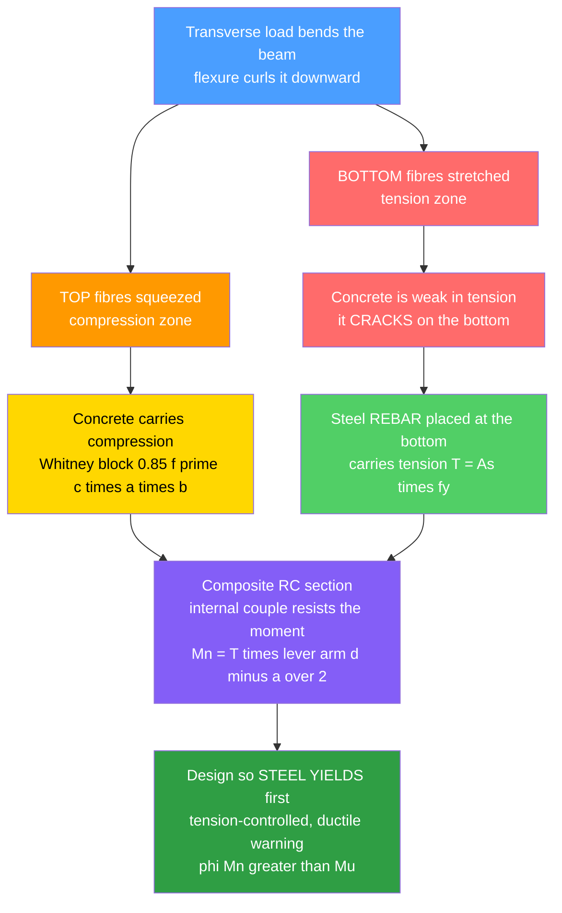

# 🏗️ Reinforced Concrete Design

> [!abstract] TL;DR
> **Reinforced concrete (RC)** is the world's most-used structural material because it fuses two cheap, humble materials that cover each other's weaknesses. **Concrete** is strong in **compression** but roughly **ten times weaker — and unreliable — in tension**: it cracks. **Steel** is superb in **tension**. So we cast steel **rebar** into the concrete exactly where the member will be *stretched* (the bottom of a beam, where bending pulls the fibres apart) and let the concrete carry the *squeezed* top. Under bending the compression zone is idealized as the **Whitney equivalent rectangular stress block** ($0.85 f'_c$ over depth $a$) and the tension by the steel ($A_s f_y$); force balance $C = T$ fixes the internal lever arm and the **nominal moment capacity** $M_n = A_s f_y\,(d - a/2)$. **Ultimate-strength (limit-state / LRFD) design** — codified in **ACI 318** — checks *factored loads* against a *reduced* capacity $\phi M_n$. The governing philosophy is **ductility**: design **tension-controlled (under-reinforced)** sections where the **steel yields first**, giving large warning deflection and cracking before the concrete crushes — never the **brittle over-reinforced** section where concrete crushes suddenly with no warning. Beyond flexure, RC design also covers **shear** (stirrups carry diagonal tension), **development / bond** of the rebar, **serviceability** (crack width, deflection), and the full family of elements: beams, one- and two-way **slabs**, **columns** (axial + moment, interaction diagrams), footings, and walls.

---

## Intuition

**Analogy first.** Think of concrete and steel as a **perfect marriage** in which each partner does only what they are good at and quietly covers the other's failing.

Concrete is like **stone**: fantastic at being *squeezed* (compression) but pathetic at being *pulled* (tension) — pull on it and it cracks embarrassingly easily. Steel is the opposite: a slender rod is brilliant in *tension* but buckles if you push on it alone. Now bend a beam. Bending curls it so the **top fibres are squeezed** and the **bottom fibres are stretched**. So we do the obvious thing: we cast steel bars — **rebar** — into the concrete *at the bottom*, precisely where the stretching happens, and let the concrete handle the squeezed top. The concrete *does* crack on the tension side — and that is completely expected and fine — while the hidden steel calmly carries the pull across the crack.

The partnership runs deeper than mechanics. The alkaline concrete **passivates the steel against corrosion** and shields it from **fire**; the two materials happen to have almost identical **thermal expansion**, so they heat and cool together without tearing apart; and the concrete **grips the ribbed bars by bond**, so load transfers between them. Two ordinary, inexpensive materials — poured into any shape and precisely reinforced where tension occurs — become the dominant structural material on Earth, holding up buildings, bridges, dams, and foundations everywhere.

---

## How It Works

### Core Mechanics

1. **Diagnose where tension lives.** Analyse the member (beam, slab, column, footing) for its internal actions — from statics and beam theory. In a downward-loaded beam the **bottom fibres are in tension**; over a support (continuous beam) the *top* is in tension. Rebar goes wherever the tension is.
2. **Let each material carry its strength.** Under bending, the **concrete compression zone** near the top resists the push, and the **steel** near the bottom resists the pull. The cracked concrete *below* the neutral axis is assumed to carry **no tension** — all of it is handed to the steel.
3. **Idealize the compression block (Whitney).** The true parabolic concrete stress distribution is replaced by an equivalent **rectangular stress block** of uniform stress $0.85 f'_c$ over a depth $a = \beta_1 c$ (with $c$ the neutral-axis depth). This gives the same resultant force and location with trivial arithmetic.
4. **Balance the internal couple.** Horizontal equilibrium sets **compression = tension**:
   $$C = 0.85\,f'_c\, a\, b \;=\; T = A_s f_y \quad\Rightarrow\quad a = \frac{A_s f_y}{0.85\, f'_c\, b}.$$
   The two equal-and-opposite forces are separated by the **internal lever arm** $\left(d - a/2\right)$, forming the resisting couple.
5. **Compute nominal moment capacity.** $\;M_n = T\left(d - \dfrac{a}{2}\right) = A_s f_y\left(d - \dfrac{a}{2}\right).$ Adding rebar ($A_s$) raises capacity — up to a limit.
6. **Enforce ductility (the crucial step).** From strain compatibility ($\varepsilon_{cu}=0.003$ at the crushed top), the **net tensile strain** in the steel is $\varepsilon_t = \varepsilon_{cu}\,(d-c)/c$. Design so the **steel yields first** ($\varepsilon_t \ge 0.005$, *tension-controlled*): the section deflects and cracks visibly — a **warning** — long before the concrete crushes. The **balanced** ratio $\rho_b$ is where steel yields and concrete crushes *simultaneously*; anything above it is the forbidden **over-reinforced, brittle** design.
7. **Apply the limit-state safety format.** Ultimate-strength design (ACI 318 / LRFD) requires **factored demand $\le$ reduced capacity**: $\;\phi M_n \ge M_u = 1.2 D + 1.6 L\;$ (typical). The **strength-reduction factor** $\phi$ is *itself* a ductility reward — $\phi = 0.90$ for tension-controlled sections, sliding down to $0.65$ for brittle compression-controlled ones.
8. **Finish the other limit states.** Design **shear** reinforcement (stirrups/ties carry the diagonal tension: $V_u \le \phi(V_c + V_s)$), ensure **development length / bond / anchorage** so bars can actually reach $f_y$, and check **serviceability** — crack width and deflection under service loads.

### Flow / Architecture



---

## Key Concepts

### Secondary Level

- **Two materials, one job each.** Concrete is great at being *squeezed*, weak at being *pulled*; steel is great at being *pulled*. Put steel where the pulling happens.
- **A beam bends, so it stretches on one side.** Load a beam in the middle: the **bottom stretches** (tension) and the **top squeezes** (compression). The steel bars go in the bottom.
- **Cracks on the tension side are normal.** Concrete is *allowed* to crack where it is stretched — the hidden steel carries that pull. Fine hairline cracks are expected, not a failure.
- **Why the marriage lasts.** The concrete also protects the steel from **rust** and **fire**, and both expand by the same amount when heated — so they work together for decades.
- **Warning before collapse is the goal.** Good reinforced concrete *sags and cracks visibly* before it ever fails, giving people time to react — it does not snap suddenly.

### Undergraduate Level

- **Material properties.** Concrete is specified by its **28-day compressive strength** $f'_c$ (e.g. 28 MPa / 4 ksi); reinforcing steel by its **yield strength** $f_y$ (e.g. 420 MPa / Grade 60) and modulus $E_s \approx 200$ GPa. Concrete's tensile strength ($\approx 0.1 f'_c$) is *neglected* in flexural strength design.
- **Whitney equivalent stress block.** Replace the real stress diagram with uniform $0.85 f'_c$ over $a = \beta_1 c$, where $\beta_1 = 0.85$ for $f'_c \le 28$ MPa and reduces $0.05$ per $7$ MPa above that (floor $0.65$).
- **Flexural strength (singly-reinforced beam).** $a = \dfrac{A_s f_y}{0.85 f'_c b}$ and $M_n = A_s f_y\!\left(d - \dfrac{a}{2}\right)$. Equivalently with the **reinforcement ratio** $\rho = A_s/(bd)$: $M_n = \rho f_y b d^2\!\left(1 - 0.59\,\rho f_y/f'_c\right)$.
- **Balanced ratio & the ductility classes.** $\rho_b = 0.85\,\beta_1\,\dfrac{f'_c}{f_y}\,\dfrac{\varepsilon_{cu}}{\varepsilon_{cu}+\varepsilon_y}$. **Tension-controlled** ($\varepsilon_t \ge 0.005$, under-reinforced, $\phi = 0.90$) is desired; **compression-controlled** ($\varepsilon_t \le \varepsilon_y$, over-reinforced, $\phi = 0.65$) is avoided; a linear **transition** runs between them. Codes cap $\rho$ (via a minimum $\varepsilon_t$) *and* impose $A_{s,\min}$ so the cracked RC section is stronger than the plain concrete (no sudden rupture at first crack).
- **Limit-state (LRFD) format.** $\phi M_n \ge M_u$ where $M_u$ comes from **factored** load combinations (e.g. $1.2D + 1.6L$). Compare with older **Working Stress Design** (allowable stresses, service loads).
- **Shear design.** Diagonal tension from shear is carried by **stirrups**: $V_u \le \phi(V_c + V_s)$, with $V_c \approx 0.17\sqrt{f'_c}\,b_w d$ (SI) and $V_s = A_v f_{yt} d / s$. Minimum stirrups and spacing limits prevent brittle diagonal-tension failure.
- **Development, bond & anchorage.** A bar can only develop $f_y$ if embedded a sufficient **development length** $\ell_d$; otherwise it pulls out. Hooks, laps, and cover detailing make the composite action real.
- **Serviceability.** Under *service* loads, check **deflection** (immediate + long-term creep/shrinkage, span/deflection limits) and **crack width** (bar spacing / stress limits) — a beam can be strong yet unusable if it sags or cracks widely.

### Graduate Level

- **Doubly-reinforced & T-beams.** Add **compression steel** $A'_s$ (controls long-term deflection, raises ductility, resists moment reversal); flanged **T-beams** capture the slab acting with the web, with the stress block possibly extending into the web.
- **Full moment-curvature & fibre-section analysis.** Beyond the code stress block, integrate a nonlinear concrete law (Hognestad / Kent-Park, with **confinement** from closely-spaced ties/spirals raising strength *and* ultimate strain) plus elastic-plastic (or strain-hardening) steel to obtain the complete $M$-$\kappa$ response, yield/ultimate curvature, and **curvature ductility** $\mu_\phi = \kappa_u/\kappa_y$.
- **Columns: axial-moment interaction.** Members carry combined $P$ and $M$; the **interaction ($P$-$M$) diagram** traces the failure envelope with a **balanced point** at its "nose." **Spirally-confined** columns behave far more ductilely (higher $\phi$) than **tied** columns; **slenderness** brings second-order ($P$-$\Delta$) moment magnification.
- **Two-way slabs & yield-line theory.** Two-way action (flat plates, flat slabs, waffle) needs distribution methods (Direct Design / Equivalent Frame) and **punching shear** checks at columns; ultimate capacity via **yield-line (plastic collapse) analysis**.
- **Strut-and-tie modelling.** For **D-regions** (deep beams, corbels, pile caps, openings) where beam theory's "plane sections" fails, model the flow of forces as concrete **struts** and steel **ties** meeting at **nodes** — a lower-bound plasticity method.
- **Prestressing.** Actively pre-compressing the concrete with high-strength tendons keeps it in compression under service load, eliminating cracking and enabling long spans — the natural extension of the concrete-steel partnership.
- **Seismic & capacity design.** Ductile detailing (confinement, **strong-column/weak-beam**, splice/anchorage rules) forces energy dissipation into controlled plastic hinges; ductility, not raw strength, is what survives earthquakes.
- **Time-dependent & durability mechanics.** **Creep** and **shrinkage** redistribute stresses and grow deflection; **corrosion** of reinforcement (chloride/carbonation) and **cover** design govern service life — durability is a limit state in its own right.

---

## Python Demo

```python
# Reinforced-concrete BEAM DESIGN demo (numpy + matplotlib)
#   (a) MOMENT CAPACITY Mn(As) from the equivalent (Whitney) stress block:
#         C = 0.85 f'c a b  ==  T = As fy  ->  a = As fy / (0.85 f'c b)
#         Mn = As fy (d - a/2);   also plot design phi*Mn.
#   (b) DUCTILITY: net tensile steel strain et vs reinforcement ratio rho,
#         classifying tension-controlled (ductile) vs compression-controlled (brittle).
#   (c) MOMENT-CURVATURE by fibre-section analysis for an UNDER- vs OVER-reinforced
#         beam: the long ductile plateau (steel yields first) vs the short brittle rise.
#   (d) Curvature ductility mu_phi = kappa_u / kappa_y for both -> warning before failure.
import numpy as np
import matplotlib.pyplot as plt

# ---- Materials (SI units: N, mm, MPa) ----
fpc   = 28.0        # concrete compressive strength f'c, MPa
fy    = 420.0       # steel yield strength, MPa (Grade 420 ~ Grade 60)
Es    = 200_000.0   # steel elastic modulus, MPa
ecu   = 0.003       # concrete crushing strain (ACI 318)
eps0  = 0.002       # strain at peak concrete stress (Hognestad parabola)
ey    = fy / Es     # steel yield strain ~ 0.0021
beta1 = 0.85        # Whitney stress-block factor for f'c <= 28 MPa

# ---- Beam geometry ----
b = 300.0           # width, mm
d = 500.0           # effective depth to steel centroid, mm
h = 550.0           # total depth, mm

# ---- Limiting reinforcement ratios ----
rho_bal = 0.85*beta1*(fpc/fy)*(ecu/(ecu+ey))     # balanced (steel yields & concrete crushes together)
rho_tc  = 0.85*beta1*(fpc/fy)*(ecu/(ecu+0.005))  # tension-controlled limit (et = 0.005)
As_bal  = rho_bal*b*d
As_tc   = rho_tc*b*d

# =====================================================================
# (a) Nominal moment capacity Mn(As); handle the over-reinforced case
#     (steel does NOT yield) by strain compatibility.
# =====================================================================
def Mn_and_strain(As):
    a  = As*fy/(0.85*fpc*b)          # assume steel yields
    c  = a/beta1
    et = ecu*(d - c)/c               # net tensile steel strain
    if et >= ey:                     # UNDER-reinforced: steel yields (ductile)
        Mn = As*fy*(d - a/2.0)
    else:                            # OVER-reinforced: concrete crushes first (brittle)
        # 0.85 f'c beta1 b c^2 + As Es ecu c - As Es ecu d = 0
        A_ = 0.85*fpc*beta1*b
        B_ = As*Es*ecu
        C_ = -As*Es*ecu*d
        c  = (-B_ + np.sqrt(B_*B_ - 4*A_*C_))/(2*A_)
        a  = beta1*c
        et = ecu*(d - c)/c
        Mn = 0.85*fpc*a*b*(d - a/2.0)
    return Mn, et

As_grid = np.linspace(300.0, 1.6*As_bal, 400)
Mn_grid = np.array([Mn_and_strain(A)[0] for A in As_grid]) / 1e6   # kN*m
et_grid = np.array([Mn_and_strain(A)[1] for A in As_grid])
rho_grid = As_grid/(b*d)

# Strength-reduction factor phi (ACI 318): 0.90 tension-ctrl -> 0.65 comp-ctrl
def phi_factor(et):
    return np.clip(0.65 + (et - ey)*(0.25/(0.005 - ey)), 0.65, 0.90)
phi_grid = phi_factor(et_grid)

# =====================================================================
# (c) Moment-curvature by fibre-section analysis: nonlinear concrete
#     (Hognestad parabola, no tension) + elastic-perfectly-plastic steel.
# =====================================================================
def fc_conc(eps):                    # concrete stress (compression +), no tension
    x = eps/eps0
    return np.where((eps > 0) & (eps <= ecu), fpc*(2*x - x*x), 0.0)

def moment_curvature(As, n=250, steps=140):
    y  = (np.arange(n) + 0.5)*h/n    # fibre centroids measured from the top
    dy = h/n
    kap, mom, ky = [], [], None
    for et_top in np.linspace(2e-4, ecu, steps):
        lo, hi = 1e-3, h             # bisection on neutral-axis depth c so that C == T
        for _ in range(60):
            c = 0.5*(lo + hi)
            eps_fib = et_top*(c - y)/c            # + = compression above neutral axis
            C  = np.sum(fc_conc(eps_fib))*b*dy
            eps_s = et_top*(d - c)/c              # steel tensile strain
            fs = min(Es*eps_s, fy) if eps_s > 0 else Es*eps_s
            T  = As*fs
            if C - T > 0: hi = c
            else:         lo = c
        kappa = et_top/c                          # curvature (1/mm)
        M = np.sum(fc_conc(eps_fib)*(d - y))*b*dy # moment about the steel level
        if ky is None and eps_s >= ey:            # first instant the steel yields
            ky = kappa
        kap.append(kappa); mom.append(M/1e6)      # kN*m
    return np.array(kap), np.array(mom), ky

As_under = 0.008*b*d           # rho = 0.8%  -> well under-reinforced (ductile)
As_over  = 1.30*As_bal         # over-reinforced (brittle)
k_u, M_u, ky_u = moment_curvature(As_under)
k_o, M_o, ky_o = moment_curvature(As_over)
mu_under = k_u[-1]/ky_u if ky_u else 1.0          # curvature ductility kappa_u / kappa_y
mu_over  = k_o[-1]/ky_o if ky_o else 1.0

print(f"rho_balanced           = {rho_bal:.4f}  (As_bal = {As_bal:.0f} mm^2)")
print(f"rho_tension_controlled = {rho_tc:.4f}  (As_tc  = {As_tc:.0f} mm^2)")
print(f"UNDER-reinforced rho=0.80%%  mu_phi = {mu_under:4.1f}  -> DUCTILE (warning)")
print(f"OVER -reinforced rho={As_over/(b*d)*100:.1f}%%  mu_phi = {mu_over:4.1f}  -> BRITTLE (sudden)")

# =====================================================================
# PLOTS
# =====================================================================
fig, ax = plt.subplots(2, 2, figsize=(13, 9))

# (a) Mn and phi*Mn vs steel area
ax[0,0].plot(As_grid, Mn_grid, color="#1c6fd6", lw=2, label="nominal Mn")
ax[0,0].plot(As_grid, phi_grid*Mn_grid, color="#e8590c", lw=2, ls="--", label="design phi*Mn")
ax[0,0].axvspan(As_grid[0], As_tc, color="#2f9e44", alpha=0.08)
ax[0,0].axvspan(As_bal, As_grid[-1], color="#c92a2a", alpha=0.08)
ax[0,0].axvline(As_tc,  color="#2f9e44", ls=":", lw=1.6)
ax[0,0].axvline(As_bal, color="#c92a2a", ls=":", lw=1.6)
ax[0,0].text(As_tc*0.60, Mn_grid.max()*0.15, "tension-\ncontrolled\n(ductile)", color="#2f9e44", fontsize=8)
ax[0,0].text(As_bal*1.02, Mn_grid.max()*0.15, "over-reinf.\n(brittle)", color="#c92a2a", fontsize=8)
ax[0,0].set_xlabel("steel area  As  [mm^2]"); ax[0,0].set_ylabel("moment  [kN*m]")
ax[0,0].set_title("(a) Capacity Mn rises with rebar As"); ax[0,0].legend(); ax[0,0].grid(alpha=0.3)

# (b) net tensile strain vs reinforcement ratio (ductility classification)
ax[0,1].plot(rho_grid*100, et_grid, color="#7048e8", lw=2)
ax[0,1].axhline(0.005, color="#2f9e44", ls="--", lw=1.5)
ax[0,1].axhline(ey,    color="#c92a2a", ls="--", lw=1.5)
ax[0,1].axhspan(0.005, et_grid.max(), color="#2f9e44", alpha=0.08)
ax[0,1].axhspan(et_grid.min(), ey, color="#c92a2a", alpha=0.08)
ax[0,1].text(rho_grid.max()*100*0.42, 0.0056, "tension-controlled (ductile)", color="#2f9e44", fontsize=8)
ax[0,1].text(rho_grid.max()*100*0.42, ey-0.0011, "compression-controlled (brittle)", color="#c92a2a", fontsize=8)
ax[0,1].set_xlabel("reinforcement ratio  rho  [%]"); ax[0,1].set_ylabel("steel strain at failure  et")
ax[0,1].set_title("(b) Ductility: steel strain vs rho"); ax[0,1].grid(alpha=0.3)

# (c) moment-curvature: ductile plateau vs brittle
ax[1,0].plot(k_u*1e6, M_u, color="#2f9e44", lw=2.2, label=f"under-reinforced  rho=0.8%  (mu={mu_under:.0f})")
ax[1,0].plot(k_o*1e6, M_o, color="#c92a2a", lw=2.2, label=f"over-reinforced   rho={As_over/(b*d)*100:.1f}%")
if ky_u: ax[1,0].plot(ky_u*1e6, np.interp(ky_u, k_u, M_u), "o", color="#2f9e44", ms=7)
ax[1,0].annotate("steel yields\n(warning begins)", xy=(ky_u*1e6, np.interp(ky_u, k_u, M_u)),
                 xytext=(ky_u*1e6*2.2, M_u.max()*0.45), fontsize=8, color="#2f9e44",
                 arrowprops=dict(arrowstyle="->", color="#2f9e44"))
ax[1,0].set_xlabel("curvature  [x 10^-3 per m]"); ax[1,0].set_ylabel("moment  [kN*m]")
ax[1,0].set_title("(c) Moment-curvature: ductile vs brittle"); ax[1,0].legend(fontsize=8); ax[1,0].grid(alpha=0.3)

# (d) curvature ductility bar chart
ax[1,1].bar(["under-reinforced\n(ductile)", "over-reinforced\n(brittle)"],
            [mu_under, mu_over], color=["#2f9e44", "#c92a2a"], alpha=0.85)
ax[1,1].axhline(1.0, color="k", lw=0.8, ls=":")
ax[1,1].set_ylabel("curvature ductility  mu_phi = kappa_u / kappa_y")
ax[1,1].set_title("(d) Warning before failure")
for i, v in enumerate([mu_under, mu_over]):
    ax[1,1].text(i, v, f"{v:.1f}", ha="center", va="bottom", fontsize=11)
ax[1,1].grid(alpha=0.3, axis="y")

plt.tight_layout()
plt.savefig("rc_beam_design_demo.png", dpi=120)
print("Saved figure -> rc_beam_design_demo.png")
```

**What it shows.** Part (a) confirms the design headline: nominal capacity $M_n$ *grows* as you add rebar $A_s$ — but the code's *design* value $\phi M_n$ stops tracking it once you pass the balanced point, because $\phi$ collapses from $0.90$ to $0.65$ to penalize brittleness. Part (b) plots the **net tensile strain** in the steel against reinforcement ratio: below the tension-controlled limit the steel is straining well past yield ($\varepsilon_t \ge 0.005$, ductile); above balanced it never yields (brittle). Part (c) is the payoff — the fibre-section **moment-curvature** curves: the under-reinforced beam has a **long ductile plateau** (the steel yields, the section rotates dramatically at near-constant moment, cracks open — *warning*) before the concrete finally crushes, whereas the over-reinforced beam rises a little higher but ends abruptly with almost no curvature — a **sudden, brittle** failure. Part (d) distils this into the **curvature-ductility ratio** $\mu_\phi = \kappa_u/\kappa_y$: large for the under-reinforced section, essentially $1$ (no warning) for the over-reinforced one. This is exactly why RC codes force designs to be under-reinforced.

---

## Real-World Applications

- **Buildings** — reinforced-concrete frames (beams, columns, one- and two-way floor slabs, flat plates, shear walls) and foundations are the default structural system for most of the world's mid- and high-rise construction; formwork lets the same material be poured into any layout.
- **Bridges** — RC and prestressed-RC girders, decks, piers, and abutments; the moving-traffic moment envelope sizes the bottom flexural steel and the shear stirrups.
- **Dams, retaining walls & water structures** — mass and reinforced concrete resist enormous hydrostatic and earth pressures; crack control and durability dominate the design.
- **Foundations** — spread footings, mat/raft foundations, pile caps, and drilled shafts spread column loads into soil; footings are flexure-plus-punching-shear problems.
- **Pavements & infrastructure** — jointed and continuously reinforced concrete pavements, tunnels, culverts, silos, and cooling towers.
- **Earthquake-resistant construction** — ductile RC detailing (confinement of columns, strong-column/weak-beam, boundary elements in shear walls) is the front line of seismic safety; ductility, not raw strength, is what saves lives.

> **Example:** In a typical **reinforced-concrete building floor beam**, deformed (ribbed) rebar is laid along the **bottom** at midspan — where sagging bending puts the fibres in tension — and bent up or continued over the supports where **hogging** puts the *top* in tension. Vertical **stirrups** wrap the tension bars near the supports to carry the diagonal shear tension. The designer sizes the bottom steel so the section is **under-reinforced** (tension-controlled, $\phi = 0.90$): the beam is engineered to **sag and crack visibly** before it could ever fail, then checked so $\phi M_n \ge M_u = 1.2D + 1.6L$ and that its service deflection stays under about span/360. This one detail — steel on the tension face, sized for ductility — is repeated in essentially every concrete structure on Earth.

---

## Common Pitfalls

- **Trusting concrete in tension.** Concrete's tensile strength ($\approx 10\%$ of $f'_c$) is unreliable and is *neglected* in flexural strength — the steel must carry *all* the tension. Designs that lean on concrete tension crack and fail; that is why $A_{s,\min}$ exists (so the cracked section is stronger than the uncracked plain concrete, avoiding sudden rupture at first crack).
- **Putting the rebar on the wrong face.** Steel belongs on the **tension** side. In a continuous beam the tension face *flips* — bottom at midspan, **top over the supports**. Reinforcing only the bottom of a continuous beam invites cracking and failure over the supports.
- **Over-reinforcing (the forbidden brittle design).** Piling in steel past $\rho_b$ makes the **concrete crush first** with no warning. More steel is *not* safer — codes cap $\rho$ (require a minimum $\varepsilon_t$) precisely to force ductile, tension-controlled behaviour.
- **Confusing strength with stiffness/serviceability.** A beam can satisfy $\phi M_n \ge M_u$ yet **deflect or crack excessively** under service loads (worsened by long-term **creep and shrinkage**). Deflection and crack-width are separate limit states that often govern.
- **Neglecting shear and detailing.** Flexural steel does nothing for **diagonal tension**; missing or widely-spaced **stirrups** cause brittle shear failures. Likewise, bars need adequate **development length, cover, hooks, and lap splices** — a bar that can't develop $f_y$ (bond/anchorage failure) undermines the whole design.
- **Ignoring cover and corrosion.** Too little **cover** (or chloride/carbonation ingress) lets the rebar **corrode**; rust expands, spalls the concrete, and destroys the bond — the partnership breaks down over time. Durability is a design requirement, not an afterthought.
- **Mixing design philosophies / load factors.** Do not compare **factored** demands ($1.2D + 1.6L$) against **nominal** (unreduced) capacity, or apply working-stress allowables to ultimate-strength equations. Keep the limit-state bookkeeping consistent: factored load $\le \phi M_n$.
- **Mis-estimating effective depth $d$.** $M_n$ scales with $d^2$; using the *total* depth instead of the depth to the *steel centroid*, or ignoring bar layers and cover, over-predicts capacity.

---

## Related Concepts

- [[Bending_and_Beam_Theory]] — reinforced-concrete flexural design is beam theory made real: the same neutral-axis, moment, and $\sigma = My/I$ picture, but with a *cracked, two-material* section where concrete takes compression and steel takes tension.
- [[Stress_Strain_and_Elastic_Moduli]] — the whole method rests on stress-strain laws: linear-elastic strain compatibility ($\varepsilon = -y/\rho$), concrete's compressive strength $f'_c$, and steel's yield $f_y$ and modulus $E_s$.
- [[Composite_Materials_and_Fiber_Reinforcement]] — RC is the archetypal **structural composite**: a brittle, compression-strong matrix (concrete) toughened by a ductile, tension-strong reinforcement (steel), each placed to carry its favoured stress — the same principle as fibre-reinforced composites.
- [[Ceramics_and_Glasses]] — concrete behaves like an engineering **ceramic**: strong in compression, weak and flaw-sensitive in tension, and brittle — which is exactly why it must be reinforced to be usable in flexure.
- [[Fracture_Mechanics_and_Toughness]] — the cracking of the concrete tension zone, crack-width control, and the crucial brittle-vs-ductile distinction all connect to fracture and toughness; RC design is largely about *managing* cracking rather than preventing it.

*Sibling notes in this section (planned, referenced in prose): **Structural Steel Design** (the all-steel alternative and its own ductile limit-state design), **Concrete Technology and Cement** (how $f'_c$ is achieved — mix design, hydration, curing), **Prestressed Concrete** (actively pre-compressing concrete to eliminate cracking and span farther), **Design Codes and Structural Safety** (the load-factor / $\phi$-factor / limit-state framework, e.g. ACI 318), and **Beams: Shear and Bending Moment** (the internal-action analysis that supplies $M_u$ and $V_u$).*

---

## Review Questions

1. **(Secondary)** Concrete is strong when squeezed but weak when pulled; steel is strong when pulled. When you load a simple beam in the middle, which face is being stretched, and therefore where do you put the steel bars? Why is it perfectly acceptable for the concrete to crack on that face?
2. **(Undergraduate)** For a singly-reinforced beam ($b = 300$ mm, $d = 500$ mm, $f'_c = 28$ MPa, $f_y = 420$ MPa) with $A_s = 2000$ mm$^2$, compute the stress-block depth $a$, the nominal moment $M_n$, and the steel's net tensile strain $\varepsilon_t$. Is the section tension-controlled? State the design capacity $\phi M_n$ and the appropriate $\phi$.
3. **(Undergraduate/Graduate)** Explain, using strain compatibility and the balanced reinforcement ratio $\rho_b$, why an **over-reinforced** beam fails suddenly (brittle) while an **under-reinforced** beam warns first (ductile). Why do design codes *forbid* the over-reinforced case even though it carries a slightly higher nominal moment?
4. **(Graduate)** A continuous RC beam must resist moment reversal and a demanding deflection limit, and sits in a seismic zone. Discuss how **compression reinforcement**, **confinement** (tie/spiral detailing), and the **strong-column/weak-beam** philosophy each improve behaviour, and relate them to the **moment-curvature** response and curvature ductility $\mu_\phi = \kappa_u/\kappa_y$. Where does the code stress block cease to be adequate, requiring full fibre-section or strut-and-tie analysis?

---

## Sources

- McCormac, J. C. & Brown, R. H. *Design of Reinforced Concrete*, 10th ed. Wiley. (Standard undergraduate text — flexure, shear, columns, ACI-based.)
- Wight, J. K. & MacGregor, J. G. *Reinforced Concrete: Mechanics and Design*, 7th ed. Pearson. (Mechanics-oriented treatment linking behaviour to code provisions.)
- Nilson, A. H., Darwin, D. & Dolan, C. W. *Design of Concrete Structures*, 15th ed. McGraw-Hill.
- ACI Committee 318. *Building Code Requirements for Structural Concrete (ACI 318) and Commentary*. American Concrete Institute. (The governing US design code — strength design, $\phi$ factors, detailing.)
- Park, R. & Paulay, T. *Reinforced Concrete Structures*. Wiley. (Classic on moment-curvature, ductility, confinement, and seismic detailing.)

---

#civil-engineering #reinforced-concrete #rebar #stress-block #ductile-design
