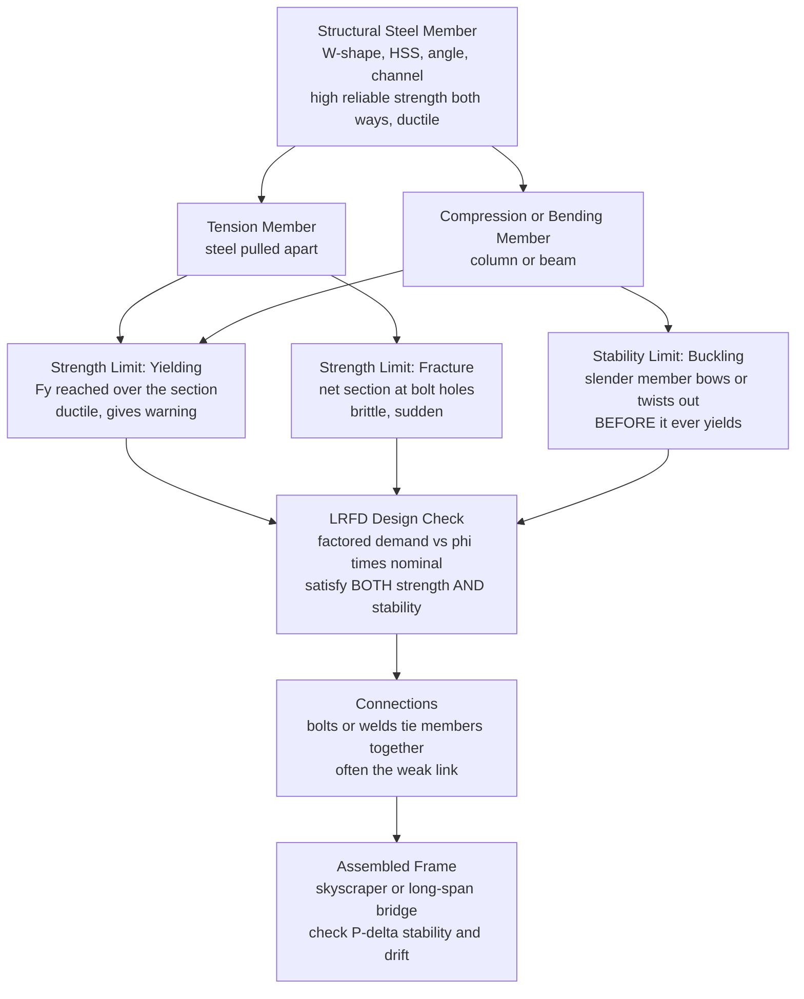

# 🏗️ Structural Steel Design

> [!abstract] TL;DR
> **Structural steel** is the thoroughbred of construction materials — very high, *reliable* strength in **both tension and compression**, **ductile** (it deforms visibly and warns before it ruptures), stiff, and rolled into standardized shapes (**W** wide-flange, **HSS** tubes, angles, channels) that erect fast and recycle. Modern design uses **LRFD / limit-state** philosophy (AISC 360): the factored load demand must not exceed $\phi$ times the nominal strength, checked against *several* **limit states**. Because steel is so strong, engineers make members thin and slender — and thin steel's secret enemy is not crushing but **buckling**. So every member is a duel between two failure modes: **strength** (yielding/fracture) versus **stability** (buckling). Tension members are governed by *yield on the gross area* vs *fracture on the net area* at bolt holes; **columns** by **buckling** (the AISC column curve blends yield and inelastic Euler through slenderness $KL/r$); **beams** by the **plastic moment** when braced, dropping via **lateral-torsional buckling** when the compression flange is unbraced; **beam-columns** by an axial-plus-bending interaction. **Connections** (bolted, welded) tie it all together and are frequently the weak link. Steel's ductility also makes it a premier **seismic** material.

---

## Intuition

**Analogy first.** Steel is the **thoroughbred** of structural materials. Unlike stone or concrete — mighty in compression but feeble in tension — steel is immensely strong *both* ways: you can pull it or push it just as hard. It is also **ductile**: overload it and it stretches visibly, groans, and sags *long* before it snaps — a building that warns you is a building you can escape. And because it is manufactured in a mill to tight specifications, an engineer knows its yield strength to within a few percent, not the wild scatter of natural materials. That trifecta — strength, ductility, reliability — is *why* steel builds the tall and the long: skyscrapers and long-span bridges are steel's domain.

But the same magnificent strength is a trap. Because steel is so strong, you only need a *little* of it, so members come out **thin and slender** — a hair-thin column three stories tall, a beam web the thickness of a coin. And thin steel has a secret enemy: it does not fail by crushing, it fails by **buckling**. A slender column does not squash — it suddenly **bows sideways**. A deep unbraced beam does not yield — it **tips and twists** out of plane. A thin flange does not compress — it **wrinkles** locally. So steel design is a constant duel: exploit steel's strength to make members lean, then *tame the instabilities that leanness invites* by bracing, thickening, or accepting a lower capacity. **Master when a member yields versus when it buckles, and you have mastered steel.**

---

## How It Works

### Core Mechanics

1. **Pick a shape and a grade.** Choose a rolled section — a wide-flange **W** for beams/columns, a hollow **HSS** for members loaded every which way, an angle or channel for bracing — and a steel grade (e.g. **A992**, $F_y = 50$ ksi, for wide-flanges).
2. **Establish the demand by LRFD.** Combine service loads with load factors (e.g. $1.2D + 1.6L$) to get the **required strength** $R_u$. The member is adequate when $R_u \le \phi R_n$, where $R_n$ is the **nominal strength** and $\phi$ is a resistance factor (0.90 tension yield, 0.75 fracture, 0.90 flexure/compression).
3. **Check every relevant limit state — strength AND stability.** A member can fail more than one way; the *governing* (lowest-capacity) limit state controls.
   - **Tension members:** *yielding on the gross area* $P_n = F_y A_g$ (ductile, spreads plastically) **vs** *fracture on the net area* $P_n = F_u A_e$ at bolt holes (brittle, sudden), plus **block shear** tear-out.
   - **Compression members / columns:** governed by **buckling**. Capacity is $P_n = F_{cr} A_g$, where the critical stress $F_{cr}$ blends yielding (short columns) with **inelastic then elastic Euler buckling** (slender columns) as a function of slenderness $KL/r$ — the **AISC column curve**.
   - **Beams:** reach the **plastic moment** $M_p = F_y Z_x$ *only when the compression flange is braced* and the section is **compact**. As the unbraced length $L_b$ grows past $L_p$, capacity falls through **lateral-torsional buckling (LTB)**; thin plates also **locally buckle** (compact vs noncompact vs slender).
   - **Beam-columns:** members carrying both axial load and bending are checked with an **interaction equation** (AISC H1-1) that budgets capacity between the two effects.
4. **Design the connections.** Members are tied together by **bolts** (bearing-type or slip-critical, in shear and/or tension) and **welds** (fillet, groove). Connections are classified **simple/shear** (transmit force, allow rotation) vs **moment** (transmit rotation, needed for frames). They are frequently the *weak link* and demand careful checks (bolt shear, bearing, prying, weld throat).
5. **Verify serviceability and overall stability.** Check **deflection**, lateral **drift**, floor **vibration**, and **fatigue** for cyclic loads. At the system level, account for **second-order P-Δ / P-δ** effects — the amplification of moments when a leaning, loaded frame sways.

### Flow / Architecture



---

## Key Concepts

### Secondary (the big picture)

- **Steel is strong both ways.** Unlike concrete (strong in compression, weak in tension), steel handles pulling and pushing equally — that is why frames and long bridges are steel.
- **Ductility = warning.** Overloaded steel bends a lot before it breaks, so structures give visible notice rather than shattering. This same property lets steel absorb earthquake energy.
- **Standard shapes.** Steel comes in catalog cross-sections — the **I-shaped W** (flanges far from the middle, efficient in bending), square/round **HSS** tubes, **angles**, and **channels**.
- **The core tension in steel design:** slender steel members do not *crush*, they **buckle** — bow out sideways or wrinkle. Preventing buckling (by bracing or thickening) is half the job; using steel's strength is the other half.
- **Bolts and welds** hold the pieces together and are often where a structure actually fails.

### Undergraduate (the design methods)

- **LRFD / limit-state design (AISC 360):** require $R_u \le \phi R_n$. Check *all* applicable **limit states**; the lowest capacity governs.
- **Tension members:** $\phi_t P_n = \min\{\,0.90\,F_y A_g,\; 0.75\,F_u A_e\,\}$ — **yield on gross** vs **fracture on net** ($A_e$ accounts for bolt-hole loss and shear lag $U$). Also check **block shear**.
- **Compression / column curve:** $P_n = F_{cr}A_g$. With elastic (Euler) stress $F_e = \pi^2 E/(KL/r)^2$:
  - **Inelastic** (short/intermediate, $KL/r \le 4.71\sqrt{E/F_y}$): $F_{cr} = \left[0.658^{\,F_y/F_e}\right]F_y$.
  - **Elastic** (slender, $KL/r > 4.71\sqrt{E/F_y}$): $F_{cr} = 0.877\,F_e$.
  - **Slenderness** $KL/r$ is king: $K$ is the **effective-length factor** (0.5 fixed-fixed, 1.0 pinned-pinned, 2.0 cantilever), $r=\sqrt{I/A}$ the radius of gyration.
- **Beams (flexure):** compact braced sections reach $M_p = F_y Z_x$. Two beam limit states erode this:
  - **Lateral-torsional buckling (LTB):** full $M_p$ for $L_b \le L_p$; a linear drop for $L_p < L_b \le L_r$; elastic LTB $M_n = F_{cr}S_x$ for $L_b > L_r$. The moment-gradient factor $C_b \ge 1$ rewards non-uniform moment.
  - **Local buckling:** flange/web plates classified **compact / noncompact / slender** by width-thickness ratio $\lambda = b/t$.
- **Shear in beams:** $V_n = 0.6 F_y A_w C_v$ (web area governs; slender webs may need stiffeners).
- **Beam-columns:** AISC **H1-1** interaction — if $P_r/P_c \ge 0.2$: $\dfrac{P_r}{P_c} + \dfrac{8}{9}\left(\dfrac{M_{rx}}{M_{cx}} + \dfrac{M_{ry}}{M_{cy}}\right) \le 1.0$.
- **Connections:** bolts checked for **shear**, **bearing/tear-out**, and (if applicable) **tension** and combined; **slip-critical** joints resist by friction. Welds checked on **effective throat**. Distinguish **simple (shear)** from **moment** connections.
- **Serviceability:** deflection limits (e.g. $L/360$ live load), lateral **drift** ($\sim H/400$), and floor **vibration**.

### Graduate (behavior, stability, and the code's fine print)

- **Why the column curve is a *curve*, not Euler:** real columns carry **residual stresses** (from uneven cooling after rolling) and **initial out-of-straightness**; these cause premature yielding on one face, so the transition from yield to Euler is *inelastic* — the AISC $0.658$ / $0.877$ blend is a curve-fit to this behavior.
- **Effective length $K$ and system stability:** the classical **alignment charts** (nomographs) estimate $K$ from joint stiffness ratios $G$; modern practice prefers the **Direct Analysis Method** — a second-order analysis with reduced stiffness ($0.8\tau_b EI$) and **notional lateral loads**, letting you take $K=1$.
- **Second-order effects:** **P-Δ** (sway of the whole frame) and **P-δ** (member curvature) amplify first-order moments; captured by amplifiers $B_1, B_2$ or a true geometric-nonlinear analysis.
- **Buckling zoology:** besides flexural buckling, singly-symmetric and thin-walled open sections suffer **torsional** and **flexural-torsional** buckling; the LTB elastic critical moment couples weak-axis flexure with **warping** and **St. Venant torsion** ($M_{cr}$ involves $E I_y$, $G J$, and $C_w$).
- **Plate local buckling & post-buckling:** slender elements buckle locally but retain post-buckling strength via **effective width**; the compact/noncompact/slender limits ($\lambda_p, \lambda_r$) map to plate-buckling coefficients.
- **Plastic design & moment redistribution:** ductile, compact members form **plastic hinges**, letting indeterminate frames redistribute moment up to a **collapse mechanism** (upper/lower-bound theorems).
- **Seismic design (AISC 341):** **capacity design** — force yielding into pre-chosen ductile fuses (e.g. beam hinges in SMFs, brace yielding in SCBFs, links in EBFs) while keeping columns/connections elastic; demands strict **compactness**, **CVN toughness**, and protected-zone detailing to survive cyclic reversals.
- **Fracture & fatigue:** brittle fracture risk rises with low temperature, thickness, and triaxial restraint (Charpy V-notch toughness matters); cyclic-load members are checked against AISC **fatigue detail categories** (stress-range vs cycles $S$–$N$).
- **Connection subtleties:** **prying action** amplifies bolt tension in flexible tees; **block shear** combines tension rupture with shear yield/rupture; welded joints carry **residual stress** and must respect the **weld access / heat-affected zone**.

---

## Python Demo

The two curves every steel designer keeps in their head: the **column curve** (axial capacity collapsing as slenderness rises) and the **beam LTB curve** (flexural capacity collapsing as the compression flange goes unbraced). Both are the *yield-vs-buckling duel* made visual.

```python
# Structural steel design -- the two governing "capacity vs slenderness" curves.
#   (a) AISC column curve: critical stress Fcr vs slenderness KL/r
#   (b) Beam LTB curve:     nominal moment Mn vs unbraced length Lb  (W18x50)
# Units: US customary (ksi, in, kip, ft), matching AISC 360.
import numpy as np
import matplotlib.pyplot as plt

E  = 29000.0   # steel Young's modulus, ksi
Fy = 50.0      # yield stress, ksi (A992 wide-flange steel)

# ============ (a) COLUMN CURVE: Fcr vs KL/r =====================
slender = np.linspace(1, 200, 400)              # KL/r
Fe      = np.pi**2 * E / slender**2             # Euler elastic buckling stress
lam_lim = 4.71 * np.sqrt(E / Fy)                # inelastic/elastic boundary (~113)

Fcr = np.where(
    slender <= lam_lim,
    0.658**(Fy / Fe) * Fy,                      # inelastic buckling  (short/intermediate)
    0.877 * Fe                                  # elastic (Euler) buckling (slender)
)

# ============ (b) BEAM CURVE: Mn vs unbraced length Lb ==========
# W18x50 (A992) section properties
Zx, Sx = 101.0, 88.9      # plastic / elastic section modulus, in^3
ry, rts = 1.65, 1.98      # weak-axis and effective LTB radii, in
ho, J, c = 17.4, 1.24, 1.0  # flange-centroid distance in, torsion const in^4, symmetry

Mp = Fy * Zx              # plastic moment (fully braced capacity), kip-in
Mr = 0.7 * Fy * Sx        # moment at Lr (residual-stress reduced)

Lp = 1.76 * ry * np.sqrt(E / Fy)                                     # in
t  = J * c / (Sx * ho)
Lr = 1.95 * rts * (E / (0.7 * Fy)) * np.sqrt(t + np.sqrt(t**2 + 6.76 * (0.7 * Fy / E)**2))

Cb = 1.0
Lb = np.linspace(1e-6, 360, 400)   # unbraced length, in (0 to 30 ft)
Fcr_ltb = (Cb * np.pi**2 * E / (Lb / rts)**2) * np.sqrt(1 + 0.078 * t * (Lb / rts)**2)

Mn = np.where(Lb <= Lp, Mp,
      np.where(Lb <= Lr, Cb * (Mp - (Mp - Mr) * (Lb - Lp) / (Lr - Lp)),
               Fcr_ltb * Sx))
Mn = np.minimum(Mn, Mp)            # cap at the plastic moment

# ============================ PLOT =============================
fig, ax = plt.subplots(1, 2, figsize=(13, 5))

ax[0].plot(slender, Fcr, 'b-', lw=2.2, label='AISC design curve  Fcr')
ax[0].plot(slender, 0.877 * Fe, 'r--', lw=1.2, label='Elastic Euler branch  0.877 Fe')
ax[0].axhline(Fy, color='green', ls=':', lw=1.3, label='Yield cap  Fy')
ax[0].axvline(lam_lim, color='gray', ls='-.', lw=1.1,
              label=f'boundary KL/r = {lam_lim:.0f}')
ax[0].set_xlabel('Slenderness  KL / r'); ax[0].set_ylabel('Critical stress  Fcr  [ksi]')
ax[0].set_title('(a) Column: yielding  ->  BUCKLING')
ax[0].set_xlim(0, 200); ax[0].set_ylim(0, 55)
ax[0].annotate('short: crushes / yields', xy=(18, 46), fontsize=8)
ax[0].annotate('slender: buckles', xy=(140, 12), fontsize=8)
ax[0].legend(fontsize=8); ax[0].grid(alpha=0.3)

ax[1].plot(Lb / 12, Mn / 12, 'b-', lw=2.2, label='Nominal moment  Mn')
ax[1].axhline(Mp / 12, color='green', ls=':', lw=1.3, label='Plastic moment  Mp')
ax[1].axvline(Lp / 12, color='gray', ls='-.', lw=1.1, label=f'Lp = {Lp/12:.1f} ft')
ax[1].axvline(Lr / 12, color='orange', ls='-.', lw=1.1, label=f'Lr = {Lr/12:.1f} ft')
ax[1].set_xlabel('Unbraced length  Lb  [ft]'); ax[1].set_ylabel('Flexural capacity  Mn  [kip-ft]')
ax[1].set_title('(b) Beam W18x50: plastic  ->  LATERAL-TORSIONAL BUCKLING')
ax[1].set_xlim(0, 30); ax[1].set_ylim(0, 1.15 * Mp / 12)
ax[1].annotate('braced: full Mp', xy=(1, 0.80 * Mp / 12), fontsize=8)
ax[1].annotate('inelastic LTB', xy=(Lp/12 + 0.5, 0.66 * Mp / 12), fontsize=8)
ax[1].annotate('elastic LTB', xy=(Lr/12 + 1, 0.32 * Mp / 12), fontsize=8)
ax[1].legend(fontsize=8); ax[1].grid(alpha=0.3)

plt.tight_layout(); plt.savefig('steel_design_curves.png', dpi=120); plt.show()

print(f"Column: inelastic/elastic boundary at KL/r = {lam_lim:.1f}")
print(f"Beam W18x50: Mp = {Mp/12:.0f} kip-ft,  Lp = {Lp/12:.2f} ft,  Lr = {Lr/12:.2f} ft")
# -> Mp ~ 421 kip-ft, Lp ~ 5.8 ft, Lr ~ 16.9 ft  (matches AISC steel-manual tables)
```

**What the plots show.** *Left:* the column's capacity is capped by yielding for stocky members, then falls smoothly through **inelastic buckling**, and finally rides the **elastic Euler** curve ($0.877 F_e$) once $KL/r$ passes $\approx 113$ — capacity plummeting like $1/(KL/r)^2$. *Right:* the beam delivers its **full plastic moment** only while braced ($L_b \le L_p \approx 5.8$ ft), sheds capacity linearly through **inelastic LTB**, and drops onto the **elastic LTB** hyperbola beyond $L_r \approx 16.9$ ft. Both curves are the same story: **slenderness invites buckling, and bracing buys back strength.**

---

## Real-World Applications

- **Skyscrapers & steel moment/braced frames.** The Empire State Building, the Sears/Willis Tower's **bundled tube**, and virtually every tall modern tower use steel frames for their strength-to-weight and fast erection. Columns are sized by the **column curve**; lateral systems (moment frames, braced frames, outrigger trusses) resist wind and control **drift** and **P-Δ**.
- **Long-span bridges.** Steel dominates long spans — plate-girder and box-girder bridges, steel **trusses**, and the cables/towers of suspension bridges — because only steel offers the tensile strength and span-to-weight required. Compression chords and towers are governed by **buckling**; deck girders by **LTB** between cross-frames.
- **Industrial buildings, stadiums, and airports.** Wide-span roofs (space trusses, long-span girders, tapered plate girders) and crane-supporting mill buildings exploit steel's spanning ability; roof beams are laterally braced by purlins to push $L_b$ below $L_p$.
- **Seismic force-resisting systems.** Special Moment Frames, Concentrically/Eccentrically Braced Frames, and Buckling-Restrained Braced Frames rely on steel's **ductility** to dissipate earthquake energy through controlled yielding (AISC 341 **capacity design**) — a role brittle materials simply cannot fill.
- **Offshore platforms, transmission towers, pipelines.** Tubular **HSS** members and lattice towers use closed sections for efficient resistance to buckling and multidirectional wind/wave loading.

---

## Common Pitfalls

- **Designing for strength but forgetting stability.** A member sized only for yield stress can still **buckle** at a fraction of that load. Slender columns and unbraced beams fail by instability, *not* material yielding — always check $KL/r$ and $L_b$.
- **Ignoring the unbraced length $L_b$.** Assuming a beam reaches $M_p$ when its compression flange is actually unbraced overestimates capacity badly (see the LTB drop-off). Provide and *count* real bracing points; do not assume the deck braces a beam it is not attached to.
- **Mixing up gross vs net section in tension.** Yielding is checked on the **gross** area but fracture on the **net** (bolt-hole-reduced, shear-lag-adjusted) area; using $A_g$ with $F_u$, or skipping **block shear**, can miss the governing brittle mode.
- **Treating the connection as an afterthought.** Connections are frequently the true weak link. Overlooking **prying action**, bolt **bearing/tear-out**, weld **throat** limits, or the difference between a **simple** and a **moment** connection leads to failures where members were fine.
- **Effective length factor $K$ errors.** Using $K=1$ for a sway (unbraced) frame, or mis-reading alignment charts, underestimates column slenderness. Sway frames amplify moments via **P-Δ**; use the Direct Analysis Method or proper $K$.
- **Neglecting local (plate) buckling.** A **slender** flange or web wrinkles before the member yields; check width-thickness ratios (**compact/noncompact/slender**) — especially for built-up or thin HSS sections.
- **Forgetting steel's environmental weaknesses.** Steel **corrodes** (galvanizing, paint, or weathering steel needed) and **loses strength in fire** (fireproofing/intumescent coating required). A structurally perfect member can still fail from rust or an unprotected fire.
- **Serviceability skipped.** A beam can be strong yet bounce or sag objectionably. Check **deflection**, **drift**, and **vibration** as separate limit states.

---

## Related Concepts

*Cross-vault links (Glob-verified):*

- [[Stress_Strain_and_Elastic_Moduli]] — the stress-strain curve, yield point, Young's modulus $E$, and **ductility** that define steel's structural behavior; the foundation for both yielding and the elastic buckling stress.
- [[Bending_and_Beam_Theory]] — the flexure formula $\sigma = My/I$, section modulus, and why steel is rolled into I-shapes; the mechanics underneath a steel beam's flexural design.
- [[Phase_Diagrams_and_the_Iron_Carbon_System]] — the iron-carbon (Fe-C) diagram explaining how carbon content and processing set steel's strength and ductility, the metallurgical basis of structural grades.
- [[Fracture_Mechanics_and_Toughness]] — brittle fracture, notch toughness, and the crack-driven failures that ductile-detailing and CVN requirements exist to prevent.
- [[Corrosion_and_Electrochemical_Degradation]] — why unprotected steel rusts and how coatings/weathering steel defend the strength engineers relied on.
- [[Strengthening_Mechanisms_in_Metals]] — how alloying, grain refinement, and cold work raise steel's yield strength (the $F_y$ that anchors every capacity equation).
- [[Plastic_Deformation_and_Slip_Systems]] — the dislocation-slip origin of steel's ductility and its ability to form plastic hinges and dissipate seismic energy.
- [[Fatigue_Creep_and_High_Temperature_Failure]] — cyclic-load fatigue (bridges, cranes) and the high-temperature strength loss behind fire protection.
- [[Stress_Strain_and_Deformation]] — the mechanics-of-materials companion (axial/normal stress, deformation) underlying member design.
- [[Failure_Fatigue_and_Fracture]] — engineering failure modes and fatigue detail categories relevant to steel connection and member life.
- [[Heat_Treatment_and_Microstructure]] — how rolling and cooling produce residual stresses and the microstructure that gives structural steel its properties.

*Sibling Civil-Engineering topics (folder being built, prose references):* Structural Steel Design sits alongside **Reinforced_Concrete_Design** (its great alternative — strong in compression, needing rebar for tension) as one of the two core structural-design disciplines. It relies directly on **Structural_Stability_and_Buckling** (the theory behind the column and LTB curves), is codified through **Design_Codes_and_Structural_Safety** (LRFD load/resistance factors), takes its member forces from **Analysis_of_Trusses_and_Frames**, and is applied at scale in **Bridge_Engineering**.

---

## Review Questions

**Secondary**

1. Steel is described as strong in *both* tension and compression, while concrete is strong mainly in compression. Why does this difference make steel the material of choice for long bridges and tall frames?
2. What does it mean that steel is **ductile**, and why is a structure that "warns before it breaks" safer than one that shatters suddenly?

**Undergraduate**

3. A steel column and a steel tension member are both made from the same section. Explain why the column's capacity depends heavily on its **length** (slenderness $KL/r$) while the tension member's does not — and name the governing limit state for each.
4. For a beam, sketch qualitatively how the nominal moment $M_n$ varies with unbraced length $L_b$, labeling $L_p$, $L_r$, and the plastic-moment plateau. What physically happens to the beam as $L_b$ exceeds $L_p$?
5. Write the LRFD design inequality and state the two limit states (with their $\phi$ factors) you must check for a bolted tension member.

**Graduate**

6. The AISC column curve does not follow the pure Euler hyperbola in the intermediate-slenderness range. Explain the roles of **residual stresses** and **initial out-of-straightness** in producing the inelastic $0.658^{F_y/F_e}$ branch.
7. In an unbraced (sway) moment frame, why is assuming $K = 1$ unconservative, and how does the **Direct Analysis Method** (reduced stiffness + notional loads) let you use $K=1$ while still capturing **P-Δ** effects?
8. **Capacity design** for seismic steel (AISC 341) deliberately forces yielding into chosen "fuse" elements while keeping others elastic. Choosing a Special Moment Frame vs a Buckling-Restrained Braced Frame, where would you locate the ductile fuse, and what member/connection properties (compactness, toughness, protected zones) must you guarantee for it to work?

---

## Sources

- McCormac, J.C. & Csernak, S.F. — *Structural Steel Design* (Pearson).
- Segui, W.T. — *Steel Design* (Cengage).
- Salmon, C.G., Johnson, J.E. & Malhas, F.A. — *Steel Structures: Design and Behavior* (Pearson).
- American Institute of Steel Construction — *ANSI/AISC 360: Specification for Structural Steel Buildings*.
- American Institute of Steel Construction — *Steel Construction Manual* (section property tables, design aids).

---

#civil-engineering #structural-steel #buckling #connections #LRFD
