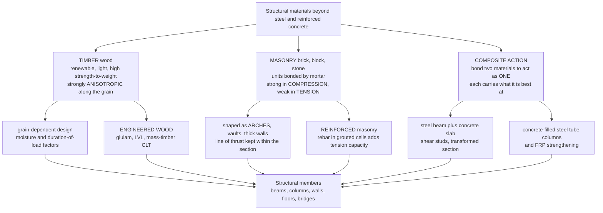

# 🪵 Timber, Masonry, and Composite Structures

> [!abstract] TL;DR
> Beyond steel and reinforced concrete, structural engineers build with two ancient materials and one modern trick. **Timber** is nature's fibre composite — light, renewable, and superb in **strength-to-weight** — but it is strongly **anisotropic**: much stronger and stiffer *parallel* to the **grain** than across it, and it splits along the grain like a bundle of straws. Timber design therefore turns on grain direction, moisture, **duration-of-load** (wood creeps and is *weaker* under sustained load, *stronger* under brief gusts), defects/grading, and connections (the usual weak point). **Engineered wood** — glulam, LVL, and **mass timber / cross-laminated timber (CLT)** — averages out defects and beats size and anisotropy limits, driving a low-carbon *tall-timber* renaissance. **Masonry** (brick, block, stone bonded by mortar) is magnificent in **compression** but crumbles in **tension** — so historic masonry is shaped as **arches, vaults, domes, and thick walls** that stay squeezed, the **line of thrust** kept inside the section (funicular form); modern **reinforced masonry** adds rebar in grouted cells for tension and seismic capacity. The modern trick is **composite action**: bond two materials so they act as *one* and each does what it is best at — the classic **steel beam + concrete slab** joined by shear studs (concrete takes compression, steel takes tension), **concrete-filled steel tubes**, and **FRP** strengthening, all analysed with the **transformed-section** idea. Old materials, cleverly combined, get more than the sum of their parts — and are enjoying a green revival.

---

## Intuition

**Analogy first — think of three very different craftspeople sharing one job.** The **carpenter** works with **wood**: light, alive, renewable, astonishingly strong for its weight — but it has a *direction*. Wood is a bundle of long fibres, like a fistful of drinking straws. Push or pull *along* the straws and it is tremendously strong; push *across* them and they crush; pry them *apart* and they split with almost no resistance. So the carpenter must always ask "which way does the grain run?" and never trust wood the same in every direction. The wood also gets *tired*: lean on it for years and it slowly sags and can fail at a load it would happily shrug off for a second.

The **mason** works with **brick and stone**: pieces stacked and glued with mortar. Stone is like a crowd of people standing shoulder to shoulder — brilliant at being *squeezed together* (compression), useless the moment you try to *pull them apart* (tension). That single fact explains every cathedral, aqueduct, and pyramid: the mason cannot build a straight stone beam that would crack on its underside, so instead they curve the stone into an **arch**, where every block is pressed against its neighbours and nothing is ever pulled. Keep the invisible "line of thrust" running down inside the stone and the arch stands for a thousand years; let it wander outside the stone and a crack opens.

The **modern engineer** knows one more trick the other two did not: **composite action** — *glue two different materials together so tightly that they behave as a single, better material.* Bolt a steel beam to a concrete slab so they cannot slip, and the concrete on top takes all the squeezing while the steel below takes all the pulling — the pairing is far stiffer and stronger than the steel beam alone. That same idea — let each material do only what it is best at, and make them share as one — is why steel-and-concrete floors span so far, why concrete-filled steel tubes hold up so much, and why a carbon-fibre wrap can rescue an ageing bridge. Three crafts, three insights: **respect the grain, keep the stone squeezed, and make partners act as one.**

---

## How It Works

### Core Mechanics

1. **Timber — read the grain, then the clock.** Wood's cells are long tubes aligned with the trunk, so allowable stress depends on the **angle between the load and the grain** (the **Hankinson formula** interpolates between the strong parallel value and the weak perpendicular one). On top of direction, timber design multiplies allowable stresses by **adjustment factors**: **duration-of-load** $C_D$ (permanent loads *reduce* strength, brief wind/impact loads *increase* it), **moisture/wet-service**, **temperature**, **size**, and grade (knots and slope-of-grain caught by visual or machine **grading**). Wood **creeps** and can suffer **creep-rupture** under sustained load, so long-term deflection and load matter as much as peak strength.

2. **Engineered wood beats the log's limits.** A sawn beam is only as big as the tree and only as good as its worst knot. **Glulam** (glued laminated timber) bonds many thin, graded laminations into large curved members; **LVL/PSL** peel or shred wood into veneers/strands and re-glue them, dispersing defects; **CLT / mass timber** stacks layers at right angles so the panel is strong in *two* directions and behaves almost like a "wooden concrete." This is what enables 10-to-20-storey timber buildings and low **embodied carbon** (wood stores sequestered CO₂).

3. **Masonry — compression only, so shape the load.** Brick/block/stone **units** are bedded in **mortar**; the assemblage is strong in compression (governed by unit and mortar strength, and by **slenderness/buckling** of tall walls) but essentially *zero* reliable tension. To carry span, masonry is curved into an **arch/vault/dome** so that gravity produces a **line of thrust** — the path the resultant compression follows. If that thrust line stays within the **middle third (kern)** of every section, the whole cross-section stays in compression (no tension, no cracking). Push it to the edge and a **hinge/crack** forms; enough hinges turn the arch into a mechanism and it collapses (**Heyman's safe theorem**: if *any* thrust line fits inside the masonry, the arch is safe).

4. **Reinforced masonry adds the missing tension.** Placing **steel rebar in grouted cells** (or bed-joint reinforcement) gives masonry walls flexural and shear capacity for out-of-plane wind and in-plane seismic demand — the same "let steel carry tension" logic as reinforced concrete, retrofitted onto an ancient material.

5. **Composite action — force two materials to share as one.** Connect a **steel beam** to the **concrete slab** above it with **shear studs** so the interface cannot slip. The neutral axis shifts *up* into or above the slab: the concrete (great in compression, above the axis) is squeezed while nearly all the steel (great in tension, below) is stretched. Analysed with the **transformed section** — convert the concrete to an equivalent width of steel by dividing its width by the **modular ratio** $n = E_s / E_c$ — the composite beam gains dramatic **stiffness** and **moment capacity** over the bare steel section. The same principle gives **concrete-filled steel tube (CFST) columns** (steel confines and is stabilised by the concrete core) and **FRP strengthening** (bonded carbon/glass fibre adds tension capacity to existing members).

### Flow / Architecture



---

## Key Concepts

### Secondary Level

- **Wood has a grain — direction matters.** Like a bundle of straws, wood is very strong *along* the grain and weak *across* it, and it **splits** easily along the grain. A carpenter never loads wood the same way in every direction.
- **Wood is renewable and light.** It grows back, it is light for its strength, and it *stores* carbon — which is why "building with wood" is booming again as a green choice. Engineered products like **CLT** glue small pieces into huge, reliable panels for tall wooden buildings.
- **Stone and brick love being squeezed, hate being pulled.** Stack stones and press down — rock-solid. Try to pull or bend them apart — they crack. That is why old builders used **arches**: a curve turns a load that *would* pull the stone apart into a load that *squeezes* it together. Cathedrals and Roman bridges stand because every stone is being pressed, never stretched.
- **The clever modern trick: teamwork.** Glue a steel bar under a concrete slab so tightly they move as one, and the concrete does the squeezing while the steel does the pulling. Together they are far stronger than either alone. That is **composite action** — two materials acting as one team.

### Undergraduate Level

- **Timber anisotropy and the Hankinson formula.** Allowable stress at an angle $\theta$ to the grain is interpolated as
$$F_\theta = \dfrac{F_\parallel\,F_\perp}{F_\parallel \sin^{n}\theta + F_\perp \cos^{n}\theta}, \quad n \approx 1.5\text{–}2,$$
falling from the strong parallel value $F_\parallel$ to the weak perpendicular value $F_\perp$. **Perpendicular-to-grain tension is so unreliable it is essentially neglected** in design — never hang a load off the underside of a beam's grain.
- **Adjustment factors and duration-of-load.** Design values are reference stresses times factors: $F' = F \cdot C_D \cdot C_M \cdot C_t \cdot C_F \cdots$. The **duration-of-load factor** $C_D$ is distinctive to wood: $\approx 0.9$ for permanent (dead) load, $1.0$ for normal (10-year) load, $1.15$ for snow, $1.25$ for construction (7-day), $1.6$ for wind/seismic (10-minute), $2.0$ for impact. Wood is *weaker the longer the load sits on it* (creep-rupture) and *stronger under brief loads*.
- **Engineered wood.** **Glulam** (curved/large members), **LVL/PSL/LSL** (veneer/strand lumber), and **CLT** (cross-laminated panels) disperse defects and provide dimensional stability, enabling long spans and mid-to-high-rise timber. Mass timber also **chars predictably** in fire (a sacrificial char layer protects the core), giving calculable fire resistance.
- **Masonry compression and the middle-third rule.** With no tension capacity, a masonry section stays fully in compression only while the resultant stays within the **kern** (for a rectangular section, the **middle third** of the depth). The eccentricity limit is $e \le t/6$. Beyond it, part of the section "opens up" (tension = cracking).
- **Arch thrust line and horizontal thrust.** An arch converts vertical load into an inclined **line of thrust**. For a parabolic arch under a uniform horizontal load $w$ over span $L$ with rise $f$, the **horizontal thrust** is $H = \dfrac{wL^2}{8f}$ — flatter arches (small $f$) push their abutments outward much harder. Buttresses, tie rods, and thick walls exist to resist that thrust.
- **Composite beam transformed section.** Convert the concrete slab (width $b$, thickness $t_c$, modulus $E_c$) to equivalent steel by using width $b/n$ with $n = E_s/E_c$. Locate the composite neutral axis, compute the transformed moment of inertia $I_{tr}$, and get section modulus and capacity. Both **stiffness** ($EI$) and **elastic moment capacity** rise sharply versus the bare steel beam — the reason composite floors span far with shallow steel.

### Graduate Level

- **Wood as an orthotropic, viscoelastic, hygroscopic material.** Rigorously, timber has three material axes (**L**ongitudinal, **R**adial, **T**angential) with roughly $E_L : E_R : E_T \approx 20 : 1.6 : 1$; full analysis uses orthotropic elasticity. Superimposed are **viscoelastic creep**, **mechano-sorptive** creep (deformation amplified by moisture cycling under load), and moisture-driven shrinkage/swelling — coupling that makes long-term serviceability the governing limit state for many mass-timber floors (vibration and creep, not strength).
- **CLT rolling shear and vibration.** Cross layers carry load through **rolling shear** (shear across the grain of the transverse plies), a low-strength mode that often governs CLT floor design; the composite panel is analysed by the **shear-analogy** or **gamma (mechanically-jointed)** methods that account for partial composite action between layers. Slender mass-timber floors are frequently **vibration-controlled** (footfall serviceability), driving added mass or hybrid concrete toppings.
- **Limit analysis of masonry (Heyman).** Modelling masonry as **rigid, no-tension, infinite compression, no sliding** yields three theorems paralleling plasticity. The **safe (lower-bound) theorem**: if *one* statically admissible thrust line lies wholly within the masonry, the structure is safe. The **geometric factor of safety** of an arch is the ratio of its actual thickness to the minimum thickness that just contains a thrust line — how Gothic vaults and domes (e.g. the cracked St. Peter's dome) are assessed. **Thrust-network analysis** generalises this to 3-D vaults and shells.
- **Unreinforced masonry (URM) and seismic vulnerability.** Heavy, brittle, tension-weak URM performs poorly in earthquakes (out-of-plane wall failure, in-plane shear cracking, floor-to-wall separation); modern practice adds **confining elements**, **reinforced masonry** (grouted rebar cells), or **FRP/TRM** retrofits, and treats masonry with **strut-and-tie / equivalent-frame** and displacement-based methods.
- **Partial vs full composite action and shear-connector design.** The interface shear demand sets the **number and spacing of shear studs**; providing fewer studs than needed for full interaction gives **partial composite action**, where capacity interpolates between the bare-steel and fully-composite values and interface slip must be tracked. Design also checks **effective slab width**, **long-term concrete creep and shrinkage** (which relax the composite stiffness and induce locked-in stresses), and construction sequence (**shored vs unshored**, which changes what the steel carries before the slab cures).
- **Concrete-filled steel tubes (CFST) and confinement.** In CFST columns the steel tube provides **triaxial confinement** to the concrete core (raising its effective strength and ductility) while the core restrains **local buckling** of the tube — genuine two-way composite synergy captured by codes such as AISC 360 Chapter I and Eurocode 4.
- **The embodied-carbon argument, quantified.** Mass timber's appeal is life-cycle: sequestered biogenic carbon plus lower process emissions than cement (whose calcination alone releases large CO₂). Rigorous comparison requires **whole-building LCA**, end-of-life assumptions (reuse vs incineration), and sustainable forestry — the point where structural choice meets sustainable-materials policy.

---

## Python Demo

```python
# Timber, Masonry, and Composite Structures -- the three material "characters":
#   (a) TIMBER ANISOTROPY: allowable strength vs angle-to-grain (Hankinson formula)
#       -- strong parallel to grain, weak across it.
#   (b) TIMBER DURATION-OF-LOAD factor C_D: wood is WEAKER under long loads,
#       STRONGER under brief loads (wind/impact) -- unique to wood.
#   (c) MASONRY ARCH: a parabolic (funicular) arch whose LINE OF THRUST stays
#       inside the middle-third "kern" of the ring -> pure compression, no tension.
#   (d) COMPOSITE ACTION: steel beam + concrete slab via the TRANSFORMED SECTION
#       -- moment capacity and stiffness WITH vs WITHOUT composite action.
import numpy as np
import matplotlib.pyplot as plt

fig, ax = plt.subplots(2, 2, figsize=(14, 10))

# ==================================================================
# (a) TIMBER ANISOTROPY -- Hankinson formula
# ==================================================================
F_par  = 12.0        # allowable stress PARALLEL to grain  [MPa] (strong)
F_perp = 2.5         # allowable stress PERPENDICULAR       [MPa] (weak)
n_hank = 2.0
theta  = np.linspace(0.0, 90.0, 400)             # angle to grain [deg]
th     = np.radians(theta)
F_theta = (F_par * F_perp) / (F_par * np.sin(th)**n_hank + F_perp * np.cos(th)**n_hank)

a0 = ax[0, 0]
a0.plot(theta, F_theta, color="#8B5A2B", lw=2.5)
a0.fill_between(theta, F_theta, color="#8B5A2B", alpha=0.15)
a0.axhline(F_par,  ls="--", color="#2f9e44", lw=1.2, label=f"parallel  F|| = {F_par:.1f} MPa")
a0.axhline(F_perp, ls="--", color="#e03131", lw=1.2, label=f"perpendicular  F_perp = {F_perp:.1f} MPa")
a0.scatter([0, 90], [F_par, F_perp], color=["#2f9e44", "#e03131"], zorder=5, s=45)
a0.set_title("(a) Timber anisotropy -- Hankinson formula")
a0.set_xlabel("angle of load to the grain  [deg]")
a0.set_ylabel("allowable stress  [MPa]")
a0.legend(fontsize=8); a0.grid(alpha=0.3)
print(f"(a) Strength drops {F_par/F_perp:.1f}x from parallel to perpendicular to grain.")

# ==================================================================
# (b) TIMBER DURATION-OF-LOAD factor C_D  (NDS values)
# ==================================================================
labels   = ["permanent\n50 yr", "normal\n10 yr", "snow\n2 mo",
            "constr.\n7 day", "wind/seis.\n10 min", "impact\n<1 s"]
dur_yr   = np.array([50.0, 10.0, 2/12, 7/365, 10/(60*24*365), 1/(365*24*3600)])
C_D      = np.array([0.90, 1.00, 1.15, 1.25, 1.60, 2.00])

a1 = ax[0, 1]
a1.semilogx(dur_yr, C_D, "o-", color="#1c6fd6", lw=2, ms=8)
for x_, y_, lab in zip(dur_yr, C_D, labels):
    a1.annotate(lab, (x_, y_), textcoords="offset points", xytext=(0, 9),
                ha="center", fontsize=7)
a1.axhline(1.0, ls="--", color="k", lw=1, label="C_D = 1.0 (10-yr reference)")
a1.set_title("(b) Timber duration-of-load factor C_D\nlonger load -> weaker, briefer load -> stronger")
a1.set_xlabel("load duration  [years, log scale]")
a1.set_ylabel("duration factor  C_D")
a1.legend(fontsize=8); a1.grid(alpha=0.3, which="both")

# ==================================================================
# (c) MASONRY ARCH -- thrust line inside the middle-third kern
# ==================================================================
a_half = 3.5                 # half-span at centerline [m]
f_rise = 3.5                 # crown rise [m]
t_ring = 1.0                 # ring thickness [m] (thick masonry arch)
x  = np.linspace(-a_half, a_half, 400)
yc = f_rise * (1.0 - (x / a_half)**2)                 # parabolic centerline = funicular
dy = -2.0 * f_rise * x / a_half**2                    # slope
nrm = np.sqrt(1 + dy**2)
nx, ny = -dy / nrm, 1.0 / nrm                          # unit outward normal
# ring surfaces (offset +/- t/2 along the normal) and kern band (+/- t/6)
xi, yi = x - 0.5*t_ring*nx, yc - 0.5*t_ring*ny         # intrados
xo, yo = x + 0.5*t_ring*nx, yc + 0.5*t_ring*ny         # extrados
xki, yki = x - (t_ring/6)*nx, yc - (t_ring/6)*ny       # inner kern
xko, yko = x + (t_ring/6)*nx, yc + (t_ring/6)*ny       # outer kern

a2 = ax[1, 0]
a2.fill(np.r_[xo, xi[::-1]], np.r_[yo, yi[::-1]], color="#c9a66b", alpha=0.55, label="masonry ring")
a2.fill(np.r_[xko, xki[::-1]], np.r_[yko, yki[::-1]], color="#4a9eff", alpha=0.30,
        label="middle-third kern")
a2.plot(x, yc, color="#e03131", lw=2.5, label="line of thrust (in compression)")
a2.plot(xi, yi, color="k", lw=1); a2.plot(xo, yo, color="k", lw=1)
a2.set_aspect("equal"); a2.set_title("(c) Masonry arch -- thrust line stays in the section")
a2.set_xlabel("x  [m]"); a2.set_ylabel("y  [m]")
a2.legend(fontsize=8, loc="upper right"); a2.grid(alpha=0.3)

w_arch = 20.0                                          # load per horizontal metre [kN/m]
L_span = 2 * a_half
H_thrust = w_arch * L_span**2 / (8 * f_rise)           # horizontal thrust  H = w L^2 / (8 f)
V_react  = w_arch * L_span / 2.0
print(f"(c) Arch: horizontal thrust H = {H_thrust:.0f} kN, vertical reaction V = {V_react:.0f} kN "
      f"-> abutment thrust {np.hypot(H_thrust, V_react):.0f} kN (pure compression).")

# ==================================================================
# (d) COMPOSITE ACTION -- steel beam + concrete slab, transformed section
# ==================================================================
E_s, E_c = 200_000.0, 25_000.0        # moduli [MPa]
n_mod    = E_s / E_c                    # modular ratio (=8)
Fy       = 250.0                        # steel yield [MPa]

# Bare steel I-section (y measured from bottom of steel)
d_s   = 400.0                           # depth [mm]
A_s   = 8000.0                          # area  [mm^2]
I_s   = 231e6                           # own inertia [mm^4]
y_s   = d_s / 2                          # steel centroid
S_s   = I_s / (d_s / 2)                 # bare-steel section modulus [mm^3]

# Concrete slab on top, transformed to equivalent steel (width / n)
b_c, t_c = 2000.0, 120.0
b_tr     = b_c / n_mod                   # transformed width [mm]
A_c      = b_tr * t_c
I_c_own  = b_tr * t_c**3 / 12
y_c      = d_s + t_c / 2                  # slab centroid above steel bottom

# Composite neutral axis and transformed inertia
y_na = (A_s*y_s + A_c*y_c) / (A_s + A_c)
I_tr = (I_s + A_s*(y_na - y_s)**2) + (I_c_own + A_c*(y_na - y_c)**2)
S_comp = I_tr / y_na                      # section modulus to BOTTOM steel fibre

M_steel = Fy * S_s   / 1e6                # kN*m
M_comp  = Fy * S_comp/ 1e6                # kN*m
print(f"(d) Neutral axis rises to y = {y_na:.0f} mm (top of 400 mm steel).")
print(f"    Moment capacity:  bare steel {M_steel:.0f} kN*m  ->  composite {M_comp:.0f} kN*m "
      f"(+{100*(M_comp/M_steel-1):.0f}%)")
print(f"    Stiffness EI:     composite / steel  = I_tr/I_s = {I_tr/I_s:.2f}x")

a3 = ax[1, 1]
groups = ["Moment capacity\n(elastic)", "Bending stiffness\nEI"]
steel_vals = [1.0, 1.0]
comp_vals  = [M_comp / M_steel, I_tr / I_s]
xg = np.arange(len(groups)); wbar = 0.35
a3.bar(xg - wbar/2, steel_vals, wbar, color="#868e96", label="bare steel beam")
a3.bar(xg + wbar/2, comp_vals,  wbar, color="#2f9e44", label="composite (studs)")
for i, v in enumerate(comp_vals):
    a3.text(xg[i] + wbar/2, v + 0.05, f"{v:.2f}x", ha="center", fontsize=9)
a3.set_xticks(xg); a3.set_xticklabels(groups)
a3.set_ylabel("ratio (bare steel = 1.0)")
a3.set_title("(d) Composite action benefit -- steel + concrete slab")
a3.legend(fontsize=8); a3.grid(alpha=0.3, axis="y")

plt.tight_layout()
plt.savefig("timber_masonry_composite_demo.png", dpi=120)
print("\nSaved figure -> timber_masonry_composite_demo.png")
```

**What it shows.** Panel (a) draws timber's defining feature: allowable strength collapses by roughly $5\times$ as the load swings from *along* the grain to *across* it (the Hankinson curve) — the numerical face of "strong lengthwise, splits crosswise." Panel (b) shows wood's other oddity, the **duration-of-load** factor: the same board is only $0.9\times$ as strong under a permanent load but $2\times$ as strong under an instantaneous impact, because wood slowly fails under sustained stress. Panel (c) is the masonry story: a parabolic arch whose **line of thrust** runs down the middle-third **kern** of a thick ring, so *every* section is in pure compression — no tension, no cracking — while the abutments must swallow a horizontal thrust of $H = wL^2/8f$. Panel (d) is composite action made concrete: bolting a steel beam to a concrete slab lifts the neutral axis to the top of the steel, giving roughly **+50% elastic moment capacity** and about **3× the bending stiffness** of the bare steel beam — more than the sum of the parts.

---

## Real-World Applications

- **Mass-timber towers.** Buildings such as **Mjøstårnet** (Norway, ~85 m), **Brock Commons** (UBC, 18 storeys), and **Ascent** (Milwaukee, ~87 m) use **glulam** columns/beams and **CLT** floors to reach heights once reserved for steel and concrete, cutting embodied carbon and construction time — the flagship of the timber renaissance discussed in the sibling *Sustainable and Smart Infrastructure* note.
- **Light-frame and heavy-timber buildings.** The vast majority of low-rise housing worldwide is **platform-framed lumber**; churches, gyms, and warehouses use **glulam arches and portal frames**. Grading, connection design (nails, bolts, shear plates, self-tapping screws), and duration-of-load factors govern every member.
- **Historic masonry — arches, vaults, domes.** Roman aqueducts, Gothic cathedrals, brick railway viaducts, and dome structures (the Pantheon, St. Peter's) all stand by keeping the **line of thrust** inside the masonry; modern **assessment and conservation** of these structures is pure limit analysis (Heyman's safe theorem) and thrust-network analysis.
- **Reinforced and confined masonry housing.** In seismic regions, **reinforced concrete-block** and **confined-masonry** construction (masonry panels bounded by RC tie-columns and beams) provides affordable, earthquake-resistant walls — masonry with engineered tension capacity.
- **Composite steel-concrete floors and bridges.** The default long-span office and car-park floor is a **composite beam** (steel beam + concrete slab on metal deck, joined by shear studs); most modern **steel girder bridges** act compositely with their deck. **Concrete-filled steel tube** columns carry heavy loads in tall buildings, and **FRP wraps** strengthen and seismically retrofit ageing concrete and masonry — all covered in prose by the sibling *Structural Steel Design* and *Reinforced Concrete Design* notes.
- **FRP and hybrid strengthening.** Externally bonded **carbon/glass FRP** laminates add flexural or shear capacity to existing beams, slabs, and masonry walls without demolition — composite action retrofitted onto structures already in service.

> **Example:** A modern mid-rise office floor might use **composite steel beams** spanning 12 m — a shallow steel section made to act with the concrete slab through shear studs, achieving the stiffness of a much deeper bare-steel beam. The same developer's boutique "timber" project next door spans the same bays with **CLT panels on glulam beams**, sold on a lower carbon footprint and exposed-wood aesthetics — its design governed not by strength but by **floor vibration and long-term creep**. Two buildings, two material characters, both leaning on the composite-action idea: one bonds steel to concrete, the other cross-laminates wood into a two-way panel.

---

## Common Pitfalls

- **Ignoring the grain direction.** Sizing wood on parallel-to-grain strength when the load actually acts across the grain — or, worst of all, relying on **perpendicular-to-grain tension** (e.g. loads hung from the bottom of a curved glulam, or notched beam ends) — invites brittle splitting. Perpendicular tension is essentially neglected in design for a reason.
- **Forgetting duration-of-load and moisture.** Applying wind/short-term allowable stresses ($C_D = 1.6$) to a permanent load, or dry-service values to a wet/exterior member, over-predicts capacity and under-predicts long-term **creep** deflection — a common source of sagging timber floors.
- **Connections as an afterthought.** Timber almost always fails at its **connections**, not in the wood body: splitting from over-tight bolt groups, row/group tear-out, and moisture-driven shrinkage cracking at fasteners. Detail connections first, then size members.
- **Treating masonry like it has tension.** Designing a straight masonry lintel or a thin wall to "bend" as if it could carry tension. Unreinforced masonry cracks the instant the resultant leaves the **middle third** — always check eccentricity and provide reinforcement, arching action, or a lintel.
- **Flattening arches without respecting thrust.** A shallower arch (small rise $f$) sharply increases the **horizontal thrust** $H = wL^2/8f$ on the abutments. Ignoring that thrust — or removing the buttress/tie that resists it — spreads the springings and drops the arch.
- **Under-designing shear connectors (composite).** Too few shear studs give only **partial composite action**; assuming full interaction then overestimates stiffness and capacity and lets the steel and slab slip relative to each other. Effective slab width, and the **shored vs unshored** construction sequence, must also be modelled correctly.
- **Neglecting long-term concrete and CLT effects.** Concrete **creep and shrinkage** relax composite stiffness and lock in stresses over time; CLT is prone to **rolling shear** failure and **footfall vibration**. In both, the governing limit state is often serviceability (deflection, vibration), not ultimate strength.
- **Overselling "green" without LCA.** Claiming mass timber is automatically low-carbon while ignoring end-of-life, sustainable sourcing, and any concrete topping. The embodied-carbon benefit is real but must be demonstrated with whole-building **life-cycle assessment**.

---

## Related Concepts

- [[Beams_Shear_and_Bending_Moment]] — the internal shear and moment those timber, masonry, and composite members must resist; the flexure formula $\sigma = Mc/I$ becomes the transformed-section calculation for a composite beam.
- [[Structural_Loads_and_Load_Paths]] — arch thrust, wall self-weight, and composite floor reactions are just the load path traced through these specific materials down to the foundation.
- [[Bending_and_Beam_Theory]] — the mechanics-of-materials foundation; the composite beam's **transformed section** and neutral-axis shift are that beam theory applied to two bonded materials of different modulus.
- [[Stress_Strain_and_Elastic_Moduli]] — the **modular ratio** $n = E_s/E_c$ at the heart of composite design, and the very different stiffnesses of wood, masonry, steel, and concrete that decide who carries what.
- [[Composite_Materials_and_Fiber_Reinforcement]] — the materials-science view of composite action: fibre-matrix load sharing and the rule of mixtures behind FRP strengthening, and why wood is itself a natural cellulose-lignin fibre composite.
- [[Ceramics_and_Glasses]] — brick, stone, and fired clay are ceramics: strong in compression, brittle in tension, exactly the behaviour that forces masonry into arches.
- [[Sustainable_Materials_and_Circular_Economy]] — the embodied-carbon and renewability case for mass timber, and life-cycle assessment of structural material choices.
- [[Architecture_and_the_Built_Environment]] — the architectural expression of these structural logics: the arch, vault, and dome as both structure and aesthetic, and the exposed-timber revival.

*Sibling notes in this Structural Design and Materials section (referenced in prose, not yet linked): **Reinforced Concrete Design** and **Structural Steel Design** (the two dominant materials this note contrasts with, and the partners in steel-concrete composite action), **Concrete Technology and Cement** (the concrete half of composite beams and the high-CO₂ material mass timber competes against), **Design Codes and Structural Safety** (the NDS, TMS 402, and AISC/Eurocode 4 rules that formalise the factors used here), and **Sustainable and Smart Infrastructure** (where the mass-timber, low-carbon renaissance is developed in full).*

---

## Review Questions

1. **(Secondary)** Explain, using the "bundle of straws" picture, why a wooden plank is strong when you push along its length but splits easily when you pry across it. Then explain why a stone bridge is built as a *curved arch* rather than a straight stone beam — what does the arch do to the load that keeps the stone from cracking?
2. **(Undergraduate)** A glulam beam and a masonry arch carry loads in fundamentally different ways. (a) For the timber beam, state the Hankinson formula and describe how the **duration-of-load factor** $C_D$ changes the allowable stress between a permanent dead load and a 10-minute wind load. (b) For a parabolic masonry arch of span $L$ and rise $f$ under uniform load $w$, write the horizontal thrust and explain what "the line of thrust must stay within the middle third" means physically.
3. **(Undergraduate/Graduate)** A steel beam is to be made composite with the concrete slab above it. Explain the **transformed-section** method (including the modular ratio $n = E_s/E_c$), why the composite neutral axis rises toward the slab, and why this dramatically increases both stiffness and moment capacity. Roughly why does the concrete end up carrying compression and the steel carrying tension?
4. **(Graduate)** Contrast the *governing limit states* of the three systems: a light-frame timber floor, an unreinforced masonry wall in a seismic zone, and a long-span composite steel-concrete floor. For each, identify a failure or serviceability mode that a naïve strength check would miss (consider creep/rolling shear/vibration for timber, out-of-plane and no-tension behaviour for masonry, partial composite action and concrete creep/shrinkage for the composite floor), and explain how design addresses it.

---

## Sources

- Breyer, D. E., Cobeen, K., Fridley, K., & Pollock, D. — *Design of Wood Structures — ASD/LRFD*, 8th ed. (McGraw-Hill). Timber anisotropy, adjustment/duration-of-load factors, engineered wood, connections.
- American Wood Council / APA — *National Design Specification (NDS) for Wood Construction* and CLT/mass-timber design provisions.
- Drysdale, R. G. & Hamid, A. A. — *Masonry Structures: Behavior and Design* (The Masonry Society). Masonry mechanics, reinforced masonry, arching action.
- Heyman, J. — *The Stone Skeleton: Structural Engineering of Masonry Architecture* (Cambridge University Press). Limit analysis of arches, vaults, and the line of thrust.
- Hibbeler, R. C. — *Mechanics of Materials*, 10th ed. (Pearson). Composite beams and the transformed-section method; also AISC 360 / Eurocode 4 for steel-concrete composite design.

---

#civil-engineering #timber #masonry #composite-action #mass-timber
