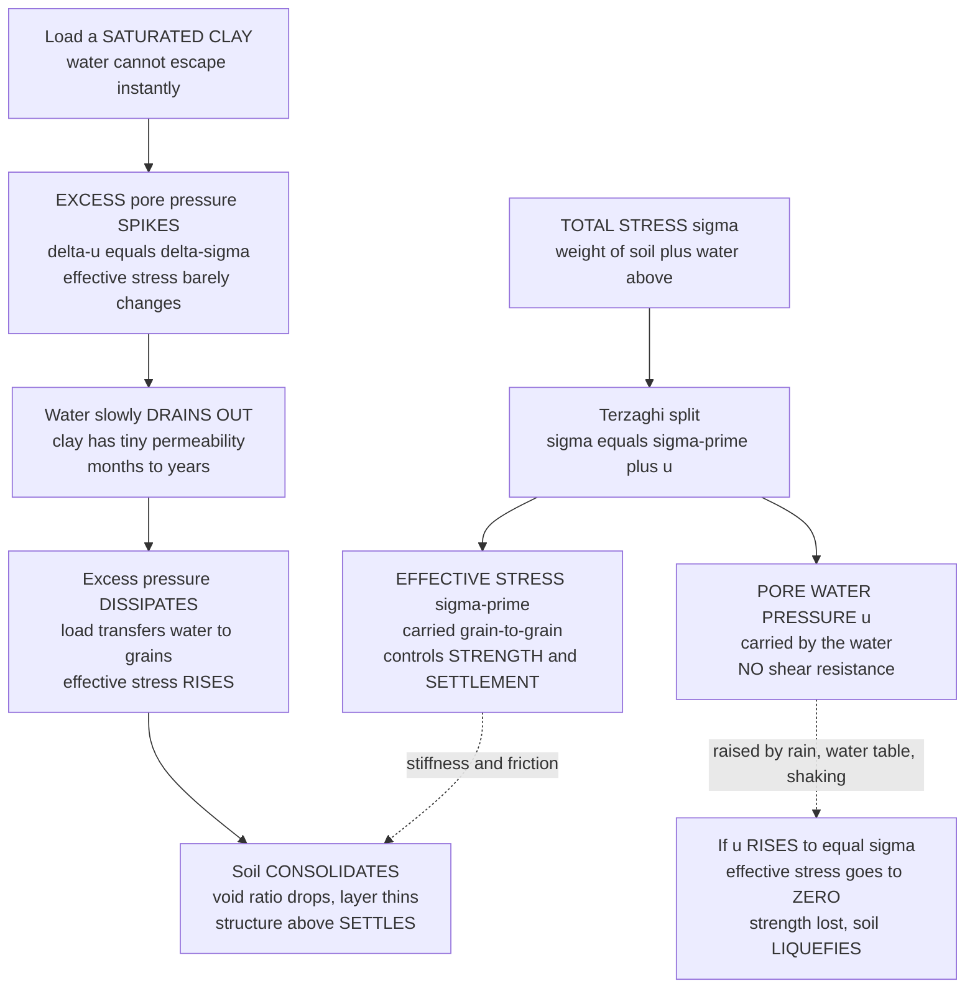

# 🏔️ Effective Stress and Consolidation

> [!abstract] TL;DR
> Here is the single most important idea in all of soil mechanics, and it is beautifully counterintuitive. In a **saturated soil**, the **total stress** $\sigma$ from the overlying weight is *not* carried entirely by the soil grains — the **pore water** in the voids carries part of it as **pore water pressure** $u$. Only the **remainder** — the **effective stress** $\sigma' = \sigma - u$ (Terzaghi, 1925) — is actually transmitted **grain-to-grain**, and *that* effective stress is the only thing that gives soil its **strength** ($\tau_f = c' + \sigma'\tan\phi'$) and controls its **deformation**. This one equation unifies the whole subject: raise the pore pressure — through rain, a rising water table, or earthquake shaking — and you *lower* effective stress and strength, which is the mechanism behind slope failures and **liquefaction** (when $u$ climbs to equal $\sigma$, effective stress goes to zero and the soil loses all strength and flows like a liquid). Now squeeze a saturated **clay**: the grains cannot pack closer until the trapped water slowly **squeezes out**, and because clay barely lets water through, that drainage takes **months to years**. As the water leaves, excess pore pressure dissipates, effective stress rises, and the soil compresses — this is **consolidation**, the slow, inexorable settlement of structures founded on clay. **Terzaghi's one-dimensional consolidation theory** predicts both *how much* settlement (from the $e$–$\log\sigma'$ compression curve and the compression index $C_c$) and *how long* it takes (from the coefficient of consolidation $c_v$ and the time factor $T_v$). The **Leaning Tower of Pisa** is this drama frozen in stone — unequal consolidation of soft clay tilting a tower for eight centuries. Miss effective stress and you miss why buildings settle, why slopes fail, and why the ground turns to soup in an earthquake.

---

## Intuition

**Analogy — a crowd standing shoulder to shoulder in a swimming pool.** Picture a packed crowd of people standing chest-deep in a pool, pressed shoulder to shoulder. Each person still has their full weight — but the **water holds up part of it** (buoyancy), so the amount that each person actually presses down on the pool floor, and the amount they lean on their neighbours' shoulders, is *reduced* by exactly the buoyant support of the water. The **grain-to-grain contact force** between people is their weight *minus* the water's share. That leftover, contact-to-contact pressure is what keeps the crowd rigid and jostling-resistant. Now imagine the water level suddenly rising to their necks: the water carries even more of the load, the shoulder-to-shoulder pressure drops, and the crowd becomes wobbly and easy to push over. If the water ever bore their *entire* weight, they would float free — no contact, no friction, no ability to resist a shove at all.

Soil is exactly this crowd. The **grains are the people**, the **pore water is the pool**, the **total stress** is everyone's full weight, and the **pore water pressure** is the water's buoyant share. What is left — the **effective stress** — is the true grain-to-grain contact pressure, and *only* that effective stress generates friction, strength, and stiffness. Raise the water's share (rain, rising water table, or the violent shaking of an earthquake pumping up the pore pressure) and the grain contacts unclench — the soil weakens, slopes slide, and in the extreme the grains lose all contact and the ground **liquefies** into a heavy fluid. And when you *load* a saturated clay, the grains want to pack closer, but they cannot until the trapped water is forced out through the microscopic pores — a process so slow (clay is nearly watertight) that it plays out over **months or years**, the building above sinking a little more each season. That slow squeezing-out is **consolidation**, and the tilting Tower of Pisa is its most famous monument.

---

## How It Works

### Core Mechanics

1. **Split the total stress.** At any depth in a saturated soil the **total vertical stress** $\sigma$ is the weight of everything above (soil plus water) per unit area. Terzaghi's insight: this total is *shared*. Part is carried by the **pore water pressure** $u$ (a fluid pressure, equal in all directions, that presses grains apart but carries **no shear**), and the rest is carried by the grain skeleton as **effective stress** $\sigma'$. The bookkeeping is simply $\sigma' = \sigma - u$.

2. **Effective stress governs everything mechanical.** Because water cannot resist shear, only the grain-contact force resists sliding. Soil strength follows the **Mohr–Coulomb** law written in *effective* stress, $\tau_f = c' + \sigma'\tan\phi'$, and stiffness (how much the soil compresses) is likewise a function of $\sigma'$, not $\sigma$. Two soils under identical total stress can be rock-solid or on the verge of failure depending entirely on their pore pressure.

3. **Pore pressure has two parts.** The **hydrostatic** (steady-state) part comes from the water table: $u_0 = \gamma_w z_w$, where $z_w$ is the depth below the water table. On top of that sits the **excess** pore pressure $\Delta u$ generated by *change* — a new load, seepage, or dynamic shaking — which is transient and drives (or is driven by) flow.

4. **Load a saturated clay and the water takes the hit first.** Place a foundation load $\Delta\sigma$ on saturated clay. Water is nearly incompressible and the grains cannot instantly move closer, so at the instant of loading the *entire* increment goes into **excess pore pressure**: $\Delta u = \Delta\sigma$, and effective stress barely changes. The soil is momentarily no stronger and no denser than before.

5. **Water drains, pressure dissipates, effective stress rises.** The excess pore pressure sets up a hydraulic gradient that pushes water toward drainage boundaries (sand layers above or below). As water slowly seeps out, $\Delta u$ **dissipates**, and the load transfers from water to grains — $\sigma'$ **rises**. Because clay permeability $k$ is minuscule, this transfer is glacially slow, taking **months to years**.

6. **The soil consolidates and the structure settles.** As effective stress climbs, the grains pack closer, the **void ratio** $e$ drops, and the layer thins — the surface **settles**. The mathematics is a **diffusion equation**, $\dfrac{\partial u}{\partial t} = c_v\dfrac{\partial^2 u}{\partial z^2}$, identical in form to heat conduction, with the **coefficient of consolidation** $c_v = \dfrac{k}{m_v\gamma_w}$ playing the role of a diffusivity. Settlement follows an **S-shaped** curve in time, fast at first and asymptotically slow.

### Flow / Architecture



---

## Key Concepts / Details

### Secondary Level

**Total, pore, and effective stress.** Push down on wet sand at the beach and the water in between the grains helps hold up your foot — the grains do not feel your *whole* weight. Soil engineers give three names to this:
- **Total stress** $\sigma$ — the full push from all the weight above (soil *and* water).
- **Pore water pressure** $u$ — the share carried by the water squeezed between the grains. Water pushes the same in every direction and has **no grip**, so it cannot stop grains from sliding.
- **Effective stress** $\sigma' = \sigma - u$ — the leftover, the *real* squeeze between grain and grain. **This is the number that matters**: it is what makes soil strong and stiff.

**Why the water table is so important.** Below the water table the pores are full of water, and the deeper you go the higher the water pressure ($u = \gamma_w \times$ depth below the table). Raise the water table — after heavy rain or a flood — and $u$ goes up everywhere, so $\sigma' = \sigma - u$ goes **down**. Higher water means *weaker* ground. This is why hillsides slide after storms.

**Consolidation in one picture.** Squeeze a wet sponge and water dribbles out as it thins. A clay layer under a new building is a very slow sponge: the building's weight slowly squeezes water out of the clay, and as the water leaves, the clay shrinks and the building **sinks**. Because clay lets water out so slowly, the sinking can go on for **years**. That slow sinking is **consolidation settlement**, and if one side sinks more than the other, the building **tilts** — the story of the Leaning Tower of Pisa.

**Liquefaction — the extreme.** If the water pressure ever rises to carry the *entire* load, the effective stress becomes **zero**: the grains float apart, the soil loses all strength, and solid-looking ground turns to a heavy liquid. This is what happens under some soils during earthquakes, when buildings tip over or sink into ground that was solid seconds before.

### Undergraduate Level

**The effective stress principle (Terzaghi).** For a saturated soil,
$$\sigma' = \sigma - u,$$
and it is $\sigma'$ — not $\sigma$ — that controls both **shear strength** and **volume change**. Strength follows the effective-stress Mohr–Coulomb criterion
$$\tau_f = c' + \sigma'\tan\phi',$$
so any rise in pore pressure at constant total stress directly reduces the available strength. This single principle is the backbone of slope stability, bearing capacity, lateral earth pressure, and settlement analysis.

**Computing the effective stress profile.** Build it depth by depth:
1. **Total stress** by summing unit weights: $\sigma_v = \sum \gamma_i \, h_i$ (use moist unit weight above the water table, saturated below).
2. **Hydrostatic pore pressure** below the water table: $u = \gamma_w z_w$ (with $\gamma_w \approx 9.81\ \text{kN/m}^3$).
3. **Effective stress** by subtraction: $\sigma_v' = \sigma_v - u$.

A useful shortcut below the water table is the **buoyant (submerged) unit weight** $\gamma' = \gamma_{sat} - \gamma_w$, giving $\sigma_v' = \gamma' z$ directly — the quantitative form of the swimming-pool analogy.

**Compressibility and the $e$–$\log\sigma'$ curve.** Load a clay in an **oedometer** (confined, one-dimensional) and plot **void ratio** $e$ against $\log\sigma'$. In the **virgin compression** range the plot is a straight line whose slope is the **compression index** $C_c$; unload–reload traces a much flatter line of slope $C_r$ (the **recompression index**, $C_r \approx 0.1\text{–}0.2\,C_c$). The stress at which the soil transitions from stiff recompression to soft virgin compression is the **preconsolidation stress** $\sigma_p'$ — the largest effective stress the soil has *ever* felt. The **overconsolidation ratio** is $\text{OCR} = \sigma_p'/\sigma_{v0}'$: normally consolidated ($\text{OCR}=1$) clays are soft and settle a lot; overconsolidated ($\text{OCR}>1$) clays are stiff until the load exceeds $\sigma_p'$.

**Primary consolidation settlement (magnitude).** For a clay layer of thickness $H$, initial void ratio $e_0$, current effective stress $\sigma_{v0}'$, and stress increase $\Delta\sigma$:
- **Normally consolidated:** $\displaystyle S_c = \frac{C_c\,H}{1+e_0}\,\log_{10}\!\frac{\sigma_{v0}'+\Delta\sigma}{\sigma_{v0}'}$
- **Overconsolidated, staying below $\sigma_p'$:** replace $C_c$ with $C_r$.
- **Overconsolidated, crossing $\sigma_p'$:** $\displaystyle S_c = \frac{H}{1+e_0}\left[C_r\log_{10}\!\frac{\sigma_p'}{\sigma_{v0}'} + C_c\log_{10}\!\frac{\sigma_{v0}'+\Delta\sigma}{\sigma_p'}\right]$.

**Time rate of consolidation (duration).** Terzaghi's 1-D theory reduces to the **diffusion equation** $\dfrac{\partial u}{\partial t}=c_v\dfrac{\partial^2 u}{\partial z^2}$. Nondimensionalize with the **time factor**
$$T_v = \frac{c_v\, t}{H_{dr}^2},$$
where $H_{dr}$ is the **longest drainage path** — the *full* layer thickness for single drainage, *half* for double drainage (drainage top and bottom). The **average degree of consolidation** $U$ (fraction of ultimate settlement achieved) is a fixed function of $T_v$: $T_v \approx \tfrac{\pi}{4}U^2$ for $U<60\%$, with $U=50\%$ at $T_v\approx0.197$ and $U=90\%$ at $T_v\approx0.848$. **The dependence on $H_{dr}^2$ is the punchline:** halve the drainage path (add a sand drain) and you consolidate **four times faster**.

**The three phases of settlement.** (1) **Immediate (elastic)** settlement — instantaneous, undrained distortion under load; (2) **primary consolidation** — the time-dependent settlement above as excess pore pressure dissipates; (3) **secondary compression (creep)** — continued, much slower settlement at *constant* effective stress once primary is done, $S_s = \dfrac{C_\alpha H}{1+e_p}\log_{10}\dfrac{t_2}{t_1}$.

### Graduate Level

**Effective stress as a constitutive statement.** Terzaghi's $\sigma' = \sigma - u$ is strictly an approximation valid because soil grains are far stiffer and less compressible than the skeleton. **Biot's** poroelasticity generalizes it to $\sigma' = \sigma - \alpha u$, where the **Biot–Willis coefficient** $\alpha = 1 - K/K_s$ (bulk modulus of the drained skeleton over that of the solid grains) approaches $1$ for soils but is meaningfully less than $1$ for stiff rock. The full **Biot consolidation** theory couples the equilibrium equations to the fluid mass balance and is the parent of Terzaghi's 1-D result; it is what geomechanics codes actually solve for reservoir compaction, subsidence, and induced seismicity.

**Derivation of $c_v$ and the governing PDE.** Combine (i) **Darcy's law** $v = -\dfrac{k}{\gamma_w}\dfrac{\partial u}{\partial z}$, (ii) continuity (rate of volume change equals net outflow), and (iii) the constitutive link $\dfrac{\partial \varepsilon_v}{\partial t} = m_v\dfrac{\partial \sigma'}{\partial t} = -m_v\dfrac{\partial u}{\partial t}$ (at constant total stress, since $\Delta\sigma'=-\Delta u$). The result is $\dfrac{\partial u}{\partial t} = c_v\dfrac{\partial^2 u}{\partial z^2}$ with $c_v = \dfrac{k}{m_v\gamma_w}$. Here $m_v = \dfrac{a_v}{1+e_0}$ is the **coefficient of volume compressibility** and $a_v = -\dfrac{de}{d\sigma'}$. The exact solution for a uniform initial excess pressure with drainage boundaries is the Fourier series
$$U(T_v) = 1 - \sum_{m=0}^{\infty} \frac{2}{M^2}\,e^{-M^2 T_v}, \qquad M = \frac{\pi}{2}(2m+1),$$
which is the S-curve plotted in the demo below.

**Consolidation is diffusion — and the analogy is exact.** The equation is mathematically identical to heat conduction and to molecular diffusion; $c_v$ is a diffusivity with units of (length$^2$/time). Every intuition from diffusion transfers: characteristic time scales as $H_{dr}^2/c_v$, response is self-similar in $z/\sqrt{c_v t}$, and doubling the drainage distance quadruples the time. **Vertical (wick) drains** exploit this directly — by giving the water a short *horizontal* path to a nearby drain, they collapse a decades-long settlement into months, which is why they are installed under embankments and reclaimed land.

**Undrained vs. drained response and the effective stress path.** Loading rate relative to $c_v$ sets the behaviour. **Fast (undrained)** loading generates excess pore pressure per Skempton's $\Delta u = B\left[\Delta\sigma_3 + A(\Delta\sigma_1-\Delta\sigma_3)\right]$; the total stress path and effective stress path diverge, and short-term stability of embankments on soft clay is governed by the *undrained* strength $s_u$. **Slow (drained)** loading keeps $\Delta u \approx 0$ and follows the drained strength. Critically, for many soft clays stability is *worst at end of construction* (undrained) and *improves* with time as consolidation strengthens the soil — the opposite intuition to settlement, which *worsens* with time.

**Liquefaction as $\sigma'\to 0$.** Under cyclic (earthquake) loading, loose saturated sand tends to contract but cannot drain fast enough, so excess pore pressure ratchets up cycle by cycle. When $r_u = \Delta u/\sigma_{v0}' \to 1$, effective stress vanishes, $\tau_f = \sigma'\tan\phi' \to 0$, and the sand flows as a heavy liquid — sand boils, lateral spreading, and the sinking or floating of structures (Niigata 1964, Christchurch 2010–11). The same $\sigma' = \sigma - u$ that explains gentle settlement explains catastrophic failure; it is the through-line of the entire discipline.

**Secondary compression and rate effects.** Once primary consolidation ends, viscous rearrangement of the clay fabric continues as **creep** at essentially constant $\sigma'$, quantified by the secondary compression index $C_\alpha$; the ratio $C_\alpha/C_c$ is roughly constant ($\approx 0.04$ for inorganic clays, higher for organic soils and peats), a robust empirical link. For highly organic soils and peats, secondary compression can dominate the total settlement and continue for the life of the structure.

---

## Python Demo

```python
# EFFECTIVE STRESS AND CONSOLIDATION -- two faces of the same principle sigma' = sigma - u.
#   (a) EFFECTIVE STRESS PROFILE vs depth: total stress, pore pressure, and
#       effective stress in a layered soil with a water table -- plus a "flood"
#       case where a risen water table lowers effective stress toward failure.
#   (b) CONSOLIDATION: settlement vs TIME (Terzaghi 1-D, U vs time factor Tv)
#       -- the slow S-curve -- with the e-log(sigma') compression curve that
#       fixes the TOTAL primary settlement.
import numpy as np
import matplotlib.pyplot as plt

gamma_w = 9.81  # unit weight of water [kN/m^3]

# ==================================================================
# (a) EFFECTIVE STRESS PROFILE  (sigma' = sigma - u)
# ==================================================================
z = np.linspace(0.0, 10.0, 501)          # depth below ground surface [m]
z_wt      = 2.0                           # baseline water table depth [m]
gamma_moist = 17.0                        # moist unit weight above WT [kN/m^3]
gamma_sat   = 20.0                        # saturated unit weight below WT [kN/m^3]

# total vertical stress: integrate unit weight down the profile
gamma_prof = np.where(z <= z_wt, gamma_moist, gamma_sat)
dz = np.diff(z)
sigma_tot = np.concatenate([[0.0], np.cumsum(gamma_prof[1:] * dz)])

# baseline hydrostatic pore pressure and effective stress
u_base    = gamma_w * np.maximum(z - z_wt, 0.0)
sigma_eff = sigma_tot - u_base

# FLOOD case: water table rises to the ground surface (soil fully saturated)
gamma_flood = np.full_like(z, gamma_sat)
sigma_tot_f = np.concatenate([[0.0], np.cumsum(gamma_flood[1:] * dz)])
u_flood     = gamma_w * z                 # WT at surface -> u = gamma_w * z
sigma_eff_f = sigma_tot_f - u_flood       # reduced effective stress

print("EFFECTIVE STRESS PROFILE (at 8 m depth):")
i8 = np.argmin(np.abs(z - 8.0))
print(f"  total sigma   = {sigma_tot[i8]:6.1f} kPa")
print(f"  pore  u       = {u_base[i8]:6.1f} kPa")
print(f"  effective s'  = {sigma_eff[i8]:6.1f} kPa   (baseline WT at {z_wt:.0f} m)")
print(f"  effective s'  = {sigma_eff_f[i8]:6.1f} kPa   (FLOOD: WT at surface -> weaker)")

# ==================================================================
# (b) TERZAGHI 1-D CONSOLIDATION: settlement vs time
# ==================================================================
# Clay layer, DOUBLE drainage (sand above and below)
H_clay = 4.0            # clay layer thickness [m]
H_dr   = H_clay / 2.0   # longest drainage path (double drainage) [m]
cv     = 2.0            # coefficient of consolidation [m^2/year]
e0     = 1.00           # initial void ratio
Cc     = 0.30           # compression index (virgin)
Cr     = 0.05           # recompression index
sig0   = 50.0           # initial effective stress at layer mid-depth [kPa]
sigp   = 80.0           # preconsolidation stress [kPa] -> OCR = 1.6 (overconsolidated)
dsig   = 100.0          # applied stress increase [kPa]  -> final = 150 kPa

# --- TOTAL primary settlement from the e-log(sigma') curve (crosses sigma_p) ---
Sc = H_clay / (1 + e0) * (
        Cr * np.log10(sigp / sig0) +
        Cc * np.log10((sig0 + dsig) / sigp))
print("\nCONSOLIDATION SETTLEMENT:")
print(f"  OCR = {sigp/sig0:.1f} (overconsolidated); final sigma' = {sig0+dsig:.0f} kPa")
print(f"  total PRIMARY settlement Sc = {Sc*1000:6.1f} mm")

# --- degree of consolidation U(Tv) from Terzaghi's Fourier series ---
def U_of_Tv(Tv):
    s = np.zeros_like(Tv, dtype=float)
    for m in range(0, 80):
        M = np.pi / 2.0 * (2 * m + 1)
        s += (2.0 / M**2) * np.exp(-M**2 * Tv)
    return 1.0 - s

t   = np.linspace(0.0, 20.0, 600)         # time [years]
Tv  = cv * t / H_dr**2                     # time factor
U   = U_of_Tv(Tv)                          # fraction of Sc achieved
S_t = U * Sc                               # settlement vs time [m]

# times to reach 50% and 90% consolidation
t50 = 0.197 * H_dr**2 / cv
t90 = 0.848 * H_dr**2 / cv
print(f"  time to 50% consolidation  t50 = {t50:5.2f} yr ({t50*12:4.1f} months)")
print(f"  time to 90% consolidation  t90 = {t90:5.2f} yr ({t90*12:4.1f} months)")

# ==================================================================
# PLOTS
# ==================================================================
fig, ax = plt.subplots(1, 3, figsize=(16, 5.5))

# --- (a) effective stress profile ---
a0 = ax[0]
a0.plot(sigma_tot,   z, color="black",      lw=2.2, label="total stress $\\sigma$")
a0.plot(u_base,      z, color="steelblue",  lw=2.2, label="pore pressure $u$")
a0.plot(sigma_eff,   z, color="seagreen",   lw=2.6, label="effective $\\sigma'$ (WT 2 m)")
a0.plot(sigma_eff_f, z, color="crimson",    lw=2.2, ls="--",
        label="effective $\\sigma'$ (flood)")
a0.axhline(z_wt, color="steelblue", ls=":", lw=1.2)
a0.text(3, z_wt - 0.15, "water table", color="steelblue", fontsize=8)
a0.axvline(0, color="0.5", lw=1)
a0.invert_yaxis()
a0.set_xlabel("stress  [kPa]")
a0.set_ylabel("depth below surface  [m]")
a0.set_title("(a) Effective stress profile\n$\\sigma' = \\sigma - u$")
a0.legend(fontsize=8, loc="lower right")
a0.grid(alpha=0.3)

# --- (b) settlement vs time (the slow S-curve) ---
a1 = ax[1]
a1.plot(t, S_t * 1000, color="darkorange", lw=2.6)
a1.fill_between(t, 0, S_t * 1000, color="darkorange", alpha=0.12)
a1.axhline(Sc * 1000, color="0.4", ls="--", lw=1.2)
a1.text(11, Sc * 1000 - 8, f"ultimate $S_c$ = {Sc*1000:.0f} mm", fontsize=9)
for tx, lab in [(t50, "50%"), (t90, "90%")]:
    a1.axvline(tx, color="gray", ls=":", lw=1)
    a1.text(tx + 0.2, 15, f"{lab}\n{tx:.1f} yr", fontsize=8)
a1.invert_yaxis()
a1.set_xlabel("time  [years]")
a1.set_ylabel("settlement  [mm]")
a1.set_title("(b) Consolidation settlement vs time\nTerzaghi 1-D, double drainage")
a1.grid(alpha=0.3)

# --- (c) e-log(sigma') compression curve ---
a2 = ax[2]
s_re  = np.linspace(sig0, sigp, 50)                 # recompression (stiff, slope Cr)
s_vc  = np.linspace(sigp, sig0 + dsig, 50)          # virgin compression (soft, slope Cc)
e_re  = e0 - Cr * np.log10(s_re / sig0)
e_vc  = e_re[-1] - Cc * np.log10(s_vc / sigp)
a2.semilogx(s_re, e_re, color="purple",     lw=2.4, label=f"recompression $C_r$={Cr}")
a2.semilogx(s_vc, e_vc, color="firebrick",  lw=2.6, label=f"virgin $C_c$={Cc}")
for sx, lab, col in [(sig0, "$\\sigma'_0$", "seagreen"),
                     (sigp, "$\\sigma'_p$", "black"),
                     (sig0 + dsig, "$\\sigma'_0+\\Delta\\sigma$", "darkorange")]:
    a2.axvline(sx, color=col, ls=":", lw=1.2)
    a2.text(sx * 1.02, e0 - 0.005, lab, color=col, fontsize=8, rotation=90, va="top")
a2.set_xlabel("effective stress  $\\sigma'$  [kPa]  (log scale)")
a2.set_ylabel("void ratio  $e$")
a2.set_title("(c) $e$-$\\log\\sigma'$ compression curve\nslope gives settlement magnitude")
a2.legend(fontsize=8, loc="lower left")
a2.grid(alpha=0.3, which="both")

plt.tight_layout()
plt.savefig("effective_stress_and_consolidation.png", dpi=150)
# Expected: at 8 m, sigma~181 kPa, u~59 kPa, sigma'~122 kPa; flood drops sigma' to ~82 kPa.
#           Sc ~ 184 mm; t50 ~ 0.39 yr (~4.7 months), t90 ~ 1.70 yr.
```

Running it prints the effective-stress breakdown (at 8 m depth the $181$ kPa total splits into $59$ kPa of pore pressure and $122$ kPa of effective stress — and a flood that raises the water table to the surface knocks effective stress down to about $82$ kPa, a one-third loss of strength with **no change in the soil at all**). It then reports a total primary settlement of about $184$ mm that takes roughly $4.7$ months to reach 50% and $1.7$ years to reach 90%. **Panel (a)** shows the three stress lines and how the flood case (dashed red) squeezes effective stress toward the failure line at $\sigma'=0$; **panel (b)** is the slow settlement S-curve unfolding over years; **panel (c)** is the $e$–$\log\sigma'$ curve whose stiff recompression and soft virgin branches set *how much* the ground drops.

---

## Real-World Applications

- **The Leaning Tower of Pisa.** The tower sits on soft, layered marine clay that consolidated **unevenly** — more on the south side — tilting the tower over eight centuries of primary and secondary compression. Its late-20th-century stabilization was pure effective-stress engineering: **soil extraction** from the high side let that side settle to match, and drainage/loading measures managed pore pressures to arrest the lean.
- **Foundation and building settlement.** Any structure on clay must be checked for **magnitude** (will differential settlement crack the frame?) and **rate** (will it settle for decades?). Mexico City — built on soft lacustrine clay over an over-pumped aquifer — is sinking by tens of centimetres per year as falling water tables *raise effective stress* and consolidate the clays region-wide; the Palace of Fine Arts has sunk several metres.
- **Embankments and preloading on soft ground.** Highways, airports, and reclaimed land on soft clay are built with a **surcharge preload** (extra fill placed temporarily) plus **prefabricated vertical (wick) drains** that shorten the drainage path from tens of metres to under a metre — squeezing decades of settlement into the construction schedule and leaving the ground stronger. Kansai International Airport's artificial island is a landmark case of managing (and mispredicting) enormous clay consolidation.
- **Slope stability and rainfall-triggered landslides.** Slopes fail when rain infiltration and rising water tables **raise pore pressure**, cutting $\sigma'$ and thus $\tau_f = c' + \sigma'\tan\phi'$ until the driving stress wins. Effective-stress slope analysis and pore-pressure monitoring (piezometers) are the front line of landslide risk management.
- **Earthquake liquefaction.** Cyclic shaking of loose saturated sand ratchets pore pressure up to the total stress, driving $\sigma'\to 0$: foundations sink or float, quays spread laterally, and buried tanks pop up. Niigata (1964), Loma Prieta (1989), and Christchurch (2010–11) are canonical, and liquefaction hazard mapping and ground densification are direct engineering responses.
- **Excavation heave and quick conditions.** Deep excavations below the water table can develop **upward seepage** that drives effective stress to zero at the base — a **quick (boiling) condition** that lets the bottom blow up. Dewatering and cutoff walls are designed on exactly the $\sigma' = \sigma - u$ balance.

---

## Common Pitfalls

- **Using total stress where effective stress belongs.** The most fundamental error in geotechnics. Strength and compressibility depend on $\sigma'$, not $\sigma$. Computing bearing capacity or slope safety from total stress (or forgetting to subtract $u$ after a water-table rise) can badly overestimate stability — the ground is only as strong as its *effective* stress.
- **Ignoring the water table (and its changes).** Effective stress is exquisitely sensitive to pore pressure. A design that is safe with the water table at 5 m can fail with it at the surface after a wet season. Always analyze the **worst-case (highest) water table**, plus artesian or seepage pressures where present.
- **Confusing drainage conditions (drained vs. undrained).** Loading soft clay *fast* is an **undrained** problem (strength $s_u$, no volume change, pore pressure spikes); loading it *slowly* is **drained**. Mixing the two — using drained strength for an end-of-construction stability check on soft clay — is a classic and dangerous mistake, because stability there is usually *worst* right after construction.
- **Forgetting the drainage-path-squared dependence.** Consolidation time scales with $H_{dr}^2$, and $H_{dr}$ is the *longest* path to a drainage boundary — the **full** thickness for single drainage but **half** for double drainage. Miscounting drainage boundaries changes the predicted time by a factor of four.
- **Treating overconsolidated clay like normally consolidated (or vice versa).** Settlement is small and stiff below $\sigma_p'$ and large and soft above it. Skipping the oedometer determination of $\sigma_p'$ — or applying the plain $C_c$ formula to an overconsolidated clay loaded below its preconsolidation stress — overpredicts settlement severalfold and wastes the foundation budget.
- **Neglecting secondary compression.** For organic soils and peats, creep at constant effective stress can dominate the long-term settlement and outlast primary consolidation by decades. A primary-only prediction under-forecasts the total settlement of the structure.
- **Assuming settlement is uniform.** Structures are damaged by **differential** settlement, not uniform settlement. Variable clay thickness or loading tilts the structure (Pisa) and cracks the frame even when the *average* settlement looks acceptable.

---

## Related Concepts

- [[Fluid_Statics_and_Buoyancy]] — pore water pressure *is* fluid statics inside the soil pores ($u = \gamma_w z_w$), and the buoyant unit weight $\gamma' = \gamma_{sat} - \gamma_w$ that gives effective stress below the water table is exactly the buoyancy of the crowd-in-a-pool analogy.
- [[Groundwater_and_Karst]] — the position and movement of the **water table** set the hydrostatic pore pressure that controls effective stress everywhere below it; groundwater seepage generates the excess pore pressures that drive (or dissipate during) consolidation.
- [[Induced_Seismicity_and_Georesource_Geophysics]] — the same $\sigma' = \sigma - u$: injecting fluid raises pore pressure on faults, *lowers* effective normal stress, and un-clamps them into slip (its very alias is "effective stress triggering") — earthquakes engineered by the identical principle that settles a building.
- [[Kinetic_Theory_of_Gases]] — Terzaghi's consolidation equation is a **diffusion equation** whose coefficient $c_v$ is a diffusivity; the molecular diffusion coefficient $D=\tfrac{1}{3}\bar v\lambda$ derived there is the microscopic sibling of the macroscopic squeezing-out of pore water.
- [[Mass_Wasting_and_Slope_Stability]] — rainfall and rising water tables raise pore pressure, cut $\sigma'$ and hence $\tau_f = c' + \sigma'\tan\phi'$, and trigger landslides — the geomorphic face of the effective-stress principle.

*(Sibling Geotechnical notes — Soil_Mechanics_Fundamentals, Shear_Strength_of_Soils, Foundation_Engineering, Slope_Stability_and_Earthworks, and Earthquake_Engineering_and_Seismic_Design — extend this material: soil mechanics fundamentals introduce phase relations and the void ratio behind consolidation, shear strength develops the effective-stress Mohr–Coulomb law used throughout, foundation engineering applies consolidation settlement to footing and raft design, slope stability applies pore pressure to failure surfaces, and earthquake engineering develops the liquefaction case where effective stress falls to zero.)*

---

## Review Questions

1. **Secondary.** A saturated soil sample has a total stress of $200$ kPa and a pore water pressure of $80$ kPa. What is the effective stress, and which of these three numbers actually determines how strong the soil is? In one sentence, explain what happens to the soil's strength if a flood raises the pore pressure to $200$ kPa.
2. **Undergraduate.** A $6$ m clay layer (double drainage) has $c_v = 3\ \text{m}^2/\text{yr}$. (a) Using $T_v$ for $U=90\%$ of about $0.848$, how long until 90% of the consolidation settlement occurs? (b) If a contractor installs vertical drains that effectively make the drainage path one-quarter as long, by what factor does that 90% time change, and why? (c) Sketch how the settlement-vs-time curve differs from the effective-stress-vs-depth profile in what each axis represents.
3. **Graduate.** An embankment is to be built rapidly on soft normally consolidated clay. (a) Explain, using the effective stress principle and drainage conditions, why the *stability* of the embankment is most critical at the **end of construction** yet the *settlement* keeps growing for years afterward. (b) Show how the undrained-then-drained behaviour is captured by $\sigma' = \sigma - u$ with $\Delta u$ first spiking to $\Delta\sigma$ and then dissipating. (c) Contrast this with cyclic liquefaction of loose sand, where the *same* equation leads to $\sigma'\to 0$ and total loss of strength — what makes the two outcomes opposite despite sharing one governing principle?

---

## Sources

- Das, B. M. & Sobhan, K. — *Principles of Geotechnical Engineering*, 9th ed. (Cengage) — effective stress, oedometer testing, and 1-D consolidation.
- Terzaghi, K., Peck, R. B. & Mesri, G. — *Soil Mechanics in Engineering Practice*, 3rd ed. (Wiley) — the origin and definitive treatment of effective stress and consolidation theory.
- Holtz, R. D., Kovacs, W. D. & Sheahan, T. C. — *An Introduction to Geotechnical Engineering*, 2nd ed. (Pearson) — compression indices, preconsolidation stress, and time rate of settlement.
- Lambe, T. W. & Whitman, R. V. — *Soil Mechanics* (Wiley) — the classic conceptual development of effective stress, pore pressure, and stress paths.
- Craig, R. F. (Knappett & Craig) — *Craig's Soil Mechanics*, 8th ed. (CRC Press) — worked consolidation and effective-stress profile examples.

#civil-engineering #effective-stress #consolidation #settlement #pore-pressure
