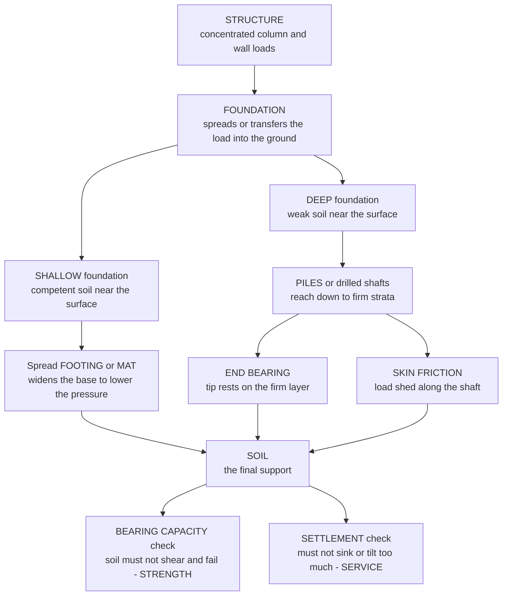

# 🧱 Foundation Engineering

> [!abstract] TL;DR
> A **foundation** is the engineered interface that takes the enormous, *concentrated* weight arriving down a building's columns and walls and delivers it into the *weak, uncertain* ground **safely** — that is, without the soil shearing off underneath (a **bearing-capacity** failure) and without the structure sinking or tilting more than it can tolerate (a **settlement** failure). Every foundation must satisfy **both** criteria: bearing capacity is a **strength** limit (the soil must not fail), and settlement is a **serviceability** limit (the movement must stay small) — and settlement, especially *differential* settlement that cracks and tilts a structure, is very often the one that actually governs. When competent soil sits near the surface you use a **shallow foundation** — a **spread footing** that simply widens the column base like a snowshoe, or a **mat/raft** slab under the whole building that spreads load and bridges soft spots — and size it with **bearing-capacity theory** (Terzaghi: $q_u = c N_c + q N_q + \tfrac{1}{2}\gamma B N_\gamma$) and settlement analysis. When the surface soil is too weak you use a **deep foundation** — **piles** or drilled shafts that reach *down* past the soft layer to firm strata, carrying the load by **end bearing** on their tips plus **skin (shaft) friction** along their sides. Choosing shallow vs. deep, sizing footings for both bearing and settlement, and designing piles for weak sites all depend on a **geotechnical investigation** (borings, SPT/CPT, lab tests) that characterizes the real ground. Because the foundation is where structure meets earth, it is a leading cause of structural distress — from cracked slabs to the Leaning Tower of Pisa — making foundation engineering the literal and figurative foundation of civil engineering.

---

## Intuition

**Analogy — a foundation is a snowshoe for a building, and when the snow near the surface is too soft, it becomes a set of drinking straws pushed down to the firm bottom.** Step onto deep, soft snow in ordinary boots and you punch straight through: your whole body weight is crammed onto two small soles, and the snow cannot carry that pressure. Strap on **snowshoes** and you float — *the same weight, spread over a much larger area, drops the pressure below what the snow can bear.* That is exactly what a **spread footing** does: it flares the bottom of a slender column out into a broad pad of concrete so the pressure delivered to the soil falls to something the soil can safely hold. The whole job of a foundation is to take a load that is *concentrated* and make it *gentle* enough for the earth beneath.

But sometimes the surface is hopeless — soft clay or loose fill for many metres down — and no reasonable snowshoe is wide enough. Then you stop trying to float on the bad soil and instead **reach through it to good ground far below**, the way you would push **drinking straws down through mud until they hit the hard bottom of the glass**. Those straws are **piles**: they carry the building's weight down to a firm layer, transferring it either onto their **tips** where they press on the firm stratum (**end bearing**) or through **friction along their long sides** as they grip the soil (**skin friction**), usually both. And whichever route you take — snowshoe or straws — you must always check two separate things: that the ground will not *break* under the load (**bearing capacity**), and that the building will not *sink or lean* too much even if the ground holds (**settlement**). Foundation engineering is choosing and sizing that interface so a heavy structure and the weak, variable earth can coexist for a hundred years.

---

## How It Works

### Core Mechanics

1. **Characterize the ground first — you design for the soil you actually have.** Before anything is sized, a **geotechnical investigation** drills **borings**, runs in-situ tests (**Standard Penetration Test, SPT**; **Cone Penetration Test, CPT**), and takes samples for lab testing (strength, compressibility, classification). This produces a soil profile — which layers are strong, which are soft, where the water table sits, how each layer will compress. Foundation design is only as good as this characterization; the biggest surprises in geotechnical engineering come from ground that was never explored.

2. **Compute the load the structure delivers.** From the structure's **load path**, each column and wall arrives at foundation level with an axial load (plus any moment). This is the demand the foundation must transmit into the soil.

3. **Choose shallow or deep.** If competent soil lies near the surface, a **shallow foundation** (spread footing or mat) placed a short depth $D_f$ below grade will do. If the near-surface soil is weak or highly compressible, you must go to a **deep foundation** (piles or drilled shafts / caissons) that reaches firm strata below — or improve the ground.

4. **Check bearing capacity (the strength limit).** The soil beneath a footing fails by *shearing* along a curved rupture surface when the pressure gets too high. The **ultimate bearing capacity** for a strip footing (Terzaghi) is
   $$q_u = c\,N_c + q\,N_q + \tfrac{1}{2}\gamma B\,N_\gamma$$
   a **cohesion** term ($c N_c$), a **surcharge/embedment** term ($q N_q$, with $q = \gamma D_f$), and a **width/self-weight** term ($\tfrac{1}{2}\gamma B N_\gamma$). The **bearing-capacity factors** $N_c, N_q, N_\gamma$ grow rapidly with the soil's friction angle $\phi$. Dividing by a **factor of safety** (typically 3) gives the **allowable** bearing pressure; the footing must be wide enough that the applied pressure stays below it.

5. **Check settlement (the serviceability limit).** Even if the soil will not fail, the structure must not move too much. **Immediate (elastic) settlement** happens as the load is applied; **consolidation settlement** develops slowly as water squeezes out of saturated clays over months to years. What damages buildings is usually **differential settlement** — one part sinking more than another — which cracks walls and tilts frames. Settlement often **governs** the design, forcing a larger footing (or a deep foundation) than bearing capacity alone would require.

6. **For deep foundations, sum end bearing and skin friction.** A pile's ultimate capacity is
   $$Q_u = Q_b + Q_s = q_p A_b + \sum f_s\, A_s$$
   the **end-bearing** resistance at the tip ($q_p$ over tip area $A_b$) plus the **skin-friction** resistance integrated along the shaft ($f_s$ over the side area $A_s$). As a pile is pushed deeper, skin friction accumulates along its length and the tip picks up strong end bearing once it reaches a firm layer — the load is **transferred** to the ground gradually along the shaft and abruptly at the tip.

7. **Verify, detail, and consider alternatives.** Confirm both criteria with the chosen factors of safety, check groups (piles interact), watch for special cases (negative skin friction, lateral loads, uplift, expansive soils), and weigh **ground improvement** (compaction, stone columns, grouting) as a way to make a cheaper shallow foundation work where the raw soil could not.

### Flow / Architecture



---

## Key Concepts / Details

### Secondary Level

**Why foundations exist.** A building's weight is funnelled into a few slender columns. If those columns pressed directly onto the soil, the pressure would be far too high and the ground would give way — like standing on soft snow in bare boots. A **foundation** widens the contact so the pressure the soil feels is small enough to carry. It is the last, essential hand-off in a building's journey of load down to the earth.

**Two things every foundation must not do.**
- It must not let the soil **break** underneath (a **bearing-capacity failure** — the ground shears and the building punches down or tips over).
- It must not let the building **sink or lean** too much (a **settlement failure** — even if the soil holds, walls crack and floors slope if the movement is large or uneven).

**Two big families.**
- **Shallow foundations** sit just below the surface when the near-surface soil is strong enough. The everyday type is a **spread footing** — a wide concrete pad under each column (the "snowshoe"). A **mat** (or **raft**) is one huge slab under the entire building.
- **Deep foundations** are used when the surface soil is weak. **Piles** are long columns of concrete, steel, or timber driven or drilled *down* to firm ground — like straws pushed through mud to the hard bottom.

**How a pile holds up a load.** Two ways at once: the **tip** presses on a firm layer at the bottom (**end bearing**), and the **sides** grip the surrounding soil by friction all along the pile (**skin friction**).

**Why the Leaning Tower leans.** Pisa's tower sits on soft, uneven ground on a shallow foundation; one side settled more than the other, and *differential* settlement tilted it. It is the world's most famous foundation-engineering lesson.

### Undergraduate Level

**Terzaghi bearing capacity.** For a shallow strip footing of width $B$ embedded a depth $D_f$, the classical ultimate bearing capacity is
$$q_u = c\,N_c + q\,N_q + \tfrac{1}{2}\gamma B\,N_\gamma, \qquad q = \gamma D_f$$
- $c N_c$ — resistance from soil **cohesion** (dominant in clays).
- $q N_q$ — benefit of **embedment**: the surcharge of soil beside and above the footing base confines the failure surface.
- $\tfrac{1}{2}\gamma B N_\gamma$ — resistance from the **self-weight** of the soil in the failure wedge (grows with footing width $B$, dominant in sands).

The **bearing-capacity factors** are functions of the friction angle $\phi$:
$$N_q = e^{\pi\tan\phi}\tan^2\!\Big(45^\circ+\tfrac{\phi}{2}\Big),\quad N_c=(N_q-1)\cot\phi,\quad N_\gamma = 2(N_q+1)\tan\phi$$
For a **purely cohesive** ($\phi = 0$) soil, $N_c = 5.14$, $N_q = 1$, $N_\gamma = 0$, so $q_u = 5.14\,c_u + \gamma D_f$ — the undrained clay case. **Shape, depth, and inclination factors** correct the strip formula for square/circular footings and inclined loads (Meyerhof, Hansen, Vesić generalizations). The **allowable** bearing pressure is $q_{all} = q_u / FS$ (gross) or a net form, with $FS \approx 3$.

**Net vs. gross, and effective stress.** Bearing capacity is properly written in **effective stress** — below the water table the effective unit weight $\gamma' = \gamma_{sat} - \gamma_w$ replaces $\gamma$, which can roughly halve the width term. A rising water table therefore *reduces* bearing capacity; this ties directly to effective-stress principles.

**Settlement — the check that often governs.** Total settlement of a footing on soil combines:
- **Immediate/elastic settlement** $s_i \approx \dfrac{qB(1-\nu^2)}{E_s}\,I$ (occurs on loading; $E_s$ is the soil modulus, $I$ a shape/rigidity influence factor). Dominant in sands and unsaturated soils.
- **Primary consolidation settlement** $s_c$ in saturated clays, as excess pore pressure dissipates and water is squeezed out — slow (months to years), computed from the clay's compression index and stress change.
- **Secondary compression** (creep) at constant effective stress, important for organic soils.

Codes limit **total settlement** (often 25 mm for footings) and, more critically, **differential settlement** and **angular distortion** (e.g. $\delta/L \le 1/500$ to avoid cracking). Because a footing sized for bearing may still settle too much, the *larger* of the bearing-governed and settlement-governed sizes controls.

**Mat/raft foundations.** When individual footings would nearly touch (columns close, loads high, or soil weak), a single **mat** under the whole footprint is used. It spreads load over the maximum area, **averages out** soft spots (reducing differential settlement), and can act as a **compensated (floating) foundation** — the weight of excavated soil offsets the building weight, dramatically cutting net settlement (used for heavy structures on soft clay).

**Deep foundations — piles and shafts.** When shallow options fail, drive or drill **piles** to a firm stratum. Ultimate capacity is end bearing plus skin friction:
$$Q_u = q_p A_b + \sum f_s A_s.$$
- **End-bearing (point) piles** carry most load on the tip resting on rock or dense sand.
- **Friction (floating) piles** carry most load through shaft friction in reasonably firm soil with no hard layer to reach.
- In **clay**, unit shaft friction is estimated by the **α-method** ($f_s = \alpha c_u$); in **sand**, by the **β-method** ($f_s = \beta \sigma_v'$, i.e. $K\sigma_v'\tan\delta$).
A geotechnical $FS$ of 2–3 (or separate resistance factors in LRFD) is applied.

### Graduate Level

**Bearing-capacity theory and its limits.** Terzaghi's equation assumes a **general shear** failure with a rigid wedge, Prandtl radial-shear zone, and Rankine passive zone — valid for dense/stiff soils. Loose sands and soft clays fail by **local** or **punching shear**, for which reduced factors (or reduced strength parameters, $c^* = \tfrac{2}{3}c$, $\tan\phi^* = \tfrac{2}{3}\tan\phi$) are used. The generalized (Meyerhof/Hansen/Vesić) form multiplies each term by shape $s$, depth $d$, inclination $i$, base-tilt $b$, and ground-slope $g$ factors. For layered soils, eccentric loading (Meyerhof's **effective-width** $B' = B - 2e$), and footings near slopes, closed-form factors are supplemented by limit-equilibrium or finite-element limit analysis. The **factor of safety** on bearing capacity is high (≈3) precisely because $N_\gamma$ and $N_q$ are exponentially sensitive to $\phi$, and $\phi$ is uncertain.

**Consolidation coupling.** Settlement of footings and mats on clay is a **time-dependent, coupled** problem governed by Terzaghi's consolidation theory: the rate is set by the coefficient of consolidation $c_v$ and drainage-path length ($T_v = c_v t / H_{dr}^2$), while the magnitude comes from the clay's compressibility and the induced stress increment (Boussinesq/Newmark stress distribution beneath the footing). Preloading, surcharging, and prefabricated vertical (wick) drains are used to *accelerate* and *pre-empt* consolidation settlement before construction — an explicit engineering of the serviceability limit.

**Pile group effects.** Piles are rarely single. A **group** interacts: driven piles in sand can **densify** and gain capacity, while in clay the **block failure** mode and overlapping stress bulbs give a group efficiency $\eta = Q_{group}/(nQ_{single}) < 1$. Group **settlement** is much larger than a single pile's because the combined stress bulb reaches far deeper — a group of short piles can settle like a large deep footing. **Negative skin friction (downdrag)** is a critical special case: when soft soil around a pile consolidates (from fill placement or dewatering) it settles *relative to* the pile and drags *down* on it, adding load instead of resisting it — this can overload end-bearing piles and must be estimated and detailed against (e.g. bitumen coatings, sleeving).

**Laterally loaded piles and soil–structure interaction.** Wind, seismic, and earth-pressure loads apply **lateral** force and moment at pile heads. The response is modelled with the **beam-on-nonlinear-Winkler-foundation (p–y)** method — the soil represented by depth-dependent nonlinear springs $p(y)$ — capturing head deflection, maximum moment, and depth of fixity. Under earthquakes this couples with **liquefaction** (loss of soil strength as pore pressure spikes), one of the most severe foundation hazards, and with **kinematic** demands as the ground itself deforms around the piles.

**Load and resistance factor design for foundations.** Modern codes (AASHTO LRFD, Eurocode 7, ACI/IBC) move from a single global $FS$ to **partial/resistance factors** calibrated to a target reliability index, applying separate factors to soil strength, end bearing, and shaft friction (which have different variabilities and are verified differently — e.g. shaft friction confirmed by static or dynamic load tests, PDA, or CAPWAP). **Load testing** (static, Osterberg cell, dynamic) directly measures capacity and load transfer and can justify reduced factors, reflecting the deep uncertainty inherent in "designing against the ground."

---

## Python Demo

```python
# Foundation engineering -- the two design checks, made concrete:
#   (a) BEARING CAPACITY (strength):   Terzaghi qu = c*Nc + q*Nq + 0.5*gamma*B*Ngamma.
#       Plot allowable bearing pressure vs footing width B and the applied
#       pressure P/B^2, and read off the required footing size.
#   (b) SETTLEMENT (serviceability):   elastic settlement vs applied pressure,
#       showing that the 25 mm limit often governs a SMALLER allowable pressure
#       than bearing capacity does.
#   (c) PILE LOAD TRANSFER (deep foundation): a pile driven through soft clay to
#       dense sand -- capacity accumulates as skin friction along the shaft plus
#       end bearing at the tip, jumping once the tip reaches the firm stratum.
import numpy as np
import matplotlib.pyplot as plt

# ==================================================================
# (a) BEARING CAPACITY -- Terzaghi, a c-phi soil
# ==================================================================
c      = 10.0        # cohesion [kPa]
phi    = 25.0        # friction angle [deg]
gamma  = 18.0        # unit weight [kN/m^3]
Df     = 1.5         # embedment depth [m]
FS     = 3.0         # factor of safety on bearing capacity
P_col  = 1500.0      # service column load [kN] (square footing, B x B)

phir = np.radians(phi)
Nq   = np.exp(np.pi * np.tan(phir)) * np.tan(np.radians(45 + phi / 2.0)) ** 2
Nc   = (Nq - 1.0) / np.tan(phir)
Ng   = 2.0 * (Nq + 1.0) * np.tan(phir)          # N_gamma (Vesic)
q    = gamma * Df                                # surcharge at footing base [kPa]

B          = np.linspace(0.8, 4.0, 300)          # footing width [m]
qu         = c * Nc + q * Nq + 0.5 * gamma * B * Ng     # ultimate bearing capacity [kPa]
q_allow    = qu / FS                             # allowable (strength) [kPa]
q_applied  = P_col / B**2                         # pressure the footing delivers [kPa]

# required width where applied pressure = allowable bearing pressure
B_req_bear = B[np.argmin(np.abs(q_applied - q_allow))]

print("BEARING-CAPACITY FACTORS (phi = %.0f deg):  Nc=%.1f  Nq=%.1f  Ngamma=%.1f"
      % (phi, Nc, Nq, Ng))
print("  required footing width for BEARING  = %.2f m" % B_req_bear)

# ==================================================================
# (b) SETTLEMENT -- elastic settlement of the footing, serviceability limit
# ==================================================================
Es   = 12000.0       # soil modulus [kPa] (medium sand / stiff clay)
nu   = 0.30          # Poisson ratio
Ip   = 0.88          # rigidity/shape influence factor (rigid square)
Bfix = 2.5           # a trial footing width [m]
s_allow = 0.025      # allowable total settlement [m] = 25 mm

q_press = np.linspace(0, 400, 300)               # applied pressure [kPa]
s_elas  = q_press * Bfix * (1 - nu**2) * Ip / Es  # elastic settlement [m]
q_allow_settle = s_allow * Es / (Bfix * (1 - nu**2) * Ip)   # pressure giving 25 mm

# bearing-governed allowable pressure at the SAME width, for comparison
qu_fix      = c * Nc + q * Nq + 0.5 * gamma * Bfix * Ng
q_allow_fix = qu_fix / FS

print("\nSETTLEMENT vs BEARING at B = %.1f m:" % Bfix)
print("  allowable pressure from BEARING     = %.0f kPa" % q_allow_fix)
print("  allowable pressure from SETTLEMENT  = %.0f kPa  <-- governs (smaller)"
      % q_allow_settle)

# ==================================================================
# (c) PILE LOAD TRANSFER -- soft clay 0-8 m over dense sand 8-15 m
# ==================================================================
d      = 0.40                     # pile diameter [m]
perim  = np.pi * d                # shaft perimeter [m]
A_tip  = np.pi * d**2 / 4.0       # tip area [m^2]
z_clay = 8.0                      # soft clay thickness [m]
z_max  = 15.0                     # pile length [m]
dz     = 0.05
z      = np.arange(dz, z_max + dz, dz)

# unit skin friction fs(z): low, constant in clay; higher, rising in sand
fs = np.where(z <= z_clay, 27.0, 40.0 + 9.0 * (z - z_clay))     # [kPa]
# unit end bearing qp(z): small in clay, large in dense sand
qp = np.where(z <= z_clay, 250.0, 250.0 + 500.0 * (z - z_clay)) # [kPa]

Q_skin = perim * np.cumsum(fs * dz)     # cumulative shaft friction if tip at z [kN]
Q_end  = qp * A_tip                     # end bearing if tip at z [kN]
Q_tot  = Q_skin + Q_end                 # total ultimate capacity if tip at z [kN]

FS_pile = 2.5
Q_allow_pile = Q_tot[-1] / FS_pile
print("\nPILE (d = %.2f m, L = %.0f m):  skin=%.0f kN  end=%.0f kN  ->  Qu=%.0f kN"
      % (d, z_max, Q_skin[-1], Q_end[-1], Q_tot[-1]))
print("  allowable pile load (FS=%.1f)       = %.0f kN" % (FS_pile, Q_allow_pile))

# ==================================================================
# PLOTS
# ==================================================================
fig, ax = plt.subplots(1, 3, figsize=(16, 5.5))

# --- (a) bearing capacity vs footing width ---
a0 = ax[0]
a0.plot(B, q_allow,   color="seagreen", lw=2.5, label="allowable bearing  qu/FS")
a0.plot(B, q_applied, color="crimson",  lw=2.5, label="applied pressure  P/B^2")
a0.axvline(B_req_bear, color="black", ls="--", lw=1.2)
a0.fill_between(B, q_applied, q_allow, where=(q_allow >= q_applied),
                color="seagreen", alpha=0.12)
a0.set_xlabel("Footing width  B  [m]")
a0.set_ylabel("Bearing pressure  [kPa]")
a0.set_title("(a) BEARING CAPACITY check\nwiden B until allowable > applied")
a0.set_ylim(0, 900)
a0.legend(loc="upper right", fontsize=9)
a0.grid(alpha=0.3)
a0.annotate("B_req = %.2f m" % B_req_bear,
            xy=(B_req_bear, P_col / B_req_bear**2),
            xytext=(B_req_bear + 0.4, 620),
            arrowprops=dict(arrowstyle="->"))

# --- (b) settlement vs pressure (serviceability) ---
a1 = ax[1]
a1.plot(q_press, s_elas * 1000, color="steelblue", lw=2.5, label="elastic settlement")
a1.axhline(s_allow * 1000, color="darkorange", ls="--", lw=1.5, label="25 mm limit")
a1.axvline(q_allow_settle, color="black", ls=":", lw=1.2)
a1.axvline(q_allow_fix, color="seagreen", ls=":", lw=1.2)
a1.set_xlabel("Applied pressure  q  [kPa]")
a1.set_ylabel("Settlement  [mm]")
a1.set_title("(b) SETTLEMENT check\nservice limit sets a lower allowable q")
a1.legend(loc="upper left", fontsize=9)
a1.grid(alpha=0.3)
a1.annotate("settlement\ngoverns\n%.0f kPa" % q_allow_settle,
            xy=(q_allow_settle, s_allow * 1000),
            xytext=(q_allow_settle - 130, 34),
            arrowprops=dict(arrowstyle="->"), fontsize=8)
a1.annotate("bearing\n%.0f kPa" % q_allow_fix,
            xy=(q_allow_fix, 8), xytext=(q_allow_fix + 10, 6), fontsize=8)

# --- (c) pile load transfer with depth ---
a2 = ax[2]
a2.plot(Q_skin, z, color="mediumpurple", lw=2.5, label="skin friction (cumulative)")
a2.plot(Q_end,  z, color="darkorange",   lw=2.0, label="end bearing at tip")
a2.plot(Q_tot,  z, color="black",        lw=2.8, label="total capacity  Qu")
a2.axhline(z_clay, color="saddlebrown", ls="--", lw=1.2)
a2.text(Q_tot[-1] * 0.02, z_clay - 0.4, "soft clay", color="saddlebrown", fontsize=9)
a2.text(Q_tot[-1] * 0.02, z_clay + 1.0, "dense sand", color="saddlebrown", fontsize=9)
a2.invert_yaxis()                                  # depth increases downward
a2.set_xlabel("Pile capacity if tip at this depth  [kN]")
a2.set_ylabel("Depth  z  [m]")
a2.set_title("(c) PILE load transfer\nreach past soft soil to firm strata")
a2.legend(loc="lower right", fontsize=9)
a2.grid(alpha=0.3)

plt.tight_layout()
plt.savefig("foundation_engineering.png", dpi=150)
# Expected (approx): required B ~ 2.5 m for bearing; settlement caps q ~ 150 kPa
# vs bearing ~ 246 kPa (settlement governs); pile Qu ~ 1300-1400 kN.
```

Running it prints the Terzaghi bearing-capacity factors for $\phi = 25^\circ$ ($N_c \approx 20.7$, $N_q \approx 10.7$, $N_\gamma \approx 10.9$), the footing width needed to satisfy **bearing** (about $2.5$ m for a $1500$ kN column), and then the punchline of panel (b): at that width the **settlement** limit caps the allowable pressure near $150$ kPa while bearing capacity alone would have allowed about $246$ kPa — so **serviceability governs**, exactly as it so often does in practice. Panel (c) shows a pile's capacity building up as **skin friction** accumulates down the shaft and then leaping as **end bearing** engages the dense sand once the tip pushes past the soft clay — a visual of load transfer to firm strata.

---

## Real-World Applications

- **Every building on Earth.** Low-rise houses and mid-rise frames on decent soil use **spread footings**; heavy or closely spaced columns and weak soils use a **mat/raft**. Sizing each footing for both bearing and settlement is the bread-and-butter of geotechnical and structural practice.
- **High-rises on soft ground.** Towers in cities founded on clay (Mexico City, Shanghai, Chicago) use deep **pile groups** or **piled rafts** reaching competent strata, and often **compensated (floating)** mats where the excavated soil weight offsets the building — the strategy that lets skyscrapers stand on soft deltas.
- **Bridges.** Bridge piers and abutments almost always sit on **drilled shafts** or **driven piles** carried to rock or dense soil, designed for gravity, scour (loss of streambed around the foundation), and lateral/seismic loads via **p–y** analysis.
- **The Leaning Tower of Pisa.** The archetypal **differential-settlement** case: a shallow foundation on soft, variable clay tilted the tower over centuries; its late-1990s stabilization removed soil from the high side to *reduce* the lean — foundation engineering applied to a 12th-century mistake.
- **Offshore and transmission structures.** Wind-turbine monopiles, offshore platforms, and transmission towers are dominated by **lateral and uplift** capacity of deep foundations, where skin friction and moment resistance — not just vertical bearing — control the design.
- **Ground improvement instead of going deep.** Where piles would be costly, engineers **improve the soil** — dynamic compaction, vibro **stone columns**, deep soil mixing, or **preloading with wick drains** to pre-consolidate clay — turning a marginal site into one a shallow foundation can serve.

---

## Common Pitfalls

- **Designing for bearing capacity but forgetting settlement.** The classic error. A footing can be perfectly safe against shear failure and still settle (or *differentially* settle) enough to crack the building. On compressible soils, **settlement usually governs** and must be checked explicitly — bearing capacity alone is not enough.
- **Inadequate site investigation.** Too few borings, missing the soft layer, or not finding the water table leads to a foundation designed for soil that is not there. Ground variability is the number-one source of foundation surprises; you cannot design what you have not explored.
- **Ignoring the water table.** Bearing capacity is an **effective-stress** phenomenon: a high water table lowers the effective unit weight and can nearly halve the width term, and it changes settlement and pile friction. Using total-stress unit weights above the table for saturated soil is unconservative.
- **Mis-estimating differential settlement.** Uniform settlement is largely harmless (the whole building drops together); it is **differential** settlement and **angular distortion** that crack and tilt structures. Designing to a total-settlement limit while ignoring the differential can still produce damage.
- **Neglecting negative skin friction (downdrag).** When soft soil around a pile consolidates — after fill placement or dewatering — it drags *down* on the pile, *adding* load instead of supporting it. Treating that shaft friction as resistance rather than demand can overload the pile.
- **Overestimating pile-group capacity.** A group is not simply $n$ times a single pile: efficiency in clay is below one, block failure may control, and group **settlement** is far larger than a single pile's because the combined stress bulb reaches much deeper.
- **Forgetting eccentricity, moment, and uplift.** Columns deliver moments and lateral loads, and wind/seismic can cause **uplift**. A footing sized only for concentric vertical load may overstress one edge (Meyerhof's effective width) or lift off entirely.
- **Building on expansive or collapsible soils without special measures.** Expansive clays heave and shrink with moisture and collapsible loess settles suddenly on wetting; ordinary footings on them fail regardless of nominal bearing capacity unless the soil behavior is specifically addressed.

---

## Related Concepts

- [[Statics_and_Equilibrium]] — a foundation is a free-body problem: the soil reaction must balance the structural load and any moment, and eccentric loading is resolved with $\sum F = 0$ and $\sum M = 0$ exactly as in rigid-body statics.
- [[Stress_Strain_and_Deformation]] — bearing capacity is a soil **strength** (stress-at-failure) limit and settlement is a soil **deformation** limit; the two design criteria are the geotechnical faces of stress and strain applied to the ground.
- [[Stress_Strain_and_Elastic_Moduli]] — immediate footing settlement scales as $qB(1-\nu^2)/E_s$, so the soil's **elastic modulus** and Poisson ratio set the serviceability response, directly paralleling elastic-modulus behavior in solids.
- [[Weathering_and_Soils]] — foundations rest on the products of **weathering**; whether the near-surface material is competent residual soil or soft transported clay decides shallow-vs-deep, linking soil formation to foundation choice.
- [[Ground_Penetrating_Radar_and_Near_Surface_Geophysics]] — the geotechnical investigation that feeds every foundation design increasingly uses **near-surface geophysics** (GPR, seismic refraction, resistivity) alongside borings to map layers, bedrock depth, and the water table before drilling.

*(Sibling Geotechnical Engineering notes extend this material: Soil_Mechanics_Fundamentals establishes the phase relationships, classification, and stresses that all foundation calculations use; Effective_Stress_and_Consolidation supplies the consolidation-settlement theory behind the serviceability check and the effective-stress form of bearing capacity; Shear_Strength_of_Soils provides the $c$ and $\phi$ (and $c_u$) parameters that drive the bearing-capacity factors and pile friction; Retaining_Walls_and_Lateral_Earth_Pressure is the lateral-load companion that shares the same soil strength and effective-stress foundations; and Structural_Loads_and_Load_Paths delivers the column and wall loads that the foundation must transmit into the ground — the demand side of every foundation design.)*

---

## Review Questions

1. **Secondary.** Explain, using the snowshoe analogy, why widening a column's base into a footing keeps a heavy building from sinking into the soil. Then describe, in one sentence each, the *two* different things a foundation must prevent (name them) and give an example of a famous structure that failed the second one.
2. **Undergraduate.** A $2.0\text{ m} \times 2.0\text{ m}$ square footing is embedded $D_f = 1.5$ m in a soil with $c = 10$ kPa, $\phi = 25^\circ$, and $\gamma = 18$ kN/m³. Using Terzaghi's equation and $N_c \approx 20.7$, $N_q \approx 10.7$, $N_\gamma \approx 10.9$, compute the ultimate bearing capacity $q_u$ and the allowable bearing pressure with $FS = 3$. Would a $1500$ kN column load be safe against bearing failure on this footing — and why might the footing still be inadequate even if the answer is "yes"?
3. **Graduate.** A row of end-bearing piles is driven through 8 m of soft, normally consolidated clay to dense sand, and afterward a 3 m fill is placed over the site. (a) Explain the **negative skin friction / downdrag** mechanism that develops on these piles and why it *adds* to, rather than resists, the load. (b) Why does the same fill make a nearby **shallow** foundation infeasible? (c) Describe one measure to reduce downdrag on the piles and one ground-improvement measure that could have made a shallow foundation viable instead.

---

## Sources

- Das, B. M. & Sivakugan, N. — *Principles of Foundation Engineering*, 9th ed. (Cengage)
- Bowles, J. E. — *Foundation Analysis and Design*, 5th ed. (McGraw-Hill)
- Coduto, D. P. — *Foundation Design: Principles and Practices*, 3rd ed. (Pearson)
- Terzaghi, K., Peck, R. B. & Mesri, G. — *Soil Mechanics in Engineering Practice*, 3rd ed. (Wiley)
- Salgado, R. — *The Engineering of Foundations, Slopes and Retaining Structures*, 2nd ed. (CRC Press)

#civil-engineering #foundations #bearing-capacity #piles #settlement
