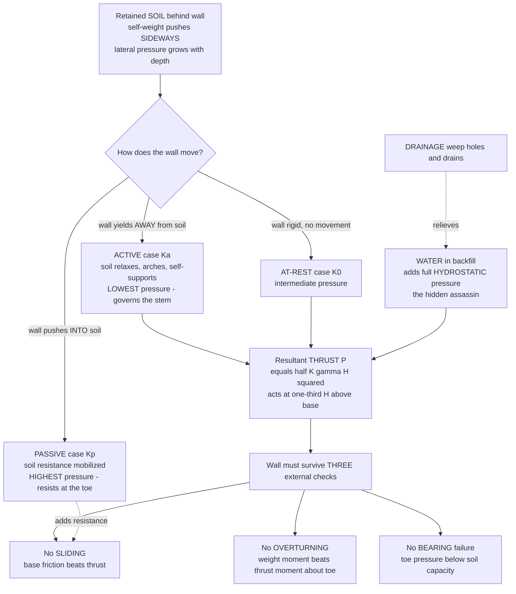

# 🧱 Retaining Walls and Lateral Earth Pressure

> [!abstract] TL;DR
> Pile soil up behind a wall and it does not just press **down** — it shoves **sideways**, straining to spread out and collapse into its natural slope. A **retaining wall** is the stubborn barrier that holds back that sideways shove, and the hard question is rarely *"how strong is the wall?"* but *"how hard does the soil push?"* That horizontal push — the **lateral earth pressure** — is set not by the wall's strength but by **how the wall moves**: let the wall yield a hair *away* from the soil and the soil relaxes, arches, and half-supports itself, giving the surprisingly small **active** pressure (coefficient $K_a$) that governs the wall's stem; hold it perfectly rigid and you get the larger **at-rest** pressure ($K_0$); shove the wall *into* the soil and you mobilize the huge **passive** resistance ($K_p$) used on the buried toe. **Rankine** and **Coulomb** theory give these coefficients from the soil's friction angle ($K_a = \tan^2(45^\circ - \phi/2)$, $K_p = 1/K_a$ for the simplest case), and because pressure grows linearly with depth the load is a **triangle** whose resultant **thrust** acts at one-third of the height. The wall then has to pass three **external stability** checks — it must not **slide**, must not **overturn** about its toe, and must not exceed the soil's **bearing capacity** — plus be strong enough internally. And lurking behind all of it is the hidden assassin: **water**. Let the backfill saturate and **hydrostatic pressure** piles on top of the earth pressure, often *doubling* the load, which is why so many retaining walls fail after heavy rain — and why the humble **weep hole and drainage layer** behind a wall is one of the highest-leverage details in all of geotechnical engineering.

---

## Intuition

**Analogy — soil is a slow, dry liquid that never stops trying to flatten itself, and the wall is what stands in its way.** Pour a bucket of dry sand onto the ground and it does not stay in a tidy column; it slumps into a cone, a shallow pile with gently sloping sides. That slope angle is no accident — it is roughly the sand's **angle of repose**, the steepest it can stand on its own. Now imagine you want the ground behind your house to be a *vertical* cliff of soil instead of a gentle slope. The soil hates that. Every grain leans on the grains below and beside it, and the whole mass is quietly, relentlessly trying to slide down and flatten out into that natural cone. The **retaining wall** is the thing you jam in the way to stop it — and the force it feels is the soil's frustrated attempt to collapse, pushing *sideways*.

Here is the twist that makes the subject deep rather than obvious. **How hard the soil pushes depends on whether the wall lets it move.** If the wall gives just slightly — leans away by a fraction of a percent of its height — the soil grains rearrange, lock together into arches, and hold a good part of their own weight, so the wall only feels the small leftover: the **active** case. If the wall is bolted rigid, the soil cannot relax and pushes harder: the **at-rest** case. And if you drive the wall *into* the soil (as the buried toe does when the wall tries to slide), the soil bunches up and pushes back enormously: the **passive** case. So the same pile of dirt can push with wildly different force depending on a millimetre of wall movement — which is why "the soil load" is a verb, not a number.

And then there is **water**, the quiet killer of walls. Dry soil pushes sideways with only a *fraction* of its weight (the active coefficient is often around one-third). But water in the saturated backfill pushes sideways with its **full** weight — water has no friction angle, no arching, no self-support; it presses equally in all directions. So a wall that was fine when dry can be overwhelmed after a storm, when rain fills the backfill and adds a full **hydrostatic** triangle on top of the earth-pressure triangle. Countless walls have failed not because the engineer misjudged the soil, but because a clogged drain let the water rise. The lesson every geotechnical engineer learns early: **drain the backfill, or the water will take the wall.**

---

## How It Works

### Core Mechanics

1. **The retained soil pushes horizontally, and the push grows with depth.** A soil mass behind a wall exerts a **lateral (horizontal) pressure** on it. Because the vertical stress in soil increases with depth ($\sigma_v = \gamma z$), and the horizontal pressure is a fraction $K$ of that vertical stress ($\sigma_h = K\,\sigma_v$), the pressure distribution is a **triangle** — zero at the surface, maximum at the base. Integrating the triangle gives the **resultant thrust** per unit length of wall, $P = \tfrac{1}{2} K \gamma H^2$, acting at **one-third of the height** above the base (the centroid of a triangle).

2. **The coefficient $K$ depends entirely on how the wall moves.** This is the crux. The lateral-to-vertical stress ratio $K$ is not a soil constant — it slides between three regimes:
   - **At-rest ($K_0$):** the wall does not move at all (a rigid basement wall, a wall braced against deflection). The soil is locked in place. $K_0 \approx 1 - \sin\phi$ (Jaky's equation).
   - **Active ($K_a$):** the wall yields *away* from the backfill by a tiny amount (roughly $0.001H$ for sand). The soil expands laterally, mobilizes its internal friction, arches, and reaches **incipient failure** on inclined slip planes — pushing with the **minimum** possible pressure. This is the design pressure for the stem of most walls, because real walls do deflect. $K_a < K_0$.
   - **Passive ($K_p$):** the wall is pushed *into* the soil (the buried toe as the wall tries to slide). The soil is compressed to failure the other way, resisting with the **maximum** possible pressure. $K_p > 1 > K_0 > K_a$, and $K_p$ can be an order of magnitude larger than $K_a$.

3. **Rankine and Coulomb theories supply the coefficients.** For a smooth vertical wall retaining a level, cohesionless backfill, **Rankine** theory gives the clean results $K_a = \tan^2\!\left(45^\circ - \tfrac{\phi}{2}\right) = \dfrac{1-\sin\phi}{1+\sin\phi}$ and $K_p = \tan^2\!\left(45^\circ + \tfrac{\phi}{2}\right) = \dfrac{1+\sin\phi}{1-\sin\phi} = 1/K_a$, where $\phi$ is the soil's **friction angle**. **Coulomb** theory is more general — it accounts for **wall friction** ($\delta$), a sloping backfill, and a battered wall face by analyzing the equilibrium of a sliding soil wedge — and is the basis of most design charts.

4. **Water changes everything.** The formulas above use the **effective** unit weight and the soil's shear strength, which live in the *grain skeleton*. If the backfill saturates, two things happen: the effective vertical stress uses the **buoyant** unit weight $\gamma' = \gamma_{sat} - \gamma_w$ (so the *earth* part of the pressure actually shrinks), **but** a full **hydrostatic** pressure $u = \gamma_w z$ is added on top, and water is pushed sideways with coefficient $1$ (not $K_a$). Because $\gamma_w \approx 9.81\ \text{kN/m}^3$ enters at full strength while soil enters reduced by $K_a \approx 0.3$, the water term usually **dominates** — a saturated wall can carry more than twice the thrust of the same wall drained. Hence **drainage** (weep holes, granular drains, geocomposite drains) is not an optional nicety; it is a primary structural element.

5. **The wall must pass three external stability checks.** Treating the wall-plus-retained-wedge as a rigid body, equilibrium (Newton's laws with zero acceleration) demands:
   - **Sliding:** the base friction (plus any passive resistance at the toe) must exceed the horizontal thrust, $\text{FoS}_{slide} = \dfrac{\mu W + P_p}{P_{a,h}} \ge 1.5$.
   - **Overturning:** the stabilizing moment of the wall's weight about the toe must exceed the overturning moment of the thrust, $\text{FoS}_{OT} = \dfrac{M_{resist}}{M_{overturn}} \ge 2.0$.
   - **Bearing:** the pressure the base delivers to the foundation soil must stay below its bearing capacity, and the load resultant should stay within the **middle third** of the base ($e \le B/6$) so the toe does not lift and no tension develops.

6. **Then the wall is designed internally.** Once the wall is stable as a rigid body, its own material must carry the internal forces — the stem acts as a **vertical cantilever beam** bending under the earth-pressure triangle, the heel and toe are cantilever slabs, and each is reinforced or sized accordingly.

### Flow / Architecture



---

## Key Concepts

### Secondary Level

- **Soil pushes sideways, not just down.** A pile of soil behind a wall leans on the wall and tries to spread out and collapse into a gentle natural slope (its **angle of repose**). The horizontal force it exerts is the **lateral earth pressure**, and the wall exists to hold it back.
- **Deeper means harder.** The pressure is small near the top of the wall and largest at the bottom — it grows steadily with depth, forming a **triangle**. That is why retaining walls are usually thicker at the base: that is where the push is strongest.
- **A wall that gives a little feels less.** Surprisingly, a wall that can lean away from the soil ever so slightly feels **less** push than a perfectly rigid one, because the soil settles into a self-supporting arrangement. This gentler case is called **active** pressure. A wall shoved *into* the soil feels **much more** push — the **passive** case.
- **Water is the enemy.** When rain soaks the soil behind a wall, water pressure adds to the soil pressure and can push the wall over. This is the most common cause of retaining-wall failure. The fix is simple and cheap: **drainage** — small **weep holes** and a gravel drain that let the water escape before it builds up.
- **Three ways a wall can fail.** It can **slide** forward along its base, **tip over** (overturn) about its front edge, or **sink/crush** the soil beneath it (bearing failure). A good design checks all three.

### Undergraduate Level

- **The three pressure states and their coefficients.** The horizontal stress is $\sigma_h = K\,\sigma_v'$ where $\sigma_v'$ is the vertical *effective* stress. The coefficient depends on wall movement:
  - **Active:** $K_a = \tan^2\!\left(45^\circ - \tfrac{\phi}{2}\right) = \dfrac{1-\sin\phi}{1+\sin\phi}$ (Rankine, level cohesionless backfill).
  - **At-rest:** $K_0 \approx 1 - \sin\phi$ (Jaky, normally consolidated soil).
  - **Passive:** $K_p = \tan^2\!\left(45^\circ + \tfrac{\phi}{2}\right) = 1/K_a$.
  For $\phi = 30^\circ$: $K_a = 0.33$, $K_0 = 0.50$, $K_p = 3.0$ — a ninefold range from active to passive.
- **Thrust and its line of action.** For a dry, homogeneous backfill of height $H$ and unit weight $\gamma$, the resultant active thrust per metre of wall is $P_a = \tfrac{1}{2} K_a \gamma H^2$, acting horizontally at $H/3$ above the base. Passive resistance on an embedded depth $D$ is $P_p = \tfrac{1}{2} K_p \gamma D^2$.
- **Cohesion and tension cracks.** For a $c$–$\phi$ soil (e.g. clay), Rankine active pressure is $\sigma_a = K_a \sigma_v' - 2c\sqrt{K_a}$. The $-2c\sqrt{K_a}$ term makes the pressure **negative** (tension) near the surface down to the **tension-crack depth** $z_c = \dfrac{2c}{\gamma\sqrt{K_a}}$. Soil cannot pull on the wall, so that tension is ignored — and worse, if the crack fills with water, full hydrostatic pressure acts in it. Never rely on a clay's short-term cohesion for a permanent wall.
- **Water and effective stress.** With a water table in the backfill, split the pressure: the **earth** part uses the buoyant weight $\gamma'$ below the water table, and a separate **hydrostatic** triangle $u = \gamma_w z$ is added. Total lateral load $= \tfrac{1}{2}K_a\gamma' H^2 + \tfrac{1}{2}\gamma_w H^2$. The water term is often the largest single load on the wall.
- **Surcharge loads.** A uniform surcharge $q$ behind the wall (traffic, a stockpile, an adjacent footing) adds a **constant** lateral pressure $K_a q$ over the full height — a rectangle on top of the triangle. Line and strip loads use Boussinesq-based influence solutions.
- **The three external stability checks (equilibrium of a rigid body).**
  - Sliding: $\text{FoS} = \dfrac{\mu\, W + P_p}{P_{a,h}} \ge 1.5$, with base friction $\mu = \tan\delta$.
  - Overturning about the toe: $\text{FoS} = \dfrac{\sum M_{resist}}{\sum M_{overturn}} \ge 2.0$.
  - Bearing: $q_{toe} = \dfrac{W}{B}\!\left(1 + \dfrac{6e}{B}\right) \le q_{ult}/\text{FoS}$, with eccentricity $e$ kept $\le B/6$.

### Graduate Level

- **Rankine vs. Coulomb, and the limit-equilibrium foundation.** Both are **limit-equilibrium** theories that assume the soil is *at failure* on the Mohr–Coulomb criterion. **Rankine** assumes a smooth wall ($\delta = 0$) and gives a stress field with planar slip surfaces at $45^\circ \pm \phi/2$; it is exact for its assumptions but conservative because it ignores wall friction. **Coulomb** analyzes the force equilibrium of a rigid trial wedge and finds the critical wedge that maximizes the active thrust (or minimizes passive), naturally including wall friction $\delta$, backfill slope $\beta$, and wall batter. For passive pressure with wall friction, the planar-wedge assumption is **unconservative** (it overestimates $K_p$) because the true failure surface is curved (log-spiral); use log-spiral or Caquot–Kérisel charts for reliable passive values.
- **Wall friction and the direction of thrust.** Real thrust acts at angle $\delta$ to the wall normal (typically $\delta \approx \tfrac{1}{2}\phi$ to $\tfrac{2}{3}\phi$). Its vertical component adds to the wall's weight for sliding/bearing but complicates the analysis; ignoring $\delta$ (Rankine) is safely conservative for active pressure and is common practice for routine cantilever walls where the "virtual back" through the heel is used.
- **Seismic earth pressure — Mononobe–Okabe.** Under earthquake shaking, inertial forces act on the backfill wedge. The **Mononobe–Okabe** (M–O) extension of Coulomb replaces gravity with a resultant tilted by the seismic inertia angle $\psi = \tan^{-1}\!\left(\dfrac{k_h}{1-k_v}\right)$, giving a **dynamic** active coefficient $K_{ae} > K_a$. The extra **seismic thrust** $\Delta P_{ae}$ is often taken to act higher on the wall (around $0.6H$), increasing the overturning moment disproportionately. Seismic passive resistance is correspondingly reduced. M–O assumes the backfill can reach a limit state and yields conservative results for freely deflecting walls.
- **The full family of earth-retaining structures.**
  - **Gravity walls** resist by sheer mass (masonry, mass concrete, gabions) — no tension reinforcement needed.
  - **Cantilever (RC) walls** are the workhorse: an inverted-T of reinforced concrete that recruits the **weight of the backfill sitting on the heel** as stabilizing mass, so the concrete section can be slender.
  - **Counterfort / buttress walls** add transverse ribs to a tall cantilever, turning the stem into a slab spanning between counterforts to cut bending.
  - **Sheet-pile walls** (steel/vinyl) are driven flexible walls for waterfronts and excavations; **cantilevered** for shallow cuts, **anchored** (tiebacks or deadmen) for deeper ones, designed by the free/fixed-earth-support methods.
  - **MSE (Mechanically Stabilized Earth) walls** reinforce the backfill itself with steel strips or geogrids, so the reinforced soil mass acts as a gravity block with a thin facing — economical for tall highway walls.
  - **Soil nailing** stabilizes a cut top-down with grouted passive bars, creating a reinforced soil block as excavation proceeds.
- **Internal vs. external stability, and settlement.** External checks (sliding, overturning, bearing) treat the wall as rigid; **internal** design proportions the stem, heel, and toe as cantilever elements for shear and moment, and — for MSE walls — checks reinforcement rupture and pullout. Independently, **serviceability** governs total and differential **settlement** and lateral wall movement; even a "stable" wall is a failure if it tilts visibly or drags utilities with it. A subtle point: the *active* state itself **requires** a few millimetres of wall movement to develop — a truly rigid wall (basement, bridge abutment restrained by the deck) must be designed for $K_0$, not $K_a$.

---

## Python Demo

```python
# ============================================================================
# Retaining walls and lateral earth pressure -- two questions in one figure.
#
#   (a) HOW HARD DOES THE SOIL PUSH?  Rankine active / at-rest / passive
#       pressure distributions behind a wall (triangular, growing with depth),
#       their resultant thrusts, and the HYDROSTATIC pressure a saturated
#       backfill adds -- showing water can more than DOUBLE the load.
#
#   (b) WILL THE WALL STAND?  For a cantilever wall we compute the factors of
#       safety against SLIDING, OVERTURNING and BEARING, and plot how they vary
#       with the base width B -- revealing which check governs the design.
#
# Requires: numpy, matplotlib   (trig from numpy)
import numpy as np
import matplotlib.pyplot as plt

# ---------------------------------------------------------------- soil + wall
phi_deg   = 32.0                       # backfill friction angle [deg]
phi       = np.radians(phi_deg)
gamma_m   = 18.0                       # moist unit weight        [kN/m^3]
gamma_sat = 20.0                       # saturated unit weight    [kN/m^3]
gamma_w   = 9.81                       # unit weight of water     [kN/m^3]
gamma_p   = gamma_sat - gamma_w        # buoyant (effective) unit weight
H         = 5.0                        # retained height          [m]

# Rankine coefficients (level backfill, smooth vertical wall)
Ka = (1 - np.sin(phi)) / (1 + np.sin(phi))     # = tan^2(45 - phi/2)
K0 = 1 - np.sin(phi)                            # Jaky at-rest
Kp = (1 + np.sin(phi)) / (1 - np.sin(phi))      # = 1/Ka

# ---------------------------------------------------------------- (a) pressures
z = np.linspace(0, H, 200)                      # depth below top of wall [m]
p_active  = Ka * gamma_m * z                     # dry active pressure     [kPa]
p_rest    = K0 * gamma_m * z                     # dry at-rest pressure
p_passive = Kp * gamma_m * z                     # dry passive pressure

# SATURATED active case: reduced-earth pressure on gamma' PLUS full water
p_earth_sat = Ka * gamma_p * z                   # earth part (buoyant weight)
p_water     = gamma_w * z                        # hydrostatic part (K = 1!)
p_sat_total = p_earth_sat + p_water              # total lateral on the wall

# resultant thrusts (area of each triangle) and line of action (H/3)
P_active  = 0.5 * Ka * gamma_m * H**2
P_rest    = 0.5 * K0 * gamma_m * H**2
P_passive = 0.5 * Kp * gamma_m * H**2
P_earth_s = 0.5 * Ka * gamma_p * H**2
P_water_s = 0.5 * gamma_w * H**2
P_sat     = P_earth_s + P_water_s

print("RANKINE COEFFICIENTS (phi = %.0f deg)" % phi_deg)
print(f"  Ka = {Ka:.3f}   K0 = {K0:.3f}   Kp = {Kp:.3f}")
print("THRUST per metre of wall (H = %.1f m)" % H)
print(f"  active  (dry)      P = {P_active:6.1f} kN/m")
print(f"  at-rest (dry)      P = {P_rest:6.1f} kN/m")
print(f"  passive (dry)      P = {P_passive:6.1f} kN/m")
print(f"  active  SATURATED  P = {P_sat:6.1f} kN/m"
      f"  (earth {P_earth_s:.1f} + water {P_water_s:.1f})")
print(f"  -> saturation multiplies the active thrust by {P_sat / P_active:.2f}x\n")

# ---------------------------------------------------------------- (b) stability
gamma_c = 24.0                         # reinforced concrete unit weight [kN/m^3]
t_base  = 0.5                          # base slab thickness  [m]
t_stem  = 0.4                          # stem thickness       [m]
q_ult   = 300.0                        # ultimate bearing capacity [kPa]
mu      = np.tan(np.radians(2/3 * phi_deg))   # base friction coefficient

FS_slide_req, FS_OT_req, FS_bear_req = 1.5, 2.0, 3.0

def wall_stability(B):
    """External stability of a cantilever wall of base width B (drained)."""
    toe  = 0.3 * B
    heel = B - toe - t_stem
    hs   = H - t_base                          # stem / soil column height
    # stabilizing weights and their lever arms from the toe
    W_base = gamma_c * B * t_base;        x_base = B / 2
    W_stem = gamma_c * t_stem * hs;       x_stem = toe + t_stem / 2
    W_soil = gamma_m * heel * hs;         x_soil = toe + t_stem + heel / 2
    W  = W_base + W_stem + W_soil
    Mr = W_base * x_base + W_stem * x_stem + W_soil * x_soil   # resisting moment
    # driving active thrust (drained) on the virtual vertical back
    Pa  = 0.5 * Ka * gamma_m * H**2
    Mot = Pa * (H / 3.0)                        # overturning moment about toe
    FS_slide = mu * W / Pa
    FS_OT    = Mr / Mot
    # bearing: resultant location, eccentricity, toe pressure
    x_R  = (Mr - Mot) / W
    e    = B / 2 - x_R
    qmax = (W / B) * (1 + 6 * e / B)
    FS_bear = q_ult / qmax if qmax > 0 else np.inf
    return FS_slide, FS_OT, FS_bear

B_range = np.linspace(2.0, 4.5, 120)
FS = np.array([wall_stability(B) for B in B_range])
FS_slide, FS_OT, FS_bear = FS[:, 0], FS[:, 1], FS[:, 2]

# smallest base width that satisfies ALL three checks
ok = (FS_slide >= FS_slide_req) & (FS_OT >= FS_OT_req) & (FS_bear >= FS_bear_req)
B_min = B_range[ok][0] if ok.any() else None
print("WALL STABILITY vs base width B")
for B in (2.5, 3.0, 3.5, 4.0):
    s, o, b = wall_stability(B)
    print(f"  B = {B:.1f} m :  slide {s:.2f}   overturn {o:.2f}   bearing {b:.2f}")
if B_min is not None:
    print(f"  -> minimum B meeting all checks = {B_min:.2f} m  (SLIDING governs here)")

# ---------------------------------------------------------------- plots
fig, ax = plt.subplots(1, 2, figsize=(14, 6))

# (a) pressure distributions (depth downward on y-axis)
a0 = ax[0]
a0.plot(p_active,  z, color="seagreen",   lw=2.2, label=f"active  Ka={Ka:.2f}")
a0.plot(p_rest,    z, color="darkorange",  lw=2.2, label=f"at-rest K0={K0:.2f}")
a0.plot(p_passive, z, color="firebrick",   lw=2.2, label=f"passive Kp={Kp:.2f}")
a0.plot(p_sat_total, z, color="navy", lw=2.6, ls="--",
        label="active + WATER (saturated)")
a0.fill_betweenx(z, p_earth_sat, p_sat_total, color="royalblue", alpha=0.18,
                 label="hydrostatic add-on")
a0.invert_yaxis()                                   # depth increases downward
a0.set_xlabel("lateral pressure  [kPa]")
a0.set_ylabel("depth below top of wall  [m]")
a0.set_title("(a) Lateral earth pressure distributions\n"
             "water can more than DOUBLE the load")
a0.legend(loc="upper right", fontsize=8)
a0.grid(alpha=0.3)
a0.annotate(f"saturated thrust\n{P_sat:.0f} kN/m\n= {P_sat/P_active:.1f}x dry active",
            xy=(p_sat_total[-1], H), xytext=(p_sat_total[-1]*0.42, H*0.55),
            fontsize=8, arrowprops=dict(arrowstyle="->"))

# (b) factors of safety vs base width
a1 = ax[1]
a1.plot(B_range, FS_slide, color="crimson",    lw=2.2, label="sliding")
a1.plot(B_range, FS_OT,    color="steelblue",  lw=2.2, label="overturning")
a1.plot(B_range, FS_bear,  color="seagreen",   lw=2.2, label="bearing")
a1.axhline(FS_slide_req, color="crimson",   ls=":", lw=1)
a1.axhline(FS_OT_req,    color="steelblue", ls=":", lw=1)
a1.axhline(FS_bear_req,  color="seagreen",  ls=":", lw=1)
if B_min is not None:
    a1.axvline(B_min, color="k", ls="--", lw=1.4)
    a1.annotate(f"min B = {B_min:.2f} m\n(all checks pass)",
                xy=(B_min, FS_OT_req), xytext=(B_min + 0.15, FS_OT_req + 1.2),
                fontsize=8, arrowprops=dict(arrowstyle="->"))
a1.set_xlabel("base width B  [m]")
a1.set_ylabel("factor of safety")
a1.set_title("(b) Wall stability vs geometry\n"
             "dotted lines = required minimums")
a1.legend(loc="upper left", fontsize=9)
a1.grid(alpha=0.3)
a1.set_ylim(0, 8)

plt.tight_layout()
plt.savefig("retaining_walls_and_lateral_earth_pressure.png", dpi=150)
# Expected: Ka~0.31, K0~0.47, Kp~3.25; dry active ~69 kN/m, saturated ~162 kN/m
# (about 2.3x); sliding governs, needing B ~ 3.7 m for all checks to pass.
```

Running it prints the Rankine coefficients ($K_a \approx 0.31$, $K_0 \approx 0.47$, $K_p \approx 3.25$ — a **tenfold** swing from active to passive), then the thrusts: the dry active push is about $69$ kN/m, but the **saturated** wall carries about $162$ kN/m — a **2.3×** jump caused almost entirely by the hydrostatic term, which is the single most important lesson in the whole subject. The left panel makes this visible: the active, at-rest, and passive triangles fan out by the coefficient ratio, and the shaded band shows the hydrostatic pressure piling onto the active case. The right panel plots the three factors of safety against base width and reveals which check **governs**: here **sliding** is the binding constraint, and the base must grow to roughly $B \approx 3.7$ m before all three checks pass at once — exactly the kind of trade-off study that sizes a real wall.

---

## Real-World Applications

> **Example — the highway MSE wall you drive past every day.** The tall, panel-faced walls flanking modern highway on-ramps and grade separations are almost all **Mechanically Stabilized Earth (MSE)** walls, and they are lateral-earth-pressure theory made industrial. Instead of a heavy concrete gravity wall fighting the active thrust head-on, the backfill itself is reinforced with layers of **steel strips or polymer geogrid** tied to lightweight precast concrete facing panels. The reinforced soil block behaves as a single gravity mass, and the internal design is precisely a lateral-earth-pressure calculation: each reinforcement layer must carry the local $K_a\,\sigma_v'$ tension at its depth without **rupturing** or **pulling out** of the soil. Externally the whole block is checked for **sliding, overturning, and bearing** just like a gravity wall. And every one of them is built with a **drainage blanket and weep system** behind the facing, because the designers know exactly what a clogged drain and a saturated backfill would do to the active-plus-hydrostatic load. MSE walls dominate transportation earthworks worldwide precisely because they turn the soil from the enemy into part of the structure.

- **Basement and below-grade walls.** A basement wall is braced top and bottom by the floor slabs, so it **cannot deflect** enough to reach the active state — it must be designed for the larger **at-rest ($K_0$)** pressure plus groundwater, a classic case where assuming active pressure is unconservative.
- **Bridge abutments.** Abutments retain the approach embankment while carrying the bridge deck. Because the deck restrains the top, they are often designed for at-rest or a specially computed pressure, and in seismic regions the **Mononobe–Okabe** dynamic increment is added.
- **Waterfront quay and sheet-pile walls.** Ports use anchored steel **sheet-pile** walls retaining soil with water on the outboard side; the design is governed by the **differential water head** across the wall — the hydrostatic story in its purest form.
- **Excavation support.** Deep urban excavations use **soldier-pile-and-lagging, secant-pile, or anchored diaphragm walls** to hold back soil (and adjacent building surcharges) so crews can work below grade — temporary retaining structures designed with the same active/passive framework.
- **Slope stabilization and landslide repair.** Where a natural slope is oversteepened for a road cut, a retaining wall or **soil-nailed** face holds back what would otherwise become a slope failure — the applied, engineered answer to [[Mass_Wasting_and_Slope_Stability]].
- **The failures that prove the rule.** A large share of retaining-wall collapses worldwide follow **heavy rain**, when drainage is inadequate or clogged and hydrostatic pressure overwhelms a wall that was fine when dry — the reason building codes mandate backfill drainage.

---

## Common Pitfalls

- **Designing a rigid wall for active pressure.** The **active** state only develops if the wall actually **moves** a few millimetres. Basement walls, bridge abutments, and heavily braced walls are effectively rigid and must be designed for the larger **at-rest ($K_0$)** pressure. Using $K_a$ on a wall that cannot yield underestimates the load by roughly 40–60%.
- **Forgetting the water — the number-one cause of failure.** Omitting hydrostatic pressure (or assuming the drain will always work) is how most walls actually fail. Always ask *what happens when the backfill saturates?* Provide a proper granular or geocomposite **drain plus weep holes**, and design for the water case if drainage cannot be guaranteed.
- **Relying on a clay's cohesion.** The $-2c\sqrt{K_a}$ term makes short-term clay pressures look small, but cohesion is lost as clay softens with time and moisture, and the **tension crack** that opens can fill with water. Design permanent walls for the drained, long-term ($c \approx 0$) condition.
- **Overestimating passive resistance.** Passive pressure needs **large** wall movement to mobilize fully, and the planar-wedge (Rankine/Coulomb) formula **overestimates** $K_p$ because the real failure surface curves. Apply a factor of safety on $P_p$ (or ignore it entirely for sliding) and use log-spiral/Caquot–Kérisel values when passive resistance is relied upon.
- **Checking the wrong governing mode.** Sizing a wall for overturning and assuming it is safe, when **sliding** or **bearing** actually governs, leaves the real failure mode unchecked. Compute all three factors of safety — sliding often governs cantilever walls on frictional soil, as the demo shows.
- **Ignoring surcharge and construction loads.** Traffic, stockpiles, cranes, or an adjacent footing behind the wall add a $K_a q$ lateral pressure over the full height. Compaction of the backfill in thin lifts can also lock in **compaction-induced** pressures well above active.
- **Letting the resultant leave the middle third.** If the base eccentricity exceeds $B/6$, the heel lifts and the toe pressure spikes, risking a bearing or tilting failure. Keep the load resultant within the **middle third** of the base.
- **Neglecting seismic pressure in earthquake country.** Static design misses the **Mononobe–Okabe** dynamic increment, which not only raises the thrust but acts higher on the wall, amplifying the overturning moment. Include it wherever ground shaking is credible.

---

## Related Concepts

- [[Statics_and_Equilibrium]] — the three external stability checks (sliding, overturning, bearing) are nothing but $\sum F = 0$ and $\sum M = 0$ applied to the wall as a rigid free body; the thrust, the weight, and the base reaction must balance.
- [[Structural_Loads_and_Load_Paths]] — lateral earth pressure is one of the **loads** a structure must carry, and the wall is the load path that gathers the soil's sideways thrust and delivers it into the foundation and the ground.
- [[Beams_Shear_and_Bending_Moment]] — once the wall is stable as a body, its stem is designed as a **vertical cantilever beam** bending under the triangular earth-pressure load, with maximum moment at the base.
- [[Fluid_Statics_and_Buoyancy]] — the "hidden assassin" is pure hydrostatics: pore water presses on the wall with $u = \gamma_w z$ in all directions (coefficient $1$), and buoyancy reduces the soil's effective weight — the same $p = \rho g h$ that governs a submerged surface.
- [[Newtons_Laws_and_Kinematics]] — base **friction** resisting sliding is $F = \mu N$, and every stability check is Newton's first law (a wall in equilibrium) made quantitative.
- [[Stress_Strain_and_Elastic_Moduli]] — the internal design of the wall stem and base checks that the material stress stays within capacity, the constitutive link between the earth-pressure load and "will the concrete hold?"
- [[Mass_Wasting_and_Slope_Stability]] — a retaining wall is the engineered alternative to a natural slope; both are governed by the same soil shear strength and the same relentless drive of gravity to flatten a soil mass.

*(Sibling geotechnical notes that extend this material: **Soil_Mechanics_Fundamentals** introduces unit weight, friction angle, and the index properties used here; **Shear_Strength_of_Soils** develops the Mohr–Coulomb $\phi$ and $c$ that set every earth-pressure coefficient; **Effective_Stress_and_Consolidation** supplies Terzaghi's $\sigma' = \sigma - u$ that explains why water is so destructive; **Foundation_Engineering** shares the bearing-capacity check applied to the wall base; and **Slope_Stability_and_Earthworks** is the un-walled cousin — the failure the retaining wall exists to prevent.)*

---

## Review Questions

**Secondary**
1. A homeowner builds a solid, well-drained retaining wall to hold back a garden terrace, and it stands for years. After an unusually wet week, it suddenly bulges and topples — even though no extra soil was added. In plain words, what changed behind the wall, why did it push the wall over, and what cheap feature could have prevented it? Also explain why a wall that can lean away from the soil a tiny bit actually feels *less* push than a perfectly rigid one.

**Undergraduate**
2. A 6 m high wall retains a level sand backfill with $\phi = 34^\circ$ and moist unit weight $18\ \text{kN/m}^3$. (a) Compute $K_a$, $K_0$, and $K_p$. (b) Find the dry active thrust per metre and the height at which it acts. (c) Now assume the backfill saturates to the surface ($\gamma_{sat} = 20\ \text{kN/m}^3$); recompute the total lateral thrust as the sum of the earth (buoyant-weight) part and the hydrostatic part, and state the percentage increase over the dry case. Explain in one sentence why the water term is so much larger than you might expect.

**Graduate**
3. A cantilever retaining wall passes its overturning check comfortably (FoS = 2.6) but fails sliding (FoS = 1.2). Propose **three** distinct engineering measures to increase the sliding factor of safety to 1.5, explain the mechanism of each, and identify one that could inadvertently **worsen** the bearing or overturning check. Then discuss why designing this same wall for the *active* rather than *at-rest* pressure is only valid if the wall is free to deflect, and how you would revise the design if it were instead a restrained bridge abutment in a seismic zone.

---

## Sources

- B. M. Das & N. Sivakugan — *Principles of Foundation Engineering*, 9th ed. (Cengage, 2018)
- B. M. Das & K. Sobhan — *Principles of Geotechnical Engineering*, 9th ed. (Cengage, 2018)
- J. E. Bowles — *Foundation Analysis and Design*, 5th ed. (McGraw-Hill, 1996)
- K. Terzaghi, R. B. Peck & G. Mesri — *Soil Mechanics in Engineering Practice*, 3rd ed. (Wiley, 1996)
- R. F. Craig — *Craig's Soil Mechanics*, 8th ed. (CRC Press, 2012) — Rankine/Coulomb theory and retaining-wall design

---

#civil-engineering #retaining-walls #earth-pressure #rankine #active-passive
