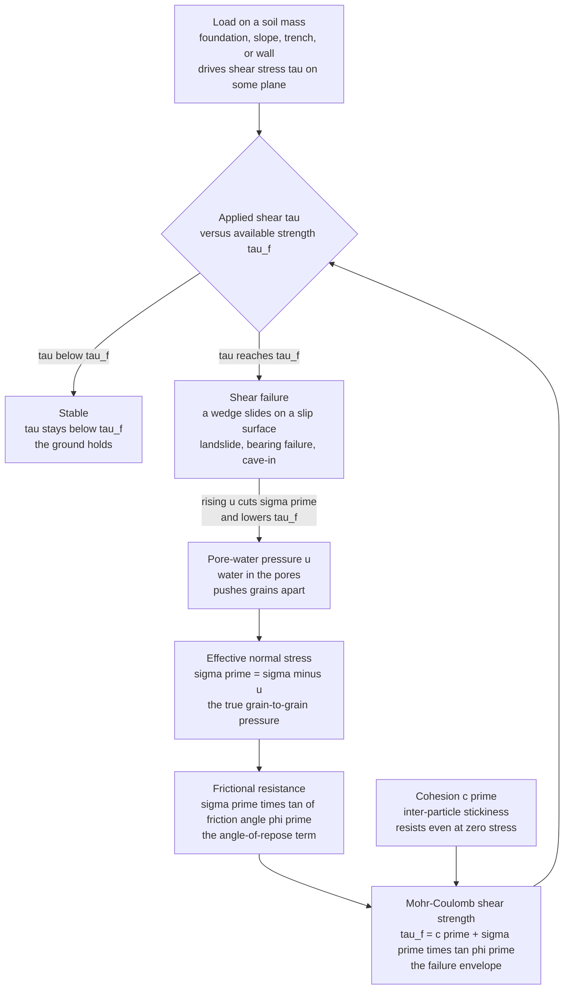

# ⛰️ Shear Strength of Soils

> [!abstract] TL;DR
> **Shear strength** is the maximum shearing stress a soil can carry on a plane before a mass of it **slides** — and almost every geotechnical failure (a landslide, a foundation punching into the ground, a retaining wall shoving over, a trench caving in) is exactly that: a wedge of soil sliding along a **slip surface** because the driving shear stress exceeded the strength. The governing law is the **Mohr-Coulomb criterion**, $\tau_f = c' + \sigma'\tan\phi'$: strength is a **cohesion** intercept $c'$ (inter-particle stickiness, essentially zero in clean sands) plus a **frictional** term equal to the **effective normal stress** $\sigma'$ times the tangent of the **friction angle** $\phi'$ (roughly $30$–$40°$ in sands — the same angle a poured sand cone stands at). The word *effective* is the whole subtlety: friction comes from grain-to-grain contact pressure $\sigma' = \sigma - u$, so **pore-water pressure $u$ can secretly sabotage strength** — raise $u$ and the Mohr circle slides left into the failure envelope with no change in total load. We measure $c'$ and $\phi'$ with **triaxial**, **direct-shear**, and unconfined-compression tests (Mohr circles at failure, tangent to the envelope), and the critical practical split is **drained** (slow, pore pressure dissipates, use $c', \phi'$) versus **undrained** (fast loading of saturated clay, pore pressure builds, use the undrained strength $s_u$). Get $c$, $\phi$, and the drainage condition right and you can decide whether the ground will hold a building, a slope, or a wall — get them wrong and it slides.

---

## Intuition

**Analogy first.** Soil does not fail the way a concrete cube fails — it does not get *crushed*. It fails by **sliding**: one block of ground slips along a surface past the block beside it. A hillside letting go in a landslide, a footing punching down into soft clay, the vertical face of an unshored trench peeling off onto a worker — every one of these is the *same event*, a shear failure on a slip surface. So the only question that matters is: **how much shear can the soil take before that surface slides?**

For dry sand the answer is something you have already seen with your own eyes. Pour sand into a pile and it forms a neat cone at a fixed steepness — the **angle of repose**. Try to make the slope any steeper and grains avalanche down until the angle is restored. That angle *is* the shear strength of the sand, and it comes from **friction between grains**: each grain sits in a little pocket of its neighbours, and to slide the pile you must drag grains up and over one another. Crucially, the harder you press the grains together, the more friction resists the sliding — press down on the sand and its slope can stand steeper. That is why sand strength grows with the pressure squeezing the grains together, the **normal stress**.

Clays add a second ingredient. Their tiny plate-like particles are electrically sticky, so a lump of clay holds its shape and stands in a vertical bank even with *no* squeezing pressure at all. That stickiness is **cohesion**. So soil strength is **friction plus cohesion** — and here is the trap that makes geotechnics an art rather than a lookup table: the frictional part depends not on the *total* pressure but on the **effective** (grain-to-grain) pressure, which is the total pressure minus the water pressure in the pores. Fill the pores with pressurized water and it *floats the grains apart*, kills the friction, and the ground can slide under a load it happily carried yesterday. Water is the invisible saboteur of soil strength.

---

## How It Works

### Core Mechanics

1. **Failure is shear on a surface.** Load the ground — with a footing, a slope, a wall backfill, or the open face of a trench — and it develops **shear stress** $\tau$ on internal planes. Somewhere a plane reaches a critical inclination where the driving shear is largest relative to the available resistance. When $\tau$ on that plane exceeds the soil's **shear strength** $\tau_f$, a **mass slides along a slip surface** and the structure fails. Bearing failure, slope failure, wall failure, trench collapse — one mechanism.

2. **Two resisting ingredients: friction and cohesion.** The soil fights back with (a) **friction** between grains, which grows with how hard the grains are pressed together (the **normal stress** on the plane), and (b) **cohesion**, an inter-particle bonding/stickiness present even at zero normal stress. Granular soils (sand, gravel) are essentially all friction; clays add cohesion.

3. **The Mohr-Coulomb criterion.** Combining the two gives the workhorse strength law:
   $$\tau_f = c' + \sigma'\tan\phi'$$
   a straight-line **failure envelope** on axes of shear stress $\tau$ versus normal stress $\sigma'$: a **cohesion intercept** $c'$ plus a slope of $\tan\phi'$, where $\phi'$ is the **angle of internal friction**. For clean sand $c'\approx 0$ and $\phi'\approx 30$–$40°$ (its angle of repose); for clay $c'>0$.

4. **Effective stress runs the friction.** The normal stress that matters is the **effective stress** $\sigma' = \sigma - u$ (total stress minus pore-water pressure $u$) — the part actually carried grain-to-grain. Pore water pushing the grains apart reduces $\sigma'$ and therefore the frictional strength. This is why $u$ is the master variable and why a rainstorm can trigger a landslide with no new external load at all.

5. **Mohr's circle finds the critical plane.** A soil element under principal stresses $\sigma_1'$ and $\sigma_3'$ has, on planes of every orientation, a $(\sigma', \tau)$ pair lying on a **Mohr's circle** of centre $\tfrac{1}{2}(\sigma_1'+\sigma_3')$ and radius $\tfrac{1}{2}(\sigma_1'-\sigma_3')$. **Failure occurs when the circle grows to just touch the envelope** — the point of tangency is the plane that slips (at $45°+\phi'/2$ to the major principal plane).

6. **Measure it in the lab and field.** The **triaxial test** (a cylinder confined by cell pressure, then sheared while controlling drainage and measuring $u$) and the **direct-shear box** each give circles/points at failure whose common tangent yields $c'$ and $\phi'$; **unconfined compression** gives $s_u$ for clay. In the field, **SPT** and **CPT** penetration and the **vane shear** test estimate strength in place.

7. **Drained vs undrained — the judgement call.** In **slow (drained)** loading, water escapes and $u$ stays at hydrostatic, so analysis uses effective-stress parameters $c', \phi'$. In **fast (undrained)** loading of saturated clay, water cannot escape, **excess pore pressure builds**, and the mobilized strength is the **undrained shear strength** $s_u$ (a total-stress analysis with $\phi=0$). Choosing the wrong one is a classic, dangerous error.

### Flow / Architecture



---

## Key Concepts

### Secondary Level

- **Soil fails by sliding, not crushing.** When ground gives way — a landslide, a collapsing sandcastle, a caving trench — a chunk of it **slides along a surface**. Shear strength is how much sliding force the soil can resist before that happens.
- **The sand-cone angle is friction.** Pour dry sand and it stands at a fixed steepness, the **angle of repose**. Make it steeper and it avalanches. That angle is the friction between grains, and it *is* the sand's strength.
- **Press harder, hold better.** The more you squeeze grains together, the more friction resists sliding — so soil under more pressure is stronger. That squeezing pressure is the **normal stress**.
- **Clay is sticky, sand is not.** Clay grains cling together (**cohesion**), so wet clay stands in a vertical bank while dry sand cannot. Real soil strength is **friction plus stickiness**.
- **Water weakens soil.** Water pressure in the pores floats the grains apart and cuts the friction. A hillside that stood all summer can slide after heavy rain with nothing new pushing on it — the water did it.

### Undergraduate Level

- **The Mohr-Coulomb envelope:** $\tau_f = c' + \sigma'\tan\phi'$ — a line of intercept $c'$ (cohesion) and slope $\tan\phi'$ ($\phi'$ = angle of internal friction) on $\tau$-vs-$\sigma'$ axes. **Sand:** $c'\approx 0$, $\phi'\approx 30$–$40°$. **Normally consolidated clay:** small $c'$, $\phi'\approx 20$–$28°$.
- **Effective stress principle (Terzaghi):** $\sigma' = \sigma - u$. Only the *effective* normal stress mobilizes friction; total stress does not. This single idea unifies strength, settlement, and consolidation.
- **Mohr's circle at failure:** centre $s = \tfrac{1}{2}(\sigma_1'+\sigma_3')$, radius $t = \tfrac{1}{2}(\sigma_1'-\sigma_3')$. **Failure = circle tangent to the envelope.** The failure plane is inclined at $\theta_f = 45° + \phi'/2$ to the major principal plane.
- **Failure in principal-stress form:** $\sigma_1' = \sigma_3'\tan^2\!\left(45°+\tfrac{\phi'}{2}\right) + 2c'\tan\!\left(45°+\tfrac{\phi'}{2}\right)$, i.e. $\sigma_1' = \sigma_3' N_\phi + 2c'\sqrt{N_\phi}$ with the flow number $N_\phi = \tan^2(45°+\phi'/2)$. Two triaxial tests at different $\sigma_3'$ pin down both $c'$ and $\phi'$.
- **Lab tests.** **Triaxial** (CU, CD, UU) confines a cylinder at cell pressure $\sigma_3$ then shears it axially, controlling drainage and measuring $u$ (the most versatile). **Direct shear** slides a split box and reads $\tau$ vs $\sigma$ directly. **Unconfined compression** ($\sigma_3=0$) gives $s_u = q_u/2$ for clay.
- **Drained vs undrained strength.** *Drained* (slow): pore pressure dissipates, use $c', \phi'$. *Undrained* (fast, saturated clay): use the **undrained shear strength** $s_u$ with a $\phi=0$ total-stress analysis, because the pore pressure that would have provided friction cannot drain away.

### Graduate Level

- **Critical-state soil mechanics.** Sheared far enough, any soil reaches a **critical state** where it deforms at constant volume and constant stress ratio $M = q/p'$; then $\sin\phi'_{cs} = 3M/(6+M)$. Peak strength above critical comes from **dilatancy**, not a true material constant — a cornerstone of the Cam-Clay framework.
- **Peak vs residual, and dilatancy.** **Dense** sand and **overconsolidated** clay must *expand* (dilate) to shear, giving a **peak** strength above the constant-volume value; continued shearing localizes on a slip surface and drops to a **residual** strength (very low $\phi'_r$ in clays as platelets align). Long-term slope stability in stiff clay must often use residual, not peak, parameters.
- **Effective-stress vs total-stress analysis.** Effective-stress analysis ($c', \phi'$ with the actual $u$ field) is fundamentally correct but needs the pore-pressure history; **undrained total-stress analysis** ($s_u$) is a shortcut valid *only* for the short-term, undrained condition of saturated fine-grained soil. The **most-critical** design case for a clay slope may be *end-of-construction undrained* for an embankment but *long-term drained* for an excavation — because $u$ evolves in opposite directions.
- **The $A$-parameter and pore-pressure response.** Skempton's $\Delta u = B[\Delta\sigma_3 + A(\Delta\sigma_1-\Delta\sigma_3)]$ predicts the excess pore pressure generated by loading; $A$ at failure distinguishes contractive (positive, weakening) from dilative (negative, strengthening) response, and $B\approx 1$ confirms full saturation.
- **Sensitivity and quick clays.** **Sensitivity** $S_t = s_{u,\text{undisturbed}}/s_{u,\text{remoulded}}$ measures strength loss on disturbance; *quick clays* ($S_t>16$) can liquefy to a fluid when the fabric collapses, driving catastrophic flow slides. Cyclic loading likewise builds pore pressure toward **liquefaction** in loose saturated sand ($\sigma'\to 0$, $\tau_f\to 0$).
- **From strength to design.** The Mohr-Coulomb pair $(c,\phi)$ or $s_u$ feeds every geotechnical limit state: **bearing capacity** (Terzaghi $q_u = c N_c + q N_q + \tfrac{1}{2}\gamma B N_\gamma$, with $N_c, N_q, N_\gamma$ functions of $\phi$), **slope stability** (factor of safety = available shear over mobilized shear on a slip surface), and **lateral earth pressure** (Rankine $K_a = \tan^2(45°-\phi'/2)$). All three are shear-strength problems wearing different hats.

---

## Python Demo

```python
# ============================================================================
# SHEAR STRENGTH OF SOILS -- the Mohr-Coulomb failure criterion, visualized.
#
#   (a) FAILURE ENVELOPE + MOHR CIRCLES:
#       Plot tau_f = c' + sigma'*tan(phi') for a CLAY (with cohesion) and a
#       SAND (c'=0, pure friction, "angle of repose"). Draw the Mohr's circles
#       from three triaxial tests on the clay, each grown until it is TANGENT
#       to the envelope -- exactly how c' and phi' are read off in the lab.
#
#   (b) EFFECTIVE-STRESS / PORE-PRESSURE EFFECT:
#       Hold the TOTAL stresses fixed and raise the pore pressure u. The
#       effective-stress Mohr circle keeps its radius but slides LEFT by u,
#       marching into the failure envelope -- failure at LOWER total stress,
#       triggered purely by water. Water as the saboteur of soil strength.
#
# Requires: numpy, matplotlib
import numpy as np
import matplotlib.pyplot as plt

d2r = np.deg2rad

def envelope(sigma, c, phi_deg):
    """Mohr-Coulomb failure envelope tau_f = c + sigma*tan(phi)."""
    return c + sigma * np.tan(d2r(phi_deg))

def upper_circle(center, radius, n=200):
    """Upper half of a Mohr circle (tau >= 0)."""
    th = np.linspace(0.0, np.pi, n)
    return center + radius * np.cos(th), radius * np.sin(th)

def sigma1_at_failure(sigma3, c, phi_deg):
    """Major principal stress at failure, tangent to the envelope."""
    Nphi = np.tan(d2r(45 + phi_deg / 2.0)) ** 2
    return sigma3 * Nphi + 2.0 * c * np.sqrt(Nphi)

# ---------------------------------------------------------------------------
# (a) Envelopes for clay and sand + triaxial failure circles on the clay
# ---------------------------------------------------------------------------
c_clay, phi_clay = 15.0, 25.0     # cohesive soil:  c' = 15 kPa, phi' = 25 deg
c_sand, phi_sand =  0.0, 37.0     # granular soil:  c' = 0,      phi' = 37 deg

sig = np.linspace(0.0, 340.0, 400)
sigma3_tests = [40.0, 90.0, 150.0]     # three triaxial confining pressures [kPa]

print("=== (a) Mohr-Coulomb: reading c' and phi' from failure circles ===")
print(f"  CLAY envelope: c' = {c_clay:.0f} kPa, phi' = {phi_clay:.0f} deg")
print(f"  SAND envelope: c' = {c_sand:.0f} kPa, phi' = {phi_sand:.0f} deg  (pure friction)")
for s3 in sigma3_tests:
    s1 = sigma1_at_failure(s3, c_clay, phi_clay)
    print(f"    triaxial: sigma3' = {s3:6.1f} kPa  ->  sigma1' at failure = {s1:6.1f} kPa"
          f"   (deviator = {s1 - s3:5.1f} kPa)")

# ---------------------------------------------------------------------------
# (b) Pore-pressure effect: fixed TOTAL stress, rising u shifts circle to fail
# ---------------------------------------------------------------------------
c_b, phi_b = 10.0, 28.0            # effective-stress envelope for panel (b)
s3_tot, s1_tot = 100.0, 260.0      # fixed TOTAL principal stresses [kPa]
s_center = 0.5 * (s1_tot + s3_tot) # total-circle centre  s = 180 kPa
radius   = 0.5 * (s1_tot - s3_tot) # circle radius t = 80 kPa (deviator/2, fixed)

# Tangency condition: radius = s'*sin(phi) + c*cos(phi)  ->  solve for s'_fail
sp = d2r(phi_b)
s_fail = (radius - c_b * np.cos(sp)) / np.sin(sp)   # effective centre at failure
u_fail = s_center - s_fail                          # pore pressure that triggers it

print("\n=== (b) Effective stress: pore pressure triggers failure at fixed load ===")
print(f"  envelope: c' = {c_b:.0f} kPa, phi' = {phi_b:.0f} deg")
print(f"  total circle centre s   = {s_center:.1f} kPa, radius = {radius:.1f} kPa (STABLE)")
print(f"  failure needs centre s' = {s_fail:.1f} kPa")
print(f"  -> pore pressure u = {u_fail:.1f} kPa slides the circle into the envelope")
print("  (no change in TOTAL stress -- water alone causes the failure)")

# ---------------------------------------------------------------------------
# Plotting
# ---------------------------------------------------------------------------
fig, (axA, axB) = plt.subplots(1, 2, figsize=(14, 6.2))
fig.suptitle("Shear Strength of Soils -- the Mohr-Coulomb Failure Criterion",
             fontsize=15, fontweight="bold")

# ---- Panel (a) ----
axA.plot(sig, envelope(sig, c_sand, phi_sand), color="#e8871e", lw=2.4,
         label=f"SAND envelope  c'=0, phi'={phi_sand:.0f} deg")
axA.plot(sig, envelope(sig, c_clay, phi_clay), color="#2f9e44", lw=2.4,
         label=f"CLAY envelope  c'={c_clay:.0f} kPa, phi'={phi_clay:.0f} deg")
for s3 in sigma3_tests:
    s1 = sigma1_at_failure(s3, c_clay, phi_clay)
    cen, rad = 0.5 * (s1 + s3), 0.5 * (s1 - s3)
    xc, yc = upper_circle(cen, rad)
    axA.plot(xc, yc, color="#1c6fd6", lw=1.6)
    axA.plot([s3, s1], [0, 0], "o", color="#1c6fd6", ms=4)
axA.plot([], [], color="#1c6fd6", lw=1.6, label="clay failure circles (triaxial)")
axA.annotate("cohesion\nintercept c'", xy=(0, c_clay), xytext=(35, 70),
             fontsize=8, color="#2f9e44",
             arrowprops=dict(arrowstyle="->", color="#2f9e44"))
axA.annotate("slope = tan(phi')\n= friction", xy=(250, envelope(250, c_clay, phi_clay)),
             xytext=(150, 175), fontsize=8, color="#2f9e44",
             arrowprops=dict(arrowstyle="->", color="#2f9e44"))
axA.set_title("(a) Failure envelope + Mohr circles at failure", fontsize=11)
axA.set_xlabel("effective normal stress  sigma'  [kPa]")
axA.set_ylabel("shear stress  tau  [kPa]")
axA.set_xlim(0, 340); axA.set_ylim(0, 220)
axA.set_aspect("equal", adjustable="box")
axA.legend(loc="upper left", fontsize=8); axA.grid(alpha=0.3)

# ---- Panel (b) ----
axB.plot(sig, envelope(sig, c_b, phi_b), color="#2f9e44", lw=2.4,
         label=f"effective envelope  c'={c_b:.0f}, phi'={phi_b:.0f} deg")
# stable TOTAL-stress circle (u = 0)
xt, yt = upper_circle(s_center, radius)
axB.plot(xt, yt, color="#1c6fd6", lw=2.0, label="circle at u = 0  (stable)")
axB.plot([s3_tot, s1_tot], [0, 0], "o", color="#1c6fd6", ms=4)
# effective circle at failure (shifted left by u_fail)
xf, yf = upper_circle(s_fail, radius)
axB.plot(xf, yf, color="#d62728", lw=2.2,
         label=f"circle at u = {u_fail:.0f} kPa  (FAILURE)")
axB.plot([s3_tot - u_fail, s1_tot - u_fail], [0, 0], "o", color="#d62728", ms=4)
# arrow showing the leftward shift caused by pore pressure
axB.annotate("", xy=(s_fail, radius * 0.55), xytext=(s_center, radius * 0.55),
             arrowprops=dict(arrowstyle="->", color="k", lw=1.8))
axB.text(0.5 * (s_center + s_fail), radius * 0.62,
         f"rising pore pressure u\nshifts circle left by {u_fail:.0f} kPa",
         ha="center", fontsize=8, fontweight="bold")
axB.set_title("(b) Pore pressure slides the circle into failure", fontsize=11)
axB.set_xlabel("normal stress  [kPa]   (total, then effective = total - u)")
axB.set_ylabel("shear stress  tau  [kPa]")
axB.set_xlim(0, 340); axB.set_ylim(0, 160)
axB.set_aspect("equal", adjustable="box")
axB.legend(loc="upper left", fontsize=8); axB.grid(alpha=0.3)

plt.tight_layout(rect=[0, 0, 1, 0.94])
plt.savefig("shear_strength_of_soils_demo.png", dpi=120)
print("\nSaved figure -> shear_strength_of_soils_demo.png")
```

**What it shows.** Panel **(a)** draws the two personalities of soil strength: the **sand** envelope is a straight line *through the origin* — pure friction, its slope set by $\phi'\approx37°$ (the angle a sand pile stands at), so it has strength only when squeezed. The **clay** envelope is parallel-ish but lifted off the origin by the **cohesion intercept** $c'$, so clay holds even at zero normal stress. The three blue **Mohr circles** are three triaxial tests grown until each just *kisses* the clay envelope; their common tangent is precisely how a lab extracts $c'$ and $\phi'$ from test data. Panel **(b)** delivers the punchline of effective stress: the total load is held **fixed** (same circle radius), yet **raising the pore pressure $u$** slides the effective-stress circle bodily to the left until it touches the envelope and the soil fails — a collapse caused by water alone, no new external load. That is the mechanism behind rain-triggered landslides, rapid-drawdown dam-slope failures, and injection-induced fault slip.

---

## Real-World Applications

> **Example — the 1963 Vajont and every rain-triggered landslide.** A slope stands all summer at some angle, its shear strength $\tau_f = c' + \sigma'\tan\phi'$ comfortably beating the gravity-driven shear on the potential slip surface. Then heavy rain (or, at Vajont, a filling reservoir) **raises the pore-water pressure** inside the slope. Total stresses barely change, but $\sigma' = \sigma - u$ drops, the frictional strength collapses, and the driving shear now exceeds $\tau_f$ on a slip surface — the hillside lets go. No new weight was added; **water alone** dialed the effective stress down into failure. The same effective-stress arithmetic that a first-year student plots as a Mohr circle sliding left is exactly what governs whether a real slope moves.

- **Bearing capacity of foundations.** Whether a footing can carry its column load without punching into the ground is a shear-strength problem: Terzaghi's $q_u = cN_c + qN_q + \tfrac{1}{2}\gamma B N_\gamma$ has bearing factors $N_c, N_q, N_\gamma$ that are functions of $\phi$. The soil's $c$ and $\phi$ set how much the ground can hold.
- **Slope stability and earth dams.** Every cut, embankment, levee, and tailings dam is checked by comparing the available shear strength along candidate slip surfaces to the gravity-driven shear (the factor of safety). The **drained vs undrained** choice — and the pore-pressure history — decides whether the design is safe at end-of-construction or in the long term.
- **Retaining walls and lateral earth pressure.** The active/passive thrust a wall must resist depends directly on $\phi'$ through $K_a = \tan^2(45° - \phi'/2)$ and $K_p = \tan^2(45° + \phi'/2)$ — the backfill's friction angle sizes the wall.
- **Trench and excavation safety.** Whether an unshored trench face will stand or peel off onto a worker is undrained shear strength ($s_u$) versus the gravity shear on the face — a leading cause of construction fatalities, and pure Mohr-Coulomb.
- **Liquefaction of saturated sand.** In an earthquake, cyclic shaking of loose saturated sand builds pore pressure until $\sigma' \to 0$ and $\tau_f \to 0$: the ground momentarily behaves as a liquid, sinking buildings and floating buried tanks. The same effective-stress principle, driven to its limit.
- **Fault mechanics and induced seismicity.** The Coulomb failure criterion for a soil slip surface is the *identical* law that governs slip on a geologic fault; injecting fluid raises pore pressure, lowers effective normal stress, and can trigger earthquakes — geotechnics and seismology sharing one equation (see the geophysics link below).

---

## Common Pitfalls

- **Using total stress where effective stress rules.** The frictional strength is $\sigma'\tan\phi'$ with $\sigma' = \sigma - u$, *not* $\sigma\tan\phi'$. Forgetting to subtract pore pressure over-predicts strength and is the single most dangerous soil-mechanics mistake — it hides exactly the water-driven failures that kill.
- **Mixing up drained and undrained.** Applying effective-stress $c', \phi'$ to a *fast, undrained* loading of saturated clay (or applying $s_u$ to a long-term drained problem) can be badly unconservative. The correct strength depends on **how fast you load relative to how fast water drains** — the heart of geotechnical judgement.
- **Trusting peak strength on a slip surface.** Dense sands and stiff clays show a **peak** strength from dilatancy that they *cannot sustain* once a slip surface forms and localizes; long-term slope analysis in fissured clay must often use the much lower **residual** $\phi'_r$. Designing to peak invites delayed failure.
- **Assuming cohesion is a permanent, reliable resource.** Apparent cohesion in partly saturated soil (from capillary suction) *vanishes* on wetting; treating a soaked or submerged soil as if it kept that cohesion has collapsed many slopes and trench walls. Clean sand truly has $c'\approx 0$ — do not invent cohesion to make a wall check pass.
- **Ignoring dilatancy and volume change.** Loose (contractive) soil generates *positive* excess pore pressure and weakens on shearing (toward liquefaction); dense (dilative) soil sucks pore pressure and strengthens. Treating undrained strength as a fixed number ignores this loading-direction dependence.
- **Over-relying on a single test or index.** SPT $N$-values and correlations are useful screens, not the truth; scatter, sample disturbance (especially in sensitive clays, where remoulding can slash $s_u$), and anisotropy mean strength must be bracketed, not point-estimated. Terzaghi's warning stands: the soil is the great uncertainty.

---

## Related Concepts

**Mechanics, stress, and friction (Mechanical Engineering & Physics vaults)**
- [[Stress_Strain_and_Deformation]] — supplies the general stress state and the **Mohr's-circle** construction that soil failure specializes; the $(\sigma, \tau)$ plane is the same one used for metals.
- [[Failure_Fatigue_and_Fracture]] — Mohr-Coulomb is a **failure criterion**, the geotechnical cousin of the yield/fracture criteria used for ductile and brittle solids.
- [[Tribology_and_Surface_Engineering]] — the grain-to-grain **friction** that sets $\phi'$ is Amontons-Coulomb friction at the contact scale; the friction angle is a bulk expression of surface friction.
- [[Statics_and_Equilibrium]] — slope- and wedge-stability analysis balances driving and resisting shear on a slip surface with $\sum F = 0$, $\sum M = 0$; strength sets the resisting side.
- [[Newtons_Laws_and_Kinematics]] — friction as a contact force ($f \le \mu N$) is the first-principles root of "press harder, resist more," the physics behind the frictional term.

**The ground failing (Earth Science & Geophysics vaults)**
- [[Weathering_and_Soils]] — how rock breaks down into the soil whose $c$ and $\phi$ this note quantifies; grain size and mineralogy set the strength parameters.
- [[Mass_Wasting_and_Slope_Stability]] — landslides and slope failures *are* shear failures on slip surfaces; this is the geomorphology view of the same Mohr-Coulomb mechanics.
- [[Induced_Seismicity_and_Georesource_Geophysics]] — fluid injection raises pore pressure and lowers effective normal stress on faults, triggering slip — the identical effective-stress mechanism as pore-pressure-triggered soil failure.
- [[Earthquake_Source_and_Focal_Mechanisms]] — fault rupture obeys a **Coulomb friction** criterion with pore-pressure effects, the tectonic-scale twin of soil shear strength.

*Within this Geotechnical section (siblings, referenced in prose): the strength parameters here are built on **Soil_Mechanics_Fundamentals** and **Effective_Stress_and_Consolidation** (the $\sigma' = \sigma - u$ principle and pore-pressure dissipation), and they feed directly into **Foundation_Engineering** (bearing capacity from $c$ and $\phi$), **Retaining_Walls_and_Lateral_Earth_Pressure** (thrust from $\phi'$), and **Slope_Stability_and_Earthworks** (factor of safety on a slip surface).*

---

## Review Questions

**Secondary**
1. Pour a pile of dry sand and it stands at a fixed steepness before grains avalanche; a lump of wet clay, by contrast, can stand in a vertical bank. In plain words, what gives each soil its "strength," and why does soaking a sandy slope in heavy rain make it more likely to slide even though nothing new was piled on top?

**Undergraduate**
2. A drained triaxial test on a sand gives failure at $\sigma_3' = 100$ kPa and $\sigma_1' = 380$ kPa. Using $\sigma_1' = \sigma_3'\tan^2(45° + \phi'/2) + 2c'\sqrt{\cdots}$ with $c'=0$, estimate the friction angle $\phi'$. Then sketch the Mohr circle and the failure envelope, mark the failure plane orientation, and explain why raising the pore pressure by $50$ kPa (at fixed total stress) moves the circle and why that can cause failure.

**Graduate**
3. You must assess a cut slope in a stiff, fissured overconsolidated clay and an embankment built rapidly on soft saturated clay. For **each**, state whether the critical condition is **drained or undrained**, whether you would analyze with effective-stress $c', \phi'$ or undrained $s_u$, and whether **peak or residual** strength is appropriate — and explain, using the way excess pore pressure evolves after loading and after unloading, why the two problems have their *most-critical* moment at opposite ends of the timeline.

---

## Sources

- B. M. Das & K. Sobhan — *Principles of Geotechnical Engineering*, 9th ed. (Cengage, 2018) — Mohr-Coulomb, triaxial and direct-shear testing, drained/undrained strength.
- R. D. Holtz, W. D. Kovacs & T. C. Sheahan — *An Introduction to Geotechnical Engineering*, 2nd ed. (Pearson, 2011) — effective stress, shear strength of sands and clays, critical state.
- T. W. Lambe & R. V. Whitman — *Soil Mechanics* (Wiley, 1969) — foundational treatment of effective stress and strength.
- K. Terzaghi, R. B. Peck & G. Mesri — *Soil Mechanics in Engineering Practice*, 3rd ed. (Wiley, 1996) — the ground as "the great uncertainty," strength in practice.

---

#civil-engineering #shear-strength #mohr-coulomb #friction-angle #geotechnical
