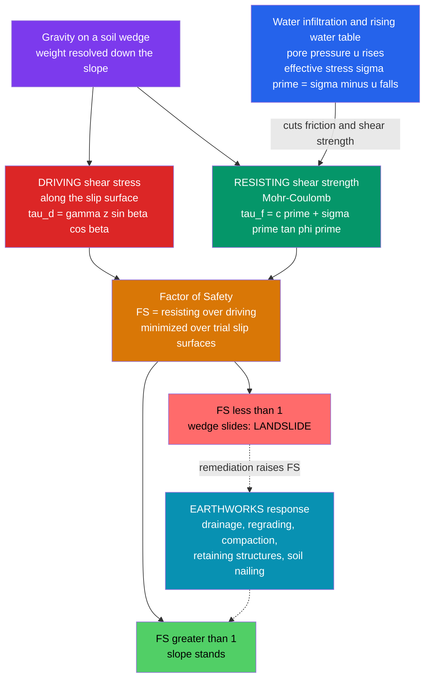

# 🏔️ Slope Stability and Earthworks

> [!abstract] TL;DR
> A hillside or an embankment is a slow-motion tug-of-war: gravity tries to slide a wedge of soil **down**, while the soil's **shear strength** along a potential slip surface holds it in place. Engineers boil that drama down to a single number — the **Factor of Safety (FS)**, the ratio of resisting strength to driving force. Above 1 the slope stands; below 1 it slides. The usual silent assassin that tips FS below 1 is the same one that haunts all of geotechnics: **water**. Rain seeps in, **pore pressure** rises, **effective stress** and friction fall, and a hillside that stood for decades suddenly lets go. **Earthworks** is the deliberate flip side — cutting, filling, and **compacting** soil (guided by the Proctor curve's optimum moisture content) to build stable embankments, dams, levees, and roadbeds on purpose.

---

## Intuition

**Analogy:** Imagine a heavy filing cabinet resting on a carpeted ramp. Gravity constantly tugs it down the incline; friction between its feet and the carpet holds it back. Tilt the ramp steeper and, at some critical angle, the tug wins and the cabinet slides. Now imagine you could quietly reduce that friction — slip a sheet of ice under the feet — and the cabinet lets go at a far gentler angle. A hillside is exactly this cabinet scaled up to a mountain of soil, and **rainwater is the sheet of ice**: it does not push the slope over so much as it *dissolves the grip* holding the slope up.

Technically, the "grip" is the soil's shear strength along a curved or planar **slip surface**, and the "tug" is the downslope component of the soil wedge's weight. The engineer's whole job is to keep the grip comfortably larger than the tug — to keep the **Factor of Safety** above one — and to understand that the fastest way to lose that margin is to let water in. Earthworks turns the same physics into a construction craft: shape and compact soil so that the grip is engineered-in and the water is drained-out.

---

## How It Works

### Core Mechanics

1. **A slope fails by sliding, not by crushing.** A mass of soil detaches along a **slip (failure) surface** and moves downhill. The surface can be roughly **circular** (rotational slump, typical in homogeneous clay), **planar** (translational slide along a weak seam or bedding plane), or irregular. Analysis is about finding *where* that surface will form and *whether* it will move.

2. **Driving vs resisting, summed along the surface.** Gravity acting on the sliding mass produces a **driving shear stress** that tries to move it. The soil's **shear strength** (Mohr–Coulomb: $\tau_f = c' + \sigma'\tan\phi'$) produces a **resisting shear stress**. The **Factor of Safety** is their ratio, integrated over the whole slip surface:
$$FS = \frac{\text{available shear strength}}{\text{mobilized shear stress}} = \frac{\sum \tau_f}{\sum \tau_d}$$
$FS > 1$ means the slope has strength to spare; $FS < 1$ means it is failing. Design targets are typically $FS \ge 1.3$–$1.5$ for permanent slopes.

3. **Two analysis families.** For a long, uniform slope the **infinite-slope model** gives a one-line closed-form FS. For a finite slope with a curved failure surface, engineers use the **method of slices**: chop the sliding mass over an assumed slip surface into vertical slices, write the force/moment balance for each, and sum. Increasingly rigorous variants — **Fellenius (ordinary)**, **Bishop's simplified**, **Janbu**, **Spencer**, **Morgenstern–Price** — differ in which inter-slice forces they satisfy.

4. **Search for the critical surface.** There are infinitely many possible slip surfaces; the real one is whichever gives the **minimum FS**. So the analysis is an *optimization*: trial many candidate circles (or non-circular surfaces), compute FS for each, and report the lowest.

5. **Water is the dominant trigger.** Rising groundwater or rainfall infiltration raises **pore-water pressure** $u$, which cuts the **effective stress** $\sigma' = \sigma - u$ that grains press together with — and therefore the frictional strength $\sigma'\tan\phi'$. Most catastrophic natural slides are **rain-triggered**. Rapid reservoir drawdown, blocked drainage, and undercutting of the toe are close cousins.

6. **Earthworks is stability by design.** **Cuts** (excavation) and **fills** (embankments, dams, levees, road subgrades) reshape the ground; **compaction** densifies fill to raise strength and slash later settlement. The **Proctor curve** (dry density vs water content) reveals a **maximum dry density** achieved at an **optimum moisture content (OMC)** — too dry and grains will not pack; too wet and water occupies the voids you want soil in.

### Flow / Architecture



---

## Key Concepts

### Secondary Level

**A slope fails by sliding.** Picture a chunk of hillside breaking loose along a curved surface and sliding down like a scoop of ice cream tipping off a cone. Stability is a contest between **gravity pulling the soil down** and the **soil's strength holding it together**.

**The Factor of Safety is one number for the whole contest.** FS = (strength holding the slope) ÷ (force pulling it down). If FS is bigger than 1 the slope is safe; if it drops below 1 it slides. Engineers keep a cushion — they aim for FS around 1.5, not 1.01 — because soil strength and future rainfall are never known exactly.

**Water is the number-one villain.** A slope that stood for fifty years can fail in a single storm. Rain soaks in, fills the pore spaces between grains with pressurized water, and that water pushes the grains apart — reducing the friction that was holding everything up. This is why **most landslides happen during or just after heavy rain**, and why **drainage** is the cheapest, most powerful slope-fixing tool.

**Kinds of failure.** *Rotational slumps* curve like a spoon-scoop (common in clay); *translational slides* slip flat along a weak layer; *flows* turn saturated soil into a fast slurry (mudflows, debris flows); *rockfalls* drop blocks off a cliff.

**Earthworks means shaping the land on purpose.** *Cutting* removes soil (road cuts, terraces); *filling* piles it up (embankments, dams, levees); *compaction* squeezes fill dense so it is strong and will not settle later. Rolling equipment packs the soil — but only if the soil has the **right amount of water**: bone-dry soil will not pack, and soggy soil turns to mush. There is a sweet spot called the **optimum moisture content**.

### Undergraduate Level

**Infinite-slope model.** For a long, uniform slope where the failure plane runs parallel to the ground surface at depth $z$, the driving and resisting shear stresses on that plane are:
$$\tau_d = \gamma z \sin\beta \cos\beta, \qquad \tau_f = c' + (\sigma_n - u)\tan\phi'$$
where $\sigma_n = \gamma z \cos^2\beta$ is the normal stress, $\beta$ the slope angle, $\gamma$ the soil unit weight, and $u$ the pore pressure. Thus:
$$FS = \frac{c' + (\gamma z \cos^2\beta - u)\tan\phi'}{\gamma z \sin\beta \cos\beta}$$
For a **dry, cohesionless** slope ($c'=0,\ u=0$) this collapses to the beautifully simple $FS = \tan\phi' / \tan\beta$ — stability depends only on the friction angle versus the slope angle, and failure occurs precisely when $\beta = \phi'$ (the **angle of repose**).

**The pore-pressure ratio $r_u$.** It is convenient to express pore pressure as a fraction of the total vertical stress, $r_u = u / (\gamma z)$. Then $r_u = 0$ is dry and higher $r_u$ (up to ~0.5 when the water table reaches the surface with vertical seepage) progressively erodes FS. This single parameter is how rainfall's effect is folded into a stability calculation.

**Method of slices (finite slopes).** Rotational failures are analyzed by dividing the trial circular arc's overlying soil into $n$ vertical slices. Each slice $i$ has weight $W_i$, base length $\ell_i$, base inclination $\alpha_i$, and base pore pressure $u_i$. The **Ordinary (Fellenius)** method gives, taking moments about the circle's center:
$$FS = \frac{\sum \big[c'\ell_i + (W_i\cos\alpha_i - u_i\ell_i)\tan\phi'\big]}{\sum W_i \sin\alpha_i}$$
**Bishop's simplified** method satisfies vertical equilibrium and horizontal moment equilibrium (assuming zero inter-slice shear), giving a more accurate — but *implicit* — FS that must be iterated. Because these are all statics problems (summing forces and moments on rigid bodies), they rest directly on the free-body/equilibrium machinery of [[Statics_and_Equilibrium]].

**Drained vs undrained.** *Short-term* (undrained) stability in clay uses total-stress strength $c_u$ (excess pore pressures have not yet dissipated); *long-term* (drained) stability uses effective-stress parameters $c', \phi'$ with the steady-state pore pressures. A cut slope in clay is often *most dangerous in the long term* (pore pressures rise as the clay swells), whereas an embankment on soft clay is *most dangerous right after construction* — a critical, non-obvious distinction.

**Compaction and the Proctor curve.** Compaction expels air to increase **dry unit weight** $\gamma_d$. Plotting $\gamma_d$ against **water content** $w$ for a fixed compaction energy yields the **Proctor curve**: a bell that peaks at the **maximum dry density** $\gamma_{d,\max}$ at the **optimum moisture content**. Below OMC there is too little water to lubricate particle rearrangement; above OMC water fills voids and cannot be squeezed out fast enough. The curve is bounded above by the **zero-air-voids (ZAV) line** $\gamma_d = \dfrac{G_s\gamma_w}{1 + wG_s/S}$ (with saturation $S=1$), which can never be crossed. Field control specifies a **relative compaction** (e.g., $\ge 95\%$ of standard Proctor $\gamma_{d,\max}$) within a moisture window.

### Graduate Level

**Limit equilibrium and the indeterminacy of slices.** The method of slices is statically **indeterminate**: for $n$ slices there are more unknowns (inter-slice normal and shear forces, base normals, FS) than equilibrium equations, so every method makes an **assumption to close the system**. Fellenius ignores inter-slice forces (can underestimate FS by 10–20% for deep circles with high pore pressure); Bishop assumes inter-slice shear is zero; **Spencer** assumes a constant inter-slice force inclination and satisfies *both* force and moment equilibrium; **Morgenstern–Price** allows an arbitrary inter-slice force function — the most rigorous. Rigorous methods typically agree within a few percent, which is why Spencer/Morgenstern–Price are the standard for critical structures.

**Critical slip surface search as optimization.** FS is a functional of the trial surface geometry; the design FS is $\min_{\text{surfaces}} FS$. Circular searches sweep center coordinates and radii on a grid; non-circular searches use dynamic programming, simulated annealing, or particle-swarm optimization. The surface is generally *non-circular* in layered soils that daylight a weak seam — assuming circularity can non-conservatively miss a translational mechanism. Modern practice increasingly uses **finite-element strength-reduction** (SRM), where soil strength is progressively divided by a trial factor until the FE solution fails to converge; the factor at non-convergence is FS, and no slip surface need be assumed a priori.

**Transient infiltration and rainfall-triggered failure.** Rain-triggered slides are governed by the **Richards equation** for unsaturated flow: infiltration advances a wetting front that raises pore pressure (destroys **matric suction**, the apparent cohesion of unsaturated soil) at depth. Coupling this to a stability model links FS to storm **intensity–duration**; empirical **I–D thresholds** (power-law envelopes such as Caine's $I = 14.82\,D^{-0.39}$) and physically-based models (TRIGRS) drive regional early-warning systems. This ties slope hazard directly to rainfall climatology and its projected intensification (see [[Precipitation_Processes]], [[Droughts_and_Floods]]).

**Reservoir-induced and seismic destabilization.** Filling a reservoir raises the water table in valley walls, elevating pore pressure exactly as rain does — the mechanism behind the 1963 Vajont catastrophe and a facet of the broader phenomenon of fluid-pressure–driven ground instability treated in [[Induced_Seismicity_and_Georesource_Geophysics]]. **Seismic** loading adds a pseudo-static inertial force $k_h W$ (Newmark sliding-block analysis integrates the permanent displacement when acceleration exceeds the yield threshold), which is why slope design in seismic regions must screen ground-motion demand from [[Seismic_Hazard_and_Ground_Motion]].

**Earthworks as an engineered material.** Beyond density, compaction controls **hydraulic conductivity**, **shear strength**, **compressibility**, and **shrink–swell** — and the *side of optimum* matters: soils compacted **dry of optimum** are stiffer and more brittle with a flocculated fabric; **wet of optimum** they are more ductile, lower-permeability, and prone to strength loss on saturation. Earth-dam cores are deliberately placed slightly wet of optimum for low permeability and crack resistance; road subgrades near optimum for strength. **Balancing cut and fill** across a project (the **mass-haul diagram**) minimizes costly import/export of soil, a core earthworks optimization.

---

## Python Demo

```python
# Slope Stability and Earthworks -- two-panel visualization (numpy + matplotlib)
#
# (a) FACTOR OF SAFETY vs SLOPE ANGLE for a family of pore-pressure ratios r_u.
#     Infinite-slope model with cohesion. Shows a slope that is safely stable
#     when dry sliding BELOW FS = 1 as it gets wetter -- rain-triggered failure.
#
# (b) PROCTOR COMPACTION CURVE (earthworks): dry density vs water content,
#     the bell peaking at the OPTIMUM MOISTURE CONTENT / maximum dry density,
#     bounded above by the zero-air-voids (fully saturated) line.

import numpy as np
import matplotlib.pyplot as plt

# ------------------------------------------------------------------
# (a) INFINITE-SLOPE FACTOR OF SAFETY
#     FS = [ c' + (gamma*z*cos^2(beta) - u) * tan(phi') ]
#          -------------------------------------------------
#                    gamma * z * sin(beta) * cos(beta)
#     with pore pressure u = r_u * gamma * z
# ------------------------------------------------------------------
c_prime = 5.0e3      # effective cohesion, Pa
gamma   = 19.0e3     # soil unit weight, N/m^3
z       = 4.0        # depth to slip plane, m
phi_deg = 30.0       # effective friction angle, deg

def fs_infinite(beta_deg, ru):
    b   = np.radians(beta_deg)
    phi = np.radians(phi_deg)
    u   = ru * gamma * z
    sigma_n   = gamma * z * np.cos(b)**2
    resisting = c_prime + (sigma_n - u) * np.tan(phi)
    driving   = gamma * z * np.sin(b) * np.cos(b)
    return resisting / driving

beta = np.linspace(10.0, 45.0, 400)
ru_values = [0.0, 0.1, 0.2, 0.3, 0.4]     # dry -> increasingly wet

# ------------------------------------------------------------------
# (b) PROCTOR COMPACTION CURVE + zero-air-voids (ZAV) bound
#     Standard vs modified (higher) compaction energy.
# ------------------------------------------------------------------
Gs      = 2.70                 # specific gravity of solids
gamma_w = 9.81                 # kN/m^3
w = np.linspace(0.04, 0.24, 300)   # water content (fraction)

# Empirical bell curves: gamma_d = gamma_d_max - k*(w - OMC)^2
def proctor(w, gd_max, omc, k):
    return gd_max - k * (w - omc)**2

gd_std = proctor(w, gd_max=18.5, omc=0.13, k=250.0)   # standard Proctor
gd_mod = proctor(w, gd_max=19.5, omc=0.10, k=280.0)   # modified (more energy)

# Zero-air-voids line (S = 1): gamma_d = Gs*gamma_w / (1 + w*Gs)
gd_zav = Gs * gamma_w / (1.0 + w * Gs)

omc_std, gdmax_std = 0.13, 18.5
omc_mod, gdmax_mod = 0.10, 19.5

# ------------------------------------------------------------------
# Plot
# ------------------------------------------------------------------
fig, ax = plt.subplots(1, 2, figsize=(13.5, 5.2))

# --- Left: FS vs slope angle for varying wetness ---
colors = plt.cm.viridis(np.linspace(0.15, 0.85, len(ru_values)))
for ru, col in zip(ru_values, colors):
    ax[0].plot(beta, fs_infinite(beta, ru), lw=2.4, color=col,
               label=f"r_u = {ru:.1f}")
ax[0].axhline(1.0, color="k", ls="--", lw=1.6)
ax[0].fill_between(beta, 0, 1, color="red", alpha=0.08)   # unstable band
ax[0].annotate("FS = 1  failure threshold", (11, 1.03),
               fontsize=9, color="k")
ax[0].annotate("UNSTABLE", (11, 0.55), fontsize=10, color="#b91c1c",
               weight="bold")
ax[0].set_xlabel("Slope angle  beta  (degrees)")
ax[0].set_ylabel("Factor of Safety  FS")
ax[0].set_title("Infinite-slope stability\nwetter slope (higher r_u) slides at gentler angles")
ax[0].set_ylim(0, 3.0)
ax[0].legend(title="pore-pressure ratio", fontsize=9)
ax[0].grid(True, alpha=0.3)

# --- Right: Proctor compaction curves ---
ax[1].plot(w * 100, gd_std, color="#1d4ed8", lw=2.6, label="Standard Proctor")
ax[1].plot(w * 100, gd_mod, color="#ea580c", lw=2.6, label="Modified Proctor")
ax[1].plot(w * 100, gd_zav, color="green", lw=2.0, ls="--",
           label="Zero-air-voids (S = 1)")
ax[1].scatter([omc_std*100, omc_mod*100], [gdmax_std, gdmax_mod],
              color=["#1d4ed8", "#ea580c"], s=70, zorder=5)
ax[1].annotate(f"OMC = {omc_std*100:.0f}%\ngd,max = {gdmax_std} kN/m3",
               (omc_std*100, gdmax_std), textcoords="offset points",
               xytext=(6, -38), fontsize=8.5, color="#1d4ed8")
ax[1].annotate(f"OMC = {omc_mod*100:.0f}%\ngd,max = {gdmax_mod} kN/m3",
               (omc_mod*100, gdmax_mod), textcoords="offset points",
               xytext=(8, 8), fontsize=8.5, color="#ea580c")
ax[1].set_xlabel("Water content  w  (percent)")
ax[1].set_ylabel("Dry unit weight  gamma_d  (kN/m3)")
ax[1].set_title("Proctor compaction curve\nmax density at the optimum moisture content")
ax[1].set_ylim(15.5, 21.5)
ax[1].legend(fontsize=9, loc="lower center")
ax[1].grid(True, alpha=0.3)

plt.tight_layout()
plt.savefig("slope_stability_and_earthworks.png", dpi=130)
plt.show()

# ------------------------------------------------------------------
# Printed summary: critical slope angle where FS drops to 1
# ------------------------------------------------------------------
print("Critical slope angle (FS = 1) vs wetness:")
fine = np.linspace(10.0, 60.0, 5000)
for ru in ru_values:
    fs = fs_infinite(fine, ru)
    below = np.where(fs < 1.0)[0]
    if below.size:
        b_crit = fine[below[0]]
        print(f"  r_u = {ru:.1f}  ->  slope fails above ~{b_crit:4.1f} deg")
    else:
        print(f"  r_u = {ru:.1f}  ->  FS > 1 for all angles tested")

print("\nExample: a 25-degree slope as it wets up:")
for ru in ru_values:
    print(f"  r_u = {ru:.1f}  ->  FS = {fs_infinite(25.0, ru):.2f}")

print(f"\nCompaction: standard Proctor peaks at OMC = {omc_std*100:.0f}% "
      f"with gamma_d,max = {gdmax_std} kN/m3;")
print(f"            adding energy (modified) shifts the peak LEFT and UP "
      f"to OMC = {omc_mod*100:.0f}%, gamma_d,max = {gdmax_mod} kN/m3.")
```

**Expected output (approximate):**

```
Critical slope angle (FS = 1) vs wetness:
  r_u = 0.0  ->  slope fails above ~40.5 deg
  r_u = 0.1  ->  slope fails above ~35.9 deg
  r_u = 0.2  ->  slope fails above ~31.6 deg
  r_u = 0.3  ->  slope fails above ~24.6 deg
  r_u = 0.4  ->  slope fails above ~15.8 deg

Example: a 25-degree slope as it wets up:
  r_u = 0.0  ->  FS = 1.41
  r_u = 0.1  ->  FS = 1.26
  r_u = 0.2  ->  FS = 1.11
  r_u = 0.3  ->  FS = 0.96
  r_u = 0.4  ->  FS = 0.81
```

The left panel is the whole hazard in one picture: a 25° slope that is comfortably stable when dry ($FS \approx 1.4$) crosses **below FS = 1 once the pore-pressure ratio reaches ~0.3** — the moment a long storm has saturated the ground. The right panel is the earthworks counterpart: the Proctor bell shows there is one **optimum moisture content** at which rolling compaction achieves maximum dry density, and that adding compaction energy pushes the peak up and to the left (drier) while never crossing the zero-air-voids ceiling.

---

## Real-World Applications

> **Vajont Dam, Italy (1963) — reservoir-induced slope failure.** Filling the reservoir behind the world's tallest thin-arch dam raised the water table in an ancient slide mass on Monte Toc, elevating pore pressure and dropping the Factor of Safety below one. Roughly 270 million m³ of rock slid into the reservoir in ~45 seconds; the displacement wave overtopped the intact dam by ~250 m and destroyed downstream towns, killing ~2,000 people. It remains the textbook demonstration that **pore pressure, not overload, tips slopes**.

> **Highway and rail cut/fill slopes.** Every road through hilly terrain is a chain of engineered cut slopes and fill embankments, each designed to a target FS (commonly 1.3–1.5) using the method of slices, with **drainage** (horizontal drains, cut-off ditches, weep holes) as the first line of defense because water is the dominant trigger. Where right-of-way is tight, slopes are steepened with **soil nailing**, **geosynthetic-reinforced (MSE) walls**, or retaining structures.

> **Earth and rockfill dams.** Dams like Oroville or Tarbela are giant compacted earthworks: a low-permeability **core placed wet of optimum** to resist cracking and seepage, flanked by coarse compacted shells for stability, with filter zones to prevent internal erosion (piping). Both the upstream and downstream slopes are checked for stability, including the dangerous **rapid drawdown** case where the reservoir drops faster than the slope can drain.

> **Levees and flood embankments.** River and coastal levees are long compacted-fill slopes whose failure — by overtopping, slope instability, or seepage-driven piping — causes catastrophic flooding, as in the 2005 New Orleans levee failures during Hurricane Katrina. Their design couples slope-stability analysis with seepage control and links directly to flood climatology.

> **Open-pit mines and tailings.** Mine slopes are engineered right up to the economically steepest safe angle, monitored continuously by radar and prisms; a wrong call is fatal, as in the 2019 Brumadinho tailings-dam collapse in Brazil (~270 deaths), where a saturated, liquefiable tailings fill lost strength catastrophically — a stark lesson in earthworks placed too wet and too loose.

---

## Common Pitfalls

- **"Water fails slopes by adding weight."** The dominant mechanism is **pore pressure lowering effective stress and friction**, not the extra mass. Adding weight raises *both* the driving stress and the normal stress, and the two effects nearly cancel; it is the pore-pressure term $u$ in $\sigma' = \sigma - u$ that does the damage. This is the single most-misunderstood point in slope engineering.
- **Mixing total and effective stress parameters.** Use effective-stress $c', \phi'$ *with* pore pressures for drained/long-term analysis, or undrained $c_u$ *without* explicit pore pressures for short-term. Combining $c'$ with total stresses (or forgetting $u$) silently and dangerously overestimates FS.
- **Analyzing the wrong critical case in clay.** A **cut** slope in clay is usually most critical in the **long term** (pore pressures rise as the clay swells toward equilibrium), while an **embankment on soft clay** is most critical **at end of construction** (excess pore pressures peak before they dissipate). Checking only one can miss the governing condition entirely.
- **Assuming a circular slip surface everywhere.** In layered ground a **weak seam** or bedding plane that daylights the slope creates a **translational** mechanism; forcing a circular search can non-conservatively miss it. Where structure exists, search non-circular surfaces.
- **Trusting a single deterministic FS.** FS scatters with the natural variability of $c'$ and $\phi'$ and with future pore pressures; an $FS = 1.3$ with high uncertainty can be riskier than $FS = 1.2$ with tight control. Probabilistic (reliability-based) methods quantify this.
- **Compacting on the wrong side of optimum, or reporting the wrong density.** Fill placed too dry will not reach target density; placed too wet it pumps and loses strength on later saturation. Specifying and verifying **relative compaction within a moisture window** — and reporting **dry** (not wet/bulk) unit weight — is essential. Loose, saturated fill is how tailings dams liquefy.
- **Ignoring drainage as the cheapest fix.** Because water dominates, surface and subsurface **drainage** typically buys more FS per dollar than any structural measure; slopes are far more often lost to blocked drains and infiltration than to a strength miscalculation.

---

## Related Concepts

Within the Civil Engineering vault, this note sits alongside its geotechnical siblings, which supply the strength and stress machinery it depends on. **Soil_Mechanics_Fundamentals** introduces phase relationships, unit weights, and classification that define the very $\gamma$, $c'$, and $\phi'$ used here. **Effective_Stress_and_Consolidation** is the beating heart of the water story — Terzaghi's $\sigma' = \sigma - u$ is exactly why rising pore pressure destabilizes slopes and why undrained embankments gain strength only as they consolidate. **Shear_Strength_of_Soils** provides the Mohr–Coulomb envelope ($\tau_f = c' + \sigma'\tan\phi'$) that *is* the resisting term in every FS equation, plus the drained/undrained distinction. **Retaining_Walls_and_Lateral_Earth_Pressure** is the structural complement — when a slope cannot stand on its own, a wall provides the missing resistance, and both share limit-equilibrium and lateral-pressure theory. **Coastal_and_Flood_Engineering** connects to the levee, floodwall, and toe-erosion problems where slope stability meets water management.

Cross-vault connections (Glob-verified to exist):

- [[Mass_Wasting_and_Slope_Stability]] — the Earth-science / geomorphology view of the same physics: creep, slumps, debris flows, lahars, and the angle of repose as natural landscape processes.
- [[Statics_and_Equilibrium]] — the free-body, force- and moment-balance foundation on which the method of slices and every limit-equilibrium method is built.
- [[Induced_Seismicity_and_Georesource_Geophysics]] — fluid-pressure–driven instability from reservoir filling and injection, the mechanism behind reservoir-induced slope failures like Vajont.
- [[Seismic_Hazard_and_Ground_Motion]] — earthquake shaking as a major slope trigger; the ground-motion demand feeding pseudo-static and Newmark sliding-block analyses.
- [[Precipitation_Processes]] — the rainfall physics that drives infiltration, pore-pressure rise, and rain-triggered landslides.
- [[Droughts_and_Floods]] — the extreme-rainfall / flood climate context, including the intensification of storms that increases slide and levee-failure risk.

---

## Review Questions

1. **(Secondary)** A grassy hillside behind a house has stood unchanged for forty years, then slides during a three-day rainstorm. (a) Using the ideas of "driving force" and "soil strength," explain what the rain changed to make the slope fail. (b) Why is installing a drain often a more effective fix than piling rock at the bottom? (c) When building a road embankment, why does the soil need to be at just the right water content before it is rolled?

2. **(Undergraduate)** For an infinite slope with $c' = 5$ kPa, $\gamma = 19$ kN/m³, $z = 4$ m, $\phi' = 30°$, and $\beta = 25°$: (a) compute FS for the dry case ($r_u = 0$) and for $r_u = 0.3$. (b) Explain physically why FS falls, referring to effective stress. (c) For a *dry, cohesionless* version of this slope, show that FS reduces to $\tan\phi'/\tan\beta$ and find the angle at which it fails. (d) Sketch why a Proctor curve has a peak rather than rising monotonically with water content.

3. **(Graduate)** A deep excavation is cut into a stiff, fissured clay and braced. (a) Explain why the *long-term* (drained) condition, not the end-of-construction condition, typically governs the stability of this cut, in terms of pore-pressure evolution. (b) Compare what the Fellenius, Bishop's simplified, and Spencer methods assume about inter-slice forces, and why Fellenius can be conservative for deep circles with high pore pressure. (c) Describe how you would locate the critical slip surface if a weak silt seam runs through the clay, and why a circular search alone would be unsafe. (d) Outline how a rainfall intensity–duration threshold could be combined with a transient-infiltration model to build an early-warning system for a natural slope above a highway.

---

## Sources

- Das, B. M. & Sobhan, K. — *Principles of Geotechnical Engineering*, 9th ed. (Cengage, 2018) — the standard undergraduate text on soil mechanics, slope stability, and compaction.
- Duncan, J. M., Wright, S. G. & Brandon, T. L. — *Soil Strength and Slope Stability*, 2nd ed. (Wiley, 2014) — the definitive modern reference on limit-equilibrium slope analysis.
- Abramson, L. W., Lee, T. S., Sharma, S. & Boyce, G. M. — *Slope Stability and Stabilization Methods*, 2nd ed. (Wiley, 2002) — comprehensive coverage of analysis and remediation.
- Terzaghi, K., Peck, R. B. & Mesri, G. — *Soil Mechanics in Engineering Practice*, 3rd ed. (Wiley, 1996) — the foundational text on effective stress, shear strength, and earthworks.
- U.S. Army Corps of Engineers — *Engineering and Design: Slope Stability* (EM 1110-2-1902) — authoritative design guidance for slopes, levees, and dams.

---

#civil-engineering #slope-stability #landslides #factor-of-safety #earthworks
