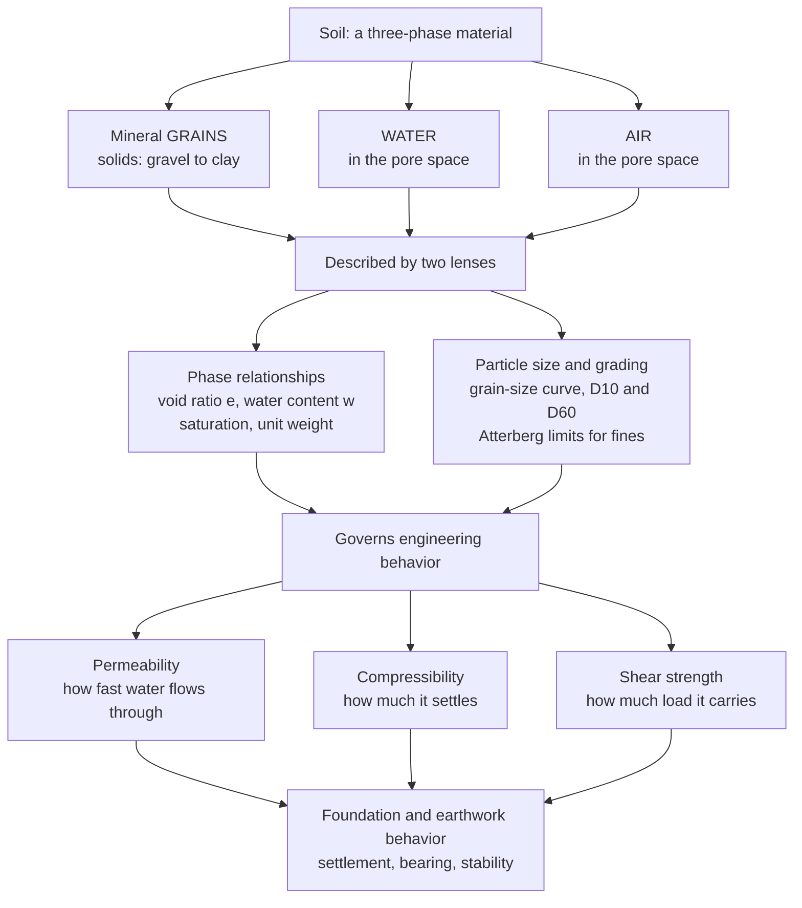

# 🪨 Soil Mechanics Fundamentals

> [!abstract] TL;DR
> **Soil mechanics** is the study of the engineering behavior of **soil** — the natural material that every building, bridge, road, dam, and pipeline ultimately rests on, yet the one part of a structure the engineer does **not manufacture, only discovers**. Soil is a **three-phase** material: mineral **grains** (solids) separated by **voids** filled with **water** and/or **air**, and its behavior is dominated far more by that hidden pore space and the water in it than by the mineralogy of the grains themselves. Engineers describe it with two lenses: **phase relationships** — the bookkeeping of **void ratio** ($e$), **water content** ($w$), **degree of saturation** ($S$), and **unit weight** — and **classification** by **particle size** (gravel → sand → silt → clay) via the **grain-size distribution** curve and, for fines, the **Atterberg limits** of plasticity. Those descriptors govern the properties that decide everything downstream: **permeability** (how fast water drains), **compressibility** (how much it settles), and **shear strength** (how much load it carries) — and therefore settlement, bearing capacity, and slope stability. Getting the ground wrong is a leading cause of construction failure, which is why characterizing soil is the essential starting point of all **geotechnical engineering**.

## Intuition

**Analogy:** Every skyscraper, highway, and dam in the world ultimately stands on **dirt** — and dirt is a maddening structural material because it is not solid at all. Picture a **jar of wet marbles**: the marbles are the mineral grains, but the story is in the *gaps between them*, filled with water and air. Now tilt and squeeze the jar in different ways. Squeeze a jar packed with **saturated clay** and it oozes out slowly, like toothpaste, taking minutes or years to give up its water. Shake a jar of **loose wet sand** and, for a terrifying instant, the grains lose contact and the whole thing behaves like a liquid — that is **liquefaction**, the same phenomenon that tips buildings over in earthquakes. The grains barely changed; what changed was the **pore water** and how it could or could not escape.

That is the whole secret of soil: its behavior depends less on the grains than on the **void space and the water in it**. Geotechnical engineering is the discipline of understanding this three-phase material — grains + water + air — well enough to build on it safely, because unlike steel or concrete, the ground is inherited, not designed. You cannot order it to a specification; you can only drill into it, test it, and characterize what nature already put there.

---

## How It Works

Soil mechanics starts by recognizing soil as **three phases** and then measuring two things about it — *how the phases are proportioned* (phase relationships) and *how big the grains are* (classification). Those two descriptions predict the engineering properties that a foundation, wall, or embankment will feel.

1. **Soil is a three-phase material.** A block of soil is mineral **solids** (the grains), plus **voids** (the gaps) that hold **water**, **air**, or both. If the voids are completely water-filled the soil is **saturated**; if completely air-filled it is **dry**; usually it is somewhere between (**moist**, or partly saturated). The engineering behavior lives in the voids.

2. **Phase relationships — the bookkeeping.** We never see the phases separately, so we relate them with a set of exact identities. **Void ratio** $e = V_v/V_s$ (voids over solids) and **porosity** $n = V_v/V$ measure the pore space; **water content** $w = W_w/W_s$ and **degree of saturation** $S = V_w/V_v$ measure the water; **specific gravity** $G_s = \rho_s/\rho_w \approx 2.65$–$2.70$ pins down the mineral. From these follow the **unit weights** — dry, moist, saturated, and submerged — that turn a soil profile into stresses.

3. **Classification — by particle size.** Coarse **granular** soils (gravel, **sand**) drain fast, have no stickiness, and are described by their **grain-size distribution**. Fine **cohesive** soils (silt, **clay**) trap water, behave plastically, and are described by their **Atterberg limits**. The boundary between "coarse" and "fine" behavior — around the 0.075 mm sieve — is one of the most consequential lines in civil engineering.

4. **Properties that follow.** Grading and phase state set the three properties that matter: **permeability** (drainage speed — sands drain in seconds, clays over decades), **compressibility** (settlement magnitude and rate), and **shear strength** (resistance to sliding failure). These decide how every foundation, retaining wall, dam, and slope will perform.



---

## Key Concepts

### Secondary Level

- **Soil is not solid — it is grains plus gaps.** A handful of soil is really mineral **grains** with **empty spaces** (voids) between them, and those spaces are filled with **water and air**. How the soil behaves depends mostly on those gaps and the water in them, not just on the grains.
- **Loose versus dense.** The same sand can be packed tight (few voids) or loose (many voids). Loose soil is weaker and settles more — think of the difference between firmly packed and freshly poured sand.
- **Sand versus clay behave completely differently.** **Sand** is gritty, drains water instantly, and does not stick together. **Clay** is made of microscopic flat particles, holds water for a very long time, and can be squished and molded like putty. This is why a sandy beach drains after a wave but a clay puddle stays muddy for days.
- **The ground is discovered, not built.** For everything else — steel, concrete — the engineer chooses the material. For soil, nature already placed it. So the first job is always to **investigate**: drill holes, take samples, and find out what is actually down there before designing anything on top.

### Undergraduate Level

- **Phase relationships and their identities.** With $e$ (void ratio), $n$ (porosity), $w$ (water content), $S$ (saturation), and $G_s$ (specific gravity of solids), the key links are $n = \dfrac{e}{1+e}$ and the **fundamental relation** $S\,e = w\,G_s$. Unit weights follow directly: dry $\gamma_d = \dfrac{G_s \gamma_w}{1+e}$, saturated $\gamma_{sat} = \dfrac{(G_s + e)\gamma_w}{1+e}$, and submerged (buoyant) $\gamma' = \gamma_{sat} - \gamma_w = \dfrac{(G_s - 1)\gamma_w}{1+e}$, with $\gamma_w = 9.81\ \text{kN/m}^3$.
- **Grain-size distribution and grading.** Coarse fractions are sized by **sieving**, fines by **hydrometer** (settling velocity via Stokes' law). Plotting **percent finer** against $\log(\text{particle size})$ gives the distribution curve, from which $D_{10}$, $D_{30}$, $D_{60}$ (the sizes at which 10/30/60 % is finer) yield the **coefficient of uniformity** $C_u = D_{60}/D_{10}$ and **coefficient of curvature** $C_c = D_{30}^2/(D_{10}D_{60})$. A **well-graded** soil ($C_u$ large, $C_c \approx 1$–$3$) packs densely; a **poorly-graded** (uniform) soil does not.
- **Atterberg limits for fines.** Clay consistency depends on water. The **liquid limit** (LL) and **plastic limit** (PL) mark the water contents where clay transitions liquid→plastic→semisolid; the **plasticity index** $PI = LL - PL$ measures how much water the clay can absorb while staying plastic — the single best index of "clayeyness."
- **Classification systems.** The **Unified Soil Classification System (USCS)** assigns two-letter symbols (SW, SP, CL, CH, ML, …) from grading and the plasticity chart's **A-line**; **AASHTO** ranks soils for road subgrades. Classification lets an engineer predict behavior before running expensive strength tests.
- **Permeability (Darcy's law).** Flow rate through soil follows $v = k\,i$, where $i$ is the hydraulic gradient and $k$ the **hydraulic conductivity**. The range is staggering: clean sands $k \approx 10^{-2}$–$10^{-5}\ \text{m/s}$, clays $k < 10^{-9}\ \text{m/s}$ — a difference of a **million or more**, which is why sands drain instantly and clays essentially do not.

### Graduate Level

- **The effective stress principle.** Terzaghi's cornerstone: soil strength and deformation are governed not by total stress $\sigma$ but by **effective stress** $\sigma' = \sigma - u$ (total minus pore-water pressure $u$). Load carried by the grain skeleton, not the water, controls behavior — the reason a rising water table can trigger failure without any new load. *This thread continues in the sibling note Effective_Stress_and_Consolidation.*
- **Time-dependent behavior and consolidation.** Because clay is nearly impermeable, applying load first raises pore pressure, which then **dissipates slowly** as water bleeds out — a diffusion process $\partial u/\partial t = c_v\,\partial^2 u/\partial z^2$ governed by the coefficient of consolidation $c_v$. Buildings on clay keep settling for years to decades; sands consolidate almost instantly.
- **Fabric, structure, and sensitivity.** Clay particles arrange in **flocculated** (edge-to-face) or **dispersed** (parallel) fabrics that hugely affect strength and permeability. **Sensitive** and **quick clays** lose most of their strength when remolded — the mechanism behind sudden, flow-like landslides in glaciomarine deposits.
- **Shear strength and state.** Failure follows the **Mohr–Coulomb** criterion $\tau_f = c' + \sigma'\tan\phi'$ in effective-stress terms; whether one uses **drained** or **undrained** parameters depends entirely on how fast load is applied relative to drainage. **Critical-state soil mechanics** unifies this by showing strength and volume change depend on the current **state** (density and stress), not fixed constants. *Developed in the sibling note Shear_Strength_of_Soils.*
- **Liquefaction.** Loose, saturated sand under cyclic (earthquake) loading tries to densify, but if it cannot drain fast enough, pore pressure spikes until $u \to \sigma$ and $\sigma' \to 0$ — the grains momentarily lose all contact stress and the soil flows like a liquid.
- **Site investigation.** Real practice rests on **borings**, in-situ tests — the **Standard Penetration Test (SPT)** blow-count $N$ and **Cone Penetration Test (CPT)** tip resistance — and careful (ideally undisturbed) **sampling**, because the profile's variability, not any single number, is the true design challenge. *Foundation and earth-retaining design build on this in Foundation_Engineering, Retaining_Walls_and_Lateral_Earth_Pressure, and Slope_Stability_and_Earthworks.*

---

## Python Demo

```python
# ============================================================================
# SOIL IS A THREE-PHASE MATERIAL: mineral GRAINS + WATER + AIR in the pores.
# This script performs the two foundational jobs of soil mechanics:
#   (a) PHASE RELATIONSHIPS -> the "bookkeeping" that turns void ratio, water
#       content and specific gravity into unit weights and degree of saturation,
#       and shows how unit weight FALLS as the void space grows.
#   (b) CLASSIFICATION       -> the grain-size distribution curve that separates
#       coarse (sand) from fine (clay) soils, with D10/D60 and the coefficient
#       of uniformity Cu -- the numbers behind every soil classification.
#
# Requires: numpy, matplotlib   (erf from the standard library)
import numpy as np
import matplotlib.pyplot as plt
from math import erf, sqrt

gamma_w = 9.81       # unit weight of water            [kN/m^3]
Gs      = 2.70       # specific gravity of solids (typical rock-forming minerals)

# ============================================================================
# (a) PHASE RELATIONSHIPS: derive properties from (void ratio e, water content w)
# ============================================================================
# Exact identities used constantly in geotechnical practice:
#   porosity          n         = e / (1 + e)
#   dry unit weight   gamma_d   = Gs * gamma_w / (1 + e)
#   saturated u.w.    gamma_sat = (Gs + e) * gamma_w / (1 + e)     [S = 1]
#   submerged u.w.    gamma_sub = (Gs - 1) * gamma_w / (1 + e)     [buoyant]
#   fundamental link  S * e     = w * Gs
e         = np.linspace(0.30, 1.30, 200)          # void ratio: dense -> loose
g_dry     = Gs * gamma_w / (1 + e)
g_sat     = (Gs + e) * gamma_w / (1 + e)
g_sub     = (Gs - 1) * gamma_w / (1 + e)
S_partial = 0.50                                   # a 50%-saturated (moist) soil
w_partial = S_partial * e / Gs                     # from S e = w Gs
g_moist   = Gs * (1 + w_partial) * gamma_w / (1 + e)

# A worked point (a real-ish silty sand) to print the full bookkeeping:
e0, w0 = 0.65, 0.18
S0  = w0 * Gs / e0
n0  = e0 / (1 + e0)
gd0 = Gs * gamma_w / (1 + e0)
gm0 = Gs * (1 + w0) * gamma_w / (1 + e0)
print(f"=== (a) Phase relationships   (Gs = {Gs:.2f}) ===")
print(f"  given : void ratio e = {e0:.2f},  water content w = {w0*100:.0f}%")
print(f"  porosity n             = {n0:.3f}")
print(f"  degree of saturation S = {S0*100:.1f}%   (from S e = w Gs)")
print(f"  dry unit weight  gamma_d = {gd0:5.2f} kN/m^3")
print(f"  moist unit weight gamma  = {gm0:5.2f} kN/m^3")

# ============================================================================
# (b) GRAIN-SIZE DISTRIBUTION: percent finer vs log(particle size)
# ============================================================================
def percent_finer(d, d50, sigma):
    """Idealized lognormal 'percent finer by mass' curve; d in mm."""
    z = (np.log(d) - np.log(d50)) / sigma
    return 100.0 * 0.5 * (1.0 + np.vectorize(erf)(z / sqrt(2.0)))

d    = np.logspace(-4, 1.3, 400)                    # 0.0001 mm .. ~20 mm
sand = percent_finer(d, d50=0.55, sigma=1.25)       # well-graded sand
clay = percent_finer(d, d50=0.0012, sigma=0.90)     # fine clay

# D10, D30, D60 by inverse interpolation on the (monotone) sand curve:
D10 = np.interp(10, sand, d)
D30 = np.interp(30, sand, d)
D60 = np.interp(60, sand, d)
Cu  = D60 / D10                                     # coefficient of uniformity
Cc  = D30**2 / (D10 * D60)                          # coefficient of curvature
clay_frac = np.interp(0.002, d, clay)               # % of clay finer than 0.002 mm
print(f"\n=== (b) Grain-size distribution (the sand sample) ===")
print(f"  D10 = {D10:.3f} mm,  D30 = {D30:.3f} mm,  D60 = {D60:.3f} mm")
print(f"  coefficient of uniformity Cu = D60/D10 = {Cu:.1f}   (>~6 -> well graded)")
print(f"  coefficient of curvature  Cc          = {Cc:.2f}   (1-3 -> well graded)")
print(f"  clay-size fraction (<0.002 mm) of the clay sample = {clay_frac:.0f}%")

# ------------------------------ plotting ------------------------------
fig, (axL, axR) = plt.subplots(1, 2, figsize=(14, 6))
fig.suptitle("Soil Mechanics Fundamentals: Phase Relationships and Classification",
             fontsize=14, fontweight="bold")

# LEFT: unit weights vs void ratio (the phase-relationship signature)
axL.plot(e, g_sat,   color="#1f77b4", lw=2.2, label="saturated  (S = 1)")
axL.plot(e, g_moist, color="#2ca02c", lw=2.2, label="moist  (S = 50%)")
axL.plot(e, g_dry,   color="#d62728", lw=2.2, label="dry  (S = 0)")
axL.plot(e, g_sub,   color="#8c564b", lw=2.2, ls="--", label="submerged (buoyant)")
axL.axvline(e0, color="gray", ls=":", lw=1)
axL.annotate(f"worked point\ne = {e0}", xy=(e0, 12.5), fontsize=8, color="gray")
axL.set_xlabel("void ratio  e   (looser / more pore space ->)")
axL.set_ylabel("unit weight   [kN/m^3]")
axL.set_title("(a) Phase relationships: unit weight falls as voids grow",
              fontsize=11)
axL.legend(fontsize=8, loc="upper right")
axL.grid(alpha=0.3)

# RIGHT: grain-size distribution curve (log x, geotech convention: coarse left)
axR.semilogx(d, sand, color="#ff7f0e", lw=2.4, label="SAND (coarse / granular)")
axR.semilogx(d, clay, color="#1f77b4", lw=2.4, label="CLAY (fine / cohesive)")
for xb, lab in [(4.75, "gravel | sand"), (0.075, "sand | silt"),
                (0.002, "silt | clay")]:
    axR.axvline(xb, color="gray", ls="--", lw=0.9)
    axR.text(xb, 104, lab, rotation=90, va="bottom", ha="center",
             fontsize=7, color="gray")
for Dv, P, name in [(D10, 10, "D10"), (D60, 60, "D60")]:
    axR.plot([Dv], [P], "ko", ms=5)
    axR.annotate(f"{name} = {Dv:.2f} mm", xy=(Dv, P), xytext=(Dv * 1.4, P - 16),
                 fontsize=8, arrowprops=dict(arrowstyle="->", color="k", lw=1))
axR.text(0.03, 0.06, f"Cu = D60/D10 = {Cu:.1f}\nCc = {Cc:.2f}",
         transform=axR.transAxes, fontsize=9,
         bbox=dict(boxstyle="round", fc="#fff7e6", ec="gray"))
axR.set_xlabel("particle size  d  [mm]   (log scale; coarse left, fine right)")
axR.set_ylabel("percent finer by mass   [%]")
axR.set_title("(b) Classification: the grain-size distribution curve", fontsize=11)
axR.set_ylim(0, 110)
axR.invert_xaxis()                                  # coarse grains on the left
axR.legend(fontsize=8, loc="center left")
axR.grid(alpha=0.3, which="both")

plt.tight_layout(rect=[0, 0, 1, 0.95])
plt.show()
```

Running this prints the full **phase bookkeeping** for a worked soil (porosity, saturation, and unit weights derived from just $e$, $w$, and $G_s$) and the **classification numbers** for a sand ($D_{10}$, $D_{60}$, and $C_u$). The **left panel** shows the phase-relationship signature every geotechnical engineer carries in their head: as the **void ratio grows** (looser soil, more pore space), all four unit weights **fall**, and the vertical gap between the *dry* and *saturated* curves is exactly the weight of water the pores can hold. The **right panel** is the working tool of soil classification — the **grain-size distribution** curve — plotted with the coarse fractions on the left. The broad, gently sloping **sand** curve straddles several size classes (a well-graded soil), while the **clay** curve sits far to the fine-grained right, most of it below the 0.002 mm clay boundary. The marked $D_{10}$ and $D_{60}$ give $C_u$, the single number that says whether a granular soil will pack densely or stay loose.

---

## Real-World Applications

> **Example:** The **Leaning Tower of Pisa** is soil mechanics written in marble. It leans not because of any structural flaw but because it sits on a layered profile of soft, compressible **marine clay** whose **consolidation** — the slow squeezing-out of pore water under the tower's weight — proceeded unevenly beneath the two sides of the foundation over centuries. Every concept in this note is present: the clay's high **void ratio** and near-zero **permeability** made it settle enormously and *slowly*, the differential settlement rotated the tower, and the 1990s stabilization worked by carefully extracting soil from the *high* side to let it settle back — an intervention only possible because engineers understood the phase behavior and time-dependent consolidation of that specific clay. Terzaghi founded modern soil mechanics in the 1920s precisely to make such behavior predictable rather than mysterious.

- **Foundations of everything.** Sizing a spread footing or a pile so its **bearing pressure** stays below the soil's capacity, and its **settlement** within tolerable limits, begins with the phase relationships and classification covered here — the direct link to *Foundation_Engineering*.
- **Kansai International Airport.** Built on soft marine clay in Osaka Bay, its designers used consolidation theory to *predict* meters of settlement over decades and pre-loaded and jacked the structure accordingly — a triumph of quantitative soil mechanics.
- **Earthquake liquefaction.** The 1964 Niigata and 2011 Christchurch earthquakes turned loose, saturated **sand** into a temporary liquid, tipping buildings and erupting sand boils — the pore-pressure and effective-stress mechanics of granular soils in action.
- **Earth dams and embankments.** Selecting, compacting, and grading fill by its **USCS** class controls seepage, strength, and stability — poor classification of fill has failed dams and levees worldwide.
- **Roads and pavements.** The **AASHTO** classification of a subgrade soil, driven by its grain size and plasticity, directly sets pavement thickness and drainage design.

---

## Common Pitfalls

- **Ignoring the water.** The single most common error is treating soil as a dry solid. Soil behavior is dominated by **pore water and its pressure**; forget it and you cannot explain settlement, liquefaction, slope failures after rain, or why a dry sand castle collapses when flooded. Water is not a nuisance in soil mechanics — it is the subject.
- **Confusing total and effective stress.** Design must be done in **effective stress** ($\sigma' = \sigma - u$), because it is the grain-skeleton stress that governs strength and deformation. Using total stress where effective stress applies (or vice versa) is a classic exam and field blunder — a rising water table changes $u$ and can cause failure with *no* new load.
- **Skimping on site investigation.** Soil is spatially variable across a single site; assuming uniform, competent ground because one boring looked good has sunk more projects (literally, via settlement) than any structural mistake. Characterize the *profile and its variability*, not a single sample.
- **Classifying fine soils by grain size alone.** For clays and silts, **plasticity** (the Atterberg limits), not particle size, controls behavior. Two soils with identical grain-size curves can behave completely differently depending on their **plasticity index** — which is why USCS routes fine soils through the plasticity chart.
- **Using the wrong drainage condition.** Whether to use **drained** or **undrained** shear parameters depends on how fast load is applied relative to how fast the soil drains. Analyzing a clay's short-term stability with drained parameters (or its long-term stability with undrained ones) can be dangerously unconservative.
- **Sample disturbance.** An "undisturbed" clay sample that was actually remolded during sampling gives falsely low strength and high compressibility. In **sensitive** clays this error is severe — the tested strength can be a fraction of the in-situ value.

---

## Related Concepts

**The ground itself (Earth Science vault)**
- [[Weathering_and_Soils]] — how rock breaks down into the soil every foundation bears on; the origin of *residual* (in-place) versus *transported* soils
- [[Sedimentary_Rocks_and_Environments]] — transported soils are sediments; the sorting and grading processes that produce a soil's grain-size distribution
- [[Mass_Wasting_and_Slope_Stability]] — the slope-failure physics that soil shear strength and pore pressure govern, and the geologic face of the sibling *Slope_Stability_and_Earthworks*
- [[Groundwater_and_Karst]] — the water table and subsurface flow that set the pore-water pressure controlling effective stress and permeability

**Particles, colloids, and mechanical response (Materials Science vault)**
- [[Nanoparticles_and_Colloidal_Systems]] — clay particles are colloidal platelets whose surface charge and double-layer forces produce plasticity and cohesion, the behavior that separates fine from coarse soils
- [[Stress_Strain_and_Elastic_Moduli]] — the stress–strain framing behind soil stiffness and compressibility, adapted here to a particulate, water-filled skeleton

**Flow through the pores (Fluid Dynamics vault)**
- [[Low_Reynolds_Number_Flow]] — the creeping, viscous (Stokes) flow regime that governs slow seepage through soil pores, the microscopic physics beneath Darcy's law and hydraulic conductivity

**Seeing into the ground (Geophysics vault)**
- [[Ground_Penetrating_Radar_and_Near_Surface_Geophysics]] — non-invasive imaging that complements borings in site investigation
- [[Environmental_and_Hydrogeophysics]] — subsurface and groundwater characterization methods used to map soil layers and the water table

**The vault hub**
- [[Civil_Engineering_Overview]] — the six-pillar map of civil engineering; this note opens **Pillar 3, Geotechnical Engineering**

*Within this section (siblings, building on these fundamentals):* **Effective_Stress_and_Consolidation** (why and how soil settles over time), **Shear_Strength_of_Soils** (Mohr–Coulomb strength and drainage), **Foundation_Engineering** (footings, rafts, and piles), **Retaining_Walls_and_Lateral_Earth_Pressure** (holding back soil), and **Slope_Stability_and_Earthworks** (cuts, fills, and embankments).

---

## Review Questions

**Secondary**
1. A jar of dry sand and a jar of wet clay both look like "dirt," yet the sand drains the moment you pour water in while the clay stays muddy for days. Using the idea that soil is **grains plus water-filled gaps**, explain in plain words why they behave so differently — and why an engineer must first find out *which* kind of soil is under a building before designing its foundation.

**Undergraduate**
2. A saturated soil sample has void ratio $e = 0.80$ and specific gravity $G_s = 2.70$. (a) Compute its porosity $n$, its water content $w$ at full saturation, and its saturated and submerged unit weights. (b) A second, granular soil has $D_{10} = 0.15$ mm and $D_{60} = 0.90$ mm — compute $C_u$ and state whether it is well-graded or uniform. (c) Explain why grain-size classification is sufficient for this sand but *insufficient* for a clay, and what additional test you would run for the clay.

**Graduate**
3. A wide building is founded on a thick layer of soft, saturated clay. Immediately after construction it has settled only slightly, but predictions say it will settle another 300 mm over the next 20 years. (a) Using the **effective stress principle** and the low permeability of clay, explain the mechanism that makes the settlement so large and so slow, and what happens to pore-water pressure over that time. (b) Contrast this with the same load placed on a clean, dense sand. (c) If instead the sand were *loose* and *saturated* and the site were seismic, explain how the very same effective-stress and pore-pressure ideas predict **liquefaction** — and why drainage rate is the decisive variable in all three cases.

---

## Sources

- B. M. Das & K. Sobhan — *Principles of Geotechnical Engineering*, 9th ed. (Cengage, 2018)
- R. D. Holtz, W. D. Kovacs & T. C. Sheahan — *An Introduction to Geotechnical Engineering*, 2nd ed. (Pearson, 2011)
- K. Terzaghi, R. B. Peck & G. Mesri — *Soil Mechanics in Engineering Practice*, 3rd ed. (Wiley, 1996)
- R. F. Craig — *Craig's Soil Mechanics*, 8th ed. (CRC Press / Spon, 2012)

---

#civil-engineering #geotechnical #soil-mechanics #void-ratio #soil-classification
