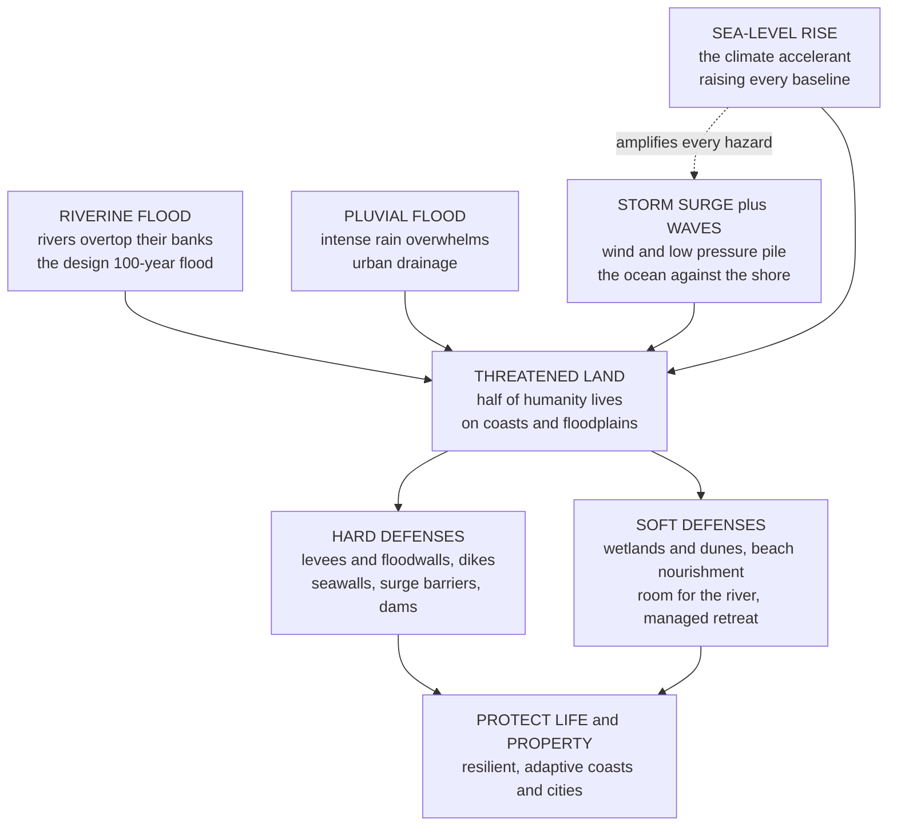

# 🌊 Coastal and Flood Engineering

> [!abstract] TL;DR
> Roughly **half of humanity lives near a coast or a river** — precisely where water most wants to reclaim the land — and defending them is one of civil engineering's oldest, hardest, and now most urgent jobs. The **enemy arrives in four forms**: a **river swollen by rain overtopping its banks** (*riverine / fluvial* flooding), **intense rain overwhelming a city's drains** (*pluvial / urban* flooding), the **ocean piled against the shore** by a storm's wind and low pressure (*coastal* flooding — **storm surge** plus wave setup and run-up riding on the tide), and — the new accelerant — a **rising sea** that lifts the baseline under every other hazard. Engineers quantify the threat through the **design flood** — the notorious **"100-year flood"**, which is not once-per-century but a level with a **1% chance every single year** — and map the **floodplain** it would inundate using **stage-discharge rating curves** and flood zoning. They then fight back with **two philosophies**. **HARD (structural) defenses** wall the water out: **levees and floodwalls** (with a **freeboard** margin above the design level), **dikes and polders** (the Dutch built a nation *below* sea level this way), **dams and detention basins** for storage, and **surge barriers** that swing shut before a storm (Thames Barrier, MOSE Venice, Dutch Delta Works). But water is patient and finds the weak point — it can **overtop**, or worse, quietly destroy a levee from *within* by **seepage and piping** or foundation failure (New Orleans in Katrina, 2005). **SOFT (nonstructural) defenses** work *with* nature: **floodplain zoning**, **early-warning systems**, **restored wetlands and mangroves** that soak up surge and attenuate waves, **"room for the river,"** and — the hardest choice — **managed retreat**. On the open coast, engineers wrestle with **breaking waves and run-up**, **longshore sediment transport** that builds and starves beaches, and structures that trade one problem for another: **seawalls** protect the land behind but **reflect waves and can worsen erosion**; **groins** trap sand updrift but **starve the coast downdrift**; **beach nourishment** softly replenishes sand but must be repeated. Over all of it looms the **century's defining amplifier — sea-level rise and intensifying storms** — forcing defenses that are **higher, adaptive, and increasingly nature-based**, and confronting society with the wrenching question of **protect versus retreat**, and who pays. Floods are the **most common and costly natural disaster on Earth**; this is the **climate front line of civil engineering.**

## Intuition

**Analogy — defending a sandcastle against an incoming tide.** Every child who has built a sandcastle at the beach knows the coming duel. The tide is rising, waves are pushing up the sand, and you have a few strategies. You can **build a wall** — pat the sand into a hard rampart and dig a moat — and for a while it works, until a bigger wave *overtops* it, or the water seeps *underneath* and the wall slumps from within, or the sea simply keeps rising until your wall is too short. Or you can **work with the beach** — build farther back from the water, pile up a broad gentle dune the waves can climb and dissipate on, and accept that the shoreline will move. The child at the beach is rehearsing, in miniature, the two-thousand-year-old argument at the heart of coastal and flood engineering: do you **wall the water out**, or do you **give the water room and move out of its way** — and what do you do when the tide itself keeps climbing higher every year?

Scale that sandcastle up to a **nation**. The Dutch chose the wall — and then some: they diked off the sea, pumped out the water, and built cities, farms, and airports on **polders that sit meters below sea level**, defended by the greatest flood-works ever built. New Orleans chose the wall too — a ring of levees around a bowl-shaped city — and in 2005 Hurricane Katrina's **storm surge** found the weak points, the floodwalls failed, and the bowl filled with water, drowning a city. Meanwhile the same physics plays out on every eroding beach, every river town behind a levee, every low island. The **hazard** comes as a swollen river, a wall of surge, gnawing waves, or a creeping rise in the sea; the **stake** is the huge share of humanity and wealth that clusters where land meets water; and the **engineer's answer** is some blend of hard walls and soft, natural buffers — a blend that a warming world of higher seas and fiercer storms is forcing everyone to rethink.

---

## How It Works

### Core Mechanics

1. **Name the flood source — there are four, and they can combine.** *Riverine (fluvial)* flooding is a river overtopping its banks when upstream rain and snowmelt deliver more water than the channel can carry (this ties directly to hydrology's **design flood** and **floodplain**). *Pluvial (urban)* flooding is intense rain overwhelming the local drainage before it ever reaches a river. *Coastal* flooding is the ocean driven onto the land by **storm surge** (wind and low pressure piling water up), plus **wave setup and run-up**, all riding on the astronomical **tide**. And *compound* events stack them — a hurricane that dumps rain on a river *and* drives surge up its mouth at high tide (Houston/Harvey, 2017) is far worse than any one alone.

2. **Quantify the hazard with the design flood.** Engineers cannot design for "the worst possible" flood, so they pick a **return period** \(T\) — commonly the **100-year flood** for river defenses. Crucially this is a *probability*, not a schedule: the 100-year flood has an **annual exceedance probability** of \(p = 1/T = 1\%\) — it can happen two years running. Over an \(n\)-year exposure the chance of seeing at least one is \(R = 1 - (1 - 1/T)^n\), which for a 100-year flood over a 30-year mortgage is a sobering **26%**.

3. **Turn discharge into a water level — the rating curve.** Hydrology gives a *discharge* \(Q\) (m³/s); what floods the town is the *water level* (**stage**). The **stage-discharge rating curve** \(Q = C(h - h_0)^m\) is the field-calibrated bridge between them, letting you translate the 100-year discharge into the 100-year *stage* and then map the **floodplain** it inundates.

4. **Choose a defense philosophy — hard or soft.** **Hard/structural** defenses physically block or store water: **levees and floodwalls** raised above the design stage with a **freeboard** safety margin; **dikes and polders**; **dams and detention basins** that store the flood peak; **surge barriers** and **floodgates** that close off an estuary before a storm; and **channel improvements or diversions** that speed water past a city. **Soft/nonstructural** defenses reduce *exposure and vulnerability* instead of fighting the water: **floodplain zoning** that keeps people out of harm's way, **early-warning and evacuation** systems, **wetland and mangrove restoration** that dissipate surge and waves, **"room for the river"** that widens floodplains, and **managed retreat** that abandons the most exposed land.

5. **On the open coast, reckon with waves and sediment.** Waves shoal, **refract**, and **break** as they approach shore (depth-limited breaking at roughly \(H_b \approx 0.78\,h\)), then **run up** the beach face. **Longshore sediment transport** — the river of sand driven along the coast by breaking waves — continually builds and erodes beaches. Coastal structures intervene: **seawalls and revetments** armor the shoreline but **reflect** wave energy and often accelerate erosion at their toe and ends; **groins and breakwaters** trap or block sand, protecting one stretch while **starving the coast downdrift**; **beach nourishment** softly rebuilds the beach by importing sand.

6. **Add the climate amplifier — sea-level rise.** A rising mean sea level lifts the **baseline** under tides, surge, and waves alike, so a defense sized for today is overtopped tomorrow. Combined with **more intense storms and heavier rainfall**, this demands **adaptive** design — defenses that can be raised in stages, or a planned shift from *protect* to *accommodate* to *retreat* — and forces hard questions of cost, lock-in, and **equity**.

### Flow / Architecture



---

## Key Concepts

### Secondary Level

- **A flood is just water where it should not be — and it arrives three ways.** From a **river** that fills up with rain and spills over its banks; from **rain** falling so hard the drains cannot keep up and streets turn to rivers; and from the **sea**, when a storm shoves the ocean onto the land. Floods are the **most common and most expensive natural disaster** in the world.
- **Storm surge is the ocean piled up by a storm.** A hurricane's fierce winds push seawater toward the shore, and its low air pressure lets the sea bulge upward, so the water level climbs meters above normal. If the surge arrives at **high tide**, it is worse still. This wall of water — not the wind — is what drowns coastal cities.
- **The "100-year flood" does not mean once a century.** It means a flood so big it has a **1-in-100 chance of happening in any given year**. You can get two in a row, or three in a decade. Engineers use it as a **design target** — the size of flood a defense should be built to hold back.
- **Two ways to fight water: build a wall, or make room.** **Hard defenses** are walls — **levees** (long earthen banks along a river), **floodwalls**, **seawalls**, and giant **surge barriers** that swing shut before a storm. The **Dutch** built so many walls and pumps that much of their country sits *below sea level*. **Soft defenses** work with nature — keeping buildings out of the floodplain, restoring **wetlands and sand dunes** that soak up floods, and warning people to **evacuate** in time.
- **Walls can fail — and when they do it is catastrophic.** Water can pour *over* the top of a levee, or sneak *underneath* it and wash it away from below. When the levees around **New Orleans** failed during **Hurricane Katrina (2005)**, most of the city flooded and over 1,800 people died. A defense is only as strong as its weakest point.
- **The sea is rising, and that changes everything.** As the planet warms, the ocean is slowly rising, so every storm surge now starts from a **higher baseline** and reaches farther inland. Defenses that were tall enough 50 years ago are becoming too short — one of the biggest engineering challenges of this century.

### Undergraduate Level

- **Flood frequency and the design flood.** The **return period** \(T\) and the **annual exceedance probability** \(p\) are reciprocals: \(p = 1/T\). Assuming independent years, the probability of at least one exceedance in \(n\) years is the **encounter (risk) probability**
$$R = 1 - \left(1 - \tfrac{1}{T}\right)^n.$$
A levee built to the 100-year flood still carries \(R \approx 26\%\) over 30 years and \(\approx 63\%\) over 100 years — which is exactly why critical works use far rarer design floods (the Dutch design major sea dikes to the **1-in-10,000-year** event).
- **Stage-discharge rating and floodplain mapping.** A gauging station calibrates \(Q = C(h - h_0)^m\); inverting gives the **stage** \(h\) for the design discharge. Overlaying that stage on the terrain (a DEM) yields the **flood inundation extent** — the statutory **floodplain** and flood-zone maps that drive land-use and **flood insurance** (e.g., FEMA's 1% and 0.2% annual-chance zones).
- **Levee and floodwall design.** Crest elevation \(=\) design flood level \(+\) **freeboard** (a margin, typically \(0.5\)–\(1.5\) m, for waves, wind setup, settlement, and uncertainty). Levees fail three ways, and **overtopping is only one**: (1) **overtopping** (water over the crest, then backside erosion); (2) **through-seepage and piping** (water finds a path through or under the embankment, erodes a channel backward, and the levee unravels — pure **effective-stress** and **seepage** mechanics, where rising pore pressure at the toe drives a "quick" condition); and (3) **slope/foundation instability**. Katrina's New Orleans failures were dominantly **foundation and floodwall failures**, not overtopping.
- **Anatomy of the total coastal water level.** The still-water level a defense must hold is a **sum**: astronomical **tide** \(+\) **storm surge** \(+\) **sea-level rise**, and then **wave setup and run-up** on top. Surge itself has parts: an **inverse-barometer** rise of roughly \(1\ \text{cm}\) per \(1\ \text{hPa}\) of pressure drop, plus **wind setup**, whose slope scales as \(\dfrac{d\eta}{dx} \approx \dfrac{\tau_w}{\rho g h}\) — note the \(1/h\): surge is dramatically larger over **shallow shelves** (the Gulf of Mexico, the Bay of Bengal, the North Sea).
- **Wave transformation and run-up.** Deep-water wavelength is \(L_0 = gT^2/2\pi\); as waves shoal into shallow water their speed drops to \(c = \sqrt{gh}\), they **refract** to align with the shore, steepen, and **break** at a depth-limited height \(H_b \approx 0.78\,h_b\). The **run-up** height they reach on a slope scales with the **Iribarren number** \(\xi = \tan\beta / \sqrt{H/L_0}\) — steeper slopes and longer-period swell run higher, which sets the crest a seawall or dune must reach.
- **Longshore transport and shoreline change.** Obliquely breaking waves drive a **longshore sediment flux** \(Q_s\) along the coast; where \(Q_s\) diverges the beach erodes, where it converges the beach grows. A **groin** blocks \(Q_s\), fattening the updrift beach and **starving the downdrift** one (fixing erosion in one place *causes* it next door). A **seawall** reflects waves, often scouring the beach in front until it disappears. **Beach nourishment** — importing sand — is the *soft* alternative that keeps a natural, dissipative beach but must be **renourished** as the waves carry the sand away.
- **Adding sea-level rise: the Bruun rule.** To first order, a rise in sea level \(S\) drives a shoreline **retreat** \(\Delta x \approx S \cdot \dfrac{L_*}{B + h_*}\) (the **Bruun rule**), where the beach profile translates upward and landward; the ratio \(L_*/(B+h_*)\) is typically \(50\)–\(100\), so a modest rise can drive a large retreat — the reason low-lying coasts are so exposed.

### Graduate Level

- **Nonstationarity — the assumption that broke.** Classical flood-frequency analysis fits an extreme-value distribution (e.g., **GEV / Gumbel**) to the annual-maxima series *assuming stationarity* — that the statistics of tomorrow's floods match yesterday's. **Climate change voids that assumption**: warming intensifies precipitation extremes and raises sea level, so the parameters drift with time. Modern practice uses **nonstationary GEV** with time-varying location/scale, or **partial-duration (peaks-over-threshold)** models with trends, and reports **conditional** rather than fixed design levels. "**Stationarity is dead**" (Milly et al., 2008) is the field's rallying cry.
- **Compound and joint events.** The dangerous floods are often **compound**: correlated drivers coinciding — surge at high tide plus a river in spate (a hurricane at a river mouth), or extreme rain on already-saturated ground. Treating drivers as independent **underestimates** the joint hazard; the state of the art uses **copulas** and multivariate extreme-value models to capture the dependence structure, yielding "**AND**" probabilities that can be far larger than the product of the marginals.
- **Numerical surge and wave modeling.** Operational forecasting solves the **shallow-water equations** on high-resolution unstructured grids — **SLOSH** (fast, parametric) and **ADCIRC** (research-grade) for surge, coupled to spectral wave models (**SWAN**, **WAVEWATCH III**) so that **wave setup** and **radiation stress** feed back onto the surge. Ensemble forcing from tropical-cyclone track/intensity spread yields **probabilistic surge** guidance, and precomputed synthetic-storm suites (the "**JPM-OS**" joint-probability method) produce the surge-hazard curves used for FEMA base flood elevations.
- **Reliability, fragility, and residual risk.** A levee is not a wall with a sharp pass/fail height; it is a **system of components** each with a **fragility curve** — probability of failure versus load (water level), integrating overtopping, piping, and instability modes. Overall system reliability is dominated by the **weakest reach** (a levee is a chain). Every defense leaves **residual risk** — the flood beyond the design event still occurs, and *behind* a levee the consequences are catastrophic because the water, once in, cannot get out (the New Orleans "bowl").
- **The levee effect and the safe-development paradox.** Building a levee reduces the *probability* of flooding but, by making the floodplain feel safe, **attracts intense development**, raising the *consequences* of the rare failure. Expected annual damage can *rise* despite the defense. This coupling of human and hydrological systems is the domain of **socio-hydrology**; the policy corrective is to preserve floodplain function and pair structural defense with zoning, insurance pricing, and warning.
- **Economic optimization of defense height — Van Dantzig.** After the 1953 North Sea flood, the Dutch **Delta Committee** framed dike height as a **cost-benefit optimum**: raising the dike costs money now; a higher dike lowers the expected present value of flood losses. Minimizing total cost \(=\) construction \(+\) discounted expected damage yields an **optimal exceedance probability** and gave the world its first formal, quantitative **acceptable-risk** standard for flood defense (Van Dantzig, 1956) — the intellectual ancestor of all risk-based flood engineering.
- **Adaptation under deep uncertainty.** Because future sea level and storm climate are **deeply uncertain**, single fixed designs risk over- or under-building. **Dynamic Adaptive Policy Pathways** (as in the Dutch Delta Programme and the Thames Estuary 2100 plan) design **sequences** of actions with pre-identified **adaptation tipping points** and **signposts**, keeping options open and switching pathways as the sea reveals itself. The strategic menu is **protect** (hold the line), **accommodate** (live with water — floatable buildings, wet-proofing), or **retreat** (planned relocation) — chosen per location on cost, feasibility, and value.
- **Nature-based solutions and "building with nature."** **Wetlands, salt marshes, mangroves, oyster reefs, and dunes** attenuate waves and absorb surge — coastal wetlands can reduce wave energy by well over half across a modest width and lower surge by decimeters per kilometer of marsh. The Dutch **"Sand Motor"** feeds a single mega-nourishment that natural longshore transport redistributes over decades. These **green-grey hybrids** add habitat and carbon, *grow* with sediment supply (self-adapting to slow SLR), and avoid the ecological damage and lock-in of hard armor — though they need space and sediment and offer less certain protection against extreme events. The equity dimension — who is defended, who is bought out, and who bears the residual risk — is now inseparable from the engineering.

---

## Python Demo

```python
# ============================================================================
# COASTAL & FLOOD ENGINEERING -- two faces of "how high must the defense be?"
#
#   (a) RIVER / FLOODPLAIN: a stage-discharge RATING CURVE turns a design
#       DISCHARGE into a design STAGE (water level). We mark the 100-year
#       flood level, size a LEVEE = design level + FREEBOARD, and show how a
#       rarer, climate-amplified flood OVERTOPS that levee.
#
#   (b) COAST / CLIMATE: a storm-surge + SEA-LEVEL-RISE projection. The
#       required defense crest = rising mean sea level + storm surge +
#       freeboard grows every decade, eventually overtopping a seawall that
#       was sized for mid-century -- the adaptation gap.
#
# Requires: numpy, matplotlib
import numpy as np
import matplotlib.pyplot as plt

# ============================================================================
# (a) STAGE-DISCHARGE RATING CURVE + LEVEE DESIGN
# ============================================================================
# Rating curve  Q = C * h**m   (h = stage above channel bed [m], Q [m^3/s])
C, m = 41.2, 1.8
def stage_of_Q(Q):        # invert the rating curve: h for a given discharge
    return (Q / C) ** (1.0 / m)

Q = np.linspace(1.0, 2600.0, 600)
h = stage_of_Q(Q)

Q_bank = 500.0            # bankfull discharge -> water starts spilling onto floodplain
Q_100  = 1500.0          # 100-year design flood discharge
Q_ext  = 2200.0          # rarer, climate-amplified flood (~500-yr)

h_bank = stage_of_Q(Q_bank)
h_100  = stage_of_Q(Q_100)
h_ext  = stage_of_Q(Q_ext)

freeboard  = 1.0                 # safety margin above design flood [m]
levee_crest = h_100 + freeboard  # design the levee to the 100-yr flood + freeboard

# Encounter risk: chance of >=1 exceedance of the T-year flood over n years
def encounter_risk(T, n):
    return 1.0 - (1.0 - 1.0 / T) ** n

print("=== (a) River flood, rating curve & levee ===")
print(f"  bankfull stage (Q={Q_bank:.0f})      : {h_bank:5.2f} m")
print(f"  100-yr flood stage (Q={Q_100:.0f})   : {h_100:5.2f} m")
print(f"  levee crest = 100-yr + {freeboard:.1f} m freeboard : {levee_crest:5.2f} m")
print(f"  extreme flood stage (Q={Q_ext:.0f})  : {h_ext:5.2f} m  "
      f"-> {'OVERTOPS levee by %.2f m' % (h_ext-levee_crest) if h_ext>levee_crest else 'contained'}")
print(f"  risk of the 100-yr flood over a 30-yr mortgage : {encounter_risk(100,30)*100:4.1f}%")

# ============================================================================
# (b) STORM SURGE + SEA-LEVEL RISE -> growing defense-height requirement
# ============================================================================
years = np.arange(2020, 2101)
t     = years - 2020

# accelerating mean sea-level rise [m] above the 2020 baseline
msl   = 0.004 * t + 0.00006 * t**2
# design storm surge (surge + wave setup) [m], slowly intensifying with warming
surge = 2.8 + 0.005 * t
fb    = 0.5                                   # coastal freeboard [m]
req_crest = msl + surge + fb                  # required defense crest each year

# a seawall built to meet the mid-century (2050) requirement, then held fixed
i2050      = np.where(years == 2050)[0][0]
wall_crest = req_crest[i2050]
deficit_2100 = req_crest[-1] - wall_crest

print("\n=== (b) Coastal defense under sea-level rise ===")
print(f"  sea-level rise by 2100        : {msl[-1]:4.2f} m")
print(f"  required crest 2020 / 2050 / 2100 : "
      f"{req_crest[0]:4.2f} / {req_crest[i2050]:4.2f} / {req_crest[-1]:4.2f} m")
print(f"  seawall built to 2050 crest   : {wall_crest:4.2f} m")
print(f"  adaptation gap by 2100        : {deficit_2100:4.2f} m of extra height needed")

# ============================================================================
# PLOTS
# ============================================================================
fig, ax = plt.subplots(1, 2, figsize=(15, 6))

# --- (a) rating curve + flood levels + levee ---
a0 = ax[0]
a0.plot(Q, h, color="navy", lw=2.4, label="stage-discharge rating curve")
a0.axhline(h_bank, color="0.5", ls=":", lw=1.3)
a0.text(30, h_bank + 0.08, "bankfull (spills onto floodplain)", fontsize=8, color="0.4")
a0.axhline(h_100, color="darkorange", ls="--", lw=1.6)
a0.text(30, h_100 + 0.08, "100-yr design flood", fontsize=8, color="darkorange")
a0.axhline(levee_crest, color="seagreen", ls="-", lw=2.0)
a0.text(30, levee_crest + 0.08, "levee crest = 100-yr + freeboard", fontsize=8, color="seagreen")
a0.axhline(h_ext, color="crimson", ls="--", lw=1.6)
a0.text(30, h_ext + 0.08, "extreme flood -> OVERTOPS", fontsize=8, color="crimson")
# shade the overtopping band above the levee
a0.fill_between(Q, levee_crest, h_ext, where=(h > levee_crest),
                color="crimson", alpha=0.12)
for Qx, hx, col in [(Q_100, h_100, "darkorange"), (Q_ext, h_ext, "crimson")]:
    a0.plot([Qx], [hx], "o", color=col, ms=6)
    a0.plot([Qx, Qx], [0, hx], color=col, ls=":", lw=0.9)
a0.set_xlabel("discharge  Q  [m$^3$/s]")
a0.set_ylabel("river stage  h  [m above bed]")
a0.set_title("(a) Rating curve, design flood & levee\nwater level from discharge")
a0.legend(loc="lower right", fontsize=8)
a0.grid(alpha=0.3)
a0.set_ylim(0, h_ext + 1.2)

# --- (b) surge + sea-level rise vs a fixed seawall ---
a1 = ax[1]
a1.fill_between(years, 0, msl, color="steelblue", alpha=0.35, label="mean sea level (rising)")
a1.fill_between(years, msl, msl + surge, color="teal", alpha=0.30, label="storm surge + wave setup")
a1.fill_between(years, msl + surge, req_crest, color="gold", alpha=0.35, label="freeboard")
a1.plot(years, req_crest, color="black", lw=2.4, label="required defense crest")
a1.axhline(wall_crest, color="crimson", lw=2.2, ls="--", label="seawall (built to 2050)")
# shade the adaptation gap where requirement exceeds the wall
gap = req_crest > wall_crest
a1.fill_between(years, wall_crest, req_crest, where=gap, color="crimson", alpha=0.18)
yr_gap = years[gap][0] if gap.any() else None
if yr_gap:
    a1.axvline(yr_gap, color="crimson", ls=":", lw=1.2)
    a1.text(yr_gap + 1, wall_crest + 0.15, f"overtopped\nfrom ~{yr_gap}", fontsize=8, color="crimson")
a1.set_xlabel("year")
a1.set_ylabel("elevation above 2020 datum  [m]")
a1.set_title("(b) Coastal defense height under sea-level rise\nthe adaptation gap")
a1.legend(loc="upper left", fontsize=8)
a1.grid(alpha=0.3)
a1.set_ylim(0, req_crest[-1] + 0.8)

plt.tight_layout()
plt.savefig("coastal_and_flood_engineering.png", dpi=150)
# Expected (approx): bankfull ~3.9 m, 100-yr ~7.4 m, levee crest ~8.4 m,
#   extreme flood ~9.1 m -> overtops by ~0.7 m; 100-yr risk over 30 yr ~26%.
#   SLR by 2100 ~0.70 m; required crest grows 3.3 -> 4.4 m; ~0.8 m adaptation gap.
```

Running it prints the flood numbers and draws the two panels that, together, capture the engineer's core question: *how high must the defense be, and for how long will that be enough?* **Panel (a)** is the river story: the **rating curve** converts the 100-year design *discharge* into a design *stage* of about \(7.4\) m; a **levee** is sized to that plus \(1\) m of **freeboard** (\(\approx 8.4\) m); yet a rarer, climate-amplified flood reaches \(\approx 9.1\) m and **overtops** — the shaded red band is water in the town, a reminder that every defense has a design limit and a **residual risk** (and that even the "100-year" levee carries a \(26\%\) chance of being tested over a 30-year mortgage). **Panel (b)** is the coastal-climate story: the required crest is a **stack** of rising **mean sea level** (blue), design **storm surge** (teal), and **freeboard** (gold), and it climbs from \(\approx 3.3\) m today to \(\approx 4.4\) m by 2100. A **seawall** built to meet the mid-century requirement (red dashed) is comfortably adequate for decades — and then the rising baseline overtakes it, opening an \(\approx 0.8\) m **adaptation gap** (shaded red) that must be closed by raising the wall or changing strategy. That widening gap *is* the climate challenge of coastal engineering.

---

## Real-World Applications

> **Example:** The **Netherlands** is the world's masterclass in living with water — a country where **two-thirds of the population** lives on land vulnerable to flooding and much of it sits *below sea level* on drained **polders**. After the catastrophic **1953 North Sea flood** killed over 1,800 people, the Dutch built the **Delta Works**: a system of dams, sluices, locks, and **storm-surge barriers** — including the **Oosterschelde barrier** (open gates that close only during storms, to preserve the tidal ecosystem) and the **Maeslant barrier** (two colossal swinging arms that shut Rotterdam's waterway when a surge threatens). Every element embodies the ideas in this note: sea dikes designed to the **1-in-10,000-year** flood via **Van Dantzig's** cost-benefit optimum, and, more recently, a decisive pivot toward **soft** engineering — the **"Room for the River"** program that *lowers* floodplains and *moves* dikes back to give rivers space, and the **"Sand Motor"** mega-nourishment that lets natural longshore transport rebuild the coast. The Dutch **Delta Programme** now plans in **adaptive pathways**, ready to switch strategies as the sea rises. It is hard and soft engineering, risk-based design, and climate adaptation, fused at national scale.

- **New Orleans and Hurricane Katrina (2005).** A bowl-shaped city ringed by levees and floodwalls, breached in dozens of places by storm surge — mostly through **foundation and floodwall failures and seepage**, not simple overtopping — flooding 80% of the city and killing over 1,800. The rebuilt **Hurricane and Storm Damage Risk Reduction System (HSDRRS)**, including the massive **Lake Borgne surge barrier**, is one of the largest civil works in US history and a case study in **residual risk** and the **levee effect**.
- **Thames Barrier, London.** A row of rotating steel gates across the Thames that swing up from the riverbed to seal London from North Sea surge tides; operational since 1982, closed increasingly often as sea level rises, and the centerpiece of the **Thames Estuary 2100** adaptive-pathways plan.
- **MOSE, Venice.** Seventy-eight hinged **mobile gates** at the lagoon inlets that rise to hold back the *acqua alta* surge tides threatening the sinking, subsiding city — a controversial, costly, high-tech surge barrier now protecting St. Mark's Square.
- **Bangladesh and the Bay of Bengal.** The world's deadliest storm-surge coast, where a shallow shelf funnels cyclone surge over a vast, low, densely populated delta. Investment has shifted from purely structural embankments to **early-warning systems and cyclone shelters** — a soft-defense triumph that cut cyclone death tolls from hundreds of thousands (1970, 1991) to far lower, demonstrating that **warning and evacuation** can save more lives than walls.
- **Beach nourishment — Miami Beach and the Dutch coast.** Eroding tourist and protective beaches (Miami Beach, the New Jersey shore, the Netherlands) are periodically **renourished** with imported or dredged sand — a *soft* defense that preserves a natural, wave-dissipating beach but must be repeated as longshore transport and sea-level rise carry the sand away.
- **Managed retreat — Staten Island and Medmerry.** After **Hurricane Sandy (2012)**, New York State **bought out** flood-prone neighborhoods on Staten Island and returned them to open space. In England, the **Medmerry** scheme deliberately breached the old sea wall and built defenses inland, creating a new intertidal wetland that *absorbs* the sea — planned realignment as adaptation.

---

## Common Pitfalls

- **Misreading the "100-year flood" as once per century.** It is a **1% annual probability**, so consecutive 100-year floods are entirely possible, and the **encounter risk** over a project's life is large (\(\approx 26\%\) over 30 years). Communicating it as a schedule breeds complacency and underinvestment; risk professionals increasingly say "**1% annual chance flood**" instead.
- **The levee effect / safe-development paradox.** A new levee lowers flood *probability* but lulls people into building intensively behind it, raising the *consequences* of the inevitable failure — so **expected damages can rise**. Structural defense must be paired with floodplain zoning, insurance signals, and warning systems, never deployed alone.
- **Assuming a defense is fail-safe and ignoring residual risk.** Every levee, wall, and barrier has a **design limit**; the flood beyond it still happens, and behind a levee the consequences are worst because the water cannot drain out (the New Orleans bowl). Design for **overtopping resilience** and evacuation, not just for holding the line.
- **Forgetting that levees fail from *within*, not just over the top.** **Through-seepage, under-seepage, and piping** — and **foundation slope failure** — destroy embankments even when water never crests them (Katrina's dominant failure mode). These are **effective-stress and seepage** problems: rising pore pressure at the landward toe drives a "quick" condition. Checking only crest height is a classic, deadly oversight.
- **Seawalls and groins that trade one problem for another.** A **seawall** reflects wave energy and often **scours away the very beach in front of it** and erodes at its ends; a **groin** traps sand updrift but **starves the coast downdrift**, exporting the erosion problem to the neighbors. Hard structures rearrange sediment; they do not create it. Nourishment or working-with-nature is often more durable.
- **Designing for one hazard, not the compound total water level.** Sizing a coastal defense for surge *or* waves *or* sea-level rise separately underestimates the danger. The real load is **tide + surge + wave setup/run-up on top of a rising baseline**, and the worst floods are **compound** (surge + river + high tide together). Use the joint hazard.
- **Assuming stationarity under climate change.** Flood-frequency curves fit to the historical record silently assume the future looks like the past. It does not — **precipitation extremes and sea level are trending**, so yesterday's 100-year flood is becoming more frequent. Use **nonstationary** frequency analysis and adaptive, upgradable designs.
- **Neglecting long-term settlement and subsidence of the defense itself.** Levees and dikes on soft clay **consolidate and sink** over decades, and pumped/drained polders and over-pumped deltas (Mexico City, Jakarta, New Orleans) **subside** — so a defense's *effective* freeboard erodes with time even before the sea rises. Design in extra height and plan for periodic raising.

---

## Related Concepts

- [[Tsunamis_and_Storm_Surges]] — the oceanographic physics of **storm surge** (wind stress, inverse-barometer setup, shallow-shelf amplification) that this note engineers defenses against; the single most important coastal-flood driver.
- [[Surface_Gravity_Waves]] — the wave mechanics (shoaling, refraction, depth-limited breaking, run-up) that set how high a seawall or dune crest must reach and how much energy a defense must dissipate.
- [[Sea_Level_Rise_and_Ocean_Mass_Change]] — the rising **baseline** that lifts tides, surge, and waves alike, driving the adaptation gap in the demo and the century-defining shift toward higher, adaptive defenses.
- [[Tropical_Cyclones_and_Hurricanes]] — the storms that generate the extreme surges and rainfall (Katrina, Sandy, Bay of Bengal cyclones) which govern coastal design loads and are intensifying under warming.
- [[Beach_Processes_and_Sediment_Transport]] — the **longshore transport** that builds and starves beaches, explaining why groins, seawalls, and **beach nourishment** behave as they do.
- [[Coastal_Processes_and_Landforms]] — the geomorphic setting (barrier islands, dunes, deltas, estuaries) that determines a coast's natural defenses and its vulnerability to erosion and inundation.
- [[Anthropogenic_Climate_Change]] — the warming that raises sea level, intensifies storms and rainfall, and voids the stationarity assumption, turning coastal and flood engineering into the climate front line of the discipline.

*(Sibling Water & Environmental Engineering notes extend this material: **Hydrology_and_the_Water_Cycle** supplies the rainfall-runoff analysis and design-flood/return-period framework that fixes the discharge feeding the rating curve; **Hydraulics_and_Open_Channel_Flow** provides the open-channel and flow physics behind stage-discharge relationships, channel improvements, and levee hydraulics; **Environmental_Engineering_and_Pollution_Control** covers the water-quality and wetland-restoration dimension of nature-based defenses and post-flood contamination; and **Infrastructure_Resilience_and_Asset_Management** with **Sustainable_and_Smart_Infrastructure** frame the adaptive-pathways, residual-risk, and green-grey hybrid thinking that defines modern flood-defense strategy.)*

---

## Review Questions

**Secondary**
1. A town is protected by a levee built to hold back the "100-year flood." A resident says, "We just had one two years ago, so we're safe for another 98 years." Explain in plain words why this is wrong. Then describe one **hard** defense and one **soft** defense the town could use, and give one advantage of each.

**Undergraduate**
2. A river's stage-discharge rating is \(Q = 41.2\,h^{1.8}\) (with \(Q\) in m³/s and \(h\) in m). (a) Find the flood **stage** for a 100-year discharge of \(1500\) m³/s, and set a levee crest with \(1.0\) m of freeboard. (b) A rarer flood delivers \(2200\) m³/s — does it overtop the levee, and by how much? (c) Using \(R = 1 - (1 - 1/T)^n\), compute the probability that the 100-year flood is exceeded at least once during a 50-year design life, and explain why the Dutch design major sea dikes to a \(1\)-in-\(10{,}000\)-year event instead.

**Graduate**
3. A coastal city must decide how to defend a low-lying district over the next 80 years under uncertain sea-level rise. (a) Write the components of the **total still-water level plus run-up** the defense must resist, and explain why designing for surge alone is dangerous. (b) Contrast a fixed **seawall** built today to a **dynamic adaptive pathways** strategy (protect / accommodate / retreat with tipping points), and explain how each handles the **deep uncertainty** in future sea level. (c) A rival proposal uses restored **wetlands and dunes** as a nature-based buffer instead of raising the wall. Discuss the trade-offs — wave attenuation, self-adaptation to slow SLR, space and sediment needs, certainty against extreme events, ecology, and **equity** (who is protected, who is bought out). Which would you recommend, and under what conditions?

---

## Sources

- Sorensen, R. M. — *Basic Coastal Engineering*, 3rd ed. (Springer) — waves, surge, run-up, and coastal structures for engineers.
- Dean, R. G. & Dalrymple, R. A. — *Coastal Processes with Engineering Applications* (Cambridge University Press) — wave transformation, longshore transport, shoreline change, and nourishment.
- U.S. Army Corps of Engineers — *Coastal Engineering Manual* (EM 1110-2-1100) — the definitive reference on coastal hydrodynamics, sediment, and structure design.
- Bedient, P. B., Huber, W. C. & Vieux, B. E. — *Hydrology and Floodplain Analysis*, 5th ed. (Pearson) — flood frequency, rating curves, floodplain mapping, and levee/river flood analysis.
- IPCC — *AR6 Working Group I, Chapter 9 & the Sea Level Rise material* (2021) — sea-level-rise projections and coastal-hazard amplification underpinning modern adaptation.

---

#civil-engineering #flood-engineering #coastal-engineering #storm-surge #sea-level-rise
