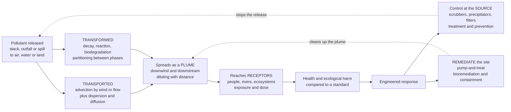

# 🌍 Environmental Engineering and Pollution Control

> [!abstract] TL;DR
> **Environmental engineering** is the environmental arm of civil engineering: the discipline of protecting air, water, and land from the byproducts of industrial society. Its intellectual core is that pollutants **do not vanish when released** — they are **TRANSPORTED** by the bulk motion of wind and water (*advection*) and spread out and dilute (*dispersion*), while being **TRANSFORMED** by chemistry and biology (*decay, reaction, biodegradation, partitioning between phases*). So environmental engineers do two coupled things: **predict** where a pollutant goes using **fate-and-transport** models (a mass balance, a Gaussian smokestack plume, a contaminant plume creeping through groundwater, a dissolved-oxygen sag in a river), and **engineer systems** to stop it at the source (scrubbers, electrostatic precipitators, baghouses, catalytic converters, wastewater treatment) or clean it up after the fact (pump-and-treat, bioremediation, sanitary landfills). The field has been shifting for decades from *end-of-pipe control* toward *pollution prevention*, green engineering, and the circular economy — because the old faith that "the solution to pollution is dilution" turned out to be a lie on a crowded, finite planet.

---

## Intuition

**Analogy:** For most of human history the answer to waste was simple: *"the solution to pollution is dilution."* Throw it in a big enough river or a tall enough smokestack and it disappears — the world is vast, the sky is endless, the sea will swallow anything. Environmental engineering is what we do now that we have learned this is a lie. The river and the sky are **finite**, and pollutants **accumulate**: the smoke that "disappeared" comes back as smog you breathe two towns over, the solvent poured on the ground reappears years later in a drinking-water well a kilometre away. The deep insight is that **once you release something, it does not go away — it goes somewhere**, and where it goes is *predictable*. Bulk flow (wind, current) **carries** it, turbulence **spreads and dilutes** it, and chemistry and biology slowly **transform** it, so it travels downwind and downstream as a **plume** whose shape you can calculate.

That single realization defines the whole discipline. If pollution obeyed no rules you could only pray; because it obeys the physics of transport and the chemistry of reaction, you can do two engineering things instead. First, **predict** — write down where the pollutant goes (the math of a smokestack plume, or a contaminant creeping through an aquifer) so you know who is exposed and how much. Second, **intervene** — design the technology that stops the release at the source, or the system that cleans up what already escaped. Environmental engineering is, in one line, the discipline of keeping air, water, and land livable when there is no longer any "away" to throw things to.

---

## How It Works

### Core Mechanics

1. **Nothing is destroyed — the mass balance is king.** Every environmental analysis starts from conservation of mass over a defined *control volume* (a lake, a river reach, an air basin, a reactor): **accumulation = in − out + generation − decay**. Pollution does not disappear; it moves across a boundary or transforms into something else, and both are on the ledger.

2. **Fate and transport — the three verbs.** Once released, a pollutant is governed by three processes. **Advection** — it is carried bodily by the bulk flow of the medium (the wind, the river current, the groundwater seepage). **Dispersion / diffusion** — turbulence and molecular motion spread it out, smearing a sharp release into an ever-widening, ever-more-dilute cloud. **Transformation** — chemical reaction, photolysis, biodegradation, radioactive decay, and *partitioning* between phases (a chemical splitting between water, air, soil, and living tissue) change how much and what form remains.

3. **The plume.** Put advection and dispersion together and a continuous release becomes a **plume**: a plume of smoke bending downwind from a stack, or a plume of contamination stretching downgradient from a leaking tank. Concentration is highest near the source and falls with distance as the same mass spreads over an ever-larger volume — the honest, quantified version of "dilution."

4. **Air-quality engineering.** The major pollutants are **particulate matter (PM)**, **sulfur oxides (SOx)**, **nitrogen oxides (NOx)**, **volatile organic compounds (VOCs)**, **carbon monoxide (CO)**, and secondary **ozone / photochemical smog**. Their downwind ground-level concentration is predicted with the **Gaussian plume model**, and controlled at the source by **scrubbers** (gas absorption of SOx), **electrostatic precipitators** and **baghouses/fabric filters** (PM capture), **catalytic converters** (CO/VOC/NOx on vehicles), and **selective catalytic reduction (SCR)** for NOx — all measured against **air-quality standards**.

5. **Water-quality and solid-waste engineering.** Organic pollution in a river is tracked by the **Streeter-Phelps dissolved-oxygen sag** (bacteria consuming the waste rob the water of oxygen, which slowly recovers by reaeration); nutrient over-enrichment causes **eutrophication**. Sources are classed **point** (a pipe you can find) versus **nonpoint** (diffuse runoff). Solids go to engineered **sanitary landfills** (liners plus leachate and gas collection), recycling, or incineration, and contaminated sites are cleaned by **remediation** (pump-and-treat, bioremediation).

6. **Cross-cutting: risk, life cycle, and prevention.** **Risk assessment** ties concentration to harm through *exposure* and *dose-response*. **Life-cycle assessment (LCA)** and **environmental regulations** (Clean Air/Water Acts, NEPA-style environmental impact assessment) shape decisions. The field's trajectory is from *control* to **prevention** — green engineering and the circular economy that avoid the pollutant instead of catching it.

### Flow / Architecture



---

## Key Concepts

### Secondary Level

- **Pollution does not disappear — it goes somewhere.** The old idea that a tall smokestack or a big river makes waste "go away" is false. What you release gets **carried** by wind and water and **spread out** into a cloud, and it can come back to harm people far downwind or downstream.
- **The plume.** Smoke from a chimney does not rise and vanish; it bends over in the wind and stretches into a long, widening streak — a **plume**. Contamination in the ground does the same, creeping slowly away from a leak. Near the source it is concentrated; far away it is dilute, but it is still there.
- **Air, water, and land.** Environmental engineers protect all three: cleaning smokestack gas and car exhaust (**air**), treating sewage and cleaning up spills (**water**), and safely burying or recycling trash (**land**).
- **Everyday pollutants.** Soot and dust (**particulates**), the sulfur and nitrogen gases that make **acid rain** and **smog**, the fumes from paints and fuels (**VOCs**), and the invisible **carbon monoxide** from burning — each has its own control technology.
- **Two jobs: predict, then prevent.** First, figure out *where* the pollution will go and who it will reach. Second, *stop it* — either catch it at the source (filters and scrubbers) or clean up the mess afterward. The modern goal is to **prevent** it entirely rather than chase it.

### Undergraduate Level

- **The mass-balance / completely-mixed reactor (CSTR).** For a well-mixed lake or basin of volume $V$ with inflow $Q$, inlet concentration $C_{in}$, and first-order decay $k$: $V\,\dfrac{dC}{dt} = Q\,C_{in} - Q\,C - kVC$. The steady state is $C_{ss} = \dfrac{Q\,C_{in}}{Q + kV}$, and the system relaxes toward it with time constant $\tau = \dfrac{V}{Q + kV}$ — the workhorse model for lakes, reactors, and air basins.
- **The advection–dispersion–reaction equation.** In one dimension (a river or an aquifer), $\dfrac{\partial C}{\partial t} = -u\dfrac{\partial C}{\partial x} + D\dfrac{\partial^2 C}{\partial x^2} - kC$: **advection** ($-u\,\partial C/\partial x$) carries the plume, **dispersion** ($D\,\partial^2 C/\partial x^2$) spreads it, and **reaction** ($-kC$) destroys it. This one PDE underlies most contaminant transport.
- **The Gaussian plume model (air).** The steady ground-level concentration downwind of an elevated point source is $C(x,y,z) = \dfrac{Q}{2\pi u\,\sigma_y\sigma_z}\exp\!\left(-\dfrac{y^2}{2\sigma_y^2}\right)\left[\exp\!\left(-\dfrac{(z-H)^2}{2\sigma_z^2}\right)+\exp\!\left(-\dfrac{(z+H)^2}{2\sigma_z^2}\right)\right]$, where $Q$ is emission rate, $u$ wind speed, $H$ effective stack height, and $\sigma_y,\sigma_z$ are dispersion coefficients that grow with distance. It predicts a ground-level maximum some distance downwind, not at the stack.
- **Air-pollution control technologies.** **Cyclones** and **baghouses/fabric filters** and **electrostatic precipitators** capture particulates (ESPs charge particles and collect them on plates); **wet scrubbers** absorb SOx into a liquid; **catalytic converters** oxidize CO and VOCs and reduce NOx on vehicles; **selective catalytic reduction (SCR)** injects ammonia over a catalyst to turn NOx into $N_2$.
- **The Streeter-Phelps oxygen sag (water).** Organic waste in a river feeds bacteria that consume dissolved oxygen (DO). The DO **deficit** $D$ follows $D(t) = \dfrac{k_d L_0}{k_r - k_d}\left(e^{-k_d t} - e^{-k_r t}\right) + D_0\,e^{-k_r t}$, where $k_d$ is deoxygenation rate, $k_r$ reaeration rate, and $L_0$ the ultimate BOD. DO drops to a **critical minimum** downstream, then recovers — the classic sag curve.
- **Eutrophication and nutrients.** Excess **nitrogen and phosphorus** (from fertilizer runoff and sewage) trigger algal blooms; when the algae die and decompose they strip oxygen, killing fish — a nutrient-driven collapse of the same DO balance, tied to the nutrient loops in [[Biogeochemical_Cycles]].
- **Solid and hazardous waste.** Modern **sanitary landfills** are engineered vaults: a low-permeability **liner** (clay plus geomembrane) at the bottom, a **leachate collection** system to catch contaminated water, **landfill-gas (methane) collection**, and a cap on top — a deliberate replacement for the "dump and dilute" open dump.

### Graduate Level

- **Deriving the Gaussian plume.** The plume equation is the analytical solution of the advection–dispersion equation for a continuous point source in a turbulent wind field, assuming the crosswind and vertical spread are Gaussian. $\sigma_y$ and $\sigma_z$ are set by **atmospheric stability** (the **Pasquill-Gifford** classes A–F, from strongly unstable to strongly stable), which is itself governed by the [[Atmospheric_Boundary_Layer]]: an unstable, convective boundary layer disperses vigorously, while a stable nocturnal inversion traps pollutants near the ground. The effective stack height $H = h_s + \Delta h$ adds **plume rise** $\Delta h$ from buoyancy and momentum (Briggs' equations), and an elevated **mixing height** caps vertical spread.
- **Photochemical smog and secondary pollutants.** Ground-level **ozone** is not emitted — it is *formed* when NOx and VOCs react in sunlight, the nonlinear photochemistry treated in [[Atmospheric_Chemistry_and_Stratospheric_Ozone]]. This makes ozone control a systems problem: reducing one precursor can sometimes *raise* ozone, so control strategy depends on the local VOC-to-NOx regime.
- **Contaminant hydrogeology.** In groundwater, transport couples **advection** (seepage velocity $v = \frac{K}{n}\frac{dh}{dl}$ from Darcy's law), **hydrodynamic dispersion** (mechanical mixing plus molecular diffusion), **sorption** (retardation factor $R = 1 + \frac{\rho_b K_d}{n}$ slowing the plume relative to the water), and **biodegradation**. The result is a slow, retarded, dispersing plume — the setting for the aquifer contamination in [[Groundwater_and_Karst]].
- **Quantitative risk assessment.** Concentration becomes harm through four steps: hazard identification, **dose-response assessment**, **exposure assessment**, and risk characterization. The **chronic daily intake** $CDI = \dfrac{C\cdot IR\cdot EF\cdot ED}{BW\cdot AT}$ combines concentration with intake rate, frequency, duration, and body weight. For a **carcinogen**, risk $= CDI \times SF$ (slope factor); for a **non-carcinogen**, the **hazard quotient** $HQ = CDI / RfD$ (reference dose), with $HQ>1$ signalling concern. This is where environmental engineering dovetails with **toxicology**.
- **Remediation and its kinetics.** **Pump-and-treat** extracts and cleans contaminated groundwater but suffers from *tailing* and *rebound* as sorbed and matrix-diffused mass slowly re-releases. **Bioremediation** engineers microbial degradation (adding oxygen, nutrients, or electron acceptors); **in-situ chemical oxidation**, **permeable reactive barriers**, **soil vapor extraction**, and **phytoremediation** are alternatives — chosen by contaminant chemistry, geology, and risk-based cleanup goals.
- **From control to prevention, and environmental justice.** The field's arc runs from *end-of-pipe control* → **pollution prevention** (design out the waste) → **green engineering / circular economy** (products and processes with no waste stream). **Life-cycle assessment** quantifies cradle-to-grave impacts so a "clean" solution does not merely move the burden. Overlaid on all of it is **environmental justice** — the finding that pollution burdens fall disproportionately on the poor and marginalized — and the global commons problems of greenhouse gases (see [[Anthropogenic_Climate_Change]]), ocean acidification, and plastic pollution, where the "receptor" is the whole planet.

---

## Python Demo

```python
# ============================================================================
# POLLUTION FATE & TRANSPORT -- where does a smokestack's pollution go?
#
#   PANEL (a)  THE PLUME:  a steady GAUSSIAN air-dispersion plume from an
#              elevated stack. A continuous source of strength Q is carried
#              downwind by wind speed u and spread by turbulent dispersion
#              (sigma_y, sigma_z grow with distance). We draw the vertical
#              x-z cross-section along the centreline -- the classic image of
#              an elevated plume widening, diluting, and touching the ground.
#
#   PANEL (b)  COMPLIANCE:  the GROUND-LEVEL centreline concentration vs
#              downwind distance, WITH and WITHOUT a first-order decay term,
#              compared against a regulatory limit -- revealing the window
#              where the ground concentration EXCEEDS the standard.
#
# Requires: numpy, matplotlib
import numpy as np
import matplotlib.pyplot as plt

# ---- source & atmosphere -------------------------------------------------
Q     = 80.0      # emission rate                                 [g/s]
u     = 4.0       # mean wind speed                               [m/s]
H     = 80.0      # effective stack height (stack + plume rise)   [m]
k     = 2.0e-4    # first-order decay / reaction rate             [1/s]
limit = 200.0     # regulatory ground-level limit                 [ug/m3]

# Briggs rural dispersion coefficients, neutral stability (Pasquill class D).
def sigma_y(x): return 0.08 * x / np.sqrt(1.0 + 1.0e-4 * x)   # crosswind spread [m]
def sigma_z(x): return 0.06 * x / np.sqrt(1.0 + 1.5e-3 * x)   # vertical spread  [m]

# ---- (a) vertical cross-section of the plume, C(x, y=0, z) ---------------
xs = np.linspace(20.0, 5000.0, 400)      # downwind distance [m]
zs = np.linspace(0.0, 300.0, 240)        # height            [m]
X, Zg = np.meshgrid(xs, zs)
SY, SZ = sigma_y(X), sigma_z(X)
# Gaussian plume with ground reflection, on the y=0 centreline. g/m3 -> ug/m3.
C_xz = (Q / (2 * np.pi * u * SY * SZ)
        * (np.exp(-(Zg - H) ** 2 / (2 * SZ ** 2))
           + np.exp(-(Zg + H) ** 2 / (2 * SZ ** 2)))) * 1e6

# ---- (b) ground-level centreline concentration, C(x, 0, 0) ---------------
sy, sz = sigma_y(xs), sigma_z(xs)
C_ground = (Q / (np.pi * u * sy * sz) * np.exp(-H ** 2 / (2 * sz ** 2))) * 1e6  # no decay
C_decay  = C_ground * np.exp(-k * xs / u)                                       # with decay

# where does the (conservative) ground concentration exceed the limit?
above = xs[C_ground > limit]
x_in, x_out = (above.min(), above.max()) if above.size else (np.nan, np.nan)

print("=== Gaussian plume: ground-level results ===")
print(f"  peak concentration (no decay): {C_ground.max():6.0f} ug/m3 "
      f"at x = {xs[C_ground.argmax()]:.0f} m")
print(f"  regulatory limit             : {limit:6.0f} ug/m3")
if above.size:
    print(f"  standard EXCEEDED between x = {x_in:.0f} m and x = {x_out:.0f} m "
          f"(band ~{x_out - x_in:.0f} m wide)")
print(f"  peak WITH first-order decay  : {C_decay.max():6.0f} ug/m3 "
      f"(k = {k:.1e} /s)")

# ---- plot ----------------------------------------------------------------
fig, (axA, axB) = plt.subplots(1, 2, figsize=(14, 5.5))
fig.suptitle("Pollution Fate & Transport: a Gaussian smokestack plume",
             fontsize=14, fontweight="bold")

# (a) the plume as a filled contour in the x-z plane
lev = np.linspace(0, np.nanpercentile(C_xz, 99.5), 25)
cf = axA.contourf(X, Zg, C_xz, levels=lev, cmap="inferno", extend="max")
axA.plot([0, 0], [0, H], color="k", lw=4)               # the stack
axA.plot(0, H, marker="o", color="cyan", ms=7)          # release point
axA.axhline(0, color="saddlebrown", lw=2)               # ground surface
axA.text(80, H + 8, "release at effective\nstack height H",
         fontsize=8, color="cyan")
axA.set_xlabel("downwind distance  x  [m]")
axA.set_ylabel("height  z  [m]")
axA.set_title("(a) the plume: advection + dispersion\nspreading and diluting with distance")
fig.colorbar(cf, ax=axA, label="concentration  [ug/m3]")

# (b) ground-level concentration vs the standard
axB.plot(xs, C_ground, color="#1f77b4", lw=2.4, label="ground conc. (conservative)")
axB.plot(xs, C_decay,  color="#2ca02c", lw=2.2, ls="--", label="with first-order decay")
axB.axhline(limit, color="crimson", lw=2, label=f"regulatory limit {limit:.0f} ug/m3")
if above.size:
    axB.fill_between(xs, C_ground, limit, where=(C_ground > limit),
                     color="crimson", alpha=0.25)
    axB.axvline(x_in,  color="crimson", ls=":", lw=1)
    axB.axvline(x_out, color="crimson", ls=":", lw=1)
    axB.text((x_in + x_out) / 2, limit * 1.06, "EXCEEDANCE",
             ha="center", va="bottom", fontsize=9, color="crimson", fontweight="bold")
axB.set_xlabel("downwind distance  x  [m]")
axB.set_ylabel("ground-level concentration  [ug/m3]")
axB.set_title("(b) compliance: where ground concentration\nbreaks the standard")
axB.legend(loc="upper right", fontsize=8)
axB.grid(alpha=0.3)

plt.tight_layout(rect=[0, 0, 1, 0.93])
plt.show()
```

Running this prints the numbers and draws the two panels that, together, capture what environmental engineering *does*. **Panel (a)** is the plume itself: a continuous release at the top of the stack is bent downwind and fans out, the color fading from intense near the source to faint far away — the honest, quantified picture of "dilution" as the same mass spreads over an ever-larger volume, eventually reaching the ground. **Panel (b)** is the engineering payoff: the ground-level concentration rises to a **maximum some distance downwind** (not at the stack, because the elevated plume needs distance to reach the ground), and the shaded band shows exactly *where* it breaks the regulatory limit — the zone where people are over-exposed. The dashed curve adds a **first-order decay** term (a reactive pollutant slowly transforming as it travels), which pulls the whole profile down and shrinks the exceedance — the difference between a conservative and a chemically-honest prediction.

---

## Real-World Applications

> **Example — power-plant flue-gas cleaning.** A modern coal or gas plant is an environmental-engineering anthology bolted to a stack. **Electrostatic precipitators** or **baghouses** strip out fly ash (particulates); a **flue-gas desulfurization scrubber** absorbs $SO_2$ into a limestone slurry (the gas-absorption physics of [[Absorption_and_Stripping]]), producing gypsum; **selective catalytic reduction** injects ammonia over a catalyst to convert $NO_x$ to harmless nitrogen; and the tall stack plus **plume rise** are engineered so the **Gaussian-plume** ground-level maximum stays under the air-quality standard. Regulators require exactly this stack of technologies because "dilute it up the chimney" no longer passes.

- **Regulatory dispersion modeling (AERMOD / ISC).** Permitting a new industrial source legally requires running a Gaussian-plume model to prove the predicted ground-level concentration at the fence line and beyond stays below the National Ambient Air Quality Standards — the model in the Python demo is the regulatory workhorse, refined with real meteorology and terrain.
- **Wastewater treatment and river DO.** Treatment plants are sized so the **BOD** they discharge will not drive a river's dissolved oxygen below the level fish need — a direct application of the **Streeter-Phelps** sag curve to set the required removal efficiency, protecting the aquatic ecosystems described in [[Ecosystems_and_Energy_Flow]].
- **Superfund and groundwater remediation.** Contaminated industrial sites (solvents, petroleum, heavy metals) are characterized by mapping the subsurface plume, then cleaned by **pump-and-treat**, **bioremediation**, or **permeable reactive barriers** — with cleanup targets set by **risk assessment** back-calculated from an acceptable dose.
- **Sanitary landfills and landfill gas.** Engineered landfills capture **leachate** (to protect groundwater) and **methane** (a potent greenhouse gas), often burning the gas for energy — turning a "dump" into a controlled bioreactor and a small power plant.
- **Vehicle catalytic converters and activated-carbon capture.** The three-way catalytic converter cut urban CO, VOCs, and NOx by orders of magnitude, while **activated-carbon adsorption** (the sorption physics of [[Adsorption_Drying_and_Crystallization]]) scrubs VOCs from air and micropollutants from water.

---

## Common Pitfalls

- **"Dilution is the solution."** The foundational error the whole field exists to correct: assuming a tall stack or a big river makes pollution disappear. It does not — the mass is conserved, it accumulates in the environment, and it comes back as smog, acid rain, or a contaminated well. Dilution buys distance and time, not disappearance.
- **Confusing advection with dispersion.** Advection moves the *center of mass* of a plume (where it is); dispersion changes its *spread* (how smeared and dilute it is). Getting the wind speed right but the stability class wrong, or vice versa, gives a plume in the right place with wildly wrong peak concentrations. Both must be modeled.
- **Assuming the ground-level maximum is at the source.** For an *elevated* release the highest ground concentration occurs some distance **downwind**, where the plume has spread enough to reach the ground but not yet enough to fully dilute. Sampling only at the stack base badly underestimates exposure.
- **Ignoring atmospheric stability.** The same emission is harmless on a sunny, turbulent afternoon and dangerous under a stable nocturnal inversion that traps it near the ground. Using a single "average" dispersion condition misses the worst-case episodes that standards are meant to prevent.
- **Solving one medium and creating another problem.** A wet scrubber cleans the air but produces a contaminated sludge; incineration reduces solid waste but can emit dioxins; pump-and-treat cleans groundwater but concentrates the contaminant into a waste stream. Without **life-cycle** thinking, pollution control merely relocates the pollutant across air, water, and land.
- **Confusing hazard with risk.** A substance being toxic (*hazard*) does not by itself mean harm; **risk = hazard × exposure**. A potent toxin locked away where no one contacts it poses little risk, while a mild one in everyone's drinking water can pose a large one. Regulating on hazard alone misallocates effort.
- **Treating the plume as static.** Real plumes evolve — reacting, decaying, sorbing, partitioning between phases. Modeling a reactive or biodegradable pollutant as conservative overstates the far-field impact; modeling a persistent one (heavy metals, PFAS) as if it decays dangerously understates it.

---

## Related Concepts

Cross-vault connections (Glob-verified to exist):

- [[Absorption_and_Stripping]] — the gas-absorption unit operation behind **wet scrubbers** for $SO_2$ and acid-gas removal from flue gas.
- [[Adsorption_Drying_and_Crystallization]] — **activated-carbon adsorption** for capturing VOCs from air and trace organics from water, a core control and treatment technology.
- [[Atmospheric_Boundary_Layer]] — the turbulent surface layer whose **stability** sets the dispersion coefficients and mixing height that govern how a plume spreads.
- [[Atmospheric_Chemistry_and_Stratospheric_Ozone]] — the photochemistry that turns NOx and VOCs into **ground-level ozone and smog**, the secondary-pollutant side of air quality.
- [[Anthropogenic_Climate_Change]] — greenhouse gases as the ultimate global "pollutant," where the receptor is the whole planet and pollution control becomes decarbonization.
- [[Biogeochemical_Cycles]] — the nitrogen and phosphorus cycles whose human over-loading drives **eutrophication** of lakes and coastal waters.
- [[Ecosystems_and_Energy_Flow]] — the aquatic and terrestrial ecosystems that pollution damages, and whose dissolved-oxygen and food-web dynamics set water-quality targets.
- [[Groundwater_and_Karst]] — the subsurface flow system through which **contaminant plumes** migrate and where remediation must operate.

*Within the Civil Engineering vault (Water & Environmental pillar siblings):* this note is the **fate-and-transport and pollution-control** anchor that sits alongside **Wastewater_and_Water_Treatment** (the treatment-plant unit processes that remove BOD, nutrients, and pathogens), **Water_Supply_and_Distribution** (delivering safe drinking water), **Hydrology_and_the_Water_Cycle** (the rainfall-runoff and streamflow that carry nonpoint pollution), **Coastal_and_Flood_Engineering** (protecting and managing the water bodies that receive discharges), and **Sustainable_and_Smart_Infrastructure** (the pollution-prevention, green-engineering, and circular-economy frontier this field is moving toward).

---

## Review Questions

**Secondary**
1. People used to say "the solution to pollution is dilution" — build a tall smokestack or use a big river and the waste goes away. Explain, using the ideas of a **plume** and pollution **not disappearing**, why this turned out to be wrong. Where does the smoke actually go, and why might someone kilometres away still be affected?

**Undergraduate**
2. A factory emits $SO_2$ from a stack of effective height $H$ into a wind of speed $u$. (a) Sketch how the **ground-level** concentration varies with downwind distance and explain why the maximum is *not* at the stack. (b) Using the Gaussian-plume form $C \propto \dfrac{Q}{u\,\sigma_y\sigma_z}$, describe what happens to the peak concentration if the wind speed doubles, and separately if the day becomes more atmospherically **unstable** (larger $\sigma_y,\sigma_z$). (c) A downstream sewage discharge instead threatens a river's oxygen — write the role of $k_d$ and $k_r$ in the **Streeter-Phelps** sag and explain what sets the critical (lowest-DO) point.

**Graduate**
3. A leaking underground tank has created a groundwater plume of a chlorinated solvent that is toxic at low concentrations. (a) Write the **advection-dispersion-reaction** processes acting on the plume and explain how the **retardation factor** $R$ and biodegradation rate $k$ change its arrival time and peak at a downgradient drinking-water well. (b) Set up a **risk-based** cleanup target: relate an acceptable lifetime cancer risk to a maximum well concentration via the **chronic daily intake** and **slope factor**. (c) Compare **pump-and-treat** with **bioremediation** for this site, addressing tailing/rebound, and argue where **pollution prevention** and **life-cycle assessment** would have changed the outcome before any cleanup was needed.

---

## Sources

- Davis, M. L. & Cornwell, D. A. — *Introduction to Environmental Engineering*, 5th ed. (McGraw-Hill, 2012) — the standard introductory text on air, water, and solid-waste engineering.
- Masters, G. M. & Ela, W. P. — *Introduction to Environmental Engineering and Science*, 3rd ed. (Pearson, 2008) — clear treatment of mass balances, dispersion, and risk.
- Nazaroff, W. W. & Alvarez-Cohen, L. — *Environmental Engineering Science* (Wiley, 2001) — rigorous fate-and-transport and reactor fundamentals.
- Mihelcic, J. R. & Zimmerman, J. B. — *Environmental Engineering: Fundamentals, Sustainability, Design*, 2nd ed. (Wiley, 2014) — modern emphasis on sustainability, LCA, and green design.
- U.S. EPA — *AERMOD* and *ISC* dispersion modeling and NAAQS technical documentation (epa.gov) — the regulatory implementation of the Gaussian plume model.

---

#civil-engineering #environmental-engineering #pollution-control #fate-and-transport #air-quality
