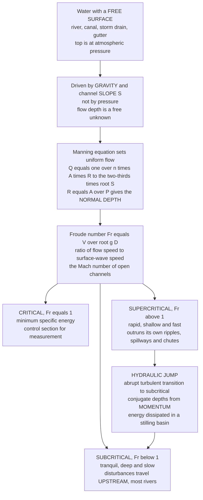

# 🌊 Hydraulics and Open-Channel Flow

> [!abstract] TL;DR
> **Open-channel hydraulics** is the physics of water flowing with a **free surface** open to the air — rivers, canals, storm drains, gutters, and the great hydraulic structures that tame them. Unlike **pipe flow**, which fills its conduit completely and is pushed by **pressure**, open-channel flow is driven by **gravity and the channel slope**, and the flow **depth is itself an unknown** that adjusts until the water finds its level. For steady **uniform flow**, the empirical **Manning equation** $Q = \tfrac{1}{n}\,A\,R^{2/3}\,S^{1/2}$ ties discharge to slope $S$, roughness $n$, and the **hydraulic radius** $R = A/P$ (area over wetted perimeter — the efficiency of the cross-section), fixing the **normal depth**. The signature parameter is the **Froude number** $Fr = V/\sqrt{gD}$ — the water-wave analogue of the Mach number — which sorts flow into **subcritical** ($Fr<1$, tranquil and deep, disturbances ripple upstream — most rivers), **supercritical** ($Fr>1$, rapid and shallow, outrunning its own ripples — spillways and chutes), and **critical** ($Fr=1$, minimum **specific energy** $E = y + V^2/2g$, the control section). The spectacular link between them is the **hydraulic jump** — a churning standing wall of turbulence where supercritical flow abruptly piles up into subcritical flow, conserving momentum while **dissipating energy** (used to protect dams below spillways). Add **gradually varied flow** (backwater profiles) and **hydraulic structures** (weirs, flumes, culverts, gates) and you have the foundation of storm drainage, irrigation, river engineering, sewers, and flood conveyance.

## Intuition

**Analogy:** Turn on your kitchen tap and watch where the jet hits the sink. Right under the stream the water spreads out in a thin, fast, glassy sheet — so fast it outruns any ripple you could make in it. Then, a few centimetres out, it suddenly leaps up into a churning circular wall and slows to a deep, calm pool that drifts to the drain. You have just made a **hydraulic jump**: the thin fast sheet is **supercritical** flow, the calm outer pool is **subcritical** flow, and the ring where one becomes the other is the same violent transition that engineers build deliberately below dam spillways to burn off dangerous energy.

Now compare a garden hose to a roadside gutter. Water in a **pipe** fills it completely and is shoved along by **pressure** — squeeze harder and more comes out. Water in a **gutter, river, or storm drain** has a **free surface** open to the air at atmospheric pressure, so pressure can no longer push it; instead **gravity and the slope of the ground** run the show, and the water is free to choose **how deep** to run. That extra freedom — an unknown depth adjusting to slope, roughness, and flow rate — is exactly what makes open-channel flow its own science, and the number that governs whether it runs tranquil-and-deep or fast-and-shallow is the **Froude number**, the water-wave cousin of the Mach number.

---

## How It Works

### Core Mechanics

1. **Free surface changes everything.** In pipe flow the cross-section is fixed and the pressure gradient drives the flow. In open-channel flow the top of the water is **atmospheric**, so the driving force is the **streamwise component of gravity** set by the bed **slope** $S$. Because the water can rise or fall, the **flow depth $y$ becomes a dependent variable** that the flow itself sets — the central difficulty and beauty of the subject.

2. **Uniform flow and Manning's equation.** When slope, roughness, and cross-section are constant, the flow reaches an equilibrium where the gravity pull exactly balances the boundary friction — **uniform flow** at a constant **normal depth $y_n$**. The workhorse empirical law is **Manning's equation** (SI form): $V = \tfrac{1}{n} R^{2/3} S^{1/2}$ and $Q = VA = \tfrac{1}{n} A R^{2/3} S^{1/2}$, where $n$ is the **Manning roughness** (0.011 for smooth concrete, 0.035 for a weedy natural stream) and $R = A/P$ is the **hydraulic radius** — flow area divided by **wetted perimeter**, a measure of how efficiently the section carries water for a given contact friction.

3. **The Froude number sorts the flow.** Define $Fr = V/\sqrt{gD}$, where $D = A/T$ is the **hydraulic depth** (area over top width). The denominator $\sqrt{gD}$ is the **speed of a small surface (gravity) wave**. So $Fr$ compares how fast the water moves to how fast its own disturbances travel — precisely the role the Mach number plays for sound in a compressible gas.

4. **Three flow states.** **Subcritical** ($Fr<1$): the water is slower than its waves, so a disturbance (a bridge pier, a weir) can send ripples **upstream** — control comes from downstream; most rivers and canals live here. **Supercritical** ($Fr>1$): the water outruns its own ripples, nothing can signal upstream, and control comes from upstream — spillways and steep chutes. **Critical** ($Fr=1$): the razor's edge between them, where **specific energy is minimum** for a given discharge — the basis of flow-measuring control sections.

5. **Specific energy and critical depth.** The **specific energy** $E = y + V^2/2g = y + Q^2/(2gA^2)$ is the energy head measured from the channel bed. Plot $E$ against depth $y$ at fixed $Q$ and you get the **specific-energy curve**: a subcritical branch (deep, slow) and a supercritical branch (shallow, fast) meeting at a single minimum — the **critical depth $y_c$**. For a rectangular channel $y_c = (q^2/g)^{1/3}$ with $q = Q/b$, and $E_{min} = \tfrac{3}{2}y_c$.

6. **The hydraulic jump.** When fast supercritical flow is forced to slow (hitting a pool, a mild reach, or a stilling basin), it cannot decelerate smoothly — it **jumps**, abruptly rising from a shallow depth $y_1$ to a deeper **conjugate (sequent) depth $y_2$** in a turbulent roller. Because the jump is violently dissipative, you cannot use energy to relate the depths — you use **momentum**: $\tfrac{y_2}{y_1} = \tfrac{1}{2}\big(\sqrt{1+8Fr_1^2}-1\big)$. The energy **destroyed** in the roller is $\Delta E = \tfrac{(y_2-y_1)^3}{4\,y_1 y_2}$ — energy engineers *want* gone so it does not scour the riverbed below a dam.

7. **Gradually varied flow and structures.** Away from uniform reaches, the water surface bends into **backwater/drawdown profiles** (M1, M2, S1 curves) governed by the gradually varied flow equation $\tfrac{dy}{dx} = \tfrac{S_0 - S_f}{1 - Fr^2}$. Superimposed on all of this are **hydraulic structures** — **weirs and flumes** (measure flow from a depth reading), **spillways and stilling basins** (pass and dissipate floods), **culverts and gates** — the built hardware of water management.

### Flow / Architecture



---

## Key Concepts

### Secondary Level

- **Water in a pipe versus water in a ditch.** A full pipe is pushed along by **pressure**; water in a river, canal, or roadside drain has an **open top** exposed to the air, so it is pulled downhill by **gravity and slope** and is free to choose how deep to run.
- **Deep-and-slow versus shallow-and-fast.** The same amount of water can flow along **deep and calm** (like a lowland river) or **thin and racing** (like water down a steep spillway). Which one you get depends on the slope and the channel.
- **The kitchen-sink jump.** Where the tap stream hits the sink it spreads into a fast thin sheet, then suddenly leaps up into a churning ring and calms down. That leap is a **hydraulic jump** — nature's way of throwing away extra energy — and engineers build big ones below dams on purpose.
- **Rough channels are slow.** A concrete channel is smooth and carries water fast; a channel choked with weeds and rocks is **rough** and slows the water down. The **Manning roughness** number puts a value on that.

### Undergraduate Level

- **Manning's equation.** For steady uniform flow (SI units), $V = \tfrac{1}{n} R^{2/3} S^{1/2}$ and $Q = \tfrac{1}{n} A R^{2/3} S^{1/2}$, with $R = A/P$ the **hydraulic radius**. Solving $Q = Q(y_n)$ for the depth gives the **normal depth $y_n$** — the depth at which gravity and friction balance. (US customary units carry an extra factor 1.49.)
- **Hydraulic radius and the best hydraulic section.** $R = A/P$ rewards cross-sections that carry a lot of area with little wetted contact; for a given area the **semicircle** (and among practical shapes, the half-hexagon trapezoid or a square-ish rectangle) maximizes $R$ and hence discharge — the **best hydraulic section**.
- **Froude number and flow states.** $Fr = V/\sqrt{gD}$, $D = A/T$. $Fr<1$ **subcritical** (downstream control, mild slope), $Fr>1$ **supercritical** (upstream control, steep slope), $Fr=1$ **critical**. Waves travel at celerity $c = \sqrt{gD}$; subcritical flow lets them go upstream, supercritical flow sweeps them all downstream.
- **Specific energy.** $E = y + \dfrac{Q^2}{2gA^2}$. At fixed $Q$ the $E$–$y$ curve has two depths (an **alternate pair**) for every $E$ above $E_{min}$, meeting at the **critical depth**. Rectangular channel: $y_c = (q^2/g)^{1/3}$, $E_{min} = \tfrac{3}{2}y_c$, and at critical flow $V_c = \sqrt{g y_c}$.
- **Hydraulic jump from momentum.** Across the jump momentum is conserved but energy is not, giving the **conjugate-depth** relation $\dfrac{y_2}{y_1} = \tfrac{1}{2}\big(\sqrt{1+8Fr_1^2}-1\big)$ and head loss $\Delta E = \dfrac{(y_2-y_1)^3}{4 y_1 y_2}$. Jumps are classified by $Fr_1$ (undular, weak, oscillating, steady, strong).

### Graduate Level

- **Gradually varied flow (GVF).** The water-surface profile obeys $\dfrac{dy}{dx} = \dfrac{S_0 - S_f}{1 - Fr^2}$, where $S_0$ is the bed slope and $S_f$ the friction slope (from Manning). Classifying by whether $y_n \gtrless y_c$ (Mild, Steep, Critical, Horizontal, Adverse) and where $y$ falls relative to them yields the standard **M1/M2/M3, S1/S2/S3 …** backwater and drawdown profiles, integrated by the **standard-step** or **direct-step** method. Note $dy/dx \to \infty$ as $Fr \to 1$ — the profile passes through critical **vertically**, why real transitions are so abrupt.
- **Rapidly varied flow and control sections.** At a **control** the depth–discharge relation is single-valued (critical flow), which is why **broad-crested weirs, Parshall flumes, and free overfalls** make good flow meters: measure one depth, infer $Q$. The jump is the archetypal rapidly varied flow — 1-D theory gives the conjugate depths, but length and energy loss need empirical/experimental input.
- **Momentum function and specific force.** Define $M = \dfrac{Q^2}{gA} + \bar{z}A$ (**specific force**). The jump conserves $M$ (conjugate depths share the same $M$) while $E$ drops; plotting $M$–$y$ alongside $E$–$y$ makes the jump's "same force, less energy" nature explicit and generalizes to non-rectangular sections.
- **Unsteady flow — the Saint-Venant equations.** Flood routing and dam-break waves need the full 1-D **shallow-water (Saint-Venant) equations** — depth-averaged continuity plus momentum — a hyperbolic system whose characteristics carry the **surface-wave** information and whose shocks are moving hydraulic jumps (**bores**). This is where open-channel hydraulics meets the [[Surface_and_Internal_Waves]] and shallow-water theory of the fluid-dynamics vault.
- **Sediment transport and regime.** Real channels have **mobile beds**: shear stress $\tau_0 = \gamma R S_f$ competes with grain resistance (Shields parameter) to entrain sediment, forming ripples and dunes that themselves change $n$. Stable **regime/threshold** channel design balances conveyance against erosion and deposition — the frontier where hydraulics meets geomorphology.

---

## Python Demo

```python
# ============================================================================
# OPEN-CHANNEL HYDRAULICS in one figure -- the two pillars of the subject.
#
#   LEFT  panel -> NORMAL DEPTH via MANNING: for a rectangular channel, the
#                  Manning equation Q = (1/n) A R^(2/3) S^(1/2) gives discharge
#                  as a function of depth. We invert it to find the NORMAL DEPTH
#                  for a design flow, then compute the FROUDE number there and
#                  classify the flow as subcritical or supercritical.
#
#   RIGHT panel -> SPECIFIC ENERGY & HYDRAULIC JUMP: at a fixed discharge, the
#                  specific-energy curve E(y) = y + q^2/(2 g y^2) has a minimum
#                  at the CRITICAL DEPTH (subcritical branch above, supercritical
#                  below). We overlay a HYDRAULIC JUMP -- a supercritical depth y1
#                  jumping to its momentum-conjugate depth y2 -- and mark the
#                  ENERGY DISSIPATED in the turbulent roller.
#
# Requires: numpy, matplotlib
import numpy as np
import matplotlib.pyplot as plt

g = 9.81  # gravitational acceleration [m/s^2]

# ============================================================================
# (a) NORMAL DEPTH from the MANNING equation (rectangular channel)
# ============================================================================
b     = 3.0     # channel bottom width          [m]
n     = 0.015   # Manning roughness (concrete)   [-]
S     = 0.001   # bed slope (0.1 percent)        [-]
Q_des = 5.0     # design discharge               [m^3/s]

def manning_Q(y):
    """Discharge for a rectangular channel at depth y via Manning (SI)."""
    A = b * y                 # flow area
    P = b + 2.0 * y           # wetted perimeter
    R = A / P                 # hydraulic radius
    return (1.0 / n) * A * R**(2.0/3.0) * S**0.5

y  = np.linspace(0.02, 2.5, 500)
Q  = manning_Q(y)

# Q(y) is monotonic increasing -> invert by interpolation for the normal depth
y_n = float(np.interp(Q_des, Q, y))
A_n = b * y_n
V_n = Q_des / A_n
Fr_n = V_n / np.sqrt(g * y_n)                 # rectangular: hydraulic depth D = y
state = "SUBCRITICAL (Fr<1)" if Fr_n < 1 else "SUPERCRITICAL (Fr>1)"

# ============================================================================
# (b) SPECIFIC ENERGY curve + HYDRAULIC JUMP (fixed unit discharge q)
# ============================================================================
q   = Q_des / b                                # discharge per unit width [m^2/s]
y_c = (q**2 / g)**(1.0/3.0)                     # critical depth (rectangular)
E_min = 1.5 * y_c                               # minimum specific energy

yy = np.linspace(0.05, 1.8, 500)
E  = yy + q**2 / (2.0 * g * yy**2)              # specific energy E(y)

# a hydraulic jump: pick a supercritical upstream depth y1 < y_c
y1  = 0.30
V1  = q / y1
Fr1 = V1 / np.sqrt(g * y1)
y2  = 0.5 * y1 * (np.sqrt(1.0 + 8.0 * Fr1**2) - 1.0)   # conjugate depth (momentum)
E1  = y1 + q**2 / (2.0 * g * y1**2)
E2  = y2 + q**2 / (2.0 * g * y2**2)
dE  = (y2 - y1)**3 / (4.0 * y1 * y2)                   # energy dissipated
Fr2 = (q / y2) / np.sqrt(g * y2)

print("=== (a) Manning normal depth & Froude classification ===")
print(f"  channel: b={b} m, n={n}, S={S}, design Q={Q_des} m^3/s")
print(f"  normal depth y_n : {y_n:6.3f} m")
print(f"  velocity     V   : {V_n:6.3f} m/s")
print(f"  Froude number Fr : {Fr_n:6.3f}  -> {state}")
print("=== (b) Specific energy & hydraulic jump (q = %.3f m^2/s) ===" % q)
print(f"  critical depth y_c   : {y_c:6.3f} m   (E_min = {E_min:.3f} m)")
print(f"  upstream (super) y1  : {y1:6.3f} m   Fr1 = {Fr1:.2f}")
print(f"  conjugate  (sub) y2  : {y2:6.3f} m   Fr2 = {Fr2:.2f}")
print(f"  energy dissipated dE : {dE:6.3f} m   (E1={E1:.3f} -> E2={E2:.3f})")

# ------------------------------- plotting --------------------------------
fig, (axL, axR) = plt.subplots(1, 2, figsize=(14, 6))
fig.suptitle("Open-Channel Hydraulics: Manning Normal Depth  &  Specific Energy / Hydraulic Jump",
             fontsize=14, fontweight="bold")

# LEFT: depth vs discharge (Manning) with the normal depth for the design flow
axL.plot(Q, y, color="#1f77b4", lw=2.4, label="Manning  Q(y)")
axL.axvline(Q_des, color="#7f7f7f", ls=":", lw=1.2)
axL.axhline(y_n,   color="#7f7f7f", ls=":", lw=1.2)
axL.plot([Q_des], [y_n], "o", color="#d62728", ms=9,
         label=f"normal depth  y_n = {y_n:.2f} m")
axL.annotate(f"Fr = {Fr_n:.2f}\n{state}",
             xy=(Q_des, y_n), xytext=(Q_des*0.30, y_n*1.28),
             fontsize=9, fontweight="bold",
             arrowprops=dict(arrowstyle="->", color="#d62728"),
             bbox=dict(boxstyle="round", fc="#fff7e6", ec="gray"))
axL.set_xlabel("discharge  Q  [m$^3$/s]")
axL.set_ylabel("flow depth  y  [m]")
axL.set_title("(a) NORMAL DEPTH via Manning  ->  Froude classification", fontsize=11)
axL.legend(loc="lower right", fontsize=9)
axL.grid(alpha=0.3)

# RIGHT: specific-energy curve with critical depth + the hydraulic jump
axR.plot(E, yy, color="#2ca02c", lw=2.4, label="specific energy  E(y)")
axR.plot([0, E.max()], [0, E.max()], color="#bbbbbb", ls="--", lw=1,
         label="E = y  (asymptote)")
axR.axhline(y_c, color="#ff7f0e", ls=":", lw=1.4)
axR.plot([E_min], [y_c], "s", color="#ff7f0e", ms=9,
         label=f"critical depth  y_c = {y_c:.2f} m")
axR.text(E.max()*0.72, y_c*1.25, "subcritical branch\n(deep, slow, Fr<1)",
         fontsize=8, color="#555555")
axR.text(E.max()*0.72, y_c*0.45, "supercritical branch\n(shallow, fast, Fr>1)",
         fontsize=8, color="#555555")

# hydraulic jump: y1 -> y2, drawn as points + energy-loss arrow
axR.plot([E1], [y1], "v", color="#d62728", ms=10, label=f"upstream y1={y1:.2f} m (Fr1={Fr1:.1f})")
axR.plot([E2], [y2], "^", color="#9467bd", ms=10, label=f"conjugate y2={y2:.2f} m")
axR.annotate("", xy=(E2, (y1+y2)/2), xytext=(E1, (y1+y2)/2),
             arrowprops=dict(arrowstyle="->", color="k", lw=1.6))
axR.text((E1+E2)/2, (y1+y2)/2 + 0.06,
         f"HYDRAULIC JUMP\nenergy lost dE = {dE:.2f} m",
         ha="center", fontsize=8.5, fontweight="bold", color="k")
axR.set_xlim(0, E.max()*1.05)
axR.set_ylim(0, 1.8)
axR.set_xlabel("specific energy  E = y + q$^2$/(2 g y$^2$)  [m]")
axR.set_ylabel("flow depth  y  [m]")
axR.set_title("(b) SPECIFIC ENERGY curve & HYDRAULIC JUMP", fontsize=11)
axR.legend(loc="lower right", fontsize=8)
axR.grid(alpha=0.3)

plt.tight_layout(rect=[0, 0, 1, 0.93])
plt.show()
```

Running this prints the numbers and draws the two panels that capture open-channel hydraulics end to end. The **left panel** is the **Manning depth–discharge curve**: for a 3 m concrete channel on a 0.1 % slope, the design flow of 5 m³/s settles at a **normal depth** near 1.05 m, and the **Froude number** there (~0.49) classifies it as **subcritical** — tranquil, downstream-controlled flow. The **right panel** is the **specific-energy curve** at that discharge: a J-shaped curve with a **minimum at the critical depth** ($y_c \approx 0.66$ m), a **subcritical branch** above and a **supercritical branch** below. Overlaid is a **hydraulic jump** — a fast, shallow supercritical depth ($y_1 = 0.30$ m, $Fr_1 \approx 3.2$) leaping to its momentum-**conjugate** subcritical depth ($y_2 \approx 1.23$ m) while **dissipating** about 0.55 m of head in the turbulent roller. Together the panels show the two questions every channel design answers: *how deep does the water run?* (Manning) and *what happens when fast flow must slow down?* (the jump).

---

## Real-World Applications

> **Example:** The **stilling basin below a large dam spillway** is open-channel hydraulics made concrete. Water accelerates down the spillway face into a thin, ferociously fast **supercritical** sheet — easily $Fr = 8$–$10$ at the toe — carrying enough energy to gouge a crater in the riverbed and undermine the dam itself. Rather than let that happen, engineers build a **stilling basin** sized so that a **hydraulic jump** forms inside it: the flow abruptly rises to its **conjugate depth** and the excess energy is destroyed as turbulence and heat instead of scour. The **USBR stilling-basin designs (Types I–IV)** are literally tabulated by the incoming **Froude number**, with baffle blocks and end sills tuned to pin the jump in place. The same conjugate-depth and energy-loss equations in the demo above set the basin length and floor elevation.

- **Storm and urban drainage.** Sizing gutters, inlets, storm sewers, and open drainage channels to carry a **design storm** flow without surcharging or flooding — Manning's equation sets the required slope and cross-section, and Froude checks guard against erosive supercritical velocities.
- **Irrigation canals and water conveyance.** Long earthen and lined canals are designed near the **best hydraulic section** for efficiency and at **subcritical** velocities that neither silt up nor erode — classic uniform-flow, normal-depth design.
- **River engineering and flood conveyance.** **Backwater (gradually varied flow) profiles** predict how far upstream a bridge, weir, or channel constriction raises the water surface — the core computation behind floodplain mapping and levee height (e.g. the HEC-RAS standard-step method).
- **Flow measurement structures.** **Weirs, Parshall flumes, and broad-crested control sections** force **critical flow**, giving a single-valued depth–discharge relation so a single staff-gauge reading yields the discharge.
- **Culverts and road crossings.** Culvert hydraulics hinges on whether flow is **inlet-controlled** (supercritical, set at the entrance) or **outlet-controlled** (subcritical, set by tailwater) — the Froude regime dictates the design method.
- **Sewers and sanitary systems.** Gravity sewers are open-channel flows even inside closed pipes (partly full); self-cleansing design keeps velocities high enough to move solids without going erosively supercritical.

---

## Common Pitfalls

- **Treating open-channel flow like pipe flow.** The fatal conceptual error: assuming pressure drives the flow and the cross-section is fixed. In a free-surface channel the driver is **gravity on the slope** and the **depth is an unknown** that adjusts — apply pipe-flow (Darcy–Weisbach with a fixed area) thinking and the whole analysis is wrong.
- **Forgetting the units baked into Manning's $n$.** Manning's equation is **empirical and dimensional**. The **SI form has no leading constant**; the **US customary form carries a factor 1.49**. Using an $n$ value in the wrong unit system (or mixing feet and metres) silently corrupts every discharge by ~50 %.
- **Confusing hydraulic radius with hydraulic depth.** $R = A/P$ (area over **wetted perimeter**) goes into **Manning**; $D = A/T$ (area over **top width**) goes into the **Froude number**. They are equal only for a very wide channel. Swapping them misclassifies the flow state.
- **Applying energy across a hydraulic jump.** A jump is **strongly dissipative**, so Bernoulli/specific-energy conservation does **not** hold across it — you must use the **momentum** (specific-force) equation to get the conjugate depths. Trying to conserve energy through the roller gives the wrong downstream depth.
- **Assuming there is one depth for a given energy.** For any specific energy above the minimum there are **two** valid depths — an **alternate pair** (one subcritical, one supercritical). Which one actually occurs is set by the **slope, controls, and upstream/downstream conditions**, not by energy alone.
- **Ignoring the control direction.** Subcritical flow is controlled from **downstream**; supercritical flow from **upstream**. Placing a control (weir, gate, tailwater) on the wrong end — or computing a backwater profile marching in the wrong direction — produces a physically impossible water surface.
- **Design velocity blind spots.** Too **slow** and channels silt up or deposit; too **fast** (especially supercritical) and they scour and erode. Good design brackets velocity between a self-cleansing minimum and a non-erosive maximum, not just "whatever passes the flow."

---

## Related Concepts

**Parent hub (this vault)**
- [[Civil_Engineering_Overview]] — the six-pillar map; this note opens **Pillar 4, Water Resources & Environmental**, whose free-surface hydraulics this note details

**Energy, pipe flow, and the fluid-mechanics foundation (Mechanical Engineering & Fluid Dynamics vaults)**
- [[Bernoulli_and_Energy_in_Flows]] — the energy-head idea specialized here into **specific energy** $E = y + V^2/2g$ and the critical-depth minimum
- [[Internal_and_Pipe_Flow]] — the **pressure-driven, full-conduit** counterpart that open-channel flow is defined against (free surface vs no free surface)
- [[Engineering_Fluid_Mechanics]] — the continuity, momentum, and energy conservation laws that Manning, specific energy, and the jump all specialize
- [[Fluid_Dynamics_Overview]] — the broader map of fluid mechanics from which open-channel hydraulics is the civil/water branch

**Free surfaces and waves (Fluid Dynamics vault)**
- [[Surface_and_Internal_Waves]] — the **gravity-wave celerity** $c=\sqrt{gD}$ behind the Froude number and the shallow-water/Saint-Venant equations that govern flood waves and bores
- [[Multiphase_and_Free_Surface_Flows]] — the interface-tracking, free-surface CFD view (VOF, level-set) that resolves the turbulent air–water surface of a hydraulic jump

*Within this vault (Pillar 4 siblings, forthcoming — referenced here in prose):* **Hydrology_and_the_Water_Cycle** (where the design flood discharge comes from), **Water_Supply_and_Distribution** (the pressurized-network complement), **Coastal_and_Flood_Engineering** (waves, surge, and flood defense downstream of channels), **Wastewater_and_Water_Treatment**, and **Environmental_Engineering_and_Pollution_Control** (water quality carried by these flows).

---

## Review Questions

**Secondary**
1. A garden hose and a roadside storm drain both carry water, but only one has a **free surface**. Explain in plain words what "free surface" means, and why it means the storm drain is driven by **gravity and slope** rather than pressure. Then describe what you see at the bottom of a kitchen sink under a running tap, and name the sudden ring of churning water.

**Undergraduate**
2. A rectangular concrete channel ($b = 3$ m, $n = 0.015$) on a slope $S = 0.001$ must carry $Q = 5$ m³/s. Outline how you would use **Manning's equation** to find the **normal depth**, then how you would compute the **Froude number** to decide whether the flow is subcritical or supercritical. Separately, sketch the **specific-energy curve** at this discharge and mark the **critical depth** — explain why two different depths can carry the same flow at the same specific energy.

**Graduate**
3. Supercritical flow at the toe of a spillway ($y_1 = 0.30$ m, $Fr_1 \approx 3.2$, unit discharge $q = 1.67$ m²/s) must be slowed before it reaches the natural riverbed. Explain why you must use the **momentum (specific-force)** equation rather than energy to find the **conjugate depth** $y_2$, compute the fraction of energy dissipated in the jump, and describe how this analysis sizes a **stilling basin**. Then discuss how the **gradually varied flow** equation $dy/dx = (S_0 - S_f)/(1-Fr^2)$ behaves as the flow approaches critical ($Fr \to 1$), and what that singularity implies about where controls and transitions occur in a real channel.

---

## Sources

- V. T. Chow — *Open-Channel Hydraulics* (McGraw-Hill, 1959) — the classic reference
- M. H. Chaudhry — *Open-Channel Flow*, 2nd ed. (Springer, 2008)
- B. R. Munson, D. F. Young, T. H. Okiishi & W. W. Huebsch — *Fundamentals of Fluid Mechanics*, 8th ed. (Wiley, 2016)
- J. A. Roberson, J. J. Cassidy & M. H. Chaudhry — *Hydraulic Engineering*, 2nd ed. (Wiley, 1998)
- R. H. French — *Open-Channel Hydraulics* (McGraw-Hill, 1985)

---

#civil-engineering #hydraulics #open-channel-flow #froude-number #mannings-equation
